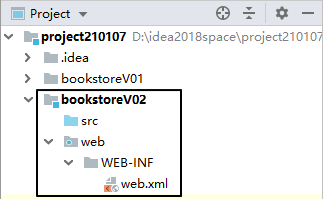
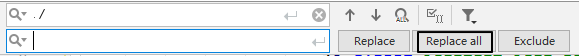
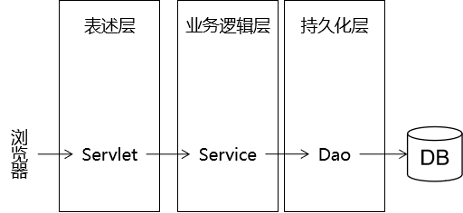
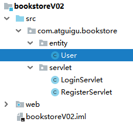
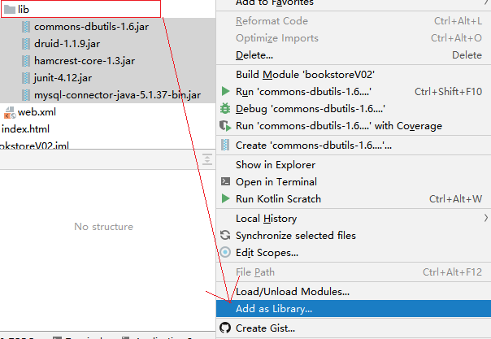
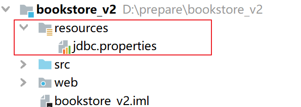

# 第七章 书城项目第二阶段

## 1. 注册登录准备工作

### 1.1 实现步骤

1. 创建动态Web工程
2. 将第一版书城的静态资源拷贝到web文件夹中
3. 统一页面的基础访问路径


### 1.2 内容讲解

#### 1.2.1 创建动态Web工程



#### 1.2.2 拷贝静态资源


#### 1.2.3 在HTML中使用base标签统一页面基础访问路径

##### ①  为什么要使用base标签统一页面基础访问路径

因为在页面中有很多的a标签、表单以及Ajax请求(以后会学)都需要写访问路径，而在访问路径中**项目路径**是一样的，所以如果不统一编写**项目路径**的话，就会发生当项目路径发生改变的时候该页面所有用到项目路径的地方都需要更改的情况

##### ② base标签的语法规则

- base标签要写在head标签内
- base标签必须写在所有其他有路径的标签的前面
- base标签使用href属性设置路径的基准
- base标签生效的机制是：最终的访问地址=base标签href属性设置的基准+具体标签内的路径
- 如果某个路径想要基于base中的路径进行路径编写，那么它不能以`/`开头

##### ③ base标签使用举例

```html
<head>
    <meta charset="UTF-8"/>
    <meta name="viewport" content="width=device-width, initial-scale=1.0"/>
    <title>书城首页</title>
    <base href="/bookstore/"/>
    <link rel="stylesheet" href="static/css/minireset.css"/>
    <link rel="stylesheet" href="static/css/common.css"/>
    <link rel="stylesheet" href="static/css/iconfont.css"/>
    <link rel="stylesheet" href="static/css/index.css"/>
    <link rel="stylesheet" href="static/css/swiper.min.css"/>
</head>
```

##### ④ 基于base标签调整整个页面的路径

在需要进行基础路径统一的页面做如下修改

 base标签的代码

```html
<base href="/bookstore/"/>
```

 对需要统一调整的路径执行替换

调出替换操作窗口，并做如下替换



## 2. 完成带数据库的注册登录

### 2.1 学习目标

* 了解三层架构
* 了解MD5加密
* 完成带数据库的登录校验
* 完成带数据库的注册功能

### 2.2 内容讲解

#### 2.2.1 三层架构

##### ① 为什么要使用三层架构

如果不做三层架构形式的拆分：


所有和当前业务功能需求相关的代码全部耦合在一起，如果其中有任何一个部分出现了问题，牵一发而动全身，导致其他无关代码也要进行相应的修改。这样的话代码会非常难以维护。

所以为了提高开发效率，需要对代码进行模块化的拆分。整个项目模块化、组件化程度越高，越容易管理和维护，出现问题更容易排查。

##### ② 三层架构的划分



- 表述层：又可以称之为控制层，负责处理浏览器请求、返回响应、页面调度
- 业务逻辑层：负责处理业务逻辑，根据业务逻辑把持久化层从数据库查询出来的数据进行运算、组装，封装好后返回给表述层，也可以根据业务功能的需要调用持久化层把数据保存到数据库、修改数据库中的数据、删除数据库中的数据
- 持久化层：根据上一层的调用对数据库中的数据执行增删改查的操作

##### ③ 三层架构和数据模型的关系


模型对整个项目中三层架构的每一层都提供支持，具体体现是使用模型对象<span style="color:blue;font-weight:bold;">封装业务功能数据</span>

其实数据模型就是我们之前学习的JavaBean，也是Java实体类，当然他还有很多其他的名称:

- POJO：Plain old Java Object，传统的普通的Java对象
- entity：实体类
- bean或Java bean
- domain：领域模型

#### 2.2.2 持久层

##### ① 数据建模

a. 创建数据库和表

```sql
CREATE DATABASE bookstore CHARACTER SET utf8;
USE `bookstore`;
CREATE TABLE users(
    id INT PRIMARY KEY AUTO_INCREMENT,
    username VARCHAR(100),
    password VARCHAR(100),
    email VARCHAR(100)
);
```

b. 创建JavaBean




```java
package com.atguigu.bean;

public class User {
    private int id;
    private String username;
    private String password;
    private String email;

    public User() {
    }

    public User(int id, String username, String password, String email) {
        this.id = id;
        this.username = username;
        this.password = password;
        this.email = email;
    }

    public int getId() {
        return id;
    }

    public void setId(int id) {
        this.id = id;
    }

    public String getUsername() {
        return username;
    }

    public void setUsername(String username) {
        this.username = username;
    }

    public String getPassword() {
        return password;
    }

    public void setPassword(String password) {
        this.password = password;
    }

    public String getEmail() {
        return email;
    }

    public void setEmail(String email) {
        this.email = email;
    }

    @Override
    public String toString() {
        return "User{" +
                "id=" + id +
                ", username='" + username + '\'' +
                ", password='" + password + '\'' +
                ", email='" + email + '\'' +
                '}';
    }
}

```

##### ② 加入所需jar包




##### ③ 创建外部属性文件

在idea的工程结构中，我们通常将配置文件放在resources目录下



1. 在当前module中创建一个directory，并且命名为resources
2. 然后将这个目录标记为Resources Root


3. 编写jdbc.properties文件

```properties
driverClassName=com.mysql.jdbc.Driver
url=jdbc:mysql://localhost:3306/bookstore
username=root
password=root
initialSize=10
maxActive=20
maxWait=10000
```

##### ④ 加密方式介绍

a. 加密方式介绍

- 对称加密：加密和解密使用的相同的密钥，常见的对称加密算法有:DES、3DES
- 非对称加密：加密和解密使用的密钥不同，常见的非对称加密算法有:RSA
  - 加密：使用私钥加密
  - 解密：使用公钥解密
- 消息摘要:  消息摘要算法的主要特征是加密过程不需要密钥，并且经过加密的数据无法被解密，只有相同的原文经过消息摘要算法之后，才能得到相同的密文，所以消息摘要通常用来校验原文的真伪。常用的消息摘要算法有:MD5、SHA、MAC

我们在书城项目中采用MD5算法对密码进行加密

b. 封装执行加密的工具类(直接复制过去)

```java
public class MD5Util {

    /**
     * 针对明文字符串执行MD5加密
     * @param source
     * @return
     */
    public static String encode(String source) {

        // 1.判断明文字符串是否有效
        if (source == null || "".equals(source)) {
            throw new RuntimeException("用于加密的明文不可为空");
        }

        // 2.声明算法名称
        String algorithm = "md5";

        // 3.获取MessageDigest对象
        MessageDigest messageDigest = null;
        try {
            messageDigest = MessageDigest.getInstance(algorithm);
        } catch (NoSuchAlgorithmException e) {
            e.printStackTrace();
        }

        // 4.获取明文字符串对应的字节数组
        byte[] input = source.getBytes();

        // 5.执行加密
        byte[] output = messageDigest.digest(input);

        // 6.创建BigInteger对象
        int signum = 1;
        BigInteger bigInteger = new BigInteger(signum, output);

        // 7.按照16进制将bigInteger的值转换为字符串
        int radix = 16;
        String encoded = bigInteger.toString(radix).toUpperCase();

        return encoded;
    }
}
```

##### ⑤ 创建连接数据库的工具类

```java
package com.atguigu.util;

import com.alibaba.druid.pool.DruidDataSourceFactory;

import javax.sql.DataSource;
import java.io.IOException;
import java.io.InputStream;
import java.sql.Connection;
import java.util.Properties;

public class JDBCUtils {
    private static DataSource dataSource =null;
    private static ThreadLocal<Connection> threadLocal = new ThreadLocal<>();
    //创建连接池
    static{
        //读取属性文件
        Properties prop = new Properties();
        //System.out.println("prop1:"+prop);
        InputStream is = JDBCUtils.class.getClassLoader().getResourceAsStream("db.properties");
        try {
            prop.load(is);
            //System.out.println("prop2:"+prop);
            //根据属性文件创建连接池
            dataSource = DruidDataSourceFactory.createDataSource(prop);
        } catch (IOException e) {
            e.printStackTrace();
        } catch (Exception e) {
            e.printStackTrace();
        }
    }

    //获取数据库连接
    public static Connection getConnection(){
        //先从ThreadLocal中获取
        Connection conn = threadLocal.get();
        //如果没有连接，说明是该线程中第一次访问，
        if(conn ==null ){
            try {
                //从连接池中获取一个连接
                conn = dataSource.getConnection();
                //放入到threadLocal中
                threadLocal.set(conn);
            } catch (Exception e) {
                e.printStackTrace();
            }
        }
        //返回连接
        return conn;
    }
    //关闭数据库连接（如果采用了连接池，就是归还连接）
    public static void releaseConnection(){
        //从threadLocal中获取
        Connection conn = threadLocal.get();
        try {
            if(conn !=null){
                conn.close(); //不是物理关闭，而是放入到连接池中，置为空闲状态
            }
        } catch (Exception e) {
            e.printStackTrace();
        }finally {
            //这个语句不要少
            //threadLocal.set(null);//连接已经放回连接池，不使用了。ThreadLocal也不需要再保存了
            threadLocal.remove();
        }
    }
}

```

##### ⑥ 创建BaseDao

```java
package com.atguigu.dao;

import com.atguigu.util.JDBCUtils;
import org.apache.commons.dbutils.QueryRunner;
import org.apache.commons.dbutils.handlers.BeanHandler;
import org.apache.commons.dbutils.handlers.BeanListHandler;
import org.apache.commons.dbutils.handlers.ScalarHandler;

import java.sql.Connection;
import java.sql.SQLException;
import java.util.List;

/**
 * 功能：对数据库的任意表格进行增删改查
 *      ① 增删改
 *      ② 三个查询
 */
public class BaseDao<T> {
    //2. 创建QueryRunner对象
    private QueryRunner runner=new QueryRunner();
    /**
     * 功能：对数据库进行增删改的操作
     * @param sql
     * @param params
     * @return
     */
    public boolean update(String sql,Object...params){
        //1. 获得数据库连接
        Connection connection = JDBCUtils.getConnection();
        //3. 执行
        try {
            int update = runner.update(connection, sql, params);
            if(update>0)
                return true;
        } catch (SQLException e) {
            e.printStackTrace();
        }finally {
            //4. 释放资源
            JDBCUtils.releaseConnection();
        }
        return false;
    }

    /**
     * 功能：查询多条数据
     * @param type
     * @param sql
     * @param params
     * @return
     */
    public List<T> getBeanList(Class type,String sql,Object...params){
        //1. 获得数据库连接
        Connection connection = JDBCUtils.getConnection();
        //3. 执行
        try {
            return runner.query(connection, sql, new BeanListHandler<T>(type), params);
        } catch (SQLException e) {
            e.printStackTrace();
        }finally{
            //4. 释放资源
            JDBCUtils.releaseConnection();
        }
        return null;
    }

    /**
     * 功能：查询一条结果
     * @param type
     * @param sql
     * @param params
     * @return
     */
    public T getBean(Class type,String sql,Object...params){
        //1. 获得数据库连接
        Connection connection = JDBCUtils.getConnection();
        //3. 执行
        try {
            return runner.query(connection,sql,new BeanHandler<T>(type),params);
        } catch (SQLException e) {
            e.printStackTrace();
        }finally{
            //4. 释放资源
            JDBCUtils.releaseConnection();
        }
        return null;
    }

    /**
     * 功能：查询一个结果
     * @param sql
     * @param params
     * @return
     */
    public Object getObject(String sql,Object...params){
        //1. 获得数据库连接
        Connection connection = JDBCUtils.getConnection();
        //3. 执行
        try {
            return runner.query(connection,sql,new ScalarHandler(),params);
        } catch (SQLException e) {
            e.printStackTrace();
        }finally{
            //4. 释放资源
            JDBCUtils.releaseConnection();
        }
        return null;
    }
}

```

##### ⑦ 完成登录和注册的业务需求

a. 登录页面

```html
<!DOCTYPE html>
<html>
  <head>
    <base href="/BookStore02_war_exploded/">
    <meta charset="UTF-8" />
    <title>尚硅谷会员登录页面</title>
    <link type="text/css" rel="stylesheet" href="static/css/style.css" />
    <script src="static/script/vue.js"></script>
  </head>
  <body>
  <div id="app">
    <div id="login_header">
      <a href="index.html">
        
      </a>
    </div>

    <div class="login_banner">
      <div id="l_content">
        <span class="login_word">欢迎登录</span>
      </div>

      <div id="content">
        <div class="login_form">
          <div class="login_box">
            <div class="tit">
              <h1>尚硅谷会员</h1>
            </div>
            <div class="msg_cont">
              <b></b>
              <span class="errorMsg">{{errMsg}}</span>
            </div>
            <div class="form">
              <form action="login" @submit="checkLogin">
                <label>用户名称：</label>
                <input
                  class="itxt"
                  type="text"
                  placeholder="请输入用户名"
                  autocomplete="off"
                  tabindex="1"
                  name="username"
                  id="username"
                  v-model="username"
                />
                <br />
                <br />
                <label>用户密码：</label>
                <input
                  class="itxt"
                  type="password"
                  placeholder="请输入密码"
                  autocomplete="off"
                  tabindex="1"
                  name="password"
                  id="password"
                  v-model.trim="password"
                />
                <br />
                <br />
                <input type="submit" value="登录" id="sub_btn" />
              </form>
              <div class="tit">
                <a href="pages/user/regist.html">立即注册</a>
              </div>
            </div>
          </div>
        </div>
      </div>
    </div>
    <div id="bottom">
      <span>
        尚硅谷书城.Copyright &copy;2015
      </span>
    </div>
  </div>
  <script>
    new Vue({
      "el":"#app",
      "data":{
        "username":"",
        "password":"",
        "errMsg":"请输入用户名和密码"
      },
      "methods":{
        checkLogin(){
          if(this.username==""){
            this.errMsg = "用户名不能为空";
            event.preventDefault();
            return;
          }
          if(this.password==""){
            this.errMsg="密码不能为空";
            event.preventDefault();
          }
        }
      }
    });
  </script>
  </body>
</html>

```

b. LoginServlet

```java
package com.atguigu.servlet;

import com.atguigu.bean.User;
import com.atguigu.service.UserService;
import com.atguigu.service.impl.UserServiceImpl;

import javax.servlet.ServletException;
import javax.servlet.http.HttpServlet;
import javax.servlet.http.HttpServletRequest;
import javax.servlet.http.HttpServletResponse;
import java.io.IOException;

public class LoginServlet extends HttpServlet {
    protected void doPost(HttpServletRequest request, HttpServletResponse response) throws ServletException, IOException {
        doGet(request,response);
    }

    protected void doGet(HttpServletRequest request, HttpServletResponse response) throws ServletException, IOException {
        //1. 获得数据
        String username = request.getParameter("username");
        String password = request.getParameter("password");
        //2. 去验证
        UserService userService=new UserServiceImpl();
        User loginUser = userService.login(username, password);
        //3. 给响应
        if(loginUser!=null){
            response.sendRedirect(request.getContextPath()+"/pages/user/login_success.html");
        }else{
            response.sendRedirect(request.getContextPath()+"/pages/user/login.html");
        }
    }
}

```

c. 注册页面

```html
<!DOCTYPE html>
<html>
  <head>
    <base href="/BookStore02_war_exploded/">
    <meta charset="UTF-8" />
    <title>尚硅谷会员注册页面</title>
    <link type="text/css" rel="stylesheet" href="static/css/style.css" />
    <link rel="stylesheet" href="static/css/register.css" />
    <style type="text/css">
      .login_form {
        height: 420px;
        margin-top: 25px;
      }
    </style>
    <script src="static/script/vue.js"></script>
  </head>
  <body>
  <div id="app">
    <div id="login_header">
      <a href="index.html">
        
      </a>
    </div>

    <div class="login_banner">
      <div class="register_form">
        <h1>注册尚硅谷会员</h1>
        <form action="regist" @submit="checkAll">
          <div class="form-item">
            <div>
              <label>用户名称:</label>
              <input type="text" placeholder="请输入用户名" name="username" v-model="username" @blur="checkUsername"/>
            </div>
            <span class="errMess" :style="usernameCss">{{usernameErrMsg}}</span>
          </div>
          <div class="form-item">
            <div>
              <label>用户密码:</label>
              <input type="password" placeholder="请输入密码" name="password" v-model="password" @blur="checkPassword"/>
            </div>
            <span class="errMess" :style="passwordCss">{{passwordErrMsg}}</span>
          </div>
          <div class="form-item">
            <div>
              <label>确认密码:</label>
              <input type="password" placeholder="请输入确认密码" v-model="confirmPassword" @blur="checkConfirmPassword"/>
            </div>
            <span class="errMess" :style="confirmPasswordCss">{{confirmPasswordErrMsg}}</span>
          </div>
          <div class="form-item">
            <div>
              <label>用户邮箱:</label>
              <input type="text" placeholder="请输入邮箱" name="email" v-model="email" @blur="checkEmail"/>
            </div>
            <span class="errMess" :style="emailCss">{{emailErrMsg}}</span>
          </div>
          <div class="form-item">
            <div>
              <label>验证码:</label>
              <div class="verify">
                <input type="text" placeholder="" />
                
              </div>
            </div>
            <span class="errMess"></span>
          </div>
          <button class="btn">注册</button>
        </form>
      </div>
    </div>
    <div id="bottom">
      <span>
        尚硅谷书城.Copyright &copy;2015
      </span>
    </div>
  </div>
  <script>
    new Vue({
      "el":"#app",
      "data":{
        "username":"",
        "usernameErrMsg":"用户名应为6~16位数组和字母组成",
        "usernameCss":{"visibility":"hidden"},
        "password":"",
        "passwordErrMsg":"密码的长度至少为8位",
        "passwordCss":{"visibility":"hidden"},
        "confirmPassword":"",
        "confirmPasswordErrMsg":"密码两次输入不一致",
        "confirmPasswordCss":{"visibility":"hidden"},
        "email":"",
        "emailErrMsg":"请输入正确的邮箱格式",
        "emailCss":{"visibility":"hidden"},
      },
      "methods":{
        checkUsername(){
          this.usernameCss={"visibility":"visible"}
          var reg=/^[a-zA-Z0-9]{6,16}$/;
          if(reg.test(this.username)){
            this.usernameErrMsg="√";
            return true;
          }else{
            this.usernameErrMsg="用户名应为6~16位数组和字母组成"
            return false;
          }
        },
        checkPassword(){
          this.passwordCss={"visibility":"visible"};
          var reg=/^[a-zA-Z0-9]{8,}$/;
          if(reg.test(this.password)){
            this.passwordErrMsg="√";
            return true;
          }else{
            this.passwordErrMsg="密码的长度至少为8位";
            return false;
          }
        },
        checkConfirmPassword(){
          this.confirmPasswordCss={"visibility":"visible"};
          if(this.confirmPassword==""){
            this.confirmPasswordErrMsg="密码两次输入不一致";
            return false;
          }
          if(this.password==this.confirmPassword){
            this.confirmPasswordErrMsg="√";
            return true;
          }else{
            this.confirmPasswordErrMsg="密码两次输入不一致";
            return false;
          }
        },
        checkEmail(){
          this.emailCss={"visibility":"visible"};
          var reg=/^[a-zA-Z0-9_\.-]+@([a-zA-Z0-9-]+[\.]{1})+[a-zA-Z]+$/;
          if(reg.test(this.email)){
            this.emailErrMsg="√"
            return true;
          }else{
            this.emailErrMsg="请输入正确的邮箱格式"
            return false;
          }
        },
        checkAll(){
          if(!(this.checkUsername()&this.checkPassword()&this.checkConfirmPassword()&this.checkEmail())){
            event.preventDefault()
          }
        }
      }
    })
  </script>
  </body>
</html>

```

d. RegistServlet

```java
package com.atguigu.servlet;

import com.atguigu.bean.User;
import com.atguigu.service.impl.UserServiceImpl;
import org.apache.commons.beanutils.BeanUtils;

import javax.servlet.ServletException;
import javax.servlet.http.HttpServlet;
import javax.servlet.http.HttpServletRequest;
import javax.servlet.http.HttpServletResponse;
import java.io.IOException;
import java.lang.reflect.InvocationTargetException;
import java.util.Map;

public class RegistServlet extends HttpServlet {
    protected void doPost(HttpServletRequest request, HttpServletResponse response) throws ServletException, IOException {
        doGet(request,response);
    }

    protected void doGet(HttpServletRequest request, HttpServletResponse response) throws ServletException, IOException {
        //1. 获得请求参数(注册的数据)
        Map<String, String[]> parameterMap = request.getParameterMap();
        User user=new User();
        try {
            BeanUtils.populate(user,parameterMap);
        } catch (Exception e) {
            e.printStackTrace();
        }
        //2. 执行注册的业务
        boolean regist = new UserServiceImpl().regist(user);
        //3. 给响应
        if(regist){
            response.sendRedirect(request.getContextPath()+"/pages/user/regist_success.html");
        }else{
            response.sendRedirect(request.getContextPath()+"/pages/user/regist.html");
        }

    }
}

```

