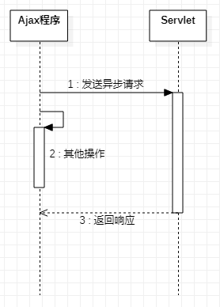
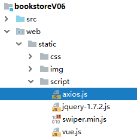
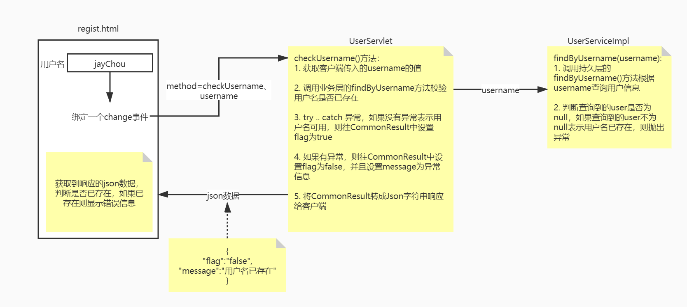
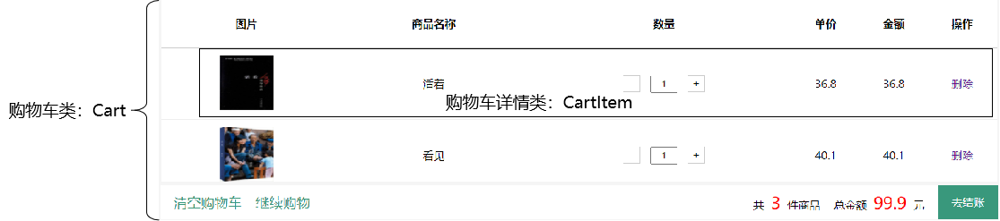

# 第十一章 Ajax&Axios&书城项目第五阶段

## 学习目标

* 了解服务器渲染和Ajax渲染的区别
* 了解同步和异步的区别
* 了解Axios
* 掌握Axios发送异步请求
* 掌握Axios携带json类型的请求参数
* 掌握服务器端返回json数据

### 1. Ajax

#### 1.1 服务器端渲染


#### 1.2 Ajax渲染（局部更新）


#### 1.3 前后端分离

真正的前后端分离是前端项目和后端项目分服务器部署，在我们这里我们先理解为彻底舍弃服务器端渲染，数据全部通过Ajax方式以JSON格式来传递

#### 1.4 同步与异步

Ajax本身就是Asynchronous JavaScript And XML的缩写，直译为：异步的JavaScript和XML。在实际应用中Ajax指的是：<span style="color:blue;font-weight:bold;">不刷新浏览器窗口</span>，<span style="color:blue;font-weight:bold;">不做页面跳转</span>，<span style="color:blue;font-weight:bold;">局部更新页面内容</span>的技术。

<span style="color:blue;font-weight:bold;">『同步』</span>和<span style="color:blue;font-weight:bold;">『异步』</span>是一对相对的概念，那么什么是同步，什么是异步呢？

##### 1.4.1 同步

多个操作<span style="color:blue;font-weight:bold;">按顺序执行</span>，前面的操作没有完成，后面的操作就必须<span style="color:blue;font-weight:bold;">等待</span>。所以同步操作通常是<span style="color:blue;font-weight:bold;">串行</span>的。


##### 1.4.2 异步

多个操作相继开始<span style="color:blue;font-weight:bold;">并发执行</span>，即使开始的先后顺序不同，但是由于它们各自是<span style="color:blue;font-weight:bold;">在自己独立的进程或线程中</span>完成，所以<span style="color:blue;font-weight:bold;">互不干扰</span>，<span style="color:blue;font-weight:bold;">谁也<span style="color:red;font-weight:bold;">不用等</span>谁</span>。



### 2. Axios

#### 2.1 Axios简介

使用原生的JavaScript程序执行Ajax极其繁琐，所以一定要使用框架来完成。而Axios就是目前最流行的前端Ajax框架。

Axios官网：http://www.axios-js.com/


使用Axios和使用Vue一样，导入对应的*.js文件即可。官方提供的script标签引入方式为：

```html
<script src="https://unpkg.com/axios/dist/axios.min.js"></script>
```

我们可以把这个axios.min.js文件下载下来保存到本地来使用。

#### 2.2 Axios基本用法

##### 2.2.1 在前端页面引入开发环境

```html
<script type="text/javascript" src="/demo/static/vue.js"></script>
<script type="text/javascript" src="/demo/static/axios.min.js"></script>
```

##### 2.2.2 发送普通请求参数

###### ① 前端代码

HTML标签：

```javascript
<div id="app">
    <button @click="commonParam">普通请求参数</button>
</div>
```

Vue+axios代码：

```javascript
var vue = new Vue({
    "el":"#app",
    "data":{
        "message":""
    },
    "methods":{
        commonParam(){
            //使用axios发送异步请求
            axios({
                "method":"post",
                "url":"demo01",
                "params":{
                    "userName":"tom",
                    "userPwd":"123456"
                }
            }).then(response => {
                //then里面是处理请求成功的响应数据
                //response就是服务器端的响应数据,是json类型的
                //response里面的data就是响应体的数据
                this.message = response.data
            }).catch(error => {
                //error是请求失败的错误描述
                console.log(error)
            })
        }
    }
})
</script>
```

 **注意：所有请求参数都被放到URL地址后面了，哪怕我们现在用的是POST请求方式。**

###### ② 后端代码

```java
package com.atguigu.servlet;

import javax.servlet.ServletException;
import javax.servlet.http.HttpServlet;
import javax.servlet.http.HttpServletRequest;
import javax.servlet.http.HttpServletResponse;
import java.io.IOException;


public class ServletDemo01 extends HttpServlet {
    @Override
    protected void doPost(HttpServletRequest request, HttpServletResponse response) throws ServletException, IOException {
        doGet(request, response);
    }

    @Override
    protected void doGet(HttpServletRequest request, HttpServletResponse response) throws ServletException, IOException {
        request.setCharacterEncoding("UTF-8");
        response.setContentType("text/html;charset=UTF-8");
        //1. 接收请求参数userName和userPwd
        String userName = request.getParameter("userName");
        String userPwd = request.getParameter("userPwd");
        System.out.println(userName + ":" + userPwd);

        //模拟出现异常
        //int num = 10/0;

        //2. 向浏览器响应数据
        response.getWriter().write("hello world!!!");
    }
}
```

###### ③ 服务器端处理请求失败后

```javascript
catch(error => {     // catch()服务器端处理请求出错后，会调用
    console.log(error);         // error就是出错时服务器端返回的响应数据
});
```

在给catch()函数传入的回调函数中，error对象封装了服务器端处理请求失败后相应的错误信息。其中，axios封装的响应数据对象，是error对象的response属性。response属性对象的结构如下图所示：


可以看到，response对象的结构还是和then()函数传入的回调函数中的response是一样的：

> 回调函数：开发人员声明，但是调用时交给系统来调用。像单击响应函数、then()、catch()里面传入的都是回调函数。回调函数是相对于普通函数来说的，普通函数就是开发人员自己声明，自己调用：
>
> ```javascript
> function sum(a, b) {
>  return a+b;
> }
> 
> var result = sum(3, 2);
> console.log("result="+result);
> ```

#### 2.3 发送请求体JSON

##### 2.3.1 前端代码

HTML代码：

```html
<button @click="sendJsonBody()">请求体JSON</button>
```

Vue+axios代码：

```javascript
<script>
    var vue = new Vue({
        "el":"#app",
        "data":{
            "message":""
        },
        "methods":{
            sendJsonBody(){
                //使用axios发送异步请求，要携带Json请求体的参数
                axios({
                    "method":"post",
                    "url":"demo01",
                    //携带Json请求体参数
                    "data":{
                        "userName":"aobama",
                        "userPwd":"999999"
                    }
                }).then(response => {
                    this.message = response.data
                })
            }
        }
    })
</script>
```

##### 2.3.2 后端代码

###### ① 加入Gson包

Gson是Google研发的一款非常优秀的<span style="color:blue;font-weight:bold;">JSON数据解析和生成工具</span>，它可以帮助我们将数据在JSON字符串和Java对象之间互相转换。


###### ② User类

```java
package com.atguigu.bean;


public class User {
    private String userName;
    private String userPwd;

    public User() {
    }

    public User(String userName, String userPwd) {
        this.userName = userName;
        this.userPwd = userPwd;
    }

    @Override
    public String toString() {
        return "User{" +
                "userName='" + userName + '\'' +
                ", userPwd='" + userPwd + '\'' +
                '}';
    }

    public String getUserName() {
        return userName;
    }

    public void setUserName(String userName) {
        this.userName = userName;
    }

    public String getUserPwd() {
        return userPwd;
    }

    public void setUserPwd(String userPwd) {
        this.userPwd = userPwd;
    }
}
```

###### ③ Servlet代码

```java
package com.atguigu.servlet;

import com.atguigu.bean.User;
import com.google.gson.Gson;

import javax.servlet.ServletException;
import javax.servlet.http.HttpServlet;
import javax.servlet.http.HttpServletRequest;
import javax.servlet.http.HttpServletResponse;
import java.io.BufferedReader;
import java.io.IOException;


public class ServletDemo01 extends HttpServlet {
    @Override
    protected void doPost(HttpServletRequest request, HttpServletResponse response) throws ServletException, IOException {
        doGet(request, response);
    }

    @Override
    protected void doGet(HttpServletRequest request, HttpServletResponse response) throws ServletException, IOException {
        try {
            response.setContentType("text/html;charset=UTF-8");
            //request.getParameter(name),request.getParameterValues(name),request.getParameterMap()这仨方法只能获取普通参数
            //什么是普通参数:1. 地址后面携带的参数  2. 表单提交的参数
            /*String userName = request.getParameter("userName");
            String userPwd = request.getParameter("userPwd");
            System.out.println("客户端传入的参数userName的值为:" + userName + ",传入的userPwd的值为:" + userPwd);*/

            //要获取Json请求体的参数，就必须得进行Json解析:可用来做Json解析的工具jar包有gson、fastjson、jackson(SpringMVC以及SpringBoot默认支持的)
            //做json解析其实就是:1. 将Java对象转成json字符串  2. 将json字符串转成Java对象

            //我们要获取json请求体的参数，其实就是将json请求体的参数封装到User对象中
            //1. 获取Json请求体的内容
            BufferedReader requestReader = request.getReader();
            //2. 从requestReader中循环读取拼接字符串
            StringBuilder stringBuilder = new StringBuilder();
            String buffer = "";
            while ((buffer = requestReader.readLine()) != null) {
                stringBuilder.append(buffer);
            }

            //3. 将stringBuilder转成字符串，这个字符串就是Json请求体
            String jsonBody = stringBuilder.toString();
            //4. 将jsonBody通过Json解析转成User对象
            Gson gson = new Gson();
            User user = gson.fromJson(jsonBody, User.class);

            System.out.println("客户端传入的参数userName的值为:" + user.getUserName() + ",传入的userPwd的值为:" + user.getUserPwd());
            //模拟服务器出现异常
            //int num = 10/0;

            response.getWriter().write("你好世界");
        } catch (Exception e) {
            e.printStackTrace();
        }
    }
}
```

> P.S.：看着很麻烦是吧？别担心，将来我们有了<span style="color:blue;font-weight:bold;">SpringMVC</span>之后，一个<span style="color:blue;font-weight:bold;">@RequestBody</span>注解就能够搞定，非常方便！

#### 2.4 服务器端返回JSON数据

##### 2.4.1 前端代码

```javascript
sendJsonBody(){
    //使用axios发送异步请求，要携带Json请求体的参数
    axios({
        "method":"post",
        "url":"demo01",
        //携带Json请求体参数
        "data":{
            "userName":"aobama",
            "userPwd":"999999"
        }
    }).then(response => {
        //目标是获取响应数据中的用户的用户名或者密码
        this.message = response.data.userName
    })
}
```

##### 2.4.2 后端代码

###### ① 加入Gson包

仍然需要Gson支持，不用多说


###### ② Servlet代码

```java
package com.atguigu.servlet;

import com.atguigu.bean.User;
import com.google.gson.Gson;

import javax.servlet.ServletException;
import javax.servlet.http.HttpServlet;
import javax.servlet.http.HttpServletRequest;
import javax.servlet.http.HttpServletResponse;
import java.io.BufferedReader;
import java.io.IOException;


public class ServletDemo01 extends HttpServlet {
    @Override
    protected void doPost(HttpServletRequest request, HttpServletResponse response) throws ServletException, IOException {
        doGet(request, response);
    }

    @Override
    protected void doGet(HttpServletRequest request, HttpServletResponse response) throws ServletException, IOException {
        try {
            response.setContentType("text/html;charset=UTF-8");
            //request.getParameter(name),request.getParameterValues(name),request.getParameterMap()这仨方法只能获取普通参数
            //什么是普通参数:1. 地址后面携带的参数  2. 表单提交的参数
            /*String userName = request.getParameter("userName");
            String userPwd = request.getParameter("userPwd");
            System.out.println("客户端传入的参数userName的值为:" + userName + ",传入的userPwd的值为:" + userPwd);*/

            //要获取Json请求体的参数，就必须得进行Json解析:可用来做Json解析的工具jar包有gson、fastjson、jackson(SpringMVC以及SpringBoot默认支持的)
            //做json解析其实就是:1. 将Java对象转成json字符串  2. 将json字符串转成Java对象

            //我们要获取json请求体的参数，其实就是将json请求体的参数封装到User对象中
            //1. 获取Json请求体的内容
            BufferedReader requestReader = request.getReader();
            //2. 从requestReader中循环读取拼接字符串
            StringBuilder stringBuilder = new StringBuilder();
            String buffer = "";
            while ((buffer = requestReader.readLine()) != null) {
                stringBuilder.append(buffer);
            }

            //3. 将stringBuilder转成字符串，这个字符串就是Json请求体
            String jsonBody = stringBuilder.toString();
            //4. 将jsonBody通过Json解析转成User对象
            Gson gson = new Gson();
            User user = gson.fromJson(jsonBody, User.class);

            System.out.println("客户端传入的参数userName的值为:" + user.getUserName() + ",传入的userPwd的值为:" + user.getUserPwd());
            //模拟服务器出现异常
            //int num = 10/0;

            //服务器端向客户端响应普通字符串
            //response.getWriter().write("你好世界");

            //在实际开发中服务器端向客户端响应的99%都会是Json字符串
            User responseUser = new User("周杰棍","ggggggg");

            //将responseUser转成json字符串
            String responseJson = gson.toJson(responseUser);

            response.getWriter().write(responseJson);
        } catch (Exception e) {
            e.printStackTrace();
        }
    }
}
```

### 3. 书城项目第五阶段

#### 3.1 注册页面用户名唯一性检查优化

##### 3.1.1 准备工作同步请求

- 复制module

##### 3.1.2 加入Ajax开发环境

###### ①  前端所需axios库



###### ② 后端所需jackson库

##### 3.1.3 拷贝Json工具类

#### 3.2 封装CommonResult

##### 3.1 模型的作用

在整个项目中，凡是涉及到给Ajax请求返回响应，我们都封装到CommonResult类型中。

##### 3.2 模型的代码

```java
package com.atguigu.bean;


public class CommonResult {
    /**
     * 服务器端处理请求的标示
     */
    private boolean flag;

    /**
     * 当服务器端处理请求成功的时候要显示给客户端的数据(主要针对于查询)
     */
    private Object resultData;
    
    /**
     * 当服务器端处理请求失败的时候要响应给客户端的错误信息
     */
    private String message;

    /**
     * 处理请求成功
     * @return
     */
    public static CommonResult ok(){
        return new CommonResult().setFlag(true);
    }

    /**
     * 处理请求失败
     * @return
     */
    public static CommonResult error(){
        return new CommonResult().setFlag(false);
    }

    public boolean isFlag() {
        return flag;
    }

    private CommonResult setFlag(boolean flag) {
        this.flag = flag;
        return this;
    }

    public Object getResultData() {
        return resultData;
    }

    public CommonResult setResultData(Object resultData) {
        this.resultData = resultData;
        return this;
    }

    public String getMessage() {
        return message;
    }

    public CommonResult setMessage(String message) {
        this.message = message;
        return this;
    }

    @Override
    public String toString() {
        return "CommonResult{" +
                "flag=" + flag +
                ", resultData=" + resultData +
                ", message='" + message + '\'' +
                '}';
    }
}
```

各个属性的含义：

| 属性名     | 含义                                             |
| ---------- | ------------------------------------------------ |
| flag       | 服务器端处理请求的结果，取值为true或者false      |
| message    | 服务器端处理请求失败之后，要响应给客户端的数据   |
| resultData | 服务器端处理请求成功之后，需要响应给客户端的数据 |


##### 3.3 模型的好处

- 作为整个团队开发过程中，前后端交互时使用的统一的数据格式
- 有利于团队成员之间的协助，提高开发效率


#### 3.3 功能实现

##### 3.3.1 定位功能的位置

在用户输入用户名之后，立即检查这个用户名是否可用。

##### 3.3.2 思路

###### ①  给用户名输入框绑定的事件类型

结论：不能在针对username设定的watch中发送Ajax请求。

原因：服务器端响应的速度跟不上用户输入的速度，而且服务器端异步返回响应数据，无法保证和用户输入的顺序完全一致。此时有下面几点问题：

- 给服务器增加不必要的压力
- 用户输入的数据在输入过程中是不断发生变化的
- 响应数据和输入顺序不对应，会发生错乱

解决办法：绑定的事件类型使用change事件。

###### ② 流程图



##### 3.3.3 代码实现

###### ① 在当前页面引入axios库文件

```html
<script src="static/script/axios.js"></script>
```


###### ② 给用户名输入框绑失去焦点事件

```html
<input type="text" placeholder="请输入用户名" name="username" v-model="username" @blur="checkUsername"/>
```

###### ③ JavaScript代码

```javascript
var vue = new Vue({
    "el":"#app",
    "data":{
        "user":{
            "username":"[[${param.userName}]]",
            "password":"",
            "passwordConfirm":"",
            "email":"[[${param.email}]]"
        },
        "usernameError":"",
        "passwordError":"",
        "passwordConfirmError":"",
        "emailError":"",
        "usernameFlag":false,
        "passwordFlag":false,
        "passwordConfirmFlag":false,
        "emailFlag":false
    },
    "methods":{
        checkUsername(){
            //判断用户名是否符合规范
            //用户名要满足的要求:用户名应为5~12位数字和字母组成
            var regExp = /^[a-zA-Z0-9]{5,12}$/
            //获取用户名，并且使用regExp校验用户名
            if (!regExp.test(this.user.username)) {
                //用户名校验不通过:
                //显示"用户名必须是5-12位数字或字母"
                this.usernameError = "用户名必须是5-12位数字或字母"
                this.usernameFlag = false
            }else {
                //用户名格式正确
                //校验用户名是否可用:发送异步请求给UserServlet
                axios({
                    "method":"POST",
                    "url":"user",
                    "params":{
                        "method":"checkUsername",
                        "username":this.user.username
                    }
                }).then(response => {
                    //1. 判断响应的json中的flag
                    if (!response.data.flag) {
                        //用户名不可用
                        this.usernameError = response.data.message
                    }else {
                        //用户名可用
                        this.usernameError = ""
                    }
                    this.usernameFlag = response.data.flag
                })
            }
        },
        checkPassword(){
            //判断密码是否符合规范
            //用户的密码要满足的要求:密码是8-16位的数字、字母、_
            var regExp = /^[0-9a-zA-Z_]{8,16}$/
            if (!regExp.test(this.user.password)) {
                //显示"密码必须是是8-16位的数字、字母、_"
                this.passwordError = "密码必须是是8-16位的数字、字母、_"
                this.passwordFlag = false
            }else {
                this.passwordError = ""
                this.passwordFlag = true
            }
        },
        checkPasswordConfirm(){
            //判断确认密码输入框的内容和密码输入框的内容是否一致
            if (this.user.passwordConfirm != this.user.password) {
                //确认密码和密码不一致
                this.passwordConfirmError = "两次输入的密码要一致"
                this.passwordConfirmFlag = false
            }else {
                this.passwordConfirmError = ""
                this.passwordConfirmFlag = true
            }
        },
        checkEmail(){
            //使用正则表达式判断邮箱格式
            var regExp = /^[a-zA-Z0-9_\.-]+@([a-zA-Z0-9-]+[\.]{1})+[a-zA-Z]+$/
            //校验邮箱格式
            if (!regExp.test(this.user.email)) {
                //邮箱格式错误
                this.emailError = "邮箱格式错误"
                this.emailFlag = false
            }else {
                this.emailError = ""
                this.emailFlag = true
            }
        },
        checkRegister(){
            //再加一个判断:为了防止有的人压根没有在输入框输入内容
            if (this.user.username == "") {
                this.usernameError = "用户名不能为空"
            }

            if (!this.passwordFlag) {
                this.passwordError = "密码必须是是8-16位的数字、字母、_"
            }

            if (!this.passwordConfirmFlag) {
                this.passwordConfirmError = "两次输入的密码要一致"
            }

            if (!this.emailFlag) {
                this.emailError = "邮箱格式错误"
            }

            //校验注册:只有当所有的输入框都符合规范，才能提交表单，否则就要取消控件的默认行为(阻止表单提交)
            if (!this.usernameFlag || !this.passwordFlag || !this.passwordConfirmFlag || !this.emailFlag) {
                //肯定有输入框校验是不通过的，所以阻止表单提交
                event.preventDefault()
            }
        },
        changeCode(){
            //切换验证码: 重新设置当前图片的src属性的值
            event.target.src = "kaptcha"
        }
    }
});
```


###### ④ UserServlet

```java
/**
     * 校验用户名是否已存在
     * @param request
     * @param response
     * @throws IOException
     */
public void checkUsername(HttpServletRequest request, HttpServletResponse response) throws IOException {
    CommonResult commonResult = null;
    try {
        //1. 获取请求参数username的值
        String username = request.getParameter("username");
        //2. 调用业务层的findByUsername()方法校验用户名是否已存在
        User user=userService.findByUsername(username);
        if(user==null){
             //3. 表示用户名可用
        	commonResult = CommonResult.ok();
        }else{
            //4. 用户名已存在，不可用
        	commonResult = CommonResult.error().setMessage(e.getMessage());
        }
       
    } catch (Exception e) {
        e.printStackTrace();
    }
		//将CommonResult对象转成json字符串，响应给客户端
        String responseJson = gson.toJson(commonResult);
        response.getWriter().write(responseJson);
}
```

###### ⑤ UserService

```java
@Override
public void findByUsername(String username) throws Exception {
    //调用持久层的方法根据username查询user
    User user = userDao.findByUsername(username);
    if (user != null) {
        throw new RuntimeException("用户名已存在");
    }
}
```

#### 3.4 加入购物车

##### 3.4.1 创建购物车模型



###### ① 购物项详情类

```java
package com.atguigu.bookstore.bean;


public class CartItem {
    /**
     * 购物项存储的那本书的id
     */
    private Integer bookId;
    /**
     * 购物项存储的那本书的书名
     */
    private String bookName;
    /**
     * 购物项存储的那本书的图片路径
     */
    private String imgPath;
    /**
     * 购物项存储的那本书的单价
     */
    private Double price;
    /**
     * 购物项的书的数量
     */
    private Integer count = 0;
    /**
     * 购物项的金额
     */
    private Double amount = 0d;

    public CartItem(Integer bookId, String bookName, String imgPath, Double price, Integer count, Double amount) {
        this.bookId = bookId;
        this.bookName = bookName;
        this.imgPath = imgPath;
        this.price = price;
        this.count = count;
        this.amount = amount;
    }

    public CartItem() {
    }

    public Integer getBookId() {
        return bookId;
    }

    public void setBookId(Integer bookId) {
        this.bookId = bookId;
    }

    public String getBookName() {
        return bookName;
    }

    public void setBookName(String bookName) {
        this.bookName = bookName;
    }

    public String getImgPath() {
        return imgPath;
    }

    public void setImgPath(String imgPath) {
        this.imgPath = imgPath;
    }

    public Double getPrice() {
        return price;
    }

    public void setPrice(Double price) {
        this.price = price;
    }

    public Integer getCount() {
        return count;
    }

    public void setCount(Integer count) {
        this.count = count;
    }

    /**
     * 获取当前购物项的金额
     * @return
     */
    public Double getAmount() {
        //我们自己计算金额
        this.amount = this.price * this.count;
        return this.amount;
    }

    public void setAmount(Double amount) {
        this.amount = amount;
    }

    @Override
    public String toString() {
        return "CartItem{" +
            "bookId=" + bookId +
            ", bookName='" + bookName + '\'' +
            ", imgPath='" + imgPath + '\'' +
            ", price=" + price +
            ", count=" + count +
            ", amount=" + amount +
            '}';
    }

    /**
     * 将count自增1
     */
    public void countIncrease(){
        this.count ++;
    }

    /**
     * 将当前购物项的数量进行 -1
     */
    public void countDecrease(){
        if (this.count > 0) {
            this.count --;
        }
    }
}
```

###### ② 购物车类：Cart

```java
package com.atguigu.bookstore.bean;

import com.atguigu.bookstore.entity.Book;

import java.util.Collection;
import java.util.HashMap;
import java.util.Map;


public class Cart {
    /**
     * 当前购物车的总金额
     */
    private Double totalAmount = 0d;

    /**
     * 当前购物车的商品总数
     */
    private Integer totalCount = 0;

    /**
     * 存储购物项的容器
     * 以购物项的bookId作为key，以购物项CartItem作为value
     */
    private Map<Integer,CartItem> cartItemMap = new HashMap<>();

    /**
     * 将某本书添加进购物车
     * @param book
     */
    public void addBookToCart(Book book){
        //1. 判断当前购物车中是否已经有这本书了
        if (cartItemMap.containsKey(book.getBookId())) {
            //说明当前购物车已经包含了这本书，那么就只需要将这本书对应的购物项的count +1就行了
            cartItemMap.get(book.getBookId()).countIncrease();
        }else {
            //说明当前购物车中不包含这本书，就要新添加一个购物项
            CartItem cartItem = new CartItem();
            //设置cartItem中的内容
            cartItem.setBookId(book.getBookId());
            cartItem.setBookName(book.getBookName());
            cartItem.setImgPath(book.getImgPath());
            cartItem.setPrice(book.getPrice());
            cartItem.setCount(1);

            //将cartItem添加cartItemMap
            cartItemMap.put(book.getBookId(),cartItem);
        }
    }

    /**
     * 将某个购物项的数量+1
     * @param bookId
     */
    public void itemCountIncrease(Integer bookId){
        //1. 根据bookId找到对应的购物项
        //2. 调用购物项的countIncrease()方法进行数量+1
        cartItemMap.get(bookId).countIncrease();
    }

    /**
     * 将某一个购物项的数量 -1
     * @param bookId
     */
    public void itemCountDecrease(Integer bookId){
        //1. 根据bookId找到对应的购物项
        //2. 调用购物项的countDecrease()方法进行数量-1
        CartItem cartItem = cartItemMap.get(bookId);
        cartItem.countDecrease();
        //3. 判断当前购物项的数量是否大于0，如果不大于0，说明我们需要将当前购物项从购物车中删除
        if (cartItem.getCount() == 0) {
            cartItemMap.remove(bookId);
        }
    }

    /**
     * 根据bookId将购物项从购物车中移除
     * @param bookId
     */
    public void removeCartItem(Integer bookId){
        cartItemMap.remove(bookId);
    }

    /**
     * 修改某个购物项的数量
     * @param bookId
     * @param newCount
     */
    public void updateItemCount(Integer bookId,Integer newCount){
        //1. 根据bookId找到对应的购物项
        //2. 将newCount设置到购物项的count属性
        cartItemMap.get(bookId).setCount(newCount);
    }

    /**
     * 计算商品的总金额
     * @return
     */
    public Double getTotalAmount() {
        this.totalAmount = 0d;
        //计算购物车中的所有的商品总金额，其实就是累加每一个购物项的amount
        cartItemMap.forEach((k,cartItem) -> {
            this.totalAmount += cartItem.getAmount();
        });
        return this.totalAmount;
    }

    public void setTotalAmount(Double totalAmount) {
        this.totalAmount = totalAmount;
    }

    /**
     * 计算商品总数量
     * @return
     */
    public Integer getTotalCount() {
        //计算购物车中的所有的商品总数，其实就是累加每一个购物项的count
        this.totalCount = 0;
        //获取到Map中的所有的value
        Collection<CartItem> values = cartItemMap.values();
        //遍历出每一个value
        for (CartItem cartItem : values) {
            this.totalCount += cartItem.getCount();
        }

        return this.totalCount;
    }


    public void setTotalCount(Integer totalCount) {
        this.totalCount = totalCount;
    }

    public Map<Integer, CartItem> getCartItemMap() {
        return cartItemMap;
    }

    public void setCartItemMap(Map<Integer, CartItem> cartItemMap) {
        this.cartItemMap = cartItemMap;
    }
}
```


##### 3.4.2 思路


##### 3.4.3客户端发送异步请求

###### ① 在首页引入vue和axios

```html
<script src="static/script/vue.js" type="text/javascript" charset="utf-8"></script>
<script src="static/script/axios.js" type="text/javascript" charset="utf-8"></script>
```

###### ② 绑定单击响应函数

给加入购物车按钮绑定单击响应函数

```html
<button @click="addBookToCart()" th:value="${book.bookId}">加入购物车</button>
```

给首页顶部绑定显示购物车中商品总数,由于要考虑是否登录的情况，所以登录和未登录的标签都要绑定数据模型

```html
<!--登录前的风格-->
<div class="topbar-right" th:if="${session.loginUser == null}">
    <a href="user?method=toLoginPage" class="login">登录</a>
    <a href="user?method=toRegisterPage" class="register">注册</a>
    <a
       href="cart?method=toCartPage"
       class="cart iconfont icon-gouwuche
              "
       >
        购物车
        <div class="cart-num" v-text="totalCount">3</div>
    </a>
    <a href="admin?method=toManagerPage" class="admin">后台管理</a>
</div>
<!--登录后风格-->
<div class="topbar-right" th:unless="${session.loginUser == null}">
    <span>欢迎你<b th:text="${session.loginUser.userName}">张总</b></span>
    <a href="user?method=logout" class="register">注销</a>
    <a
       href="cart?method=toCartPage"
       class="cart iconfont icon-gouwuche
              ">
        购物车
        <div class="cart-num" v-text="totalCount">3</div>
    </a>
    <a href="pages/manager/book_manager.html" class="admin">后台管理</a>
</div>
```

###### ③ Vue代码：

```javascript
var vue = new Vue({
    "el":"#app",
    "data":{
        "totalCount":0
    },
    "methods":{
        addBookToCart(){
            //获取bookId: bookId绑定在当前标签的value属性上
            //event.target就表示拿到当前标签
            var bookId = event.target.value;

            //发送异步请求:添加书进购物车
            axios({
                "method":"post",
                "url":"cart",
                "params":{
                    "method":"addCartItem",
                    "id":bookId
                }
            }).then(response => {
                if (response.data.flag) {
                    //添加购物车成功
                    this.totalCount = response.data.resultData
                    alert("添加购物车成功")
                }else {
                    //添加购物车失败
                   alert("添加购物车失败")
                }
            })
        }
    }
});
```

##### 3.4.4 后端代码

###### ① CartServlet

```java
package com.atguigu.bookstore.servlet.model;

import com.atguigu.bookstore.bean.Cart;
import com.atguigu.bookstore.bean.CommonResult;
import com.atguigu.bookstore.constants.BookStoreConstants;
import com.atguigu.bookstore.entity.Book;
import com.atguigu.bookstore.service.BookService;
import com.atguigu.bookstore.service.impl.BookServiceImpl;
import com.atguigu.bookstore.servlet.base.ModelBaseServlet;
import com.atguigu.bookstore.utils.JsonUtils;

import javax.servlet.http.HttpServletRequest;
import javax.servlet.http.HttpServletResponse;
import javax.servlet.http.HttpSession;


public class CartServlet extends ModelBaseServlet {
    private BookService bookService = new BookServiceImpl();
    /**
     * 将书添加进购物车
     * @param request
     * @param response
     */
    public void addCartItem(HttpServletRequest request, HttpServletResponse response){
        CommonResult commonResult = null;
        try {
            //1. 获取请求参数:书的id
            Integer id = Integer.valueOf(request.getParameter("id"));
            //2. 调用业务层的方法，根据id查询到书
            Book book = bookService.getBookById(id);
            //3. 尝试从会话域session中获取购物车信息:主要目的是判断当前是否是第一次添加商品进购物车
            HttpSession session = request.getSession();
            Cart cart = (Cart) session.getAttribute(BookStoreConstants.CARTSESSIONKEY);
            if (cart == null) {
                //说明之前没有购物车,那么就新建一个cart对象
                cart = new Cart();
                //将cart添加到session中
                session.setAttribute(BookStoreConstants.CARTSESSIONKEY,cart);
            }
            //将书添加进购物车
            cart.addBookToCart(book);

            //封装响应数据
            commonResult = CommonResult.ok().setResultData(cart.getTotalCount());
        } catch (Exception e) {
            e.printStackTrace();
            commonResult = CommonResult.error().setMessage(e.getMessage());
        }

        //将commonResult对象转成json字符串，响应给客户端
        response.getWriter().write(new Gson().toJson(commonResult));
    }
}
```

###### ② web.xml

```xml
<servlet>
    <servlet-name>CartServlet</servlet-name>
    <servlet-class>com.atguigu.bookstore.servlet.model.CartServlet</servlet-class>
</servlet>

<servlet-mapping>
    <servlet-name>CartServlet</servlet-name>
    <url-pattern>/cart</url-pattern>
</servlet-mapping>
```

