# 										尚好房：搭建环境

# 一、项目介绍


## 1、介绍

尚好房是一个二手房管理服务平台，开放优质资源和线上能力，聚合线上线下二手房产资源，打造一个全方位二手房服务生态市场，为消费者提供优质房产服务资源。

## 2、核心技术

| 基础框架：ssm                       |
| ----------------------------------- |
| 分布式框架：ssm + Dubbo + zk        |
| spring session redis实现session共享 |
| 图片服务器：七牛云                  |
| 后台管理权限控制：spring-security   |
| 前端用户登录判断：拦截器            |
| 后台管理模板：Thymeleaf             |
| 前端技术:Vue+Axios                  |

## 3、项目模块

最终分布式架构模块

shf-parent：根目录，管理子模块：

​	common-util：公共类模块

​	model：实体类模块

​	service：dubbo服务父节点

​		service-acl：权限服务模块

​		service-house：房源服务模块

​		service-user：用户服务模块

​	service-api：dubbo服务api接口

​	web：前端（dubbo服务消费者）

​		web-admin：后台管理系统

​		web-front：网站前端


模块调用关系，如图：


## 4、项目演示地址

尚好房后台管理系统：http://139.198.152.148:8001/
尚好房前端：http://139.198.152.148:8002/

根据演示了解项目业务

## 5、数据库

数据库从资源文件中获取，导入数据库，数据库表如下：

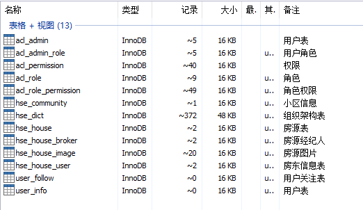

## 6、其他资源

如：实体类、工具类直接复制到项目模块使用，后续使用时再详细说明，其他资源需要时引入。


# 二、搭建环境

目前我们先搭建“尚好房”后台管理系统，该系统为单体架构：SSM框架，后续我们通过SSM架构过渡到Dubbo通信的分布式架构。

SSM单体架构模块：

shf-parent：根目录，管理子模块：

​	common-util：公共类模块

​	model：实体类模块

​	web-admin：后台管理系统


搭建SSM架构我们分三步进行：

1、搭建项目结构

2、配置依赖关系

3、配置SSM环境

4、测试SSM环境

## 1、搭建项目结构

### 1.1、搭建父工程shf-parent

shf：尚好房首字母缩写

第一步：新建项目

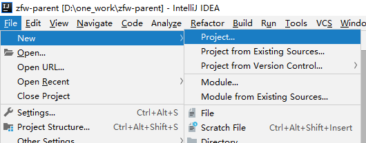

第二步：

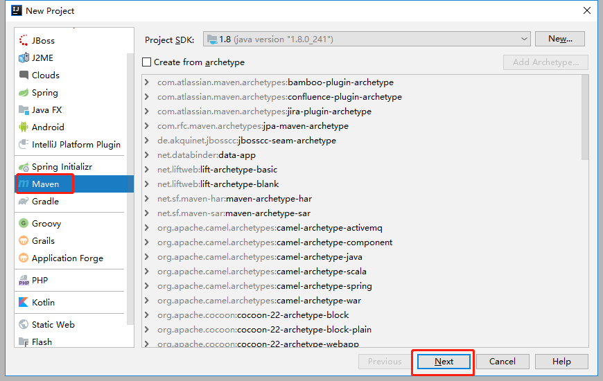

第三步：

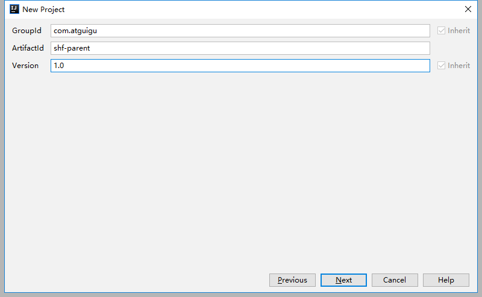

第四步：

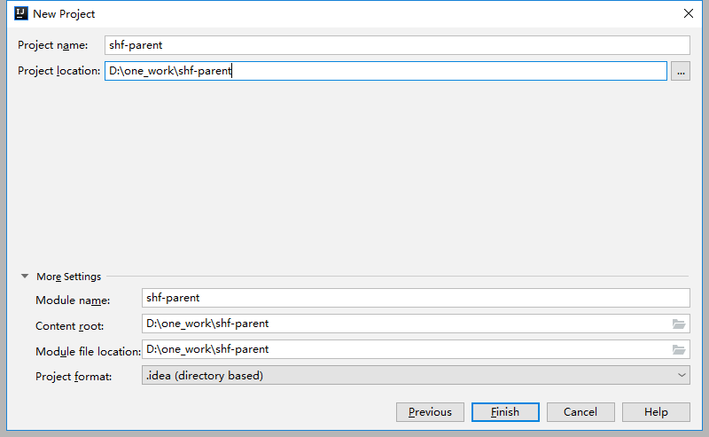

项目结构如：

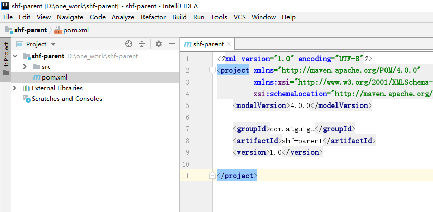

删除src目录


### 1.2、搭建工具类模块common-util

第一步：右键点击“shf-parent”

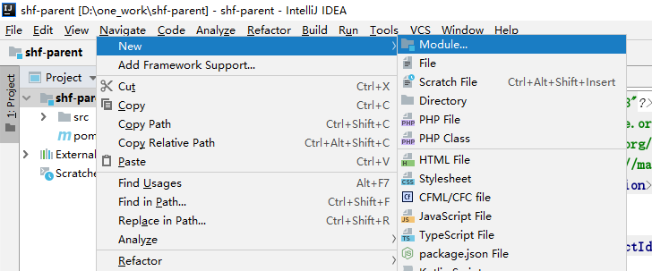

第二步：

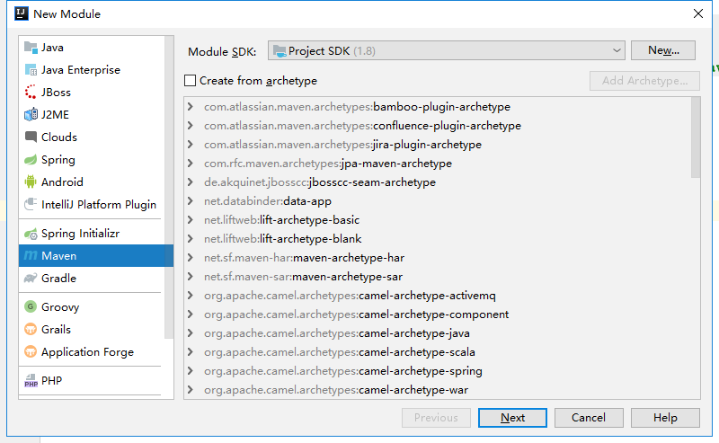

第三步：

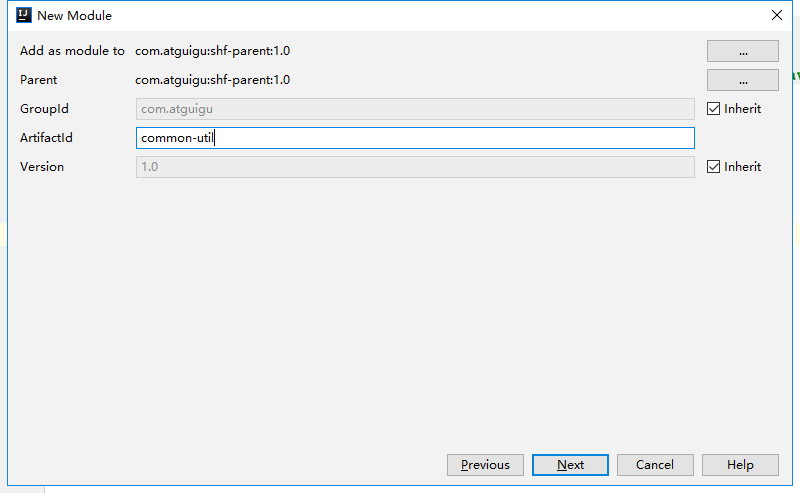

第四步：

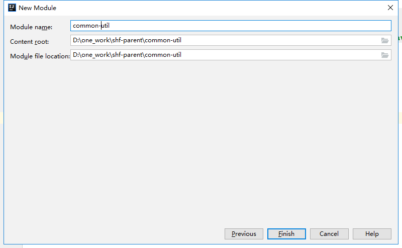

项目结构如：

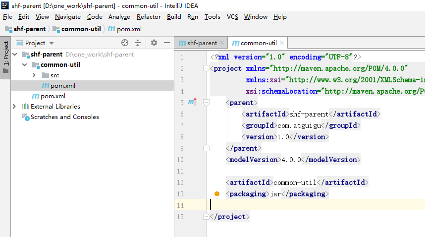

引入“资料/java工具类”相关代码

### 1.3、搭建实体类模块model

搭建方式如：common-util

项目结构如：

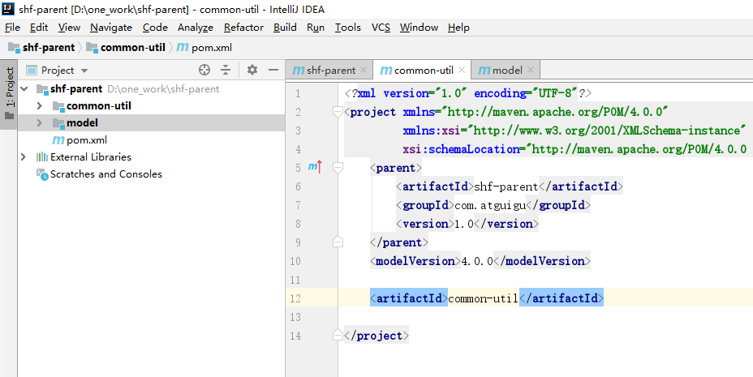

引入“资料/java实体类”相关代码

### 1.4、搭建项目模块web-admin

第一步：右键点击“shf-parent”


第二步：

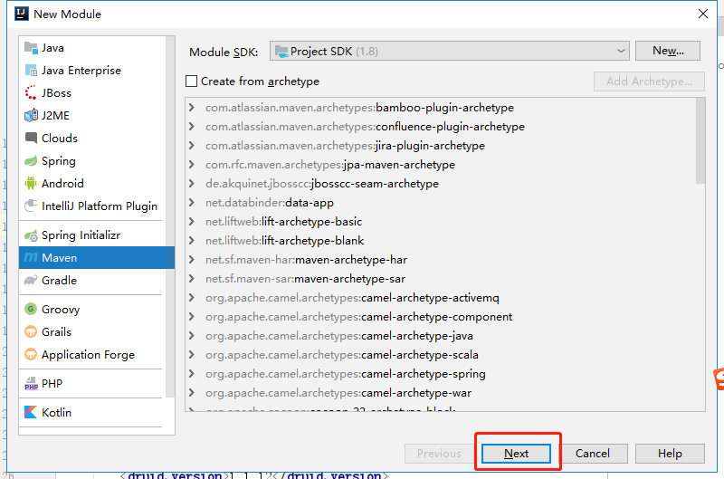

第三步：

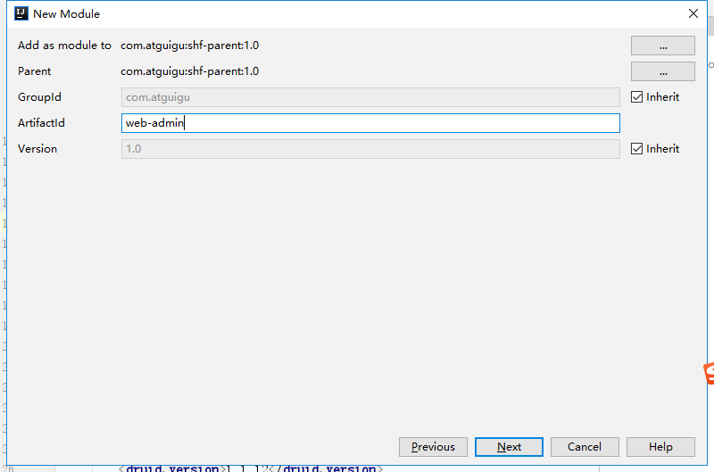

第四步：

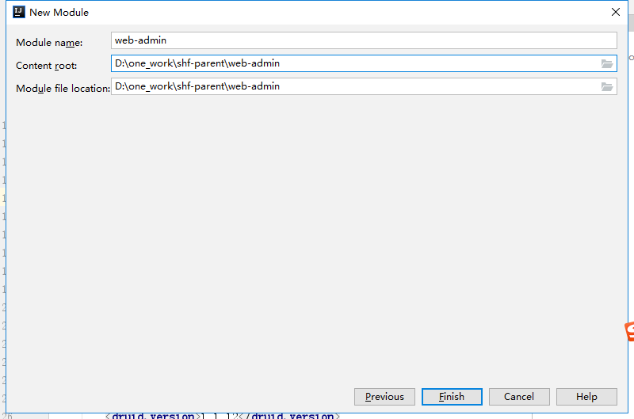

项目结构如：

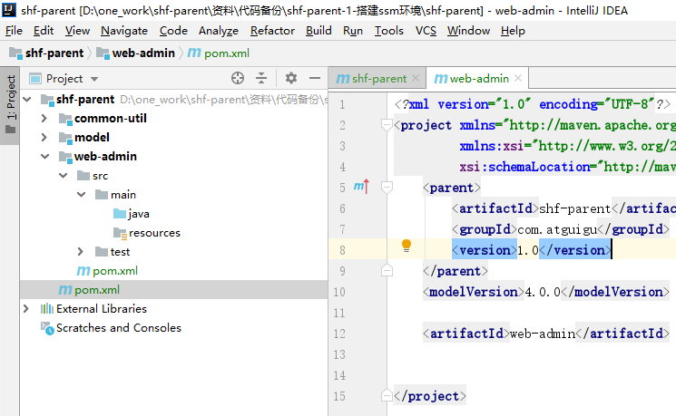

说明：模块web-admin还缺少webapp/WEB-INF目录及web.xml文件

第一步：在pom.xml文件中指定打包方式为war


第二步：在main下直接创建webapp/WEB-INF/web.xml文件

```xml
<?xml version="1.0" encoding="UTF-8"?>
<web-app xmlns:xsi="http://www.w3.org/2001/XMLSchema-instance"
         xmlns="http://java.sun.com/xml/ns/javaee"
         xsi:schemaLocation="http://java.sun.com/xml/ns/javaee http://java.sun.com/xml/ns/javaee/web-app_3_0.xsd"
         id="WebApp_ID" version="3.0">
    <display-name>web</display-name>

</web-app>
```


## 2、配置依赖关系

### 2.1、shf-parent父模块管理依赖版本

修改shf-parent模块pom.xml文件

```xml
<?xml version="1.0" encoding="UTF-8"?>
<project xmlns="http://maven.apache.org/POM/4.0.0"
         xmlns:xsi="http://www.w3.org/2001/XMLSchema-instance"
         xsi:schemaLocation="http://maven.apache.org/POM/4.0.0 http://maven.apache.org/xsd/maven-4.0.0.xsd">
    <modelVersion>4.0.0</modelVersion>

    <groupId>com.atguigu</groupId>
    <artifactId>shf-parent</artifactId>
    <packaging>pom</packaging>
    <version>1.0</version>
    <modules>
        <module>common-util</module>
        <module>model</module>
        <module>web-admin</module>
    </modules>

    <properties>
        <java.version>1.8</java.version>
        <spring.version>5.2.7.RELEASE</spring.version>
        <thymeleaf.version>3.0.11.RELEASE</thymeleaf.version>
        <pagehelper.version>4.1.4</pagehelper.version>
        <servlet-api.version>2.5</servlet-api.version>
        <fastjson.version>1.2.29</fastjson.version>
        <mybatis.version>3.4.5</mybatis.version>
        <mybatis.spring.version>1.3.1</mybatis.spring.version>
        <mysql.version>8.0.18</mysql.version>
        <druid.version>1.1.12</druid.version>
        <commons-fileupload.version>1.3.1</commons-fileupload.version>
        <slf4j-version>1.7.30</slf4j-version>
        <logback-version>1.2.3</logback-version>
    </properties>

    <!-- 依赖管理 -->
    <dependencyManagement>
        <dependencies>
            <!-- SpringMVC相关 -->
            <dependency>
                <groupId>org.springframework</groupId>
                <artifactId>spring-webmvc</artifactId>
                <version>${spring.version}</version>
            </dependency>
            <!--spring封装的jdbc数据库访问-->
            <dependency>
                <groupId>org.springframework</groupId>
                <artifactId>spring-jdbc</artifactId>
                <version>${spring.version}</version>
            </dependency>
            <dependency>
                <groupId>org.springframework</groupId>
                <artifactId>spring-tx</artifactId>
                <version>${spring.version}</version>
            </dependency>
            <!--Spring提供的对AspectJ框架的整合-->
            <dependency>
                <groupId>org.springframework</groupId>
                <artifactId>spring-aspects</artifactId>
                <version>${spring.version}</version>
            </dependency>
            <!--用于spring测试-->
            <dependency>
                <groupId>org.springframework</groupId>
                <artifactId>spring-test</artifactId>
                <version>${spring.version}</version>
            </dependency>

            <!--用于springMVC模板-->
            <dependency>
                <groupId>org.thymeleaf</groupId>
                <artifactId>thymeleaf-spring5</artifactId>
                <version>${thymeleaf.version}</version>
            </dependency>

            <!--mybatis的分页插件-->
            <dependency>
                <groupId>com.github.pagehelper</groupId>
                <artifactId>pagehelper</artifactId>
                <version>${pagehelper.version}</version>
            </dependency>
            <!-- Mybatis -->
            <dependency>
                <groupId>org.mybatis</groupId>
                <artifactId>mybatis</artifactId>
                <version>${mybatis.version}</version>
            </dependency>
            <!-- Mybatis与Spring整合所需要的jar包 -->
            <dependency>
                <groupId>org.mybatis</groupId>
                <artifactId>mybatis-spring</artifactId>
                <version>${mybatis.spring.version}</version>
            </dependency>
            <!-- MySql -->
            <dependency>
                <groupId>mysql</groupId>
                <artifactId>mysql-connector-java</artifactId>
                <version>${mysql.version}</version>
            </dependency>
            <!-- 连接池 -->
            <dependency>
                <groupId>com.alibaba</groupId>
                <artifactId>druid</artifactId>
                <version>${druid.version}</version>
            </dependency>
            <!-- 文件上传组件 -->
            <dependency>
                <groupId>commons-fileupload</groupId>
                <artifactId>commons-fileupload</artifactId>
                <version>${commons-fileupload.version}</version>
            </dependency>

            <!-- fastjson -->
            <dependency>
                <groupId>com.alibaba</groupId>
                <artifactId>fastjson</artifactId>
                <version>${fastjson.version}</version>
            </dependency>

            <!-- 日志 -->
            <dependency>
                <groupId>org.slf4j</groupId>
                <artifactId>slf4j-api</artifactId>
                <version>${slf4j-version}</version>
            </dependency>
            <dependency>
                <groupId>ch.qos.logback</groupId>
                <artifactId>logback-classic</artifactId>
                <version>${logback-version}</version>
            </dependency>
        </dependencies>
    </dependencyManagement>

    <dependencies>
        <dependency>
            <groupId>javax.servlet</groupId>
            <artifactId>servlet-api</artifactId>
            <version>${servlet-api.version}</version>
            <scope>provided</scope>
        </dependency>
    </dependencies>

	<build>
        <plugins>
            <!-- java编译插件 -->
            <plugin>
                <groupId>org.apache.maven.plugins</groupId>
                <artifactId>maven-compiler-plugin</artifactId>
                <version>3.2</version>
                <configuration>
                    <source>1.8</source>
                    <target>1.8</target>
                    <encoding>UTF-8</encoding>
                </configuration>
            </plugin>
        </plugins>
    </build>
</project>
```

### 2.2、common-util模块

common-util模块负责：依赖与常用工具类管理

```xml
<?xml version="1.0" encoding="UTF-8"?>
<project xmlns="http://maven.apache.org/POM/4.0.0"
         xmlns:xsi="http://www.w3.org/2001/XMLSchema-instance"
         xsi:schemaLocation="http://maven.apache.org/POM/4.0.0 http://maven.apache.org/xsd/maven-4.0.0.xsd">
    <parent>
        <artifactId>shf-parent</artifactId>
        <groupId>com.atguigu</groupId>
        <version>1.0</version>
    </parent>
    <modelVersion>4.0.0</modelVersion>

    <artifactId>common-util</artifactId>

    <dependencies>
        <!-- SpringMVC相关 -->
        <dependency>
            <groupId>org.springframework</groupId>
            <artifactId>spring-webmvc</artifactId>
        </dependency>
        <!--spring封装的jdbc数据库访问-->
        <dependency>
            <groupId>org.springframework</groupId>
            <artifactId>spring-jdbc</artifactId>
        </dependency>
        <dependency>
            <groupId>org.springframework</groupId>
            <artifactId>spring-tx</artifactId>
        </dependency>
        <!--Spring提供的对AspectJ框架的整合-->
        <dependency>
            <groupId>org.springframework</groupId>
            <artifactId>spring-aspects</artifactId>
        </dependency>
        <!--用于spring测试-->
        <dependency>
            <groupId>org.springframework</groupId>
            <artifactId>spring-test</artifactId>
        </dependency>

        <!--用于springMVC模板-->
        <dependency>
            <groupId>org.thymeleaf</groupId>
            <artifactId>thymeleaf-spring5</artifactId>
        </dependency>

        <!--mybatis的分页插件-->
        <dependency>
            <groupId>com.github.pagehelper</groupId>
            <artifactId>pagehelper</artifactId>
        </dependency>
        <!-- Mybatis -->
        <dependency>
            <groupId>org.mybatis</groupId>
            <artifactId>mybatis</artifactId>
        </dependency>
        <!-- Mybatis与Spring整合所需要的jar包 -->
        <dependency>
            <groupId>org.mybatis</groupId>
            <artifactId>mybatis-spring</artifactId>
        </dependency>
        <!-- MySql -->
        <dependency>
            <groupId>mysql</groupId>
            <artifactId>mysql-connector-java</artifactId>
        </dependency>
        <!-- 连接池 -->
        <dependency>
            <groupId>com.alibaba</groupId>
            <artifactId>druid</artifactId>
        </dependency>
        <!-- 文件上传组件 -->
        <dependency>
            <groupId>commons-fileupload</groupId>
            <artifactId>commons-fileupload</artifactId>
        </dependency>

        <!-- fastjson -->
        <dependency>
            <groupId>com.alibaba</groupId>
            <artifactId>fastjson</artifactId>
        </dependency>

        <!-- 日志 -->
        <dependency>
            <groupId>org.slf4j</groupId>
            <artifactId>slf4j-api</artifactId>
        </dependency>
        <dependency>
            <groupId>ch.qos.logback</groupId>
            <artifactId>logback-classic</artifactId>
        </dependency>
    </dependencies>

</project>
```

### 2.3、web-admin模块

web-admin模块依赖：common-util与model模块

```xml
<?xml version="1.0" encoding="UTF-8"?>

<project xmlns="http://maven.apache.org/POM/4.0.0" xmlns:xsi="http://www.w3.org/2001/XMLSchema-instance"
         xsi:schemaLocation="http://maven.apache.org/POM/4.0.0 http://maven.apache.org/xsd/maven-4.0.0.xsd">
    <parent>
        <artifactId>shf-parent</artifactId>
        <groupId>com.atguigu</groupId>
        <version>1.0</version>
    </parent>
    <modelVersion>4.0.0</modelVersion>

    <artifactId>web-admin</artifactId>
    <packaging>war</packaging>

    <dependencies>
        <dependency>
            <groupId>com.atguigu</groupId>
            <artifactId>common-util</artifactId>
            <version>1.0</version>
        </dependency>
        <dependency>
            <groupId>com.atguigu</groupId>
            <artifactId>model</artifactId>
            <version>1.0</version>
        </dependency>
    </dependencies>
    
    <build>
        <plugins>
            <plugin>
                <groupId>org.eclipse.jetty</groupId>
                <artifactId>jetty-maven-plugin</artifactId>
                <version>9.4.15.v20190215</version>
                <configuration>
                    <!-- 如果检测到项目有更改则自动热部署，每隔n秒扫描一次。默认为0，即不扫描-->
                    <scanIntervalSeconds>10</scanIntervalSeconds>
                    <webAppConfig>
                        <!--指定web项目的根路径，默认为/ -->
                        <contextPath>/</contextPath>
                    </webAppConfig>
                    <httpConnector>
                        <!--端口号，默认 8080-->
                        <port>8000</port>
                    </httpConnector>
                </configuration>
            </plugin>
        </plugins>
    </build>
</project>
```

说明：web容器我们使用jetty，与tomcat一样，jetty更轻量级。

## 3、配置SSM环境

操作模块：web-admin

上面我们已经添加好项目依赖关系，接下来搭建ssm环境

ssm前端模板我们使用：thymeleaf模板

### 3.1、添加日志文件

在resources目录添加：

logback.xml

```xml
<?xml version="1.0" encoding="UTF-8"?>
<configuration debug="false">

    <!--定义日志文件的存储地址 logs为当前项目的logs目录 还可以设置为../logs -->
    <property name="LOG_HOME" value="logs" />

    <!--控制台日志， 控制台输出 -->
    <appender name="STDOUT" class="ch.qos.logback.core.ConsoleAppender">
        <encoder class="ch.qos.logback.classic.encoder.PatternLayoutEncoder">
            <!--格式化输出：%d表示日期，%thread表示线程名，%-5level：级别从左显示5个字符宽度,%msg：日志消息，%n是换行符-->
            <pattern>%d{yyyy-MM-dd HH:mm:ss.SSS} [%thread] %-5level %logger{50} - %msg%n</pattern>
        </encoder>
    </appender>

    <!-- 日志输出级别 -->
    <root level="DEBUG">
        <appender-ref ref="STDOUT" />
    </root>
</configuration>
```

### 3.2、SSM分层

ssm分为三层：

​	controller、service与dao层

我们为每一层分配添加一个配置文件，方便配置文件管理：

​	spring-mvc.xml

​	spring-service.xml

​	spring-dao.xml

### 3.3、添加dao层配置文件

添加ibatis配置文件：

在resources目录添加：mybatis-config.xml

```xml
<?xml version="1.0" encoding="UTF-8" ?>
<!DOCTYPE configuration PUBLIC "-//mybatis.org//DTD Config 3.0//EN"
        "http://mybatis.org/dtd/mybatis-3-config.dtd">
<configuration>
	 <!--开启驼峰命名自动映射-->
    <settings>
        <setting name="mapUnderscoreToCamelCase" value="true"/>
    </settings>
</configuration>
```

添加ibatis与spring集成的配置文件

在resources/spring目录添加：spring-dao.xml：

```xml
<?xml version="1.0" encoding="UTF-8"?>
<beans xmlns="http://www.springframework.org/schema/beans"
       xmlns:xsi="http://www.w3.org/2001/XMLSchema-instance"
       xmlns:spring-mybatis="http://mybatis.org/schema/mybatis-spring"
       xsi:schemaLocation="http://www.springframework.org/schema/beans
                     http://www.springframework.org/schema/beans/spring-beans.xsd
                     http://mybatis.org/schema/mybatis-spring http://mybatis.org/schema/mybatis-spring.xsd">

    <bean id="dataSource" class="com.alibaba.druid.pool.DruidDataSource" destroy-method="close">
        <property name="username" value="root" />
        <property name="password" value="root" />
        <property name="driverClassName" value="com.mysql.cj.jdbc.Driver" />
        <property name="url" value="jdbc:mysql://localhost:3306/db_house?characterEncoding=utf8&amp;serverTimezone=Asia/Shanghai&amp;allowPublicKeyRetrieval=true" />
    </bean>
    <!--spring和mybatis整合的工厂bean-->
    <bean id="sqlSessionFactory" class="org.mybatis.spring.SqlSessionFactoryBean">
        <property name="dataSource" ref="dataSource" />
        <property name="typeAliasesPackage" value="com.atguigu.entity"></property>
        <property name="configLocation" value="classpath:mybatis-config.xml" />
        <property name="mapperLocations">
            <array>
                <value>classpath:mapper/*.xml</value>
            </array>
        </property>
    </bean>
    <!--批量扫描接口生成代理对象-->
    <spring-mybatis:scan base-package="com.atguigu.dao"></spring-mybatis:scan>

</beans>
```

创建ibatis xml文件存放文件夹：

在resources目录添加：mapper文件夹

### 3.4、添加service层配置文件

在resources/spring目录添加：spring-service.xml：

```xml
<?xml version="1.0" encoding="UTF-8"?>
<beans xmlns="http://www.springframework.org/schema/beans"
       xmlns:xsi="http://www.w3.org/2001/XMLSchema-instance"
       xmlns:tx="http://www.springframework.org/schema/tx"
       xmlns:context="http://www.springframework.org/schema/context"
       xsi:schemaLocation="http://www.springframework.org/schema/beans
                        http://www.springframework.org/schema/beans/spring-beans.xsd
                        http://www.springframework.org/schema/context
                        http://www.springframework.org/schema/context/spring-context.xsd
                        http://www.springframework.org/schema/tx
                        http://www.springframework.org/schema/tx/spring-tx.xsd">
    <!-- 扫描service包 -->
    <context:component-scan base-package="com.atguigu.service" ></context:component-scan>

    <!-- 事务管理器  -->
    <bean id="transactionManager" class="org.springframework.jdbc.datasource.DataSourceTransactionManager">
        <property name="dataSource" ref="dataSource"/>
    </bean>
    
    <tx:annotation-driven transaction-manager="transactionManager"/>
</beans>
```

### 3.5、添加controller层配置文件

在resources/spring目录添加：spring-mvc.xml：

```xml
<?xml version="1.0" encoding="UTF-8"?>
<beans xmlns="http://www.springframework.org/schema/beans"
       xmlns:xsi="http://www.w3.org/2001/XMLSchema-instance"
       xmlns:context="http://www.springframework.org/schema/context"
       xmlns:aop="http://www.springframework.org/schema/aop"
       xmlns:mvc="http://www.springframework.org/schema/mvc"
       xsi:schemaLocation="http://www.springframework.org/schema/beans
        http://www.springframework.org/schema/beans/spring-beans.xsd
        http://www.springframework.org/schema/context
        http://www.springframework.org/schema/context/spring-context.xsd
        http://www.springframework.org/schema/aop
        http://www.springframework.org/schema/aop/spring-aop.xsd
        http://www.springframework.org/schema/mvc
        http://www.springframework.org/schema/mvc/spring-mvc.xsd">
    <!--包扫描-->
    <context:component-scan base-package="com.atguigu.controller" />

    <!-- 没有匹配上的url全部按默认方式（就是直接访问）访问，避免拦截静态资源 -->
    <mvc:default-servlet-handler/>
    <!-- 开启mvc注解-->
    <mvc:annotation-driven>
        <mvc:message-converters register-defaults="true">
            <!-- 配置Fastjson支持 -->
            <bean class="com.alibaba.fastjson.support.spring.FastJsonHttpMessageConverter">
                <property name="supportedMediaTypes">
                    <list>
                        <value>text/html;charset=UTF-8</value>
                        <value>application/json</value>
                    </list>
                </property>
            </bean>
        </mvc:message-converters>
    </mvc:annotation-driven>

    <!--视图解析器-->
    <bean id="templateResolver" class="org.thymeleaf.spring5.templateresolver.SpringResourceTemplateResolver">
        <!--配置前缀-->
        <property name="prefix" value="/WEB-INF/templates/"></property>
        <!--配置后缀-->
        <property name="suffix" value=".html"></property>
        <!--配置编码格式-->
        <property name="characterEncoding" value="UTF-8"></property>
        <!--设置缓存为null-->
        <property name="cacheable" value="false"></property>
        <!--配置模板模式,
        HTML5:表示严格模式
        LEGACYHTML5：表示宽松模式-->
        <property name="templateMode" value="LEGACYHTML5"></property>
    </bean>
    <!--配置spring的视图解析器-->
    <bean id="viewResolver" class="org.thymeleaf.spring5.view.ThymeleafViewResolver">
        <!--设置编码格式-->
        <property name="characterEncoding" value="UTF-8"></property>
        <!--设置模板引擎-->
        <property name="templateEngine" ref="templateEngine"/>
    </bean>
    <!--配置模板引擎-->
    <bean id="templateEngine" class="org.thymeleaf.spring5.SpringTemplateEngine">
        <!--引用视图解析器-->
        <property name="templateResolver" ref="templateResolver"></property>
    </bean>
</beans>
```

### 3.6、修改web.xml文件

```xml
<?xml version="1.0" encoding="UTF-8"?>
<web-app xmlns:xsi="http://www.w3.org/2001/XMLSchema-instance"
         xmlns="http://java.sun.com/xml/ns/javaee"
         xsi:schemaLocation="http://java.sun.com/xml/ns/javaee http://java.sun.com/xml/ns/javaee/web-app_3_0.xsd"
         id="WebApp_ID" version="3.0">
  <display-name>web</display-name>

  <!-- 解决post乱码 添加字符编码过滤器 -->
  <filter>
    <filter-name>encode</filter-name>
    <filter-class>org.springframework.web.filter.CharacterEncodingFilter</filter-class>
    <init-param>
      <param-name>encoding</param-name>
      <param-value>UTF-8</param-value>
    </init-param>
    <init-param>
      <param-name>forceRequestEncoding</param-name>
      <param-value>true</param-value>
    </init-param>
    <init-param>
      <param-name>forceResponseEncoding</param-name>
      <param-value>true</param-value>
    </init-param>
  </filter>
  <filter-mapping>
    <filter-name>encode</filter-name>
    <url-pattern>/*</url-pattern>
  </filter-mapping>

  <!-- 配置SpringMVC框架前端控制器 -->
  <servlet>
    <servlet-name>springMVC</servlet-name>
    <servlet-class>org.springframework.web.servlet.DispatcherServlet</servlet-class>
    <init-param>
      <param-name>contextConfigLocation</param-name>
      <param-value>classpath:spring/spring-mvc.xml</param-value>
    </init-param>
    <load-on-startup>1</load-on-startup>
  </servlet>
  <servlet-mapping>
    <servlet-name>springMVC</servlet-name>
    <url-pattern>/</url-pattern>
  </servlet-mapping>

  <!-- 加载spring容器 -->
  <context-param>
    <param-name>contextConfigLocation</param-name>
    <param-value>classpath:spring/spring-*.xml</param-value>
  </context-param>
  <listener>
    <listener-class>org.springframework.web.context.ContextLoaderListener</listener-class>
  </listener>

</web-app>
```

## 4、测试SSM环境

我们用户角色为例，获取全部角色数据在页面显示

### 4.1、添加表

如果已经导入数据库，忽略

CREATE TABLE `acl_role` (
  `id` bigint(20) NOT NULL AUTO_INCREMENT COMMENT '角色id',
  `role_name` varchar(20) NOT NULL DEFAULT '' COMMENT '角色名称',
  `role_code` varchar(20) DEFAULT NULL COMMENT '角色编码',
  `description` varchar(255) DEFAULT NULL COMMENT '描述',
  `create_time` timestamp NOT NULL DEFAULT CURRENT_TIMESTAMP COMMENT '创建时间',
  `update_time` timestamp NOT NULL DEFAULT CURRENT_TIMESTAMP ON UPDATE CURRENT_TIMESTAMP COMMENT '更新时间',
  `is_deleted` tinyint(3) NOT NULL DEFAULT '0' COMMENT '删除标记（0:不可用 1:可用）',
  PRIMARY KEY (`id`)
) ENGINE=InnoDB AUTO_INCREMENT=6 DEFAULT CHARSET=utf8 COMMENT='角色';

插入数据：

INSERT INTO `acl_role` (`id`,`role_name`,`role_code`,`description`,`create_time`,`update_time`,`is_deleted`) VALUES (1,'系统管理员','SYSTEM','系统管理员','2021-05-31 18:09:18','2022-01-20 20:37:52',0),(2,'权限浏览','','权限浏览','2021-06-01 08:38:40','2022-01-20 20:40:09',0),(3,'权限编辑',NULL,'权限编辑','2021-06-18 17:12:21','2022-01-20 20:40:27',0),(4,'房源浏览',NULL,'房源浏览','2021-09-27 09:37:13','2022-01-21 15:34:38',0),(5,'房源编辑',NULL,'房源编辑','2022-01-10 21:57:32','2022-01-21 15:40:45',0);

### 4.2、添加实体

在model模块添加实体

构建model模块是直接引入全部实体类，引入了忽略

```java
package com.atguigu.entity;

public class Role extends BaseEntity {
	
	private static final long serialVersionUID = 1L;
	
	//角色名称   
	private String roleName;
	//角色编码   
	private String roleCode;
	//描述   
	private String description;

	public void setRoleName(String value) {
		this.roleName = value;
	}
	
	public String getRoleName() {
		return this.roleName;
	}
	
	public void setRoleCode(String value) {
		this.roleCode = value;
	}
	
	public String getRoleCode() {
		return this.roleCode;
	}
	
	public void setDescription(String value) {
		this.description = value;
	}
	
	public String getDescription() {
		return this.description;
	}

}
```

### 4.4、添加RoleDao

```java
package com.atguigu.dao;

import com.atguigu.entity.Role;
import java.util.List;

public interface RoleDao {


    List<Role> findAll();

}
```

### 4.4、添加RoleDao.xml映射文件

```xml
<?xml version="1.0" encoding="UTF-8" ?>
<!DOCTYPE mapper
        PUBLIC "-//mybatis.org//DTD Mapper 3.0//EN"
        "http://mybatis.org/dtd/mybatis-3-mapper.dtd">

<mapper namespace="com.atguigu.dao.RoleDao">

    <!-- 用于select查询公用抽取的列 -->
	<sql id="columns">
		select id,role_name,role_code,description,create_time,update_time,is_deleted
	</sql>

    <!--查询所有-->
    <select id="findAll" resultType="role">
        <include refid="column"></include>
        from acl_role
        where is_deleted = 0
    </select>

</mapper>
```

### 4.5、添加service

```java
package com.atguigu.service;


import com.atguigu.entity.Role;

import java.util.List;

public interface RoleService {

    List<Role> findAll();
}
```

### 4.6、添加service实现

```java
package com.atguigu.service.impl;

import com.atguigu.dao.RoleDao;
import com.atguigu.entity.Role;
import com.atguigu.service.RoleService;
import org.springframework.beans.factory.annotation.Autowired;
import org.springframework.stereotype.Service;

import java.util.List;

@Service
public class RoleServiceImpl implements RoleService {

   @Autowired
   private RoleDao roleDao;

   public List<Role> findAll() {
      return roleDao.findAll();
   }
}
```

### 4.7、添加controller

```java
package com.atguigu.controller;

import com.atguigu.entity.Role;
import com.atguigu.service.RoleService;
import org.springframework.beans.factory.annotation.Autowired;
import org.springframework.stereotype.Controller;
import org.springframework.ui.ModelMap;
import org.springframework.web.bind.annotation.RequestMapping;

import java.util.List;

@Controller
@RequestMapping(value="/role")
@SuppressWarnings({"unchecked", "rawtypes"})
public class RoleController {

   @Autowired
   private RoleService roleService;


   private final static String PAGE_INDEX = "role/index";

   
   /** 
    * 列表
    * @param model
    * @return
    */
    @RequestMapping
   public String index(ModelMap model) {
      List<Role> list = roleService.findAll();

      model.addAttribute("list", list);
      return PAGE_INDEX;
   }
}
```

### 4.8、添加页面

在WEB-INFE下创建模板总的文件夹：templates

在templates下创建角色文件夹：role

在role文件夹下创建文件：index.html

```html
<!DOCTYPE html>
<html lang="en" xmlns:th="http://www.thymeleaf.org">
<head>
    <meta charset="UTF-8">
    <title>Title</title>
</head>
<body>
<table>
    <tr th:each="item,it : ${list}">
        <td class="text-center" th:text="${it.count}">11</td>
        <td th:text="${item.roleName}">22</td>
        <td th:text="${item.roleCode}">33</td>
        <td th:text="${item.description}">33</td>
        <td th:text="${#dates.format(item.createTime,'yyyy-MM-dd HH:mm:ss')}" >33</td>
    </tr>
</table>
</body>
</html>
```

### 4.9、部署web-admin

第一步：

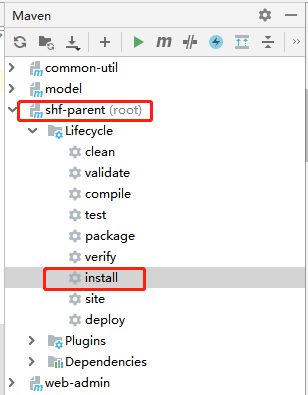

第二步：

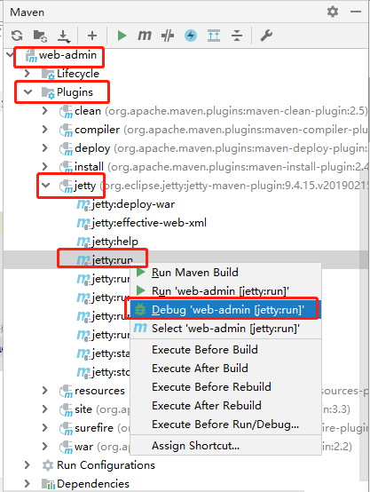

### 4.10、访问测试

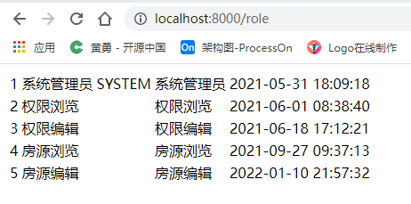

### 4.11、汇总

目前SSM环境我们已经搭建完成，完成了角色列表的测试，说明SSM搭建我们已经顺利完成