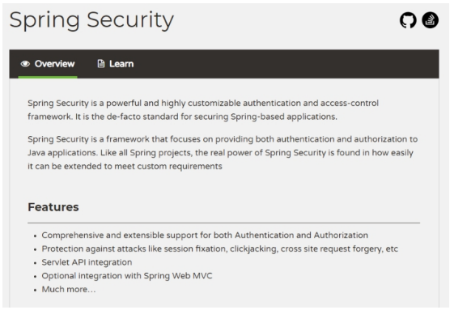
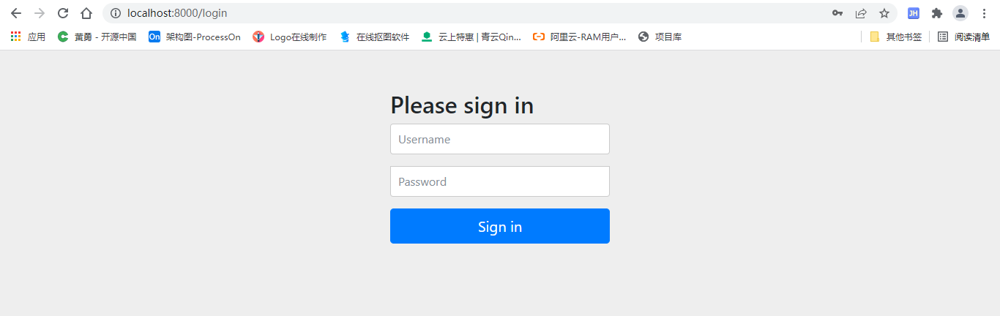
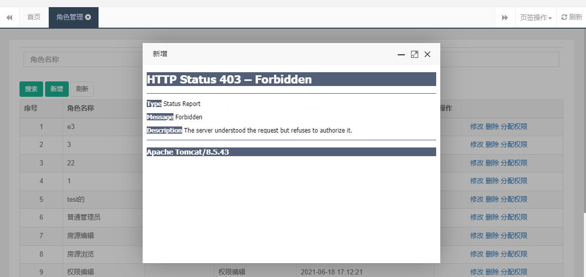
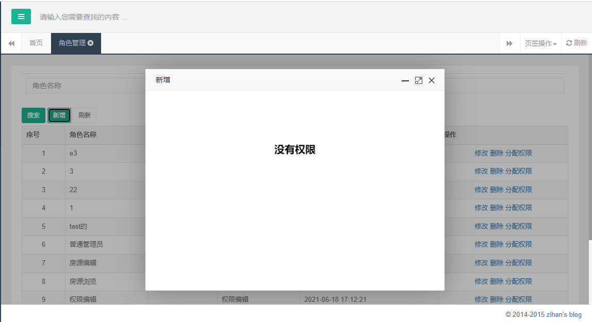
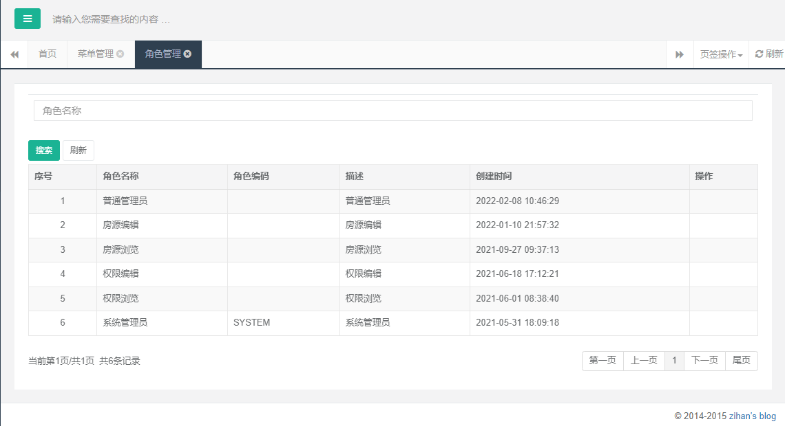

# 尚好房：Spring Security

## 一、Spring Security概念

前面我们已经完成了尚好房权限管理的部分相关功能，给用户分配角色，给角色分配权限，及左侧动态菜单，做好权限管理的数据准备，接下来我们要使用这些数据进行权限的相关控制。

### 1、认证和授权概念

现在我们需要思考2个问题：

***\*问题1\****：在生产环境下我们如果不登录后台系统就可以完成这些功能操作吗？

答案显然是否定的，要操作这些功能必须首先登录到系统才可以。（用户登录系统–>认证）

***\*问题2\****：是不是所有用户，只要登录成功就都可以操作所有功能呢？

答案是否定的，并不是所有的用户都可以操作这些功能。不同的用户可能拥有不同的权限，这就需要进行授权了。（用户登录之后，对每个用户进行授权，通过授权去访问系统中不同的功能–>授权）

***\*认证\****：系统提供的用于识别用户身份的功能，通常提供用户名和密码进行登录其实就是在进行认证，认证的目的是让系统知道你是谁。

***\*授权\****：用户认证成功后，需要为用户授权，其实就是指定当前用户可以操作哪些功能。

本章节就是要对后台系统进行权限控制，其本质就是对用户进行认证和授权。

### 2、Spring Security简介

Spring Security是 Spring提供的安全认证服务的框架。 使用Spring Security可以帮助我们来简化认证和授权的过程。

官网：https://spring.io/projects/spring-security/  

中文官网：https://www.w3cschool.cn/springsecurity/ 



对应的maven坐标：

```xml
<!-- spring security安全框架 -->
<dependency>
    <groupId>org.springframework.security</groupId>
    <artifactId>spring-security-web</artifactId>
    <version>5.2.7.RELEASE</version>
</dependency>
<dependency>
    <groupId>org.springframework.security</groupId>
    <artifactId>spring-security-config</artifactId>
    <version>5.2.7.RELEASE</version>
</dependency>
```

常用的权限框架除了Spring Security，还有Apache的shiro框架。

## 二、Spring Security集成与入门

### 1、引入依赖

#### 1.1、shf-parent添加版本管理

pom.xml

```xml
<spring.security.version>5.2.7.RELEASE</spring.security.version>
```

```xml
<!-- spring security安全框架 -->
<dependency>
    <groupId>org.springframework.security</groupId>
    <artifactId>spring-security-web</artifactId>
    <version>${spring.security.version}</version>
</dependency>
<dependency>
    <groupId>org.springframework.security</groupId>
    <artifactId>spring-security-config</artifactId>
    <version>${spring.security.version}</version>
</dependency>
```

#### 1.2、web-admin引入依赖

目前只是我们的后台管理系统需要授权与认证

pom.xml

```xml
<!-- spring security安全框架 -->
<dependency>
    <groupId>org.springframework.security</groupId>
    <artifactId>spring-security-web</artifactId>
</dependency>
<dependency>
    <groupId>org.springframework.security</groupId>
    <artifactId>spring-security-config</artifactId>
</dependency>
```

### 2、配置Spring Security Fillter

web.xml

```xml
<!-- SpringSecurity Filter -->
<!-- DelegatingFilterProxy用于整合第三方框架（代理过滤器，非真正的过滤器，真正的过滤器需要在spring的配置文件） -->
<filter>
  <filter-name>springSecurityFilterChain</filter-name>
  <filter-class>org.springframework.web.filter.DelegatingFilterProxy</filter-class>
</filter>
<filter-mapping>
  <filter-name>springSecurityFilterChain</filter-name>
  <url-pattern>/*</url-pattern>
</filter-mapping>
```

### 3、配置Spring Security

配置Spring Security有两种方式：

​	1、xml文件配置

​	2、java类配置

两种方式配置效果一致，当前我们使用java类配置，更加简洁

```java
package com.atguigu.config;

import org.springframework.context.annotation.Configuration;
import org.springframework.security.config.annotation.web.configuration.EnableWebSecurity;
import org.springframework.security.config.annotation.web.configuration.WebSecurityConfigurerAdapter;


@Configuration
@EnableWebSecurity //@EnableWebSecurity是开启SpringSecurity的默认行为
public class WebSecurityConfig extends WebSecurityConfigurerAdapter {

}
```

<font color='red'>注意：该配置类也需要被扫描</font>

### 4、测试

仅需三个步骤，我们就已经集成好了Spring Security，其他的事情就可以交给Spring Security为我们处理。

启动项目

访问：http://localhost:8000/



所有资源访问受限（包括静态资源）

url自动跳转到了一个默认的登录页面（框架自带的），我们目前没有定义login页面及login controller方法。

但是当前没有账号啊！下面我们测试一个最简单的内存分配用户名密码。

#### 4.1、内存分配用户名密码

操作类：WebSecurityConfig

重写configure(AuthenticationManagerBuilder auth)方法

```java
@Override
protected void configure(AuthenticationManagerBuilder auth) throws Exception {
    auth.inMemoryAuthentication()
            .withUser("lucy")
            .password(new BCryptPasswordEncoder().encode("123456"))
            .roles("");

}
```

请求：http://localhost:8000/

报错：`springsecurity There is no PasswordEncoder mapped for the id "null"`

需要设置加密方式

#### 4.2、设置加密方式

```java
/**
 * 必须指定加密方式，上下加密方式要一致
 * @return
 */
@Bean
public PasswordEncoder passwordEncoder(){
    return new BCryptPasswordEncoder();
}
```

登录成功，但是iframe部分页面不显示

#### 4.3、设置允许iframe嵌套显示

默认Spring Security不允许iframe嵌套显示，我们需要设置

```java
@Override
protected void configure(HttpSecurity http) throws Exception {
    //必须调用父类的方法，否则就不需要认证即可访问
    super.configure(http);
    //允许iframe嵌套显示
    //http.headers().frameOptions().disable();
    //允许iframe显示
    http.headers().frameOptions().sameOrigin();
}
```

到目前为止，我们通过内存分配用户名密码的方式，可以访问后台页面了。

## 三、Spring Security集成进阶

前面我们已经完成了Spring Security的入门级配置，通过Spring Security的使用，Spring Security将我们项目中的所有资源都保护了起来，要访问这些资源必须要完成认证才能够访问。

但是这个案例中的使用方法离我们真实生产环境还差很远，还存在如下一些问题：

1、项目中我们将所有的资源（所有请求URL）都保护起来，实际环境下往往有一些资源不需要认证也可以访问，也就是可以匿名访问。

2、登录页面是由框架生成的，而我们的项目往往会使用自己的登录页面。

3、直接将用户名和密码配置在了java程序中，而真实生产环境下的用户名和密码往往保存在数据库中。

现在我们需要对这些问题进行改进。

### 1、实现思路

1，使用指定的登录页面（login.html)

2，配置可匿名访问的资源(不需要登录权限和角色，就可以访问的资源，如：静态资源等)

3，从数据库查询用户信息

4，对密码进行加密

5，配置多种校验规则（对访问的页面做权限控制，按钮权限）

6，注解方式权限控制（对访问的Controller类中的方法做权限控制）

7，退出登录

### 2、登录基础设置

当前还是在上面的基础上进行调整，逐步改造为生成环境效果，每个步骤自行测试，不做说明

配置指定登录页面

修改configure方法

```java
@Override
protected void configure(HttpSecurity http) throws Exception {
    //允许iframe嵌套显示
    http.headers().frameOptions().disable();
    //登录设置
    http
            .authorizeRequests()
            .antMatchers("/static/**","/login").permitAll()  //允许匿名用户访问的路径
            .anyRequest().authenticated()    // 其它页面全部需要验证
            .and()
            .formLogin()
            .loginPage("/login")    //用户未登录时，访问任何需要权限的资源都转跳到该路径，即登录页面，此时登陆成功后会继续跳转到第一次访问的资源页面（相当于被过滤了一下）
            .defaultSuccessUrl("/") //登录认证成功后默认转跳的路径，意思时admin登录后也跳转到/user
            .and()
            .logout()
            .logoutUrl("/logout")   //退出登陆的路径，指定spring security拦截的注销url,退出功能是security提供的
            .logoutSuccessUrl("/login");//用户退出后要被重定向的url
    		.end()
            .csrf().disable();//关闭跨域请求伪造功能
}
```

我们对登录相关做了一个最基本的设置，每一个设置都有对应的备注。

### 3、定义登录页面

前面我们指定了登录页面为：/login，因此我们要去自定义该页面

页面模板：项目模板/hplus-master/login.html

页面完整代码：frame/login.html

说明：

1，Spring Security登录的默认用户名密码字段为：username、password，默认提交请求地址：/login，这样我们都不要去更改，如果更改的话需在上面的配置方法中更改。

2、用户名密码错误url会错误标识：error，可用作提示信息

```html
<!DOCTYPE html>
<html xmlns:th="http://www.thymeleaf.org">

<head th:include="common/head :: head"></head>

<body class="gray-bg">

    <div class="middle-box text-center loginscreen  animated fadeInDown">
        <div>
            <div>

                <h1 class="logo-name">房</h1>

            </div>
            <h3>欢迎使用 尚好房平台管理系统</h3>

            <form class="m-t" role="form" th:action="@{/login}" method="post">
                <label style="color:red;" th:if="${param.error}" th:text="用户名或密码错误"></label>
                <div class="form-group">
                    <input type="text" name="username" value="admin" class="form-control" placeholder="用户名" required="">
                </div>
                <div class="form-group">
                    <input type="password" name="password" value="123456" class="form-control" placeholder="密码" required="">
                </div>
                <button type="submit" class="btn btn-primary block full-width m-b">登 录</button>


                <p class="text-muted text-center"> <a href="javascript:"><small>忘记密码了？</small></a> | <a href="javascript:">注册一个新账号</a>
                </p>

            </form>
        </div>
    </div>

</body>

</html>
```

### 4、从数据库中查询用户信息

#### 4.1、注释掉内存分配用户名密码方法

```java
//    @Override
//    protected void configure(AuthenticationManagerBuilder auth) throws Exception {
//        auth.inMemoryAuthentication()
//                .withUser("user")
//                .password(new BCryptPasswordEncoder().encode("user"))
//                .roles("");
//
//    }
```

#### 4.2、定义根据用户名获取用户信息接口

##### 4.2.1、定义service接口

AdminService

```java
Admin getByUsername(String username);
```

##### 4.2.2、定义service接口实现

AdminServiceImpl

```java
@Override
public Admin getByUsername(String username) {
   return adminDao.getByUsername(username);
}
```

##### 4.2.3、dao层接口

AdminDao

```java
Admin getByUsername(String username);
```

##### 4.2.4、dao层xml

AdminDao.xml

```java
<select id="getByUsername" resultMap="Admin">
   select <include refid="columns" />
   from acl_admin
   where
   username = #{username}
   and is_deleted = 0
</select>
```

#### 4.3、实现UserDetailsService接口

Spring Security支持通过实现UserDetailsService接口的方式来提供用户认证授权信息

##### 4.3.1、新建UserDetailsServiceImpl类

```java
package com.atguigu.config;

import com.alibaba.dubbo.config.annotation.Reference;
import com.atguigu.entity.Admin;
import com.atguigu.service.AdminService;
import org.springframework.security.core.authority.AuthorityUtils;
import org.springframework.security.core.userdetails.User;
import org.springframework.security.core.userdetails.UserDetails;
import org.springframework.security.core.userdetails.UserDetailsService;
import org.springframework.security.core.userdetails.UsernameNotFoundException;
import org.springframework.stereotype.Component;


@Component
public class UserDetailsServiceImpl implements UserDetailsService {

    @Reference
    private AdminService adminService;

    @Override
    public UserDetails loadUserByUsername(String username) throws UsernameNotFoundException {
        System.out.println("username----->"+username);
        Admin admin = adminService.getByUsername(username);
        if(null == admin) {
            throw new UsernameNotFoundException("用户名不存在！");
        }
        return new User(username,admin.getPassword(),
                AuthorityUtils.commaSeparatedStringToAuthorityList(""));
    }
}
```

##### 4.3.2、调整添加用户设置密码

前面添加用户是我们没有对密码进行加密处理，现在改造。删除未加密的数据记录，重新创建用户信息

修改AdminController类save方法

```java
@Autowired
private PasswordEncoder passwordEncoder;
```

```java
@PostMapping("/save")
public String save(Admin admin, HttpServletRequest request) {
   admin.setPassword(passwordEncoder.encode(admin.getPassword()));
   //设置默认头像
   admin.setHeadUrl("http://47.93.148.192:8080/group1/M00/03/F0/rBHu8mHqbpSAU0jVAAAgiJmKg0o148.jpg");
   adminService.insert(admin);
   
   return this.successPage(this.MESSAGE_SUCCESS, request);
}
```

#### 4.4、获取当前用户

上面实现了数据库中校验用户名密码，登录成功后怎么获取用户信息呢？

```java
Authentication authentication = SecurityContextHolder.getContext().getAuthentication();
User user = (User)authentication.getPrincipal();
```

User为：org.springframework.security.core.userdetails.User

这样就能获取到当前登录用户的信息，我们可以定义一个controller方法，获取当前用户信息，便于获取。

在IndexController类定义方法

```java
/**
 * 获取当前登录信息
 * @return
 */
@GetMapping("getInfo")
@ResponseBody
public Object getInfo() {
    Authentication authentication = SecurityContextHolder.getContext().getAuthentication();
    
    return authentication.getPrincipal();
}
```

登录成功后访问：http://localhost:8080/getInfo

{
    "accountNonExpired": true,
    "accountNonLocked": true,
    "authorities": [],
    "credentialsNonExpired": true,
    "enabled": true,
    "username": "admin"
}

#### 4.5、更改左侧菜单权限方法

之前获取左侧菜单我们是写死了的，目前可以动态获取当前用户了

```java
/**
 * 框架首页
 *
 * @return
 */
@GetMapping("/")
public String index(ModelMap model) {
    //后续替换为当前登录用户id
    Authentication authentication = SecurityContextHolder.getContext().getAuthentication();
    User user = (User)authentication.getPrincipal();
    Admin admin = adminService.getByUsername(user.getUsername());
    List<Permission> permissionList = permissionService.findMenuPermissionByAdminId(admin.getId());
    model.addAttribute("admin", admin);
    model.addAttribute("permissionList",permissionList);
    return PAGE_INDEX;
}
```

### 5、用户授权

前面我们使用了用户认证，现在我们要实现用户授权，即：哪些controller方法可以访问，哪些不能访问，哪些页面按钮显示，哪些不显示。

首先我们要告诉Spring Security当前用户有哪些权限。

#### 5.1、获取用户权限

##### 5.1.1、定义service接口

PermissionService

```java
/**
 *  获取用户功能权限
 * @param adminId
 * @return
 */
List<String> findCodeListByAdminId(Long adminId);
```

##### 5.1.2、定义service接口实现

PermissionServiceImpl

```java
@Override
public List<String> findCodeListByAdminId(Long adminId) {
   //超级管理员admin账号id为：1
   if(adminId.longValue() == 1) {
      return permissionDao.findAllCodeList();
   }
   return permissionDao.findCodeListByAdminId(adminId);
}
```

##### 5.1.2、dao层接口

PermissionDao

```java
List<String> findAllCodeList();

List<String> findCodeListByAdminId(Long adminId);
```

##### 5.1.2、dao层xml

PermissionDao.xml

```xml
<select id="findAllCodeList" resultType="String">
       select
   code
   from acl_permission
   where
   type =2
   and is_deleted = 0
   </select>

<select id="findCodeListByAdminId" resultType="String">
       select
   distinct c.code
   from acl_admin_role a
   inner join acl_role_permission b on b.role_id = a.role_id
   inner join acl_permission c on c.id = b.permission_id
   where
   a.admin_id = #{adminId}
   and c.type =2
   and a.is_deleted = 0
   and b.is_deleted = 0
   and c.is_deleted = 0
   </select>
```

#### 5.2、设置用户权限

修改UserDetailsServiceImpl类

```java
@Reference
private PermissionService permissionService;
```

```java
@Override
public UserDetails loadUserByUsername(String username) throws UsernameNotFoundException {
    System.out.println("username----->"+username);
    Admin admin = adminService.getByUsername(username);
    if(null == admin) {
        throw new UsernameNotFoundException("用户名不存在！");
    }

    //用户功能权限
    List<String> codeList = permissionService.findCodeListByAdminId(admin.getId());
    Collection<GrantedAuthority> authorities = new ArrayList<>();
    for(String code : codeList) {
        if(StringUtils.isEmpty(code)) continue;
        SimpleGrantedAuthority authority = new SimpleGrantedAuthority(code);
        authorities.add(authority);
    }
    return new User(username,admin.getPassword(),authorities);
}
```

#### 5.3、测试

重启服务

登录成功后访问：http://localhost:8080/getInfo

目前authorities参数里面就有我们的权限值了，怎么使用呢？

#### 5.4、controller方法权限控制

前面Spring Security已经加载了功能权限数据，下面我们来看使用

##### 5.4.1、开启controller方法权限控制

WebSecurityConfig类添加开启标签

```java
@EnableGlobalMethodSecurity(prePostEnabled = true)
```

##### 5.4.2、controller方法添加权限注解

以角色管理增删改查等为例

RoleController

功能权限数据我们已经配置到数据库表，自行查看

```java
/**
 * 列表
 * @param model
 * @param request
 * @return
 */
@PreAuthorize("hasAuthority('role.show')")
   @RequestMapping
   public String index(ModelMap model, HttpServletRequest request) {
       Map<String,Object> filters = getFilters(request);
       PageInfo<Role> page = roleService.findPage(filters);

       model.addAttribute("page", page);
       model.addAttribute("filters", filters);
       return PAGE_INDEX;
   }

/**
 * 进入新增
 * @param model
 * @return
 */
@PreAuthorize("hasAuthority('role.create')")
@GetMapping("/create")
public String create(ModelMap model) {
   return PAGE_CREATE;
}

/**
 * 保存新增
 * @param role
 * @param request
 * @return
 */
@PreAuthorize("hasAuthority('role.create')")
@PostMapping("/save")
public String save(Role role) {
   roleService.insert(role);
       return PAGE_SUCCESS;
}

/**
 * 编辑
 * @param model
 * @param id
 * @return
 */
@PreAuthorize("hasAuthority('role.edit')")
@GetMapping("/edit/{id}")
public String edit(ModelMap model,@PathVariable Long id) {
   Role role = roleService.getById(id);
   model.addAttribute("role",role);
   return PAGE_EDIT;
}

/**
 * 保存更新
 * @param id
 * @param role
 * @param request
 * @return
 */
@PreAuthorize("hasAuthority('role.edit')")
@PostMapping(value="/update")
public String update(Role role) {
   roleService.update(role);
       return PAGE_SUCCESS;
}

/**
 * 删除
 * @param id
 * @return
 */
@PreAuthorize("hasAuthority('role.delete')")
@GetMapping("/delete/{id}")
public String delete(@PathVariable Long id) {
   roleService.delete(id);
   return LIST_ACTION;
}

/**
 * 进入分配权限页面
 * @param roleId
 * @return
 */
@PreAuthorize("hasAuthority('role.assgin')")
@GetMapping("/assignShow/{roleId}")
public String assignShow(ModelMap model,@PathVariable Long roleId) {
   List<Map<String,Object>> zNodes = permissionService.findPermissionByRoleId(roleId);
   model.addAttribute("zNodes", JSON.toJSONString(zNodes));
   model.addAttribute("roleId", roleId);
   return PAGE_ASSGIN_SHOW;
}

/**
 * 给角色分配权限
 * @param roleId
 * @param permissionIds
 * @return
 */
@PreAuthorize("hasAuthority('role.assgin')")
@PostMapping("/assignPermission")
public String assignPermission(Long roleId,Long[] permissionIds) {
   permissionService.saveRolePermissionRealtionShip(roleId, permissionIds);
   return PAGE_SUCCESS;
}
```

##### 5.4.3、测试

目前已admin登录，这些权限都有，点击角色管理相关功能都能正常访问。

切换用户，只分配角色查看权限，退出登录，查看角色相关功能。



不能访问了，提示403错误状态，表示没有访问权限。

##### 5.4.4、友好提示

上面这样提示很不友好，我们自定义提示页面。

###### 5.4.4.1、定义页面

1、IndexController添加方法

```java
private final static String PAGE_AUTH     = "frame/auth";
```

```java
@GetMapping("/auth")
public String auth() {
    return PAGE_AUTH;
}
```

2、frame添加页面auth.html

```html
<!DOCTYPE html>
<html>
<head>
</head>
<body style="position: relative;">
<div style="text-align:center;margin-top: 100px;font-size: 20px;">
    <strong>没有权限</strong>
</div>
</body>
</html>
```

###### 5.4.4.2、实现AccessDeniedHandler接口

```java
package com.atguigu.config;

import org.springframework.security.access.AccessDeniedException;
import org.springframework.security.web.access.AccessDeniedHandler;

import javax.servlet.ServletException;
import javax.servlet.http.HttpServletRequest;
import javax.servlet.http.HttpServletResponse;
import java.io.IOException;

/**
 * 未授权的统一处理方式
 *
 */
public class CustomAccessDeineHandler implements AccessDeniedHandler {

    @Override
    public void handle(HttpServletRequest request, HttpServletResponse response,
                       AccessDeniedException accessDeniedException) throws IOException {
        response.sendRedirect("/auth");
    }

}
```

###### 5.4.4.3、配置AccessDeniedHandler接口实现类

//配置异常类
http.exceptionHandling().accessDeniedHandler(new CustomAccessDeineHandler());

```java
@Override
protected void configure(HttpSecurity http) throws Exception {
    //允许iframe嵌套显示
    http.headers().frameOptions().disable();
    //登录设置
    http
            .authorizeRequests()
            .antMatchers("/static/**","/login").permitAll()  //允许匿名用户访问的路径
            .anyRequest().authenticated()    // 其它页面全部需要验证
            .and()
            .formLogin()
            .loginPage("/login")    //用户未登录时，访问任何需要权限的资源都转跳到该路径，即登录页面，此时登陆成功后会继续跳转到第一次访问的资源页面（相当于被过滤了一下）
            .defaultSuccessUrl("/") //登录认证成功后默认转跳的路径，意思时admin登录后也跳转到/user
            .and()
            .logout()
            .logoutUrl("/logout")   //退出登陆的路径，指定spring security拦截的注销url,退出功能是security提供的
            .logoutSuccessUrl("/login");//用户退出后要被重定向的url
    		.end()
    		.csrf().disable();//关闭跨域请求伪造功能

    //添加自定义异常入口
    http.exceptionHandling().accessDeniedHandler(new CustomAccessDeineHandler());
}
```

###### 5.4.4.4、测试

测试成功



#### 5.5、页面功能按钮权限控制

上面我们完成了controller层方法的权限，现在我们要控制页面按钮的权限，如：角色管理上面只有查看权限，那么页面新增、修改、删除、分配权限按都不显示。

怎么实现呢？其实Spring Security已经给我们封装好了标签库，我们直接使用即可。

##### 5.5.1、shf-parent添加依赖管理

pom.xml

```xml
<thymeleaf-springsecurity5.version>3.0.4.RELEASE</thymeleaf-springsecurity5.version>
```

```xml
<!--用于springsecurity5标签-->
<dependency>
    <groupId>org.thymeleaf.extras</groupId>
    <artifactId>thymeleaf-extras-springsecurity5</artifactId>
    <version>${thymeleaf-springsecurity5.version}</version>
</dependency>
```

##### 5.5.2、web-admin引入依赖

pom.xml

```xml
<!--用于springsecurity5标签-->
<dependency>
    <groupId>org.thymeleaf.extras</groupId>
    <artifactId>thymeleaf-extras-springsecurity5</artifactId>
</dependency>
```

##### 5.5.3、模板引擎配置spring security 标签支持

修改spring-mvc.xml，在模板引擎配置spring security 标签支持

```xml
<!--配置模板引擎-->
<bean id="templateEngine" class="org.thymeleaf.spring5.SpringTemplateEngine">
    <!--引用视图解析器-->
    <property name="templateResolver" ref="templateResolver"></property>
    <!-- 添加spring security 标签支持：sec -->
    <property name="additionalDialects">
        <set>
            <bean class="org.thymeleaf.extras.springsecurity5.dialect.SpringSecurityDialect" />
        </set>
    </property>
</bean>
```

##### 5.5.4、页面按钮控制

以角色管理为例。

使用标签：sec:authorize="hasAuthority('')"与controller层一一对应

1、在html文件里面申明使用spring-security标签

```html
<html xmlns:th="http://www.thymeleaf.org"
      xmlns:sec="http://www.thymeleaf.org/extras/spring-security">
```

2、按钮上使用标签

```html
<button type="button" class="btn btn-sm btn-primary create" sec:authorize="hasAuthority('role.create')">新增</button>
```

```html
<a class="edit" th:attr="data-id=${item.id}" sec:authorize="hasAuthority('role.edit')">修改</a>
<a class="delete" th:attr="data-id=${item.id}" sec:authorize="hasAuthority('role.delete')">删除</a>
<a class="assgin" th:attr="data-id=${item.id}" sec:authorize="hasAuthority('role.assgin')">分配权限</a>
```

3、完整代码

```html
<!DOCTYPE html>
<html xmlns:th="http://www.thymeleaf.org"
      xmlns:sec="http://www.thymeleaf.org/extras/spring-security">
<head th:include="common/head :: head"></head>
<body class="gray-bg">
<form id="ec" th:action="@{/role}" method="post">
    <div class="wrapper wrapper-content animated fadeInRight">
        <div class="row">
            <div class="col-sm-12">
                <div class="ibox float-e-margins">
                    <div class="ibox-content">
                        <table class="table form-table margin-bottom10">
                            <tr>
                                <td>
                                    <input type="text" name="roleName" th:value="${#maps.containsKey(filters, 'roleName')} ? ${filters.roleName} : ''" placeholder="角色名称" class="input-sm form-control"/>
                                </td>
                            </tr>
                        </table>
                        <div>
                            <button type="submit" class="btn btn-sm btn-primary"> 搜索</button>
                            <button type="button" class="btn btn-sm btn-primary create" sec:authorize="hasAuthority('role.create')">新增</button>
                            <button type="button" id="loading-example-btn" onclick="javascript:window.location.reload();" class="btn btn-white btn-sm">刷新</button>
                        </div>
                        <table class="table table-striped table-bordered table-hover dataTables-example">
                            <thead>
                            <tr>
                                <th>序号</th>
                                <th>角色名称</th>
                                <th>角色编码</th>
                                <th>描述</th>
                                <th>创建时间</th>
                                <th>操作 </th>
                            </tr>
                            </thead>
                            <tbody>
                            <tr class="gradeX" th:each="item,it : ${page.list}">
                                <td class="text-center" th:text="${it.count}">11</td>
                                <td th:text="${item.roleName}">22</td>
                                <td th:text="${item.roleCode}">33</td>
                                <td th:text="${item.description}">33</td>
                                <td th:text="${#dates.format(item.createTime,'yyyy-MM-dd HH:mm:ss')}" >33</td>
                                <td class="text-center">
                                    <a class="edit" th:attr="data-id=${item.id}" sec:authorize="hasAuthority('role.edit')">修改</a>
                                    <a class="delete" th:attr="data-id=${item.id}" sec:authorize="hasAuthority('role.delete')">删除</a>
                                    <a class="assgin" th:attr="data-id=${item.id}" sec:authorize="hasAuthority('role.assgin')">分配权限</a>
                                </td>
                            </tr>
                            </tbody>
                        </table>
                        <div class="row" th:include="common/pagination :: pagination"></div>
                    </div>
                </div>
            </div>
        </div>
    </div>
</form>
<script th:inline="javascript">
    $(function(){
        $(".create").on("click",function () {
            opt.openWin("/role/create","新增",580,430);
        });
        $(".edit").on("click",function () {
            var id = $(this).attr("data-id");
            opt.openWin('/role/edit/' + id,'修改',580,430);
        });
        $(".delete").on("click",function(){
            var id = $(this).attr("data-id");
            opt.confirm('/role/delete/'+id);
        });
        $(".assgin").on("click",function () {
            var id = $(this).attr("data-id");
            opt.openWin("/role/assignShow/"+id,'修改',580,430);
        });
    });
</script>
</body>
</html>
```

##### 5.5.5、测试

按钮消失



#### 5.6、配置功能权限

根据acl_permission表数据，参考角色管理配置controller层及页面权限。

