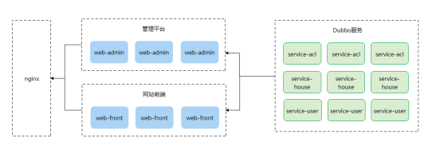
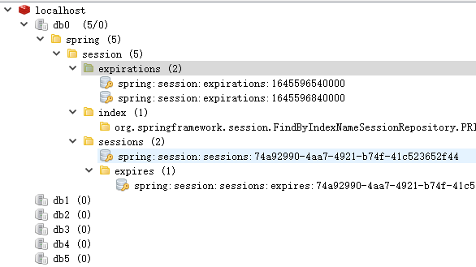

# 尚好房：Session共享

## 一、业务介绍

当前我们的服务都是单独部署，web-admin与web-front都使用了session保存当前用户信息，不存在session问题，在生成环境我们的服务都会集群部署多份，如图：



这时就会出现session问题，如果解决呢？session共享

### 1、Session共享方案

Session是服务器用来保存用户操作的一系列会话信息，由Web容器进行管理。单机情况下，不存在Session共享的情况，分布式情况下，如果不进行Session共享会出现请求落到不同机器要重复登录的情况，一般来说解决Session共享有以下几种方案

#### 1.1、session复制

session复制是早期的企业级的使用比较多的一种服务器集群session管理机制。应用服务器开启web容器的session复制功能，在集群中的几台服务器之间同步session对象，使得每台服务器上都保存所有的session信息，这样任何一台宕机都不会导致session的数据丢失，服务器使用session时，直接从本地获取。

这种方式在应用集群达到数千台的时候，就会出现瓶颈，每台都需要备份session，出现内存不够用的情况。

#### 1.2、session绑定

利用hash算法，比如nginx的ip_hash,使得同一个Ip的请求分发到同一台服务器上。

这种方式不符合对系统的高可用要求，因为一旦某台服务器宕机，那么该机器上的session也就不复存在了，用户请求切换到其他机器后没有session，无法完成业务处理。

#### 1.3、利用cookie记录session

session记录在客户端，每次请求服务器的时候，将session放在请求中发送给服务器，服务器处理完请求后再将修改后的session响应给客户端。这里的客户端就是cookie。

利用cookie记录session的也有缺点，比如受cookie大小的限制，能记录的信息有限；每次请求响应都需要传递cookie，影响性能，如果用户关闭cookie，访问就不正常。

cookie的简单易用，可用性高，支持应用服务器的线性伸缩，而大部分要记录的session信息比较小，因此事实上，许多网站或多或少的在使用cookie记录session。

#### 1.4、session服务器

session服务器可以解决上面的所有的问题，利用独立部署的session服务器（集群）统一管理session，服务器每次读写session时，都访问session服务器。

### 2、Spring Session

#### 2.1、Session共享原理

用户第一次访问应用时，应用会创建一个新的 Session，并且会将 Session 的 ID 作为 Cookie 缓存在浏览器，下一次访问时请求的头部中带着该 Cookie，应用通过获取的 Session ID 进行查找，如果该 Session 存在且有效，则继续该请求，如果 Cookie 无效或者 Session 无效，则会重新生成一个新的 Session
在普通的 JavaEE 应用中，Session 信息放在内存中，当容器（如 Tomcat）关闭后，内存中的 Session 被销毁；重启后如果当前用户再去访问对应的是一个新的 Session ，在多实例中无法共享，一个用户只能访问指定的实例才能使用相同的 Session；
Session 共享实现的原理是将原来内存中的 Session 放在一个需要共享 Session 的实例都可以访问到的位置，如数据库，Redis 中等，从而实现多实例 Session 共享
实现共享后，只要浏览器的 Cookie 中的 Session ID 没有改变，多个实例中的任意一个被销毁不会影响用户访问。

#### 2.2、Spring Session共享原理

当请求进来的时候，SessionRepositoryFilter 会先拦截到请求，将 request 和 response 对象转换成 SessionRepositoryRequestWrapper 和 SessionRepositoryResponseWrapper 。后续当第一次调用 request 的getSession方法时，会调用到 SessionRepositoryRequestWrapper 的`getSession`方法。这个方法是被从写过的，逻辑是先从 request 的属性中查找，如果找不到；再查找一个key值是"SESSION"的 Cookie，通过这个 Cookie 拿到 SessionId 去 Redis 中查找，如果查不到，就直接创建一个RedisSession 对象，同步到 Redis 中。

说的简单点就是：拦截请求，将之前在服务器内存中进行 Session 创建销毁的动作，改成在 Redis 中创建。

## 二、Spring Session集成

我们以web-admin为例，web-front实现方式一样。

### 1、shf-parent添加版本管理

pom.xml

```xml
<redis-session.version>1.3.5.RELEASE</redis-session.version>
```

```xml
<!--spring-session 同步-->
<dependency>
    <groupId>org.springframework.session</groupId>
    <artifactId>spring-session-data-redis</artifactId>
    <version>${redis-session.version}</version>
</dependency>
```

### 2、web引入依赖

```xml
<!--spring-session 同步-->
<dependency>
    <groupId>org.springframework.session</groupId>
    <artifactId>spring-session-data-redis</artifactId>
</dependency>
```

### 3、添加配置

spring/spring-redis.xml

```xml
<?xml version="1.0" encoding="UTF-8"?>
<beans xmlns="http://www.springframework.org/schema/beans"
       xmlns:xsi="http://www.w3.org/2001/XMLSchema-instance"
       xsi:schemaLocation="http://www.springframework.org/schema/beans
                         http://www.springframework.org/schema/beans/spring-beans.xsd">

    <!--Jedis连接池的相关配置-->
    <bean id="jedisPoolConfig" class="redis.clients.jedis.JedisPoolConfig">
        <!--最大连接数, 默认8个-->
        <property name="maxTotal" value="100"></property>
        <!--最大空闲连接数, 默认8个-->
        <property name="maxIdle" value="50"></property>
        <!--允许借调 在获取连接的时候检查有效性, 默认false-->
        <property name="testOnBorrow" value="true"/>
        <!--允许归还 在return给pool时，是否提前进行validate操作-->
        <property name="testOnReturn" value="true"/>
    </bean>
    <!--配置JedisConnectionFactory-->
    <bean id="connectionFactory" class="org.springframework.data.redis.connection.jedis.JedisConnectionFactory">
        <property name="hostName" value="192.168.6.100"/>
        <property name="port" value="6379"/>
        <property name="database" value="0"/>
        <property name="poolConfig" ref="jedisPoolConfig"/>
    </bean>
    <!-- 配置session共享 -->
    <bean id="redisHttpSessionConfiguration"
          class="org.springframework.session.data.redis.config.annotation.web.http.RedisHttpSessionConfiguration">
        <property name="maxInactiveIntervalInSeconds" value="600" />
    </bean>
</beans>
```

### 4、spring-mvc.xml引入配置

```xml
<import resource="spring-redis.xml"></import>
```

### 5、添加session共享过滤器

web.xml

该过滤器必须是第一个过滤器，所有的请求经过该过滤器后执行后续操作

```xml
<!-- spring session共享filter -->
<!-- 该过滤器必须是第一个过滤器，所有的请求经过该过滤器后执行后续操作 -->
<filter>
  <filter-name>springSessionRepositoryFilter</filter-name>
  <filter-class>org.springframework.web.filter.DelegatingFilterProxy</filter-class>
</filter>
<filter-mapping>
  <filter-name>springSessionRepositoryFilter</filter-name>
  <url-pattern>/*</url-pattern>
</filter-mapping>
```

web.xml完整配置：

```xml
<?xml version="1.0" encoding="UTF-8"?>
<web-app xmlns:xsi="http://www.w3.org/2001/XMLSchema-instance"
         xmlns="http://java.sun.com/xml/ns/javaee"
         xsi:schemaLocation="http://java.sun.com/xml/ns/javaee http://java.sun.com/xml/ns/javaee/web-app_3_0.xsd"
         id="WebApp_ID" version="3.0">
  <display-name>web</display-name>

  <!-- spring session共享filter -->
  <!-- 该过滤器必须是第一个过滤器，所有的请求经过该过滤器后执行后续操作 -->
  <filter>
    <filter-name>springSessionRepositoryFilter</filter-name>
    <filter-class>org.springframework.web.filter.DelegatingFilterProxy</filter-class>
  </filter>
  <filter-mapping>
    <filter-name>springSessionRepositoryFilter</filter-name>
    <url-pattern>/*</url-pattern>
  </filter-mapping>

  <!-- 解决post乱码 添加字符编码过滤器 -->
  <filter>
    <filter-name>encode</filter-name>
    <filter-class>org.springframework.web.filter.CharacterEncodingFilter</filter-class>
    <init-param>
      <param-name>encoding</param-name>
      <param-value>UTF-8</param-value>
    </init-param>
    <init-param>
      <param-name>forceRequestEncoding</param-name>
      <param-value>true</param-value>
    </init-param>
    <init-param>
      <param-name>forceResponseEncoding</param-name>
      <param-value>true</param-value>
    </init-param>
  </filter>
  <filter-mapping>
    <filter-name>encode</filter-name>
    <url-pattern>/*</url-pattern>
  </filter-mapping>

  <!-- SpringSecurity Filter -->
  <!-- DelegatingFilterProxy用于整合第三方框架（代理过滤器，非真正的过滤器，真正的过滤器需要在spring的配置文件） -->
  <filter>
    <filter-name>springSecurityFilterChain</filter-name>
    <filter-class>org.springframework.web.filter.DelegatingFilterProxy</filter-class>
  </filter>
  <filter-mapping>
    <filter-name>springSecurityFilterChain</filter-name>
    <url-pattern>/*</url-pattern>
  </filter-mapping>

  <!-- 配置SpringMVC框架前端控制器 -->
  <servlet>
    <servlet-name>springMVC</servlet-name>
    <servlet-class>org.springframework.web.servlet.DispatcherServlet</servlet-class>
    <init-param>
      <param-name>contextConfigLocation</param-name>
      <param-value>classpath:spring/spring-mvc.xml</param-value>
    </init-param>
    <load-on-startup>1</load-on-startup>
  </servlet>
  <servlet-mapping>
    <servlet-name>springMVC</servlet-name>
    <url-pattern>/</url-pattern>
  </servlet-mapping>

</web-app>
```

### 5、测试

重启项目

访问：http://localhost:8000/，登录。

通过redis客户端查看redis数据，如下：



说明：session成功同步到redis数据库中。

再次测试：

​	1、再次重启web-admin

​	2、再次访问：访问：http://localhost:8000/，页面不会跳转到登录页面，测试成功

说明：如果session没有同步到redis，那么再次重启，session信息已经清空，就会再次跳转登录，当前没有跳转登录，说明我们的session信息保存到redis。