# 尚好房：用户角色管理

## 一、功能介绍

### 1、用户管理

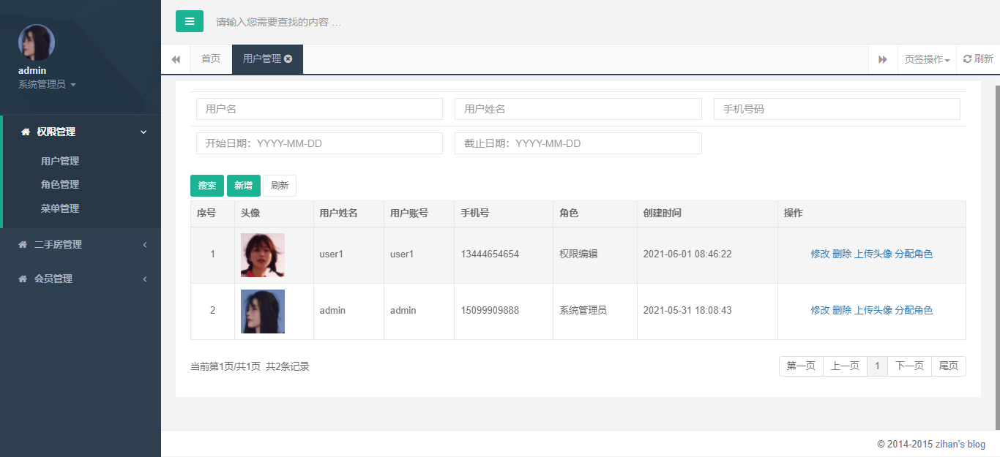

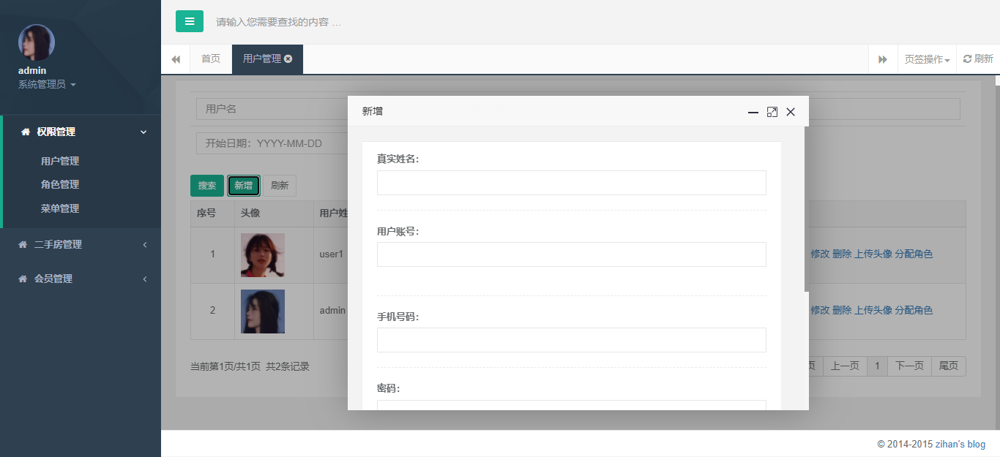

### 2、角色管理

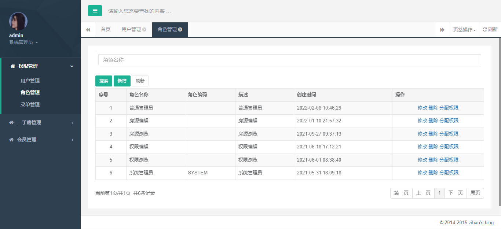

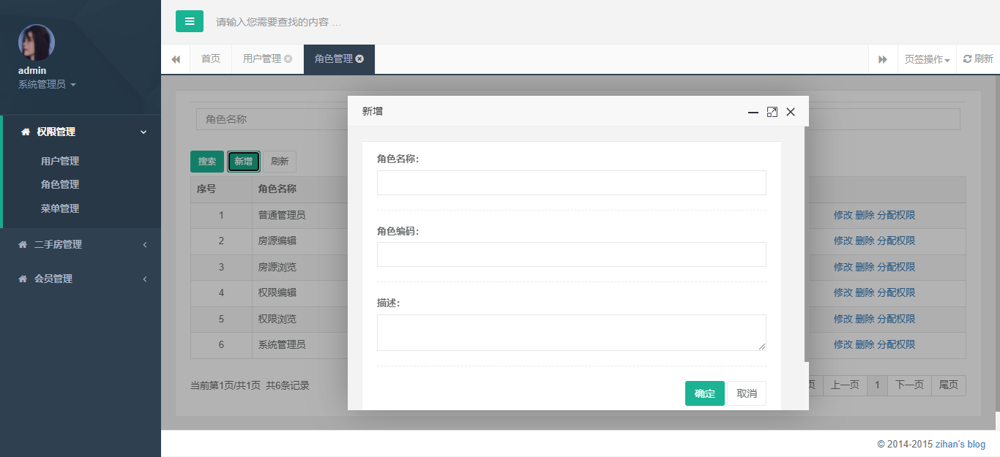

## 二、后台前端框架

### 1、后台框架选择

后台前端框架模板：Hplus

下载地址：https://gitee.com/hplus_admin/hplus

资料文件中已下载，可以直接使用

### 2、模板页面

1、主页


2、表单页面

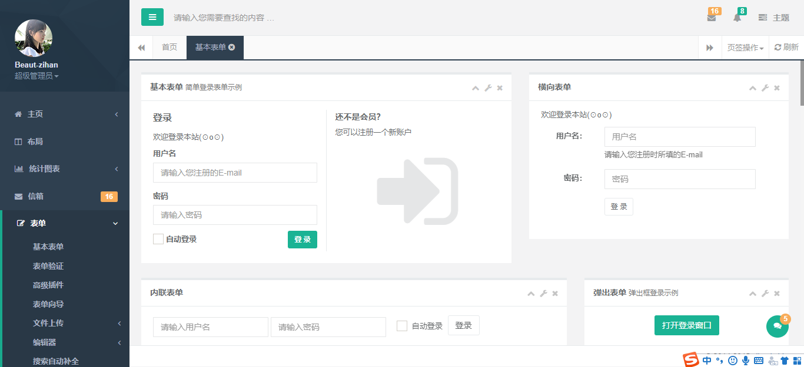

3、表格

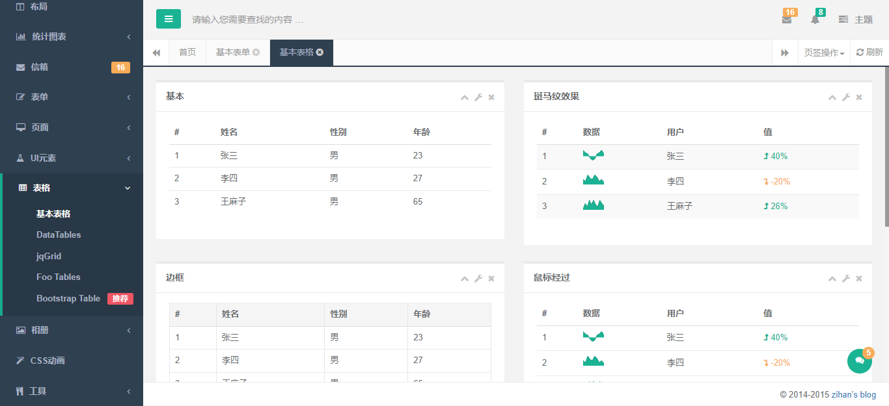

说明：我们需要的后台模板基本都包含

### 3、集成框架

#### 3.1、添加框架静态资源

1、在web-admin模块webapps下新建static文件夹，用于存放静态资源文件

2、复制Hplus静态资源到static文件夹

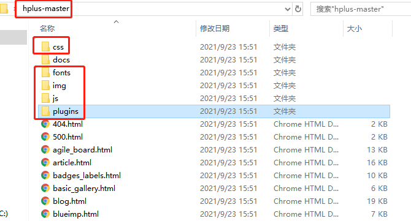


3、项目如图

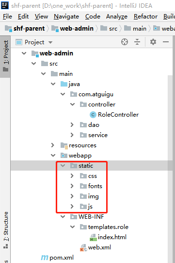

#### 3.2、添加框架主页面

1、在templates目录新建frame文件夹，用于存放框架相关页面

2、复制hplus-master文件夹index.html文件到frame文件夹

3、删除index.html无用代码，更改静态资源与图片路径，代码如下

index.html

```html
<!DOCTYPE html>
<html xmlns:th="http://www.thymeleaf.org">
   <head>
      <meta charset="utf-8" />
      <meta name="viewport" content="width=device-width, initial-scale=1.0" />
      <meta name="renderer" content="webkit" />

      <title>尚好房平台管理系统</title>

      <meta name="keywords" content="尚好房平台管理系统,后台HTML,响应式后台" />
      <meta name="description" content="尚好房平台管理系统,后台HTML,响应式后台" />

      <!--[if lt IE 9]>
         <meta http-equiv="refresh" content="0;ie.html" />
      <![endif]-->

      <link rel="shortcut icon" th:href="@{/static/favicon.ico}" />
      <link th:href="@{/static/css/bootstrap.min.css?v=3.3.7}" rel="stylesheet" />
      <link th:href="@{/static/css/font-awesome.min.css?v=4.4.0}" rel="stylesheet" />
      <link th:href="@{/static/css/animate.css}" rel="stylesheet" />
      <link th:href="@{/static/css/style.css?v=4.1.0}" rel="stylesheet" />
      <link th:href="@{/static/css/jquery.contextMenu.min.css}" rel="stylesheet"/>
   </head>

   <body class="fixed-sidebar full-height-layout gray-bg" style="overflow: hidden;">
      <div id="wrapper">
         <!--左侧导航开始-->
         <nav class="navbar-default navbar-static-side" role="navigation">
            <div class="nav-close"><i class="fa fa-times-circle"></i></div>
            <div class="sidebar-collapse">
               <ul class="nav" id="side-menu">
                  <li class="nav-header">
                     <div class="dropdown profile-element">
                        <span></span>
                        <a data-toggle="dropdown" class="dropdown-toggle" href="#">
                           <span class="clear">
                              <span class="block m-t-xs"><strong class="font-bold">Beaut-zihan</strong></span>
                              <span class="text-muted text-xs block">超级管理员<b class="caret"></b></span>
                           </span>
                        </a>
                        <ul class="dropdown-menu animated fadeInRight m-t-xs">
                           <li><a class="J_menuItem" href="javascript:">修改头像</a></li>
                           <li><a class="J_menuItem" href="javascript:">个人资料</a></li>
                           <li><a class="J_menuItem" href="javascript:">联系我们</a></li>
                           <li><a class="J_menuItem" href="javascript:">信箱</a></li>
                           <li class="divider"></li>
                           <li><a href="/logout">安全退出</a></li>
                        </ul>
                     </div>
                     <div class="logo-element">H+</div>
                  </li>
                  <li>
                     <a href="#">
                        <i class="fa fa-home"></i>
                        <span class="nav-label">主页</span>
                        <span class="fa arrow"></span>
                     </a>
                     <ul class="nav nav-second-level">
                        <li>
                           <a class="J_menuItem" href="index_v1.html" data-index="0">主页示例一</a>
                        </li>
                        <li>
                           <a class="J_menuItem" href="index_v2.html">主页示例二</a>
                        </li>
                        <li>
                           <a class="J_menuItem" href="index_v3.html">主页示例三</a>
                        </li>
                        <li>
                           <a class="J_menuItem" href="index_v4.html">主页示例四</a>
                        </li>
                        <li>
                           <a href="index_v5.html" target="_blank">主页示例五</a>
                        </li>
                     </ul>
                  </li>
               </ul>
            </div>
         </nav>
         <!--左侧导航结束-->
         <!--右侧部分开始-->
         <div id="page-wrapper" class="gray-bg dashbard-1">
            <div class="row border-bottom">
               <nav class="navbar navbar-static-top" role="navigation" style="margin-bottom: 0;">
                  <div class="navbar-header">
                     <a class="navbar-minimalize minimalize-styl-2 btn btn-primary" href="#"><i class="fa fa-bars"></i> </a>
                     <form role="search" class="navbar-form-custom" method="post" action="search_results.html">
                        <div class="form-group">
                           <input type="text" placeholder="请输入您需要查找的内容 …" class="form-control" name="top-search" id="top-search" />
                        </div>
                     </form>
                  </div>
               </nav>
            </div>
            <div class="row content-tabs">
               <button class="roll-nav roll-left J_tabLeft"><i class="fa fa-backward"></i></button>
               <nav class="page-tabs J_menuTabs">
                  <div class="page-tabs-content">
                     <a href="javascript:;" class="active J_menuTab" data-id="index_v1.html">首页</a>
                  </div>
               </nav>
               <button class="roll-nav roll-right J_tabRight"><i class="fa fa-forward"></i></button>
               <div class="btn-group roll-nav roll-right">
                  <button class="dropdown" data-toggle="dropdown">页签操作<span class="caret"></span></button>
                  <ul role="menu" class="dropdown-menu dropdown-menu-right">
                     <li class="tabCloseCurrent"><a>关闭当前</a></li>
                     <li class="J_tabCloseOther"><a>关闭其他</a></li>
                     <li class="J_tabCloseAll"><a>全部关闭</a></li>
                  </ul>
               </div>
               <a href="#" class="roll-nav roll-right tabReload"><i class="fa fa-refresh"></i> 刷新</a>
            </div>
            <div class="row J_mainContent" id="content-main">
               <iframe class="J_iframe" name="iframe0" width="100%" height="100%" th:src="@{/main}" frameborder="0" data-id="index_v1.html" seamless></iframe>
            </div>
            <div class="footer">
               <div class="pull-right">&copy; 2014-2015 <a href="http://www.zi-han.net/" target="_blank">zihan's blog</a></div>
            </div>
         </div>
         <!--右侧部分结束-->
         <!--右侧边栏开始-->
         <!--mini聊天窗口结束-->
      </div>

      <!-- 全局js -->
      <script th:src="@{/static/js/jquery.min.js?v=2.1.4}"></script>
      <script th:src="@{/static/js/bootstrap.min.js?v=3.3.7}"></script>
      <script th:src="@{/static/js/plugins/metisMenu/jquery.metisMenu.js}"></script>
      <script th:src="@{/static/js/plugins/slimscroll/jquery.slimscroll.min.js}"></script>
      <script th:src="@{/static/js/plugins/contextMenu/jquery.contextMenu.min.js}"></script>
      <script th:src="@{/static/js/plugins/layer/layer.min.js}"></script>

      <!-- 自定义js -->
      <script th:src="@{/static/js/hplus.js?v=4.1.0}"></script>
      <script type="text/javascript" th:src="@{/static/js/contabs.js}"></script>

   </body>
</html>
```

main.html

```html
<!DOCTYPE html>
<html>
<head>
    <meta charset="utf-8" />
    <meta name="viewport" content="width=device-width, initial-scale=1.0" />
    <meta name="renderer" content="webkit" />
    <!--[if lt IE 9]>
    <meta http-equiv="refresh" content="0;ie.html" />
    <![endif]-->
</head>
<body style="position: relative;">
<div style="text-align:center;margin-top: 100px;font-size: 20px;">
    <strong>欢迎登录尚好房平台管理系统</strong>
</div>
</body>
</html>
```

#### 3.3、添加框架页面控制器

```java
package com.atguigu.controller;

import org.springframework.stereotype.Controller;
import org.springframework.web.bind.annotation.GetMapping;

@Controller
@SuppressWarnings({"unchecked", "rawtypes"})
public class IndexController {

    private final static String PAGE_INDEX = "frame/index";
    private final static String PAGE_MAIN = "frame/main";

    /**
     * 框架首页
     *
     * @return
     */
    @GetMapping("/")
    public String index() {
        return PAGE_INDEX;
    }

    /**
     * 框架主页
     *
     * @return
     */
    @GetMapping("/main")
    public String main() {

        return PAGE_MAIN;
    }
}
```

#### 3.4、查看效果

启动项目，访问：http://localhost:8000/

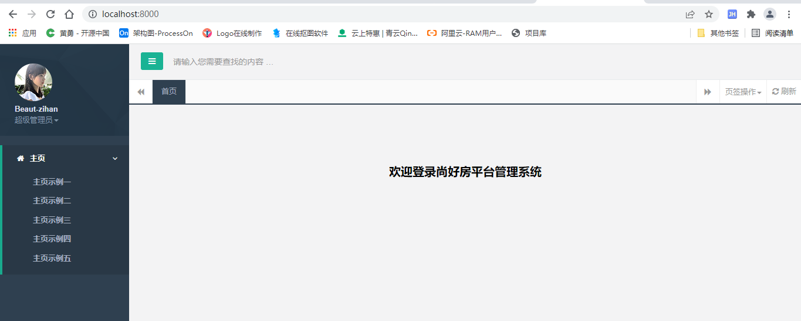

框架集成成功

## 三、角色管理

前面我们已经测试了一个角色列表，目前我们在这个基础上做一个完整的增删改查

说明：实体类与工具类我们可以直接复制到项目使用，这些代码没有业务逻辑，使用即可

### 1、角色列表

目前只做列表展示，分页功能后续补充

#### 1.1、参考模板

模板页面：hplus-master/table_data_tables.html

#### 1.2、更改页面

复制模板页面的css与js引用，代码如下

更改role/index.html

```html
<!DOCTYPE html>
<html lang="en" xmlns:th="http://www.thymeleaf.org">
<head>
    <meta charset="UTF-8">
    <title>Title</title>

    <link rel="shortcut icon" th:href="@{/static/favicon.ico}">
    <link th:href="@{/static/css/bootstrap.min.css?v=3.3.7}" rel="stylesheet">
    <link th:href="@{/static/css/font-awesome.css?v=4.4.0}" rel="stylesheet">

    <!-- Data Tables -->
    <link th:href="@{/static/css/plugins/dataTables/dataTables.bootstrap.css}" rel="stylesheet">

    <link th:href="@{/static/css/animate.css}" rel="stylesheet">
    <link th:href="@{/static/css/style.css?v=4.1.0}" rel="stylesheet">

    <!-- 全局js -->
    <script th:src="@{/static/js/jquery.min.js?v=2.1.4}"></script>
    <script th:src="@{/static/js/bootstrap.min.js?v=3.3.7}"></script>
    <script th:src="@{/static/js/plugins/jeditable/jquery.jeditable.js}"></script>
    <!-- Data Tables -->
    <script th:src="@{/static/js/plugins/dataTables/jquery.dataTables.js}"></script>
    <script th:src="@{/static/js/plugins/dataTables/dataTables.bootstrap.js}"></script>
</head>
<body class="gray-bg">
    <div class="wrapper wrapper-content animated fadeInRight">
        <div class="row">
            <div class="col-sm-12">
                <div class="ibox float-e-margins">
                    <div class="ibox-content">
                        <table class="table table-striped table-bordered table-hover dataTables-example">
                            <thead>
                            <tr>
                                <th>序号</th>
                                <th>角色名称</th>
                                <th>角色编码</th>
                                <th>描述</th>
                                <th>创建时间</th>
                            </tr>
                            </thead>
                            <tbody>
                            <tr class="gradeX" th:each="item,it : ${list}">
                                <td class="text-center" th:text="${it.count}">11</td>
                                <td th:text="${item.roleName}">22</td>
                                <td th:text="${item.roleCode}">33</td>
                                <td th:text="${item.description}">33</td>
                                <td th:text="${#dates.format(item.createTime,'yyyy-MM-dd HH:mm:ss')}" >33</td>
                            </tr>
                            </tbody>
                        </table>
                    </div>
                </div>
            </div>
        </div>
    </div>
</body>
</html>
```

#### 1.3、查看效果

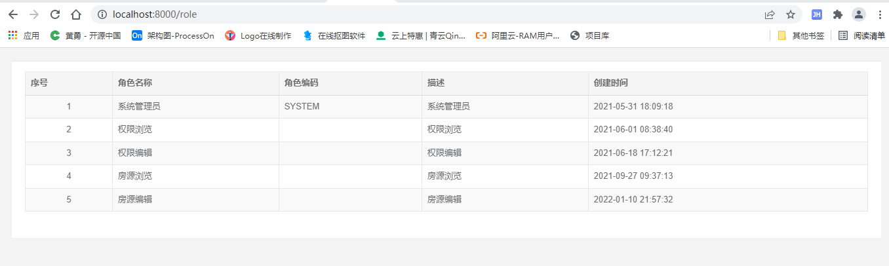

#### 1.4、将角色列表添加到框架中

更改frame/index.html

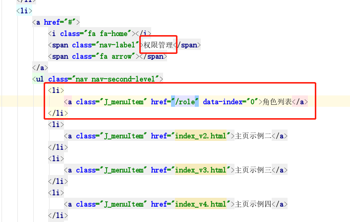

#### 1.5、最终效果

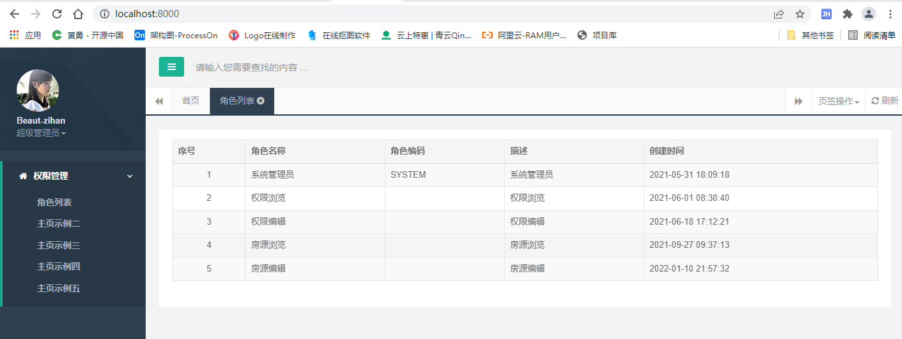

### 2、弹出层封装

#### 2.1、弹出层介绍

添加、修改、删除功能我们要使用弹出层的方式进行处理

弹出层框架：layer

layer参考文档：http://www.uimaker.com/layui/doc/modules/layer.html

hplus-master已经引入了layer框架，路径static/js/plugins/layer,可以直接使用

#### 2.2、弹出层封装

我们把可能使用到的弹出层方法都封装一下，方便后续使用

在static/js目录新建文件：myLayer.js

```javascript
var opt = {
   alert : function(msg){
      layer.alert(msg);
   },

   load : function () {
      layer.load(1, {
         shade: [0.5,'#fff'] //0.1透明度的白色背景
      });
   },

   confirm : function(url, msg) {
      var msg = msg ? msg : "确定该操作吗？";
      layer.confirm(msg,function(index){
         opt.load();
         window.location = url;
      });
   },

   dialog : function(message, messageType) {
      if(message != '' && message != null) {
         if(messageType == '1') {
            layer.msg(message, {icon: 1});
         } else {
            layer.alert(message, {icon: 2});
         }
      }
   },

   openWin : function(url,title, width,height) {
      var title = title ? title : false;
      layer.open({
         type: 2,
         title: title,
         zIndex:10000,
         anim: -1,
         maxmin: true,
         aini:2,
         shadeClose: false, //点击遮罩关闭层
         area: [width+"px", height+"px"],
         content: url
      });
   },
   closeWin : function(refresh,call) {
      var index = parent.layer.getFrameIndex(window.name);
      if(refresh) {
         parent.location.reload();
      }
      if(call) {
         parent.init();
      }
      parent.layer.close(index); //执行关闭
   }
}
```

#### 2.3、测试弹出层

在角色列表页面测试弹出层

role/index.html

1、引入弹出层js

```html
<!-- 弹出层js -->
<script th:src="@{/static/js/plugins/layer/layer.min.js}"></script>
<script th:src="@{/static/js/myLayer.js}"></script>
```

2、添加测试案例

```html
<!DOCTYPE html>
<html lang="en" xmlns:th="http://www.thymeleaf.org">
<head>
    <meta charset="UTF-8">
    <title>Title</title>

    <link rel="shortcut icon" th:href="@{/static/favicon.ico}">
    <link th:href="@{/static/css/bootstrap.min.css?v=3.3.7}" rel="stylesheet">
    <link th:href="@{/static/css/font-awesome.css?v=4.4.0}" rel="stylesheet">

    <!-- Data Tables -->
    <link th:href="@{/static/css/plugins/dataTables/dataTables.bootstrap.css}" rel="stylesheet">

    <link th:href="@{/static/css/animate.css}" rel="stylesheet">
    <link th:href="@{/static/css/style.css?v=4.1.0}" rel="stylesheet">

    <!-- 全局js -->
    <script th:src="@{/static/js/jquery.min.js?v=2.1.4}"></script>
    <script th:src="@{/static/js/bootstrap.min.js?v=3.3.7}"></script>
    <script th:src="@{/static/js/plugins/jeditable/jquery.jeditable.js}"></script>
    <!-- Data Tables -->
    <script th:src="@{/static/js/plugins/dataTables/jquery.dataTables.js}"></script>
    <script th:src="@{/static/js/plugins/dataTables/dataTables.bootstrap.js}"></script>

    <!-- 弹出层js -->
    <script th:src="@{/static/js/plugins/layer/layer.min.js}"></script>
    <script th:src="@{/static/js/myLayer.js}"></script>
</head>
<body class="gray-bg">
    <div class="wrapper wrapper-content animated fadeInRight">
        <div class="row">
            <div class="col-sm-12">
                <div class="ibox float-e-margins">
                    <div class="ibox-content">
                        <div>
                            <button type="button" class="btn btn-sm btn-primary alert">alert</button>
                            <button type="button" class="btn btn-sm btn-primary load">load</button>
                            <button type="button" class="btn btn-sm btn-primary confirm">confirm</button>
                            <button type="button" class="btn btn-sm btn-primary dialog">dialog</button>
                            <button type="button" class="btn btn-sm btn-primary openWin">openWin</button>
                        </div>
                        <table class="table table-striped table-bordered table-hover dataTables-example">
                            <thead>
                            <tr>
                                <th>序号</th>
                                <th>角色名称</th>
                                <th>角色编码</th>
                                <th>描述</th>
                                <th>创建时间</th>
                            </tr>
                            </thead>
                            <tbody>
                            <tr class="gradeX" th:each="item,it : ${list}">
                                <td class="text-center" th:text="${it.count}">11</td>
                                <td th:text="${item.roleName}">22</td>
                                <td th:text="${item.roleCode}">33</td>
                                <td th:text="${item.description}">33</td>
                                <td th:text="${#dates.format(item.createTime,'yyyy-MM-dd HH:mm:ss')}" >33</td>
                            </tr>
                            </tbody>
                        </table>
                    </div>
                </div>
            </div>
        </div>
    </div>
<script th:inline="javascript">
    $(function(){
        $(".alert").on("click",function () {
            opt.alert("测试alert")
        });
        $(".load").on("click",function () {
            opt.load();
        });
        $(".confirm").on("click",function(){
            opt.confirm("","删除操作需要确认");
        });
        $(".dialog").on("click",function () {
            opt.dialog("测试提示框",1);
        });
        $(".openWin").on("click",function () {
            opt.openWin("/role","测试打开弹出窗口",580,430);
        });
    });
</script>
</body>
</html>
```

3、测试

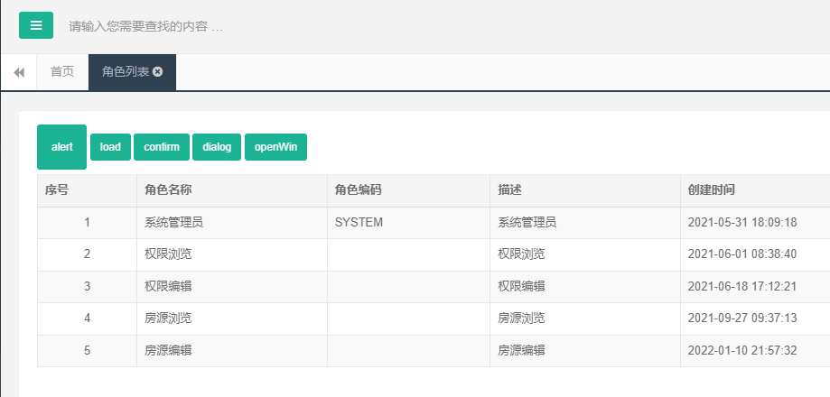

点击按钮查看效果

### 3、添加角色

#### 3.1、列表页面添加按钮

```html
<button type="button" class="btn btn-sm btn-primary create">添加</button>
```

js事件：

```javascript
$(".create").on("click",function () {
    opt.openWin('/role/create','新增',630,430)
});
```

#### 3.2、添加进入新增页面控制器

修改RoleController类

```java
private final static String PAGE_CREATE = "role/create";
   
@GetMapping("/create")
public String create() {
   return PAGE_CREATE;
}
```

#### 3.3、添加create.html模板

参考模板页面：hplus-master/form_basic.html

create.html

```html
<!DOCTYPE html>
<html xmlns:th="http://www.thymeleaf.org">
<head>
    <meta charset="UTF-8">
    <title>新增</title>

    <link rel="shortcut icon" th:href="@{/static/favicon.ico}">
    <link th:href="@{/static/css/bootstrap.min.css?v=3.3.7}" rel="stylesheet">
    <link th:href="@{/static/css/font-awesome.css?v=4.4.0}" rel="stylesheet">

    <!-- Data Tables -->
    <link th:href="@{/static/css/plugins/dataTables/dataTables.bootstrap.css}" rel="stylesheet">

    <link th:href="@{/static/css/animate.css}" rel="stylesheet">
    <link th:href="@{/static/css/style.css?v=4.1.0}" rel="stylesheet">

    <!-- 全局js -->
    <script th:src="@{/static/js/jquery.min.js?v=2.1.4}"></script>
    <script th:src="@{/static/js/bootstrap.min.js?v=3.3.7}"></script>
    
    <!-- 弹出层js -->
    <script th:src="@{/static/js/plugins/layer/layer.min.js}"></script>
    <script th:src="@{/static/js/myLayer.js}"></script>
</head>
<body class="gray-bg">
<div class="wrapper wrapper-content animated fadeInRight">
    <div class="ibox float-e-margins">
        <div class="ibox-content" style="width: 98%;">
            <form id="ec" th:action="@{/role/save}" method="post" class="form-horizontal">
                <div class="form-group">
                    <label class="col-sm-2 control-label">角色名称：</label>
                    <div class="col-sm-10">
                        <input type="text" name="roleName" id="roleName" value="" class="form-control"/>
                    </div>
                </div>
                <div class="hr-line-dashed"></div>
                <div class="form-group">
                    <label class="col-sm-2 control-label">角色编码：</label>
                    <div class="col-sm-10">
                        <input type="text" name="roleCode" id="roleCode" value="" class="form-control"/>
                    </div>
                </div>
                <div class="hr-line-dashed"></div>
                <div class="form-group">
                    <label class="col-sm-2 control-label">描述：</label>
                    <div class="col-sm-10">
                        <textarea name="description" id="description" class="form-control" style="width:100%;height: 50px;" ></textarea>
                    </div>
                </div>
                <div class="hr-line-dashed"></div>
                <div class="form-group posf">
                    <div class="col-sm-4 col-sm-offset-2 text-right">
                        <button class="btn btn-primary" type="submit">确定</button>
                        <button class="btn btn-white" type="button" value="取消" onclick="opt.closeWin()">取消</button></div>
                </div>
            </form>
        </div>
    </div>
</div>
</body>
</html>
```

接下来保存新增数据

#### 3.4、保存之dao层

1、添加xml方法

```xml
<insert id="insert" useGeneratedKeys="true" keyProperty="id">
       insert into acl_role (
           id ,
           role_name ,
           role_code ,
           description
       ) values (
           #{id} ,
           #{roleName} ,
           #{roleCode} ,
           #{description}
       )
</insert>
```

2、RoleDao添加接口

```java
Integer insert(Role role);
```

#### 3.5、保存之service层

1、RoleService添加接口

```java
Integer insert(Role role);
```

2、RoleServiceImpl添加接口实现

```java
@Override
public Integer insert(Role role) {
    return roleDao.insert(role);
}
```

#### 3.6、保存之controller层

RoleController添加方法

```java
@PostMapping("/save")
public String save(Role role, HttpServletRequest request) {
   roleService.insert(role);
   return LIST_ACTION;
}
```

#### 3.7、测试新增

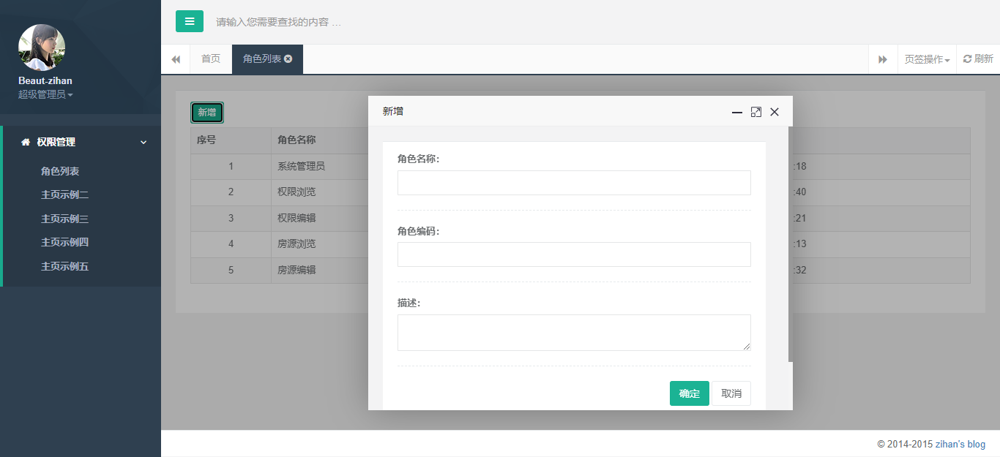

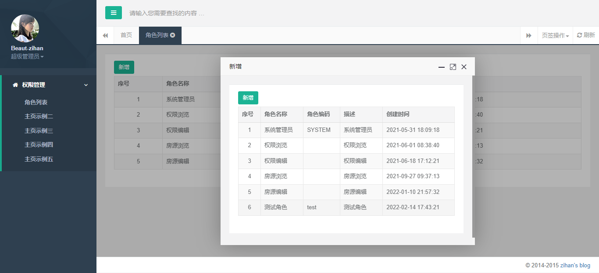

说明：保存新增重定向到了列表页面，这样不友好

改进：保存新增返回保存成功提示页，关闭弹出层然后刷新列表页面（父页面）

#### 3.8、新增弹出层成功提示页面

新建common/successPage.html页面

```html
<!DOCTYPE html>
<html xmlns:th="http://www.thymeleaf.org">
<head>
    <meta charset="UTF-8">
    <title>成功提示页</title>

    <link rel="shortcut icon" th:href="@{/static/favicon.ico}">
    <link th:href="@{/static/css/bootstrap.min.css?v=3.3.7}" rel="stylesheet">
    <link th:href="@{/static/css/font-awesome.css?v=4.4.0}" rel="stylesheet">

    <!-- Data Tables -->
    <link th:href="@{/static/css/plugins/dataTables/dataTables.bootstrap.css}" rel="stylesheet">

    <link th:href="@{/static/css/animate.css}" rel="stylesheet">
    <link th:href="@{/static/css/style.css?v=4.1.0}" rel="stylesheet">

    <!-- 全局js -->
    <script th:src="@{/static/js/jquery.min.js?v=2.1.4}"></script>
    <script th:src="@{/static/js/bootstrap.min.js?v=3.3.7}"></script>

    <!-- 弹出层js -->
    <script th:src="@{/static/js/plugins/layer/layer.min.js}"></script>
    <script th:src="@{/static/js/myLayer.js}"></script>
</head>
<body class="gray-bg">
<div class="wrapper wrapper-content animated fadeInRight">
    <div class="ibox float-e-margins">
        <div class="ibox-content">
            <div class="form-group">
                <div class="col-sm-10" th:value="${messagePage}">操作成功</div>
            </div>
            <div class="hr-line-dashed"></div>
            <div class="form-group posf">
                <div class="col-sm-4 col-sm-offset-2">
                    <button class="btn btn-primary" type="button" onclick="opt.closeWin(true);">确定</button>
                </div>
            </div>
        </div>
    </div>
</div>
</body>
</html>

```

说明：确定 按钮，关闭弹出层，刷新父页面，查看myLayer.js方法

#### 3.9、改进保存成功调整页面

```java
private final static String PAGE_SUCCESS = "common/successPage";
```

```java
@PostMapping("/save")
public String save(Role role, HttpServletRequest request) {
   roleService.insert(role);
   return PAGE_SUCCESS;
}
```

#### 3.10、最终测试

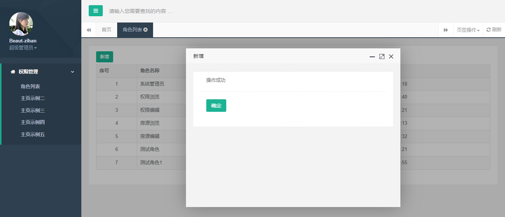

点击“确认”，刷新父页面

### 4、修改角色

修改角色，需要先根据id获取角色，然后修改

#### 4.1、修改之dao层

1、添加xml方法

```xml
<select id="getById" resultType="Role">
		<include refid="columns" />
		from acl_role
		where
		id = #{id}
	</select>
	
<update id="update" >
		update acl_role set
		<if test="roleName != null and roleName != ''">
			role_name = #{roleName} ,
		</if>
		<if test="roleCode != null and roleCode != ''">
			role_code = #{roleCode} ,
		</if>
		<if test="description != null and description != ''">
			description = #{description} ,
		</if>
		update_time =  now()
		where
		id = #{id}
	</update>
```

2、RoleDao添加接口

```java
Role getById(Long id);

Integer update(Role role);
```

#### 4.2、修改之service层

1、RoleService添加接口

```java
Role getById(Long id);

Integer update(Role role);
```

2、RoleServiceImpl添加接口实现

```java
@Override
public Role getById(Long id) {
	return roleDao.getById(id);
}

@Override
public Integer update(Role role) {
	return roleDao.update(role);
}
```

#### 4.3、修改之controller层

RoleController添加方法

```java
private final static String PAGE_EDIT = "role/edit";
```

```java
@GetMapping("/edit/{id}")
	public String edit(ModelMap model,@PathVariable Long id) {
		Role role = roleService.getById(id);
		model.addAttribute("role",role);
		return PAGE_EDIT;
	}

	@PostMapping(value="/update")
	public String update(Role role) {
		roleService.update(role);
		return PAGE_SUCCESS;
	}

```

#### 4.4、修改页面

1、新建edit.html

```html
<!DOCTYPE html>
<html xmlns:th="http://www.thymeleaf.org">
<head>
    <meta charset="UTF-8">
    <title>修改</title>

    <link rel="shortcut icon" th:href="@{/static/favicon.ico}">
    <link th:href="@{/static/css/bootstrap.min.css?v=3.3.7}" rel="stylesheet">
    <link th:href="@{/static/css/font-awesome.css?v=4.4.0}" rel="stylesheet">

    <!-- Data Tables -->
    <link th:href="@{/static/css/plugins/dataTables/dataTables.bootstrap.css}" rel="stylesheet">

    <link th:href="@{/static/css/animate.css}" rel="stylesheet">
    <link th:href="@{/static/css/style.css?v=4.1.0}" rel="stylesheet">

    <!-- 全局js -->
    <script th:src="@{/static/js/jquery.min.js?v=2.1.4}"></script>
    <script th:src="@{/static/js/bootstrap.min.js?v=3.3.7}"></script>
    
    <!-- 弹出层js -->
    <script th:src="@{/static/js/plugins/layer/layer.min.js}"></script>
    <script th:src="@{/static/js/myLayer.js}"></script>
</head>
<body class="gray-bg">
<div class="wrapper wrapper-content animated fadeInRight">
    <div class="ibox float-e-margins">
        <div class="ibox-content" style="width: 98%;">
            <form id="ec" th:action="@{/role/update}" method="post" class="form-horizontal" >
                <input type="hidden" name="id" th:value="${role.id}">
                <div class="form-group">
                    <label class="col-sm-2 control-label">角色：</label>

                    <div class="col-sm-10">
                        <input type="text" name="roleName" id="roleName" th:value="${role.roleName}" class="form-control"/>
                    </div>
                </div>
                <div class="hr-line-dashed"></div>
                <div class="form-group">
                    <label class="col-sm-2 control-label">角色编码：</label>
                    <div class="col-sm-10">
                        <input type="text" name="roleCode" id="roleCode" th:value="${role.roleCode}" class="form-control"/>
                    </div>
                </div>
                <div class="hr-line-dashed"></div>
                <div class="form-group">
                    <label class="col-sm-2 control-label">描述：</label>
                    <div class="col-sm-10">
                        <textarea name="description" id="description" class="form-control" style="width:100%;height: 50px;" th:text="${role.description}" ></textarea>
                    </div>
                </div>
                <div class="hr-line-dashed"></div>
                <div class="form-group posf">
                    <div class="col-sm-4 col-sm-offset-2 text-right">
                        <button class="btn btn-primary" type="submit">确定</button>
                        <button class="btn btn-white" type="button" onclick="javascript:opt.closeWin();" value="取消">取消</button></div>
                    </div>
                </form>
              </div>    
        </div>
    </div>
</div>
</body>
</html>
```

2、列表添加修改

列表添加操作一栏

```html
<th>操作 </th>
...
<td class="text-center">
    <a class="edit" th:attr="data-id=${item.id}">修改</a>
</td>
```

添加修改js事件

```javascript
$(".edit").on("click",function () {
    var id = $(this).attr("data-id");
    opt.openWin('/role/edit/' + id,'修改',580,430);
});
```

3、测试

### 5、删除角色

#### 5.1、删除之dao层

逻辑删除

1、添加xml方法

```xml
<update id="delete">
        update acl_role set
	        update_time = now() ,
	        is_deleted = 1
        where
        	id = #{id}
    </update>
```

2、RoleDao添加接口

```java
void delete(Long id);
```

#### 5.2、删除之service层

1、RoleService添加接口

```java
void delete(Long id);
```

2、RoleServiceImpl添加接口实现

```java
@Override
	public void delete(Long id) {
		roleDao.delete(id);
	}
```

#### 5.3、删除之controller层

```java
private final static String LIST_ACTION = "redirect:/role";
```

RoleController添加方法

```java
@GetMapping("/delete/{id}")
	public String delete(@PathVariable Long id) {
		roleService.delete(id);
		return LIST_ACTION;
	}
```

#### 5.4、删除页面

列表页面

添加删除按钮及事件

```html
<a class="delete" th:attr="data-id=${item.id}">删除</a>
```

```javascript
$(".delete").on("click",function(){
    var id = $(this).attr("data-id");
    opt.confirm('/role/delete/'+id);
});
```

#### 5.5、最终列表页面

```html
<!DOCTYPE html>
<html lang="en" xmlns:th="http://www.thymeleaf.org">
<head>
    <meta charset="UTF-8">
    <title>列表</title>

    <link rel="shortcut icon" th:href="@{/static/favicon.ico}">
    <link th:href="@{/static/css/bootstrap.min.css?v=3.3.7}" rel="stylesheet">
    <link th:href="@{/static/css/font-awesome.css?v=4.4.0}" rel="stylesheet">

    <!-- Data Tables -->
    <link th:href="@{/static/css/plugins/dataTables/dataTables.bootstrap.css}" rel="stylesheet">

    <link th:href="@{/static/css/animate.css}" rel="stylesheet">
    <link th:href="@{/static/css/style.css?v=4.1.0}" rel="stylesheet">

    <!-- 全局js -->
    <script th:src="@{/static/js/jquery.min.js?v=2.1.4}"></script>
    <script th:src="@{/static/js/bootstrap.min.js?v=3.3.7}"></script>
    <script th:src="@{/static/js/plugins/jeditable/jquery.jeditable.js}"></script>
    <!-- Data Tables -->
    <script th:src="@{/static/js/plugins/dataTables/jquery.dataTables.js}"></script>
    <script th:src="@{/static/js/plugins/dataTables/dataTables.bootstrap.js}"></script>

    <!-- 弹出层js -->
    <script th:src="@{/static/js/plugins/layer/layer.min.js}"></script>
    <script th:src="@{/static/js/myLayer.js}"></script>
</head>
<body class="gray-bg">
    <div class="wrapper wrapper-content animated fadeInRight">
        <div class="row">
            <div class="col-sm-12">
                <div class="ibox float-e-margins">
                    <div class="ibox-content">
                        <div>
                            <button type="button" class="btn btn-sm btn-primary create">新增</button>
                        </div>
                        <table class="table table-striped table-bordered table-hover dataTables-example">
                            <thead>
                            <tr>
                                <th>序号</th>
                                <th>角色名称</th>
                                <th>角色编码</th>
                                <th>描述</th>
                                <th>创建时间</th>
                                <th>操作 </th>
                            </tr>
                            </thead>
                            <tbody>
                            <tr class="gradeX" th:each="item,it : ${list}">
                                <td class="text-center" th:text="${it.count}">11</td>
                                <td th:text="${item.roleName}">22</td>
                                <td th:text="${item.roleCode}">33</td>
                                <td th:text="${item.description}">33</td>
                                <td th:text="${#dates.format(item.createTime,'yyyy-MM-dd HH:mm:ss')}" >33</td>
                                <td class="text-center">
                                    <a class="edit" th:attr="data-id=${item.id}">修改</a>
                                    <a class="delete" th:attr="data-id=${item.id}">删除</a>
                                </td>
                            </tr>
                            </tbody>
                        </table>
                    </div>
                </div>
            </div>
        </div>
    </div>
<script th:inline="javascript">
    $(function(){
        $(".create").on("click",function () {
            opt.openWin("/role/create","新增",580,430);
        });
        $(".edit").on("click",function () {
            var id = $(this).attr("data-id");
            opt.openWin('/role/edit/' + id,'修改',580,430);
        });
        $(".delete").on("click",function(){
            var id = $(this).attr("data-id");
            opt.confirm('/role/delete/'+id);
        });
    });
</script>
</body>
</html>
```

### 6、分页处理

#### 6.1、分页之dao层

1、添加xml方法

```xml
<sql id="findPageWhere">
		<where>	      				
	       <if test="roleName != null and roleName != ''">
				and role_name = #{roleName}
			</if>
			and is_deleted = 0
		</where>
	</sql>
    
    <select id="findPage" resultType="Role">
    	<include refid="columns" />
	    from acl_role 
		<include refid="findPageWhere"/>
		order by id desc
    </select>
```

2、RoleDao添加接口

```java
Page<Role> findPage(Map<String, Object> filters);
```

说明：filters封装页面搜索条件，如：roleName

3、MyBatis中添加分页支持

在mybatis-config.xml添加分页支持

```xml
<?xml version="1.0" encoding="UTF-8" ?>
<!DOCTYPE configuration PUBLIC "-//mybatis.org//DTD Config 3.0//EN"
        "http://mybatis.org/dtd/mybatis-3-config.dtd">
<configuration>
    <plugins>
        <!-- com.github.pagehelper 为 PageHelper 类所在包名 -->
        <plugin interceptor="com.github.pagehelper.PageHelper">
            <!-- 设置数据库类型 Oracle,Mysql,MariaDB,SQLite,Hsqldb,PostgreSQL 六种数据库-->
            <property name="dialect" value="mysql"/>
        </plugin>
    </plugins>
</configuration>
```

#### 6.2、分页之service层

1、RoleService添加接口

```java
PageInfo<Role> findPage(Map<String, Object> filters);
```

2、RoleServiceImpl添加接口实现

```java
public PageInfo<Role> findPage(Map<String, Object> filters) {
		//当前页数
		int pageNum = CastUtil.castInt(filters.get("pageNum"), 1);
		//每页显示的记录条数
		int pageSize = CastUtil.castInt(filters.get("pageSize"), 10);

		PageHelper.startPage(pageNum, pageSize);
		return new PageInfo<Role>(roleDao.findPage(filters), 10);
	}
```

common-util引入工具类：CastUtil（资源文件获取）

#### 6.3、分页之controller层

RoleController添加方法

注释掉之前的列表方法

```java
@RequestMapping
public String index(ModelMap model, HttpServletRequest request) {
   Map<String,Object> filters = getFilters(request);
   PageInfo<Role> page = roleService.findPage(filters);

   model.addAttribute("page", page);
   model.addAttribute("filters", filters);
   return PAGE_INDEX;
}

/**
 * 封装页面提交的分页参数及搜索条件
 * @param request
 * @return
 */
private Map<String, Object> getFilters(HttpServletRequest request) {
   Enumeration<String> paramNames = request.getParameterNames();
   Map<String, Object> filters = new TreeMap();
   while(paramNames != null && paramNames.hasMoreElements()) {
      String paramName = (String)paramNames.nextElement();
      String[] values = request.getParameterValues(paramName);
      if (values != null && values.length != 0) {
         if (values.length > 1) {
            filters.put(paramName, values);
         } else {
            filters.put(paramName, values[0]);
         }
      }
   }
   if(!filters.containsKey("pageNum")) {
      filters.put("pageNum", 1);
   }
   if(!filters.containsKey("pageSize")) {
      filters.put("pageSize", 10);
   }

   return filters;
}
```

#### 6.4、列表页面

1、获取分页条

模板页面：hplus-master/table_data_tables.html

从模板页面复制分页导航条

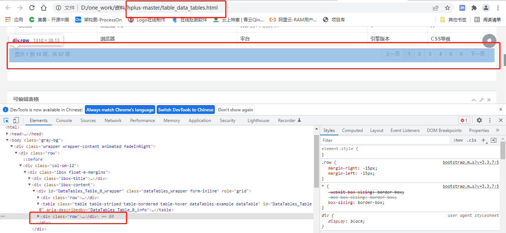

代码如下：

```html
<div class="row">
    <div class="col-sm-6">
        <div class="dataTables_info" id="DataTables_Table_0_info" role="alert" aria-live="polite" aria-relevant="all">显示
            1 到 10 项，共 57 项
        </div>
    </div>
    <div class="col-sm-6">
        <div class="dataTables_paginate paging_simple_numbers" id="DataTables_Table_0_paginate">
            <ul class="pagination">
                <li class="paginate_button previous disabled" aria-controls="DataTables_Table_0" tabindex="0"
                    id="DataTables_Table_0_previous"><a href="#">上一页</a></li>
                <li class="paginate_button active" aria-controls="DataTables_Table_0" tabindex="0"><a href="#">1</a>
                </li>
                <li class="paginate_button " aria-controls="DataTables_Table_0" tabindex="0"><a href="#">2</a></li>
                <li class="paginate_button " aria-controls="DataTables_Table_0" tabindex="0"><a href="#">3</a></li>
                <li class="paginate_button " aria-controls="DataTables_Table_0" tabindex="0"><a href="#">4</a></li>
                <li class="paginate_button " aria-controls="DataTables_Table_0" tabindex="0"><a href="#">5</a></li>
                <li class="paginate_button " aria-controls="DataTables_Table_0" tabindex="0"><a href="#">6</a></li>
                <li class="paginate_button next" aria-controls="DataTables_Table_0" tabindex="0"
                    id="DataTables_Table_0_next"><a href="#">下一页</a></li>
            </ul>
        </div>
    </div>
</div>
```

说明：放入页面查看是否显示正常

2、完整页面

搜索与分页

搜索与分页都通过提交from表单的形式提交数据，后台controller获取参数放入Map对象作为参数

```html
<!DOCTYPE html>
<html lang="en" xmlns:th="http://www.thymeleaf.org">
<head>
    <meta charset="UTF-8">
    <title>列表</title>

    <link rel="shortcut icon" th:href="@{/static/favicon.ico}">
    <link th:href="@{/static/css/bootstrap.min.css?v=3.3.7}" rel="stylesheet">
    <link th:href="@{/static/css/font-awesome.css?v=4.4.0}" rel="stylesheet">

    <!-- Data Tables -->
    <link th:href="@{/static/css/plugins/dataTables/dataTables.bootstrap.css}" rel="stylesheet">

    <link th:href="@{/static/css/animate.css}" rel="stylesheet">
    <link th:href="@{/static/css/style.css?v=4.1.0}" rel="stylesheet">

    <!-- 全局js -->
    <script th:src="@{/static/js/jquery.min.js?v=2.1.4}"></script>
    <script th:src="@{/static/js/bootstrap.min.js?v=3.3.7}"></script>
    <script th:src="@{/static/js/plugins/jeditable/jquery.jeditable.js}"></script>
    <!-- Data Tables -->
    <script th:src="@{/static/js/plugins/dataTables/jquery.dataTables.js}"></script>
    <script th:src="@{/static/js/plugins/dataTables/dataTables.bootstrap.js}"></script>

    <!-- 弹出层js -->
    <script th:src="@{/static/js/plugins/layer/layer.min.js}"></script>
    <script th:src="@{/static/js/myLayer.js}"></script>
</head>
<body class="gray-bg">
<form id="ec" th:action="@{/role}" method="post">
    <div class="wrapper wrapper-content animated fadeInRight">
        <div class="row">
            <div class="col-sm-12">
                <div class="ibox float-e-margins">
                    <div class="ibox-content">
                        <table class="table form-table margin-bottom10">
                            <tr>
                                <td>
                                    <input type="text" name="roleName" th:value="${#maps.containsKey(filters, 'roleName')} ? ${filters.roleName} : ''" placeholder="角色名称" class="input-sm form-control"/>
                                </td>
                            </tr>
                        </table>
                        <div>
							<button type="button" class="btn btn-sm btn-primary" onclick="javascript:document.forms.ec.pageNum.value=1;document.forms.ec.submit();">搜索</button>
                            <button type="button" class="btn btn-sm btn-primary create">新增</button>
                            <button type="button" id="loading-example-btn" onclick="javascript:window.location.reload();" class="btn btn-white btn-sm">刷新</button>
                        </div>
                        <table class="table table-striped table-bordered table-hover dataTables-example">
                            <thead>
                            <tr>
                                <th>序号</th>
                                <th>角色名称</th>
                                <th>角色编码</th>
                                <th>描述</th>
                                <th>创建时间</th>
                                <th>操作 </th>
                            </tr>
                            </thead>
                            <tbody>
                            <tr class="gradeX" th:each="item,it : ${page.list}">
                                <td class="text-center" th:text="${it.count}">11</td>
                                <td th:text="${item.roleName}">22</td>
                                <td th:text="${item.roleCode}">33</td>
                                <td th:text="${item.description}">33</td>
                                <td th:text="${#dates.format(item.createTime,'yyyy-MM-dd HH:mm:ss')}" >33</td>
                                <td class="text-center">
                                    <a class="edit" th:attr="data-id=${item.id}">修改</a>
                                    <a class="delete" th:attr="data-id=${item.id}">删除</a>
                                </td>
                            </tr>
                            </tbody>
                        </table>

                        <div class="row">
                        <input type="hidden" name="pageSize" id="pageSize" th:value="${page.pageSize}"/>
    <input type="hidden" name="pageNum" id="pageNum" th:value="${page.pageNum}"/>
                            <div class="col-sm-6">
                                <div class="dataTables_info" id="DataTables_Table_0_info" role="alert" aria-live="polite" aria-relevant="all">
                                    当前第<span th:text="${page.pageNum }"></span>页/共<span th:text="${page.pages }"></span>页&nbsp;&nbsp;共<span
                                        id="pageTotal" th:text="${page.total }"></span>条记录&nbsp;&nbsp;
                                </div>
                            </div>
                            <div class="col-sm-6">
                                <div class="dataTables_paginate paging_simple_numbers" id="DataTables_Table_0_paginate">
                                    <ul class="pagination">
                                        <li class="paginate_button previous" th:if="${!page.isFirstPage}"><a
                                                href="javascript:document.forms.ec.pageNum.value=1;document.forms.ec.submit();">第一页</a></li>
                                        <li class="paginate_button previous" th:if="${page.isFirstPage}"><a href="javascript:">第一页</a></li>
                                        <li class="paginate_button previous" th:if="${!page.isFirstPage}"><a
                                                th:href="'javascript:document.forms.ec.pageNum.value='+${page.prePage}+';document.forms.ec.submit();'">上一页</a>
                                        </li>
                                        <li class="paginate_button previous disabled" th:if="${page.isFirstPage}"><a
                                                href="javascript:">上一页</a></li>
                                        <li th:each="i : ${page.navigatepageNums}"
                                            th:class="${i == page.pageNum } ? 'paginate_button active' : 'paginate_button'">
                                            <a th:href="'javascript:document.forms.ec.pageNum.value='+${i}+';document.forms.ec.submit();'"><span
                                                    th:text="${i}"></span></a>
                                        </li>
                                        <li class="paginate_button next" th:if="${!page.isLastPage}"><a
                                                th:href="'javascript:document.forms.ec.pageNum.value='+${page.nextPage}+';document.forms.ec.submit();'">下一页</a>
                                        </li>
                                        <li class="paginate_button next disabled" th:if="${page.isLastPage}"><a href="javascript:">下一页</a>
                                        </li>
                                        <li class="paginate_button next" th:if="${!page.isLastPage}"><a
                                                th:href="'javascript:document.forms.ec.pageNum.value='+${page.pages}+';document.forms.ec.submit();'">尾页</a>
                                        </li>
                                        <li class="paginate_button next" th:if="${page.isLastPage}"><a href="javascript:">尾页</a></li>
                                    </ul>
                                </div>
                            </div>
                        </div>
                    </div>
                </div>
            </div>
        </div>
    </div>
</form>
<script th:inline="javascript">
    $(function(){
         //去添加角色的页面
        $(".create").on("click",function () {
            opt.openWin("/role/create","新增",580,430);
        });
        //去修改角色的页面
        $(".edit").on("click",function () {
            var id = $(this).attr("data-id");
            opt.openWin('/role/edit/' + id,'修改',580,430);
        });
        //删除角色
        $(".delete").on("click",function(){
            var id = $(this).attr("data-id");
            opt.confirm('/role/delete/'+id);
        });
    });
</script>
</body>
</html>
```


## 三、角色管理代码封装

前面我做了角色管理，其实就是一个基本的针对单表的增删改查，后续可能还有很多针对单表的增删改查，因此我们把上面的增删改查做一个全面的封装，方便后续复用。

服务器端：

​	dao层、service层与controller层对应的增删改查我可以提取封装为base类，后续直接继承，方便后续复用

前端：

​	页面头部css与js、分页等可以提取出来，页面包含进去即可

下面我们提取代码做封装

### 1、封装dao层

#### 1.1、封装BaseDao

在common-util模块添加：BaseDao

```java
package com.atguigu.base;


import com.github.pagehelper.Page;

import java.io.Serializable;
import java.util.List;
import java.util.Map;

public interface BaseDao<T> {

    /**
     * 保存一个实体
     *
     * @param t
     */
    Integer insert(T t);


    /**
     * 删除
     *
     * @param id 标识ID 可以是自增长ID，也可以是唯一标识。
     */
    void delete(Serializable id);

    /**
     * 更新一个实体
     *
     * @param t
     */
    Integer update(T t);

    /**
     * 通过一个标识ID 获取一个唯一实体
     *
     * @param id 标识ID 可以是自增长ID，也可以是唯一标识。
     * @return
     */
    T getById(Serializable id);

    Page<T> findPage(Map<String, Object> filters);
}
```

#### 1.2、改造RoleDao

```java
package com.atguigu.dao;

import com.atguigu.base.BaseDao;
import com.atguigu.entity.Role;

public interface RoleDao extends BaseDao<Role> {

	 List<Role> findAll();
}
```

说明：改造后是不是很简洁，如果有用户管理、小区管理等，我们直接继承，一个完整的增删改查是不是就出来了。

### 2、封装service层

#### 2.1、封装BaseService

在common-util模块添加：BaseService

```java
package com.atguigu.base;

import com.github.pagehelper.PageInfo;

import java.io.Serializable;
import java.util.Map;

public interface BaseService<T> {

    Integer insert(T t);

    void delete(Long id);

    Integer update(T t);

    T getById(Serializable id);

    PageInfo<T> findPage(Map<String, Object> filters);
}
```

#### 2.2、改造RoleService

```java
package com.atguigu.service;


import com.atguigu.base.BaseService;
import com.atguigu.entity.Role;

import java.util.List;

public interface RoleService extends BaseService<Role> {

    List<Role> findAll();

}
```

#### 2.3、封装BaseServiceImpl

在common-util模块添加：BaseService

```java
package com.atguigu.base;

import com.atguigu.util.CastUtil;
import com.github.pagehelper.PageHelper;
import com.github.pagehelper.PageInfo;
import org.springframework.transaction.annotation.Transactional;

import java.io.Serializable;
import java.util.Map;

@Transactional
public abstract class BaseServiceImpl<T> implements BaseService<T> {

    protected abstract BaseDao<T> getEntityDao();

    public Integer insert(T t) {
        return getEntityDao().insert(t);
    }

    public void delete(Long id) {
        getEntityDao().delete(id);
    }

    public Integer update(T t) {
        return getEntityDao().update(t);
    }

    public T getById(Serializable id) {
        return getEntityDao().getById(id);
    }

    public PageInfo<T> findPage(Map<String, Object> filters) {
        //当前页数
        int pageNum = CastUtil.castInt(filters.get("pageNum"), 1);
        //每页显示的记录条数
        int pageSize = CastUtil.castInt(filters.get("pageSize"), 10);

        PageHelper.startPage(pageNum, pageSize);
        return new PageInfo<T>(getEntityDao().findPage(filters), 10);
    }
}
```

#### 2.4、改造RoleServiceImpl

```java
package com.atguigu.service.impl;

import com.atguigu.base.BaseDao;
import com.atguigu.base.BaseServiceImpl;
import com.atguigu.dao.RoleDao;
import com.atguigu.entity.Role;
import com.atguigu.service.RoleService;
import org.springframework.beans.factory.annotation.Autowired;
import org.springframework.stereotype.Service;

import java.util.List;

@Service
public class RoleServiceImpl extends BaseServiceImpl<Role> implements RoleService {

	@Autowired
	private RoleDao roleDao;

	@Override
	protected BaseDao<Role> getEntityDao() {
		return roleDao;
	}

	public List<Role> findAll() {
		return roleDao.findAll();
	}

}
```

### 3、封装Controller层

#### 3.1、封装BaseController

在common-util模块添加：BaseController

```java
package com.atguigu.base;


import com.github.pagehelper.StringUtil;

import javax.servlet.http.HttpServletRequest;
import java.util.Enumeration;
import java.util.Map;
import java.util.TreeMap;


public class BaseController {

    protected Map<String, Object> getFilters(HttpServletRequest request) {
        Enumeration<String> paramNames = request.getParameterNames();
        Map<String, Object> filters = new TreeMap();
        while(paramNames != null && paramNames.hasMoreElements()) {
            String paramName = (String)paramNames.nextElement();
            String[] values = request.getParameterValues(paramName);
            if (values != null && values.length != 0) {
                if (values.length > 1) {
                    filters.put(paramName, values);
                } else {
                    filters.put(paramName, values[0]);
                }
            }
        }
        if(!filters.containsKey("pageNum")) {
            filters.put("pageNum", 1);
        }
        if(!filters.containsKey("pageSize")) {
            filters.put("pageSize", 10);
        }

        return filters;
    }

}
```

#### 3.2、改造RoleController

```java
package com.atguigu.controller;

import com.atguigu.base.BaseController;
import com.atguigu.entity.Role;
import com.atguigu.service.RoleService;
import com.github.pagehelper.PageInfo;
import org.springframework.beans.BeanUtils;
import org.springframework.beans.factory.annotation.Autowired;
import org.springframework.stereotype.Controller;
import org.springframework.ui.ModelMap;
import org.springframework.web.bind.annotation.GetMapping;
import org.springframework.web.bind.annotation.PathVariable;
import org.springframework.web.bind.annotation.PostMapping;
import org.springframework.web.bind.annotation.RequestMapping;
import org.springframework.web.servlet.mvc.support.RedirectAttributes;

import javax.servlet.http.HttpServletRequest;
import java.util.Enumeration;
import java.util.List;
import java.util.Map;
import java.util.TreeMap;

@Controller
@RequestMapping(value="/role")
@SuppressWarnings({"unchecked", "rawtypes"})
public class RoleController extends BaseController {

   @Autowired
   private RoleService roleService;

   private final static String LIST_ACTION = "redirect:/role";
   private final static String PAGE_INDEX = "role/index";
   private final static String PAGE_CREATE = "role/create";
   private final static String PAGE_EDIT = "role/edit";
   private final static String PAGE_SUCCESS = "common/successPage";

    @RequestMapping
    public String index(ModelMap model, HttpServletRequest request) {
        Map<String,Object> filters = getFilters(request);
        PageInfo<Role> page = roleService.findPage(filters);

        model.addAttribute("page", page);
        model.addAttribute("filters", filters);
        return PAGE_INDEX;
    }

   @GetMapping("/create")
   public String create(ModelMap model) {
      return PAGE_CREATE;
   }

   @PostMapping("/save")
   public String save(Role role) {
      roleService.insert(role);
        return PAGE_SUCCESS;
   }

   @GetMapping("/edit/{id}")
   public String edit(ModelMap model,@PathVariable Long id) {
      Role role = roleService.getById(id);
      model.addAttribute("role",role);
      return PAGE_EDIT;
   }

   @PostMapping(value="/update")
   public String update(Role role) {

      roleService.update(role);
        return PAGE_SUCCESS;
   }

   @GetMapping("/delete/{id}")
   public String delete(@PathVariable Long id) {
      roleService.delete(id);
      return LIST_ACTION;
   }

}
```

### 4、服务器端汇总

服务器端改造完成，代码是否清晰简洁很多，代码复用大，后续会逐步体现

### 5、提取页面头部信息

#### 5.1、封装头部css与js引用

在common下新建：head.html

```html
<!DOCTYPE html>
<html xmlns:th="http://www.thymeleaf.org">
<head>
    <meta http-equiv="Content-Type" content="text/html; charset=UTF-8" />
</head>
<body>

<div th:fragment="head">
    <title>权限管理系统</title>
    <meta http-equiv="Content-Type" content="text/html; charset=UTF-8" />
    <meta name="viewport" content="width=device-width, initial-scale=1.0"/>
    <meta http-equiv="X-UA-Compatible" content="ie=edge,chrome=1" />
    <meta name="renderer" content="webkit"/>
    <meta http-equiv="Cache-Control" content="no-siteapp" />

    <link rel="shortcut icon" th:href="@{favicon.ico}" />
    <link rel="shortcut icon" th:href="@{/static/favicon.ico}">
    <link th:href="@{/static/css/bootstrap.min.css?v=3.3.7}" rel="stylesheet">
    <link th:href="@{/static/css/font-awesome.css?v=4.4.0}" rel="stylesheet">

    <!-- Data Tables -->
    <link th:href="@{/static/css/plugins/dataTables/dataTables.bootstrap.css}" rel="stylesheet">

    <link th:href="@{/static/css/animate.css}" rel="stylesheet">
    <link th:href="@{/static/css/style.css?v=4.1.0}" rel="stylesheet">

    <!-- 全局js -->
    <script th:src="@{/static/js/jquery.min.js?v=2.1.4}"></script>
    <script th:src="@{/static/js/bootstrap.min.js?v=3.3.7}"></script>
    <script th:src="@{/static/js/plugins/jeditable/jquery.jeditable.js}"></script>
    <!-- Data Tables -->
    <script th:src="@{/static/js/plugins/dataTables/jquery.dataTables.js}"></script>
    <script th:src="@{/static/js/plugins/dataTables/dataTables.bootstrap.js}"></script>

    <!-- 弹出层js -->
    <script th:src="@{/static/js/plugins/layer/layer.min.js}"></script>
    <script th:src="@{/static/js/myLayer.js}"></script>
</div>
</body>
</html>
```

#### 5.2、改造角色增改查页面

增改查页面head部分全部替换为：

```html
<head th:include="common/head :: head"></head>
```

如图：

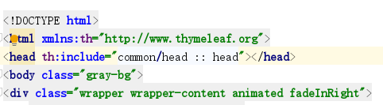

### 6、提取分页信息

#### 6.1、封装分页信息

在common下新建：pagination.html

```html
<!DOCTYPE html>
<html xmlns:th="http://www.thymeleaf.org">
<head>
    <meta http-equiv="Content-Type" content="text/html; charset=UTF-8"/>
    <title>Title</title>
</head>
<body>

<div class="row" th:fragment="pagination">
    <input type="hidden" name="pageSize" id="pageSize" th:value="${page.pageSize}"/>
    <input type="hidden" name="pageNum" id="pageNum" th:value="${page.pageNum}"/>
    <div class="col-sm-6">
        <div class="dataTables_info" id="DataTables_Table_0_info" role="alert" aria-live="polite" aria-relevant="all">
            当前第<span th:text="${page.pageNum }"></span>页/共<span th:text="${page.pages }"></span>页&nbsp;&nbsp;共<span
                id="pageTotal" th:text="${page.total }"></span>条记录&nbsp;&nbsp;
        </div>
    </div>
    <div class="col-sm-6">
        <div class="dataTables_paginate paging_simple_numbers" id="DataTables_Table_0_paginate">
            <ul class="pagination">
                <li class="paginate_button previous" th:if="${!page.isFirstPage}"><a
                        href="javascript:document.forms.ec.pageNum.value=1;document.forms.ec.submit();">第一页</a></li>
                <li class="paginate_button previous" th:if="${page.isFirstPage}"><a href="javascript:">第一页</a></li>
                <li class="paginate_button previous" th:if="${!page.isFirstPage}"><a
                        th:href="'javascript:document.forms.ec.pageNum.value='+${page.prePage}+';document.forms.ec.submit();'">上一页</a>
                </li>
                <li class="paginate_button previous disabled" th:if="${page.isFirstPage}"><a
                        href="javascript:">上一页</a></li>
                <li th:each="i : ${page.navigatepageNums}"
                    th:class="${i == page.pageNum } ? 'paginate_button active' : 'paginate_button'">
                    <a th:href="'javascript:document.forms.ec.pageNum.value='+${i}+';document.forms.ec.submit();'"><span
                            th:text="${i}"></span></a>
                </li>
                <li class="paginate_button next" th:if="${!page.isLastPage}"><a
                        th:href="'javascript:document.forms.ec.pageNum.value='+${page.nextPage}+';document.forms.ec.submit();'">下一页</a>
                </li>
                <li class="paginate_button next disabled" th:if="${page.isLastPage}"><a href="javascript:">下一页</a>
                </li>
                <li class="paginate_button next" th:if="${!page.isLastPage}"><a
                        th:href="'javascript:document.forms.ec.pageNum.value='+${page.pages}+';document.forms.ec.submit();'">尾页</a>
                </li>
                <li class="paginate_button next" th:if="${page.isLastPage}"><a href="javascript:">尾页</a></li>
            </ul>
        </div>
    </div>
</div>
</body>
</html>
```

#### 6.2、改造角色分页列表

```html
<div class="row" th:include="common/pagination :: pagination"></div>
```

#### 6.3、列表页面全部代码

```html
<!DOCTYPE html>
<html lang="en" xmlns:th="http://www.thymeleaf.org">
<head th:include="common/meta :: meta"></head>
<body class="gray-bg">
<form id="ec" th:action="@{/role}" method="post">
    <div class="wrapper wrapper-content animated fadeInRight">
        <div class="row">
            <div class="col-sm-12">
                <div class="ibox float-e-margins">
                    <div class="ibox-content">
                        <table class="table form-table margin-bottom10">
                            <tr>
                                <td>
                                    <input type="text" name="roleName" th:value="${#maps.containsKey(filters, 'roleName')} ? ${filters.roleName} : ''" placeholder="角色名称" class="input-sm form-control"/>
                                </td>
                            </tr>
                        </table>
                        <div>
                            <button type="submit" class="btn btn-sm btn-primary"> 搜索</button>
                            <button type="button" class="btn btn-sm btn-primary create">新增</button>
                            <button type="button" id="loading-example-btn" onclick="javascript:window.location.reload();" class="btn btn-white btn-sm">刷新</button>
                        </div>
                        <table class="table table-striped table-bordered table-hover dataTables-example">
                            <thead>
                            <tr>
                                <th>序号</th>
                                <th>角色名称</th>
                                <th>角色编码</th>
                                <th>描述</th>
                                <th>创建时间</th>
                                <th>操作 </th>
                            </tr>
                            </thead>
                            <tbody>
                            <tr class="gradeX" th:each="item,it : ${page.list}">
                                <td class="text-center" th:text="${it.count}">11</td>
                                <td th:text="${item.roleName}">22</td>
                                <td th:text="${item.roleCode}">33</td>
                                <td th:text="${item.description}">33</td>
                                <td th:text="${#dates.format(item.createTime,'yyyy-MM-dd HH:mm:ss')}" >33</td>
                                <td class="text-center">
                                    <a class="edit" th:attr="data-id=${item.id}">修改</a>
                                    <a class="delete" th:attr="data-id=${item.id}">删除</a>
                                </td>
                            </tr>
                            </tbody>
                        </table>
                        <div class="row" th:include="common/pagination :: pagination"></div>
                    </div>
                </div>
            </div>
        </div>
    </div>
</form>
<script th:inline="javascript">
    $(function(){
        $(".create").on("click",function () {
            opt.openWin("/role/create","新增",580,430);
        });
        $(".edit").on("click",function () {
            var id = $(this).attr("data-id");
            opt.openWin('/role/edit/' + id,'修改',580,430);
        });
        $(".delete").on("click",function(){
            var id = $(this).attr("data-id");
            opt.confirm('/role/delete/'+id);
        });
    });
</script>
</body>
</html>
```

### 7、前端汇总

目前我们封装了head部分与分页部分，这样页面简洁多了，后续可以直接复用

### 8、前端数据校验

前端校验我们选择：jQuery Validate 插件

jQuery Validate 插件为表单提供了强大的验证功能，让客户端表单验证变得更简单，同时提供了大量的定制选项，满足应用程序各种需求。该插件捆绑了一套有用的验证方法，包括 URL 和电子邮件验证，同时提供了一个用来编写用户自定义方法的 API。

参考文档：https://www.runoob.com/jquery/jquery-plugin-validate.html

#### 8.1、默认校验规则:

| 序号 | 规则               | 描述                                                         |
| :--- | :----------------- | :----------------------------------------------------------- |
| 1    | required:true      | 必须输入的字段。                                             |
| 2    | remote:"check.php" | 使用 ajax 方法调用 check.php 验证输入值。                    |
| 3    | email:true         | 必须输入正确格式的电子邮件。                                 |
| 4    | url:true           | 必须输入正确格式的网址。                                     |
| 5    | date:true          | 必须输入正确格式的日期。日期校验 ie6 出错，慎用。            |
| 6    | dateISO:true       | 必须输入正确格式的日期（ISO），例如：2009-06-23，1998/01/22。只验证格式，不验证有效性。 |
| 7    | number:true        | 必须输入合法的数字（负数，小数）。                           |
| 8    | digits:true        | 必须输入整数。                                               |
| 9    | creditcard:        | 必须输入合法的信用卡号。                                     |
| 10   | equalTo:"#field"   | 输入值必须和 #field 相同。                                   |
| 11   | accept:            | 输入拥有合法后缀名的字符串（上传文件的后缀）。               |
| 12   | maxlength:5        | 输入长度最多是 5 的字符串（汉字算一个字符）。                |
| 13   | minlength:10       | 输入长度最小是 10 的字符串（汉字算一个字符）。               |
| 14   | rangelength:[5,10] | 输入长度必须介于 5 和 10 之间的字符串（汉字算一个字符）。    |
| 15   | range:[5,10]       | 输入值必须介于 5 和 10 之间。                                |
| 16   | max:5              | 输入值不能大于 5。                                           |
| 17   | min:10             | 输入值不能小于 10。                                          |

#### 8.2、导入 js 库

head.html文件引入js库

```html
<script th:src="@{/static/js/plugins/validate/jquery.validate.min.js}" type="text/javascript" ></script>
<script th:src="@{/static/js/plugins/validate/messages_zh.min.js}" type="text/javascript" ></script>
```

#### 8.3、角色管理添加校验

##### 8.3.1、新增create.html

添加校验代码

```html
<script type="text/javascript">
    $(function(){
        $('#ec').validate({
            rules:{
                roleName:"required",
                description:"required"
            },
            messages:{
                roleName:"角色必须输入",
                description:"描述必须输入"
            },
            submitHandler: function(form) {
                $(form).find(":submit").attr("disabled", true).text("正在提交...");
                form.submit();
            }
        });
    });
</script>
```

完整代码：

```html
<!DOCTYPE html>
<html xmlns:th="http://www.thymeleaf.org">
<head th:include="common/head :: head"></head>
<script type="text/javascript">
    $(function(){
        $('#ec').validate({
            rules:{
                roleName:"required",
                description:"required"
            },
            messages:{
                roleName:"角色必须输入",
                description:"描述必须输入"
            },
            submitHandler: function(form) {
                $(form).find(":submit").attr("disabled", true).text("正在提交...");
                form.submit();
            }
        });
    });
</script>
<body class="gray-bg">
<div class="wrapper wrapper-content animated fadeInRight">
    <div class="ibox float-e-margins">
        <div class="ibox-content" style="width: 98%;">
            <form id="ec" th:action="@{/role/save}" method="post" class="form-horizontal">
                <div class="form-group">
                    <label class="col-sm-2 control-label">角色名称：</label>
                    <div class="col-sm-10">
                        <input type="text" name="roleName" id="roleName" value="" class="form-control"/>
                    </div>
                </div>
                <div class="hr-line-dashed"></div>
                <div class="form-group">
                    <label class="col-sm-2 control-label">角色编码：</label>
                    <div class="col-sm-10">
                        <input type="text" name="roleCode" id="roleCode" value="" class="form-control"/>
                    </div>
                </div>
                <div class="hr-line-dashed"></div>
                <div class="form-group">
                    <label class="col-sm-2 control-label">描述：</label>
                    <div class="col-sm-10">
                        <textarea name="description" id="description" class="form-control" style="width:100%;height: 50px;" ></textarea>
                    </div>
                </div>
                <div class="hr-line-dashed"></div>
                <div class="form-group posf">
                    <div class="col-sm-4 col-sm-offset-2 text-right">
                        <button class="btn btn-primary" type="submit">确定</button>
                        <button class="btn btn-white" type="button" value="取消">取消</button></div>
                </div>
            </form>
        </div>
    </div>
</div>
</body>
</html>
```

##### 8.3.2、修改edit.html

添加js校验，跟新增一致

```html
<script type="text/javascript">
    $(function(){
        $('#ec').validate({
            rules:{
                roleName:"required",
                description:"required"
            },
            messages:{
                roleName:"角色必须输入",
                description:"描述必须输入"
            },
            submitHandler: function(form) {
                $(form).find(":submit").attr("disabled", true).text("正在提交...");
                form.submit();
            }
        });
    });
</script>
```

## 四、用户管理

前面我们做了代码的基本封装，现在我们做用户管理的增删改查，看看效果怎么样

### 1、用户dao层

#### 1.1 、AdminDao.xml

在mapper文件夹下新增：AdminDao.xml

```html
<?xml version="1.0" encoding="UTF-8" ?>
<!DOCTYPE mapper
        PUBLIC "-//mybatis.org//DTD Mapper 3.0//EN"
        "http://mybatis.org/dtd/mybatis-3-mapper.dtd">

<mapper namespace="com.atguigu.dao.AdminDao">

    	
	<!-- 用于select查询公用抽取的列 -->
	<sql id="columns">
		select id,username,password,name,phone,head_url,description,create_time,update_time,is_deleted
	</sql>

	<insert id="insert" useGeneratedKeys="true" keyProperty="id">
        insert into acl_admin (
        	id ,
        	username ,
        	password ,
        	name ,
        	phone ,
        	head_url ,
        	description
        ) values (
        	#{id} ,
        	#{username} ,
        	#{password} ,
        	#{name} ,
        	#{phone} ,
        	#{headUrl} ,
        	#{description}
        )
	</insert>
	
	<update id="update" >
		update acl_admin set
		<if test="username != null and username != ''">
			username = #{username} ,
		</if>
		<if test="password != null and password != ''">
			password = #{password} ,
		</if>
		<if test="name != null and name != ''">
			name = #{name} ,
		</if>
		<if test="phone != null and phone != ''">
			phone = #{phone} ,
		</if>
		<if test="headUrl != null and headUrl != ''">
			head_url = #{headUrl} ,
		</if>
		<if test="description != null and description != ''">
			description = #{description} ,
		</if>
		update_time =  now()
		where
		id = #{id}
	</update>

    <update id="delete">
        update acl_admin set
			update_time = now() ,
			is_deleted = 1
        where 
        	id = #{id}
    </update>
    
    <select id="getById" resultType="Admin">
		<include refid="columns" />
		    from acl_admin 
	        where 
		        id = #{id} 
	</select>

	<sql id="findPageWhere">
		<where>	      				
	       <if test="username != null and username != ''">
				and username like CONCAT('%',#{username},'%')
			</if>
	       <if test="name != null and name != ''">
			   and name like CONCAT('%',#{name},'%')
			</if>
	       <if test="phone != null and phone != ''">
				and phone like CONCAT('%',#{phone},'%')
			</if>
	       <if test="createTimeBegin != null and createTimeBegin != ''">
				and create_time >= #{createTimeBegin}
		   </if>
		   <if test="createTimeEnd != null and createTimeEnd != ''">
				and create_time &lt;= #{createTimeEnd}
		   </if>
			and is_deleted = 0
		</where>
	</sql>
    
    <select id="findPage" resultType="Admin">
    	<include refid="columns" />
	    from acl_admin 
		<include refid="findPageWhere"/>
		order by id desc
    </select>
</mapper>
```

#### 1.2、AdminDao

新增：AdminDao

```java
package com.atguigu.dao;

import com.atguigu.base.BaseDao;
import com.atguigu.entity.Admin;

public interface AdminDao extends BaseDao<Admin> {

}
```

### 2、用户service层

#### 2.1、 AdminService接口

```java
package com.atguigu.service;

import com.atguigu.base.BaseService;
import com.atguigu.entity.Admin;

public interface AdminService extends BaseService<Admin> {

}
```

#### 2.2 、AdminServiceImpl接口实现

```java
package com.atguigu.service.impl;

import com.atguigu.base.BaseDao;
import com.atguigu.base.BaseServiceImpl;
import com.atguigu.dao.AdminDao;
import com.atguigu.entity.Admin;
import com.atguigu.service.AdminService;
import org.springframework.beans.factory.annotation.Autowired;
import org.springframework.stereotype.Service;

import java.util.List;

@Service
public class AdminServiceImpl extends BaseServiceImpl<Admin> implements AdminService {

   @Autowired
   private AdminDao adminDao;

   @Override
   protected BaseDao<Admin> getEntityDao() {
      return adminDao;
   }

}
```

### 3、用户controller层

```java
package com.atguigu.controller;

import com.atguigu.base.BaseController;
import com.atguigu.entity.Admin;
import com.atguigu.service.AdminService;
import com.github.pagehelper.PageInfo;
import org.springframework.beans.BeanUtils;
import org.springframework.beans.factory.annotation.Autowired;
import org.springframework.stereotype.Controller;
import org.springframework.ui.ModelMap;
import org.springframework.web.bind.annotation.GetMapping;
import org.springframework.web.bind.annotation.PathVariable;
import org.springframework.web.bind.annotation.PostMapping;
import org.springframework.web.bind.annotation.RequestMapping;

import javax.servlet.http.HttpServletRequest;
import java.util.Map;

@Controller
@RequestMapping(value="/admin")
@SuppressWarnings({"unchecked", "rawtypes"})
public class AdminController extends BaseController {

	@Autowired
	private AdminService adminService;

	private final static String LIST_ACTION = "redirect:/admin";
	
	private final static String PAGE_INDEX = "admin/index";
	private final static String PAGE_CREATE = "admin/create";
	private final static String PAGE_EDIT = "admin/edit";
    private final static String PAGE_SUCCESS = "common/successPage";

	/** 
	 * 列表
	 * @param model
	 * @param request
	 * @return
	 */
    @RequestMapping
	public String index(ModelMap model, HttpServletRequest request) {
		Map<String,Object> filters = getFilters(request);
		PageInfo<Admin> page = adminService.findPage(filters);

		model.addAttribute("page", page);
		model.addAttribute("filters", filters);
		return PAGE_INDEX;
	}

	/** 
	 * 进入新增页面
	 * @param model
	 * @param admin
	 * @return
	 */
	@GetMapping("/create")
	public String create() {
		return PAGE_CREATE;
	}
	
	/**
	 * 保存新增
	 * @param admin
	 * @param request
	 * @return
	 */
	@PostMapping("/save")
	public String save(Admin admin) {
		//设置默认头像
		admin.setHeadUrl("http://47.93.148.192:8080/group1/M00/03/F0/rBHu8mHqbpSAU0jVAAAgiJmKg0o148.jpg");
		adminService.insert(admin);
		
		return PAGE_SUCCESS;
	}
	
	/** 
	 * 进入编辑页面
	 * @param model
	 * @param id
	 * @return
	 */
	@GetMapping("/edit/{id}")
	public String edit(ModelMap model,@PathVariable Long id) {
		Admin admin = adminService.getById(id);
		model.addAttribute("admin",admin);
		return PAGE_EDIT;
	}

	/**
	 * 保存更新
	 * @param id
	 * @param admin
	 * @param request
	 * @return
	 */
	@PostMapping(value="/update")
	public String update(Admin admin) {

		adminService.update(admin);

		return PAGE_SUCCESS;
	}

	/**
	 * 删除
	 * @param id
	 * @return
	 */
	@GetMapping("/delete/{id}")
	public String delete(@PathVariable Long id) {
		adminService.delete(id);
		return LIST_ACTION;
	}
}

```

### 4、服务端总结

目前一个完整的增删改查服务端代码就实现了，代码完全复用，提高了效率

### 5、用户管理列表页面

创建admin文件夹，用户管理相关的页面都放在该文件夹下面

直接复制角色管理的列表、新增和修改页面，调整页面属性即可

index.html

```html
<!DOCTYPE html>
<html xmlns:th="http://www.thymeleaf.org">

<head th:include="common/head :: head"></head>

<body class="gray-bg">
<form id="ec" th:action="@{/admin}" method="post">
    <div class="wrapper wrapper-content animated fadeInRight">

        <div class="row">
            <div class="col-sm-12">
                <div class="ibox float-e-margins">
                    <div class="ibox-content">
                        <table class="table form-table margin-bottom10">
                            <tr>
                                <td>
                                    <input type="text" name="username" th:value="${#maps.containsKey(filters, 'username')} ? ${filters.username} : ''" placeholder="用户名" class="input-sm form-control"/>
                                </td>
                                <td>
                                    <input type="text" name="name" th:value="${#maps.containsKey(filters, 'name')} ? ${filters.name} : ''" placeholder="用户姓名" class="input-sm form-control"/>
                                </td>
                                <td>
                                    <input type="text" name="phone" th:value="${#maps.containsKey(filters, 'phone')} ? ${filters.phone} : ''" placeholder="手机号码" class="input-sm form-control"/>
                                </td>
                            </tr>
                            <tr>
                                <td>
                                    <input type="text" name="createTimeBegin" th:value="${#maps.containsKey(filters, 'createTimeBegin')} ? ${filters.createTimeBegin} : ''" placeholder="开始日期：YYYY-MM-DD" class="input-sm form-control" onclick="laydate({istime: true, format: 'YYYY-MM-DD'})"/>
                                </td>
                                <td>
                                    <input type="text" name="createTimeEnd" th:value="${#maps.containsKey(filters, 'createTimeEnd')} ? ${filters.createTimeEnd} : ''" placeholder="截止日期：YYYY-MM-DD" class="input-sm form-control" onclick="laydate({istime: true, format: 'YYYY-MM-DD'})"/>
                                </td>
                                <td>
                                </td>
                            </tr>
                        </table>
                        <div>
                            <button type="button" class="btn btn-sm btn-primary" onclick="javascript:document.forms.ec.pageNum.value=1;document.forms.ec.submit();">搜索</button>
                            <button type="button" class="btn btn-sm btn-primary create"> 新增</button>
                            <button type="button" id="loading-example-btn" onclick="javascript:window.location.reload();" class="btn btn-white btn-sm">刷新</button>
                        </div>
                        <table class="table table-striped table-bordered table-hover dataTables-example">
                            <thead>
                            <tr>
                                <th>序号</th>
                                <th>头像</th>
                                <th>用户姓名</th>
                                <th>用户账号</th>
                                <th>手机号</th>
                                <th>创建时间</th>
                                <th>操作 </th>
                            </tr>
                            </thead>
                            <tbody>
                            <tr class="gradeX" th:each="item,it: ${page.list}">
                                <td class="text-center" th:text="${it.count}">11</td>
                                <td>
                                    
                                </td>
                                <td th:text="${item.name}">22</td>
                                <td th:text="${item.username}">33</td>
                                <td th:text="${item.phone}">22</td>
                                <td th:text="${#dates.format(item.createTime,'yyyy-MM-dd HH:mm:ss')}" >33</td>
                                <td class="text-center">
                                    <a class="edit" th:attr="data-id=${item.id}">修改</a>
                                    <a class="delete" th:attr="data-id=${item.id}">删除</a>
                                </td>
                            </tr>
                            </tbody>
                        </table>

                        <div class="row" th:include="common/pagination :: pagination"></div>

                    </div>
                </div>
            </div>
        </div>
    </div>
</form>
<script th:inline="javascript">
    $(function(){
        $(".create").on("click",function () {
            opt.openWin('/admin/create','新增',630,430)
        });
        $(".edit").on("click",function () {
            var id = $(this).attr("data-id");
            opt.openWin('/admin/edit/' + id,'修改',580,430);
        });
        $(".delete").on("click",function(){
            var id = $(this).attr("data-id");
            opt.confirm('/admin/delete/'+id);
        });
    });
</script>
</body>
</html>
```

注意：头部需要引入弹出选择日期的js文件

```javascript
<script th:src="@{/static/js/plugins/layer/laydate/laydate.js}"></script>
```


### 6、用户管理新增页面

create.html

```html
<!DOCTYPE html>
<html xmlns:th="http://www.thymeleaf.org">
<head th:include="common/head :: head"></head>
<script type="text/javascript">
    $(function(){
        $('#ec').validate({
            rules:{
                name:"required",
                username:{
                    rangelength:[3,15]
                },
                phone:{
                    required:true,
                    rangelength:[11,11]
                },
                password:{
                    required:true,
                    rangelength:[6,15]
                },
                confirmPassword:{
                    equalTo:"#password"
                }
            },
            messages:{
                name:"真实姓名必须输入",
                username:{
                    rangelength:"用户账号3到15位"
                },
                phone:{
                    required: "手机号码必须输入",
                    rangelength:"手机号码格式不正确"
                },
                password:{
                    required: "密码必须输入",
                    rangelength:"密码6到15位"
                },
                confirmPassword:{
                    equalTo:"密码与确认密码不一致"
                }
            },
            submitHandler: function(form) {
                $(form).find(":submit").attr("disabled", true).text("正在提交...");
                form.submit();
            }
        });
    });
</script>
<body class="gray-bg">
<div class="wrapper wrapper-content animated fadeInRight">
    <div class="ibox float-e-margins">
        <div class="ibox-content" style="width: 98%;">
            <form id="ec" th:action="@{/admin/save}" method="post" class="form-horizontal">
                <div class="form-group">
                    <label class="col-sm-2 control-label">真实姓名：</label>
                    <div class="col-sm-10">
                        <input type="text" name="name" id="name" class="form-control" />
                    </div>
                </div>
                <div class="hr-line-dashed"></div>
                <div class="form-group">
                    <label class="col-sm-2 control-label">用户账号：</label>
                    <div class="col-sm-10">
                        <input type="text" name="username" id="username" class="form-control"/>
                        <label for="username" class="error" id="usernameLabel"></label>
                    </div>
                </div>
                <div class="hr-line-dashed"></div>
                <div class="form-group">
                    <label class="col-sm-2 control-label">手机号码：</label>
                    <div class="col-sm-10">
                        <input type="text" name="phone" id="phone" maxlength="11" class="form-control"/>
                    </div>
                </div>
                <div class="hr-line-dashed"></div>
                <div class="form-group">
                    <label class="col-sm-2 control-label">密码：</label>
                    <div class="col-sm-10">
                        <input type="password" name="password" id="password" maxlength="15" class="form-control"/>
                    </div>
                </div>
                <div class="hr-line-dashed"></div>
                <div class="form-group">
                    <label class="col-sm-2 control-label">确认密码：</label>
                    <div class="col-sm-10">
                        <input type="password" name="confirmPassword" id="confirmPassword" maxlength="15" class="form-control"/>
                    </div>
                </div>
                <div class="hr-line-dashed"></div>
                <div class="form-group">
                    <div class="col-sm-4 col-sm-offset-2 text-right">
                        <button class="btn btn-primary" type="submit">确定</button>
                        <button class="btn btn-white" type="button" onclick="javascript:opt.closeWin();" value="取消">取消</button>
                    </div>
                </div>
            </form>
        </div>
    </div>
</div>
</body>
</html>
```

### 7、用户管理修改页面

edit.html

```html
<!DOCTYPE html>
<html xmlns:th="http://www.thymeleaf.org">
<head th:include="common/head :: head"></head>
<script type="text/javascript">
    $(function(){
        $('#ec').validate({
            rules:{
                name:"required",
                phone:{
                    required:true,
                    rangelength:[11,11]
                }
            },
            messages:{
                name:"真实姓名必须输入",
                phone:{
                    required: "手机号码必须输入",
                    rangelength:"手机号码格式不正确"
                }
            },
            submitHandler: function(form) {
                $(form).find(":submit").attr("disabled", true).text("正在提交...");
                form.submit();
            }
        });
    });
</script>
<body class="gray-bg">
<div class="wrapper wrapper-content animated fadeInRight">
    <div class="ibox float-e-margins">
        <div class="ibox-content" style="width: 98%;">
            <form id="ec" th:action="@{/admin/update}" method="post" class="form-horizontal">
            <input type="hidden" name="id" th:value="${admin.id}">
                <div class="form-group">
                    <label class="col-sm-2 control-label">真实姓名：</label>
                    <div class="col-sm-10">
                        <input type="text" name="name" id="name" th:value="${admin.name}" class="form-control"/>
                    </div>
                </div>
                <div class="hr-line-dashed"></div>
                <div class="form-group">
                    <label class="col-sm-2 control-label">手机号码：</label>
                    <div class="col-sm-10">
                        <input type="text" name="phone" id="phone" th:value="${admin.phone }" maxlength="11" class="form-control"/>
                    </div>
                </div>
                <div class="hr-line-dashed"></div>
                <div class="form-group posf">
                    <div class="col-sm-4 col-sm-offset-2 text-right">
                        <button class="btn btn-primary" type="submit">确定</button>
                        <button class="btn btn-white" type="button" onclick="javascript:opt.closeWin();" value="取消">取消</button>
                    </div>
                </div>
            </form>
        </div>
    </div>
</div>
</body>
</html>
```
