#  尚好房：Apache Dubbo

## 一、分布式RPC框架Apache Dubbo

### **1、软件架构的演进过程**

软件架构的发展经历了由单体架构、垂直架构、SOA架构到微服务架构的演进过程，下面我们分别了解一下这几个架构。

#### 1.1、 单体架构

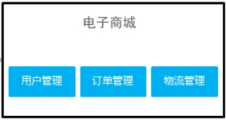 

一个归档包（例如war格式或者Jar格式）包含了应用所有功能的应用程序，我们通常称之为单体应用。架构单体应用的方法论，我们称之为单体应用架构，这是一种比较传统的架构风格。

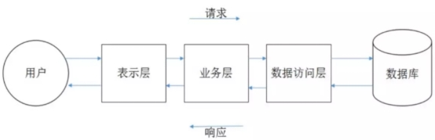 

***\*架构说明：\****

 全部功能集中在一个项目内（All in one）。

***\*架构优点：\****

 架构简单，前期开发成本低、开发周期短，适合小型项目。

***\*架构缺点：\****

① 复杂性高

整个项目包含的模块非常多，模块的边界模糊，依赖关系不清晰，代码质量参差不齐，整个项目非常复杂。每次修改代码都心惊胆战，甚至添加一个简单的功能，或者修改一个BUG都会造成隐含的缺陷。

② 技术债务逐渐上升

随着时间推移、需求变更和人员更迭，会逐渐形成应用程序的技术债务，并且越积越多。已使用的系统设计或代码难以修改，因为应用程序的其他模块可能会以意料之外的方式使用它。

③ 部署速度逐渐变慢

随着代码的增加，构建和部署的时间也会增加。而在单体应用中，每次功能的变更或缺陷的修复都会导致我们需要重新部署整个应用。全量部署的方式耗时长、影响范围大、风险高，这使得单体应用项目上线部署的频率较低，从而又导致两次发布之间会有大量功能变更和缺陷修复，出错概率较高。

④ 扩展能力受限，无法按需伸缩

单体应用只能作为一个整体进行扩展，无法结合业务模块的特点进行伸缩。

⑤ 阻碍技术创新

单体应用往往使用统一的技术平台或方案解决所有问题，团队的每个成员都必须使用相同的开发语言和架构，想要引入新的框架或技术平台非常困难。

***\*总结：\****

 全部功能集成在一个工程中，对于大型项目不易开发、扩展和维护。

 技术栈受限，只能使用一种语言开发。

 系统性能扩展只能通过扩展集群节点，成本高。

#### 1.2 、垂直架构

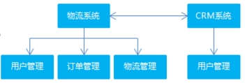 

***\*架构说明：\****

 按照业务进行切割，形成小的单体项目。

 垂直MVC项目主要有表现层，业务逻辑层，数据访问层组成的MVC架构，整个项目打包放在一个tomcat里面。适合于 访问量小，用户数不多的业务。

***\*架构优点：\****

 技术栈可扩展（不同的系统可以用不同的编程语言编写）。

***\*架构缺点：\****

 ① 这是一个大而全的项目，项目的部署效率很低，代码全量编译和部署一次发布需要很长时间，更重要的是 如果某个功能出错有问题，所有的功能都需要再重新打包编译，部署效率极低。

 ② 团队协作难度高，如多人使用 **git** 很可能在同一个功能上，多人同时进行了修改，作为一个大而全的项目，可能个人只是需要开发其中一个小的模块的需求，却需要导入整个项目全量的代码。

***\*总结：\****

 功能集中在一个项目中，不利于开发、扩展、维护。

 系统扩张只能通过集群的方式。

 项目之间功能冗余、数据冗余、耦合性强。

#### 1.3、 SOA架构

**SOA** 全称为 **Service-Oriented Architecture**，即面向服务的架构。它可以根据需求通过网络对松散耦合的粗粒度应用组件(服务)进行分布式部署、组合和使用。一个服务通常以独立的形式存在于操作系统进程中。

站在功能的角度，把业务逻辑抽象成可复用的服务，通过服务的编排实现业务的快速再生，目的：把原先固有的业务功能转变为通用的业务服务，实现业务逻辑的快速复用。

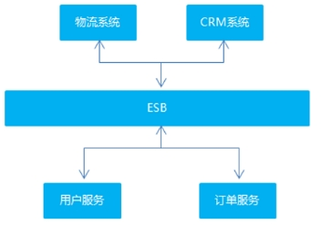 

***\*架构说明：\****

 将重复功能或模块抽取成组件的形式，对外提供服务，在项目与服务之间使用ESB（企业服务总线）的形式作为通信的桥梁。

***\*ESB\****

简单 来说 ESB 就是一根管道，用来连接各个服务节点。为了集 成不同系统，不同协议的服务，ESB 做了消息的转化解释和路由工作，让不同的服务互联互通；

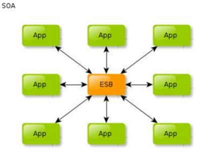 

***\*架构优点：\****

 重复功能或模块抽取为服务，提高开发效率。

 可重用性高。

 可维护性高。

***\*架构缺点：\****

 各系统之间业务不同，很难确认功能或模块是重复的。

 抽取服务的粒度大。

 系统和服务之间耦合度高。

从单体应用到SOA架构的转变：

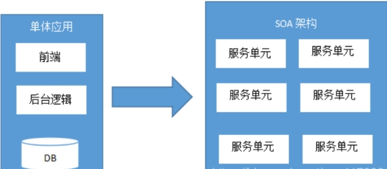 

#### 1.4 、微服务架构

### 

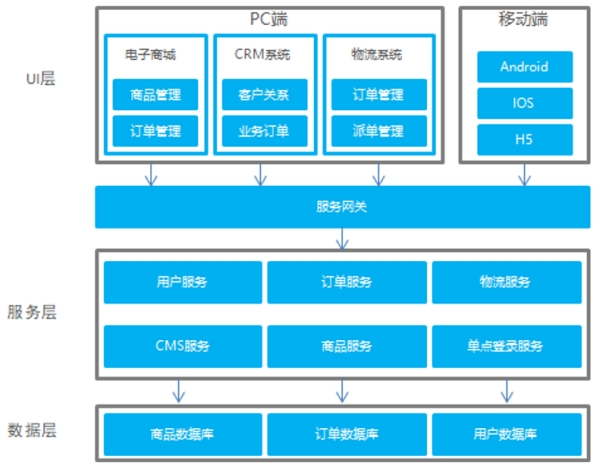 

***\*微服务架构:\****

其实和 SOA 架构类似,微服务是在 SOA 上做的升华，微服务架构强调的一个重点是“业务需要彻底的组件化和服务化”，原有的单个业务系统会拆分为多个可以独立开发、设计、运行的小应用。这些小应用之间通过服务完成交互和集成。

***\*架构说明：\****

 将系统服务层完全独立出来，抽取为一个一个的微服务。

 抽取的粒度更细，遵循单一原则。

 采用轻量级框架协议传输。

API 服务网关

API网关是一个服务器，是系统的唯一入口。从面向对象设计的角度看，它与外观模式类似。API网关封装了系统内部架构，为每个客户端提供一个定制的API。它可能还具有其它职责，如身份验证、监控、负载均衡、缓存、请求分片与管理、静态响应处理。API网关方式的核心要点是，所有的客户端和消费端都通过统一的网关接入微服务，在网关层处理所有的非业务功能。通常，网关也是提供REST/HTTP的访问API。服务端通过API-GW注册和管理服务。

***\*架构优点：\****

 服务拆分粒度更细，有利于提高开发效率。

 可以针对不同服务制定对应的优化方案。

 适用于互联网时代，产品迭代周期更短。

***\*架构缺点：\****

 粒度太细导致服务太多，维护成本高。

 分布式系统开发的技术成本高，对团队的挑战大。

### 2、Apache Dubbo概述

#### 2.1、 Dubbo简介

***\*Apache Dubbo是一款高性能的Java RPC框架\****。其前身是阿里巴巴公司开源的一个高性能、轻量级的开源Java RPC框架，可以和Spring框架无缝集成。

什么是RPC？

RPC全称为remote procedure call，即**远程过程调用**。比如两台服务器A和B，A服务器上部署一个应用，B服务器上部署一个应用，A服务器上的应用想调用B服务器上的应用提供的方法，由于两个应用不在一个内存空间，不能直接调用，所以需要通过网络来表达调用的语义和传达调用的数据。

需要注意的是RPC并不是一个具体的技术，而是指整个网络远程调用过程。

RPC是一个泛化的概念，严格来说一切远程过程调用手段都属于RPC范畴。各种开发语言都有自己的RPC框架。Java中的RPC框架比较多，广泛使用的有RMI、Hessian、Dubbo等。

Dubbo官网地址：http://dubbo.apache.org 

Dubbo提供了三大核心能力：面向接口的远程方法调用，智能容错和负载均衡，以及服务自动注册和发现。

通俗一点说，就是一般程序员对于本地的过程调用很熟悉，那么我们把 RPC 作成和本地调用完全类似，那么就更容易被接受，使用起来毫无障碍。

#### 2.2、Dubbo架构

Dubbo架构图（Dubbo官方提供）如下：

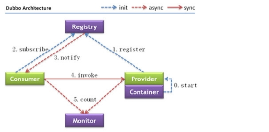 

节点角色说明：

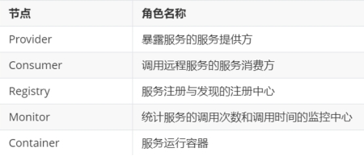 

虚线都是异步访问，实线都是同步访问
蓝色虚线:在启动时完成的功能
红色虚线(实线)都是程序运行过程中执行的功能

调用关系说明:

1. 服务容器负责启动，加载，运行服务提供者。

2. 服务提供者在启动时，向注册中心注册自己提供的服务。

3. 服务消费者在启动时，向注册中心订阅自己所需的服务。

4. 注册中心返回服务提供者地址列表给消费者，如果有变更，注册中心将基于长连接推送变更数据给消费者。

5. 服务消费者，从提供者地址列表中，基于负载均衡算法，选一台提供者进行调用，如果调用失败，再选另一台调用。

6. 服务消费者和提供者，在内存中累计调用次数和调用时间，定时每分钟发送一次统计数据到监控中心。

### 3、 服务注册中心Zookeeper

通过前面的Dubbo架构图可以看到，Registry（服务注册中心）在其中起着至关重要的作用。Dubbo官方推荐使用Zookeeper作为服务注册中心。

#### 3.1、Zookeeper介绍

Zookeeper 是 Apache Hadoop 的子项目，是一个树型的目录服务，支持变更推送，适合作为 Dubbo 服务的注册中心，工业强度较高，可用于生产环境，并推荐使用 。

为了便于理解Zookeeper的树型目录服务，我们先来看一下我们电脑的文件系统(也是一个树型目录结构)：

 

我的电脑可以分为多个盘符（例如C、D、E等），每个盘符下可以创建多个目录，每个目录下面可以创建文件，也可以创建子目录，最终构成了一个树型结构。通过这种树型结构的目录，我们可以将文件分门别类的进行存放，方便我们后期查找。而且磁盘上的每个文件都有一个唯一的访问路径。

Zookeeper树型目录服务：

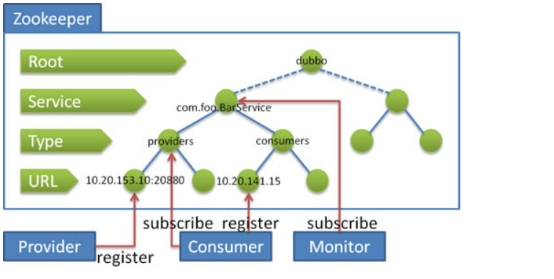 

流程说明：

· 服务提供者(Provider)启动时: 向 **/dubbo/com.foo.BarService/providers** 目录下写入自己的 URL 地址

· 服务消费者(Consumer)启动时: 订阅 **/dubbo/com.foo.BarService/providers** 目录下的提供者 URL 地址。并向 **/dubbo/com.foo.BarService/consumers** 目录下写入自己的 URL 地址

· 监控中心(Monitor)启动时: 订阅 **/dubbo/com.foo.BarService** 目录下的所有提供者和消费者 URL 地址

#### 3.2、安装Zookeeper

下载地址：http://archive.apache.org/dist/zookeeper/ 

#### 3.3、启动、停止Zookeeper

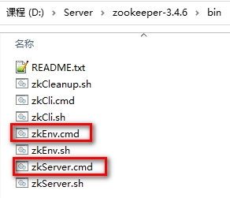 

需要注意：

Zookeeper在Windows下启动只需要运行zkServer.cmd双击即可（需保证运行环境中正确安装了Java运行环境）

但是在有的时候会出现双击闪退的情况。针对闪退，可按照以下步骤进行解决：

1 、编辑zkServer.cmd文件末尾添加pause 。这样运行出错就不会退出，会提示错误信息，方便找到原因。例如原因如下：

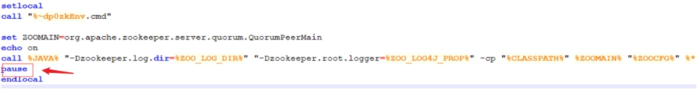 

2、重新双击运行zkServer.cmd

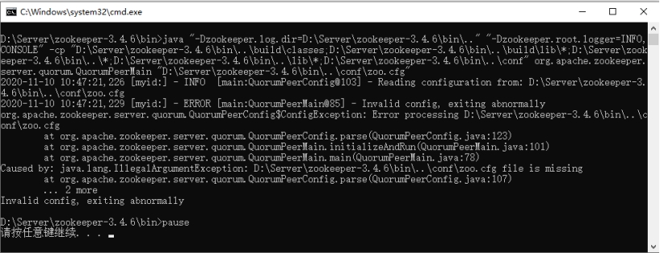 

错误原因 ，找不到zoo.cfg配置文件

3、查看zkEnv.cmd

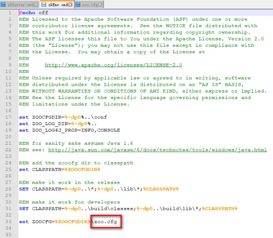 

4 、增加zoo.cfg文件，如下：

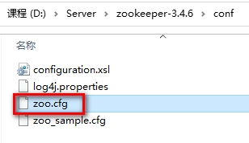 

5、 zoo.cfg配置文件介绍

修改dataDir属性值，在上级目录下增加data目录

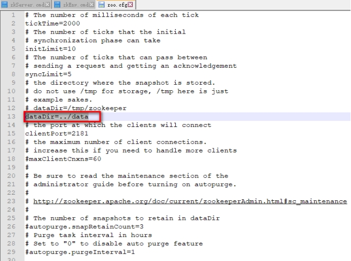 

6、重新双击zkServer.cmd启动

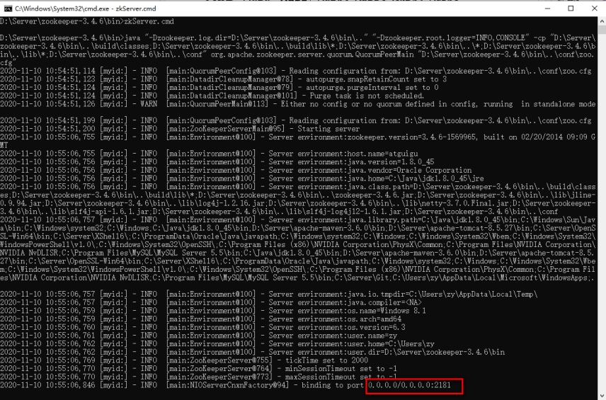 

### 4、Dubbo快速入门

Dubbo作为一个RPC框架，其最核心的功能就是要实现跨网络的远程调用。本小节就是要创建两个应用，一个作为服务的提供方，一个作为服务的消费方。通过Dubbo来实现服务消费方远程调用服务提供方的方法。

#### 4.1、服务提供方开发

开发步骤：

先创建一个dubbodemo的工程。在文件夹下创建提供者和消费者项目。

1、创建maven工程（打包方式为war）dubbodemo_provider，在pom.xml文件中导入如下坐标

```xml
<packaging>war</packaging>
<properties>
<project.build.sourceEncoding>UTF-8</project.build.sourceEncoding>
<maven.compiler.source>1.8</maven.compiler.source>
<maven.compiler.target>1.8</maven.compiler.target>
<spring.version>5.0.5.RELEASE</spring.version>
</properties>
<dependencies>
<dependency>
    <groupId>org.springframework</groupId>
    <artifactId>spring-webmvc</artifactId>
    <version>${spring.version}</version>
</dependency>
<dependency>
    <groupId>org.springframework</groupId>
    <artifactId>spring-jdbc</artifactId>
    <version>${spring.version}</version>
</dependency>
<dependency>
    <groupId>org.springframework</groupId>
    <artifactId>spring-aspects</artifactId>
    <version>${spring.version}</version>
</dependency>
<dependency>
    <groupId>org.springframework</groupId>
    <artifactId>spring-jms</artifactId>
    <version>${spring.version}</version>
</dependency>
<dependency>
    <groupId>org.springframework</groupId>
    <artifactId>spring-context-support</artifactId>
    <version>${spring.version}</version>
</dependency>
<!-- dubbo相关 -->
<dependency>
    <groupId>com.alibaba</groupId>
    <artifactId>dubbo</artifactId>
    <version>2.6.0</version>
</dependency>
<dependency>
    <groupId>org.apache.zookeeper</groupId>
    <artifactId>zookeeper</artifactId>
    <version>3.4.7</version>
</dependency>
<dependency>
    <groupId>com.github.sgroschupf</groupId>
    <artifactId>zkclient</artifactId>
    <version>0.1</version>
</dependency>
<dependency>
    <groupId>javassist</groupId>
    <artifactId>javassist</artifactId>
    <version>3.12.1.GA</version>
</dependency>
<dependency>
    <groupId>com.alibaba</groupId>
    <artifactId>fastjson</artifactId>
    <version>1.2.47</version>
</dependency>
</dependencies>
<build>
<plugins>
    <plugin>
        <groupId>org.apache.maven.plugins</groupId>
        <artifactId>maven-compiler-plugin</artifactId>
        <version>2.3.2</version>
        <configuration>
            <source>1.8</source>
            <target>1.8</target>
        </configuration>
    </plugin>
    <plugin>
        <groupId>org.apache.tomcat.maven</groupId>
        <artifactId>tomcat7-maven-plugin</artifactId>
        <version>2.2</version>
        <configuration>
            <!-- 指定端口 -->
            <port>8081</port>
            <!-- 请求路径 -->
            <path>/</path>
        </configuration>
    </plugin>
</plugins>
</build>
```

2、配置web.xml文件

创建 webapp/WEB-INF/web.xml

```xml
<?xml version="1.0" encoding="UTF-8"?>
<web-app xmlns="http://xmlns.jcp.org/xml/ns/javaee"
         xmlns:xsi="http://www.w3.org/2001/XMLSchema-instance"
         xsi:schemaLocation="http://xmlns.jcp.org/xml/ns/javaee http://xmlns.jcp.org/xml/ns/javaee/web-app_3_1.xsd"
         version="3.1">
    <context-param>
        <param-name>contextConfigLocation</param-name>
        <param-value>classpath:applicationContext*.xml</param-value>
    </context-param>
    <listener>
        <listener-class>org.springframework.web.context.ContextLoaderListener</listener-class>
    </listener>
</web-app>
```

3、创建服务接口

```java
package com.atguigu.service;
public interface HelloService {
    public String sayHello(String name);
}
```

4、创建服务实现类

```java
package com.atguigu.service.impl;
import com.alibaba.dubbo.config.annotation.Service;
import com.atguigu.service.HelloService;
@Service
public class HelloServiceImpl implements HelloService {
    @Override
    public String sayHello(String name) {
        return "hello " + name;
    }
}
```

注意：服务实现类上使用的 **Service** 注解是**Dubbo**提供的，用于对外发布服务

5、在src/main/resources下创建 **applicationContext-service.xml**

```xml
<?xml version="1.0" encoding="UTF-8"?>
<beans xmlns="http://www.springframework.org/schema/beans"
       xmlns:xsi="http://www.w3.org/2001/XMLSchema-instance"
       xmlns:dubbo="http://code.alibabatech.com/schema/dubbo"
       xsi:schemaLocation="http://www.springframework.org/schema/beans
      http://www.springframework.org/schema/beans/spring-beans.xsd
         http://code.alibabatech.com/schema/dubbo
         http://code.alibabatech.com/schema/dubbo/dubbo.xsd">
    <!-- 当前应用名称，用于注册中心计算应用间依赖关系，注意：消费者和提供者应用名不要一样 -->
    <dubbo:application name="dubbodemo_provider" />
    <!-- 连接服务注册中心zookeeper ip为zookeeper所在服务器的ip地址-->
    <dubbo:registry address="zookeeper://127.0.0.1:2181"/>
    <!-- 注册  协议和port   端口默认是20880 -->
    <dubbo:protocol name="dubbo" port="20881"></dubbo:protocol>
    <!-- 扫描指定包，加入@Service注解的类会被发布为服务  -->
    <dubbo:annotation package="com.atguigu.service.impl" />
</beans>
```

启动服务

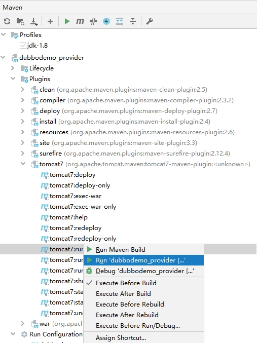 

#### 4.2、 服务消费方开发

开发步骤：

1、创建 **maven** 工程（打包方式为war）**dubbodemo_consumer**，**pom.xml** 配置和上面服务提供者相同，只需要将 **Tomcat** 插件的端口号改为8082即可

```xml
<packaging>war</packaging>
<properties>
<project.build.sourceEncoding>UTF-8</project.build.sourceEncoding>
<maven.compiler.source>1.8</maven.compiler.source>
<maven.compiler.target>1.8</maven.compiler.target>
<spring.version>5.0.5.RELEASE</spring.version>
</properties>
<dependencies>
<dependency>
    <groupId>org.springframework</groupId>
    <artifactId>spring-webmvc</artifactId>
    <version>${spring.version}</version>
</dependency>
<dependency>
    <groupId>org.springframework</groupId>
    <artifactId>spring-jdbc</artifactId>
    <version>${spring.version}</version>
</dependency>
<dependency>
    <groupId>org.springframework</groupId>
    <artifactId>spring-aspects</artifactId>
    <version>${spring.version}</version>
</dependency>
<dependency>
    <groupId>org.springframework</groupId>
    <artifactId>spring-jms</artifactId>
    <version>${spring.version}</version>
</dependency>
<dependency>
    <groupId>org.springframework</groupId>
    <artifactId>spring-context-support</artifactId>
    <version>${spring.version}</version>
</dependency>
<!-- dubbo相关 -->
<dependency>
    <groupId>com.alibaba</groupId>
    <artifactId>dubbo</artifactId>
    <version>2.6.0</version>
</dependency>
<dependency>
    <groupId>org.apache.zookeeper</groupId>
    <artifactId>zookeeper</artifactId>
    <version>3.4.7</version>
</dependency>
<dependency>
    <groupId>com.github.sgroschupf</groupId>
    <artifactId>zkclient</artifactId>
    <version>0.1</version>
</dependency>
<dependency>
    <groupId>javassist</groupId>
    <artifactId>javassist</artifactId>
    <version>3.12.1.GA</version>
</dependency>
<dependency>
    <groupId>com.alibaba</groupId>
    <artifactId>fastjson</artifactId>
    <version>1.2.47</version>
</dependency>
</dependencies>
<build>
<plugins>
    <plugin>
        <groupId>org.apache.maven.plugins</groupId>
        <artifactId>maven-compiler-plugin</artifactId>
        <version>2.3.2</version>
        <configuration>
            <source>1.8</source>
            <target>1.8</target>
        </configuration>
    </plugin>
    <plugin>
        <groupId>org.apache.tomcat.maven</groupId>
        <artifactId>tomcat7-maven-plugin</artifactId>
        <version>2.2</version>
        <configuration>
            <!-- 指定端口 -->
            <port>8082</port>
            <!-- 请求路径 -->
            <path>/</path>
        </configuration>
    </plugin>
</plugins>
</build>
```

2、配置webapp/WEB-INF/web.xml文件

```xml
<?xml version="1.0" encoding="UTF-8"?>
<web-app xmlns="http://xmlns.jcp.org/xml/ns/javaee"
         xmlns:xsi="http://www.w3.org/2001/XMLSchema-instance"
         xsi:schemaLocation="http://xmlns.jcp.org/xml/ns/javaee http://xmlns.jcp.org/xml/ns/javaee/web-app_3_1.xsd"
         version="3.1">
    <servlet>
        <servlet-name>springmvc</servlet-name>
        <servlet-class>org.springframework.web.servlet.DispatcherServlet</servlet-class>
        <!-- 指定加载的配置文件 ，通过参数contextConfigLocation加载 -->
        <init-param>
            <param-name>contextConfigLocation</param-name>
            <param-value>classpath:applicationContext-web.xml</param-value>
        </init-param>
        <load-on-startup>1</load-on-startup>
    </servlet>
    <servlet-mapping>
        <servlet-name>springmvc</servlet-name>
        <url-pattern>/</url-pattern>
    </servlet-mapping>
</web-app>
```

3、将服务提供者工程中的HelloService接口复制到当前工程

```java
package com.atguigu.service;
public interface HelloService {
    public String sayHello(String name);
}
```

4、编写Controller

```java
package com.atguigu.controller;

import com.alibaba.dubbo.config.annotation.Reference;
import com.atguigu.service.HelloService;
import org.springframework.beans.factory.annotation.Autowired;
import org.springframework.stereotype.Controller;
import org.springframework.web.bind.annotation.RequestMapping;
import org.springframework.web.bind.annotation.ResponseBody;
@Controller
@RequestMapping("/demo")
public class HelloController {
    @Reference
    private HelloService helloService;

    @RequestMapping("/hello")
    @ResponseBody
    public String getName(String name){
        //远程调用
        String result = helloService.sayHello(name);
        System.out.println(result);
        return result;
    }
}
```

注意：Controller中注入HelloService使用的是Dubbo提供的@Reference注解

5、在src/main/resources下创建applicationContext-web.xml

```xml
<?xml version="1.0" encoding="UTF-8"?>
<beans xmlns="http://www.springframework.org/schema/beans"
       xmlns:xsi="http://www.w3.org/2001/XMLSchema-instance"
       xmlns:dubbo="http://code.alibabatech.com/schema/dubbo"
       xsi:schemaLocation="http://www.springframework.org/schema/beans
         http://www.springframework.org/schema/beans/spring-beans.xsd
         http://code.alibabatech.com/schema/dubbo
         http://code.alibabatech.com/schema/dubbo/dubbo.xsd">

    <!-- 当前应用名称，用于注册中心计算应用间依赖关系，注意：消费者和提供者应用名不要一样 -->
    <dubbo:application name="dubbodemo_consumer" />
    <!-- 连接服务注册中心zookeeper ip为zookeeper所在服务器的ip地址-->
    <dubbo:registry address="zookeeper://127.0.0.1:2181"/>
    <!-- 扫描的方式暴露接口  -->
    <dubbo:annotation package="com.atguigu.controller" />
    <!-- 运行dubbo不检查提供者是否提前开启  -->
    <!-- <dubbo:consumer check="false"></dubbo:consumer> -->
</beans>
```

6、运行测试

在浏览器输入http://localhost:8082/demo/hello?name=Jack，查看浏览器输出结果

***\*思考一\****：上面的Dubbo入门案例中我们是将HelloService接口从服务提供者工程(dubbodemo_provider)复制到服务消费者工程(dubbodemo_consumer)中，这种做法是否合适？还有没有更好的方式？

答：这种做法显然是不好的，同一个接口被复制了两份，不利于后期维护。更好的方式是单独创建一个maven工程，将此接口创建在这个maven工程中。需要依赖此接口的工程只需要在自己工程的pom.xml文件中引入maven坐标即可。

***\*思考二\****：在服务消费者工程(dubbodemo_consumer)中只是引用了HelloService接口，并没有提供实现类，Dubbo是如何做到远程调用的？

答：Dubbo底层是基于代理技术为HelloService接口创建代理对象，远程调用是通过此代理对象完成的。

***\*思考三\****：上面的Dubbo入门案例中我们使用Zookeeper作为服务注册中心，服务提供者需要将自己的服务信息注册到Zookeeper，服务消费者需要从Zookeeper订阅自己所需要的服务，此时Zookeeper服务就变得非常重要了，那如何防止Zookeeper单点故障呢？

答：Zookeeper其实是支持集群模式的，可以配置Zookeeper集群来达到Zookeeper服务的高可用，防止出现单点故障。

#### 4.3、代码重构

① 创建项目：dubbodemo_interface

② 把 项目dubbodemo_consumer 和 项目dubbodemo_provider当中的 接口 HelloService 拷贝到dubbodemo_interface工程里面

③ 删除工程dubbodemo_consumer 和 工程dubbodemo_provider当中的 接口 HelloService

dubbodemo_consumer 工程和dubbodemo_provider添加pom文件的依赖

```xml
<dependency>
    <groupId>com.atguigu</groupId>
    <artifactId>dubbodemo_interface</artifactId>
    <version>1.0-SNAPSHOT</version>
</dependency>
```

④ 运行程序：http://localhost:8082/demo/hello?name=haha

#### 4.4、加入log4j日志

 

运行程序发现**dubbo**建议大家使用 **log4j**日志，我们就需要在 **resources** 文件夹下面引入**log4j.properties**日志文件

```properties
### direct log messages to stdout ###
log4j.appender.stdout=org.apache.log4j.ConsoleAppender
log4j.appender.stdout.Target=System.err
log4j.appender.stdout.layout=org.apache.log4j.PatternLayout
log4j.appender.stdout.layout.ConversionPattern=%d{ABSOLUTE} %5p %c{1}:%L - %m%n
### direct messages to file mylog.log ###
log4j.appender.file=org.apache.log4j.FileAppender
log4j.appender.file.File=d:\\mylog.log
log4j.appender.file.layout=org.apache.log4j.PatternLayout
log4j.appender.file.layout.ConversionPattern=%d{ABSOLUTE} %5p %c{1}:%L - %m%n
### set log levels - for more verbose logging change 'info' to 'debug' ###
log4j.rootLogger=debug, stdout
```

### 5、Dubbo管理控制台

我们在开发时，需要知道Zookeeper注册中心都注册了哪些服务，有哪些消费者来消费这些服务。我们可以通过部署一个管理中心来实现。其实管理中心就是一个web应用，部署到tomcat即可。

#### 5.1、安装

安装步骤：

1、将资料中的dubbo-admin-2.6.0.war文件复制到tomcat的webapps目录下

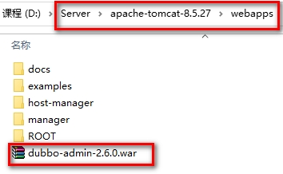 /2、（2）启动tomcat，此war文件会自动解压

3、修改WEB-INF下的dubbo.properties文件，注意dubbo.registry.address对应的值需要对应当前使用的Zookeeper的ip地址和端口号

```properties
#如果Zookeeper是安装在虚拟机上的那么注册中心的地址需要修改为虚拟机的ip地址
dubbo.registry.address=zookeeper://192.168.6.100:2181
dubbo.admin.root.password=root
dubbo.admin.guest.password=guest
```

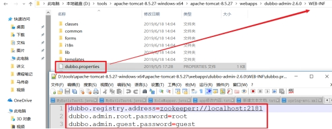

4、重启tomcat

#### 5.2、使用

操作步骤：

1、访问http://localhost:8080/dubbo-admin-2.6.0/ ，输入用户名(root)和密码(root),切换简体中文

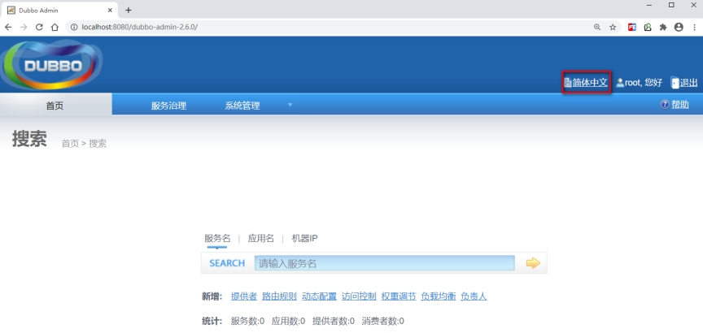 2、启动服务提供者工程和服务消费者工程，可以在查看到对应的信息

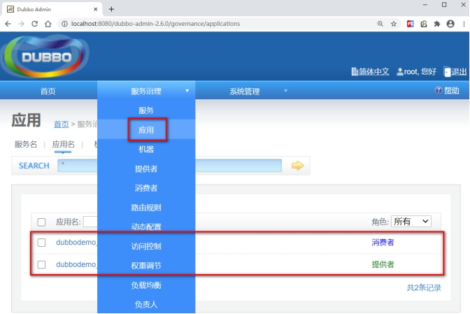 

### 6、Dubbo相关配置说明

#### 6.1、包扫描

```xml
<dubbo:annotation package="com.atguigu.service" />
```

服务提供者和服务消费者都需要配置，表示包扫描，作用是扫描指定包(包括子包)下的类。

如果不使用包扫描，也可以通过如下配置的方式来发布服务：

```xml
<bean id="helloService" class="com.atguigu.service.impl.HelloServiceImpl" />
<dubbo:service interface="com.atguigu.api.HelloService" ref="helloService" />
```

作为服务消费者，可以通过如下配置来引用服务：

```xml
<!-- 生成远程服务代理，可以和本地bean一样使用helloService -->
<dubbo:reference id="helloService" interface="com.atguigu.api.HelloService" />
```

上面这种方式发布和引用服务，一个配置项(<dubbo:service>、<dubbo:reference>)只能发布或者引用一个服务，如果有多个服务，这种方式就比较繁琐了。推荐使用包扫描方式。

#### 6.2、协议

```xml
<dubbo:protocol name="dubbo" port="20880"/>
```

一般在服务提供者一方配置，可以指定使用的协议名称和端口号。

其中Dubbo支持的协议有：dubbo、rmi、hessian、http、webservice、rest、redis等。

推荐使用的是dubbo协议。

dubbo 协议采用单一长连接和 NIO 异步通讯，适合于小数据量大并发的服务调用，以及服务消费者机器数远大于服务提供者机器数的情况。不适合传送大数据量的服务，比如传文件，传视频等，除非请求量很低。

也可以在同一个工程中配置多个协议，不同服务可以使用不同的协议，例如：

```xml
<!-- 多协议配置 -->
<dubbo:protocol name="dubbo" port="20880" />
<dubbo:protocol name="rmi" port="1099" />
<!-- 使用dubbo协议暴露服务 -->
<dubbo:service interface="com.atguigu.service.HelloService" ref="helloService" protocol="dubbo" />
<!-- 使用rmi协议暴露服务 -->
<dubbo:service interface="com.atguigu.service.DemoService" ref="demoService" protocol="rmi" /> 
```

#### 6.3、启动时检查

```xml
<dubbo:consumer check="false"/>
```

上面这个配置需要配置在服务消费者一方，如果不配置默认check值为true。Dubbo 缺省会在启动时检查依赖的服务是否可用，不可用时会抛出异常，阻止 Spring 初始化完成，以便上线时，能及早发现问题。可以通过将check值改为false来关闭检查。

建议在开发阶段将check值设置为false，在生产环境下改为true。

#### 6.4、负载均衡

负载均衡（Load Balance）：其实就是将请求分摊到多个操作单元上进行执行，从而共同完成工作任务。

在集群负载均衡时，Dubbo 提供了多种均衡策略（包括随机、轮询、最少活跃调用数、一致性Hash），缺省为random随机调用。

​	随机算法 RandomLoadBalance（默认）

​	轮询算法 RoundRobinLoadBalance

​	最小活跃数算法 LeastActiveLoadBalance

​	 一致性hash算法 ConsistentHashLoadBalance

配置负载均衡策略，既可以在服务提供者一方配置，也可以在服务消费者一方配置，如下：

```java
@Controller
@RequestMapping("/demo")
public class HelloController {
    //在服务消费者一方配置负载均衡策略
    @Reference(check = false,loadbalance = "random")
    private HelloService helloService;

    @RequestMapping("/hello")
    @ResponseBody
    public String getName(String name){
        //远程调用
        String result = helloService.sayHello(name);
        System.out.println(result);
        return result;
    }
}
```

```java
//在服务提供者一方配置负载均衡
@Service(loadbalance = "random")
public class HelloServiceImpl implements HelloService {
    public String sayHello(String name) {
        return "hello " + name;
    }
}
```

可以通过启动多个服务提供者来观察Dubbo负载均衡效果。

注意：因为我们是在一台机器上启动多个服务提供者，所以需要修改tomcat的端口号和Dubbo服务的端口号来防止端口冲突。

在实际生产环境中，多个服务提供者是分别部署在不同的机器上，所以不存在端口冲突问题。

##### 6.4.1 修改 dubbodemo_provider

① 修改pom文件的端口号，防止端口冲突

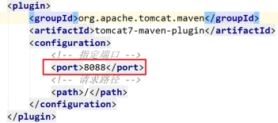 

② 修改 **applicationContext-service.xml** 配置文件

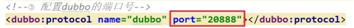 

① 为了演示方便，修改打印端口

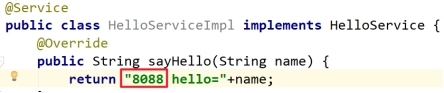 

② 运行 **dubbodemo_provider** 提供者两次，分别都修改端口

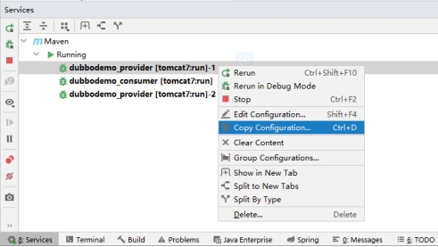 

⑤ 运行消费者 **dubbodemo_consumer**

⑥ 请求 **http://localhost:8082/demo/hello?name=Jack**

### 7、解决Dubbo无法发布被事务代理的Service问题

前面我们已经完成了Dubbo的入门案例，通过入门案例我们可以看到通过Dubbo提供的标签配置就可以进行包扫描，扫描到@Service注解的类就可以被发布为服务。

但是我们如果在服务提供者类上加入@Transactional事务控制注解后，服务就发布不成功了。原因是事务控制的底层原理是为服务提供者类创建代理对象，而默认情况下Spring是基于JDK动态代理方式创建代理对象，而此代理对象的完整类名为com.sun.proxy.$Proxy42（最后两位数字不是固定的），导致Dubbo在发布服务前进行包匹配时无法完成匹配，进而没有进行服务的发布。

#### 7.1、问题展示

在入门案例的服务提供者dubbodemo_provider工程基础上进行展示

操作步骤：

1、在pom.xml文件中增加maven坐标

```xml
<dependency>
    <groupId>mysql</groupId>
    <artifactId>mysql-connector-java</artifactId>
    <version>5.1.37</version>
</dependency>
<dependency>
    <groupId>com.alibaba</groupId>
    <artifactId>druid</artifactId>
    <version>1.1.10</version>
</dependency>
<dependency>
    <groupId>org.mybatis</groupId>
    <artifactId>mybatis-spring</artifactId>
    <version>2.0.6</version>
</dependency>
```

2、在applicationContext-service.xml配置文件中加入数据源、事务管理器、开启事务注解的相关配置

```xml
<?xml version="1.0" encoding="UTF-8"?>
<beans xmlns="http://www.springframework.org/schema/beans"
       xmlns:xsi="http://www.w3.org/2001/XMLSchema-instance"
       xmlns:p="http://www.springframework.org/schema/p"
       xmlns:context="http://www.springframework.org/schema/context"
       xmlns:dubbo="http://code.alibabatech.com/schema/dubbo"
       xmlns:mvc="http://www.springframework.org/schema/mvc" xmlns:tx="http://www.springframework.org/schema/tx"
       xsi:schemaLocation="http://www.springframework.org/schema/beans
      http://www.springframework.org/schema/beans/spring-beans.xsd
         http://www.springframework.org/schema/mvc
         http://www.springframework.org/schema/mvc/spring-mvc.xsd
         http://code.alibabatech.com/schema/dubbo
         http://code.alibabatech.com/schema/dubbo/dubbo.xsd
         http://www.springframework.org/schema/context
         http://www.springframework.org/schema/context/spring-context.xsd http://www.springframework.org/schema/tx http://www.springframework.org/schema/tx/spring-tx.xsd">
    <!-- 当前应用名称，用于注册中心计算应用间依赖关系，注意：消费者和提供者应用名不要一样 -->
    <dubbo:application name="dubbodemo_provider" />
    <!-- 连接服务注册中心zookeeper ip为zookeeper所在服务器的ip地址-->
    <dubbo:registry address="zookeeper://127.0.0.1:2181"/>
    <!-- 注册  协议和port   端口默认是20880 -->
    <dubbo:protocol name="dubbo" port="20882"></dubbo:protocol>
    <!-- 扫描指定包，加入@Service注解的类会被发布为服务  -->
    <dubbo:annotation package="com.atguigu.service.impl" />
    <!--数据源-->
    <bean id="dataSource" class="com.alibaba.druid.pool.DruidDataSource" destroy-method="close">
        <property name="username" value="root" />
        <property name="password" value="root" />
        <property name="driverClassName" value="com.mysql.jdbc.Driver" />
        <property name="url" value="jdbc:mysql://localhost:3306/test" />
    </bean>
    <!-- 事务管理器  -->
    <bean id="transactionManager" class="org.springframework.jdbc.datasource.DataSourceTransactionManager">
        <property name="dataSource" ref="dataSource"/>
    </bean>
    <!--开启事务控制的注解支持-->
    <tx:annotation-driven transaction-manager="transactionManager"/>
</beans>
```

上面连接的数据库可以自行创建

3、在HelloServiceImpl类上加入@Transactional注解

```java
package com.atguigu.service.impl;
import com.alibaba.dubbo.config.annotation.Service;
import com.atguigu.service.HelloService;
import org.springframework.transaction.annotation.Transactional;
@Service
@Transactional
public class HelloServiceImpl implements HelloService {
    @Override
    public String sayHello(String name) {
        return "8086 hello " + name;
    }
}
```

4、启动服务提供者和服务消费者，并访问

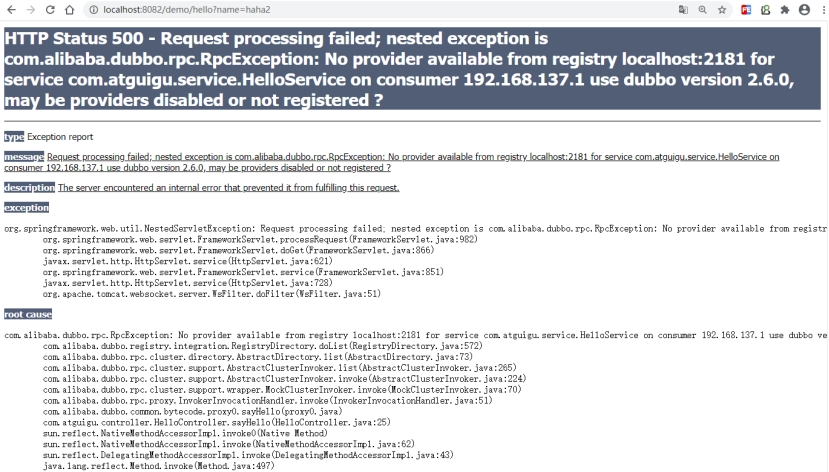 

上面的错误为没有可用的服务提供者

查看dubbo管理控制台发现服务并没有发布，如下：

 

可以通过断点调试的方式查看Dubbo执行过程，Dubbo通过AnnotationBean的postProcessAfterInitialization方法进行处

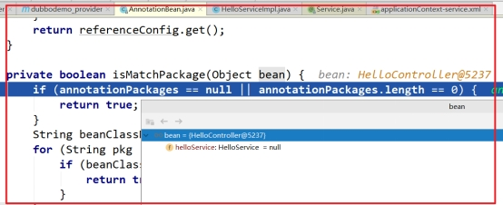 

#### 7.2、解决方案

通过上面的断点调试可以看到，在HelloServiceImpl类上加入事务注解后，Spring会为此类基于JDK动态代理技术创建代理对象，创建的代理对象完整类名为com.sun.proxy.$Proxy35，导致Dubbo在进行包匹配时没有成功（因为我们在发布服务时扫描的包为com.atguigu.service），所以后面真正发布服务的代码没有执行。

解决方式操作步骤：

1、修改applicationContext-service.xml配置文件，开启事务控制注解支持时指定proxy-target-class属性，值为true。其作用是使用cglib代理方式为Service类创建代理对象，添加如下配置：

```xml
<!--开启事务控制的注解支持-->
<tx:annotation-driven transaction-manager="transactionManager" proxy-target-class="true"/>
```

2、修改HelloServiceImpl类，在Service注解中加入interfaceClass属性，值为HelloService.class，作用是指定服务的接口类型

```java
package com.atguigu.service.impl;
import com.alibaba.dubbo.config.annotation.Service;
import com.atguigu.service.HelloService;
import org.springframework.transaction.annotation.Transactional;
@Service(interfaceClass = HelloService.class)
@Transactional
public class HelloServiceImpl implements HelloService {
    @Override
    public String sayHello(String name) {
        return "8086 hello " + name;
    }
}
```