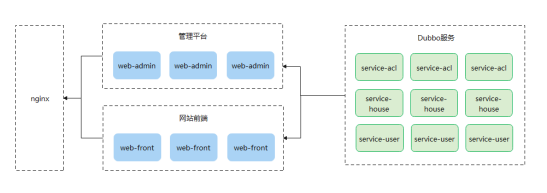

# 尚好房：服务拆分

## 一、业务介绍

### 1、项目模块划分

根据前面的介绍，目前我们的系统规划了3个dubbo服务提供者模块：权限服务、房源服务与会员服务，及2个服务消费者模块：尚好房管理平台（web-admin）与网站前端（web-front）

### 2、服务调用关系



### 3、项目说明

当前我们项目为单体的SSM项目，目前开发了权限管理的用户管理与角色管理，接着要开发房源管理的数据字典、小区管理与房源管理，权限管理与房源管理属于两不同的dubbo服务，当前我们就来把单体架构拆分为dubbo通信的分布式架构，拆分步骤：

1、shf-parent模块管理dubbo相关的依赖

2、common-util模块引入依赖

3、提取api接口模块：service-api

4、分解web-admin模块：

​	web-admin只负责dubbo消费端

​	service及dao层通过dubbo发布服务

## 二、服务拆分

### 1、shf-parent模块添加dubbo依赖管理

在shf-parent模块pom.xml新增依赖

```xml
<dubbo.version>2.6.0</dubbo.version>
<zookeeper.version>3.4.7</zookeeper.version>
<junit.version>4.12</junit.version>
<zkclient.version>0.1</zkclient.version>
```

```xml
<!-- dubbo相关 -->
<dependency>
    <groupId>com.alibaba</groupId>
    <artifactId>dubbo</artifactId>
    <version>${dubbo.version}</version>
</dependency>
<dependency>
    <groupId>org.apache.zookeeper</groupId>
    <artifactId>zookeeper</artifactId>
    <version>${zookeeper.version}</version>
</dependency>
<dependency>
    <groupId>com.github.sgroschupf</groupId>
    <artifactId>zkclient</artifactId>
    <version>${zkclient.version}</version>
</dependency>
<dependency>
    <groupId>junit</groupId>
    <artifactId>junit</artifactId>
    <version>${junit.version}</version>
</dependency>
<dependency>
    <groupId>javassist</groupId>
    <artifactId>javassist</artifactId>
    <version>3.12.1.GA</version>
</dependency>
<dependency>
    <groupId>commons-codec</groupId>
    <artifactId>commons-codec</artifactId>
    <version>1.10</version>
</dependency>
```

### 2、common-util模块引入依赖

在common-util模块pom.xml引入依赖

```xml
<!-- dubbo相关 -->
<dependency>
    <groupId>com.alibaba</groupId>
    <artifactId>dubbo</artifactId>
</dependency>
<dependency>
    <groupId>org.apache.zookeeper</groupId>
    <artifactId>zookeeper</artifactId>
</dependency>
<dependency>
    <groupId>com.github.sgroschupf</groupId>
    <artifactId>zkclient</artifactId>
</dependency>
<dependency>
    <groupId>junit</groupId>
    <artifactId>junit</artifactId>
</dependency>
<dependency>
    <groupId>javassist</groupId>
    <artifactId>javassist</artifactId>
</dependency>
<dependency>
    <groupId>commons-codec</groupId>
    <artifactId>commons-codec</artifactId>
</dependency>
```

### 3、搭建service-api模块

把service层接口提取到该模块

#### 3.1 、搭建service-api模块

搭建方式如：model模块

#### 3.2 、修改pom.xml文件

```xml
<?xml version="1.0" encoding="UTF-8"?>
<project xmlns="http://maven.apache.org/POM/4.0.0"
         xmlns:xsi="http://www.w3.org/2001/XMLSchema-instance"
         xsi:schemaLocation="http://maven.apache.org/POM/4.0.0 http://maven.apache.org/xsd/maven-4.0.0.xsd">
    <parent>
        <artifactId>shf-parent</artifactId>
        <groupId>com.atguigu</groupId>
        <version>1.0</version>
    </parent>
    <modelVersion>4.0.0</modelVersion>
    <artifactId>service-api</artifactId>
    <packaging>jar</packaging>

    <dependencies>
        <dependency>
            <groupId>com.atguigu</groupId>
            <artifactId>common-util</artifactId>
            <version>1.0</version>
            <scope>provided </scope>
        </dependency>
        <dependency>
            <groupId>com.atguigu</groupId>
            <artifactId>model</artifactId>
            <version>1.0</version>
        </dependency>
    </dependencies>

</project>
```

#### 3.3、 复制service接口

复制AdminService与RoleService到api模块


### 4、分解web-admin模块

web-admin模块会分解为4个模块：service父模块、service-acl模块、web父模块及web-admin模块，api模块前面已经搭建

#### 4.1、 搭建service父模块

搭建方式如：service-api

搭建完成删除src目录

修改pom.xml文件

```xml
<?xml version="1.0" encoding="UTF-8"?>
<project xmlns="http://maven.apache.org/POM/4.0.0"
         xmlns:xsi="http://www.w3.org/2001/XMLSchema-instance"
         xsi:schemaLocation="http://maven.apache.org/POM/4.0.0 http://maven.apache.org/xsd/maven-4.0.0.xsd">
    <parent>
        <artifactId>shf-parent</artifactId>
        <groupId>com.atguigu</groupId>
        <version>1.0</version>
    </parent>
    <modelVersion>4.0.0</modelVersion>

    <artifactId>service</artifactId>
    <packaging>pom</packaging>

    <dependencies>
        <dependency>
            <groupId>com.atguigu</groupId>
            <artifactId>common-util</artifactId>
            <version>1.0</version>
        </dependency>
        <dependency>
            <groupId>com.atguigu</groupId>
            <artifactId>model</artifactId>
            <version>1.0</version>
        </dependency>
        <dependency>
            <groupId>com.atguigu</groupId>
            <artifactId>service-api</artifactId>
            <version>1.0</version>
        </dependency>
    </dependencies>
</project>
```

#### 4.2 、搭建service-acl模块

搭建方式如：web-admin

说明：需创建java与resources目录等，请完全参考web-admin搭建方式

##### 4.2.1、修改pom.xml文件

```xml
<?xml version="1.0" encoding="UTF-8"?>

<project xmlns="http://maven.apache.org/POM/4.0.0" xmlns:xsi="http://www.w3.org/2001/XMLSchema-instance"
         xsi:schemaLocation="http://maven.apache.org/POM/4.0.0 http://maven.apache.org/xsd/maven-4.0.0.xsd">
    <parent>
        <artifactId>service</artifactId>
        <groupId>com.atguigu</groupId>
        <version>1.0</version>
    </parent>
    <modelVersion>4.0.0</modelVersion>

    <artifactId>service-acl</artifactId>
    <packaging>war</packaging>

    <build>
        <plugins>
            <plugin>
                <groupId>org.eclipse.jetty</groupId>
                <artifactId>jetty-maven-plugin</artifactId>
                <version>9.4.15.v20190215</version>
                <configuration>
                    <!-- 如果检测到项目有更改则自动热部署，每隔n秒扫描一次。默认为0，即不扫描-->
                    <scanIntervalSeconds>10</scanIntervalSeconds>
                    <webAppConfig>
                        <!--指定web项目的根路径，默认为/ -->
                        <contextPath>/</contextPath>
                    </webAppConfig>
                    <httpConnector>
                        <!--端口号，默认 8080-->
                        <port>7001</port>
                    </httpConnector>
                </configuration>
            </plugin>
        </plugins>
    </build>
</project>
```

4.2.2、复制service实现及dao层代码

1、复制代码包结构不变

2、复制AdminServiceImpl及RoleServiceImpl到sevice-acl模块，

3、更改service实现标签：

​	import com.alibaba.dubbo.config.annotation.Service;

​	dubbo相关的@Service标签

​    @Transactional

​    @Service(interfaceClass = AdminService.class)

​	AdminServiceImpl

​    @Transactional

​	@Service(interfaceClass = RoleService.class)

​	RoleServiceImpl

4、复制AdminDao及RoleDao到sevice-acl模块

5、复制mapper到sevice-acl模块resources目录

##### 4.2.3、处理配置文件

1、复制logback.xml到sevice-acl模块resources目录

2、mybatis-config.xml到sevice-acl模块resources目录

3、spring/spring-dao.xml到sevice-acl模块resources/spring/目录

3、spring/spring-service.xml到sevice-acl模块resources/spring/目录，该文件调整

​	

```xml
<!--
    开启事务控制的注解支持
    注意：此处必须加入proxy-target-class="true"，
          需要进行事务控制，会由Spring框架产生代理对象，
          Dubbo需要将Service发布为服务，要求必须使用cglib创建代理对象。
-->
<tx:annotation-driven transaction-manager="transactionManager" proxy-target-class="true"/>
```

4、添加发布dubbo服务的配置文件:spring/spring-registry.xml

```xml
<?xml version="1.0" encoding="UTF-8"?>
<beans xmlns="http://www.springframework.org/schema/beans"
       xmlns:xsi="http://www.w3.org/2001/XMLSchema-instance"
       xmlns:dubbo="http://code.alibabatech.com/schema/dubbo"
       xsi:schemaLocation="http://www.springframework.org/schema/beans
                            http://www.springframework.org/schema/beans/spring-beans.xsd
                            http://code.alibabatech.com/schema/dubbo
                            http://code.alibabatech.com/schema/dubbo/dubbo.xsd">
    <!-- 指定应用名称 -->
    <dubbo:application name="service_acl"/>
    <!--指定暴露服务的端口，如果不指定默认为20880 -->
    <dubbo:protocol name="dubbo" port="20881"/>
    <!--指定服务注册中心地址-->
    <dubbo:registry address="zookeeper://127.0.0.1:2181"/>
    <!--批量扫描，发布服务-->
    <dubbo:annotation package="com.atguigu"/>

</beans>
```

##### 4.2.4、修改web.xml

```xml
<?xml version="1.0" encoding="UTF-8"?>
<web-app xmlns:xsi="http://www.w3.org/2001/XMLSchema-instance"
         xmlns="http://java.sun.com/xml/ns/javaee"
         xsi:schemaLocation="http://java.sun.com/xml/ns/javaee http://java.sun.com/xml/ns/javaee/web-app_3_0.xsd"
         id="WebApp_ID" version="3.0">

  <!-- 加载spring容器 ，没有*表示当前项目的根路径，有*表示依赖所有项目的根路径-->
  <context-param>
    <param-name>contextConfigLocation</param-name>
    <param-value>classpath:spring/spring-*.xml</param-value>
  </context-param>
  <listener>
    <listener-class>org.springframework.web.context.ContextLoaderListener</listener-class>
  </listener>
</web-app>
```

##### 4.2.5、项目结构


#### 4.3 、搭建web父模块

搭建方式如：service

搭建完成删除src目录

修改pom.xml

```xml
<?xml version="1.0" encoding="UTF-8"?>
<project xmlns="http://maven.apache.org/POM/4.0.0"
         xmlns:xsi="http://www.w3.org/2001/XMLSchema-instance"
         xsi:schemaLocation="http://maven.apache.org/POM/4.0.0 http://maven.apache.org/xsd/maven-4.0.0.xsd">
    <parent>
        <artifactId>shf-parent</artifactId>
        <groupId>com.atguigu</groupId>
        <version>1.0</version>
    </parent>
    <modelVersion>4.0.0</modelVersion>

    <artifactId>web</artifactId>
    <packaging>pom</packaging>

    <modules>
        <module>web-admin</module>
    </modules>

    <dependencies>
        <dependency>
            <groupId>com.atguigu</groupId>
            <artifactId>common-util</artifactId>
            <version>1.0</version>
        </dependency>
        <dependency>
            <groupId>com.atguigu</groupId>
            <artifactId>model</artifactId>
            <version>1.0</version>
        </dependency>
        <dependency>
            <groupId>com.atguigu</groupId>
            <artifactId>service-api</artifactId>
            <version>1.0</version>
        </dependency>
    </dependencies>

</project>
```

#### 4.4 、改造web-admin模块

##### 4.4.1、移动模块

将web-admin移动到web

删除shf-parent模块pom.xml文件的<module>web-admin</module>标签，改模块已移动到web模块

##### 4.4.2、修改pom.xml

修改了父模块为web，删除了依赖（父模块已引入依赖）

```xml
<?xml version="1.0" encoding="UTF-8"?>

<project xmlns="http://maven.apache.org/POM/4.0.0" xmlns:xsi="http://www.w3.org/2001/XMLSchema-instance"
         xsi:schemaLocation="http://maven.apache.org/POM/4.0.0 http://maven.apache.org/xsd/maven-4.0.0.xsd">
    <parent>
        <artifactId>web</artifactId>
        <groupId>com.atguigu</groupId>
        <version>1.0</version>
    </parent>
    <modelVersion>4.0.0</modelVersion>

    <artifactId>web-admin</artifactId>
    <packaging>war</packaging>

  	<build>
        <plugins>
            <plugin>
                <groupId>org.eclipse.jetty</groupId>
                <artifactId>jetty-maven-plugin</artifactId>
                <version>9.4.15.v20190215</version>
                <configuration>
                    <!-- 如果检测到项目有更改则自动热部署，每隔n秒扫描一次。默认为0，即不扫描-->
                    <scanIntervalSeconds>10</scanIntervalSeconds>
                    <webAppConfig>
                        <!--指定web项目的根路径，默认为/ -->
                        <contextPath>/</contextPath>
                    </webAppConfig>
                    <httpConnector>
                        <!--端口号，默认 8080-->
                        <port>8000</port>
                    </httpConnector>
                </configuration>
            </plugin>
        </plugins>
    </build>
</project>
```

##### 4.4.3、删除service与dao层

删除service与dao层包下的代码，删除mapper文件夹，删除mybatis-config.xml文件

这样文件都不需要了

##### 4.4.3、改造controller层

修改AdminController、RoleController注入标签

```java
@Reference
private AdminService adminService;
```

```java
@Reference
private RoleService roleService;
```

##### 4.4.4、处理配置文件

删除spring/spring-service.xml与spring/spring-dao.xml

修改spring/spring-mvc.xml，引入了dubbo配置文件

```xml
<?xml version="1.0" encoding="UTF-8"?>
<beans xmlns="http://www.springframework.org/schema/beans"
       xmlns:xsi="http://www.w3.org/2001/XMLSchema-instance"
       xmlns:context="http://www.springframework.org/schema/context"
       xmlns:aop="http://www.springframework.org/schema/aop"
       xmlns:mvc="http://www.springframework.org/schema/mvc"
       xsi:schemaLocation="http://www.springframework.org/schema/beans
        http://www.springframework.org/schema/beans/spring-beans.xsd
        http://www.springframework.org/schema/context
        http://www.springframework.org/schema/context/spring-context.xsd
        http://www.springframework.org/schema/aop
        http://www.springframework.org/schema/aop/spring-aop.xsd
        http://www.springframework.org/schema/mvc
        http://www.springframework.org/schema/mvc/spring-mvc.xsd">
    <!-- 先扫描dubbo 在扫描 mvn -->
    <import resource="spring-registry.xml"></import>

    <!--包扫描-->
    <context:component-scan base-package="com.atguigu.controller" />

    <!-- 没有匹配上的url全部按默认方式（就是直接访问）访问，避免拦截静态资源 -->
    <mvc:default-servlet-handler/>
    <!-- 开启mvc注解-->
    <mvc:annotation-driven>
        <mvc:message-converters register-defaults="true">
            <!-- 配置Fastjson支持 -->
            <bean class="com.alibaba.fastjson.support.spring.FastJsonHttpMessageConverter">
                <property name="supportedMediaTypes">
                    <list>
                        <value>text/html;charset=UTF-8</value>
                        <value>application/json</value>
                    </list>
                </property>
            </bean>
        </mvc:message-converters>
    </mvc:annotation-driven>

    <!--视图解析器-->
    <bean id="templateResolver" class="org.thymeleaf.spring5.templateresolver.SpringResourceTemplateResolver">
        <!--配置前缀-->
        <property name="prefix" value="/WEB-INF/templates/"></property>
        <!--配置后缀-->
        <property name="suffix" value=".html"></property>
        <!--配置编码格式-->
        <property name="characterEncoding" value="UTF-8"></property>
        <!--设置缓存为null-->
        <property name="cacheable" value="false"></property>
        <!--配置模板模式,
        HTML5:表示严格模式
        LEGACYHTML5：表示宽松模式-->
        <property name="templateMode" value="LEGACYHTML5"></property>
    </bean>
    <!--配置spring的视图解析器-->
    <bean id="viewResolver" class="org.thymeleaf.spring5.view.ThymeleafViewResolver">
        <!--设置编码格式-->
        <property name="characterEncoding" value="UTF-8"></property>
        <!--设置模板引擎-->
        <property name="templateEngine" ref="templateEngine"/>
    </bean>
    <!--配置模板引擎-->
    <bean id="templateEngine" class="org.thymeleaf.spring5.SpringTemplateEngine">
        <!--引用视图解析器-->
        <property name="templateResolver" ref="templateResolver"></property>
    </bean>
</beans>
```

新增spring/spring-registry.xml

```xml
<?xml version="1.0" encoding="UTF-8"?>
<beans xmlns="http://www.springframework.org/schema/beans"
       xmlns:xsi="http://www.w3.org/2001/XMLSchema-instance"
       xmlns:dubbo="http://code.alibabatech.com/schema/dubbo"
       xsi:schemaLocation="http://www.springframework.org/schema/beans
                            http://www.springframework.org/schema/beans/spring-beans.xsd
                            http://code.alibabatech.com/schema/dubbo
                            http://code.alibabatech.com/schema/dubbo/dubbo.xsd">
    <!--配置dubbo应用程序名称-->
    <dubbo:application name="web_admin"></dubbo:application>
    <!--注册配置中心-->
    <dubbo:registry address="zookeeper://127.0.0.1:2181"></dubbo:registry>
    <!--dubbo扫描-->
    <dubbo:annotation package="com.atguigu"></dubbo:annotation>
    <!--启动时候不检查 设置连接超时时间-->
    <dubbo:consumer check="false" timeout="600000"></dubbo:consumer>

</beans>
```

##### 4.4.5、处理web.xml

注释掉ContextLoaderListener监听，目前只有mvc部分了，不需要监听

```xml
<?xml version="1.0" encoding="UTF-8"?>
<web-app xmlns:xsi="http://www.w3.org/2001/XMLSchema-instance"
         xmlns="http://java.sun.com/xml/ns/javaee"
         xsi:schemaLocation="http://java.sun.com/xml/ns/javaee http://java.sun.com/xml/ns/javaee/web-app_3_0.xsd"
         id="WebApp_ID" version="3.0">
  <display-name>web</display-name>

  <!-- 解决post乱码 添加字符编码过滤器 -->
  <filter>
    <filter-name>encode</filter-name>
    <filter-class>org.springframework.web.filter.CharacterEncodingFilter</filter-class>
    <init-param>
      <param-name>encoding</param-name>
      <param-value>UTF-8</param-value>
    </init-param>
    <init-param>
      <param-name>forceRequestEncoding</param-name>
      <param-value>true</param-value>
    </init-param>
    <init-param>
      <param-name>forceResponseEncoding</param-name>
      <param-value>true</param-value>
    </init-param>
  </filter>
  <filter-mapping>
    <filter-name>encode</filter-name>
    <url-pattern>/*</url-pattern>
  </filter-mapping>

  <!-- 配置SpringMVC框架前端控制器 -->
  <servlet>
    <servlet-name>springMVC</servlet-name>
    <servlet-class>org.springframework.web.servlet.DispatcherServlet</servlet-class>
    <init-param>
      <param-name>contextConfigLocation</param-name>
      <param-value>classpath:spring/spring-mvc.xml</param-value>
    </init-param>
    <load-on-startup>1</load-on-startup>
  </servlet>
  <servlet-mapping>
    <servlet-name>springMVC</servlet-name>
    <url-pattern>/</url-pattern>
  </servlet-mapping>

<!--  &lt;!&ndash; 加载spring容器 &ndash;&gt;-->
<!--  <context-param>-->
<!--    <param-name>contextConfigLocation</param-name>-->
<!--    <param-value>classpath:spring/spring-*.xml</param-value>-->
<!--  </context-param>-->
<!--  <listener>-->
<!--    <listener-class>org.springframework.web.context.ContextLoaderListener</listener-class>-->
<!--  </listener>-->

</web-app>
```

##### 4.4.6、项目结构

### 5、测试

启动service-acl与web-admin模块

访问：http://localhost:8000/


服务拆分成功！