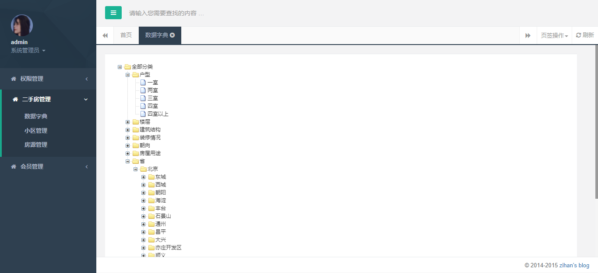
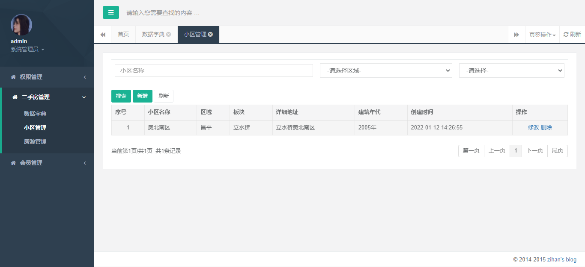
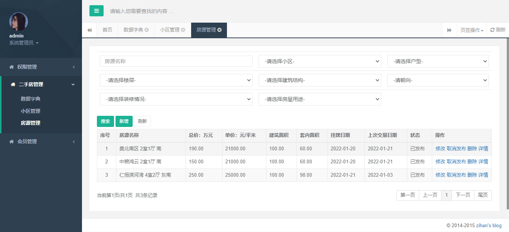
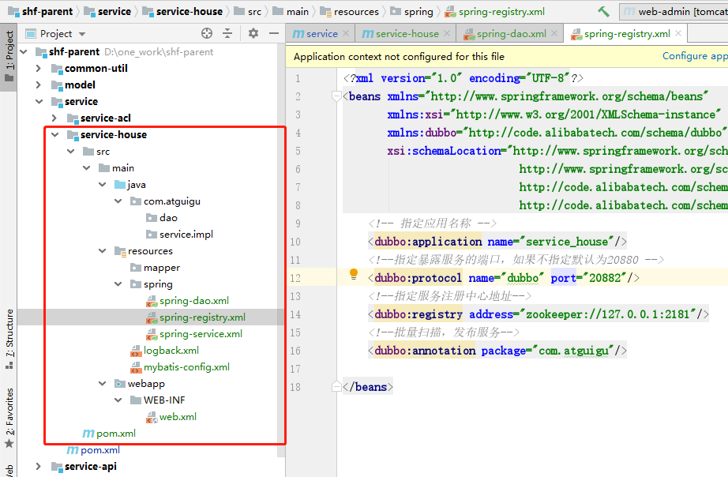
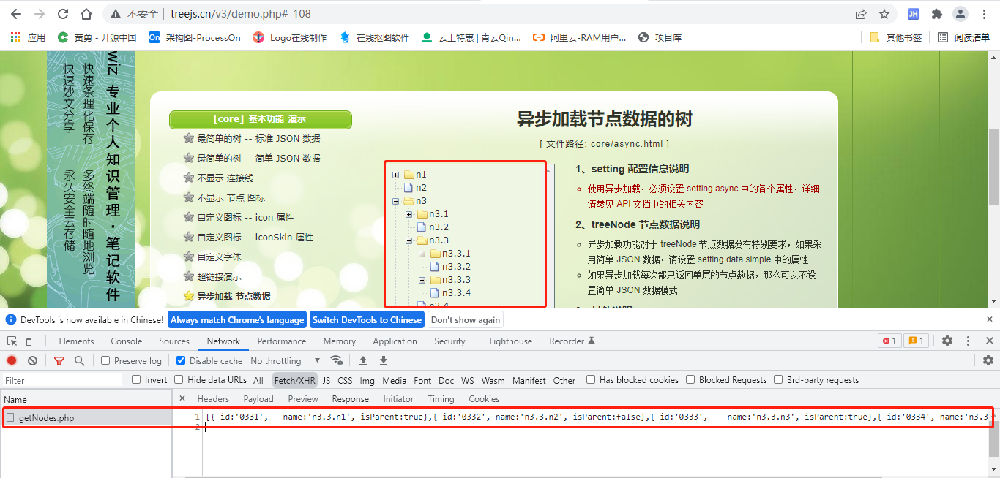
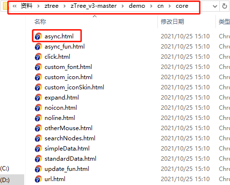
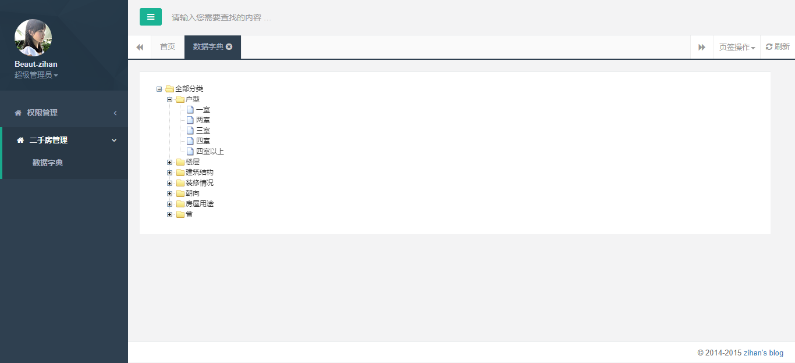
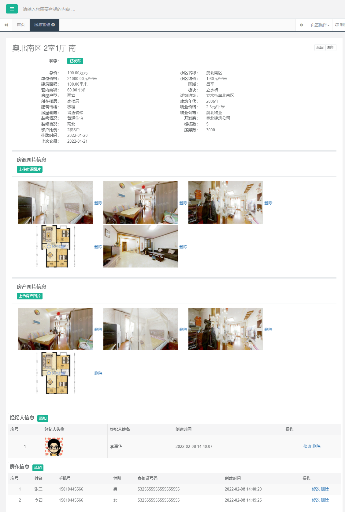
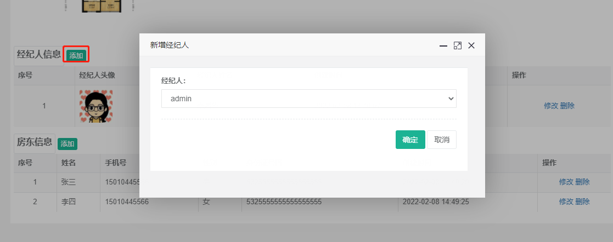

# 尚好房：二手房管理

## 一、功能介绍

### 1、数据字典



### 2、小区管理



### 3、房源管理



## 二、数据字典

### 1、搭建service-house模块

搭建方式与service-acl一致，这里可直接复制service-acl模块，改名为service-house模块

操作步骤如下

​	1，在service模块复制service-acl模块，改名service-house模块

​	2，修改pom.xml文件，只是修改名称即tomcat端口

```xml
<?xml version="1.0" encoding="UTF-8"?>

<project xmlns="http://maven.apache.org/POM/4.0.0" xmlns:xsi="http://www.w3.org/2001/XMLSchema-instance"
         xsi:schemaLocation="http://maven.apache.org/POM/4.0.0 http://maven.apache.org/xsd/maven-4.0.0.xsd">
    <parent>
        <artifactId>service</artifactId>
        <groupId>com.atguigu</groupId>
        <version>1.0</version>
    </parent>
    <modelVersion>4.0.0</modelVersion>

    <artifactId>service-house</artifactId>
    <packaging>war</packaging>

    <build>
        <plugins>
            <plugin>
                <groupId>org.eclipse.jetty</groupId>
                <artifactId>jetty-maven-plugin</artifactId>
                <version>9.4.15.v20190215</version>
                <configuration>
                    <!-- 如果检测到项目有更改则自动热部署，每隔n秒扫描一次。默认为0，即不扫描-->
                    <scanIntervalSeconds>10</scanIntervalSeconds>
                    <webAppConfig>
                        <!--指定web项目的根路径，默认为/ -->
                        <contextPath>/</contextPath>
                    </webAppConfig>
                    <httpConnector>
                        <!--端口号，默认 8080-->
                        <port>7002</port>
                    </httpConnector>
                </configuration>
            </plugin>
        </plugins>
    </build>
</project>

```

3、修改spring-register.xml文件，只是修改名称与端口

```xml
<?xml version="1.0" encoding="UTF-8"?>
<beans xmlns="http://www.springframework.org/schema/beans"
       xmlns:xsi="http://www.w3.org/2001/XMLSchema-instance"
       xmlns:dubbo="http://code.alibabatech.com/schema/dubbo"
       xsi:schemaLocation="http://www.springframework.org/schema/beans
                            http://www.springframework.org/schema/beans/spring-beans.xsd
                            http://code.alibabatech.com/schema/dubbo
                            http://code.alibabatech.com/schema/dubbo/dubbo.xsd">
    <!-- 指定应用名称 -->
    <dubbo:application name="service_house"/>
    <!--指定暴露服务的端口，如果不指定默认为20880 -->
    <dubbo:protocol name="dubbo" port="20882"/>
    <!--指定服务注册中心地址-->
    <dubbo:registry address="zookeeper://127.0.0.1:2181"/>
    <!--批量扫描，发布服务-->
    <dubbo:annotation package="com.atguigu"/>

</beans>
```

4、删除mapper下的xml与实现类

5、service父模块添加：<module>service-house</module>

目录结构如下：



​	

### 2、数据字典实现方案

数据字典我们使用zTree渲染

在线文档：http://www.treejs.cn/v3/demo.php#_108



点击数据接口，返回数据：[{ id:'0331',name:'n3.3.n1',	isParent:true}]

即：根据上级节点id获取子节点数据列表

实现方式：

​	1、构建服务器端接口：根据上级节点id获取子节点数据列表，返回数据格式：

[{ id:'0331',name:'n3.3.n1',	isParent:true}]

​	2、页面渲染，参照示例：

资料\ztree\zTree_v3-master\demo\cn\core\async.html



### 3、dubbo服务端接口

#### 3.1、定义接口

操作模块：service-api

```java
package com.atguigu.service;

import java.util.List;
import java.util.Map;

public interface DictService {

    List<Map<String,Object>> findZnodes(Long id);

}
```

#### 3.2、接口实现

操作模块：service-house

```java
package com.atguigu.service.impl;

import com.alibaba.dubbo.config.annotation.Service;
import com.atguigu.dao.DictDao;
import com.atguigu.entity.Dict;
import com.atguigu.service.DictService;
import org.springframework.beans.factory.annotation.Autowired;

import java.util.ArrayList;
import java.util.HashMap;
import java.util.List;
import java.util.Map;

@Service(interfaceClass = DictService.class)
public class DictServiceImpl implements DictService {

   @Autowired
   private DictDao dictDao;

   @Override
   public List<Map<String,Object>> findZnodes(Long id) {
      // 返回数据[{ id:2, isParent:true, name:"随意勾选 2"}]
      //根据id获取子节点数据
      //判断该节点是否是父节点
      //全部权限列表
      return null;
   }
}
```

因此dao层需要定义两个接口：

1、根据父id获取下级列表：findListByParentId

2、通过父id获取子节点的数量判断是否是父节点

#### 3.3、dao层实现

1、新建：mapper/DictDao.xml

```xml
<?xml version="1.0" encoding="UTF-8" ?>
<!DOCTYPE mapper
        PUBLIC "-//mybatis.org//DTD Mapper 3.0//EN"
        "http://mybatis.org/dtd/mybatis-3-mapper.dtd">

<mapper namespace="com.atguigu.dao.DictDao">

    <!-- 用于select查询公用抽取的列 -->
    <sql id="columns">
        select id,parent_id,name,dict_code,create_time,update_time,is_deleted
    </sql>

    <!--根据父节点的id查询它所有的子节点-->
    <select id="findListByParentId" resultType="dict">
        <include refid="columns"></include>
        from hse_dict
        where parent_id = #{parentId}
    </select>

    <!--判断该节点是否是父节点-->
    <select id="countIsParent" resultType="integer">
        select count(*) from hse_dict
        where parent_id = #{parentId}
    </select>
</mapper>
```

2、新建DictDao接口

```java
package com.atguigu.dao;

import com.atguigu.base.BaseDao;
import com.atguigu.entity.Dict;

import java.util.List;

public interface DictDao extends BaseDao<Dict> {

    List<Dict> findListByParentId(Long parentId);

    Integer countIsParent(Long id);
}
```

#### 3.4、修改实现类方法

```java
@Override
public List<Map<String,Object>> findZnodes(Long id) {
   // 返回数据[{ id:2, isParent:true, name:"随意勾选 2"}]
   //根据id获取子节点数据
   //判断该节点是否是父节点
   
   //获取子节点数据列表
   List<Dict> dictList = dictDao.findListByParentId(id);

   //构建ztree数据
   List<Map<String,Object>> zNodes = new ArrayList<>();
   for(Dict dict : dictList) {
      Integer count = dictDao.countIsParent(dict.getId());
      Map<String,Object> map = new HashMap<>();
      map.put("id", dict.getId());
      map.put("isParent", count > 0 ? true : false);
      map.put("name", dict.getName());
      zNodes.add(map);
   };
   return zNodes;
}
```

### 4、dubbo消费端接口

操作模块：web-admin

新建：DictController

```java
package com.atguigu.controller;

import com.alibaba.dubbo.config.annotation.Reference;
import com.atguigu.base.BaseController;
import com.atguigu.result.Result;
import com.atguigu.service.DictService;
import org.springframework.stereotype.Controller;
import org.springframework.ui.ModelMap;
import org.springframework.web.bind.annotation.GetMapping;
import org.springframework.web.bind.annotation.RequestMapping;
import org.springframework.web.bind.annotation.RequestParam;
import org.springframework.web.bind.annotation.ResponseBody;

import java.util.List;
import java.util.Map;

@Controller
@RequestMapping(value="/dict")
@SuppressWarnings({"unchecked", "rawtypes"})
public class DictController extends BaseController {

   @Reference
   private DictService dictService;

   private final static String PAGE_INDEX = "dict/index";

   /**
    * 根据上级id获取子节点数据列表
    * @param id
    * @return
    */
   @GetMapping(value = "findZnodes")
   @ResponseBody
   public Result findByParentId(@RequestParam(value = "id", defaultValue = "0") Long id) {
      List<Map<String,Object>> zNodes = dictService.findZnodes(id);
      return Result.ok(zNodes);
   }

   @GetMapping
   public String index(ModelMap model) {
      return PAGE_INDEX;
   }
}
```

### 5、页面渲染

#### 5.1、引入zTree组件

将资源文件中的zTree_v3文件夹复制到static/js/plugins目录下

#### 5.2、页面渲染

新增页面：dict/index.html

zTree依赖jquery，head文件已引用

```html
<!DOCTYPE html>
<html xmlns:th="http://www.thymeleaf.org">
<head th:include="common/head :: head"></head>

<link rel="stylesheet" th:href="@{/static/js/plugins/zTree_v3/zTreeStyle.css}" type="text/css">
<script type="text/javascript" th:src="@{/static/js/plugins/zTree_v3/jquery.ztree.core.js}"></script>
<body class="gray-bg">
<div class="wrapper wrapper-content animated fadeInRight">
    <div class="ibox float-e-margins">
        <div class="ibox-content" style="width: 98%;">

            <div class="zTreeDemoBackground left">
                <ul id="treeDemo" class="ztree"></ul>
            </div>
        </div>
    </div>
</div>
<script th:inline="javascript">
    $(function(){
        // 文档地址:http://www.treejs.cn/v3/demo.php#_108
        var setting = {
            async: {
                enable: true,
                url:"/dict/findZnodes",
                type:"get",
                autoParam:["id"],
                dataFilter: filter
            }
        };

        function filter(treeId, parentNode, childNodes) {
            childNodes = childNodes.data
            if (!childNodes) return null;
            for (var i=0, l=childNodes.length; i<l; i++) {
                childNodes[i].name = childNodes[i].name.replace(/\.n/g, '.');
            }
            return childNodes;
        }

        $(document).ready(function(){
            $.fn.zTree.init($("#treeDemo"), setting);
        });
    });
</script>
</body>
</html>
```

### 6、添加左侧导航

```html
<li>
   <a href="#">
      <i class="fa fa-home"></i>
      <span class="nav-label">权限管理</span>
      <span class="fa arrow"></span>
   </a>
   <ul class="nav nav-second-level">
      <li>
         <a class="J_menuItem" href="/admin" data-index="0">用户管理</a>
      </li>
      <li>
         <a class="J_menuItem" href="/role">角色列表</a>
      </li>
      
   </ul>
</li>
<li>
   <a href="#">
      <i class="fa fa-home"></i>
      <span class="nav-label">二手房管理</span>
      <span class="fa arrow"></span>
   </a>
   <ul class="nav nav-second-level">
      <li>
         <a class="J_menuItem" href="/dict" data-index="0">数据字典</a>
      </li>
   </ul>
</li>
```

### 7、测试



## 三、小区管理

### 1、需求分析

小区管理有二级联动：区域与板块

区域与板块数据在数据字典里面，通过编码：beijing，可以获取区域数据

添加小区保存的是区域与板块的数据字典id，因此还需要根据字典id获取字段名称

因此数据字典需提供3个接口：

​	1、通过编码获取子节点数据（区域数据）

​	2、通过节点id获取子节点数据（通过区域id，获取板块数据）

​	3、通过字典id获取字典名称

### 2、编写字典相关接口

#### 2.1、定义接口

DictService添加接口

```java
/**
 * 根据上级id获取子节点数据列表
 * @param parentId
 * @return
 */
List<Dict> findListByParentId(Long parentId);

/**
 * 根据编码获取子节点数据列表
 * @param dictCode
 * @return
 */
List<Dict> findListByDictCode(String dictCode);
```

#### 2.2、定义接口实现

DictServiceImpl添加接口

```java
@Override
public List<Dict> findListByParentId(Long parentId) {
   return dictDao.findListByParentId(parentId);
}

@Override
public List<Dict> findListByDictCode(String dictCode) {
   Dict dict = dictDao.getByDictCode(dictCode);
   if(null == dict) return null;
   return this.findListByParentId(dict.getId());
}
```

#### 2.3、dao层实现

1、DictDao添加接口

```java
String getNameById(Long id);

Dict getByDictCode(String dictCode);
```

2、DictDao.xml添加方法

```xml
<select id="getByDictCode" resultMap="Dict">
   <include refid="columns" />
   from hse_dict
   where
   dict_code = #{dictCode}
</select>

<select id="getNameById" resultType="String">
   select name
   from hse_dict
   where
   id = #{id}
</select>
```

#### 2.4 controller层

DictController添加方法

```java
/**
	 * 根据上级id获取子节点数据列表
	 * @param parentId
	 * @return
	 */
	@GetMapping(value = "findListByParentId/{parentId}")
	@ResponseBody
	public Result<List<Dict>> findListByParentId(@PathVariable Long parentId) {
		List<Dict> list = dictService.findListByParentId(parentId);
		return Result.ok(list);
	}

	/**
	 * 根据编码获取子节点数据列表
	 * @param dictCode
	 * @return
	 */
	@GetMapping(value = "findListByDictCode/{dictCode}")
	@ResponseBody
	public Result<List<Dict>> findListByDictCode(@PathVariable String dictCode) {
		List<Dict> list = dictService.findListByDictCode(dictCode);
		return Result.ok(list);
	}
```

#### 2.5、测试接口

http://localhost:8000/dict/findListByParentId/1

http://localhost:8000/dict/findListByDictCode/beijing

### 3、小区dubbo服务端接口

基础接口即为普通的增删改查接口

#### 3.1、dao层实现

1、新建：mapper/CommunityDao.xml

```xml
<?xml version="1.0" encoding="UTF-8" ?>
<!DOCTYPE mapper
        PUBLIC "-//mybatis.org//DTD Mapper 3.0//EN"
        "http://mybatis.org/dtd/mybatis-3-mapper.dtd">

<mapper namespace="com.atguigu.dao.CommunityDao">
	
	<!-- 用于select查询公用抽取的列 -->
	<sql id="columns">
		select id,name,description,province_id,city_id,area_id,plate_id,address,longitude,latitude,build_years,property_price,property_company,developer,build_num,house_num,average_price,create_time,update_time,is_deleted
	</sql>

	<insert id="insert" useGeneratedKeys="true" keyProperty="id">
        insert into hse_community (
        	id ,
        	name ,
        	description ,
        	province_id ,
        	city_id ,
        	area_id ,
        	plate_id ,
        	address ,
        	longitude ,
        	latitude ,
        	build_years ,
        	property_price ,
        	property_company ,
        	developer ,
        	build_num ,
        	house_num ,
        	average_price
        ) values (
        	#{id} ,
        	#{name} ,
        	#{description} ,
        	#{provinceId} ,
        	#{cityId} ,
        	#{areaId} ,
        	#{plateId} ,
        	#{address} ,
        	#{longitude} ,
        	#{latitude} ,
        	#{buildYears} ,
        	#{propertyPrice} ,
        	#{propertyCompany} ,
        	#{developer} ,
        	#{buildNum} ,
        	#{houseNum} ,
        	#{averagePrice}
        )
	</insert>
	
	<update id="update" >
        update hse_community set
		<if test="name != null">
			name = #{name} ,
		</if>
		<if test="description != null">
			description = #{description} ,
		</if>
		<if test="provinceId != null">
			province_id = #{provinceId} ,
		</if>
		<if test="cityId != null">
			city_id = #{cityId} ,
		</if>
		<if test="areaId != null">
			area_id = #{areaId} ,
		</if>
		<if test="plateId != null">
			plate_id = #{plateId} ,
		</if>
		<if test="address != null">
			address = #{address} ,
		</if>
		<if test="longitude != null">
			longitude = #{longitude} ,
		</if>
		<if test="latitude != null">
			latitude = #{latitude} ,
		</if>
		<if test="buildYears != null">
			build_years = #{buildYears} ,
		</if>
		<if test="propertyPrice != null">
			property_price = #{propertyPrice} ,
		</if>
		<if test="propertyCompany != null">
			property_company = #{propertyCompany} ,
		</if>
		<if test="developer != null">
			developer = #{developer} ,
		</if>
		<if test="buildNum != null">
			build_num = #{buildNum} ,
		</if>
		<if test="houseNum != null">
			house_num = #{houseNum} ,
		</if>
		<if test="averagePrice != null">
			average_price = #{averagePrice} ,
		</if>
		update_time =  now()
        where 
	        id = #{id} 
	</update>

    <update id="delete">
        update hse_community set
			update_time = now() ,
			is_deleted = 1
        where 
        	id = #{id}
    </update>
    
    <select id="getById" resultType="Community">
		<include refid="columns" />
		    from hse_community 
	        where 
		        id = #{id} 
	</select>
	
	<sql id="findPageWhere">
		<where>
			<if test="name != null and name != ''">
				and name like CONCAT('%',#{name},'%')
			</if>
	       <if test="areaId != null and areaId != ''">
				and area_id = #{areaId}
			</if>
	       <if test="plateId != null and plateId != ''">
				and plate_id = #{plateId}
			</if>
			and is_deleted = 0
		</where>
	</sql>
    
    <select id="findPage" resultType="Community">
    	<include refid="columns" />
	    from hse_community 
		<include refid="findPageWhere"/>
		order by id desc
    </select>
    
     <!--查询所有小区-->
    <select id="findAll" resultType="Community">
        <include refid="colums"></include>
        from hse_community
        where is_deleted = 0
    </select>
</mapper>

```

2、新建CommunityDao接口

```java
package com.atguigu.dao;

import com.atguigu.base.BaseDao;
import com.atguigu.entity.Community;

public interface CommunityDao extends BaseDao<Community> {
	 List<Community> findAll();
}

```

#### 3.2、service层

操作模块：service-api

```java
package com.atguigu.service;

import com.atguigu.base.BaseService;
import com.atguigu.entity.Community;

import java.util.List;

public interface CommunityService extends BaseService<Community> {
	List<Community> findAll();
}

```

#### 3.3、接口实现

操作模块：service-house

```java
package com.atguigu.service.impl;

import com.alibaba.dubbo.config.annotation.Service;
import com.atguigu.base.BaseDao;
import com.atguigu.base.BaseServiceImpl;
import com.atguigu.dao.CommunityDao;
import com.atguigu.entity.Community;
import com.atguigu.service.CommunityService;
import com.atguigu.service.DictService;
import com.atguigu.util.CastUtil;
import com.github.pagehelper.Page;
import com.github.pagehelper.PageHelper;
import com.github.pagehelper.PageInfo;
import org.springframework.beans.factory.annotation.Autowired;

import java.io.Serializable;
import java.util.List;
import java.util.Map;

@Service(interfaceClass = CommunityService.class)
public class CommunityServiceImpl extends BaseServiceImpl<Community> implements CommunityService {

	@Autowired
	private CommunityDao communityDao;

	@Autowired
	private DictDao dictDao;

	@Override
	protected BaseDao<Community> getEntityDao() {
		return communityDao;
	}

	@Override
	public PageInfo<Community> findPage(Map<String, Object> filters) {
		//当前页数
		int pageNum = CastUtil.castInt(filters.get("pageNum"), 1);
		//每页显示的记录条数
		int pageSize = CastUtil.castInt(filters.get("pageSize"), 10);

		PageHelper.startPage(pageNum, pageSize);
		Page<Community> page = communityDao.findPage(filters);
		List<Community> list = page.getResult();
		for(Community community : list) {
			String areaName = dictDao.getNameById(community.getAreaId());
			String plateName = dictDao.getNameById(community.getPlateId());
			community.setAreaName(areaName);
			community.setPlateName(plateName);
		}
		return new PageInfo<Community>(page, 10);

	}
    
     @Override
    public List<Community> findAll() {
        return communityDao.findAll();
    }
    
    @Override
    public Community getById(Serializable id) {
        //调用CommunityDao中根据id获取小区的方法
        Community community = communityDao.getById(id);
        if(community == null){
            return null;
        }
        //根据区域的id获取区域的名字
        String areaName = dictDao.getNameById(community.getAreaId());
        //根据板块的id获取板块的名字
        String plateName = dictDao.getNameById(community.getPlateId());
        //将区域的名字和板块的名字设置到Community对象中
        community.setAreaName(areaName);
        community.setPlateName(plateName);
        return community;
    }
}
```


#### 3.4、dubbo消费端接口

操作模块：web-admin

新建：CommunityController

```java
package com.atguigu.controller;

import com.alibaba.dubbo.config.annotation.Reference;
import com.atguigu.base.BaseController;
import com.atguigu.entity.Community;
import com.atguigu.entity.Dict;
import com.atguigu.service.CommunityService;
import com.atguigu.service.DictService;
import com.github.pagehelper.PageInfo;
import org.springframework.beans.BeanUtils;
import org.springframework.stereotype.Controller;
import org.springframework.ui.ModelMap;
import org.springframework.web.bind.annotation.GetMapping;
import org.springframework.web.bind.annotation.PathVariable;
import org.springframework.web.bind.annotation.PostMapping;
import org.springframework.web.bind.annotation.RequestMapping;
import org.springframework.web.servlet.mvc.support.RedirectAttributes;

import javax.servlet.http.HttpServletRequest;
import java.util.List;
import java.util.Map;

@Controller
@RequestMapping(value="/community")
@SuppressWarnings({"unchecked", "rawtypes"})
public class CommunityController extends BaseController {

	@Reference
	private CommunityService communityService;

	@Reference
	private DictService dictService;
	
	private final static String LIST_ACTION = "redirect:/community";
	
	private final static String PAGE_INDEX = "community/index";
	private final static String PAGE_SHOW = "community/show";
	private final static String PAGE_CREATE = "community/create";
	private final static String PAGE_EDIT = "community/edit";
    private final static String PAGE_SUCCESS = "common/successPage";
	
	
	/** 
	 * 列表
	 * @param model
	 * @param request
	 * @return
	 */
    @RequestMapping
	public String index(ModelMap model, HttpServletRequest request) {
		Map<String,Object> filters = getFilters(request);
		
		PageInfo<Community> page = communityService.findPage(filters);

		List<Dict> areaList = dictService.findListByDictCode("beijing");
		model.addAttribute("areaList",areaList);

		model.addAttribute("page", page);
		model.addAttribute("filters", filters);
		return PAGE_INDEX;
	}

	/** 
	 * 进入新增
	 * @param model
	 * @param community
	 * @return
	 */
	@GetMapping("/create")
	public String create(ModelMap model) {
		List<Dict> areaList = dictService.findListByDictCode("beijing");
		model.addAttribute("areaList",areaList);
		return PAGE_CREATE;
	}
	
	/**
	 * 保存新增
	 * @param model
	 * @param community
	 * @param request
	 * @return
	 */
	@PostMapping("/save")
	public String save(Community community) {
		communityService.insert(community);
		
		return PAGE_SUCCESS;
	}
	
	/** 
	 * 编辑
	 * @param model
	 * @param id
	 * @return
	 */
	@GetMapping("/edit/{id}")
	public String edit(ModelMap model,@PathVariable Long id) {
		Community community = communityService.getById(id);
		List<Dict> areaList = dictService.findListByDictCode("beijing");
		model.addAttribute("community",community);
		model.addAttribute("areaList",areaList);
		return PAGE_EDIT;
	}
	
	/** 
	 * 保存更新
	 * @param model
	 * @param id
	 * @param community
	 * @param request
	 * @return
	 */
	@PostMapping(value="/update")
	public String update(Community community) {	
		
        communityService.update(community);

		return PAGE_SUCCESS;
	}
	
	/**
	 * 删除
	 * @param model
	 * @param id
	 * @return
	 */
	@GetMapping("/delete/{id}")
	public String delete(@PathVariable Long id) {
		communityService.delete(id);
		return LIST_ACTION;
	}
	
}

```

### 5、页面渲染

#### 5.1、列表页面

community/index.html

```html
<!DOCTYPE html>
<html xmlns:th="http://www.thymeleaf.org"
      xmlns:sec="http://www.thymeleaf.org/extras/spring-security">

<head th:include="common/head :: head"></head>

<body class="gray-bg">
<form id="ec" th:action="@{/community}" method="post">
    <div class="wrapper wrapper-content animated fadeInRight">

        <div class="row">
            <div class="col-sm-12">
                <div class="ibox float-e-margins">
                    <div class="ibox-content">
                        <table class="table form-table margin-bottom10">
                            <tr>
                                <td>
                                    <input type="text" name="name" th:value="${#maps.containsKey(filters, 'name')} ? ${filters.name} : ''" placeholder="小区名称" class="input-sm form-control"/>
                                </td>
                                <td>
                                    <select name="areaId" id="areaId" class="form-control">
                                        <option value="">-请选择区域-</option>
                                        <option th:each="item,it : ${areaList}" th:text="${item.name}" th:value="${item.id}" th:selected="${#maps.containsKey(filters, 'areaId')} ? ${item.id } eq  ${filters.areaId } : false">-选择区域-</option>
                                    </select>
                                </td>
                                <td>
                                    <select name="plateId" id="plateId" class="form-control">
                                        <option value="">-请选择-</option>
                                    </select>
                                </td>
                            </tr>
                        </table>
                        <div>
                            <button type="submit" class="btn btn-sm btn-primary"> 搜索</button>
                            <button type="button" class="btn btn-sm btn-primary create" sec:authorize="hasAuthority('community.create')"> 新增</button>
                            <button type="button" id="loading-example-btn" onclick="javascript:window.location.reload();" class="btn btn-white btn-sm">刷新</button>
                        </div>
                        <table class="table table-striped table-bordered table-hover dataTables-example">
                            <thead>
                            <tr>
                                <th>序号</th>
                                <th>小区名称</th>
                                <th>区域</th>
                                <th>板块</th>
                                <th>详细地址</th>
                                <th>建筑年代</th>
                                <th>创建时间</th>
                                <th>操作 </th>
                            </tr>
                            </thead>
                            <tbody>
                            <tr class="gradeX" th:each="item,it: ${page.list}">
                                <td class="text-center" th:text="${it.count}">11</td>
                                <td th:text="${item.name}">22</td>
                                <td th:text="${item.areaName}">33</td>
                                <td th:text="${item.plateName}">22</td>
                                <td th:text="${item.address}">22</td>
                                <td th:text="${item.buildYears}">22</td>
                                <td th:text="${#dates.format(item.createTime,'yyyy-MM-dd HH:mm:ss')}" >33</td>
                                <td class="text-center">
                                    <a class="edit" th:attr="data-id=${item.id}" sec:authorize="hasAuthority('community.edit')">修改</a>
                                    <a class="delete" th:attr="data-id=${item.id}" sec:authorize="hasAuthority('community.delete')">删除</a>
                                </td>
                            </tr>
                            </tbody>
                        </table>

                        <div class="row" th:include="common/pagination :: pagination"></div>

                    </div>
                </div>
            </div>
        </div>
    </div>
</form>
<script th:inline="javascript">
    $(function(){
        $(".create").on("click",function () {
            opt.openWin('/community/create','新增',630,430)
        });
        $(".edit").on("click",function () {
            var id = $(this).attr("data-id");
            opt.openWin('/community/edit/' + id,'修改',580,430);
        });
        $(".delete").on("click",function(){
            var id = $(this).attr("data-id");
            opt.confirm('/community/delete/'+id);
        });

        $("#areaId").bind("change",function() {
            var areaId = $("#areaId").val();
            if(areaId == '') return
            $("#plateId").empty();
            $.get("/dict/findListByParentId/" + areaId,function(response) {
                $("<option value=''>-请选择板块-</option>").appendTo("#plateId");
                var res = JSON.parse(response)
                $.each(res.data, function(i,item) {
                    var plateId = [[${#maps.containsKey(filters, 'plateId')} ? ${filters.plateId} : '']];
                    if(item.id == plateId) {
                        $("<option></option>").val(item.id).text(item.name).attr('selected', 'true').appendTo("#plateId");
                    } else {
                        $("<option></option>").val(item.id).text(item.name).appendTo("#plateId");
                    }
                });
            });
        });
        // 触发 select 元素的 change 事件：
        $("#areaId").trigger("change");
    });
</script>
</body>
</html>

```

#### 5.2、新增页面

community/create.html

```html
<!DOCTYPE html>
<html xmlns:th="http://www.thymeleaf.org">
<head th:include="common/head :: head"></head>
<script type="text/javascript">
    $(function(){
        $("#areaId").bind("change",function() {
            var areaId = $("#areaId").val();
            $("#plateId").empty();
            $.get("/dict/findListByParentId/" + areaId,function(response) {
                var res = JSON.parse(response)
                $.each(res.data, function(i,item) {
                    $("<option></option>").val(item.id).text(item.name).appendTo("#plateId");
                });
            });
        });
    });
</script>
<body class="gray-bg">
<div class="wrapper wrapper-content animated fadeInRight">
    <div class="ibox float-e-margins">
        <div class="ibox-content" style="width: 98%;">
            <form id="ec" action="/community/save" method="post" class="form-horizontal">
                <div class="form-group">
                    <label class="col-sm-2 control-label">小区名称：</label>
                    <div class="col-sm-10">
                        <input type="text" name="name" id="name" class="form-control" />
                    </div>
                </div>
                <div class="hr-line-dashed"></div>
                <div class="form-group">
                    <label class="col-sm-2 control-label">描述：</label>
                    <div class="col-sm-10">
                        <input type="text" name="description" id="description" class="form-control" />
                    </div>
                </div>
                <div class="hr-line-dashed"></div>
                <div class="form-group">
                    <label class="col-sm-2 control-label">区域：</label>
                    <div class="col-sm-10">
                        <select name="areaId" id="areaId" class="form-control">
                            <option value="">-请选择-</option>
                            <option th:each="item,it : ${areaList}" th:text="${item.name}" th:value="${item.id}">-选择区域-</option>
                        </select>
                    </div>
                </div>
                <div class="hr-line-dashed"></div>
                <div class="form-group">
                    <label class="col-sm-2 control-label">板块：</label>
                    <div class="col-sm-10">
                        <select name="plateId" id="plateId" class="form-control">
                            <option value="">-请选择-</option>
                        </select>
                    </div>
                </div>
                <div class="hr-line-dashed"></div>
                <div class="form-group">
                    <label class="col-sm-2 control-label">详细地址：</label>
                    <div class="col-sm-10">
                        <input type="text" name="address" id="address" class="form-control" />
                    </div>
                </div>
                <div class="hr-line-dashed"></div>
                <div class="form-group">
                    <label class="col-sm-2 control-label">建筑年代：</label>
                    <div class="col-sm-10">
                        <input type="text" name="buildYears" id="buildYears" class="form-control" />
                    </div>
                </div>
                <div class="hr-line-dashed"></div>
                <div class="form-group">
                    <label class="col-sm-2 control-label">物业价格(元/平)：</label>
                    <div class="col-sm-10">
                        <input type="text" name="propertyPrice" id="propertyPrice" class="form-control" />
                    </div>
                </div>
                <div class="hr-line-dashed"></div>
                <div class="form-group">
                    <label class="col-sm-2 control-label">物业公司：</label>
                    <div class="col-sm-10">
                        <input type="text" name="propertyCompany" id="propertyCompany" class="form-control" />
                    </div>
                </div>
                <div class="hr-line-dashed"></div>
                <div class="form-group">
                    <label class="col-sm-2 control-label">开发商：</label>
                    <div class="col-sm-10">
                        <input type="text" name="developer" id="developer" class="form-control" />
                    </div>
                </div>
                <div class="hr-line-dashed"></div>
                <div class="form-group">
                    <label class="col-sm-2 control-label">楼栋数：</label>
                    <div class="col-sm-10">
                        <input type="text" name="buildNum" id="buildNum" class="form-control" />
                    </div>
                </div>
                <div class="hr-line-dashed"></div>
                <div class="form-group">
                    <label class="col-sm-2 control-label">房屋数：</label>
                    <div class="col-sm-10">
                        <input type="text" name="houseNum" id="houseNum" class="form-control" />
                    </div>
                </div>
                <div class="hr-line-dashed"></div>
                <div class="form-group">
                    <label class="col-sm-2 control-label">均价(万元/平)：</label>
                    <div class="col-sm-10">
                        <input type="text" name="averagePrice" id="averagePrice" class="form-control" />
                    </div>
                </div>
                <div class="hr-line-dashed"></div>
                <div class="form-group">
                    <div class="col-sm-4 col-sm-offset-2 text-right">
                        <button class="btn btn-primary" type="submit">确定</button>
                        <button class="btn btn-white" type="button" onclick="javascript:opt.closeWin();" value="取消">取消</button>
                    </div>
                </div>
            </form>
        </div>
    </div>
</div>
</body>
</html>
```

#### 5.3、修改页面

community/edit.html

```html
<!DOCTYPE html>
<html xmlns:th="http://www.thymeleaf.org">
<head th:include="common/head :: head"></head>
<script type="text/javascript">
    $(function(){
        $("#areaId").bind("change",function() {
            var areaId = $("#areaId").val();
            if(areaId == '') return
            $("#plateId").empty();
            $.get("/dict/findListByParentId/" + areaId,function(response) {
                var res = JSON.parse(response)
                $.each(res.data, function(i,item) {
                    var plateId = [[${community.plateId}]];
                    if(item.id == plateId) {
                        $("<option></option>").val(item.id).text(item.name).attr('selected', 'true').appendTo("#plateId");
                    } else {
                        $("<option></option>").val(item.id).text(item.name).appendTo("#plateId");
                    }
                });
            });
        });
        // 触发 select 元素的 change 事件：
        $("#areaId").trigger("change");
    });
</script>
<body class="gray-bg">
<div class="wrapper wrapper-content animated fadeInRight">
    <div class="ibox float-e-margins">
        <div class="ibox-content" style="width: 98%;">
            <form id="ec" th:action="@{/community/update}" method="post" class="form-horizontal">
                <input type="hidden" name="id" th:value="${community.id}">
                <div class="form-group">
                    <label class="col-sm-2 control-label">小区名称：</label>
                    <div class="col-sm-10">
                        <input type="text" name="name" id="name" th:value="${community.name}" class="form-control" />
                    </div>
                </div>
                <div class="hr-line-dashed"></div>
                <div class="form-group">
                    <label class="col-sm-2 control-label">描述：</label>
                    <div class="col-sm-10">
                        <input type="text" name="description" id="description" th:value="${community.description}" class="form-control" />
                    </div>
                </div>
                <div class="hr-line-dashed"></div>
                <div class="form-group">
                    <label class="col-sm-2 control-label">区域：</label>
                    <div class="col-sm-10">
                        <select name="areaId" id="areaId" class="form-control">
                            <option value="">-选择区域-</option>
                            <option th:each="item,it : ${areaList}" th:text="${item.name}" th:value="${item.id}" th:selected="${item.id} eq ${community.areaId}">-选择区域-</option>
                        </select>
                    </div>
                </div>
                <div class="hr-line-dashed"></div>
                <div class="form-group">
                    <label class="col-sm-2 control-label">板块：</label>
                    <div class="col-sm-10">
                        <select name="plateId" id="plateId" class="form-control">
                            <option value="">-选择板块-</option>
                        </select>
                    </div>
                </div>
                <div class="hr-line-dashed"></div>
                <div class="form-group">
                    <label class="col-sm-2 control-label">详细地址：</label>
                    <div class="col-sm-10">
                        <input type="text" name="address" id="address" th:value="${community.address}" class="form-control" />
                    </div>
                </div>
                <div class="hr-line-dashed"></div>
                <div class="form-group">
                    <label class="col-sm-2 control-label">建筑年代：</label>
                    <div class="col-sm-10">
                        <input type="text" name="buildYears" id="buildYears" th:value="${community.buildYears}" class="form-control" />
                    </div>
                </div>
                <div class="hr-line-dashed"></div>
                <div class="form-group">
                    <label class="col-sm-2 control-label">物业价格(元/平)：</label>
                    <div class="col-sm-10">
                        <input type="text" name="propertyPrice" id="propertyPrice" th:value="${community.propertyPrice}" class="form-control" />
                    </div>
                </div>
                <div class="hr-line-dashed"></div>
                <div class="form-group">
                    <label class="col-sm-2 control-label">物业公司：</label>
                    <div class="col-sm-10">
                        <input type="text" name="propertyCompany" id="propertyCompany" th:value="${community.propertyCompany}" class="form-control" />
                    </div>
                </div>
                <div class="hr-line-dashed"></div>
                <div class="form-group">
                    <label class="col-sm-2 control-label">开发商：</label>
                    <div class="col-sm-10">
                        <input type="text" name="developer" id="developer" th:value="${community.developer}" class="form-control" />
                    </div>
                </div>
                <div class="hr-line-dashed"></div>
                <div class="form-group">
                    <label class="col-sm-2 control-label">楼栋数：</label>
                    <div class="col-sm-10">
                        <input type="text" name="buildNum" id="buildNum" th:value="${community.buildNum}" class="form-control" />
                    </div>
                </div>
                <div class="hr-line-dashed"></div>
                <div class="form-group">
                    <label class="col-sm-2 control-label">房屋数：</label>
                    <div class="col-sm-10">
                        <input type="text" name="houseNum" id="houseNum" th:value="${community.houseNum}" class="form-control" />
                    </div>
                </div>
                <div class="hr-line-dashed"></div>
                <div class="form-group">
                    <label class="col-sm-2 control-label">均价(万元/平)：</label>
                    <div class="col-sm-10">
                        <input type="text" name="averagePrice" id="averagePrice" th:value="${community.averagePrice}" class="form-control" />
                    </div>
                </div>
                <div class="hr-line-dashed"></div>
                <div class="form-group posf">
                    <div class="col-sm-4 col-sm-offset-2 text-right">
                        <button class="btn btn-primary" type="submit">确定</button>
                        <button class="btn btn-white" type="button" onclick="javascript:opt.closeWin();" value="取消">取消</button>
                    </div>
                </div>
            </form>
        </div>
    </div>
</div>
</body>
</html>
```

### 6、测试

frame/index.html页面添加导航

```html
<li>
   <a class="J_menuItem" href="/community" data-index="0">小区管理</a>
</li>
```

## 三、房源管理

### 1、房源dubbo服务基础接口

基础的增删改查功能

#### 1.1、dao层实现

1、新建：mapper/HouseDao.xml

```xml
<?xml version="1.0" encoding="UTF-8" ?>
<!DOCTYPE mapper
        PUBLIC "-//mybatis.org//DTD Mapper 3.0//EN"
        "http://mybatis.org/dtd/mybatis-3-mapper.dtd">


<mapper namespace="com.atguigu.dao.HouseDao">
   
   <!-- 用于select查询公用抽取的列 -->
   <sql id="columns">
      select id,community_id,name,description,total_price,unit_price,build_area,inside_area,house_type_id,floor_id,build_structure_id,direction_id,decoration_id,house_use_id,elevator_ratio,listing_date,last_trade_date,status,create_time,update_time,is_deleted
   </sql>

   <insert id="insert" useGeneratedKeys="true" keyProperty="id">
        insert into hse_house (
           community_id ,
           name ,
           description ,
           total_price ,
           unit_price ,
           build_area ,
           inside_area ,
           house_type_id ,
           floor_id ,
           build_structure_id ,
           direction_id ,
           decoration_id ,
           house_use_id ,
           elevator_ratio ,
           listing_date ,
           last_trade_date 
        ) values (
           #{communityId} ,
           #{name} ,
           #{description} ,
           #{totalPrice} ,
           #{unitPrice} ,
           #{buildArea} ,
           #{insideArea} ,
           #{houseTypeId} ,
           #{floorId} ,
           #{buildStructureId} ,
           #{directionId} ,
           #{decorationId} ,
           #{houseUseId} ,
           #{elevatorRatio} ,
           #{listingDate} ,
           #{lastTradeDate}
        )
   </insert>
   

   <update id="update" >
        update hse_house set
      <if test="communityId != null">
         community_id = #{communityId} ,
      </if>
      <if test="name != null">
         name = #{name} ,
      </if>
      <if test="description != null">
         description = #{description} ,
      </if>
      <if test="totalPrice != null">
         total_price = #{totalPrice} ,
      </if>
      <if test="unitPrice != null">
         unit_price = #{unitPrice} ,
      </if>
      <if test="buildArea != null">
         build_area = #{buildArea} ,
      </if>
      <if test="insideArea != null">
         inside_area = #{insideArea} ,
      </if>
      <if test="houseTypeId != null">
         house_type_id = #{houseTypeId} ,
      </if>
      <if test="floorId != null">
         floor_id = #{floorId} ,
      </if>
      <if test="buildStructureId != null">
         build_structure_id = #{buildStructureId} ,
      </if>
      <if test="directionId != null">
         direction_id = #{directionId} ,
      </if>
      <if test="decorationId != null">
         decoration_id = #{decorationId} ,
      </if>
      <if test="houseUseId != null">
         house_use_id = #{houseUseId} ,
      </if>
      <if test="elevatorRatio != null">
         elevator_ratio = #{elevatorRatio} ,
      </if>
      <if test="listingDate != null">
         listing_date = #{listingDate} ,
      </if>
      <if test="lastTradeDate != null">
         last_trade_date = #{lastTradeDate} ,
      </if>
      <if test="status != null">
         status = #{status} ,
      </if>
      update_time =  now()
        where 
           id = #{id} 
   </update>

    <update id="delete">
        update hse_house set
         update_time = now() ,
         is_deleted = 1
        where 
           id = #{id}
    </update>
    
    <select id="getById" resultType="House">
      <include refid="columns" />
          from hse_house 
           where 
              id = #{id} 
   </select>
   
   <sql id="findPageWhere">
      <where>                    
          <if test="communityId != null and communityId != ''">
            and community_id = #{communityId}
         </if>
          <if test="name != null and name != ''">
            and name like CONCAT('%',#{name},'%')
         </if>
         <if test="houseTypeId != null and houseTypeId != ''">
            and house_type_id = #{houseTypeId}
         </if>
         <if test="floorId != null and floorId != ''">
            and floor_id = #{floorId}
         </if>
         <if test="buildStructureId != null and buildStructureId != ''">
            and build_structure_id = #{buildStructureId}
         </if>
         <if test="directionId != null and directionId != ''">
            and direction_id = #{directionId}
         </if>
         <if test="decorationId != null and decorationId != ''">
            and decoration_id = #{decorationId}
         </if>
         <if test="houseUseId != null and houseUseId != ''">
            and house_use_id = #{houseUseId}
         </if>
         and is_deleted = 0
      </where>
   </sql>
    
    <select id="findPage" resultType="House">
       <include refid="columns" />
       from hse_house 
      <include refid="findPageWhere"/>
      order by id desc
    </select>

</mapper>
```

2、新建：HouseDao

```java
package com.atguigu.dao;

import com.atguigu.base.BaseDao;
import com.atguigu.entity.House;

public interface HouseDao extends BaseDao<House> {

}
```

#### 1.2、service层

操作模块：service-api

```java
package com.atguigu.service;

import com.atguigu.base.BaseService;
import com.atguigu.entity.House;

public interface HouseService extends BaseService<House> {

}

```

#### 1.3、接口实现

操作模块：service-house

```java
package com.atguigu.service.impl;

import com.alibaba.dubbo.config.annotation.Service;
import com.atguigu.base.BaseDao;
import com.atguigu.base.BaseServiceImpl;
import com.atguigu.dao.HouseDao;
import com.atguigu.entity.House;
import com.atguigu.service.HouseService;
import org.springframework.beans.factory.annotation.Autowired;
import org.springframework.transaction.annotation.Transactional;

@Transactional
@Service(interfaceClass = HouseService.class)
public class HouseServiceImpl extends BaseServiceImpl<House> implements HouseService {

   @Autowired
   private HouseDao houseDao;

   @Override
   protected BaseDao<House> getEntityDao() {
      return houseDao;
   }

}
```

### 2、列表管理

#### 2.1、功能分析

搜索条件包含：小区列表及字典相关的搜索

字典相关的列表可以通过编码获取子节点列表，该接口前面已有

小区列表需要提供

#### 2.2、获取全部小区列表接口

##### 2.2.1、service接口

CommunityService添加接口

```java
List<Community> findAll();
```

##### 2.2.2、service接口实现

CommunityServiceImpl添加接口实现

```java
@Override
    public List<Community> findAll() {
        return communityDao.findAll();
    }
```

##### 2.2.3、dao层实现

CommunityDao添加接口

```java
List<Community> findAll();
```

CommunityDao.xml添加xml

```xml
<select id="findAll" resultType="Community">
   <include refid="columns"></include>
   from hse_community
   where
   is_deleted = 0
   order by id desc
</select>
```

#### 2.3、列表controller层接口

```java
package com.atguigu.controller;

import com.alibaba.dubbo.config.annotation.Reference;
import com.atguigu.base.BaseController;
import com.atguigu.entity.House;
import com.atguigu.service.CommunityService;
import com.atguigu.service.DictService;
import com.atguigu.service.HouseService;
import com.github.pagehelper.PageInfo;
import org.springframework.stereotype.Controller;
import org.springframework.ui.ModelMap;
import org.springframework.web.bind.annotation.RequestMapping;

import javax.servlet.http.HttpServletRequest;
import java.util.Map;

@Controller
@RequestMapping(value="/house")
@SuppressWarnings({"unchecked", "rawtypes"})
public class HouseController extends BaseController {

   @Reference
   private HouseService houseService;

   @Reference
   private DictService dictService;

   @Reference
   private CommunityService communityService;
   
   private final static String LIST_ACTION = "redirect:/house";
   
   private final static String PAGE_INDEX = "house/index";
   private final static String PAGE_SHOW = "house/show";
   private final static String PAGE_CREATE = "house/create";
   private final static String PAGE_EDIT = "house/edit";
   private final static String PAGE_SUCCESS = "common/successPage";


   /**
    * 列表
    * @param model
    * @param request
    * @return
    */
    @RequestMapping
   public String index(ModelMap model, HttpServletRequest request) {
      Map<String,Object> filters = getFilters(request);
      PageInfo<House> page = houseService.findPage(filters);

      model.addAttribute("page", page);
      model.addAttribute("filters", filters);

      model.addAttribute("communityList",communityService.findAll());
      model.addAttribute("houseTypeList",dictService.findListByDictCode("houseType"));
      model.addAttribute("floorList",dictService.findListByDictCode("floor"));
      model.addAttribute("buildStructureList",dictService.findListByDictCode("buildStructure"));
      model.addAttribute("directionList",dictService.findListByDictCode("direction"));
      model.addAttribute("decorationList",dictService.findListByDictCode("decoration"));
      model.addAttribute("houseUseList",dictService.findListByDictCode("houseUse"));
      return PAGE_INDEX;
   }
   
}
```

#### 2.4、列表页面

创建house/index.html

```html
<!DOCTYPE html>
<html xmlns:th="http://www.thymeleaf.org"
      xmlns:sec="http://www.thymeleaf.org/extras/spring-security">

<head th:include="common/head :: head"></head>

<body class="gray-bg">
<form id="ec" th:action="@{/house}" method="post">
    <div class="wrapper wrapper-content animated fadeInRight">

        <div class="row">
            <div class="col-sm-12">
                <div class="ibox float-e-margins">
                    <div class="ibox-content">
                        <table class="table form-table margin-bottom10">
                            <tr>
                                <td>
                                    <input type="text" name="name" th:value="${#maps.containsKey(filters, 'name')} ? ${filters.name} : ''" placeholder="房源名称" class="input-sm form-control"/>
                                </td>
                                <td>
                                    <select name="communityId" id="communityId" class="form-control">
                                        <option value="">-请选择小区-</option>
                                        <option th:each="item,it : ${communityList}" th:text="${item.name}" th:value="${item.id}" th:selected="${#maps.containsKey(filters, 'communityId')} ? ${item.id} eq ${filters.communityId} : false">-选择小区-</option>
                                    </select>
                                </td>
                                <td>
                                    <select name="houseTypeId" id="houseTypeId" class="form-control">
                                        <option value="">-请选择户型-</option>
                                        <option th:each="item,it : ${houseTypeList}" th:text="${item.name}" th:value="${item.id}" th:selected="${#maps.containsKey(filters, 'houseTypeId')} ? ${item.id} eq ${filters.houseTypeId} : false">-请选择-</option>
                                    </select>
                                </td>
                            </tr>
                            <tr>
                                <td>
                                    <select name="floorId" id="floorId" class="form-control">
                                        <option value="">-请选择楼层-</option>
                                        <option th:each="item,it : ${floorList}" th:text="${item.name}" th:value="${item.id}" th:selected="${#maps.containsKey(filters, 'floorId')} ? ${item.id} eq ${filters.floorId} : false">-请选择-</option>
                                    </select>
                                </td>
                                <td>
                                    <select name="buildStructureId" id="buildStructureId" class="form-control">
                                        <option value="">-请选择建筑结构-</option>
                                        <option th:each="item,it : ${buildStructureList}" th:text="${item.name}" th:value="${item.id}" th:selected="${#maps.containsKey(filters, 'buildStructureId')} ? ${item.id} eq ${filters.buildStructureId} : false">-请选择-</option>
                                    </select>
                                </td>
                                <td>
                                    <select name="directionId" id="directionId" class="form-control">
                                        <option value="">-请朝向-</option>
                                        <option th:each="item,it : ${directionList}" th:text="${item.name}" th:value="${item.id}" th:selected="${#maps.containsKey(filters, 'directionId')} ? ${item.id} eq ${filters.directionId} : false">-请选择-</option>
                                    </select>
                                </td>
                            </tr>
                            <tr>
                                <td>
                                    <select name="decorationId" id="decorationId" class="form-control">
                                        <option value="">-请选择装修情况-</option>
                                        <option th:each="item,it : ${decorationList}" th:text="${item.name}" th:value="${item.id}" th:selected="${#maps.containsKey(filters, 'decorationId')} ? ${item.id} eq ${filters.decorationId} : false">-请选择-</option>
                                    </select>
                                </td>
                                <td>
                                    <select name="houseUseId" id="houseUseId" class="form-control">
                                        <option value="">-请选择房屋用途-</option>
                                        <option th:each="item,it : ${houseUseList}" th:text="${item.name}" th:value="${item.id}" th:selected="${#maps.containsKey(filters, 'houseUseId')} ? ${item.id} eq ${filters.houseUseId} : false">-请选择-</option>
                                    </select>
                                </td>
                                <td>

                                </td>
                            </tr>
                        </table>
                        <div>
                            <button type="submit" class="btn btn-sm btn-primary"> 搜索</button>
                            <button type="button" class="btn btn-sm btn-primary create"> 新增</button>
                            <button type="button" id="loading-example-btn" onclick="javascript:window.location.reload();" class="btn btn-white btn-sm">刷新</button>
                        </div>
                        <table class="table table-striped table-bordered table-hover dataTables-example">
                            <thead>
                            <tr>
                                <th>序号</th>
                                <th>房源名称</th>
                                <th>总价：万元</th>
                                <th>单价：元/平米</th>
                                <th>建筑面积</th>
                                <th>套内面积</th>
                                <th>挂牌日期</th>
                                <th>上次交易日期</th>
                                <th>状态</th>
                                <th width="160">操作 </th>
                            </tr>
                            </thead>
                            <tbody>
                            <tr class="gradeX" th:each="item,it: ${page.list}">
                                <td class="text-center" th:text="${it.count}">11</td>
                                <td th:text="${item.name}">22</td>
                                <td th:text="${item.totalPrice}">22</td>
                                <td th:text="${item.unitPrice}">22</td>
                                <td th:text="${item.buildArea}">22</td>
                                <td th:text="${item.insideArea}">22</td>
                                <td th:text="${item.listingDateString}">22</td>
                                <td th:text="${item.lastTradeDateString}">22</td>
                                <td th:text="${item.status == 1 ? '已发布' : '未发布'}">22</td>
                                <td class="text-center">
                                    <a class="edit" th:attr="data-id=${item.id}">修改</a>
                                    <a class="delete" th:attr="data-id=${item.id}">删除</a>
                                </td>
                            </tr>
                            </tbody>
                        </table>

                        <div class="row" th:include="common/pagination :: pagination"></div>

                    </div>
                </div>
            </div>
        </div>
    </div>
</form>
<script th:inline="javascript">
    $(function(){
        $(".create").on("click",function () {
            opt.openWin('/house/create','新增',630,430)
        });
        $(".edit").on("click",function () {
            var id = $(this).attr("data-id");
            opt.openWin('/house/edit/' + id,'修改',630,430);
        });
        $(".delete").on("click",function(){
            var id = $(this).attr("data-id");
            opt.confirm('/house/delete/'+id);
        });
    });
</script>
</body>
</html>
```

### 3、新增

#### 3.1、controller层

HouseController添加方法

```java
/**
 * 进入新增
 * @param model
 * @param house
 * @return
 */
@GetMapping("/create")
public String create(ModelMap model) {
   model.addAttribute("communityList",communityService.findAll());
   model.addAttribute("houseTypeList",dictService.findListByDictCode("houseType"));
   model.addAttribute("floorList",dictService.findListByDictCode("floor"));
   model.addAttribute("buildStructureList",dictService.findListByDictCode("buildStructure"));
   model.addAttribute("directionList",dictService.findListByDictCode("direction"));
   model.addAttribute("decorationList",dictService.findListByDictCode("decoration"));
   model.addAttribute("houseUseList",dictService.findListByDictCode("houseUse"));
   model.addAttribute("house",house);
   return PAGE_CREATE;
}

/**
 * 保存新增
 * @param house
 * @param request
 * @return
 */
@PostMapping("/save")
public String save(House house) {
   houseService.insert(house);

   return PAGE_SUCCESS;
}
```

#### 3.2、新增页面

创建house/create.html

```html
<!DOCTYPE html>
<html xmlns:th="http://www.thymeleaf.org">
<head th:include="common/head :: head"></head>
<body class="gray-bg">
<div class="wrapper wrapper-content animated fadeInRight">
    <div class="ibox float-e-margins">
        <div class="ibox-content" style="width: 98%;">
            <form id="ec" th:action="@{/house/save}" method="post" class="form-horizontal">
                <div class="form-group">
                    <label class="col-sm-2 control-label">小区：</label>
                    <div class="col-sm-10">
                        <select name="communityId" id="communityId" class="form-control">
                            <option value="">-请选择-</option>
                            <option th:each="item,it : ${communityList}" th:text="${item.name}" th:value="${item.id}">-请选择-</option>
                        </select>
                    </div>
                </div>
                <div class="hr-line-dashed"></div>
                <div class="form-group">
                    <label class="col-sm-2 control-label">房源名称：</label>
                    <div class="col-sm-10">
                        <input type="text" name="name" id="name" class="form-control" />
                    </div>
                </div>
                <div class="hr-line-dashed"></div>
                <div class="form-group">
                    <label class="col-sm-2 control-label">描述：</label>
                    <div class="col-sm-10">
                        <input type="text" name="description" id="description" class="form-control" />
                    </div>
                </div>
                <div class="hr-line-dashed"></div>
                <div class="form-group">
                    <label class="col-sm-2 control-label">总价：万元：</label>
                    <div class="col-sm-10">
                        <input type="text" name="totalPrice" id="totalPrice" class="form-control" />
                    </div>
                </div>
                <div class="hr-line-dashed"></div>
                <div class="form-group">
                    <label class="col-sm-2 control-label">单位价格：</label>
                    <div class="col-sm-10">
                        <input type="text" name="unitPrice" id="unitPrice" class="form-control" />
                    </div>
                </div>
                <div class="hr-line-dashed"></div>
                <div class="form-group">
                    <label class="col-sm-2 control-label">建筑面积：</label>
                    <div class="col-sm-10">
                        <input type="text" name="buildArea" id="buildArea" class="form-control" />
                    </div>
                </div>
                <div class="hr-line-dashed"></div>
                <div class="form-group">
                    <label class="col-sm-2 control-label">套内面积：</label>
                    <div class="col-sm-10">
                        <input type="text" name="insideArea" id="insideArea" class="form-control" />
                    </div>
                </div>
                <div class="hr-line-dashed"></div>
                <div class="form-group">
                    <label class="col-sm-2 control-label">户型：</label>
                    <div class="col-sm-10">
                        <select name="houseTypeId" id="houseTypeId" class="form-control">
                            <option value="">-请选择-</option>
                            <option th:each="item,it : ${houseTypeList}" th:text="${item.name}" th:value="${item.id}">-请选择-</option>
                        </select>
                    </div>
                </div>
                <div class="hr-line-dashed"></div>
                <div class="form-group">
                    <label class="col-sm-2 control-label">楼层：</label>
                    <div class="col-sm-10">
                        <select name="floorId" id="floorId" class="form-control">
                            <option value="">-请选择-</option>
                            <option th:each="item,it : ${floorList}" th:text="${item.name}" th:value="${item.id}">-请选择-</option>
                        </select>
                    </div>
                </div>
                <div class="hr-line-dashed"></div>
                <div class="form-group">
                    <label class="col-sm-2 control-label">建筑结构：</label>
                    <div class="col-sm-10">
                        <select name="buildStructureId" id="buildStructureId" class="form-control">
                            <option value="">-请选择-</option>
                            <option th:each="item,it : ${buildStructureList}" th:text="${item.name}" th:value="${item.id}">-请选择-</option>
                        </select>
                    </div>
                </div>
                <div class="hr-line-dashed"></div>
                <div class="form-group">
                    <label class="col-sm-2 control-label">朝向：</label>
                    <div class="col-sm-10">
                        <select name="directionId" id="directionId" class="form-control">
                            <option value="">-请选择-</option>
                            <option th:each="item,it : ${directionList}" th:text="${item.name}" th:value="${item.id}">-请选择-</option>
                        </select>
                    </div>
                </div>
                <div class="hr-line-dashed"></div>
                <div class="form-group">
                    <label class="col-sm-2 control-label">装修情况：</label>
                    <div class="col-sm-10">
                        <select name="decorationId" id="decorationId" class="form-control">
                            <option value="">-请选择-</option>
                            <option th:each="item,it : ${decorationList}" th:text="${item.name}" th:value="${item.id}">-请选择-</option>
                        </select>
                    </div>
                </div>
                <div class="hr-line-dashed"></div>
                <div class="form-group">
                    <label class="col-sm-2 control-label">房屋用途：</label>
                    <div class="col-sm-10">
                        <select name="houseUseId" id="houseUseId" class="form-control">
                            <option value="">-请选择-</option>
                            <option th:each="item,it : ${houseUseList}" th:text="${item.name}" th:value="${item.id}">-请选择-</option>
                        </select>
                    </div>
                </div>
                <div class="hr-line-dashed"></div>
                <div class="form-group">
                    <label class="col-sm-2 control-label">电梯比例：</label>
                    <div class="col-sm-10">
                        <input type="text" name="elevatorRatio" id="elevatorRatio" class="form-control" />
                    </div>
                </div>
                <div class="hr-line-dashed"></div>
                <div class="form-group">
                    <label class="col-sm-2 control-label">挂牌日期：</label>
                    <div class="col-sm-10">
                        <input name="listingDateString" class="form-control layer-date" placeholder="YYYY-MM-DD" onclick="laydate({istime: true, format: 'YYYY-MM-DD'})">
                        <label class="laydate-icon"></label>
                    </div>
                </div>
                <div class="hr-line-dashed"></div>
                <div class="form-group">
                    <label class="col-sm-2 control-label">上次交易日期：</label>
                    <div class="col-sm-10">
                        <input name="lastTradeDateString" class="form-control layer-date" placeholder="YYYY-MM-DD" onclick="laydate({istime: true, format: 'YYYY-MM-DD'})">
                        <label class="laydate-icon"></label>
                    </div>
                </div>
                <div class="hr-line-dashed"></div>
                <div class="form-group">
                    <div class="col-sm-4 col-sm-offset-2 text-right">
                        <button class="btn btn-primary" type="submit">确定</button>
                        <button class="btn btn-white" type="button" onclick="javascript:opt.closeWin();" value="取消">取消</button>
                    </div>
                </div>
            </form>
        </div>
    </div>
</div>
</body>
</html>
```

### 4、修改

#### 4.1、controller层

HouseController添加方法

```java
/**
 * 编辑
 * @param model
 * @param id
 * @return
 */
@GetMapping("/edit/{id}")
public String edit(ModelMap model,@PathVariable Long id) {
   House house = houseService.getById(id);
   model.addAttribute("house",house);

   model.addAttribute("communityList",communityService.findAll());
   model.addAttribute("houseTypeList",dictService.findListByDictCode("houseType"));
   model.addAttribute("floorList",dictService.findListByDictCode("floor"));
   model.addAttribute("buildStructureList",dictService.findListByDictCode("buildStructure"));
   model.addAttribute("directionList",dictService.findListByDictCode("direction"));
   model.addAttribute("decorationList",dictService.findListByDictCode("decoration"));
   model.addAttribute("houseUseList",dictService.findListByDictCode("houseUse"));
   return PAGE_EDIT;
}

/**
 * 保存更新
 * @param model
 * @param id
 * @param house
 * @param request
 * @return
 */
@PostMapping(value="/update")
public String update(House house) {

   houseService.update(house);

   return PAGE_SUCCESS;
}
```

#### 4.2、编辑页面

创建house/edit.html

```html
<!DOCTYPE html>
<html xmlns:th="http://www.thymeleaf.org">
<head th:include="common/head :: head"></head>
<body class="gray-bg">
<div class="wrapper wrapper-content animated fadeInRight">
    <div class="ibox float-e-margins">
        <div class="ibox-content" style="width: 98%;">
            <form id="ec" th:action="@{/house/update}" method="post" class="form-horizontal">
                <input type="hidden" name="id" th:value="${house.id}">
                <div class="form-group">
                    <label class="col-sm-2 control-label">小区：</label>
                    <div class="col-sm-10">
                        <select name="communityId" id="communityId" class="form-control">
                            <option value="">-选择小区-</option>
                            <option th:each="item,it : ${communityList}" th:text="${item.name}" th:value="${item.id}" th:selected="${item.id} eq ${house.communityId}">-请选择-</option>
                        </select>
                    </div>
                </div>
                <div class="hr-line-dashed"></div>
                <div class="form-group">
                    <label class="col-sm-2 control-label">房源名称：</label>
                    <div class="col-sm-10">
                        <input type="text" name="name" id="name" th:value="${house.name}" class="form-control" />
                    </div>
                </div>
                <div class="hr-line-dashed"></div>
                <div class="form-group">
                    <label class="col-sm-2 control-label">描述：</label>
                    <div class="col-sm-10">
                        <input type="text" name="description" id="description" th:value="${house.description}" class="form-control" />
                    </div>
                </div>
                <div class="hr-line-dashed"></div>
                <div class="form-group">
                    <label class="col-sm-2 control-label">总价：万元：</label>
                    <div class="col-sm-10">
                        <input type="text" name="totalPrice" id="totalPrice" th:value="${house.totalPrice}" class="form-control" />
                    </div>
                </div>
                <div class="hr-line-dashed"></div>
                <div class="form-group">
                    <label class="col-sm-2 control-label">单位价格：</label>
                    <div class="col-sm-10">
                        <input type="text" name="unitPrice" id="unitPrice" th:value="${house.unitPrice}" class="form-control" />
                    </div>
                </div>
                <div class="hr-line-dashed"></div>
                <div class="form-group">
                    <label class="col-sm-2 control-label">建筑面积：</label>
                    <div class="col-sm-10">
                        <input type="text" name="buildArea" id="buildArea" th:value="${house.buildArea}" class="form-control" />
                    </div>
                </div>
                <div class="hr-line-dashed"></div>
                <div class="form-group">
                    <label class="col-sm-2 control-label">套内面积：</label>
                    <div class="col-sm-10">
                        <input type="text" name="insideArea" id="insideArea" th:value="${house.insideArea}" class="form-control" />
                    </div>
                </div>
                <div class="hr-line-dashed"></div>
                <div class="form-group">
                    <label class="col-sm-2 control-label">户型：</label>
                    <div class="col-sm-10">
                        <select name="houseTypeId" id="houseTypeId" class="form-control">
                            <option value="">-请选择-</option>
                            <option th:each="item,it : ${houseTypeList}" th:text="${item.name}" th:value="${item.id}" th:selected="${item.id} eq ${house.houseTypeId}">-请选择-</option>
                        </select>
                    </div>
                </div>
                <div class="hr-line-dashed"></div>
                <div class="form-group">
                    <label class="col-sm-2 control-label">楼层：</label>
                    <div class="col-sm-10">
                        <select name="floorId" id="floorId" class="form-control">
                            <option value="">-请选择-</option>
                            <option th:each="item,it : ${floorList}" th:text="${item.name}" th:value="${item.id}" th:selected="${item.id} eq ${house.floorId}">-请选择-</option>
                        </select>
                    </div>
                </div>
                <div class="hr-line-dashed"></div>
                <div class="form-group">
                    <label class="col-sm-2 control-label">建筑结构：</label>
                    <div class="col-sm-10">
                        <select name="buildStructureId" id="buildStructureId" class="form-control">
                            <option value="">-请选择-</option>
                            <option th:each="item,it : ${buildStructureList}" th:text="${item.name}" th:value="${item.id}" th:selected="${item.id} eq ${house.buildStructureId}">-请选择-</option>
                        </select>
                    </div>
                </div>
                <div class="hr-line-dashed"></div>
                <div class="form-group">
                    <label class="col-sm-2 control-label">朝向：</label>
                    <div class="col-sm-10">
                        <select name="directionId" id="directionId" class="form-control">
                            <option value="">-请选择-</option>
                            <option th:each="item,it : ${directionList}" th:text="${item.name}" th:value="${item.id}" th:selected="${item.id} eq ${house.directionId}">-请选择-</option>
                        </select>
                    </div>
                </div>
                <div class="hr-line-dashed"></div>
                <div class="form-group">
                    <label class="col-sm-2 control-label">装修情况：</label>
                    <div class="col-sm-10">
                        <select name="decorationId" id="decorationId" class="form-control">
                            <option value="">-请选择-</option>
                            <option th:each="item,it : ${decorationList}" th:text="${item.name}" th:value="${item.id}" th:selected="${item.id} eq ${house.decorationId}">-请选择-</option>
                        </select>
                    </div>
                </div>
                <div class="hr-line-dashed"></div>
                <div class="form-group">
                    <label class="col-sm-2 control-label">房屋用途：</label>
                    <div class="col-sm-10">
                        <select name="houseUseId" id="houseUseId" class="form-control">
                            <option value="">-请选择-</option>
                            <option th:each="item,it : ${houseUseList}" th:text="${item.name}" th:value="${item.id}" th:selected="${item.id} eq ${house.houseUseId}">-请选择-</option>
                        </select>
                    </div>
                </div>
                <div class="hr-line-dashed"></div>
                <div class="form-group">
                    <label class="col-sm-2 control-label">电梯比例：</label>
                    <div class="col-sm-10">
                        <input type="text" name="elevatorRatio" id="elevatorRatio" th:value="${house.elevatorRatio}" class="form-control" />
                    </div>
                </div>
                <div class="hr-line-dashed"></div>
                <div class="form-group">
                    <label class="col-sm-2 control-label">挂牌日期：</label>
                    <div class="col-sm-10">
                        <input name="listingDateString" th:value="${house.listingDateString}" class="form-control layer-date" placeholder="YYYY-MM-DD" onclick="laydate({istime: true, format: 'YYYY-MM-DD'})">
                        <label class="laydate-icon"></label>
                    </div>
                </div>
                <div class="hr-line-dashed"></div>
                <div class="form-group">
                    <label class="col-sm-2 control-label">上次交易日期：</label>
                    <div class="col-sm-10">
                        <input name="lastTradeDateString" th:value="${house.lastTradeDateString}" class="form-control layer-date" placeholder="YYYY-MM-DD" onclick="laydate({istime: true, format: 'YYYY-MM-DD'})">
                        <label class="laydate-icon"></label>
                    </div>
                </div>
                <div class="hr-line-dashed"></div>
                <div class="form-group posf">
                    <div class="col-sm-4 col-sm-offset-2 text-right">
                        <button class="btn btn-primary" type="submit">确定</button>
                        <button class="btn btn-white" type="button" onclick="javascript:opt.closeWin();" value="取消">取消</button>
                    </div>
                </div>
            </form>
        </div>
    </div>
</div>
</body>
</html>
```

### 5、删除

#### 5.1、controller层

HouseController添加方法

```java
/**
 * 删除
 * @param id
 * @return
 */
@GetMapping("/delete/{id}")
public String delete(@PathVariable Long id) {
   houseService.delete(id);
   return LIST_ACTION;
}
```

### 6、发布

#### 6.1、controller层

HouseController添加方法

```java
/**
 * 发布
 * @param id
 * @param status
 * @return
 */
@GetMapping("/publish/{id}/{status}")
public String publish(@PathVariable Long id,@PathVariable Integer status) {
   houseService.publish(id, status);
   return LIST_ACTION;
}
```

#### 6.2、接口

HouseService添加接口

```java
void publish(Long id, Integer status);
```

#### 6.3、接口实现

HouseServiceImpl添加接口实现

```java
@Override
public void publish(Long id, Integer status) {
   House house = new House();
   house.setId(id);
   house.setStatus(status);
   houseDao.update(house);
}
```

#### 6.4、页面

```html
<a class="publish" th:if="${item.status} eq '0'" th:attr="data-id=${item.id},data-status=1">发布</a>
<a class="publish" th:if="${item.status} eq '1'" th:attr="data-id=${item.id},data-status=0">取消发布</a>
```

```javascript
$(".publish").on("click",function () {
    var id = $(this).attr("data-id");
    var status = $(this).attr("data-status");
    opt.confirm("/house/publish/" + id + "/" + status, "确定该操作吗？");
});
```

### 7、详情

#### 7.1、详情需求



详情的信息如上图所示

展示数据：

​	1、房源信息

​	2、小区信息

​	3、房源图片信息（前台展示的），对应表：hse_house_image（type=1）

​	4、房产图片信息（后台经纪人收集的信息，不对外发布），对应表：hse_house_image（type=2）

​	5、经纪人信息，对应表：hse_house_broker

​	6、房东信息，对应表：hse_house_user

这些信息基本都是通过house_id:房源id进行关联，接下来先把基础类添加进入（增删改查）

#### 7.2、房源相关基础类

##### 7.2.1、xml文件

1、HouseBrokerDao.xml

```xml
<?xml version="1.0" encoding="UTF-8" ?>
<!DOCTYPE mapper
        PUBLIC "-//mybatis.org//DTD Mapper 3.0//EN"
        "http://mybatis.org/dtd/mybatis-3-mapper.dtd">


<mapper namespace="com.atguigu.dao.HouseBrokerDao">
   
   <!-- 用于select查询公用抽取的列 -->
   <sql id="columns">
      select id,house_id,broker_id,broker_name,broker_head_url,create_time,update_time,is_deleted
   </sql>

   <insert id="insert" useGeneratedKeys="true" keyProperty="id">
        insert into hse_house_broker (
           id ,
           house_id ,
           broker_id ,
           broker_name ,
           broker_head_url
        ) values (
           #{id} ,
           #{houseId} ,
           #{brokerId} ,
           #{brokerName} ,
           #{brokerHeadUrl}
        )
   </insert>
   
   <update id="update" >
        update hse_house_broker set
      <if test="houseId != null and houseId != ''">
         house_id = #{houseId} ,
      </if>
      <if test="brokerId != null and brokerId != ''">
         broker_id = #{brokerId} ,
      </if>
      <if test="brokerName != null and brokerName != ''">
         broker_name = #{brokerName} ,
      </if>
      <if test="brokerHeadUrl != null and brokerHeadUrl != ''">
         broker_head_url = #{brokerHeadUrl} ,
      </if>
      update_time =  now()
        where 
           id = #{id} 
   </update>

    <update id="delete">
        update hse_house_broker set
         update_time = now() ,
         is_deleted = 1
        where 
           id = #{id}
    </update>
    
    <select id="getById" resultType="HouseBroker">
      <include refid="columns" />
          from hse_house_broker 
           where 
              id = #{id} 
   </select>
   

    <select id="findListByHouseId" resultType="HouseBroker">
       <include refid="columns" />
       from hse_house_broker
      where
      house_id = #{houseId}
      and is_deleted = 0
    </select>

</mapper>
```

2、HouseImageDao.xml

```xml
<?xml version="1.0" encoding="UTF-8" ?>
<!DOCTYPE mapper
        PUBLIC "-//mybatis.org//DTD Mapper 3.0//EN"
        "http://mybatis.org/dtd/mybatis-3-mapper.dtd">


<mapper namespace="com.atguigu.dao.HouseImageDao">
   
   <!-- 用于select查询公用抽取的列 -->
   <sql id="columns">
      select id,house_id,image_name,image_url,type,create_time,update_time,is_deleted
   </sql>

   <insert id="insert" useGeneratedKeys="true" keyProperty="id">
        insert into hse_house_image (
           id ,
           house_id ,
           image_name ,
           image_url ,
           type
        ) values (
           #{id} ,
           #{houseId} ,
           #{imageName} ,
           #{imageUrl} ,
           #{type}
        )
   </insert>
   
   <update id="update" >
        update hse_house_image set
      <if test="houseId != null and houseId != ''">
         house_id = #{houseId} ,
      </if>
      <if test="imageName != null and imageName != ''">
         image_name = #{imageName} ,
      </if>
      <if test="imageUrl != null and imageUrl != ''">
         image_url = #{imageUrl} ,
      </if>
      <if test="type != null and type != ''">
         type = #{type} ,
      </if>
      update_time =  now()
        where 
           id = #{id} 
   </update>

    <update id="delete">
        update hse_house_image set
         update_time = now() ,
         is_deleted = 1
        where 
           id = #{id}
    </update>
    
    <select id="getById" resultType="HouseImage">
      <include refid="columns" />
          from hse_house_image 
           where 
              id = #{id} 
   </select>

   <select id="findList" resultType="HouseImage">
      select <include refid="columns" />
      from hse_house_image
      where
      house_id = #{houseId}
      and type = #{type}
      and is_deleted = 0
   </select>

</mapper>
```

3、HouseUserDao.xml

```xml
<?xml version="1.0" encoding="UTF-8" ?>
<!DOCTYPE mapper
        PUBLIC "-//mybatis.org//DTD Mapper 3.0//EN"
        "http://mybatis.org/dtd/mybatis-3-mapper.dtd">


<mapper namespace="com.atguigu.dao.HouseUserDao">
   
   <!-- 用于select查询公用抽取的列 -->
   <sql id="columns">
      select id,house_id,name,phone,sex,id_no,create_time,update_time,is_deleted
   </sql>

   <insert id="insert" useGeneratedKeys="true" keyProperty="id">
        insert into hse_house_user (
           id ,
           house_id ,
           name ,
           phone ,
           sex ,
           id_no
        ) values (
           #{id} ,
           #{houseId} ,
           #{name} ,
           #{phone} ,
           #{sex} ,
           #{idNo}
        )
   </insert>
   

   <update id="update" >
        update hse_house_user set
      <if test="houseId != null and houseId != ''">
         house_id = #{houseId} ,
      </if>
      <if test="name != null and name != ''">
         name = #{name} ,
      </if>
      <if test="phone != null and phone != ''">
         phone = #{phone} ,
      </if>
      <if test="sex != null and sex != ''">
         sex = #{sex} ,
      </if>
      <if test="idNo != null and idNo != ''">
         id_no = #{idNo} ,
      </if>
      update_time =  now()
        where 
           id = #{id} 
   </update>

    <update id="delete">
        update hse_house_user set
         update_time = now() ,
         is_deleted = 1
        where 
           id = #{id}
    </update>
    
    <select id="getById" resultType="HouseUser">
      <include refid="columns" />
          from hse_house_user 
           where 
              id = #{id} 
   </select>

   <select id="findListByHouseId" resultType="HouseUser">
      select <include refid="columns" />
      from hse_house_user
      where
      house_id = #{houseId}
      and is_deleted = 0
   </select>

</mapper>
```

##### 7.2.2、dao层接口

```java
package com.atguigu.dao;

import com.atguigu.base.BaseDao;
import com.atguigu.entity.HouseBroker;

import java.util.List;

public interface HouseBrokerDao extends BaseDao<HouseBroker> {

    List<HouseBroker> findListByHouseId(Long houseId);
}
```

```java
package com.atguigu.dao;

import com.atguigu.base.BaseDao;
import com.atguigu.entity.HouseImage;
import org.apache.ibatis.annotations.Param;

import java.util.List;

public interface HouseImageDao extends BaseDao<HouseImage> {

    List<HouseImage> findList(@Param("houseId") Long houseId, @Param("type") Integer type);
}
```

```java
package com.atguigu.dao;

import com.atguigu.base.BaseDao;
import com.atguigu.entity.HouseUser;

import java.util.List;

public interface HouseUserDao extends BaseDao<HouseUser> {

    List<HouseUser> findListByHouseId(Long houseId);
}
```

##### 7.2.3、service层接口

```java
package com.atguigu.service;

import com.atguigu.base.BaseService;
import com.atguigu.entity.HouseBroker;

import java.util.List;

public interface HouseBrokerService extends BaseService<HouseBroker> {

    List<HouseBroker> findListByHouseId(Long houseId);
}
```

```java
package com.atguigu.service;

import com.atguigu.base.BaseService;
import com.atguigu.entity.HouseImage;

import java.util.List;

public interface HouseImageService extends BaseService<HouseImage> {

    List<HouseImage> findList(Long houseId, Integer type);
}
```

```java
package com.atguigu.service;

import com.atguigu.base.BaseService;
import com.atguigu.entity.HouseUser;

import java.util.List;

public interface HouseUserService extends BaseService<HouseUser> {

    List<HouseUser> findListByHouseId(Long houseId);
}
```

##### 7.2.4、service层接口实现

```java
package com.atguigu.service.impl;

import com.alibaba.dubbo.config.annotation.Service;
import com.atguigu.base.BaseDao;
import com.atguigu.base.BaseServiceImpl;
import com.atguigu.dao.HouseBrokerDao;
import com.atguigu.entity.HouseBroker;
import com.atguigu.service.HouseBrokerService;
import org.springframework.beans.factory.annotation.Autowired;

import java.util.List;

@Service(interfaceClass = HouseBrokerService.class)
public class HouseBrokerServiceImpl extends BaseServiceImpl<HouseBroker> implements HouseBrokerService {

   @Autowired
   private HouseBrokerDao houseBrokerDao;

   @Override
   protected BaseDao<HouseBroker> getEntityDao() {
      return houseBrokerDao;
   }

   @Override
   public List<HouseBroker> findListByHouseId(Long houseId) {
      return houseBrokerDao.findListByHouseId(houseId);
   }
}
```

```java
package com.atguigu.service.impl;

import com.alibaba.dubbo.config.annotation.Service;
import com.atguigu.base.BaseDao;
import com.atguigu.base.BaseServiceImpl;
import com.atguigu.dao.HouseImageDao;
import com.atguigu.entity.HouseImage;
import com.atguigu.service.HouseImageService;
import org.springframework.beans.factory.annotation.Autowired;

import java.util.List;

@Service(interfaceClass = HouseImageService.class)
public class HouseImageServiceImpl extends BaseServiceImpl<HouseImage> implements HouseImageService {

   @Autowired
   private HouseImageDao houseImageDao;

   @Override
   protected BaseDao<HouseImage> getEntityDao() {
      return houseImageDao;
   }

   @Override
   public List<HouseImage> findList(Long houseId, Integer type) {
      return houseImageDao.findList(houseId, type);
   }
}
```

```java
package com.atguigu.service.impl;

import com.alibaba.dubbo.config.annotation.Service;
import com.atguigu.base.BaseDao;
import com.atguigu.base.BaseServiceImpl;
import com.atguigu.dao.HouseUserDao;
import com.atguigu.entity.HouseUser;
import com.atguigu.service.HouseUserService;
import org.springframework.beans.factory.annotation.Autowired;

import java.util.List;

@Service(interfaceClass = HouseUserService.class)
public class HouseUserServiceImpl extends BaseServiceImpl<HouseUser> implements HouseUserService {

   @Autowired
   private HouseUserDao houseUserDao;

   @Override
   protected BaseDao<HouseUser> getEntityDao() {
      return houseUserDao;
   }

   @Override
   public List<HouseUser> findListByHouseId(Long houseId) {
      return houseUserDao.findListByHouseId(houseId);
   }
}
```

#### 7.3、房源详情接口

由于房源表保存了大量的字典id，页面要显示字典名称，因此我们要查找处理，重写getById方法

在HouseServiceImpl重新getById方法

```java
@Autowired
private DictService dictService;
```

```java
@Override
public House getById(Serializable id) {
   House house = houseDao.getById(id);
   if(null == house) return null;

   //户型：
   String houseTypeName = dictService.getNameById(house.getHouseTypeId());
   //楼层
   String floorName = dictService.getNameById(house.getFloorId());
   //建筑结构：
   String buildStructureName = dictService.getNameById(house.getBuildStructureId());
   //朝向：
   String directionName = dictService.getNameById(house.getDirectionId());
   //装修情况：
   String decorationName = dictService.getNameById(house.getDecorationId());
   //房屋用途：
   String houseUseName = dictService.getNameById(house.getHouseUseId());
   house.setHouseTypeName(houseTypeName);
   house.setFloorName(floorName);
   house.setBuildStructureName(buildStructureName);
   house.setDirectionName(directionName);
   house.setDecorationName(decorationName);
   house.setHouseUseName(houseUseName);
   return house;
}
```

#### 7.3、房源详情controller层

```java
@Reference
private HouseImageService houseImageService;

@Reference
private HouseBrokerService houseBrokerService;

@Reference
private HouseUserService houseUserService;
```

```java
/**
 * 详情
 * @param model
 * @param id
 * @return
 */
@GetMapping("/{id}")
public String show(ModelMap model,@PathVariable Long id) {
   House house = houseService.getById(id);
   Community community = communityService.getById(house.getCommunityId());
   List<HouseBroker> houseBrokerList = houseBrokerService.findListByHouseId(id);
   List<HouseUser> houseUserList = houseUserService.findListByHouseId(id);
   List<HouseImage> houseImage1List = houseImageService.findList(id, 1);
   List<HouseImage> houseImage2List = houseImageService.findList(id, 2);

   model.addAttribute("house",house);
   model.addAttribute("community",community);
   model.addAttribute("houseBrokerList",houseBrokerList);
   model.addAttribute("houseUserList",houseUserList);
   model.addAttribute("houseImage1List",houseImage1List);
   model.addAttribute("houseImage2List",houseImage2List);
   return PAGE_SHOW;
}
```

#### 7.4 详情页面

1、列表页添加按钮

```html
<a class="detail" th:attr="data-id=${item.id}" sec:authorize="hasAuthority('house.show')">详情</a>
```

```javascript
$(".detail").on("click",function () {
    var id = $(this).attr("data-id");
    window.location = "/house/" + id;
});
```

2、详情

show.html

```html
<!DOCTYPE html>
<html xmlns:th="http://www.thymeleaf.org"
      xmlns:sec="http://www.thymeleaf.org/extras/spring-security">
<head th:include="common/head :: head"></head>
<body class="gray-bg">
<div class="row">
    <div class="col-sm-12">
        <div class="wrapper wrapper-content animated fadeInUp">
            <div class="ibox">
                <div class="ibox-content">
                    <div class="row">
                        <div class="col-sm-12">
                            <div class="m-b-md">
                                <a th:href="@{/house/{id}(id=${house.id})}" class="btn btn-white btn-xs pull-right">刷新</a>
                                <a href="/house" class="btn btn-white btn-xs pull-right">返回</a>
                                <h2 th:text="${house.name}">金色城市</h2>
                            </div>
                            <dl class="dl-horizontal">
                                <dt>状态：</dt>
                                <dd><span class="label label-primary" th:text="${house.status == 1 ? '已发布' : '未发布'}">进行中</span>
                                </dd>
                            </dl>
                        </div>
                    </div>

                    <div class="row">
                        <div class="col-sm-5">
                            <dl class="dl-horizontal">
                                <dt>总价：</dt><dd th:text="${house.totalPrice} + '万元'"></dd>
                                <dt>单位价格：</dt><dd th:text="${house.unitPrice} + '元/平米'"></dd>
                                <dt>建筑面积：</dt><dd th:text="${house.buildArea} + '平米'"></dd>
                                <dt>套内面积：</dt><dd th:text="${house.insideArea} + '平米'"></dd>
                                <dt>房屋户型：</dt><dd th:text="${house.houseTypeName}"></dd>
                                <dt>所在楼层：</dt><dd th:text="${house.floorName}"></dd>
                                <dt>建筑结构：</dt><dd th:text="${house.buildStructureName}"></dd>
                                <dt>房屋朝向：</dt><dd th:text="${house.directionName}"></dd>
                                <dt>装修情况：</dt><dd th:text="${house.decorationName}"></dd>
                                <dt>房屋用途：</dt><dd th:text="${house.houseUseName}"></dd>
                                <dt>梯户比例：</dt><dd th:text="${house.elevatorRatio}"></dd>
                                <dt>挂牌时间：</dt><dd th:text="${house.listingDateString}"></dd>
                                <dt>上次交易：</dt><dd th:text="${house.lastTradeDateString}"></dd>
                            </dl>
                        </div>
                        <div class="col-sm-7" id="cluster_info">
                            <dl class="dl-horizontal">
                                <dt>小区名称：</dt><dd th:text="${community.name}"></dd>
                                <dt>小区均价：</dt><dd th:text="${community.averagePrice}+'元/平米'">已上传房本照片</dd>
                                <dt>区域：</dt><dd th:text="${community.areaName}">商品房</dd>
                                <dt>板块：</dt><dd th:text="${community.plateName}"></dd>
                                <dt>详细地址：</dt><dd th:text="${community.address}"></dd>
                                <dt>建筑年代：</dt><dd th:text="${community.buildYears}">满五年</dd>
                                <dt>物业价格：</dt><dd th:text="${community.propertyPrice}+'元/平米'">共有</dd>
                                <dt>物业公司：</dt><dd th:text="${community.propertyCompany}">有抵押 19万元 中国银行四川分行 业主自还</dd>
                                <dt>开发商：</dt><dd th:text="${community.developer}">已上传房本照片</dd>
                                <dt>楼栋数：</dt><dd th:text="${community.buildNum}">已上传房本照片</dd>
                                <dt>房屋数：</dt><dd th:text="${community.houseNum}">已上传房本照片</dd>
                            </dl>
                        </div>
                    </div>

                    <div class="row">
                        <div class="col-sm-12">
                            <div class="ibox float-e-margins">
                                <div class="ibox-title">
                                    <h3>房源图片信息</h3>
                                    <a class="btn btn-xs btn-primary" id="upload1">上传房源图片</a>
                                </div>
                                <div class="ibox-content">
                                    <a th:each="item,it : ${houseImage1List}" class="fancybox" >
                                        
                                        <a th:attr="data-id=${item.id}" class="deleteImages">删除</a>
                                    </a>
                                </div>
                            </div>
                        </div>
                    </div>
                    <div class="row">
                        <div class="col-sm-12">
                            <div class="ibox float-e-margins">
                                <div class="ibox-title">
                                    <h3>房产图片信息</h3>
                                    <a class="btn btn-xs btn-primary" id="upload2">上传房产图片</a>
                                </div>
                                <div class="ibox-content">
                                    <a th:each="item,it : ${houseImage2List}" class="fancybox" >
                                        
                                        <a th:attr="data-id=${item.id}" class="deleteImages">删除</a>
                                    </a>
                                </div>
                            </div>
                        </div>
                    </div>

                    <div class="row">
                        <div class="panel blank-panel">
                            <div class="pull-left" style="margin-top: 10px;">
                                <a class="btn btn-xs btn-white"><h3>经纪人信息</h3></a>
                                <a class="btn btn-xs btn-primary createBroker" sec:authorize="hasAuthority('house.editBroker')">添加</a>
                            </div>
                            <table class="table table-striped table-bordered table-hover dataTables-example">
                                <thead>
                                <tr>
                                    <th>序号</th>
                                    <th>经纪人头像</th>
                                    <th>经纪人姓名</th>
                                    <th>创建时间</th>
                                    <th>操作 </th>
                                </tr>
                                </thead>
                                <tbody>
                                <tr class="gradeX" th:each="item,it : ${houseBrokerList}">
                                    <td class="text-center" th:text="${it.count}">11</td>
                                    <td>
                                        
                                    </td>
                                    <td th:text="${item.brokerName}">33</td>
                                    <td th:text="${#dates.format(item.createTime,'yyyy-MM-dd HH:mm:ss')}" >33</td>
                                    <td class="text-center">
                                        <a class="editBroker" th:attr="data-id=${item.id}">修改</a>
                                        <a class="deleteBroker" th:attr="data-id=${item.id}">删除</a>
                                    </td>
                                </tr>
                                </tbody>
                            </table>
                        </div>
                    </div>

                    <div class="row">
                        <div class="panel blank-panel">
                            <div class="pull-left" style="margin-top: 10px;">
                                <a class="btn btn-xs btn-white"><h3>房东信息</h3></a>
                                <a class="btn btn-xs btn-primary createUser" sec:authorize="hasAuthority('house.editUser')">添加</a>
                            </div>
                            <table class="table table-striped table-bordered table-hover dataTables-example">
                                <thead>
                                <tr>
                                    <th>序号</th>
                                    <th>姓名</th>
                                    <th>手机号</th>
                                    <th>性别</th>
                                    <th>身份证号码</th>
                                    <th>创建时间</th>
                                    <th>操作 </th>
                                </tr>
                                </thead>
                                <tbody>
                                <tr class="gradeX" th:each="item,it : ${houseUserList}">
                                    <td class="text-center" th:text="${it.count}">11</td>
                                    <td th:text="${item.name}">33</td>
                                    <td th:text="${item.phone}">33</td>
                                    <td th:text="${item.sex == 1 ? '男' : '女'}">33</td>
                                    <td th:text="${item.idNo}">33</td>
                                    <td th:text="${#dates.format(item.createTime,'yyyy-MM-dd HH:mm:ss')}" >33</td>
                                    <td class="text-center">
                                        <a class="editUser" th:attr="data-id=${item.id}">修改</a>
                                        <a class="deleteUser" th:attr="data-id=${item.id}">删除</a>
                                    </td>
                                </tr>
                                </tbody>
                            </table>
                        </div>
                    </div>

                </div>
            </div>
        </div>
    </div>
</div>
</body>
</html>
```

目前房源详情已经展示，接下来还有页面上的功能实现，如：图片上传、经纪人增删改、房东增删改等功能实现，图片上传放到下一章节讲解

### 8、详情之经纪人

经纪人就是我们的管理员用户，选择管理员（acl_admin）到经纪人表即可



#### 8.1、获取全部用户接口

1、AdminService添加接口

```java
List<Admin> findAll();
```

2、AdminServiceImpl添加接口实现

```java
@Override
public List<Admin> findAll() {
   return adminDao.findAll();
}
```

3、AdminDao添加接口

```java
List<Admin> findAll();
```

4、AdminDao.xml添加方法

```xml
<select id="findAll" resultType="Admin">
   <include refid="columns" />
   from acl_admin
   where
   is_deleted = 0
</select>
```

#### 8.2、经纪人controller层

```java
package com.atguigu.controller;

import com.alibaba.dubbo.config.annotation.Reference;
import com.atguigu.base.BaseController;
import com.atguigu.entity.Admin;
import com.atguigu.entity.HouseBroker;
import com.atguigu.service.AdminService;
import com.atguigu.service.HouseBrokerService;
import org.springframework.beans.BeanUtils;
import org.springframework.security.access.prepost.PreAuthorize;
import org.springframework.stereotype.Controller;
import org.springframework.ui.ModelMap;
import org.springframework.web.bind.annotation.GetMapping;
import org.springframework.web.bind.annotation.PathVariable;
import org.springframework.web.bind.annotation.PostMapping;
import org.springframework.web.bind.annotation.RequestMapping;
import org.springframework.web.servlet.mvc.support.RedirectAttributes;

import javax.servlet.http.HttpServletRequest;
import java.util.List;

@Controller
@RequestMapping(value="/houseBroker")
@SuppressWarnings({"unchecked", "rawtypes"})
public class HouseBrokerController extends BaseController {

   @Reference
   private HouseBrokerService houseBrokerService;

   @Reference
   private AdminService adminService;

   private final static String LIST_ACTION = "redirect:/house/";
   private final static String PAGE_CREATE = "houseBroker/create";
   private final static String PAGE_EDIT = "houseBroker/edit";
   private final static String PAGE_SUCCESS = "common/successPage";

 
   /** 
    * 进入新增
    * @param model
    * @param houseBroker
    * @return
    */
   @GetMapping("/create")
   public String create(ModelMap model, @RequestParam("houseId") Long houseId) {
      List<Admin> adminList = adminService.findAll();
      model.addAttribute("adminList",adminList);
      model.addAttribute("houseId",houseId);
      return PAGE_CREATE;
   }
   
   /**
    * 保存新增
    * @param model
    * @param houseBroker
    * @param request
    * @return
    */
   @PostMapping("/save")
   public String save(HouseBroker houseBroker) {
      Admin admin = adminService.getById(houseBroker.getBrokerId());
      houseBroker.setBrokerName(admin.getName());
      houseBroker.setBrokerHeadUrl(admin.getHeadUrl());
      houseBrokerService.insert(houseBroker);
      return PAGE_SUCCESS;
   }
   
   /** 
    * 编辑
    * @param model
    * @param id
    * @return
    */
   @GetMapping("/edit/{id}")
   public String edit(ModelMap model,@PathVariable Long id) {
      HouseBroker houseBroker = houseBrokerService.getById(id);
      List<Admin> adminList = adminService.findAll();
      model.addAttribute("adminList",adminList);
      model.addAttribute("houseBroker",houseBroker);
      return PAGE_EDIT;
   }
   
   /** 
    * 保存更新
    * @param model
    * @param id
    * @param houseBroker
    * @param request
    * @return
    */
   @PostMapping(value="/update")
   public String update(HouseBroker houseBroker) {
      Admin admin = adminService.getById(houseBroker.getBrokerId());
      houseBroker.setBrokerName(admin.getName());
      houseBroker.setBrokerHeadUrl(admin.getHeadUrl());
      houseBrokerService.update(houseBroker);

      return PAGE_SUCCESS;
   }
   
   /**
    * 删除
    * @param model
    * @param id
    * @return
    */
   @GetMapping("/delete/{houseId}/{id}")
   public String delete(@PathVariable Long houseId, @PathVariable Long id) {
      houseBrokerService.delete(id);
      return LIST_ACTION + houseId;
   }
   
}
```

#### 8.3、房源详情页面添加js

```html
<script type="text/javascript">
    $(function(){
        $(".createBroker").on("click",function () {
            opt.openWin('/houseBroker/create?houseId=[[${house.id}]]','新增经纪人',630,300)
        });
        $(".editBroker").on("click",function () {
            var id = $(this).attr("data-id");
            opt.openWin('/houseBroker/edit/' + id,'修改经纪人',630,300);
        });
        $(".deleteBroker").on("click",function(){
            var id = $(this).attr("data-id");
            opt.confirm('/houseBroker/delete/[[${house.id}]]/'+id);
        });
    });
</script>
```

#### 8.4、新增与修改页面

1、houseBroker/create.html

```html
<!DOCTYPE html>
<html xmlns:th="http://www.thymeleaf.org">
<head th:include="common/head :: head"></head>
<body class="gray-bg">
<div class="wrapper wrapper-content animated fadeInRight">
    <div class="ibox float-e-margins">
        <div class="ibox-content" style="width: 98%;">
            <form id="ec" action="/houseBroker/save" method="post" class="form-horizontal">
                <input type="hidden" name="houseId" th:value="${houseId}"/>
                <div class="form-group">
                    <label class="col-sm-2 control-label">经纪人：</label>
                    <div class="col-sm-10">
                        <select name="brokerId" id="brokerId" class="form-control">
                            <option value="">-请选择-</option>
                            <option th:each="item,it : ${adminList}" th:text="${item.name}" th:value="${item.id}">-请选择-</option>
                        </select>
                    </div>
                </div>
                <div class="hr-line-dashed"></div>
                <div class="form-group">
                    <div class="col-sm-4 col-sm-offset-2 text-right">
                        <button class="btn btn-primary" type="submit">确定</button>
                        <button class="btn btn-white" type="button" onclick="javascript:opt.closeWin();" value="取消">取消</button>
                    </div>
                </div>
            </form>
        </div>
    </div>
</div>
</body>
</html>
```

2、houseBroker/edit.html

```html
<!DOCTYPE html>
<html xmlns:th="http://www.thymeleaf.org">
<head th:include="common/head :: head"></head>
<body class="gray-bg">
<div class="wrapper wrapper-content animated fadeInRight">
    <div class="ibox float-e-margins">
        <div class="ibox-content" style="width: 98%;">
            <form id="ec" th:action="@{/houseBroker/update}" method="post" class="form-horizontal">
                <input type="hidden" name="id" th:value="${houseBroker.id}">
                <div class="form-group">
                    <label class="col-sm-2 control-label">经纪人：</label>
                    <div class="col-sm-10">
                        <select name="brokerId" id="brokerId" class="form-control">
                            <option value="">-请选择-</option>
                            <option th:each="item,it : ${adminList}" th:text="${item.name}" th:value="${item.id}" th:selected="${item.id} eq ${houseBroker.brokerId}">-请选择-</option>
                        </select>
                    </div>
                </div>
                <div class="hr-line-dashed"></div>
                <div class="form-group posf">
                    <div class="col-sm-4 col-sm-offset-2 text-right">
                        <button class="btn btn-primary" type="submit">确定</button>
                        <button class="btn btn-white" type="button" onclick="javascript:opt.closeWin();" value="取消">取消</button>
                    </div>
                </div>
            </form>
        </div>
    </div>
</div>
</body>
</html>
```

### 9、详情之房东

#### 9.1、房东controller层

```java
package com.atguigu.controller;

import com.alibaba.dubbo.config.annotation.Reference;
import com.atguigu.base.BaseController;
import com.atguigu.entity.HouseUser;
import com.atguigu.service.HouseUserService;
import org.springframework.beans.BeanUtils;
import org.springframework.stereotype.Controller;
import org.springframework.ui.ModelMap;
import org.springframework.web.bind.annotation.GetMapping;
import org.springframework.web.bind.annotation.PathVariable;
import org.springframework.web.bind.annotation.PostMapping;
import org.springframework.web.bind.annotation.RequestMapping;
import org.springframework.web.servlet.mvc.support.RedirectAttributes;

import javax.servlet.http.HttpServletRequest;

@Controller
@RequestMapping(value="/houseUser")
@SuppressWarnings({"unchecked", "rawtypes"})
public class HouseUserController extends BaseController {

   @Reference
   private HouseUserService houseUserService;

   private final static String LIST_ACTION = "redirect:/house/";
   
   private final static String PAGE_CREATE = "houseUser/create";
   private final static String PAGE_EDIT = "houseUser/edit";
   private final static String PAGE_SUCCESS = "common/successPage";

   
   /** 
    * 进入新增
    * @param model
    * @param houseUser
    * @return
    */
   @GetMapping("/create")
   public String create(ModelMap model,@RequestParam("houseId") Long houseId) {
      model.addAttribute("houseId",houseId);
      return PAGE_CREATE;
   }
   
   /**
    * 保存新增
    * @param model
    * @param houseUser
    * @param request
    * @return
    */
   @PostMapping("/save")
   public String save(HouseUser houseUser) {
      
      houseUserService.insert(houseUser);
      
      return PAGE_SUCCESS;
   }
   
   /** 
    * 编辑
    * @param model
    * @param id
    * @return
    */
   @GetMapping("/edit/{id}")
   public String edit(ModelMap model,@PathVariable Long id) {
      HouseUser houseUser = houseUserService.getById(id);
      model.addAttribute("houseUser",houseUser);
      return PAGE_EDIT;
   }
   
   /** 
    * 保存更新
    * @param model
    * @param id
    * @param houseUser
    * @param request
    * @return
    */
   @PostMapping(value="/update")
   public String update(HouseUser houseUser) {
      
      houseUserService.update(houseUser);

      return PAGE_SUCCESS;
   }
   
   /**
    * 删除
    * @param model
    * @param id
    * @return
    */
   @GetMapping("/delete/{houseId}/{id}")
   public String delete(ModelMap model,@PathVariable Long houseId, @PathVariable Long id) {
      houseUserService.delete(id);
      return LIST_ACTION + houseId;
   }
   
}
```

#### 9.2、详情页面

```javascript
$(".createUser").on("click",function () {
    opt.openWin('/houseUser/create?houseId=[[${house.id}]]','新增房东',630,430)
});
$(".editUser").on("click",function () {
    var id = $(this).attr("data-id");
    opt.openWin('/houseUser/edit/' + id,'修改房东',630,430);
});
$(".deleteUser").on("click",function(){
    var id = $(this).attr("data-id");
    opt.confirm('/houseUser/delete/[[${house.id}]]/'+id);
});
```

#### 9.3、新增与修改页面

1、houseUser/create.html

```html
<!DOCTYPE html>
<html xmlns:th="http://www.thymeleaf.org">
<head th:include="common/head :: head"></head>
<body class="gray-bg">
<div class="wrapper wrapper-content animated fadeInRight">
    <div class="ibox float-e-margins">
        <div class="ibox-content" style="width: 98%;">
            <form id="ec" action="/houseUser/save" method="post" class="form-horizontal">
                <input type="hidden" name="houseId" th:value="${houseId}"/>
                <div class="form-group">
                    <label class="col-sm-2 control-label">房东姓名：</label>
                    <div class="col-sm-10">
                        <input type="text" name="name" id="name" class="form-control" />
                    </div>
                </div>
                <div class="hr-line-dashed"></div>
                <div class="form-group">
                    <label class="col-sm-2 control-label">手机：</label>
                    <div class="col-sm-10">
                        <input type="text" name="phone" id="phone" class="form-control" />
                    </div>
                </div>
                <div class="hr-line-dashed"></div>
                <div class="form-group">
                    <label class="col-sm-2 control-label">性别</label>
                    <div class="col-sm-10">
                        <div class="radio">
                            <label><input type="radio" checked="checked" value="1" name="sex">男</label>
                        </div>
                        <div class="radio">
                            <label> <input type="radio" value="2" name="sex">女</label>
                        </div>
                    </div>
                </div>
                <div class="hr-line-dashed"></div>
                <div class="form-group">
                    <label class="col-sm-2 control-label">身份证号：</label>
                    <div class="col-sm-10">
                        <input type="text" name="idNo" id="idNo" class="form-control" />
                    </div>
                </div>
                <div class="hr-line-dashed"></div>
                <div class="form-group">
                    <div class="col-sm-4 col-sm-offset-2 text-right">
                        <button class="btn btn-primary" type="submit">确定</button>
                        <button class="btn btn-white" type="button" onclick="javascript:opt.closeWin();" value="取消">取消</button>
                    </div>
                </div>
            </form>
        </div>
    </div>
</div>
</body>
</html>
```

2、houseUser/edit.html

```html
<!DOCTYPE html>
<html xmlns:th="http://www.thymeleaf.org">
<head th:include="common/head :: head"></head>
<body class="gray-bg">
<div class="wrapper wrapper-content animated fadeInRight">
    <div class="ibox float-e-margins">
        <div class="ibox-content" style="width: 98%;">
            <form id="ec" th:action="@{/houseUser/update}" method="post" class="form-horizontal">
                <input type="hidden" name="id" th:value="${houseUser.id}">
                <div class="form-group">
                    <label class="col-sm-2 control-label">房东姓名：</label>
                    <div class="col-sm-10">
                        <input type="text" name="name" id="name" th:value="${houseUser.name}" class="form-control" />
                    </div>
                </div>
                <div class="hr-line-dashed"></div>
                <div class="form-group">
                    <label class="col-sm-2 control-label">手机：</label>
                    <div class="col-sm-10">
                        <input type="text" name="phone" id="phone" th:value="${houseUser.phone}" class="form-control" />
                    </div>
                </div>
                <div class="hr-line-dashed"></div>
                <div class="form-group">
                    <label class="col-sm-2 control-label">性别</label>
                    <div class="col-sm-10">
                        <div class="col-sm-10">
                            <div class="radio">
                                <label><input type="radio" th:checked="${houseUser.sex} eq 1" value="1" name="sex">男</label>
                            </div>
                            <div class="radio">
                                <label> <input type="radio" th:checked="${houseUser.sex} eq 2" value="2" name="sex">女</label>
                            </div>
                        </div>
                    </div>
                </div>
                <div class="hr-line-dashed"></div>
                <div class="form-group">
                    <label class="col-sm-2 control-label">身份证号：</label>
                    <div class="col-sm-10">
                        <input type="text" name="idNo" id="idNo" th:value="${houseUser.idNo}" class="form-control" />
                    </div>
                </div>
                <div class="hr-line-dashed"></div>
                <div class="form-group posf">
                    <div class="col-sm-4 col-sm-offset-2 text-right">
                        <button class="btn btn-primary" type="submit">确定</button>
                        <button class="btn btn-white" type="button" onclick="javascript:opt.closeWin();" value="取消">取消</button>
                    </div>
                </div>
            </form>
        </div>
    </div>
</div>
</body>
</html>
```

