# 尚好房：图片上传

## 一、图片存储方案

### 1、介绍

在实际开发中，我们会有很多处理不同功能的服务器。例如：

应用服务器：负责部署我们的应用

数据库服务器：运行我们的数据库

文件服务器：负责存储用户上传文件的服务器


分服务器处理的目的是让服务器各司其职，从而提高我们项目的运行效率。

常见的图片存储方案：

方案一：使用nginx搭建图片服务器

方案二：使用开源的分布式文件存储系统，例如Fastdfs、HDFS等

方案三：使用云存储，例如阿里云、==七牛云==等

### 2、七牛云存储

七牛云（隶属于上海七牛信息技术有限公司）是国内领先的以视觉智能和数据智能为核心的企业级云计算服务商，同时也是国内知名智能视频云服务商，累计为 70 多万家企业提供服务，覆盖了国内80%网民。围绕富媒体场景推出了对象存储、融合 CDN 加速、容器云、大数据平台、深度学习平台等产品、并提供一站式智能视频云解决方案。为各行业及应用提供可持续发展的智能视频云生态，帮助企业快速上云，创造更广阔的商业价值。

官网：https://www.qiniu.com/

通过七牛云官网介绍我们可以知道其提供了多种服务，我们主要使用的是七牛云提供的对象存储服务来存储图片。

#### 2.1、 注册、登录

要使用七牛云的服务，首先需要注册成为会员。地址：https://portal.qiniu.com/signup

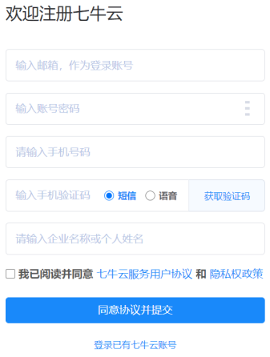

登录成功后点击页面右上角管理控制台：

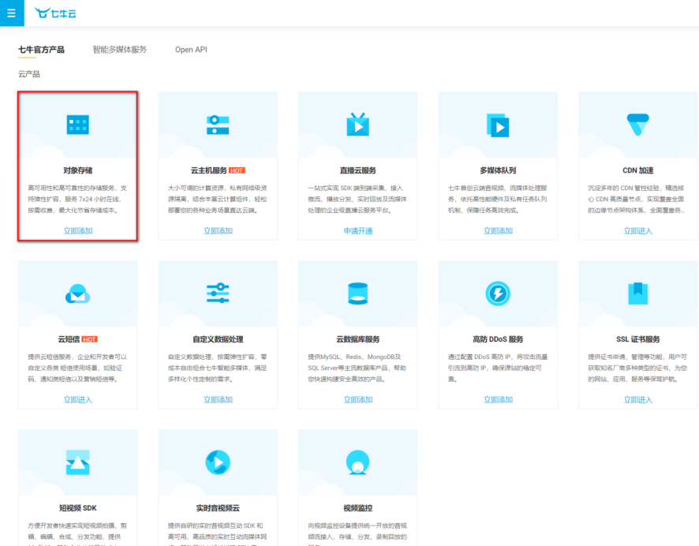

注意：登录成功后还需要进行实名认证才能进行相关操作。

#### 2.2、新建存储空间

要进行图片存储，我们需要在七牛云管理控制台新建存储空间。点击管理控制台首页对象存储下的立即添加按钮，页面跳转到新建存储空间页面：

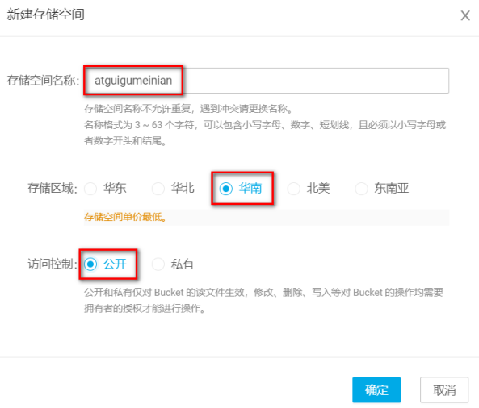

可以创建多个存储空间，各个存储空间是相互独立的。

#### 2.3、 查看存储空间信息

存储空间创建后，会在左侧的存储空间列表菜单中展示创建的存储空间名称，点击存储空间名称可以查看当前存储空间的相关信息

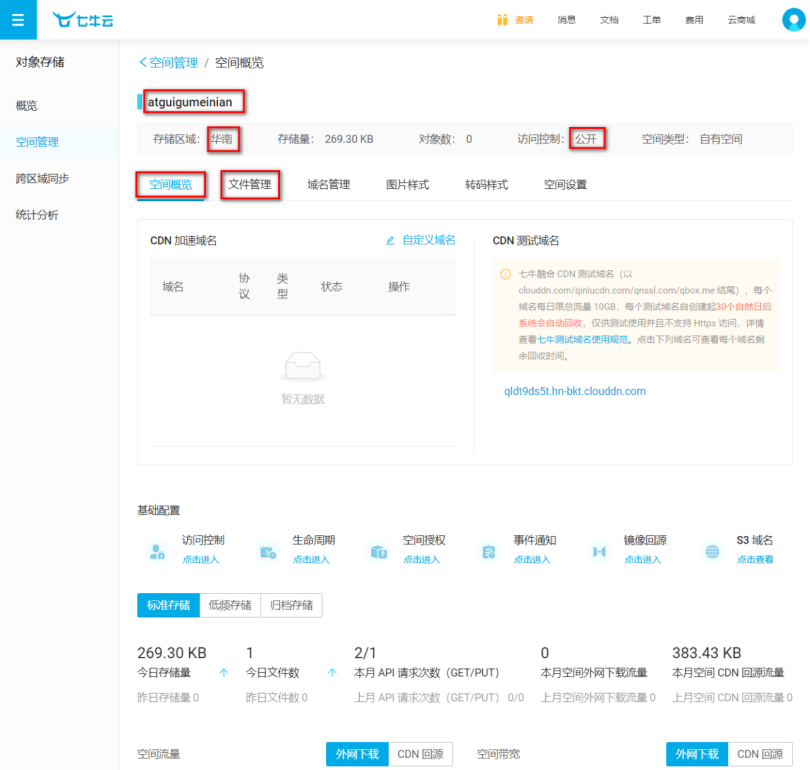

#### 2.4、开发者中心

可以通过七牛云提供的开发者中心学习如何操作七牛云服务，地址：https://developer.qiniu.com/

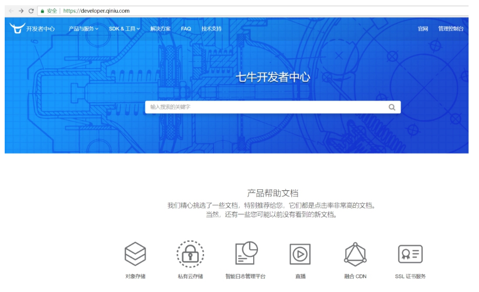

点击对象存储，跳转到对象存储开发页面，地址：https://developer.qiniu.com/kodo

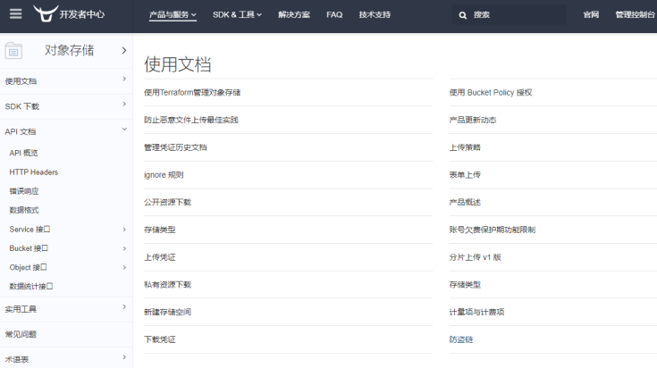

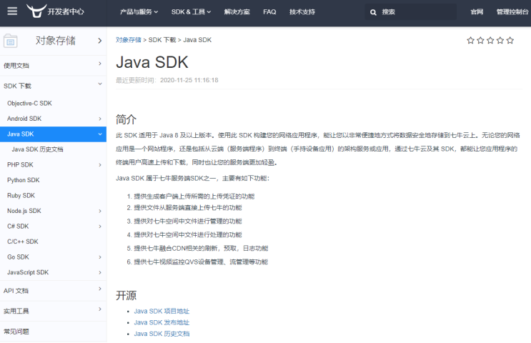

操作步骤：

第一步：导入jar包：

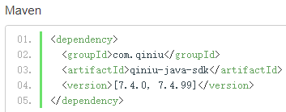

第二步：鉴权

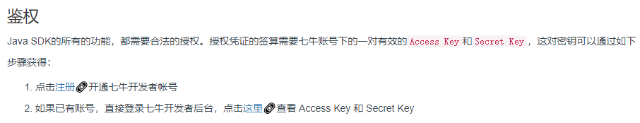

点击“管理控制台”，点击右上图标

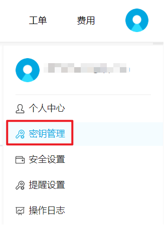

可根据文档中提供的上传文件和删除文件进行测试：

在common-util测试

##### 2.4.1、添加依赖

shf-parent添加依赖管理

```xml
<!--七牛云服务平台，第三方服务（图片上传）-->
<dependency>
    <groupId>com.qiniu</groupId>
    <artifactId>qiniu-java-sdk</artifactId>
    <version>7.2.0</version>
</dependency>
```

common-util引入依赖

```xml
<!--七牛云服务平台，第三方服务（图片上传）-->
<dependency>
    <groupId>com.qiniu</groupId>
    <artifactId>qiniu-java-sdk</artifactId>
</dependency>
```

##### 2.4.2、文件上传

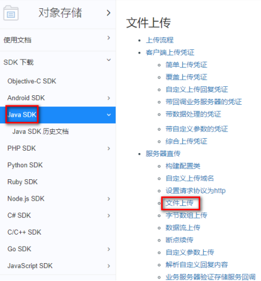

```java
package com.atguigu.test;

import com.google.gson.Gson;
import com.qiniu.common.QiniuException;
import com.qiniu.common.Zone;
import com.qiniu.http.Response;
import com.qiniu.storage.Configuration;
import com.qiniu.storage.UploadManager;
import com.qiniu.storage.model.DefaultPutRet;
import com.qiniu.util.Auth;
import org.junit.Test;

public class TestQiniu {

    // 上传本地文件
    @Test
    public void uploadFile(){
        //构造一个带指定Zone对象的配置类
        Configuration cfg = new Configuration(Zone.zone2());
        //...其他参数参考类注释
        UploadManager uploadManager = new UploadManager(cfg);
        //...生成上传凭证，然后准备上传
        String accessKey = "dzpXBDSa3musX6U7Nq8v0fzv921stt-NnRLGhACK";
        String secretKey = "AB90WSgUo32gY87jOyOW2zVH97fz9wT9JWCpKEm-";
        String bucket = "java-0823";
        //如果是Windows情况下，格式是 D:\\qiniu\\test.png，可支持中文
        String localFilePath = "D:/2.jpg";
        //默认不指定key的情况下，以文件内容的hash值作为文件名
        String key = null;
        Auth auth = Auth.create(accessKey, secretKey);
        String upToken = auth.uploadToken(bucket);
        try {
            Response response = uploadManager.put(localFilePath, key, upToken);
            //解析上传成功的结果
            DefaultPutRet putRet = new Gson().fromJson(response.bodyString(), DefaultPutRet.class);
            System.out.println(putRet.key);
            System.out.println(putRet.hash);
        } catch (QiniuException ex) {
            Response r = ex.response;
            System.err.println(r.toString());
            try {
                System.err.println(r.bodyString());
            } catch (QiniuException e) {
                e.printStackTrace();
            }
        }
    }
}
```

##### 2.4.2、文件删除

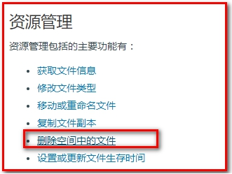


```java
// 删除空间中的文件
@Test
public void deleteFile(){
    //构造一个带指定Zone对象的配置类
    Configuration cfg = new Configuration(Zone.zone2());
    //...其他参数参考类注释
    String accessKey = "BrrMVEQCE6ijrnHX-gGDVVk3e0vY8mAQQEyB_Zzq";
    String secretKey = "uaJNMOUGSkZqb3xce-gv4Y-2f0f5_X5VQO-v4lL0";
    String bucket = "atguigumeinian";//空间
    String key = "Fu3Ic6TV6wIbJt793yaGeBmCkzTX";//文件名称
    Auth auth = Auth.create(accessKey, secretKey);
    BucketManager bucketManager = new BucketManager(auth, cfg);
    try {
        bucketManager.delete(bucket, key);
    } catch (QiniuException ex) {
        //如果遇到异常，说明删除失败
        System.err.println(ex.code());
        System.err.println(ex.response.toString());
    }
}
```

#### 2.5、鉴权

Java SDK的所有的功能，都需要合法的授权。授权凭证的签算需要七牛账号下的一对==有效的Access Key和Secret Key==，这对密钥可以在七牛云管理控制台的个人中心（https://portal.qiniu.com/user/key）获得，如下图：

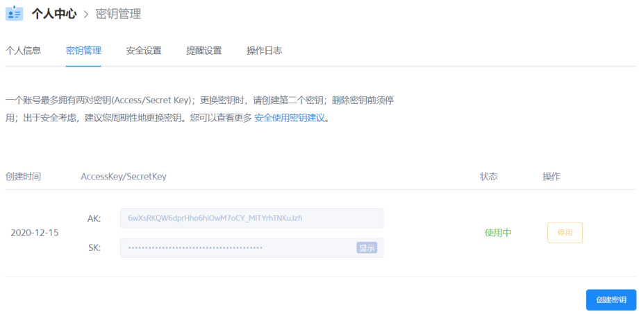

#### 2.6、封装工具类

为了方便操作七牛云存储服务，我们可以将官方提供的案例简单改造成一个工具类，在我们的项目中直接使用此工具类来操作就可以：

```java
package com.atguigu.util;

import com.google.gson.Gson;
import com.qiniu.common.QiniuException;
import com.qiniu.common.Zone;
import com.qiniu.http.Response;
import com.qiniu.storage.BucketManager;
import com.qiniu.storage.Configuration;
import com.qiniu.storage.UploadManager;
import com.qiniu.storage.model.DefaultPutRet;
import com.qiniu.util.Auth;

/**
 * 七牛云工具类
 */
public class QiniuUtils {
    public  static String accessKey = "Gg9uhNA1zAZje-CQW1VUaK6uWoT3eVgX1isWpykC";
    public  static String secretKey = "km4NKbnHF-hXiE4q7eLuV0fWVKUkmsFiZfEUo-mj";
    public  static String bucket = "atguigu-zfw";

    public static void upload2Qiniu(String filePath,String fileName){
        //构造一个带指定Zone对象的配置类
        Configuration cfg = new Configuration(Zone.zone2());
        UploadManager uploadManager = new UploadManager(cfg);
        Auth auth = Auth.create(accessKey, secretKey);
        String upToken = auth.uploadToken(bucket);
        try {
            Response response = uploadManager.put(filePath, fileName, upToken);
            //解析上传成功的结果
            DefaultPutRet putRet = new Gson().fromJson(response.bodyString(), DefaultPutRet.class);
        } catch (QiniuException ex) {
            Response r = ex.response;
            try {
                System.err.println(r.bodyString());
            } catch (QiniuException ex2) {
                //ignore
            }
        }
    }

    //上传文件
    public static void upload2Qiniu(byte[] bytes, String fileName){
        //构造一个带指定Zone对象的配置类
        Configuration cfg = new Configuration(Zone.zone2());
        //...其他参数参考类注释
        UploadManager uploadManager = new UploadManager(cfg);

        //默认不指定key的情况下，以文件内容的hash值作为文件名
        String key = fileName;
        Auth auth = Auth.create(accessKey, secretKey);
        String upToken = auth.uploadToken(bucket);
        try {
            Response response = uploadManager.put(bytes, key, upToken);
            //解析上传成功的结果
            DefaultPutRet putRet = new Gson().fromJson(response.bodyString(), DefaultPutRet.class);
            System.out.println(putRet.key);
            System.out.println(putRet.hash);
        } catch (QiniuException ex) {
            Response r = ex.response;
            System.err.println(r.toString());
            try {
                System.err.println(r.bodyString());
            } catch (QiniuException ex2) {
                //ignore
            }
        }
    }

    //删除文件
    public static void deleteFileFromQiniu(String fileName){
        //构造一个带指定Zone对象的配置类
        Configuration cfg = new Configuration(Zone.zone2());
        String key = fileName;
        Auth auth = Auth.create(accessKey, secretKey);
        BucketManager bucketManager = new BucketManager(auth, cfg);
        try {
            bucketManager.delete(bucket, key);
        } catch (QiniuException ex) {
            //如果遇到异常，说明删除失败
            System.err.println(ex.code());
            System.err.println(ex.response.toString());
        }
    }
}
```

## 二、房源图片上传

上面封装了七牛云图片存储，现在来处理房源图片上传，房源图片是多图片上传，hplus框架自带多图片上传案例，我们可以直接使用：hplus-master/form_webuploader.html

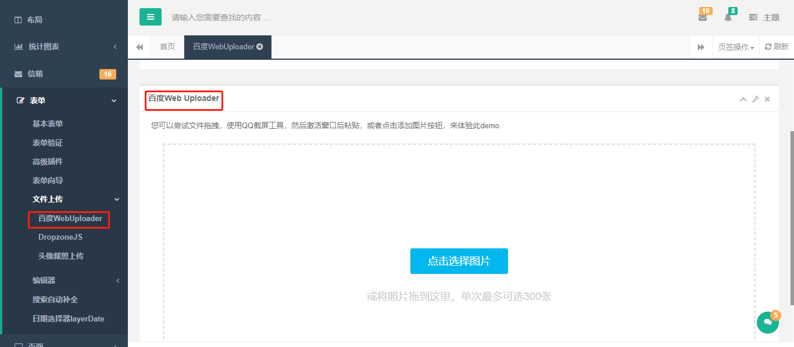

### 1、房源详情页面处理

house/show.html页面添加事件

```javascript
$("#upload1").on("click",function(){
    opt.openWin('/houseImage/uploadShow/[[${house.id}]]/1','上传房源图片',580,430);
});
$("#upload2").on("click",function(){
    opt.openWin('/houseImage/uploadShow/[[${house.id}]]/2','上传房产图片',580,430);
});
$(".deleteImages").on("click",function(){
    var id = $(this).attr("data-id");
    opt.confirm('/houseImage/delete/[[${house.id}]]/'+id);
});
```

### 2、spring mvc上传支持

在spring-mvc添加配置

```xml
<!--配置上传解析器
"maxUploadSize":表示文件大小，图片的大小
"maxInMemorySize" ：图片加载到内存当中的大小 长 * 宽 * 像素字节数(argb8888,rgb565,argb4444)
 "defaultEncoding":UTF-8
 优秀程序员：CV战士
-->
<bean id="multipartResolver"
      class="org.springframework.web.multipart.commons.CommonsMultipartResolver">
    <!-- 设定文件上传的最大值为100MB，100*1024*1024 -->
    <property name="maxUploadSize" value="104857600" />
    <!-- 设定文件上传时写入内存的最大值，如果小于这个参数不会生成临时文件，默认为10240 -->
    <property name="maxInMemorySize" value="4096" />
    <!-- 设定默认编码 -->
    <property name="defaultEncoding" value="UTF-8"/>
</bean>
```

### 3、添加服务器端代码

进入上传页面、保存上传与删除图片

```java
package com.atguigu.controller;

import com.alibaba.dubbo.config.annotation.Reference;
import com.atguigu.base.BaseController;
import com.atguigu.entity.HouseImage;
import com.atguigu.result.Result;
import com.atguigu.service.HouseImageService;
import com.atguigu.util.QiniuUtils;
import org.springframework.stereotype.Controller;
import org.springframework.ui.ModelMap;
import org.springframework.web.bind.annotation.*;
import org.springframework.web.multipart.MultipartFile;
import org.springframework.web.servlet.mvc.support.RedirectAttributes;

import java.util.UUID;

@Controller
@RequestMapping(value="/houseImage")
@SuppressWarnings({"unchecked", "rawtypes"})
public class HouseImageController extends BaseController {

   @Reference
   private HouseImageService houseImageService;
   
   private final static String LIST_ACTION = "redirect:/house/";
   private final static String PAGE_UPLOED_SHOW = "house/upload";

   @GetMapping("/uploadShow/{houseId}/{type}")
   public String uploadShow(ModelMap model,@PathVariable Long houseId, @PathVariable Long type) {
      model.addAttribute("houseId",houseId);
      model.addAttribute("type",type);
      return PAGE_UPLOED_SHOW;
   }

   @PostMapping("/upload/{houseId}/{type}")
   @ResponseBody
   public Result upload(@PathVariable Long houseId, @PathVariable Integer type, @RequestParam(value = "file") MultipartFile[] files) throws Exception {
      if(files.length > 0) {
         for(MultipartFile file : files) {
            String newFileName =  UUID.randomUUID().toString() ;
            // 上传图片
            QiniuUtils.upload2Qiniu(file.getBytes(),newFileName);
            String url= "你的七牛云空间的域名/"+ newFileName;

            HouseImage houseImage = new HouseImage();
            houseImage.setHouseId(houseId);
            houseImage.setType(type);
            houseImage.setImageName(file.getOriginalFilename());
            houseImage.setImageUrl(url);
            houseImageService.insert(houseImage);
         }
      }
      return Result.ok();
   }

   /**
    * 删除
    * @param model
    * @param id
    * @return
    */
   @GetMapping("/delete/{houseId}/{id}")
   public String delete(ModelMap model,@PathVariable Long houseId, @PathVariable Long id,RedirectAttributes redirectAttributes) {
      HouseImage houseImage = houseImageService.getById(id);
      houseImageService.delete(id);
      QiniuUtils.deleteFileFromQiniu(houseImage.getImageUrl());
      return LIST_ACTION + houseId;
   }
}
```

### 4、上传页面

直接获取hplus-master/form_webuploader.html页面代码，删除多余没用代码

house/upload.html

说明：

​	BASE_URL为WebUploader组件flash的地址，通过flash实现的异步上传

​	BASE_UPLOAD为我们的上传地址，即上面定义的controller上传方法

​	webuploader-demo.js为批量上传的实现代码，我们直接使用，替换webuploader-demo.js文件85行上传地址为：server: BASE_UPLOAD

```html
<!DOCTYPE html>
<html xmlns:th="http://www.thymeleaf.org">
<head th:include="common/head :: head"></head>
<link rel="stylesheet" type="text/css" th:href="@{/static/css/plugins/webuploader/webuploader.css}">
<link rel="stylesheet" type="text/css" th:href="@{/static/css/demo/webuploader-demo.css}">
<script th:src="@{/static/js/plugins/webuploader/webuploader.min.js}"></script>
<script th:src="@{/static/js/demo/webuploader-demo.js}"></script>
<script type="text/javascript">
    // 添加全局站点信息 swf文件路径
    var BASE_URL = '/static/js/plugins/webuploader';
    //  自定义服务器上传地址
    var BASE_UPLOAD = '/houseImage/upload/[[${houseId}]]/[[${type}]]';
</script>
<body class="gray-bg">
<div class="row">
    <div class="col-sm-9">
        <div class="wrapper wrapper-content animated fadeInUp">
            <div class="ibox">
                <div class="ibox-content">
                    <div class="row">
                        <div class="ibox-content">
                            <div class="page-container" id="uploadShow">
                                <p>您可以尝试文件拖拽，使用QQ截屏工具，然后激活窗口后粘贴，或者点击添加图片按钮，来体验此demo.</p>
                                <div id="uploader" class="wu-example">
                                    <div class="queueList">
                                        <div id="dndArea" class="placeholder">
                                            <div id="filePicker"></div>
                                            <p>或将照片拖到这里，单次最多可选300张</p>
                                        </div>
                                    </div>
                                    <div class="statusBar" style="display:none;">
                                        <div class="progress">
                                            <span class="text">0%</span>
                                            <span class="percentage"></span>
                                        </div>
                                        <div class="info"></div>
                                        <div class="btns">
                                            <div id="filePicker2"></div>
                                            <div class="uploadBtn">开始上传</div>
                                        </div>
                                    </div>
                                </div>
                            </div>
                        </div>
                    </div>
                    <div class="row">
                        <div class="col-sm-4 col-sm-offset-2">
                            <button class="btn btn-primary" type="button" onclick="opt.closeWin(true);">确定</button>
                        </div>
                    </div>
                </div>
            </div>
        </div>
    </div>
</div>
</body>
</html>
```

看似很复杂，其实很简单，直接使用即可

### 5、上传测试

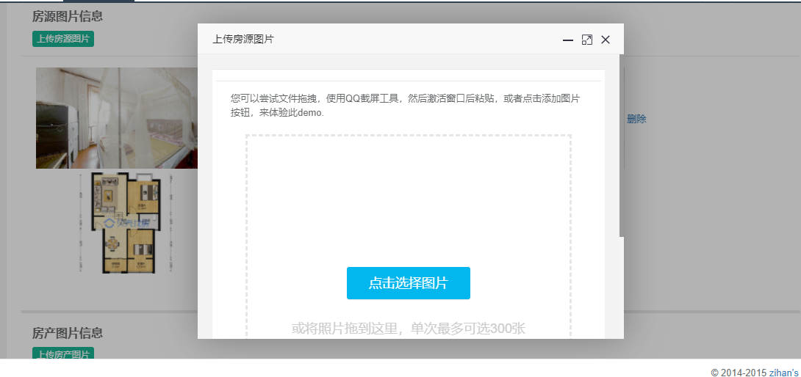

## 三、用户头像上传

用户头像上传前面没有实现

### 1、用户列表页处理

admin/index.html

```html
<a class="upload" th:attr="data-id=${item.id}">上传头像</a>
```

```javascript
$(".upload").on("click",function(){
    var id = $(this).attr("data-id");
    opt.openWin('/admin/uploadShow/'+id,'上传头像',580,300);
});
```

### 2、添加服务器端代码

```java
private final static String PAGE_UPLOED_SHOW = "admin/upload";
```

```java
@GetMapping("/uploadShow/{id}")
public String uploadShow(ModelMap model,@PathVariable Long id) {
   model.addAttribute("id", id);
   return PAGE_UPLOED_SHOW;
}

@PostMapping("/upload/{id}")
public String upload(@PathVariable Long id, @RequestParam(value = "file") MultipartFile file, HttpServletRequest request) throws IOException {
   String newFileName =  UUID.randomUUID().toString() ;
   // 上传图片
   QiniuUtils.upload2Qiniu(file.getBytes(),newFileName);
   String url= "你的七牛云空间的域名/"+ newFileName;
   Admin admin = new Admin();
   admin.setId(id);
   admin.setHeadUrl(url);
   adminService.update(admin);
   return this.successPage(this.MESSAGE_SUCCESS, request);
}
```

### 3、上传页面

admin/upload.html

```html
<!DOCTYPE html>
<html xmlns:th="http://www.thymeleaf.org">
<head th:include="common/head :: head"></head>
<body class="gray-bg">
<div class="wrapper wrapper-content animated fadeInRight">
    <div class="ibox float-e-margins">
        <div class="ibox-content" style="width: 98%;">
            <form id="ec" th:action="@{/admin/upload/{id}(id=${id})}" method="post" enctype="multipart/form-data" class="form-horizontal">
                <div class="form-group">
                    <label class="col-sm-2 control-label">上传头像：</label>
                    <div class="col-sm-10">
                        <input type="file" name="file" id="file" class="form-control" readonly/>
                    </div>
                </div>
                <div class="hr-line-dashed"></div>
                <div class="form-group">
                    <div class="col-sm-4 col-sm-offset-2 text-right">
                        <button class="btn btn-primary" type="submit">确定</button>
                        <button class="btn btn-white" type="button" onclick="javascript:opt.closeWin();" value="取消">取消</button>
                    </div>
                </div>
            </form>
        </div>
    </div>
</div>
</body>
</html>
```

