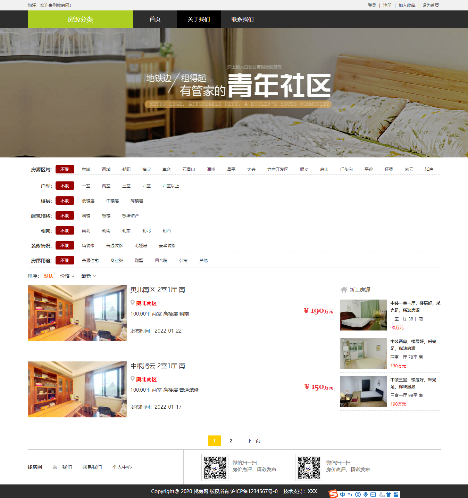
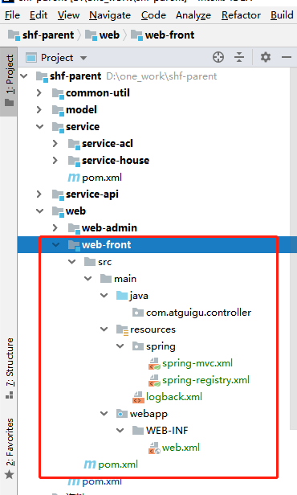
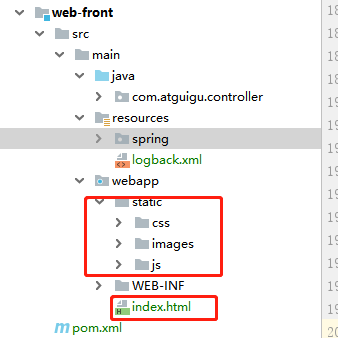

# 尚好房：前端房源展示

## 一、业务介绍

### 1、页面展示

1、首页（房源列表）



2、房源详情

### 2、技术说明

前端页面渲染方式：Vue+Axios

### 3、前端模板

前端模板路径：项目模板/前端模板

可以打开页面模板查看效果

## 二、首页

### 1、搭建前端模块web-front

#### 1.1、搭建web-front

搭建过程与web-admin一致，过程省略，如图



#### 1.2、pom.xml文件

与web-admin基本一致，项目名称与tomcat端口改变

```xml
<?xml version="1.0" encoding="UTF-8"?>
<project xmlns="http://maven.apache.org/POM/4.0.0"
         xmlns:xsi="http://www.w3.org/2001/XMLSchema-instance"
         xsi:schemaLocation="http://maven.apache.org/POM/4.0.0 http://maven.apache.org/xsd/maven-4.0.0.xsd">
    <parent>
        <artifactId>web</artifactId>
        <groupId>com.atguigu</groupId>
        <version>1.0</version>
    </parent>
    <modelVersion>4.0.0</modelVersion>

    <artifactId>web-front</artifactId>
    <packaging>war</packaging>

    <build>
        <plugins>
            <plugin>
                <groupId>org.eclipse.jetty</groupId>
                <artifactId>jetty-maven-plugin</artifactId>
                <version>9.4.15.v20190215</version>
                <configuration>
                    <!-- 如果检测到项目有更改则自动热部署，每隔n秒扫描一次。默认为0，即不扫描-->
                    <scanIntervalSeconds>10</scanIntervalSeconds>
                    <webAppConfig>
                        <!--指定web项目的根路径，默认为/ -->
                        <contextPath>/</contextPath>
                    </webAppConfig>
                    <httpConnector>
                        <!--端口号，默认 8080-->
                        <port>8001</port>
                    </httpConnector>
                </configuration>
            </plugin>
        </plugins>
    </build>

</project>
```

#### 1.3、spring-mvc.xml文件

不需要配置页面渲染与上传等

```xml
<?xml version="1.0" encoding="UTF-8"?>
<beans xmlns="http://www.springframework.org/schema/beans"
       xmlns:xsi="http://www.w3.org/2001/XMLSchema-instance"
       xmlns:p="http://www.springframework.org/schema/p"
       xmlns:context="http://www.springframework.org/schema/context"
       xmlns:mvc="http://www.springframework.org/schema/mvc" xmlns:dubbo="http://code.alibabatech.com/schema/dubbo"
       xsi:schemaLocation="http://www.springframework.org/schema/beans
        http://www.springframework.org/schema/beans/spring-beans.xsd
        http://www.springframework.org/schema/context
        http://www.springframework.org/schema/context/spring-context.xsd
        http://www.springframework.org/schema/mvc
        http://www.springframework.org/schema/mvc/spring-mvc.xsd http://code.alibabatech.com/schema/dubbo http://code.alibabatech.com/schema/dubbo/dubbo.xsd">
    <!-- 先扫描dubbo 在扫描 mvn -->
    <import resource="spring-registry.xml"/>

    <!--包扫描-->
    <context:component-scan base-package="com.atguigu" />

    <!-- 没有匹配上的url全部按默认方式（就是直接访问）访问，避免拦截静态资源 -->
    <mvc:default-servlet-handler/>
    <!-- 开启mvc注解-->
    <mvc:annotation-driven>
        <mvc:message-converters register-defaults="true">
            <!-- 配置Fastjson支持 -->
            <bean class="com.alibaba.fastjson.support.spring.FastJsonHttpMessageConverter">
                <property name="supportedMediaTypes">
                    <list>
                        <value>text/html;charset=UTF-8</value>
                        <value>application/json</value>
                    </list>
                </property>
            </bean>
        </mvc:message-converters>
    </mvc:annotation-driven>
</beans>
```

#### 1.4、spring-registry.xml文件

基本一致，名称与端口改变

```xml
<?xml version="1.0" encoding="UTF-8"?>
<beans xmlns="http://www.springframework.org/schema/beans"
       xmlns:xsi="http://www.w3.org/2001/XMLSchema-instance"
       xmlns:dubbo="http://code.alibabatech.com/schema/dubbo"
       xsi:schemaLocation="http://www.springframework.org/schema/beans
                            http://www.springframework.org/schema/beans/spring-beans.xsd
                            http://code.alibabatech.com/schema/dubbo
                            http://code.alibabatech.com/schema/dubbo/dubbo.xsd">
    <!--配置dubbo应用程序名称-->
    <dubbo:application name="web-front"></dubbo:application>
    <!--注册配置中心-->
    <dubbo:registry address="zookeeper://127.0.0.1:2181"></dubbo:registry>
    <!--dubbo扫描-->
    <dubbo:annotation package="com.atguigu"></dubbo:annotation>
    <!--启动时候不检查 设置连接超时时间-->
    <dubbo:consumer check="false" timeout="600000"></dubbo:consumer>

</beans>
```

#### 1.5、logback.xml文件

完全一致

```xml
<?xml version="1.0" encoding="UTF-8"?>
<configuration debug="false">

    <!--定义日志文件的存储地址 logs为当前项目的logs目录 还可以设置为../logs -->
    <property name="LOG_HOME" value="logs" />

    <!--控制台日志， 控制台输出 -->
    <appender name="STDOUT" class="ch.qos.logback.core.ConsoleAppender">
        <encoder class="ch.qos.logback.classic.encoder.PatternLayoutEncoder">
            <!--格式化输出：%d表示日期，%thread表示线程名，%-5level：级别从左显示5个字符宽度,%msg：日志消息，%n是换行符-->
            <pattern>%d{yyyy-MM-dd HH:mm:ss.SSS} [%thread] %-5level %logger{50} - %msg%n</pattern>
        </encoder>
    </appender>

    <!-- 日志输出级别 -->
    <root level="DEBUG">
        <appender-ref ref="STDOUT" />
    </root>
</configuration>
```

#### 1.6、web.xml

```xml
<?xml version="1.0" encoding="UTF-8"?>
<web-app xmlns:xsi="http://www.w3.org/2001/XMLSchema-instance"
         xmlns="http://java.sun.com/xml/ns/javaee"
         xsi:schemaLocation="http://java.sun.com/xml/ns/javaee http://java.sun.com/xml/ns/javaee/web-app_3_0.xsd"
         id="WebApp_ID" version="3.0">
    <display-name>web</display-name>

    <!-- 解决post乱码 添加字符编码过滤器 -->
    <filter>
        <filter-name>encode</filter-name>
        <filter-class>org.springframework.web.filter.CharacterEncodingFilter</filter-class>
        <init-param>
            <param-name>encoding</param-name>
            <param-value>UTF-8</param-value>
        </init-param>
        <init-param>
            <param-name>forceRequestEncoding</param-name>
            <param-value>true</param-value>
        </init-param>
        <init-param>
            <param-name>forceResponseEncoding</param-name>
            <param-value>true</param-value>
        </init-param>
    </filter>
    <filter-mapping>
        <filter-name>encode</filter-name>
        <url-pattern>/*</url-pattern>
    </filter-mapping>

    <!-- 配置SpringMVC框架前端控制器 -->
    <servlet>
        <servlet-name>springMVC</servlet-name>
        <servlet-class>org.springframework.web.servlet.DispatcherServlet</servlet-class>
        <init-param>
            <param-name>contextConfigLocation</param-name>
            <param-value>classpath:spring/spring-mvc.xml</param-value>
        </init-param>
        <load-on-startup>1</load-on-startup>
    </servlet>
    <servlet-mapping>
        <servlet-name>springMVC</servlet-name>
        <url-pattern>/</url-pattern>
    </servlet-mapping>

</web-app>
```

### 2、首页分析

#### 2.1、功能分析

搜索列表：

​	房源区域为二级联动，区域与板块，数据字典数据

​	户型、楼层等数据为数据字典一级数据

排序：

​	默认排序：根据id

​	价格排序：总价从高到低

​	最新排序：创建时间（其实跟id排序大概一致）

房源列表：

​	分页展示

​	新上房源（不做，不是重点）

#### 2.2、接口分析

搜索列表需提供两个接口：

​	1、根据编码获取子节点数据列表

​	2、根据上级id获取子节点数据列表

分页搜索一个接口：

​	由于搜索条件多，我们可以封装一个类接收搜索条件与排序

### 2.3、数据字典接口封装

service层的接口都已封装好了的

```java
package com.atguigu.controller;

import com.alibaba.dubbo.config.annotation.Reference;
import com.atguigu.base.BaseController;
import com.atguigu.entity.Dict;
import com.atguigu.result.Result;
import com.atguigu.service.DictService;
import org.springframework.web.bind.annotation.*;

import java.util.List;

@RestController
@RequestMapping(value="/dict")
@CrossOrigin
@SuppressWarnings({"unchecked", "rawtypes"})
public class DictController extends BaseController {

   @Reference
   private DictService dictService;
   
   /**
    * 根据上级id获取子节点数据列表
    * @param parentId
    * @return
    */
   @GetMapping(value = "findListByParentId/{parentId}")
   public Result<List<Dict>> findListByParentId(@PathVariable Long parentId) {
      List<Dict> list = dictService.findListByParentId(parentId);
      return Result.ok(list);
   }

   /**
    * 根据编码获取子节点数据列表
    * @param dictCode
    * @return
    */
   @GetMapping(value = "findListByDictCode/{dictCode}")
   public Result<List<Dict>> findListByDictCode(@PathVariable String dictCode) {
      List<Dict> list = dictService.findListByDictCode(dictCode);
      return Result.ok(list);
   }
   
}
```

### 2.4、封装房源搜索接口

#### 2.4.1、封装搜索参数

HouseQueryVo

```java
package com.atguigu.vo;

import java.io.Serializable;

public class HouseQueryVo implements Serializable {
   
   private static final long serialVersionUID = 1L;

   //区域id：（字典id）
   private Long areaId;
   //板块id：（字典id）
   private Long plateId;
   //房源关键字
   private String keyword;
   //总价：万元
   private String totalPrice;
   //户型：（字典id）
   private Long houseTypeId;
   //楼层（字典id）
   private Long floorId;
   //建筑结构：（字典id）
   private Long buildStructureId;
   //朝向：（字典id）
   private Long directionId;
   //装修情况：（字典id）
   private Long decorationId;
   //房屋用途：（字典id）
   private Long houseUseId;

   //排序：默认 defaultSort=1按默认排序
   private Integer defaultSort;
   //排序：默认 priceSort=1按价格排序
   private Integer priceSort;
   //排序：默认 timeSort=1按时间排序
   private Integer timeSort;

   //get set省略
   ...
}
```

#### 2.4.2、封装房源页面显示属性

HouseVo

```java
package com.atguigu.vo;


import java.io.Serializable;
import java.math.BigDecimal;
import java.text.DateFormat;
import java.text.SimpleDateFormat;
import java.util.Date;

public class HouseVo {

   private Long id;
   private String communityName;
   private String name;
   private String buildArea;
   private BigDecimal totalPrice;
   private BigDecimal unitPrice;
   private Long houseTypeId;
   private Long floorId;
   private Long directionId;
   private String defaultImageUrl;
   private Date createTime;

   private String houseTypeName;
   private String floorName;
   private String directionName;
   
   //get set省略
   ...

   //日期转换为字符串
   public String getCreateTimeString() {
      Date date = this.getCreateTime();
      if(null == date) return "";
      DateFormat df = new SimpleDateFormat("yyyy-MM-dd");
      String dateString = df.format(date);
      return dateString;
   }
}
```

#### 2.4.3、service接口

在HouseService类添加接口

```java
PageInfo<HouseVo> findListPage(int pageNum, int pageSize, HouseQueryVo houseQueryVo);
```

#### 2.4.4、service接口实现

在HouseServiceImpl类添加接口实现

```java
@Override
public PageInfo<HouseVo> findListPage(int pageNum, int pageSize, HouseQueryVo houseQueryVo) {
   PageHelper.startPage(pageNum, pageSize);
   Page<HouseVo> page = houseDao.findListPage(houseQueryVo);
   List<HouseVo> list = page.getResult();
   for(HouseVo houseVo : list) {
      //户型：
      String houseTypeName = dictDao.getNameById(houseVo.getHouseTypeId());
      //楼层
      String floorName = dictDao.getNameById(houseVo.getFloorId());
      //朝向：
      String directionName = dictDao.getNameById(houseVo.getDirectionId());
      houseVo.setHouseTypeName(houseTypeName);
      houseVo.setFloorName(floorName);
      houseVo.setDirectionName(directionName);
   }
   return new PageInfo<HouseVo>(page, 10);
}
```

#### 2.4.5、dao层接口

在HouseDao类添加接口

```java
Page<HouseVo> findListPage(@Param("vo") HouseQueryVo houseQueryVo);
```

#### 2.4.6、xml配置

在HouseDao.xml添加配置

```xml
<select id="findListPage" resultType="com.atguigu.vo.HouseVo">
   select
   cmty.name as communityName,

   hse.id,
   hse.name,
   hse.build_area as buildArea,
   hse.unit_price as unitPrice,
   hse.total_price as totalPrice,
   hse.house_type_id as houseTypeId,
   hse.floor_id as floorId,
   hse.direction_id as directionId,
   hse.default_image_url as defaultImageUrl,
   hse.create_time as createTime
   from hse_house hse
   left join hse_community cmty on cmty.id = hse.community_id
   <where>
      <if test="vo.keyword != null and vo.keyword != ''">
         and hse.name like CONCAT('%',#{vo.keyword},'%')
      </if>
      <if test="vo.areaId != null">
         and cmty.area_id = #{vo.areaId}
      </if>
      <if test="vo.plateId != null">
         and cmty.plate_id = #{vo.plateId}
      </if>
      <if test="vo.houseTypeId != null">
         and hse.house_type_id = #{vo.houseTypeId}
      </if>
      <if test="vo.floorId != null">
         and hse.floor_id = #{vo.floorId}
      </if>
      <if test="vo.buildStructureId != null">
         and hse.build_structure_id = #{vo.buildStructureId}
      </if>
      <if test="vo.directionId != null">
         and hse.direction_id = #{vo.directionId}
      </if>
      <if test="vo.decorationId != null">
         and hse.decoration_id = #{vo.decorationId}
      </if>
      <if test="vo.houseUseId != null">
         and hse.house_use_id = #{vo.houseUseId}
      </if>
      and hse.status = 1
      and hse.is_deleted = 0
      and cmty.is_deleted = 0
   </where>
   <if test="vo.defaultSort == 1">
      order by hse.id desc
   </if>
   <if test="vo.priceSort == 1">
      order by hse.total_price desc
   </if>
   <if test="vo.timeSort == 1">
      order by hse.create_time desc
   </if>
</select>
```

#### 2.4.7、controller层


```java
package com.atguigu.controller;

import com.alibaba.dubbo.config.annotation.Reference;
import com.atguigu.result.Result;
import com.atguigu.service.HouseService;
import com.atguigu.vo.HouseQueryVo;
import com.atguigu.vo.HouseVo;
import com.github.pagehelper.PageInfo;
import org.springframework.web.bind.annotation.*;


@RestController
@RequestMapping(value="/house")
@CrossOrigin
@SuppressWarnings({"unchecked", "rawtypes"})
public class HouseController {

    @Reference
    private HouseService houseService;

    /**
     * 房源列表
     *
     * @return
     */
    @PostMapping(value = "/list/{pageNum}/{pageSize}")
    public Result findListPage(@RequestBody HouseQueryVo houseQueryVo,
                               @PathVariable Integer pageNum,
                               @PathVariable Integer pageSize) {
        PageInfo<HouseVo> pageInfo = houseService.findListPage(pageNum, pageSize, houseQueryVo);
        return Result.ok(pageInfo);
    }

}
```

### 2.5、前端页面

#### 2.5.1、 引入静态资源

路径：项目模板/前端模板

复制static文件夹与index.html到web-front模块webapp目录下



#### 2.5.2、 引入vue组件

路径：vue js组件

复制vue.js与axios.js到webapp/static/js下

页面引入

```html
<script src="./static/js/vue.js"></script>
<script src="./static/js/axios.js"></script>
```

index.html

```html
<!DOCTYPE html>
<html>
<head>
    <meta http-equiv="Content-Type" content="text/html; charset=utf-8"/>
    <meta name="Author" contect="http://www.webqin.net">
    <title>尚好房</title>
    <link rel="shortcut icon" href="./static/images/favicon.ico"/>
    <link type="text/css" href="./static/css/css.css" rel="stylesheet"/>
    <script type="text/javascript" src="./static/js/jquery.js"></script>
    <script type="text/javascript" src="./static/js/js.js"></script>
    <script src="./static/js/vue.js"></script>
    <script src="./static/js/axios.js"></script>
    <script type="text/javascript">
        $(function () {
            //导航定位
            $(".nav li:eq(1)").addClass("navCur");
        })
    </script>
</head>

<body>
<div id="list">
    <div class="header">
        <div class="width1190">
            <div class="fl">您好，欢迎来到尚好房！</div>
            <div class="fr">
                <a href="login.html">登录</a> |
                <a href="register.html">注册</a> |
                <a href="javascript:;">加入收藏</a> |
                <a href="javascript:;">设为首页</a>
            </div>
            <div class="clears"></div>
        </div><!--width1190/-->
    </div>
    <div class="list-nav">
        <div class="width1190">
            <div class="list"><h3>房源分类</h3></div><!--list/-->
            <ul class="nav">
                <li><a href="index.html">首页</a></li>
                <li><a href="about.html">关于我们</a></li>
                <li><a href="contact.html">联系我们</a></li>
                <div class="clears"></div>
            </ul><!--nav/-->
            <div class="clears"></div>
        </div><!--width1190/-->
    </div><!--list-nav/-->
    <div class="banner" style="background:url(./static/images/ban.jpg) center center no-repeat;"></div>

        <div class="content">
            <div class="width1190">
                <form action="#" method="get" class="pro-search">
                    <table>
                        <tr>
                            <th>房源区域：</th>
                            <td>
                                <div style="line-height: 30px;">
                                    <a href="javascript:;" class="pro-cur">不限</a>
                                    <a href="javascript:;">智慧园</a>
                                    <a href="javascript:;">立民村</a>
                                    <a href="javascript:;">塘口村</a>
                                    <a href="javascript:;">勤劳村</a>
                                    <a href="javascript:;">芦胜村</a>
                                    <a href="javascript:;">知新村1</a>
                                </div>
                                <!--新增区域-->
                                <div style="font-size: 12px;border-top:#ccc 1px dotted;">
                                    <a href="javascript:;">锦江</a>
                                    <a href="javascript:;">青羊</a>
                                    <a href="javascript:;">武侯</a>
                                    <a href="javascript:;">高新</a>
                                    <a href="javascript:;">成华</a>
                                    <a href="javascript:;">金牛</a>
                                    <a href="javascript:;">天府新区</a>
                                    <a href="javascript:;">高新西</a>
                                    <a href="javascript:;">双流</a>
                                    <a href="javascript:;">温江</a>
                                    <a href="javascript:;">郫都</a>
                                    <a href="javascript:;">龙泉驿</a>
                                    <a href="javascript:;">新都</a>
                                    <a href="javascript:;">天府新区南区</a>
                                    <a href="javascript:;">青白江</a>
                                    <a href="javascript:;">都江堰</a>
                                    <a href="javascript:;">鹏都</a>
                                    <a href="javascript:;">简阳</a>
                                    <a href="javascript:;">新津</a>
                                    <a href="javascript:;">崇州</a>
                                    <a href="javascript:;">大邑</a>
                                    <a href="javascript:;">金堂</a>
                                    <a href="javascript:;">浦江</a>
                                    <a href="javascript:;">邛崃</a>
                                </div>
                            </td>
                        </tr>
                        <tr>
                            <th>房型：</th>
                            <td>
                                <a href="javascript:;" class="pro-cur">不限</a>
                                <a href="javascript:;">一室一厅</a>
                                <a href="javascript:;">两室一厅</a>
                                <a href="javascript:;">3室一厅</a>
                                <a href="javascript:;">一室一厅一卫</a>
                            </td>
                        </tr>
                        <tr>
                            <th>价格：</th>
                            <td>
                                <a href="javascript:;" class="pro-cur">不限</a>
                                <a href="javascript:;">500-1000</a>
                                <a href="javascript:;">10001-2000</a>
                                <a href="javascript:;">2001-3000</a>
                                <a href="javascript:;">3001-4000</a>
                                <input type="text" class="protext"/> - <input type="text" class="protext"/> 元
                                <input type="submit" class="proSub" value="确定"/>
                            </td>
                        </tr>
                        <tr>
                            <th>面积：</th>
                            <td>
                                <a href="javascript:;" class="pro-cur">不限</a>
                                <a href="javascript:;">10平方</a>
                                <a href="javascript:;">20-40平方</a>
                                <a href="javascript:;">41-60平方</a>
                                <a href="javascript:;">61-80平方</a>
                                <a href="javascript:;">100平方以上</a>
                            </td>
                        </tr>
                    </table>
                    <div class="paixu">
                        <strong>排序：</strong>
                        <a href="javascript:;" class="pai-cur">默认</a>
                        <a href="javascript:;">价格 &or;</a>
                        <a href="javascript:;">最新 &or;</a>
                    </div>
                </form><!--pro-search/-->
            </div><!--width1190/-->
            <div class="width1190">
                <div class="pro-left">
                    <dl>
                        <dt><a href="info.html"></a></dt>
                        <dd>
                            <h3><a href="proinfo.html">中装一室一厅，楼层好，采光足，稀缺房源</a></h3>
                            <div class="pro-wei">
                                 <strong class="red">智慧园</strong>
                            </div>
                            <div class="pro-fang">100.00平 两室 高楼层 普通装修</div>
                            <div class="pra-fa">发布时间：2020-12-03</div>
                        </dd>
                        <div class="price">¥ <strong>290</strong><span class="font12">万元</span></div>
                        <div class="clears"></div>
                    </dl>
                    <dl>
                        <dt><a href="info.html"></a></dt>
                        <dd>
                            <h3><a href="proinfo.html">中装一室一厅，楼层好，采光足，稀缺房源</a></h3>
                            <div class="pro-wei">
                                 <strong class="red">智慧园</strong>
                            </div>
                            <div class="pro-fang">100.00平 两室 高楼层 普通装修</div>
                            <div class="pra-fa">发布时间：2020-12-03</div>
                        </dd>
                        <div class="price">¥ <strong>290</strong><span class="font12">万元</span></div>
                        <div class="clears"></div>
                    </dl>
                    <dl>
                        <dt><a href="info.html"></a></dt>
                        <dd>
                            <h3><a href="proinfo.html">中装一室一厅，楼层好，采光足，稀缺房源</a></h3>
                            <div class="pro-wei">
                                 <strong class="red">智慧园</strong>
                            </div>
                            <div class="pro-fang">100.00平 两室 高楼层 普通装修</div>
                            <div class="pra-fa">发布时间：2020-12-03</div>
                        </dd>
                        <div class="price">¥ <strong>290</strong><span class="font12">万元</span></div>
                        <div class="clears"></div>
                    </dl>
                    <dl>
                        <dt><a href="info.html"></a></dt>
                        <dd>
                            <h3><a href="proinfo.html">中装一室一厅，楼层好，采光足，稀缺房源</a></h3>
                            <div class="pro-wei">
                                 <strong class="red">智慧园</strong>
                            </div>
                            <div class="pro-fang">100.00平 两室 高楼层 普通装修</div>
                            <div class="pra-fa">发布时间：2020-12-03</div>
                        </dd>
                        <div class="price">¥ <strong>290</strong><span class="font12">万元</span></div>
                        <div class="clears"></div>
                    </dl>
                    <dl>
                        <dt><a href="info.html"></a></dt>
                        <dd>
                            <h3><a href="proinfo.html">中装一室一厅，楼层好，采光足，稀缺房源</a></h3>
                            <div class="pro-wei">
                                 <strong class="red">智慧园</strong>
                            </div>
                            <div class="pro-fang">100.00平 两室 高楼层 普通装修</div>
                            <div class="pra-fa">发布时间：2020-12-03</div>
                        </dd>
                        <div class="price">¥ <strong>290</strong><span class="font12">万元</span></div>
                        <div class="clears"></div>
                    </dl>
                </div><!--pro-left/-->
                <div class="pro-right">
                    <h2 class="right-title">新上房源</h2>
                    <div class="right-pro">
                        <dl>
                            <dt><a href="proinfo.html"></a></dt>
                            <dd>
                                <h3><a href="proinfo.html">中装一室一厅，楼层好，采光足，稀缺房源</a></h3>
                                <div class="pro-fang">一室一厅 38平 南</div>
                                <div class="right-price">90万元</div>
                            </dd>
                        </dl>
                        <dl>
                            <dt><a href="proinfo.html"></a></dt>
                            <dd>
                                <h3><a href="proinfo.html">中装两室，楼层好，采光足，稀缺房源</a></h3>
                                <div class="pro-fang">两室一厅 78平 南</div>
                                <div class="right-price">130万元</div>
                            </dd>
                        </dl>
                        <dl>
                            <dt><a href="proinfo.html"></a></dt>
                            <dd>
                                <h3><a href="proinfo.html">中装三室，楼层好，采光足，稀缺房源</a></h3>
                                <div class="pro-fang">三室一厅 98平 南</div>
                                <div class="right-price">190万元</div>
                            </dd>
                        </dl>
                    </div><!--right-pro/-->
                </div><!--pro-right/-->
                <div class="clears"></div>
                <ul class="pages">
                    <!--<li>
                        <a href="#">首页</a>
                    </li>-->
                    <li>
                        <a href="#">上一页</a>
                    </li>
                    <li>
                        <a href="#">1</a>
                    </li>
                    <li class="page_active">
                        <a href="#">2</a>
                    </li>
                    <li>
                        <a href="#">3</a>
                    </li>
                    <li>
                        <a href="#">4</a>
                    </li>
                    <li>
                        <a href="#">5</a>
                    </li>
                    <li>
                        <span>...</span>
                    </li>
                    <li>
                        <a href="#">999</a>
                    </li>
                    <li>
                        <a href="#">下一页</a>
                    </li>
                    <!--<li>
                        <a href="#">尾页</a>
                    </li>-->
                </ul>
            </div><!--width1190/-->
        </div><!--content/-->

    <div class="footer">
        <div class="width1190">
            <div class="fl"><a href="index.html"><strong>尚好房</strong></a><a href="about.html">关于我们</a><a
                    href="contact.html">联系我们</a><a href="follow.html">个人中心</a></div>
            <div class="fr">
                <dl>
                    <dt></dt>
                    <dd>微信扫一扫<br/>房价点评，精彩发布</dd>
                </dl>
                <dl>
                    <dt></dt>
                    <dd>微信扫一扫<br/>房价点评，精彩发布</dd>
                </dl>
                <div class="clears"></div>
            </div>
            <div class="clears"></div>
        </div><!--width1190/-->
    </div><!--footer/-->
    <div class="copy">Copyright@ 2020 尚好房 版权所有 沪ICP备1234567号-0&nbsp;&nbsp;&nbsp;&nbsp;技术支持：XXX</div>
    <div class="bg100"></div>
</div>
<script>
new Vue({
    el: '#list',

    data: {
    },

    created () {
    },

    methods: {
       
    }
})
</script>
</body>
</html>
```

#### 2.5.3 搜索条件渲染

1、获取搜索数据

```html
<script>
new Vue({
    el: '#list',

    data: {
        areaList: [],
        plateList: [],
        houseTypeList: [],
        floorList: [],
        buildStructureList: [],
        directionList: [],
        decorationList: [],
        houseUseList: []
    },

    created () {
        this.fetchDictData()
    },

    methods: {
        fetchDictData() {
            //axios在then的内部不能使用Vue的实例化的this, 因为在内部 this 没有被绑定
            var that = this
            axios.get('/dict/findListByDictCode/beijing').then(function (response) {
                that.areaList = response.data.data
            });
            axios.get('/dict/findListByDictCode/houseType').then(function (response) {
                that.houseTypeList = response.data.data
            });
            axios.get('/dict/findListByDictCode/floor').then(function (response) {
                that.floorList = response.data.data
            });
            axios.get('/dict/findListByDictCode/buildStructure').then(function (response) {
                that.buildStructureList = response.data.data
            });
            axios.get('/dict/findListByDictCode/direction').then(function (response) {
                that.directionList = response.data.data
            });
            axios.get('/dict/findListByDictCode/decoration').then(function (response) {
                that.decorationList = response.data.data
            });
            axios.get('/dict/findListByDictCode/houseUse').then(function (response) {
                that.houseUseList = response.data.data
            });
        }
    }
})
</script>
```

2、页面渲染

```html
<table>
    <tr>
        <th>房源区域：</th>
        <td>
            <div style="line-height: 30px;">
                <a href="javascript:;">不限</a>
                <a href="javascript:;" v-for="item in areaList" :key="item.id">{{ item.name }}</a>
            </div>
            <!--新增区域-->
            <div style="font-size: 12px;border-top:#ccc 1px dotted;">
                <a href="javascript:;" v-for="item in plateList" :key="item.id">{{ item.name }}</a>
            </div>
        </td>
    </tr>
    <tr>
        <th>户型：</th>
        <td>
            <a href="javascript:;">不限</a>
            <a href="javascript:;" v-for="item in houseTypeList" :key="item.id">{{ item.name }}</a>
        </td>
    </tr>
    <tr>
        <th>楼层：</th>
        <td>
            <a href="javascript:;" >不限</a>
            <a href="javascript:;" v-for="item in floorList" :key="item.id">{{ item.name }}</a>
        </td>
    </tr>
    <tr>
        <th>建筑结构：</th>
        <td>
            <a href="javascript:;">不限</a>
            <a href="javascript:;" v-for="item in buildStructureList" :key="item.id">{{ item.name }}</a>
        </td>
    </tr>
    <tr>
        <th>朝向：</th>
        <td>
            <a href="javascript:;">不限</a>
            <a href="javascript:;" v-for="item in directionList" :key="item.id">{{ item.name }}</a>
        </td>
    </tr>
    <tr>
        <th>装修情况：</th>
        <td>
            <a href="javascript:;">不限</a>
            <a href="javascript:;" v-for="item in decorationList" :key="item.id">{{ item.name }}</a>
        </td>
    </tr>
    <tr>
        <th>房屋用途：</th>
        <td>
            <a href="javascript:;">不限</a>
            <a href="javascript:;" v-for="item in houseUseList" :key="item.id">{{ item.name }}</a>
        </td>
    </tr>
</table>
```

#### 2.5.4、渲染列表

##### 2.5.4.1、定义数据分页数据及查询条件

```javascript
data: {
    ...

    //接口返回的分页数据，在此声明
    page: {
        list: [],
        pageNum: 1,
        pageSize: 2, //方便测试分页
        pages: 1,
        navigatepageNums: [1,2,3,4],
        prePage: 0,
        nextPage: 0,
        hasPreviousPage: false,
        hasNextPage: false
    },

    houseQueryVo: {
        areaId: '',
        plateId: '',
        houseTypeId: '',
        floorId: '',
        buildStructureId: '',
        directionId: '',
        decorationId: '',
        houseUseId: '',

        defaultSort: 1,
        priceSort: null,
        timeSort: null,

    },
},
```

##### 2.5.4.2、查询数据

```javascript
created () {
    ...
    this.fetchData(1);
},

methods: {
    ...
    fetchData(pageNum = 1) {
        this.page.pageNum = pageNum
        if(pageNum < 1) pageNum = 1

        var that = this
        axios.post('/house/list/'+pageNum+'/'+this.page.pageSize, this.houseQueryVo).then(function (response) {
            that.page = response.data.data
        });
    }
}
```

##### 2.5.4.3、列表页面渲染

```html
<dl v-for="item in page.list" :key="item.id" >
    <dt><a :href="'info.html?id='+item.id"></a></dt>
    <dd>
        <h3><a :href="'info.html?id='+item.id">{{ item.name }}</a></h3>
        <div class="pro-wei">
             <strong class="red">{{ item.communityName }}</strong>
        </div>
        <div class="pro-fang">{{ item.buildArea }}平 {{ item.houseTypeName}} {{ item.floorName}} {{ item.directionName}}</div>
        <div class="pra-fa"> 发布时间：{{ item.createTimeString }}</div>
    </dd>
    <div class="price">¥ <strong>{{ item.totalPrice }}</strong><span class="font12">万元</span></div>
    <div class="clears"></div>
</dl>
```

##### 2.5.4.4、分页渲染

```html
<ul class="pages">
    <li>
        <a href="javascript:;" @click="fetchData(page.prePage)" v-if="page.hasPreviousPage">上一页</a>
    </li>
    <li v-for="item in page.navigatepageNums" :class="item==page.pageNum ? 'page_active' : ''">
        <a href="javascript:;" @click="fetchData(item)">{{ item }}</a>
    </li>
    <li>
        <a href="javascript:;" @click="fetchData(page.nextPage)" v-if="page.hasNextPage">下一页</a>
    </li>
</ul>
```

#### 2.5.5、搜索二级联动处理

二级联动及选中处理

##### 2.5.5.1 、页面处理

区域添加点击事件，class处理选中效果

```html
<tr>
    <th>房源区域：</th>
    <td>
        <div style="line-height: 30px;">
            <a href="javascript:;" @click="searchArea('')" :class="houseQueryVo.areaId=='' ? 'pro-cur' : ''">不限</a>
            <a href="javascript:;" @click="searchArea(item.id)" :class="item.id==houseQueryVo.areaId ? 'pro-cur' : ''" v-for="item in areaList" :key="item.id">{{ item.name }}</a>
        </div>
        <!--新增区域-->
        <div style="font-size: 12px;border-top:#ccc 1px dotted;">
            <a href="javascript:;" :class="item.id==houseQueryVo.plateId ? 'pro-cur' : ''" v-for="item in plateList" :key="item.id">{{ item.name }}</a>
        </div>
    </td>
</tr>
```

##### 2.5.5.2、事件处理

```javascript
searchArea(id) {
    this.houseQueryVo.areaId = id
    this.houseQueryVo.plateId = ''
    this.fetchData(1)

    if(id == '') {
        this.plateList = []
        return
    }
    var that = this
    axios.get('/dict/findListByParentId/'+id).then(function (response) {
        that.plateList = response.data.data
    });
}
```

#### 2.5.6、其他搜索与排序

处理方式与二级联动方式一致

最终代码

```html
<!DOCTYPE html>
<html>
<head>
    <meta http-equiv="Content-Type" content="text/html; charset=utf-8"/>
    <meta name="Author" contect="http://www.webqin.net">
    <title>尚好房</title>
    <link rel="shortcut icon" href="./static/images/favicon.ico"/>
    <link type="text/css" href="./static/css/css.css" rel="stylesheet"/>
    <script type="text/javascript" src="./static/js/jquery.js"></script>
    <script type="text/javascript" src="./static/js/js.js"></script>
    <script src="./static/js/vue.js"></script>
    <script src="./static/js/axios.js"></script>
    <script type="text/javascript">
        $(function () {
            //导航定位
            $(".nav li:eq(1)").addClass("navCur");
        })
    </script>
</head>

<body>
<div id="list">
    <div class="header">
        <div class="width1190">
            <div class="fl">您好，欢迎来到尚好房！</div>
            <div class="fr">
                <a href="login.html">登录</a> |
                <a href="register.html">注册</a> |
                <a href="javascript:;">加入收藏</a> |
                <a href="javascript:;">设为首页</a>
            </div>
            <div class="clears"></div>
        </div><!--width1190/-->
    </div>
    <div class="list-nav">
        <div class="width1190">
            <div class="list"><h3>房源分类</h3></div><!--list/-->
            <ul class="nav">
                <li><a href="index.html">首页</a></li>
                <li><a href="about.html">关于我们</a></li>
                <li><a href="contact.html">联系我们</a></li>
                <div class="clears"></div>
            </ul><!--nav/-->
            <div class="clears"></div>
        </div><!--width1190/-->
    </div><!--list-nav/-->
    <div class="banner" style="background:url(./static/images/ban.jpg) center center no-repeat;"></div>

        <div class="content">
            <div class="width1190">
                <form action="#" method="get" class="pro-search">
                    <table>
                        <tr>
                            <th>房源区域：</th>
                            <td>
                                <div style="line-height: 30px;">
                                    <a href="javascript:;" @click="searchArea('')" :class="houseQueryVo.areaId=='' ? 'pro-cur' : ''">不限</a>
                                    <a href="javascript:;" @click="searchArea(item.id)" :class="item.id==houseQueryVo.areaId ? 'pro-cur' : ''" v-for="item in areaList" :key="item.id">{{ item.name }}</a>
                                </div>
                                <!--新增区域-->
                                <div style="font-size: 12px;border-top:#ccc 1px dotted;">
                                    <a href="javascript:;" @click="searchPlate(item.id)" :class="item.id==houseQueryVo.plateId ? 'pro-cur' : ''" v-for="item in plateList" :key="item.id">{{ item.name }}</a>
                                </div>
                            </td>
                        </tr>
                        <tr>
                            <th>户型：</th>
                            <td>
                                <a href="javascript:;" @click="searchHouseType('')" :class="houseQueryVo.houseTypeId=='' ? 'pro-cur' : ''">不限</a>
                                <a href="javascript:;" @click="searchHouseType(item.id)" :class="item.id==houseQueryVo.houseTypeId ? 'pro-cur' : ''" v-for="item in houseTypeList" :key="item.id">{{ item.name }}</a>
                            </td>
                        </tr>
                        <tr>
                            <th>楼层：</th>
                            <td>
                                <a href="javascript:;" @click="searchFloor('')" :class="houseQueryVo.floorId=='' ? 'pro-cur' : ''">不限</a>
                                <a href="javascript:;" @click="searchFloor(item.id)" :class="item.id==houseQueryVo.floorId ? 'pro-cur' : ''" v-for="item in floorList" :key="item.id">{{ item.name }}</a>
                            </td>
                        </tr>
                        <tr>
                            <th>建筑结构：</th>
                            <td>
                                <a href="javascript:;" @click="searchBuildStructure('')" :class="houseQueryVo.buildStructureId=='' ? 'pro-cur' : ''">不限</a>
                                <a href="javascript:;" @click="searchBuildStructure(item.id)" :class="item.id==houseQueryVo.buildStructureId ? 'pro-cur' : ''" v-for="item in buildStructureList" :key="item.id">{{ item.name }}</a>
                            </td>
                        </tr>
                        <tr>
                            <th>朝向：</th>
                            <td>
                                <a href="javascript:;" @click="searchDirection('')" :class="houseQueryVo.directionId=='' ? 'pro-cur' : ''">不限</a>
                                <a href="javascript:;" @click="searchDirection(item.id)" :class="item.id==houseQueryVo.directionId ? 'pro-cur' : ''" v-for="item in directionList" :key="item.id">{{ item.name }}</a>
                            </td>
                        </tr>
                        <tr>
                            <th>装修情况：</th>
                            <td>
                                <a href="javascript:;" @click="searchDecoration('')" :class="houseQueryVo.decorationId=='' ? 'pro-cur' : ''">不限</a>
                                <a href="javascript:;" @click="searchDecoration(item.id)" :class="item.id==houseQueryVo.decorationId ? 'pro-cur' : ''" v-for="item in decorationList" :key="item.id">{{ item.name }}</a>
                            </td>
                        </tr>
                        <tr>
                            <th>房屋用途：</th>
                            <td>
                                <a href="javascript:;" @click="searchHouseUse('')" :class="houseQueryVo.houseUseId=='' ? 'pro-cur' : ''">不限</a>
                                <a href="javascript:;" @click="searchHouseUse(item.id)" :class="item.id==houseQueryVo.houseUseId ? 'pro-cur' : ''" v-for="item in houseUseList" :key="item.id">{{ item.name }}</a>
                            </td>
                        </tr>
                    </table>
                    <div class="paixu">
                        <strong>排序：</strong>
                        <a href="javascript:;" @click="sortDefault()" :class="houseQueryVo.defaultSort=='1' ? 'pai-cur' : ''">默认</a>
                        <a href="javascript:;" @click="sortPrice()" :class="houseQueryVo.priceSort=='1' ? 'pai-cur' : ''">价格 &or;</a>
                        <a href="javascript:;" @click="sortTime()" :class="houseQueryVo.timeSort=='1' ? 'pai-cur' : ''">最新 &or;</a>
                    </div>
                </form><!--pro-search/-->
            </div><!--width1190/-->
            <div class="width1190">
                <div class="pro-left">
                    <dl v-for="item in page.list" :key="item.id" >
                        <dt><a :href="'info.html?id='+item.id"></a></dt>
                        <dd>
                            <h3><a :href="'info.html?id='+item.id">{{ item.name }}</a></h3>
                            <div class="pro-wei">
                                 <strong class="red">{{ item.communityName }}</strong>
                            </div>
                            <div class="pro-fang">{{ item.buildArea }}平 {{ item.houseTypeName}} {{ item.floorName}} {{ item.directionName}}</div>
                            <div class="pra-fa"> 发布时间：{{ item.createTimeString }}</div>
                        </dd>
                        <div class="price">¥ <strong>{{ item.totalPrice }}</strong><span class="font12">万元</span></div>
                        <div class="clears"></div>
                    </dl>
                </div><!--pro-left/-->
                <div class="pro-right">
                    <h2 class="right-title">新上房源</h2>
                    <div class="right-pro">
                        <dl>
                            <dt><a href="proinfo.html"></a></dt>
                            <dd>
                                <h3><a href="proinfo.html">中装一室一厅，楼层好，采光足，稀缺房源</a></h3>
                                <div class="pro-fang">一室一厅 38平 南</div>
                                <div class="right-price">90万元</div>
                            </dd>
                        </dl>
                        <dl>
                            <dt><a href="proinfo.html"></a></dt>
                            <dd>
                                <h3><a href="proinfo.html">中装两室，楼层好，采光足，稀缺房源</a></h3>
                                <div class="pro-fang">两室一厅 78平 南</div>
                                <div class="right-price">130万元</div>
                            </dd>
                        </dl>
                        <dl>
                            <dt><a href="proinfo.html"></a></dt>
                            <dd>
                                <h3><a href="proinfo.html">中装三室，楼层好，采光足，稀缺房源</a></h3>
                                <div class="pro-fang">三室一厅 98平 南</div>
                                <div class="right-price">190万元</div>
                            </dd>
                        </dl>
                    </div><!--right-pro/-->
                </div><!--pro-right/-->
                <div class="clears"></div>
                <ul class="pages">
                    <li>
                        <a href="javascript:;" @click="fetchData(page.prePage)" v-if="page.hasPreviousPage">上一页</a>
                    </li>
                    <li v-for="item in page.navigatepageNums" :class="item==page.pageNum ? 'page_active' : ''">
                        <a href="javascript:;" @click="fetchData(item)">{{ item }}</a>
                    </li>
                    <li>
                        <a href="javascript:;" @click="fetchData(page.nextPage)" v-if="page.hasNextPage">下一页</a>
                    </li>
                </ul>
            </div><!--width1190/-->
        </div><!--content/-->

    <div class="footer">
        <div class="width1190">
            <div class="fl"><a href="index.html"><strong>尚好房</strong></a><a href="about.html">关于我们</a><a
                    href="contact.html">联系我们</a><a href="follow.html">个人中心</a></div>
            <div class="fr">
                <dl>
                    <dt></dt>
                    <dd>微信扫一扫<br/>房价点评，精彩发布</dd>
                </dl>
                <dl>
                    <dt></dt>
                    <dd>微信扫一扫<br/>房价点评，精彩发布</dd>
                </dl>
                <div class="clears"></div>
            </div>
            <div class="clears"></div>
        </div><!--width1190/-->
    </div><!--footer/-->
    <div class="copy">Copyright@ 2020 尚好房 版权所有 沪ICP备1234567号-0&nbsp;&nbsp;&nbsp;&nbsp;技术支持：XXX</div>
    <div class="bg100"></div>
</div>
<script>
new Vue({
    el: '#list',

    data: {
        areaList: [],
        plateList: [],
        houseTypeList: [],
        floorList: [],
        buildStructureList: [],
        directionList: [],
        decorationList: [],
        houseUseList: [],

        //接口返回的分页数据，在此声明
        page: {
            list: [],
            pageNum: 1,
            pageSize: 2,
            pages: 1,
            navigatepageNums: [1,2,3,4],
            prePage: 0,
            nextPage: 0,
            hasPreviousPage: false,
            hasNextPage: false
        },

        houseQueryVo: {
            areaId: '',
            plateId: '',
            houseTypeId: '',
            floorId: '',
            buildStructureId: '',
            directionId: '',
            decorationId: '',
            houseUseId: '',

            defaultSort: 1,
            priceSort: null,
            timeSort: null,
        },
    },

    created () {
        this.fetchDictData()
        this.fetchData(1);
    },

    methods: {
        fetchDictData() {
            //axios在then的内部不能使用Vue的实例化的this, 因为在内部 this 没有被绑定
            var that = this
            axios.get('/dict/findListByDictCode/beijing').then(function (response) {
                that.areaList = response.data.data
            });
            axios.get('/dict/findListByDictCode/houseType').then(function (response) {
                that.houseTypeList = response.data.data
            });
            axios.get('/dict/findListByDictCode/floor').then(function (response) {
                that.floorList = response.data.data
            });
            axios.get('/dict/findListByDictCode/buildStructure').then(function (response) {
                that.buildStructureList = response.data.data
            });
            axios.get('/dict/findListByDictCode/direction').then(function (response) {
                that.directionList = response.data.data
            });
            axios.get('/dict/findListByDictCode/decoration').then(function (response) {
                that.decorationList = response.data.data
            });
            axios.get('/dict/findListByDictCode/houseUse').then(function (response) {
                that.houseUseList = response.data.data
            });
        },

        fetchData(pageNum = 1) {
            this.page.pageNum = pageNum
            debugger
            if(pageNum < 1) pageNum = 1

            var that = this
            axios.post('/house/list/'+pageNum+'/'+this.page.pageSize, this.houseQueryVo).then(function (response) {
                that.page = response.data.data
            });
        },

        searchArea(id) {
            this.houseQueryVo.areaId = id
            this.houseQueryVo.plateId = ''
            this.fetchData(1)

            if(id == '') {
                this.plateList = []
                return
            }
            var that = this
            axios.get('/dict/findListByParentId/'+id).then(function (response) {
                that.plateList = response.data.data
            });
        },
        searchPlate(id) {
            this.houseQueryVo.plateId = id
            this.fetchData(1)
        },
        searchHouseType(id) {
            this.houseQueryVo.houseTypeId = id
            this.fetchData(1)
        },
        searchFloor(id) {
            this.houseQueryVo.floorId = id
            this.fetchData(1)
        },
        searchBuildStructure(id) {
            this.houseQueryVo.buildStructureId = id
            this.fetchData(1)
        },
        searchDirection(id) {
            this.houseQueryVo.directionId = id
            this.fetchData(1)
        },
        searchDecoration(id) {
            this.houseQueryVo.decorationId = id
            this.fetchData(1)
        },
        searchHouseUse(id) {
            this.houseQueryVo.houseUseId = id
            this.fetchData(1)
        },

        sortDefault() {
            this.houseQueryVo.defaultSort = 1
            this.houseQueryVo.priceSort = null
            this.houseQueryVo.timeSort = null
            this.fetchData(1)
        },
        sortPrice() {
            this.houseQueryVo.defaultSort = null
            this.houseQueryVo.priceSort = 1
            this.houseQueryVo.timeSort = null
            this.fetchData(1)
        },
        sortTime() {
            this.houseQueryVo.defaultSort = null
            this.houseQueryVo.priceSort = null
            this.houseQueryVo.timeSort = 1
            this.fetchData(1)
        }
    }
})
</script>
</body>
</html>
```

#### 2.5.7、测试

上面操作分别进行测试

## 三、房源详情

### 1、封装房源详情接口

在HouseController添加方法

```java
@Reference
private CommunityService communityService;

@Reference
private DictService dictService;

@Reference
private HouseImageService houseImageService;

@Reference
private HouseBrokerService houseBrokerService;
```

```java
@GetMapping("info/{id}")
public Result info(@PathVariable Long id) {
    House house = houseService.getById(id);
    Community community = communityService.getById(house.getCommunityId());
    List<HouseBroker> houseBrokerList = houseBrokerService.findListByHouseId(id);
    List<HouseImage> houseImage1List = houseImageService.findList(id, 1);

    Map<String, Object> map = new HashMap<>();
    map.put("house",house);
    map.put("community",community);
    map.put("houseBrokerList",houseBrokerList);
    map.put("houseImage1List",houseImage1List);
    //关注业务后续补充，当前默认返回未关注
    map.put("isFollow",false);
    return Result.ok(map);
}
```

### 2、前端页面

info.html

说明：

​	房源图片轮播使用了：Swiper组件，在进行vue页面渲染是要注意了，需要等待axios获取完数据后，才能使用Swiper组件渲染轮播图，因此页面渲染时加入了定时处理，切记

```html
<!DOCTYPE html PUBLIC "-//W3C//DTD XHTML 1.0 Transitional//EN"
        "http://www.w3.org/TR/xhtml1/DTD/xhtml1-transitional.dtd">
<html xmlns="http://www.w3.org/1999/xhtml">
<head>
    <meta http-equiv="Content-Type" content="text/html; charset=utf-8"/>
    <meta name="Author" contect="http://www.webqin.net">
    <title>尚好房</title>
    <link rel="shortcut icon" href="./static/images/favicon.ico"/>
    <link type="text/css" href="./static/css/css.css" rel="stylesheet"/>
    <link rel="stylesheet" href="./static/css/swiper-bundle.min.css">
    <script type="text/javascript" src="./static/js/jquery.js"></script>
    <script type="text/javascript" src="./static/js/js.js"></script>
    <script src="./static/js/vue.js"></script>
    <script src="./static/js/axios.js"></script>
    <script src="./static/js/request.js"></script>
    <script src="./static/js/util.js"></script>

    <script src="./static/js/swiper-bundle.min.js"></script>
    <style>
        .swiper{width:100%;height:100%}.swiper{width:100%;height:300px;margin-left:auto;margin-right:auto}.swiper-slide{background-size:cover;background-position:center}.mySwiper2{height:80%;width:100%}.mySwiper{height:20%;box-sizing:border-box;padding:10px 0}.mySwiper .swiper-slide{width:25%;height:100%;opacity:.4}.mySwiper .swiper-slide-thumb-active{opacity:1}.swiper-slide img{display:block;width:100%;height:100%;object-fit:cover}
    </style>
    <script type="text/javascript">
        $(function () {
            //导航定位
            $(".nav li:eq(0)").addClass("navCur");
        })
    </script>
</head>

<body>
<div id="item">
    <div class="header">
        <div class="width1190">
            <div class="fl">您好，欢迎来到尚好房！</div>
            <div class="fr">
                <a href="login.html">登录</a> |
                <a href="register.html">注册</a> |
                <a href="javascript:;">加入收藏</a> |
                <a href="javascript:;">设为首页</a>
            </div>
            <div class="clears"></div>
        </div><!--width1190/-->
    </div>
    <div class="list-nav">
        <div class="width1190">
            <div class="list"><h3>房源分类</h3></div><!--list/-->
            <ul class="nav">
                <li><a href="index.html">首页</a></li>
                <li><a href="about.html">关于我们</a></li>
                <li><a href="contact.html">联系我们</a></li>
                <div class="clears"></div>
            </ul><!--nav/-->
            <div class="clears"></div>
        </div><!--width1190/-->
    </div><!--list-nav/-->
    <div class="banner" style="background:url(/static/images/ban.jpg) center center no-repeat;"></div>

    <div class="content">
        <div class="width1190" style="width:1000px;">
            <div class="proImg fl">
                <!---->

                <div style="--swiper-navigation-color: #F2F2F2; --swiper-pagination-color: #F2F2F2" class="swiper mySwiper2">
                    <div class="swiper-wrapper">
                        <div class="swiper-slide" v-for="item in houseImage1List" :key="item.id" >
                            
                        </div>
                    </div>
                    <div class="swiper-button-next"></div>
                    <div class="swiper-button-prev"></div>
                </div>
                <div thumbsSlider="" class="swiper mySwiper">
                    <div class="swiper-wrapper">
                        <div class="swiper-slide" v-for="item in houseImage1List" :key="item.id">
                            
                        </div>
                    </div>
                </div>
            </div>
            <!--proImg/-->
            <div class="proText fr">
                <h3 class="proTitle">
                    {{ house.name }}
                    <span v-if="isFollow" style="margin-left: 50px; font-size: 14px;"><a href="###">已关注</a></span>
                    <span v-else style="margin-left: 50px; font-size: 14px;"><a href="###" @click="follow()">关注</a></span>
                </h3>
                <div class="proText1">
                    <div class="proText1-detail-pri">
                        <strong>{{ house.houseTypeName }}</strong>
                        <em>{{ community.buildYears }}/{{ house.floorName }}</em>
                    </div>
                    <div class="proText1-detail-pri">
                        <strong>{{ house.directionName }}</strong>
                        <em>{{ house.decorationName }}/{{ house.buildStructureName }}</em>
                    </div>
                    <div class="proText1-detail-pri">
                        <strong>{{ house.totalPrice }}万元</strong>
                        <em>{{ house.unitPrice }}元/平/{{ house.buildArea }}平方米</em>
                    </div>
                    <ul class="proText1-detail-oth clears">
                        <li>
                            <span>小区名称：</span><a href="#">{{ community.name }}</a>
                        </li>
                        <li>
                            <span>所在区域：</span><a href="#">{{ community.areaName }}</a><a href="#">{{ community.plateName }}</a>
                        </li>
                        <li>
                            <span>房屋编号：</span>{{ house.id }}
                        </li>
                    </ul>
                    <div class="jingji">
                        <div class="jingji-pho">
                            <a href="#">
                                
                            </a>
                        </div>
                        <div class="jingji-deta">
                            <a href="javascript:;" class="projrgwc">{{ houseBroker.brokerName }}</a>
                            <span>本小区好评经纪人</span>
                        </div>
                        <a href="javascript:;" class="jingji-tel">4008758119 <span>转</span>35790</a>
                    </div>
                </div>
            </div><!--proText/-->
            <div class="clears"></div>
        </div>
    </div><!--width1190/-->
    <div class="proBox" style="width:1000px;margin:10px auto;">
        <div class="proEq">
            <!--选项卡菜单-->
            <ul class="fl">
                <li class="proEqCur">房源信息</li>
                <li>房源特色</li>
                <li>户型分间</li>
                <li>经纪人反馈</li>
            </ul>
            <div class="clears"></div>
        </div><!--proEq/-->
        <!--每一个选项卡-->
        <div class="proList">
            <dl class="proList-con clearf">
                <dt>基本属性</dt>
                <dl>
                    <dd><span>房屋户型</span>{{ house.houseTypeName }}</dd>
                    <dd><span>所在楼层</span>{{ house.floorName }}</dd>
                    <dd><span>建筑面积</span>{{ house.buildArea }}平方米</dd>
                    <dd><span>建筑结构</span>{{ house.buildStructureName }}</dd>
                    <dd><span>套内面积</span>{{ house.insideArea }}平方米</dd>
                    <dd><span>房屋朝向</span>{{ house.directionName }}</dd>
                    <dd><span>装修情况</span>{{ house.decorationName }}</dd>
                    <dd><span>梯户比例</span>{{ house.elevatorRatio }}</dd>
                </dl>
            </dl>
            <dl class="proList-con clearf">
                <dt>交易性质</dt>
                <dl>
                    <dd><span>挂牌时间</span>{{ house.listingDateString }}</dd>
                    <dd><span>交易权属</span>商品房</dd>
                    <dd><span>上次交易</span>{{ house.lastTradeDateString }}</dd>
                    <dd><span>房屋用途</span>{{ house.houseUseName }}</dd>
                    <dd><span>房屋年限</span>满五年</dd>
                    <dd><span>产权所属</span>共有</dd>
                    <dd><span>抵押信息</span>有抵押 19万元 中国银行四川分行 业主自还</dd>
                    <dd><span>房本备件</span>已上传房本照片</dd>
                </dl>
            </dl>
            <div class="proList-con-war">
                特别提示：本房源所示信息仅供参考，购房时以改房屋档案登记信息、产权证信息以及所签订合同条款约定为准；本房源公示信息不作为合同条款，不具有合同约束力。
            </div>
            
        </div><!--proList/-->
        <!--每一个选项卡-->
        <div class="proList">
            <dl class="proList-con clearf">
                <dt>房源特色</dt>
                <dd>
                    <a href="#" class="proList-con-icon">满五年</a>
                    <a href="#" class="proList-con-icon">随时看房</a>
                    <a href="#" class="proList-con-icon">VR看房</a>
                </dd>
            </dl>
            <dl class="proList-con clearf">
                <dt>小区介绍</dt>
                <dd>
                    中国央企电建开发的，实力雄厚，品质保证。小区保安24小时巡逻，大门和楼栋均设有门禁，居住安全有保障。小区实行人车分流，配套健身设施齐全，老人和孩子可以安心享受居住环境。小区物业为开发商自己物业人员
                </dd>
            </dl>
            <dl class="proList-con clearf">
                <dt>核心卖点</dt>
                <dd>
                    本房满五年，卧室带有阳台，对小区中庭，采光好户型方正
                </dd>
            </dl>
            <dl class="proList-con clearf">
                <dt>周边配套</dt>
                <dd>
                    小区门口有多家商场，特色小吃众多，满足您绝大多数需求。1公里左右的师大现代广场休闲娱乐设施众多，充分满足您的娱乐选择。200米外即是金茶路菜市，居家买菜方便快捷。小区对门即是市政公园，在晚饭之余可以和家人朋友一期散步休憩，享受休闲。

                </dd>
            </dl>
            <dl class="proList-con clearf">
                <dt>交通出行</dt>
                <dd>
                    距离大面铺地铁站3.5公里（来源于百度地图）。川师成龙校区西门公交车站距离小区306米（来源于百度地图），有856路、898路。龙安村招呼站距离小区200米（来源于百度地图），有332路，313路。交通线路多，直达地铁站口，出行便捷
                </dd>
            </dl>
            <div class="proList-con-war">
                注：1.房源介绍中的周边配套、在建设施、规划设施、地铁信息、绿化率、得房率、容积率等信息为通过物业介绍、房产证、实勘、政府官网等渠道获取，因时间、政策会发生变化，与实际情况可能略有偏差，房源介绍仅供参考。
                2.房源介绍中与距离相关的数据均来源于百度地图。 3.土地使用起止年限详见业主土地证明材料或查询相关政府部门的登记文件。
            </div>
        </div><!--proList/-->
        <!--每一个选项卡-->
        <div class="proList">
            <div class="proList-fm">
                
            </div>
            <div class="proList-fd">
                <table>
                    <tr>
                        <td>房间名</td>
                        <td>平方</td>
                        <td>朝向</td>
                        <td>窗户</td>
                    </tr>
                    <tr>
                        <td>客厅</td>
                        <td>29.76平方米</td>
                        <td>无</td>
                        <td>未知窗户类型</td>
                    </tr>
                    <tr>
                        <td>卧室A</td>
                        <td>10平方米</td>
                        <td>无</td>
                        <td>未知窗户类型</td>
                    </tr>
                    <tr>
                        <td>卧室B</td>
                        <td>13.06平方米</td>
                        <td>北</td>
                        <td>普通窗</td>
                    </tr>
                    <tr>
                        <td>卧室C</td>
                        <td>7.72平方米</td>
                        <td>西</td>
                        <td>落地窗</td>
                    </tr>
                    <tr>
                        <td>厨房</td>
                        <td>5.45平方米</td>
                        <td>北</td>
                        <td>普通窗</td>
                    </tr>
                    <tr>
                        <td>卫生间</td>
                        <td>4.38平方米</td>
                        <td>南</td>
                        <td>普通窗</td>
                    </tr>
                    <tr>
                        <td>阳台A</td>
                        <td>2.57平方米</td>
                        <td>北</td>
                        <td>普通窗</td>
                    </tr>
                    <tr>
                        <td>阳台B</td>
                        <td>4.81平方米</td>
                        <td>北 东</td>
                        <td>普通窗</td>
                    </tr>
                </table>
            </div>
            <div class="clears"></div>
        </div><!--proList/-->
        <!--每一个选项卡-->
        <div class="proList">
            <dl class="proList-jingjiL clearf">
                <dt>
                    
                </dt>
                <dd>
                    <div>
                        <a href="#">王琢</a>
                        <span>4008897069转34851</span>
                    </div>
                    <p>
                        房屋所在楼盘电建地产云立方，我带看过此房，了解房屋相关信息。房屋三梯八户，，产权面积88平米，装修三房，卧室有阳台周边配套齐全，生活、出行便利。更多详情，欢迎来电咨询。竭诚为您服务，只为您找到满意的家！
                    </p>
                    <div>
                        2022/01/13 带客户看过此房，共带看本房3次
                    </div>
                </dd>
            </dl>
            <dl class="proList-jingjiL clearf">
                <dt>
                    
                </dt>
                <dd>
                    <div>
                        <a href="#">文辉</a>
                        <span>4008896851转37783</span>
                    </div>
                    <p>
                        云立方套三单卫，低楼层，简单装修，对小区中庭，客厅带飘窗，主卧室带阳台，户型方正，有钥匙，可以实地看房。
                    </p>
                    <div>
                        2022/01/01 带客户看过此房，共带看本房1次
                    </div>
                </dd>
            </dl>
            <dl class="proList-jingjiL clearf">
                <dt>
                    
                </dt>
                <dd>
                    <div>
                        <a href="#">常新文</a>
                        <span>4008897038转86910</span>
                    </div>
                    <p>
                        本房满五年，卧室带有阳台，对小区中庭，采光好户型方正
                    </p>
                    <div>
                        2021/12/26 带客户看过此房，共带看本房1次
                    </div>
                </dd>
            </dl>
        </div><!--proList/-->
    </div><!--proBox/-->

    <div class="footer">
        <div class="width1190">
            <div class="fl"><a href="index.html"><strong>尚好房</strong></a><a href="about.html">关于我们</a><a
                    href="contact.html">联系我们</a><a href="follow.html">个人中心</a></div>
            <div class="fr">
                <dl>
                    <dt></dt>
                    <dd>微信扫一扫<br/>房价点评，精彩发布</dd>
                </dl>
                <dl>
                    <dt></dt>
                    <dd>微信扫一扫<br/>房价点评，精彩发布</dd>
                </dl>
                <div class="clears"></div>
            </div>
            <div class="clears"></div>
        </div><!--width1190/-->
    </div><!--footer/-->
    <div class="copy">Copyright@ 2020 尚好房 版权所有 沪ICP备1234567号-0&nbsp;&nbsp;&nbsp;&nbsp;技术支持：XXX</div>
    <div class="bg100"></div>
</div>
<script>
new Vue({
    el: '#item',

    data: {
        id: null,
        house: {},
        community: {},
        houseBroker: {},
        houseImage1List: [],
        isFollow: false,

        isLoad: false
    },

    created() {
        this.init()
    },

    mounted () {
        const timer = setInterval(() => {
            // 图片加载成功，再去初始化轮播图
            if(this.isLoad) {
                this.runSwiper()
                clearInterval(timer);
            }
        }, 500);
    },

    methods: {
        runSwiper() {
            var swiper = new Swiper(".mySwiper", {
                spaceBetween: 10,
                slidesPerView: 4,
                freeMode: true,
                watchSlidesProgress: true
            })
            new Swiper(".mySwiper2", {
                spaceBetween: 10,
                navigation: {
                    nextEl: ".swiper-button-next",
                    prevEl: ".swiper-button-prev"
                },
                thumbs: {
                    swiper: swiper
                }
            })
        },

        init() {
            this.id = util.getQueryVariable("id")
            this.fetchData()
        },

        fetchData() {
            var that = this
            axios.get('/house/info/'+this.id).then(function (response) {
                that.house = response.data.data.house
                that.community = response.data.data.community
                that.houseBroker = response.data.data.houseBrokerList[0]
                that.houseImage1List = response.data.data.houseImage1List
                that.isFollow = response.data.data.isFollow
                that.isLoad = true
            });
        }
    }
})
</script>
</body>
</html>
```

