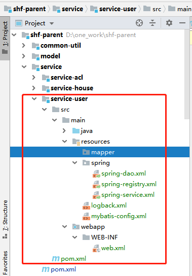

# 尚好房：前端登录、注册与关注房源

## 一、注册

### 1、搭建service-user模块

#### 1.1、搭建service-user

搭建过程与service-house一致，过程省略，如图



#### 1.2、pom.xml文件

```xml
<?xml version="1.0" encoding="UTF-8"?>
<project xmlns="http://maven.apache.org/POM/4.0.0"
         xmlns:xsi="http://www.w3.org/2001/XMLSchema-instance"
         xsi:schemaLocation="http://maven.apache.org/POM/4.0.0 http://maven.apache.org/xsd/maven-4.0.0.xsd">
    <parent>
        <artifactId>service</artifactId>
        <groupId>com.atguigu</groupId>
        <version>1.0</version>
    </parent>
    <modelVersion>4.0.0</modelVersion>

    <artifactId>service-user</artifactId>
    <packaging>war</packaging>

    <build>
        <plugins>
            <plugin>
                <groupId>org.eclipse.jetty</groupId>
                <artifactId>jetty-maven-plugin</artifactId>
                <version>9.4.15.v20190215</version>
                <configuration>
                    <!-- 如果检测到项目有更改则自动热部署，每隔n秒扫描一次。默认为0，即不扫描-->
                    <scanIntervalSeconds>10</scanIntervalSeconds>
                    <webAppConfig>
                        <!--指定web项目的根路径，默认为/ -->
                        <contextPath>/</contextPath>
                    </webAppConfig>
                    <httpConnector>
                        <!--端口号，默认 8080-->
                        <port>7003</port>
                    </httpConnector>
                </configuration>
            </plugin>
        </plugins>
    </build>
</project>
```

#### 1.3、spring-dao.xml文件

```xml
<?xml version="1.0" encoding="UTF-8"?>
<beans xmlns="http://www.springframework.org/schema/beans"
       xmlns:xsi="http://www.w3.org/2001/XMLSchema-instance"
       xmlns:spring-mybatis="http://mybatis.org/schema/mybatis-spring"
       xsi:schemaLocation="http://www.springframework.org/schema/beans
                     http://www.springframework.org/schema/beans/spring-beans.xsd
                     http://mybatis.org/schema/mybatis-spring http://mybatis.org/schema/mybatis-spring.xsd">

    <bean id="dataSource" class="com.alibaba.druid.pool.DruidDataSource" destroy-method="close">
        <property name="username" value="root" />
        <property name="password" value="root" />
        <property name="driverClassName" value="com.mysql.cj.jdbc.Driver" />
        <property name="url" value="jdbc:mysql://localhost:3306/db_house?serverTimezone=Asia/Shanghai" />
    </bean>
    <!--spring和mybatis整合的工厂bean-->
    <bean id="sqlSessionFactory" class="org.mybatis.spring.SqlSessionFactoryBean">
        <property name="dataSource" ref="dataSource" />
        <property name="typeAliasesPackage" value="com.atguigu.entity"></property>
        <property name="configLocation" value="classpath:mybatis-config.xml" />
        <property name="mapperLocations">
            <array>
                <value>classpath:mapper/*.xml</value>
            </array>
        </property>
    </bean>
    <!--批量扫描接口生成代理对象-->
    <spring-mybatis:scan base-package="com.atguigu.dao"></spring-mybatis:scan>

</beans>
```

#### 1.4、spring-registry.xml文件

```xml
<?xml version="1.0" encoding="UTF-8"?>
<beans xmlns="http://www.springframework.org/schema/beans"
       xmlns:xsi="http://www.w3.org/2001/XMLSchema-instance"
       xmlns:dubbo="http://code.alibabatech.com/schema/dubbo"
       xsi:schemaLocation="http://www.springframework.org/schema/beans
                            http://www.springframework.org/schema/beans/spring-beans.xsd
                            http://code.alibabatech.com/schema/dubbo
                            http://code.alibabatech.com/schema/dubbo/dubbo.xsd">
    <!-- 指定应用名称 -->
    <dubbo:application name="service_user"/>
    <!--指定暴露服务的端口，如果不指定默认为20880 -->
    <dubbo:protocol name="dubbo" port="20883"/>
    <!--指定服务注册中心地址-->
    <dubbo:registry address="zookeeper://127.0.0.1:2181"/>
    <!--批量扫描，发布服务-->
    <dubbo:annotation package="com.atguigu.service"/>

</beans>
```

#### 1.5、spring-service.xml文件

```xml
<?xml version="1.0" encoding="UTF-8"?>
<beans xmlns="http://www.springframework.org/schema/beans"
       xmlns:xsi="http://www.w3.org/2001/XMLSchema-instance"
       xmlns:tx="http://www.springframework.org/schema/tx"
       xmlns:context="http://www.springframework.org/schema/context"
       xsi:schemaLocation="http://www.springframework.org/schema/beans
                        http://www.springframework.org/schema/beans/spring-beans.xsd
                        http://www.springframework.org/schema/context
                        http://www.springframework.org/schema/context/spring-context.xsd
                        http://www.springframework.org/schema/tx
                        http://www.springframework.org/schema/tx/spring-tx.xsd">
    <!-- 扫描service包 -->
    <context:component-scan base-package="com.atguigu.service" ></context:component-scan>

    <!-- 事务管理器  -->
    <bean id="transactionManager" class="org.springframework.jdbc.datasource.DataSourceTransactionManager">
        <property name="dataSource" ref="dataSource"/>
    </bean>
    <!--
        开启事务控制的注解支持
        注意：此处必须加入proxy-target-class="true"，
              需要进行事务控制，会由Spring框架产生代理对象，
              Dubbo需要将Service发布为服务，要求必须使用cglib创建代理对象。
    -->
    <tx:annotation-driven transaction-manager="transactionManager" proxy-target-class="true"/>
</beans>
```

#### 1.6、logback.xml文件

```xml
<?xml version="1.0" encoding="UTF-8"?>
<configuration debug="false">

    <!--定义日志文件的存储地址 logs为当前项目的logs目录 还可以设置为../logs -->
    <property name="LOG_HOME" value="logs" />

    <!--控制台日志， 控制台输出 -->
    <appender name="STDOUT" class="ch.qos.logback.core.ConsoleAppender">
        <encoder class="ch.qos.logback.classic.encoder.PatternLayoutEncoder">
            <!--格式化输出：%d表示日期，%thread表示线程名，%-5level：级别从左显示5个字符宽度,%msg：日志消息，%n是换行符-->
            <pattern>%d{yyyy-MM-dd HH:mm:ss.SSS} [%thread] %-5level %logger{50} - %msg%n</pattern>
        </encoder>
    </appender>

    <!-- 日志输出级别 -->
    <root level="DEBUG">
        <appender-ref ref="STDOUT" />
    </root>
</configuration>
```

#### 1.7、mybatis-config.xml文件

```xml
<?xml version="1.0" encoding="UTF-8" ?>
<!DOCTYPE configuration PUBLIC "-//mybatis.org//DTD Config 3.0//EN"
        "http://mybatis.org/dtd/mybatis-3-config.dtd">
<configuration>
    <!--开启驼峰命名自动映射-->
    <settings>
        <setting name="mapUnderscoreToCamelCase" value="true"/>
    </settings>
    <plugins>
        <!-- com.github.pagehelper 为 PageHelper 类所在包名 -->
        <plugin interceptor="com.github.pagehelper.PageHelper">
            <!-- 设置数据库类型 Oracle,Mysql,MariaDB,SQLite,Hsqldb,PostgreSQL 六种数据库-->
            <property name="dialect" value="mysql"/>
        </plugin>
    </plugins>
</configuration>
```

#### 1.8、web.xml文件

```xml
<?xml version="1.0" encoding="UTF-8"?>
<web-app xmlns:xsi="http://www.w3.org/2001/XMLSchema-instance"
         xmlns="http://java.sun.com/xml/ns/javaee"
         xsi:schemaLocation="http://java.sun.com/xml/ns/javaee http://java.sun.com/xml/ns/javaee/web-app_3_0.xsd"
         id="WebApp_ID" version="3.0">

    <!-- 加载spring容器 ，没有*表示当前项目的根路径，有*表示依赖所有项目的根路径-->
    <context-param>
        <param-name>contextConfigLocation</param-name>
        <param-value>classpath:spring/spring-*.xml</param-value>
    </context-param>
    <listener>
        <listener-class>org.springframework.web.context.ContextLoaderListener</listener-class>
    </listener>
</web-app>
```


### 2、添加会员用户基础类

#### 2.1、dao层xml

UserInfoDao.xml

```xml
<?xml version="1.0" encoding="UTF-8" ?>
<!DOCTYPE mapper
        PUBLIC "-//mybatis.org//DTD Mapper 3.0//EN"
        "http://mybatis.org/dtd/mybatis-3-mapper.dtd">


<mapper namespace="com.atguigu.dao.UserInfoDao">
   
   <!-- 用于select查询公用抽取的列 -->
   <sql id="columns">
      select id,phone,password,nick_name,status,create_time,update_time,is_deleted
   </sql>

   <insert id="insert" useGeneratedKeys="true" keyProperty="id">
        insert into user_info (
           id ,
           phone ,
           password ,
           nick_name ,
           status
        ) values (
           #{id} ,
           #{phone} ,
           #{password} ,
           #{nickName} ,
           #{status}
        )
   </insert>

   <update id="update" >
        update user_info set
      <if test="phone != null and phone != ''">
         phone = #{phone} ,
      </if>
      <if test="password != null and password != ''">
         password = #{password} ,
      </if>
      <if test="nickName != null and nickName != ''">
         nick_name = #{nickName} ,
      </if>
      <if test="status != null and status != ''">
         status = #{status} ,
      </if>
      update_time =  now()
        where 
           id = #{id} 
   </update>

    <update id="delete">
        update user_info set
         update_time = now() ,
         is_deleted = 1
        where 
           id = #{id}
    </update>
    
    <select id="getById" resultType="UserInfo">
      <include refid="columns" />
          from user_info 
           where 
              id = #{id} 
   </select>

   <sql id="findPageWhere">
      <where>                    
          <if test="phone != null and phone != ''">
            and phone = #{phone}
         </if>
         and is_deleted = 0
      </where>
   </sql>
    
    <select id="findPage" resultType="UserInfo">
       <include refid="columns" />
       from user_info 
      <include refid="findPageWhere"/>
      order by id desc
    </select>

</mapper>
```

#### 2.2、dao层接口

UserInfoDao

```java
package com.atguigu.dao;

import com.atguigu.base.BaseDao;
import com.atguigu.entity.UserInfo;

public interface UserInfoDao extends BaseDao<UserInfo>{

}
```

#### 2.3、service层接口

UserInfoService

```java
package com.atguigu.service;

import com.atguigu.base.BaseService;
import com.atguigu.entity.UserInfo;

public interface UserInfoService extends BaseService<UserInfo> {

}
```

#### 2.4、service层接口实现

UserInfoServiceImpl

```java
package com.atguigu.service.impl;

import com.alibaba.dubbo.config.annotation.Service;
import com.atguigu.service.UserInfoService;
import com.atguigu.base.BaseDao;
import com.atguigu.base.BaseServiceImpl;
import com.atguigu.dao.UserInfoDao;
import com.atguigu.entity.UserInfo;
import org.springframework.beans.factory.annotation.Autowired;
import org.springframework.transaction.annotation.Transactional;

@Transactional
@Service(interfaceClass = UserInfoService.class)
public class UserInfoServiceImpl extends BaseServiceImpl<UserInfo> implements UserInfoService {

   @Autowired
   private UserInfoDao userInfoDao;

   @Override
   protected BaseDao<UserInfo> getEntityDao() {
      return userInfoDao;
   }
}
```

### 3、注册接口实现

注册我们要根据手机号码查询用户，如果存在，则不能注册

#### 3.1 根据手机号码查询用户

1、添加xml配置

UserInfoDao.xml

```xml
<select id="getByPhone" resultType="UserInfo">
   select <include refid="columns" />
   from user_info
   where
   phone = #{phone}
   and is_deleted = 0
</select>
```

2、添加dao层接口

UserInfoDao

```java
UserInfo getByPhone(String phone);
```

3、service接口及实现

UserInfoService

```java
UserInfo getByPhone(String phone);
```

UserInfoServiceImpl

```java
@Override
public UserInfo getByPhone(String phone) {
   return userInfoDao.getByPhone(phone);
}
```

#### 3.2 注册controller层

声明注册对象、提供注册方法及发送验证码方法，发送验证码我们只是模拟这个过程，不去真正发送

RegisterVo

```java
package com.atguigu.vo;


/**
 * 注册对象
 */
public class RegisterVo {

    // 昵称
    private String nickName;

    // 手机号
    private String phone;

    // 密码
    private String password;

    // 验证码
    private String code;

    ...
}
```

UserInfoController

```java
package com.atguigu.controller;

import com.alibaba.dubbo.config.annotation.Reference;
import com.atguigu.base.BaseController;
import com.atguigu.entity.UserInfo;
import com.atguigu.result.Result;
import com.atguigu.result.ResultCodeEnum;
import com.atguigu.service.UserInfoService;
import com.atguigu.util.MD5;
import com.atguigu.vo.LoginVo;
import com.atguigu.vo.RegisterVo;
import org.springframework.util.StringUtils;
import org.springframework.web.bind.annotation.*;

import javax.servlet.http.HttpServletRequest;
import java.util.HashMap;
import java.util.Map;

@RestController
@RequestMapping(value="/userInfo")
@CrossOrigin
@SuppressWarnings({"unchecked", "rawtypes"})
public class UserInfoController {

   @Reference
   private UserInfoService userInfoService;


   /**
    * 会员注册
    * @param registerVo
    * @return
    */
   @PostMapping("/register")
   public Result register(@RequestBody RegisterVo registerVo, HttpServletRequest request){
      String nickName = registerVo.getNickName();
      String phone = registerVo.getPhone();
      String password = registerVo.getPassword();
      String code = registerVo.getCode();

      //校验参数
      if(StringUtils.isEmpty(nickName) ||
            StringUtils.isEmpty(phone) ||
            StringUtils.isEmpty(password) ||
            StringUtils.isEmpty(code)) {
         return Result.build(null, ResultCodeEnum.PARAM_ERROR);
      }

      //验证码
      String currentCode = (String)request.getSession().getAttribute("CODE");
      if(!code.equals(currentCode)) {
         return Result.build(null, ResultCodeEnum.CODE_ERROR);
      }

      UserInfo userInfo = userInfoService.getByPhone(phone);
      if(null != userInfo) {
         return Result.build(null, ResultCodeEnum.PHONE_REGISTER_ERROR);
      }

      userInfo = new UserInfo();
      userInfo.setNickName(nickName);
      userInfo.setPhone(phone);
      userInfo.setPassword(MD5.encrypt(password));
      userInfo.setStatus(1);
      userInfoService.insert(userInfo);
      return Result.ok();
   }

   @GetMapping("/sendCode/{moble}")
   public Result sendCode(@PathVariable String moble, HttpServletRequest request) {
      String code = "1111";
      request.getSession().setAttribute("CODE", code);
      return Result.ok(code);
   }
   
}
```

### 4、前端页面

操作模块：web-front

#### 4.1、获取静态页面

从前端模板中获取注册页面：register.html

```html
<!DOCTYPE html PUBLIC "-//W3C//DTD XHTML 1.0 Transitional//EN"
        "http://www.w3.org/TR/xhtml1/DTD/xhtml1-transitional.dtd">
<html xmlns="http://www.w3.org/1999/xhtml">
    <head>
        <meta http-equiv="Content-Type" content="text/html; charset=utf-8"/>
        <meta name="Author" contect="http://www.webqin.net">
        <title>尚好房</title>
        <link rel="shortcut icon" href="./static/./static/images/favicon.ico"/>
        <link type="text/css" href="./static/css/css.css" rel="stylesheet"/>
        <script type="text/javascript" src="./static/js/jquery.js"></script>
        <script type="text/javascript" src="./static/js/js.js"></script>
        <script type="text/javascript">
            $(function () {
                //导航定位
                $(".nav li:eq(6)").addClass("navCur");
            })
        </script>
    </head>

    <body>
    <div id="register">
        <div class="header">
            <div class="width1190">
                <div class="fl">您好，欢迎来到尚好房！</div>
                <div class="fr">
                    <a href="login.html">登录</a> |
                    <a href="register.html">注册</a> |
                    <a href="javascript:;">加入收藏</a> |
                    <a href="javascript:;">设为首页</a>
                </div>
                <div class="clears"></div>
            </div><!--width1190/-->
        </div>
        <div class="list-nav">
            <div class="width1190">
                <div class="list"><h3>房源分类</h3></div><!--list/-->
                <ul class="nav">
                    <li><a href="index.html">首页</a></li>
                    <li><a href="about.html">关于我们</a></li>
                    <li><a href="contact.html">联系我们</a></li>
                    <div class="clears"></div>
                </ul><!--nav/-->
                <div class="clears"></div>
            </div><!--width1190/-->
        </div><!--list-nav/-->
        <div class="banner" style="background:url(./static/images/ban.jpg) center center no-repeat;"></div>

        <div class="content">
            <div class="width1190">
                <div class="reg-logo">
                    <form id="signupForm" method="post" action="" class="zcform">
                        <p class="clearfix">
                            <label class="one" for="agent">手机号码：</label>
                            <input id="agent" type="text" class="required" style="width: 200px;" maxlength="11" placeholder="请输入您的手机号码"/>
                            <input type="button" value="获取验证码" style="padding: 5px 5px;width: 100px;height: 48px;"/>
                        </p>
                        <p class="clearfix">
                            <span style="color: red;margin-left: 90px;">手机号必须输入</span>
                        </p>
                        <p class="clearfix">
                            <label class="one" for="agent">验证码：</label>
                            <input id="agent" type="text" class="required" maxlength="4" value placeholder="请输入手机验证码"/>
                        </p>
                        <p class="clearfix">
                            <span style="color: red;margin-left: 90px;"></span>
                        </p>
                        <p class="clearfix">
                            <label class="one" for="password">登录密码：</label>
                            <input id="password" type="password" maxlength="9"
                                   class="{required:true,rangelength:[8,20],}" value placeholder="请输入密码"/>
                        </p>
                        <p class="clearfix">
                            <span style="color: red;margin-left: 90px;"></span>
                        </p>
                        <p class="clearfix">
                            <label class="one" for="confirm_password">确认密码：</label>
                            <input id="confirm_password"  type="password" maxlength="9"
                                   class="{required:true,equalTo:'#password'}" value placeholder="请再次输入密码"/>
                        </p>
                        <p class="clearfix">
                            <span style="color: red;margin-left: 90px;"></span>
                        </p>
                        <p class="clearfix">
                            <label class="one" for="agent">昵称：</label>
                            <input id="agent" type="text" maxlength="10" class="required" value placeholder="请输入您的昵称"/>
                        </p>
                        <p class="clearfix">
                            <span style="color: red;margin-left: 90px;"></span>
                        </p>
                        <!--<p class="clearfix agreement">
                            <input type="checkbox" />
                            <b class="left">已阅读并同意<a href="#">《用户协议》</a></b>
                        </p>-->
                        <p class="clearfix"><input class="submit" type="button" value="立即注册"/></p>
                    </form>
                    <div class="reg-logo-right">
                        <h3>如果您已有账号，请</h3>
                        <a href="login.html" class="logo-a">立即登录</a>
                    </div><!--reg-logo-right/-->
                    <div class="clears"></div>
                </div><!--reg-logo/-->
            </div><!--width1190/-->
        </div><!--content/-->

        <div class="footer">
            <div class="width1190">
                <div class="fl"><a href="index.html"><strong>尚好房</strong></a><a href="about.html">关于我们</a><a
                        href="contact.html">联系我们</a><a href="follow.html">个人中心</a></div>
                <div class="fr">
                    <dl>
                        <dt></dt>
                        <dd>微信扫一扫<br/>房价点评，精彩发布</dd>
                    </dl>
                    <dl>
                        <dt></dt>
                        <dd>微信扫一扫<br/>房价点评，精彩发布</dd>
                    </dl>
                    <div class="clears"></div>
                </div>
                <div class="clears"></div>
            </div><!--width1190/-->
        </div><!--footer/-->
        <div class="copy">Copyright@ 2020 尚好房 版权所有 沪ICP备1234567号-0&nbsp;&nbsp;&nbsp;&nbsp;技术支持：XXX</div>
        <div class="bg100"></div>
    </div>
    <script>

    </script>
    </body>
</html>
```

#### 4.2、页面实现

页面实现过程简单，省略

重点注意：倒计时与校验

```html
<!DOCTYPE html PUBLIC "-//W3C//DTD XHTML 1.0 Transitional//EN"
        "http://www.w3.org/TR/xhtml1/DTD/xhtml1-transitional.dtd">
<html xmlns="http://www.w3.org/1999/xhtml">
    <head>
        <meta http-equiv="Content-Type" content="text/html; charset=utf-8"/>
        <meta name="Author" contect="http://www.webqin.net">
        <title>尚好房</title>
        <link rel="shortcut icon" href="/static//static/images/favicon.ico"/>
        <link type="text/css" href="/static/css/css.css" rel="stylesheet"/>
        <script type="text/javascript" src="/static/js/jquery.js"></script>
        <script type="text/javascript" src="/static/js/js.js"></script>
        <script src="/static/js/vue.js"></script>
        <script src="/static/js/axios.js"></script>
        <script type="text/javascript">
            $(function () {
                //导航定位
                $(".nav li:eq(6)").addClass("navCur");
            })
        </script>
    </head>

    <body>
    <div id="register">
        <div class="header">
            <div class="width1190">
                <div class="fl">您好，欢迎来到尚好房！</div>
                <div class="fr">
                    <a href="login.html">登录</a> |
                    <a href="register.html">注册</a> |
                    <a href="javascript:;">加入收藏</a> |
                    <a href="javascript:;">设为首页</a>
                </div>
                <div class="clears"></div>
            </div><!--width1190/-->
        </div>
        <div class="list-nav">
            <div class="width1190">
                <div class="list"><h3>房源分类</h3></div><!--list/-->
                <ul class="nav">
                    <li><a href="index.html">首页</a></li>
                    <li><a href="about.html">关于我们</a></li>
                    <li><a href="contact.html">联系我们</a></li>
                    <div class="clears"></div>
                </ul><!--nav/-->
                <div class="clears"></div>
            </div><!--width1190/-->
        </div><!--list-nav/-->
        <div class="banner" style="background:url(/static/images/ban.jpg) center center no-repeat;"></div>

        <div class="content">
            <div class="width1190">
                <div class="reg-logo">
                    <form id="signupForm" method="post" action="" class="zcform">
                        <p class="clearfix">
                            <label class="one" for="agent">手机号码：</label>
                            <input id="agent" v-model="registerVo.phone" type="text" class="required" style="width: 200px;" maxlength="11" placeholder="请输入您的手机号码"/>
                            <input type="button" :value="codeTest" @click="getCodeFun()" style="padding: 5px 5px;width: 100px;height: 48px;"/>
                        </p>
                        <p class="clearfix">
                            <span style="color: red;margin-left: 90px;">{{valid.phone}}</span>
                        </p>
                        <p class="clearfix">
                            <label class="one" for="agent">验证码：</label>
                            <input id="agent" v-model="registerVo.code" type="text" class="required" maxlength="4" value placeholder="请输入手机验证码"/>
                        </p>
                        <p class="clearfix">
                            <span style="color: red;margin-left: 90px;">{{valid.code}}</span>
                        </p>
                        <p class="clearfix">
                            <label class="one" for="password">登录密码：</label>
                            <input id="password" v-model="registerVo.password" type="password" maxlength="9"
                                   class="{required:true,rangelength:[8,20],}" value placeholder="请输入密码"/>
                        </p>
                        <p class="clearfix">
                            <span style="color: red;margin-left: 90px;">{{valid.password}}</span>
                        </p>
                        <p class="clearfix">
                            <label class="one" for="confirm_password">确认密码：</label>
                            <input id="confirm_password" v-model="registerVo.confirmPassword"  type="password" maxlength="9"
                                   class="{required:true,equalTo:'#password'}" value placeholder="请再次输入密码"/>
                        </p>
                        <p class="clearfix">
                            <span style="color: red;margin-left: 90px;">{{valid.confirmPassword}}</span>
                        </p>
                        <p class="clearfix">
                            <label class="one" for="agent">昵称：</label>
                            <input id="agent" v-model="registerVo.nickName" type="text" maxlength="10" class="required" value placeholder="请输入您的昵称"/>
                        </p>
                        <p class="clearfix">
                            <span style="color: red;margin-left: 90px;">{{valid.nickName}}</span>
                        </p>
                        <!--<p class="clearfix agreement">
                            <input type="checkbox" />
                            <b class="left">已阅读并同意<a href="#">《用户协议》</a></b>
                        </p>-->
                        <p class="clearfix"><input class="submit" type="button" @click="submitRegister" value="立即注册"/></p>
                    </form>
                    <div class="reg-logo-right">
                        <h3>如果您已有账号，请</h3>
                        <a href="login.html" class="logo-a">立即登录</a>
                    </div><!--reg-logo-right/-->
                    <div class="clears"></div>
                </div><!--reg-logo/-->
            </div><!--width1190/-->
        </div><!--content/-->

        <div class="footer">
            <div class="width1190">
                <div class="fl"><a href="index.html"><strong>尚好房</strong></a><a href="about.html">关于我们</a><a
                        href="contact.html">联系我们</a><a href="follow.html">个人中心</a></div>
                <div class="fr">
                    <dl>
                        <dt></dt>
                        <dd>微信扫一扫<br/>房价点评，精彩发布</dd>
                    </dl>
                    <dl>
                        <dt></dt>
                        <dd>微信扫一扫<br/>房价点评，精彩发布</dd>
                    </dl>
                    <div class="clears"></div>
                </div>
                <div class="clears"></div>
            </div><!--width1190/-->
        </div><!--footer/-->
        <div class="copy">Copyright@ 2020 尚好房 版权所有 沪ICP备1234567号-0&nbsp;&nbsp;&nbsp;&nbsp;技术支持：XXX</div>
        <div class="bg100"></div>
    </div>
    <script>
        var app =new Vue({
            el: '#register',

            data: {
                registerVo: {
                    phone: '',
                    password: '',
                    confirmPassword: '',
                    nickName: '',
                    code: ''
                },

                valid: {
                    phone: '',
                    password: '',
                    confirmPassword: '',
                    nickName: '',
                    code: ''
                },

                sending: true,      //是否发送验证码
                second: 60,        //倒计时间
                codeTest: '获取验证码'
            },

            mounted () {
            },

            methods: {
                submitRegister() {
                    var isValid = true
                    if(!(/^1[34578]\d{9}$/.test(this.registerVo.phone))) {
                        this.valid.phone = '手机号码不正确'
                        isValid = false
                    }
                    if(this.registerVo.code == '') {
                        this.valid.code = '验证码必须输入';
                        isValid = false
                    }
                    if(this.registerVo.password == '') {
                        this.valid.password = '密码必须输入';
                        isValid = false
                    }
                    if(this.registerVo.password != this.registerVo.confirmPassword) {
                        this.valid.confirmPassword = '密码不一致';
                        isValid = false
                    }
                    if(this.registerVo.nickName == '') {
                        this.valid.nickName = '昵称必须输入';
                        isValid = false
                    }
                    if(!isValid) {
                        return
                    }
                    var that = this
                    axios.post('/userInfo/register', this.registerVo).then(function (response) {
                       if(response.data.code == 200){
                        window.location.href = 'login.html'
                    }else{
                        alert(response.data.message);
                    }
                    });

                },

                getCodeFun() {
                    if (!this.sending)
                        return;

                    if (!(/^1[34578]\d{9}$/.test(this.registerVo.phone))) {
                        alert('手机号码不正确');
                        return;
                    }

                    var that = this
                    axios.get('/userInfo/sendCode/'+this.registerVo.phone).then(function (response) {
                        that.sending = false;
                        that.registerVo.code = response.data.data
                        that.timeDown();
                    });
                },

                timeDown() {
                    let result = setInterval(() => {
                        --this.second;
                        this.codeTest = this.second
                        if (this.second < 1) {
                            clearInterval(result);
                            this.sending = true;
                            this.second = 60;
                            this.codeTest = "获取验证码"
                        }
                    }, 1000);
                }
            }
        })
    </script>
    </body>
</html>
```

## 二、登录

登录成功调整首页

### 1、登录controller层

LoginVo

```java
package com.atguigu.vo;


/**
 * 登录对象
 */
public class LoginVo {

    /**
     * 手机号
     */
    private String phone;

    /**
     * 密码
     */
    private String password;

    ...
}
```

UserInfoController添加方法

```java
/**
 * 会员登录
 * @param loginVo
 * @param request
 * @return
 */
@PostMapping("login")
public Result login(@RequestBody LoginVo loginVo, HttpServletRequest request) {
   String phone = loginVo.getPhone();
   String password = loginVo.getPassword();

   //校验参数
   if(StringUtils.isEmpty(phone) ||
         StringUtils.isEmpty(password)) {
      return Result.build(null, ResultCodeEnum.PARAM_ERROR);
   }

   UserInfo userInfo = userInfoService.getByPhone(phone);
   if(null == userInfo) {
      return Result.build(null, ResultCodeEnum.ACCOUNT_ERROR);
   }

   //校验密码
   if(!MD5.encrypt(password).equals(userInfo.getPassword())) {
      return Result.build(null, ResultCodeEnum.PASSWORD_ERROR);
   }

   //校验是否被禁用
   if(userInfo.getStatus() == 0) {
      return Result.build(null, ResultCodeEnum.ACCOUNT_LOCK_ERROR);
   }
   request.getSession().setAttribute("USER", userInfo);

   Map<String, Object> map = new HashMap<>();
   map.put("phone", userInfo.getPhone());
   map.put("nickName", userInfo.getNickName());
   return Result.ok(map);
}
```

### 2、前端页面

#### 2.1、获取静态页面

从前端模板中获取登录页面：login.html

```html
<!DOCTYPE html PUBLIC "-//W3C//DTD XHTML 1.0 Transitional//EN"
        "http://www.w3.org/TR/xhtml1/DTD/xhtml1-transitional.dtd">
<html xmlns="http://www.w3.org/1999/xhtml">
    <head>
        <meta http-equiv="Content-Type" content="text/html; charset=utf-8"/>
        <meta name="Author" contect="http://www.webqin.net">
        <title>尚好房</title>
        <link rel="shortcut icon" href="/static/images/favicon.ico"/>
        <link type="text/css" href="/static/css/css.css" rel="stylesheet"/>
        <script type="text/javascript" src="/static/js/jquery.js"></script>
        <script type="text/javascript" src="/static/js/js.js"></script>
        <script src="/static/js/vue.js"></script>
        <script type="text/javascript">
            $(function () {
                //导航定位
                $(".nav li:eq(6)").addClass("navCur");
            })
        </script>
    </head>

    <body>
    <div id="login">
        <div class="header">
            <div class="width1190">
                <div class="fl">您好，欢迎来到尚好房！</div>
                <div class="fr">
                    <a href="login.html">登录</a> |
                    <a href="register.html">注册</a> |
                    <a href="javascript:;">加入收藏</a> |
                    <a href="javascript:;">设为首页</a>
                </div>
                <div class="clears"></div>
            </div><!--width1190/-->
        </div>
        <div class="list-nav">
            <div class="width1190">
                <div class="list"><h3>房源分类</h3></div><!--list/-->
                <ul class="nav">
                    <li><a href="index.html">首页</a></li>
                    <li><a href="about.html">关于我们</a></li>
                    <li><a href="contact.html">联系我们</a></li>
                    <div class="clears"></div>
                </ul><!--nav/-->
                <div class="clears"></div>
            </div><!--width1190/-->
        </div><!--list-nav/-->
        <div class="banner" style="background:url(/static/images/ban.jpg) center center no-repeat;"></div>

        <div class="content">
            <div class="width1190">
                <div class="reg-logo">
                    <form id="signupForm" method="post" action="follow.html" class="zcform">
                        <p class="clearfix">
                            <label class="one" for="agent">手机号码：</label>
                            <input id="agent" type="text" class="required" value placeholder="请输入您的用户名"/>
                        </p>
                        <p class="clearfix">
                            <span style="color: red;margin-left: 90px;">手机号码必须输入</span>
                        </p>
                        <p class="clearfix">
                            <label class="one" for="password">登录密码：</label>
                            <input id="password" type="password"
                                   class="{required:true,rangelength:[8,20],}" value placeholder="请输入密码"/>
                        </p>
                        <p class="clearfix">
                            <span style="color: red;margin-left: 90px;"></span>
                        </p>
                        <!--<p class="clearfix agreement">
                            <input type="checkbox" />
                            <b class="left">已阅读并同意<a href="#">《用户协议》</a></b>
                        </p>-->
                        <p class="clearfix"><input class="submit" type="button" value="立即登录"/></p>
                    </form>
                    <div class="reg-logo-right">
                        <h3>如果您没有账号，请</h3>
                        <a href="register.html" class="logo-a">立即注册</a>
                    </div><!--reg-logo-right/-->
                    <div class="clears"></div>
                </div><!--reg-logo/-->
            </div><!--width1190/-->
        </div><!--content/-->

        <div class="footer">
            <div class="width1190">
                <div class="fl"><a href="index.html"><strong>尚好房</strong></a><a href="about.html">关于我们</a><a
                        href="contact.html">联系我们</a><a href="follow.html">个人中心</a></div>
                <div class="fr">
                    <dl>
                        <dt></dt>
                        <dd>微信扫一扫<br/>房价点评，精彩发布</dd>
                    </dl>
                    <dl>
                        <dt></dt>
                        <dd>微信扫一扫<br/>房价点评，精彩发布</dd>
                    </dl>
                    <div class="clears"></div>
                </div>
                <div class="clears"></div>
            </div><!--width1190/-->
        </div><!--footer/-->
        <div class="copy">Copyright@ 2020 尚好房 版权所有 沪ICP备1234567号-0&nbsp;&nbsp;&nbsp;&nbsp;技术支持：XXX</div>
        <div class="bg100"></div>
    </div>
    <script>

    </script>
    </body>
</html>
```

#### 2.2、页面实现

登录成功，用户信息保存到本地存储：

window.localStorage.setItem("userInfo", JSON.stringify(response.data.data))

完整代码：

```html
<!DOCTYPE html PUBLIC "-//W3C//DTD XHTML 1.0 Transitional//EN"
        "http://www.w3.org/TR/xhtml1/DTD/xhtml1-transitional.dtd">
<html xmlns="http://www.w3.org/1999/xhtml">
    <head>
        <meta http-equiv="Content-Type" content="text/html; charset=utf-8"/>
        <meta name="Author" contect="http://www.webqin.net">
        <title>尚好房</title>
        <link rel="shortcut icon" href="/static/images/favicon.ico"/>
        <link type="text/css" href="/static/css/css.css" rel="stylesheet"/>
        <script type="text/javascript" src="/static/js/jquery.js"></script>
        <script type="text/javascript" src="/static/js/js.js"></script>
        <script src="/static/js/vue.js"></script>
        <script src="/static/js/axios.js"></script>
        <script src="/static/js/util.js"></script>
        <script type="text/javascript">
            $(function () {
                //导航定位
                $(".nav li:eq(6)").addClass("navCur");
            })
        </script>
    </head>

    <body>
    <div id="login">
        <div class="header">
            <div class="width1190">
                <div class="fl">您好，欢迎来到尚好房！</div>
                <div class="fr">
                    <a href="login.html">登录</a> |
                    <a href="register.html">注册</a> |
                    <a href="javascript:;">加入收藏</a> |
                    <a href="javascript:;">设为首页</a>
                </div>
                <div class="clears"></div>
            </div><!--width1190/-->
        </div>
        <div class="list-nav">
            <div class="width1190">
                <div class="list"><h3>房源分类</h3></div><!--list/-->
                <ul class="nav">
                    <li><a href="index.html">首页</a></li>
                    <li><a href="about.html">关于我们</a></li>
                    <li><a href="contact.html">联系我们</a></li>
                    <div class="clears"></div>
                </ul><!--nav/-->
                <div class="clears"></div>
            </div><!--width1190/-->
        </div><!--list-nav/-->
        <div class="banner" style="background:url(/static/images/ban.jpg) center center no-repeat;"></div>

        <div class="content">
            <div class="width1190">
                <div class="reg-logo">
                    <form id="signupForm" method="post" action="follow.html" class="zcform">
                        <p class="clearfix">
                            <label class="one" for="agent">用户名：</label>
                            <input id="agent" v-model="loginVo.phone" type="text" class="required" value placeholder="请输入您的用户名"/>
                        </p>
                        <p class="clearfix">
                            <span style="color: red;margin-left: 90px;">{{valid.phone}}</span>
                        </p>
                        <p class="clearfix">
                            <label class="one" for="password">登录密码：</label>
                            <input id="password" v-model="loginVo.password" type="password"
                                   class="{required:true,rangelength:[8,20],}" value placeholder="请输入密码"/>
                        </p>
                        <p class="clearfix">
                            <span style="color: red;margin-left: 90px;">{{valid.password}}</span>
                        </p>
                        <!--<p class="clearfix agreement">
                            <input type="checkbox" />
                            <b class="left">已阅读并同意<a href="#">《用户协议》</a></b>
                        </p>-->
                        <p class="clearfix"><input class="submit" type="button" @click="submitLogin()" value="立即登录"/></p>
                    </form>
                    <div class="reg-logo-right">
                        <h3>如果您没有账号，请</h3>
                        <a href="register.html" class="logo-a">立即注册</a>
                    </div><!--reg-logo-right/-->
                    <div class="clears"></div>
                </div><!--reg-logo/-->
            </div><!--width1190/-->
        </div><!--content/-->

        <div class="footer">
            <div class="width1190">
                <div class="fl"><a href="index.html"><strong>尚好房</strong></a><a href="about.html">关于我们</a><a
                        href="contact.html">联系我们</a><a href="follow.html">个人中心</a></div>
                <div class="fr">
                    <dl>
                        <dt></dt>
                        <dd>微信扫一扫<br/>房价点评，精彩发布</dd>
                    </dl>
                    <dl>
                        <dt></dt>
                        <dd>微信扫一扫<br/>房价点评，精彩发布</dd>
                    </dl>
                    <div class="clears"></div>
                </div>
                <div class="clears"></div>
            </div><!--width1190/-->
        </div><!--footer/-->
        <div class="copy">Copyright@ 2020 尚好房 版权所有 沪ICP备1234567号-0&nbsp;&nbsp;&nbsp;&nbsp;技术支持：XXX</div>
        <div class="bg100"></div>
    </div>
    <script>
        var app =new Vue({
            el: '#login',

            data: {
                loginVo: {
                    phone: '15099999999',
                    password: '111111'
                },
                valid: {
                    phone: '',
                    password: ''
                },
            },

            mounted () {
                debugger
                //this.init()
            },

            methods: {
                submitLogin() {
                    var isValid = true
                    if(this.loginVo.phone == '') {
                        this.valid.password = '用户名必须输入';
                        isValid = false
                    }
                    if(this.loginVo.password == '') {
                        this.valid.password = '密码必须输入';
                        isValid = false
                    }
                    if(!isValid) {
                        return
                    }
                    var that = this
                    axios.post('/userInfo/login', this.loginVo).then(function (response) {
                        if(response.data.code == 200){
                        window.localStorage.setItem("userInfo", JSON.stringify(response.data.data))

                        //原页面，哪个页面跳转过来的
                        var originUrl = util.getOriginUrl()
                        if(originUrl != '') {
                            window.location.href = originUrl
                        } else {
                            window.location.href = "index.html"
                        }
                    }else{
                        alert(response.data.message);
                    }
                    });
                }
            }
        })
    </script>
    </body>
</html>
```

### 3、页面头部处理

登录成功后首页、房源详情页等头部信息要显示登录信息与退出登录

#### 3.1、退出登录接口

在UserInfoController类添加方法

```java
@GetMapping("/logout")
public Result logout(HttpServletRequest request) {
   request.getSession().removeAttribute("USER");
   return Result.ok();
}
```

#### 3.2、首页处理

index.html

1、js处理

```javascript
data: {
    ...
    
    userInfo: {
        nickName: ''
    }
},

created () {
    ...

    this.login()
},

methods: {
    login() {
        let userInfoString = window.localStorage.getItem("userInfo")
        if(userInfoString != null && userInfoString != '') {
            this.userInfo = JSON.parse(userInfoString)
        }
    },

    logout() {
        axios.get('/userInfo/logout').then(function (response) {
            window.localStorage.setItem("userInfo", '')
            window.location.href = 'index.html'
        });
    }
}
```

2、页面处理

```html
<div class="header">
    <div class="width1190">
        <div class="fl">您好，欢迎来到尚好房！</div>
        <div class="fr" v-if="userInfo.nickName == ''">
            <a href="login.html">登录</a> |
            <a href="register.html">注册</a> |
            <a href="javascript:;">加入收藏</a> |
            <a href="javascript:;">设为首页</a>
        </div>
        <div class="fr" v-else>
            <a href="javascript:;">欢迎 {{ userInfo.nickName }}</a> |
            <a href="javascript:;" @click="logout">退出</a> |
            <a href="follow.html">我的关注</a> |
            <a href="javascript:;">加入收藏</a> |
            <a href="javascript:;">设为首页</a>
        </div>
        <div class="clears"></div>
    </div><!--width1190/-->
</div>
```

3、首页完整代码

```html
<!DOCTYPE html>
<html>
<head>
    <meta http-equiv="Content-Type" content="text/html; charset=utf-8"/>
    <meta name="Author" contect="http://www.webqin.net">
    <title>尚好房</title>
    <link rel="shortcut icon" href="./static/images/favicon.ico"/>
    <link type="text/css" href="./static/css/css.css" rel="stylesheet"/>
    <script type="text/javascript" src="./static/js/jquery.js"></script>
    <script type="text/javascript" src="./static/js/js.js"></script>
    <script src="./static/js/vue.js"></script>
    <script src="./static/js/axios.js"></script>
    <script type="text/javascript">
        $(function () {
            //导航定位
            $(".nav li:eq(1)").addClass("navCur");
        })
    </script>
</head>

<body>
<div id="list">
    <div class="header">
        <div class="width1190">
            <div class="fl">您好，欢迎来到尚好房！</div>
            <div class="fr" v-if="userInfo.nickName == ''">
                <a href="login.html">登录</a> |
                <a href="register.html">注册</a> |
                <a href="javascript:;">加入收藏</a> |
                <a href="javascript:;">设为首页</a>
            </div>
            <div class="fr" v-else>
                <a href="javascript:;">欢迎 {{ userInfo.nickName }}</a> |
                <a href="javascript:;" @click="logout">退出</a> |
                <a href="follow.html">我的关注</a> |
                <a href="javascript:;">加入收藏</a> |
                <a href="javascript:;">设为首页</a>
            </div>
            <div class="clears"></div>
        </div><!--width1190/-->
    </div>
    <div class="list-nav">
        <div class="width1190">
            <div class="list"><h3>房源分类</h3></div><!--list/-->
            <ul class="nav">
                <li><a href="index.html">首页</a></li>
                <li><a href="about.html">关于我们</a></li>
                <li><a href="contact.html">联系我们</a></li>
                <div class="clears"></div>
            </ul><!--nav/-->
            <div class="clears"></div>
        </div><!--width1190/-->
    </div><!--list-nav/-->
    <div class="banner" style="background:url(./static/images/ban.jpg) center center no-repeat;"></div>

        <div class="content">
            <div class="width1190">
                <form action="#" method="get" class="pro-search">
                    <table>
                        <tr>
                            <th>房源区域：</th>
                            <td>
                                <div style="line-height: 30px;">
                                    <a href="javascript:;" @click="searchArea('')" :class="houseQueryVo.areaId=='' ? 'pro-cur' : ''">不限</a>
                                    <a href="javascript:;" @click="searchArea(item.id)" :class="item.id==houseQueryVo.areaId ? 'pro-cur' : ''" v-for="item in areaList" :key="item.id">{{ item.name }}</a>
                                </div>
                                <!--新增区域-->
                                <div style="font-size: 12px;border-top:#ccc 1px dotted;">
                                    <a href="javascript:;" @click="searchPlate(item.id)" :class="item.id==houseQueryVo.plateId ? 'pro-cur' : ''" v-for="item in plateList" :key="item.id">{{ item.name }}</a>
                                </div>
                            </td>
                        </tr>
                        <tr>
                            <th>户型：</th>
                            <td>
                                <a href="javascript:;" @click="searchHouseType('')" :class="houseQueryVo.houseTypeId=='' ? 'pro-cur' : ''">不限</a>
                                <a href="javascript:;" @click="searchHouseType(item.id)" :class="item.id==houseQueryVo.houseTypeId ? 'pro-cur' : ''" v-for="item in houseTypeList" :key="item.id">{{ item.name }}</a>
                            </td>
                        </tr>
                        <tr>
                            <th>楼层：</th>
                            <td>
                                <a href="javascript:;" @click="searchFloor('')" :class="houseQueryVo.floorId=='' ? 'pro-cur' : ''">不限</a>
                                <a href="javascript:;" @click="searchFloor(item.id)" :class="item.id==houseQueryVo.floorId ? 'pro-cur' : ''" v-for="item in floorList" :key="item.id">{{ item.name }}</a>
                            </td>
                        </tr>
                        <tr>
                            <th>建筑结构：</th>
                            <td>
                                <a href="javascript:;" :class="houseQueryVo.buildStructureId=='' ? 'pro-cur' : ''">不限</a>
                                <a href="javascript:;" @click="searchBuildStructure(item.id)" :class="item.id==houseQueryVo.buildStructureId ? 'pro-cur' : ''" v-for="item in buildStructureList" :key="item.id">{{ item.name }}</a>
                            </td>
                        </tr>
                        <tr>
                            <th>朝向：</th>
                            <td>
                                <a href="javascript:;" @click="searchDirection('')" :class="houseQueryVo.directionId=='' ? 'pro-cur' : ''">不限</a>
                                <a href="javascript:;" @click="searchDirection(item.id)" :class="item.id==houseQueryVo.directionId ? 'pro-cur' : ''" v-for="item in directionList" :key="item.id">{{ item.name }}</a>
                            </td>
                        </tr>
                        <tr>
                            <th>装修情况：</th>
                            <td>
                                <a href="javascript:;" @click="searchDecoration('')" :class="houseQueryVo.decorationId=='' ? 'pro-cur' : ''">不限</a>
                                <a href="javascript:;" @click="searchDecoration(item.id)" :class="item.id==houseQueryVo.decorationId ? 'pro-cur' : ''" v-for="item in decorationList" :key="item.id">{{ item.name }}</a>
                            </td>
                        </tr>
                        <tr>
                            <th>房屋用途：</th>
                            <td>
                                <a href="javascript:;" @click="searchHouseUse('')" :class="houseQueryVo.houseUseId=='' ? 'pro-cur' : ''">不限</a>
                                <a href="javascript:;" @click="searchHouseUse(item.id)" :class="item.id==houseQueryVo.houseUseId ? 'pro-cur' : ''" v-for="item in houseUseList" :key="item.id">{{ item.name }}</a>
                            </td>
                        </tr>
                    </table>
                    <div class="paixu">
                        <strong>排序：</strong>
                        <a href="javascript:;" @click="sortDefault()" :class="houseQueryVo.defaultSort=='1' ? 'pai-cur' : ''">默认</a>
                        <a href="javascript:;" @click="sortPrice()" :class="houseQueryVo.priceSort=='1' ? 'pai-cur' : ''">价格 &or;</a>
                        <a href="javascript:;" @click="sortTime()" :class="houseQueryVo.timeSort=='1' ? 'pai-cur' : ''">最新 &or;</a>
                    </div>
                </form><!--pro-search/-->
            </div><!--width1190/-->
            <div class="width1190">
                <div class="pro-left">
                    <dl v-for="item in page.list" :key="item.id" >
                        <dt><a :href="'info.html?id='+item.id"></a></dt>
                        <dd>
                            <h3><a :href="'info.html?id='+item.id">{{ item.name }}</a></h3>
                            <div class="pro-wei">
                                 <strong class="red">{{ item.communityName }}</strong>
                            </div>
                            <div class="pro-fang">{{ item.buildArea }}平 {{ item.houseTypeName}} {{ item.floorName}} {{ item.directionName}}</div>
                            <div class="pra-fa"> 发布时间：{{ item.createTimeString }}</div>
                        </dd>
                        <div class="price">¥ <strong>{{ item.totalPrice }}</strong><span class="font12">万元</span></div>
                        <div class="clears"></div>
                    </dl>
                </div><!--pro-left/-->
                <div class="pro-right">
                    <h2 class="right-title">新上房源</h2>
                    <div class="right-pro">
                        <dl>
                            <dt><a href="proinfo.html"></a></dt>
                            <dd>
                                <h3><a href="proinfo.html">中装一室一厅，楼层好，采光足，稀缺房源</a></h3>
                                <div class="pro-fang">一室一厅 38平 南</div>
                                <div class="right-price">90万元</div>
                            </dd>
                        </dl>
                        <dl>
                            <dt><a href="proinfo.html"></a></dt>
                            <dd>
                                <h3><a href="proinfo.html">中装两室，楼层好，采光足，稀缺房源</a></h3>
                                <div class="pro-fang">两室一厅 78平 南</div>
                                <div class="right-price">130万元</div>
                            </dd>
                        </dl>
                        <dl>
                            <dt><a href="proinfo.html"></a></dt>
                            <dd>
                                <h3><a href="proinfo.html">中装三室，楼层好，采光足，稀缺房源</a></h3>
                                <div class="pro-fang">三室一厅 98平 南</div>
                                <div class="right-price">190万元</div>
                            </dd>
                        </dl>
                    </div><!--right-pro/-->
                </div><!--pro-right/-->
                <div class="clears"></div>
                <ul class="pages">
                    <li>
                        <a href="javascript:;" @click="fetchData(page.prePage)" v-if="page.hasPreviousPage">上一页</a>
                    </li>
                    <li v-for="item in page.navigatepageNums" :class="item==page.pageNum ? 'page_active' : ''">
                        <a href="javascript:;" @click="fetchData(item)">{{ item }}</a>
                    </li>
                    <li>
                        <a href="javascript:;" @click="fetchData(page.nextPage)" v-if="page.hasNextPage">下一页</a>
                    </li>
                </ul>
            </div><!--width1190/-->
        </div><!--content/-->

    <div class="footer">
        <div class="width1190">
            <div class="fl"><a href="index.html"><strong>尚好房</strong></a><a href="about.html">关于我们</a><a
                    href="contact.html">联系我们</a><a href="follow.html">个人中心</a></div>
            <div class="fr">
                <dl>
                    <dt></dt>
                    <dd>微信扫一扫<br/>房价点评，精彩发布</dd>
                </dl>
                <dl>
                    <dt></dt>
                    <dd>微信扫一扫<br/>房价点评，精彩发布</dd>
                </dl>
                <div class="clears"></div>
            </div>
            <div class="clears"></div>
        </div><!--width1190/-->
    </div><!--footer/-->
    <div class="copy">Copyright@ 2020 尚好房 版权所有 沪ICP备1234567号-0&nbsp;&nbsp;&nbsp;&nbsp;技术支持：XXX</div>
    <div class="bg100"></div>
</div>
<script>
new Vue({
    el: '#list',

    data: {
        areaList: [],
        plateList: [],
        houseTypeList: [],
        floorList: [],
        buildStructureList: [],
        directionList: [],
        decorationList: [],
        houseUseList: [],

        //接口返回的分页数据，在此声明
        page: {
            list: [],
            pageNum: 1,
            pageSize: 2,
            pages: 1,
            navigatepageNums: [1,2,3,4],
            prePage: 0,
            nextPage: 0,
            hasPreviousPage: false,
            hasNextPage: false
        },

        houseQueryVo: {
            areaId: '',
            plateId: '',
            houseTypeId: '',
            floorId: '',
            buildStructureId: '',
            directionId: '',
            decorationId: '',
            houseUseId: '',

            defaultSort: 1,
            priceSort: null,
            timeSort: null,

        },

        userInfo: {
            nickName: ''
        }
    },

    created () {
        this.fetchDictData()
        this.fetchData(1)

        this.login()
    },

    methods: {
        login() {
            let userInfoString = window.localStorage.getItem("userInfo")
            if(userInfoString != null && userInfoString != '') {
                this.userInfo = JSON.parse(userInfoString)
            }
        },

        logout() {
            axios.get('/userInfo/logout').then(function (response) {
                window.localStorage.setItem("userInfo", '')
                window.location.href = 'index.html'
            });
        },

        fetchDictData() {
            //axios在then的内部不能使用Vue的实例化的this, 因为在内部 this 没有被绑定
            var that = this
            axios.get('/dict/findListByDictCode/beijing').then(function (response) {
                that.areaList = response.data.data
            });
            axios.get('/dict/findListByDictCode/houseType').then(function (response) {
                that.houseTypeList = response.data.data
            });
            axios.get('/dict/findListByDictCode/floor').then(function (response) {
                that.floorList = response.data.data
            });
            axios.get('/dict/findListByDictCode/buildStructure').then(function (response) {
                that.buildStructureList = response.data.data
            });
            axios.get('/dict/findListByDictCode/direction').then(function (response) {
                that.directionList = response.data.data
            });
            axios.get('/dict/findListByDictCode/decoration').then(function (response) {
                that.decorationList = response.data.data
            });
            axios.get('/dict/findListByDictCode/houseUse').then(function (response) {
                that.houseUseList = response.data.data
            });
        },

        fetchData(pageNum = 1) {
            this.page.pageNum = pageNum
            debugger
            if(pageNum < 1) pageNum = 1

            var that = this
            axios.post('/house/list/'+pageNum+'/'+this.page.pageSize, this.houseQueryVo).then(function (response) {
                that.page = response.data.data
            });
        },

        searchArea(id) {
            this.houseQueryVo.areaId = id
            this.houseQueryVo.plateId = ''
            this.fetchData(1)

            if(id == '') {
                this.plateList = []
                return
            }
            var that = this
            axios.get('/dict/findListByParentId/'+id).then(function (response) {
                that.plateList = response.data.data
            });
        },
        searchPlate(id) {
            this.houseQueryVo.plateId = id
            this.fetchData(1)
        },
        searchHouseType(id) {
            this.houseQueryVo.houseTypeId = id
            this.fetchData(1)
        },
        searchFloor(id) {
            this.houseQueryVo.floorId = id
            this.fetchData(1)
        },
        searchBuildStructure(id) {
            this.houseQueryVo.buildStructureId = id
            this.fetchData(1)
        },
        searchDirection(id) {
            this.houseQueryVo.directionId = id
            this.fetchData(1)
        },
        searchDecoration(id) {
            this.houseQueryVo.decorationId = id
            this.fetchData(1)
        },
        searchHouseUse(id) {
            this.houseQueryVo.houseUseId = id
            this.fetchData(1)
        },

        sortDefault() {
            this.houseQueryVo.defaultSort = 1
            this.houseQueryVo.priceSort = null
            this.houseQueryVo.timeSort = null
            this.fetchData(1)
        },
        sortPrice() {
            this.houseQueryVo.defaultSort = null
            this.houseQueryVo.priceSort = 1
            this.houseQueryVo.timeSort = null
            this.fetchData(1)
        },
        sortTime() {
            this.houseQueryVo.defaultSort = null
            this.houseQueryVo.priceSort = null
            this.houseQueryVo.timeSort = 1
            this.fetchData(1)
        }
    }
})
</script>
</body>
</html>
```

#### 3.3、首页处理

其他页面处理方式一致，省略

## 三、关注房源

房源详情页可以关注自己感兴趣的房源

### 1、添加关注房源基础类

操作模块：service-user

#### 1.1、dao层xml

UserFollowDao.xml

```xml
<?xml version="1.0" encoding="UTF-8" ?>
<!DOCTYPE mapper
        PUBLIC "-//mybatis.org//DTD Mapper 3.0//EN"
        "http://mybatis.org/dtd/mybatis-3-mapper.dtd">


<mapper namespace="com.atguigu.dao.UserFollowDao">

	<!-- 用于select查询公用抽取的列 -->
	<sql id="columns">
		select id,user_id,house_id,create_time,update_time,is_deleted
	</sql>

	<insert id="insert" useGeneratedKeys="true" keyProperty="id">
        insert into user_follow (
        	user_id ,
        	house_id
        ) values (
        	#{userId} ,
        	#{houseId}
        )
	</insert>
	
	<update id="update" >
        update user_follow set
		<if test="userId != null and userId != ''">
			user_id = #{userId} ,
		</if>
		<if test="houseId != null and houseId != ''">
			house_id = #{houseId} ,
		</if>
		update_time =  now()
        where 
	        id = #{id} 
	</update>

    <update id="delete">
        update user_follow set
			update_time = now() ,
			is_deleted = 1
        where 
        	id = #{id}
    </update>
    
    <select id="getById" resultType="UserFollow">
		select <include refid="columns" />
		    from user_follow 
	        where 
		        id = #{id} 
	</select>

</mapper>

```

#### 1.2、dao层接口

UserFollowDao

```java
package com.atguigu.dao;

import com.atguigu.base.BaseDao;
import com.atguigu.entity.UserFollow;

public interface UserFollowDao extends BaseDao<UserFollow>{

}
```

#### 1.3、service层接口

UserFollowService

```java
package com.atguigu.service;

import com.atguigu.base.BaseService;
import com.atguigu.entity.UserFollow;

public interface UserFollowService extends BaseService<UserFollow> {

}

```

#### 1.4、service层接口实现

UserFollowServiceImpl

```java
package com.atguigu.service.impl;

import com.alibaba.dubbo.config.annotation.Service;
import com.atguigu.base.BaseDao;
import com.atguigu.base.BaseServiceImpl;
import com.atguigu.dao.UserFollowDao;
import com.atguigu.entity.UserFollow;
import com.atguigu.service.UserFollowService;
import org.springframework.beans.factory.annotation.Autowired;
import org.springframework.transaction.annotation.Transactional;

@Service(interfaceClass = UserFollowService.class)
public class UserFollowServiceImpl extends BaseServiceImpl<UserFollow> implements UserFollowService {

   @Autowired
   private UserFollowDao userFollowDao;

   @Override
   protected BaseDao<UserFollow> getEntityDao() {
      return userFollowDao;
   }

}
```

### 2、关注房源

#### 2.1、定义service接口

UserFollowService类定义接口

```java
/**
 * 关注房源
 * @param userId
 * @param houseId
 */
void follow(Long userId, Long houseId);
```

#### 2.2、定义service接口实现

UserFollowServiceImpl类实现接口

```java
@Override
public void follow(Long userId, Long houseId) {
      UserFollow userFollow = new UserFollow();
      userFollow.setUserId(userId);
      userFollow.setHouseId(houseId);
      userFollowDao.insert(userFollow);
}
```

#### 2.3、controller层接口

说明：关注房源是一定要登录的，定义url规则：凡是url中包含auth的都需要登录处理，如下

```java
package com.atguigu.controller;

import com.alibaba.dubbo.config.annotation.Reference;
import com.atguigu.base.BaseController;
import com.atguigu.entity.UserInfo;
import com.atguigu.result.Result;
import com.atguigu.service.UserFollowService;
import org.springframework.web.bind.annotation.*;

import javax.servlet.http.HttpServletRequest;

@RestController
@RequestMapping(value="/userFollow")
@CrossOrigin
@SuppressWarnings({"unchecked", "rawtypes"})
public class UserFollowController extends BaseController {

   @Reference
   private UserFollowService userFollowService;
   
   /**
    * 关注房源
    * @param houseId
    * @param request
    * @return
    */
   @GetMapping("/auth/follow/{houseId}")
   public Result follow(@PathVariable("houseId") Long houseId, HttpServletRequest request){
      UserInfo userInfo = (UserInfo)request.getSession().getAttribute("USER");
      Long userId = userInfo.getId();
      userFollowService.follow(userId, houseId);
      return Result.ok();
   }
   
}
```

#### 2.4、定义登录拦截器

1、LoginInterceptor

```java
package com.atguigu.interceptor;

import com.atguigu.result.Result;
import com.atguigu.result.ResultCodeEnum;
import com.atguigu.util.WebUtil;
import org.apache.log4j.Logger;
import org.springframework.web.servlet.HandlerInterceptor;
import org.springframework.web.servlet.ModelAndView;

import javax.servlet.http.HttpServletRequest;
import javax.servlet.http.HttpServletResponse;

/**
 * 前端登录拦截器
 */
@SuppressWarnings({"unchecked", "rawtypes"})
public class LoginInterceptor implements HandlerInterceptor {
   
   
   public void afterCompletion(HttpServletRequest request, HttpServletResponse response, Object object, Exception exception)
         throws Exception {
      
   }

   public void postHandle(HttpServletRequest request, HttpServletResponse response,
         Object object, ModelAndView model) throws Exception {
      
   }

   public boolean preHandle(HttpServletRequest request, HttpServletResponse response,Object object) throws Exception {
      Object userInfo = request.getSession().getAttribute("USER");
      if(null == userInfo) {
         Result result = Result.build("未登陆", ResultCodeEnum.LOGIN_AUTH);
         WebUtil.writeJSON(response, result);
         return false;
      }
      return true;
   }
   
}
```

2、配置拦截器

在spring-mvc添加配置

```xml
<!-- 配置拦截器 -->
<mvc:interceptors>
    <mvc:interceptor>
        <mvc:mapping path="/**/auth/**"/>
        <bean class="com.atguigu.interceptor.LoginInterceptor" />
    </mvc:interceptor>
</mvc:interceptors>
```

#### 2.5、房源详情添加关注

info.html补充关注方法

```javascript
follow() {
    var that = this
    axios.get('/userFollow/auth/follow/'+this.id).then(function (response) {
        //如果没登录，拦截器会返回208状态，跳转登录页面
        if (response.data.code == 208) {
            window.location.href = 'login.html?originUrl='+window.location.href
        } else {
            that.isFollow = true
        }
    });
}
```

#### 2.6、补充房源详情接口

进入详情页面，如果用户已经登录，判断当前用户是否关注该房源

##### 2.6.1、判断是否关注房源service接口

UserFollowService添加接口

```java
/**
 * 用户是否关注房源
 * @param userId
 * @param houseId
 * @return
 */
Boolean isFollowed(Long userId, Long houseId);
```

##### 2.6.2、service接口实现

UserFollowServiceImpl添加接口实现

```java
@Override
public Boolean isFollowed(Long userId, Long houseId) {
   Integer count = userFollowDao.countByUserIdAndHouserId(userId, houseId);
   if(count.intValue() == 0) {
      return false;
   }
   return true;
}
```

##### 2.6.3、dao层接口

UserFollowDao

```java
Integer countByUserIdAndHouserId(@Param("userId")Long userId, @Param("houseId")Long houseId);
```

UserFollowDao.xml

```xml
<select id="countByUserIdAndHouserId" resultType="Integer">
   select count(id)
   from user_follow
   where
   user_id = #{userId}
   and house_id = #{houseId}
   and is_deleted = 0
</select>
```

##### 2.6.4、调整房源详情

调整HouseController类info方法

```java
@Reference
private UserFollowService userFollowService;
```

```java
UserInfo userInfo = (UserInfo)request.getSession().getAttribute("USER");
Boolean isFollow = false;
if(null != userInfo) {
    Long userId = userInfo.getId();
    isFollow = userFollowService.isFollowed(userId, id);
}
map.put("isFollow",isFollow);
```

完整代码

```java
@GetMapping("info/{id}")
public Result info(@PathVariable Long id, HttpServletRequest request) {
    House house = houseService.getById(id);
    Community community = communityService.getById(house.getCommunityId());
    List<HouseBroker> houseBrokerList = houseBrokerService.findListByHouseId(id);
    List<HouseImage> houseImage1List = houseImageService.findList(id, 1);

    Map<String, Object> map = new HashMap<>();
    map.put("house",house);
    map.put("community",community);
    map.put("houseBrokerList",houseBrokerList);
    map.put("houseImage1List",houseImage1List);

    UserInfo userInfo = (UserInfo)request.getSession().getAttribute("USER");
    Boolean isFollow = false;
    if(null != userInfo) {
        Long userId = userInfo.getId();
        isFollow = userFollowService.isFollowed(userId, id);
    }
    map.put("isFollow",isFollow);
    return Result.ok(map);
}
```

### 3、我的关注

用户空间查看自己关注的房源信息，分页展示

#### 3.1、封装返回页面对象

```java
package com.atguigu.vo;


import java.io.Serializable;
import java.math.BigDecimal;
import java.util.Date;

public class UserFollowVo implements Serializable {
	
	private static final long serialVersionUID = 1L;

	private Long id;
	private Long houseId;
	private Date createTime;
	private String communityName;
	private String name;
	private String buildArea;
	private BigDecimal totalPrice;
	private String defaultImageUrl;
	private Long houseTypeId;
	private Long floorId;
	private Long directionId;

	private String houseTypeName;
	private String floorName;
	private String directionName;

	...
}

```

#### 3.2、dao层添加接口

1、UserFollowDao.xml

```xml
<select id="findListPage" resultType="com.atguigu.vo.UserFollowVo">
   select
   flw.id,
   flw.house_id as houseId,
   flw.create_time as createTime,

   hse.name,
   hse.build_area as buildArea,
   hse.total_price as totalPrice,
   hse.house_type_id as houseTypeId,
   hse.floor_id as floorId,
   hse.direction_id as directionId,
   hse.default_image_url as defaultImageUrl,

   cmty.name as communityName
   from user_follow flw
   left join hse_house hse on hse.id = flw.house_id
   left join hse_community cmty on cmty.id = hse.community_id
   <where>
      user_id = #{userId}
      and flw.is_deleted = 0
      and hse.is_deleted = 0
      and cmty.is_deleted = 0
   </where>
   order by flw.id desc
</select>
```

2、UserFollowDao接口

```java
Page<UserFollowVo> findListPage(@Param("userId")Long userId);
```

#### 3.2、service层接口

1、UserFollowService添加接口

```java
PageInfo<UserFollowVo> findListPage(int pageNum, int pageSize, Long userId);
```

2、UserFollowServiceImpl添加接口实现

```java
@Reference
private DictService dictService;
```

```java
@Override
public PageInfo<UserFollowVo> findListPage(int pageNum, int pageSize, Long userId) {
   PageHelper.startPage(pageNum, pageSize);
   Page<UserFollowVo> page = userFollowDao.findListPage(userId);
   List<UserFollowVo> list = page.getResult();
   for(UserFollowVo userFollowVo : list) {
      //户型：
      String houseTypeName = dictService.getNameById(userFollowVo.getHouseTypeId());
      //楼层
      String floorName = dictService.getNameById(userFollowVo.getFloorId());
      //朝向：
      String directionName = dictService.getNameById(userFollowVo.getDirectionId());
      userFollowVo.setHouseTypeName(houseTypeName);
      userFollowVo.setFloorName(floorName);
      userFollowVo.setDirectionName(directionName);
   }
   return new PageInfo<UserFollowVo>(page, 10);
}
```

#### 3.3、controller层

UserFollowController添加方法

```java
@GetMapping(value = "/auth/list/{pageNum}/{pageSize}")
public Result findListPage(@PathVariable Integer pageNum,
                              @PathVariable Integer pageSize,
                     HttpServletRequest request) {
   UserInfo userInfo = (UserInfo)request.getSession().getAttribute("USER");
   Long userId = userInfo.getId();
   PageInfo<UserFollowVo> pageInfo = userFollowService.findListPage(pageNum, pageSize, userId);
   return Result.ok(pageInfo);
}
```

#### 3.4、页面实现

follow.html

```html
<!DOCTYPE html PUBLIC "-//W3C//DTD XHTML 1.0 Transitional//EN" "http://www.w3.org/TR/xhtml1/DTD/xhtml1-transitional.dtd">
<html xmlns="http://www.w3.org/1999/xhtml">
<head>
<meta http-equiv="Content-Type" content="text/html; charset=utf-8" />
<meta name="Author" contect="http://www.webqin.net">
<title>尚好房</title>
<link rel="shortcut icon" href="/static/images/favicon.ico" />
<link type="text/css" href="/static/css/css.css" rel="stylesheet" />
<script type="text/javascript" src="/static/js/jquery.js"></script>
<script type="text/javascript" src="/static/js/js.js"></script>
 <script src="/static/js/vue.js"></script>
 <script src="/static/js/axios.js"></script>
<script type="text/javascript">
 $(function(){
    //导航定位
    $(".nav li:eq(6)").addClass("navCur");
    })
</script>
</head>

<body> 
<div id="follow">
 <div class="header">
  <div class="width1190">
   <div class="fl">您好，欢迎来到尚好房！</div>
   <div class="fr" v-if="userInfo.nickName == ''">
    <a href="login.html">登录</a> |
    <a href="register.html">注册</a> |
    <a href="javascript:;">加入收藏</a> |
    <a href="javascript:;">设为首页</a>
   </div>
   <div class="fr" v-else>
    <a href="javascript:;">欢迎 {{ userInfo.nickName }}</a> |
    <a href="javascript:;" @click="logout">退出</a> |
    <a href="follow.html">我的关注</a> |
    <a href="javascript:;">加入收藏</a> |
    <a href="javascript:;">设为首页</a>
   </div>
   <div class="clears"></div>
  </div><!--width1190/-->
 </div>
 <div class="list-nav">
  <div class="width1190">
   <div class="list">
    <h3>房源分类</h3>
   </div><!--list/-->
   <ul class="nav">
    <li><a href="index.html">首页</a></li>
    <li><a href="about.html">关于我们</a></li>
    <li><a href="contact.html">联系我们</a></li>
    <div class="clears"></div>
   </ul><!--nav/-->
   <div class="clears"></div>
  </div><!--width1190/-->
 </div><!--list-nav/-->
 <div class="banner" style="background:url(/static/images/ban.jpg) center center no-repeat;"></div>
 
 <div class="content">
  <div class="width1190">
   <div class="vip-left">
       <div class="vipNav">
        <h3 class="vipTitle">会员中心</h3>
        <dl>
         <dt class="vipIcon3">账户设置</dt>
          <dd>
           <a href="javascript:;">我的资料</a>
           <a href="javascript:;">账户密码设置</a>
          </dd>
         <dt class="vipIcon1">我的尚好房</dt>
          <dd>
           <a href="follow.html" class="vipNavCur">关注房源</a>
           <a href="javascript:;">申请社区自由经纪人</a>
           <a href="javascript:;">社区自由经纪人</a>
          </dd>
        </dl>
       </div><!--vipNav/-->
    </div><!--vip-left/-->
    <div class="vip-right">
     <h3 class="vipright-title">关注房源</h3>
     <ul class="guanzhueq">
      <li class="guanzhueqcur"><a href="javascript:;">二手房</a></li>
      <div class="clearfix"></div>
     </ul><!--guanzhueq/-->
     <div class="guanzhulist">
      <dl v-for="item in page.list" :key="item.id">
       <dt><a :href="'info.html?id='+item.houseId"></a></dt>
       <dd>
        <h3><a :href="'info.html?id='+item.houseId">{{ item.name }}</a></h3>
        <div class="guantext">{{ item.buildArea }}平 {{ item.houseTypeName}} {{ item.floorName}} {{ item.directionName}}</div>
        <div class="guantext2">关注时间：{{ item.createTimeString}}    <a href="javascript:;" class="qxgz" @click="cancelFollow(item.id)">取消关注</a></div>
       </dd>
       <div class="price">¥ <strong>{{ item.totalPrice }}</strong><span class="font12">万元</span></div>
       <div class="clearfix"></div>
      </dl>
     </div><!--guanzhulist/-->
     <div class="clears"></div>
     <ul class="pages">
      <li>
       <a href="javascript:;" @click="fetchData(page.prePage)" v-if="page.hasPreviousPage">上一页</a>
      </li>
      <li v-for="item in page.navigatepageNums" :class="item==page.pageNum ? 'page_active' : ''">
       <a href="javascript:;" @click="fetchData(item)">{{ item }}</a>
      </li>
      <li>
       <a href="javascript:;" @click="fetchData(page.nextPage)" v-if="page.hasNextPage">下一页</a>
      </li>
     </ul>
    </div><!--vip-right/-->
    <div class="clearfix"></div>
  </div><!--width1190/-->
 </div><!--content/-->
 
 <div class="footer">
  <div class="width1190">
   <div class="fl"><a href="index.html"><strong>尚好房</strong></a><a href="about.html">关于我们</a><a href="contact.html">联系我们</a><a href="follow.html">个人中心</a></div>
   <div class="fr">
    <dl>
     <dt></dt>
     <dd>微信扫一扫<br />房价点评，精彩发布</dd>
    </dl>
    <dl>
     <dt></dt>
     <dd>微信扫一扫<br />房价点评，精彩发布</dd>
    </dl>
    <div class="clears"></div>
   </div>
   <div class="clears"></div>
  </div><!--width1190/-->
 </div><!--footer/-->
 <div class="copy">Copyright@ 2020 尚好房 版权所有 沪ICP备1234567号-0&nbsp;&nbsp;&nbsp;&nbsp;技术支持：XXX </div>
 <div class="bg100"></div>
</div>
<script src="/static/js/api/userFollow.js"></script>
<script src="/static/js/api/user.js"></script>
<script>
 var app =new Vue({
  el: '#follow',

  data: {
   //接口返回的分页数据，在此声明
   page: {
    list: [],
    pageNum: 1,
    pageSize: 2,
    pages: 1,
    navigatepageNums: [1,2,3,4],
    prePage: 0,
    nextPage: 0,
    hasPreviousPage: false,
    hasNextPage: false
   },

   userInfo: {
    nickName: ''
   }
  },

  mounted () {
   this.fetchData(1)
   this.login()
  },

  methods: {
   login() {
    let userInfoString = window.localStorage.getItem("userInfo")
    if(userInfoString != null && userInfoString != '') {
     this.userInfo = JSON.parse(userInfoString)
    }
   },

   logout() {
    axios.get('/userInfo/logout').then(function (response) {
     window.localStorage.setItem("userInfo", '')
     window.location.href = 'index.html'
    });
   },

   fetchData(pageNum = 1) {
    if(pageNum < 1) pageNum = 1
    if(pageNum >= this.pages) pageNum = this.pages

    var that = this
    axios.get('/userFollow/auth/list/'+pageNum+'/'+this.page.pageSize).then(function (response) {
     //如果没登录，拦截器会返回208状态，跳转登录页面
     if (response.data.code == 208) {
      window.location.href = 'login.html?originUrl='+window.location.href
     } else {
      that.page = response.data.data
     }
    });
   }
  }
 })
</script>
</body>
</html>
```

### 4、取消关注

#### 4.1、定义service接口

UserFollowService

```java
/**
 * 取消关注
 * @param id
 * @return
 */
void cancelFollow(Long id);
```

#### 4.2、service接口实现

UserFollowServiceImpl

```java
@Override
public void cancelFollow(Long id) {
   userFollowDao.delete(id);
}
```

#### 4.3、controller层实现

UserFollowController

```java
@GetMapping("auth/cancelFollow/{id}")
public Result cancelFollow(@PathVariable("id") Long id, HttpServletRequest request){
   userFollowService.cancelFollow(id);
   return Result.ok();
}
```

#### 4.4、页面实现

follow.html添加方法

```javascript
cancelFollow(id) {
 var that = this
 axios.get('/userFollow/auth/cancelFollow/'+id).then(response => {
  //如果没登录，拦截器会返回208状态，跳转登录页面
  if (response.data.code == 208) {
   window.location.href = 'login.html?originUrl='+window.location.href
  } else {
   that.fetchData(1)
  }
 })
}
```

完整代码

```html
<!DOCTYPE html PUBLIC "-//W3C//DTD XHTML 1.0 Transitional//EN" "http://www.w3.org/TR/xhtml1/DTD/xhtml1-transitional.dtd">
<html xmlns="http://www.w3.org/1999/xhtml">
<head>
<meta http-equiv="Content-Type" content="text/html; charset=utf-8" />
<meta name="Author" contect="http://www.webqin.net">
<title>尚好房</title>
<link rel="shortcut icon" href="/static/images/favicon.ico" />
<link type="text/css" href="/static/css/css.css" rel="stylesheet" />
<script type="text/javascript" src="/static/js/jquery.js"></script>
<script type="text/javascript" src="/static/js/js.js"></script>
 <script src="/static/js/vue.js"></script>
 <script src="/static/js/axios.js"></script>
<script type="text/javascript">
 $(function(){
    //导航定位
    $(".nav li:eq(6)").addClass("navCur");
    })
</script>
</head>

<body> 
<div id="follow">
 <div class="header">
  <div class="width1190">
   <div class="fl">您好，欢迎来到尚好房！</div>
   <div class="fr" v-if="userInfo.nickName == ''">
    <a href="login.html">登录</a> |
    <a href="register.html">注册</a> |
    <a href="javascript:;">加入收藏</a> |
    <a href="javascript:;">设为首页</a>
   </div>
   <div class="fr" v-else>
    <a href="javascript:;">欢迎 {{ userInfo.nickName }}</a> |
    <a href="javascript:;" @click="logout">退出</a> |
    <a href="follow.html">我的关注</a> |
    <a href="javascript:;">加入收藏</a> |
    <a href="javascript:;">设为首页</a>
   </div>
   <div class="clears"></div>
  </div><!--width1190/-->
 </div>
 <div class="list-nav">
  <div class="width1190">
   <div class="list">
    <h3>房源分类</h3>
   </div><!--list/-->
   <ul class="nav">
    <li><a href="index.html">首页</a></li>
    <li><a href="about.html">关于我们</a></li>
    <li><a href="contact.html">联系我们</a></li>
    <div class="clears"></div>
   </ul><!--nav/-->
   <div class="clears"></div>
  </div><!--width1190/-->
 </div><!--list-nav/-->
 <div class="banner" style="background:url(/static/images/ban.jpg) center center no-repeat;"></div>
 
 <div class="content">
  <div class="width1190">
   <div class="vip-left">
       <div class="vipNav">
        <h3 class="vipTitle">会员中心</h3>
        <dl>
         <dt class="vipIcon3">账户设置</dt>
          <dd>
           <a href="javascript:;">我的资料</a>
           <a href="javascript:;">账户密码设置</a>
          </dd>
         <dt class="vipIcon1">我的尚好房</dt>
          <dd>
           <a href="follow.html" class="vipNavCur">关注房源</a>
           <a href="javascript:;">申请社区自由经纪人</a>
           <a href="javascript:;">社区自由经纪人</a>
          </dd>
        </dl>
       </div><!--vipNav/-->
    </div><!--vip-left/-->
    <div class="vip-right">
     <h3 class="vipright-title">关注房源</h3>
     <ul class="guanzhueq">
      <li class="guanzhueqcur"><a href="javascript:;">二手房</a></li>
      <div class="clearfix"></div>
     </ul><!--guanzhueq/-->
     <div class="guanzhulist">
      <dl v-for="item in page.list" :key="item.id">
       <dt><a :href="'info.html?id='+item.houseId"></a></dt>
       <dd>
        <h3><a :href="'info.html?id='+item.houseId">{{ item.name }}</a></h3>
        <div class="guantext">{{ item.buildArea }}平 {{ item.houseTypeName}} {{ item.floorName}} {{ item.directionName}}</div>
        <div class="guantext2">关注时间：{{ item.createTime}}    <a href="javascript:;" class="qxgz" @click="cancelFollow(item.id)">取消关注</a></div>
       </dd>
       <div class="price">¥ <strong>{{ item.totalPrice }}</strong><span class="font12">万元</span></div>
       <div class="clearfix"></div>
      </dl>
     </div><!--guanzhulist/-->
     <div class="clears"></div>
     <ul class="pages">
      <li>
       <a href="javascript:;" @click="fetchData(page.prePage)" v-if="page.hasPreviousPage">上一页</a>
      </li>
      <li v-for="item in page.navigatepageNums" :class="item==page.pageNum ? 'page_active' : ''">
       <a href="javascript:;" @click="fetchData(item)">{{ item }}</a>
      </li>
      <li>
       <a href="javascript:;" @click="fetchData(page.nextPage)" v-if="page.hasNextPage">下一页</a>
      </li>
     </ul>
    </div><!--vip-right/-->
    <div class="clearfix"></div>
  </div><!--width1190/-->
 </div><!--content/-->
 
 <div class="footer">
  <div class="width1190">
   <div class="fl"><a href="index.html"><strong>尚好房</strong></a><a href="about.html">关于我们</a><a href="contact.html">联系我们</a><a href="follow.html">个人中心</a></div>
   <div class="fr">
    <dl>
     <dt></dt>
     <dd>微信扫一扫<br />房价点评，精彩发布</dd>
    </dl>
    <dl>
     <dt></dt>
     <dd>微信扫一扫<br />房价点评，精彩发布</dd>
    </dl>
    <div class="clears"></div>
   </div>
   <div class="clears"></div>
  </div><!--width1190/-->
 </div><!--footer/-->
 <div class="copy">Copyright@ 2020 尚好房 版权所有 沪ICP备1234567号-0&nbsp;&nbsp;&nbsp;&nbsp;技术支持：XXX </div>
 <div class="bg100"></div>
</div>
<script>
 new Vue({
  el: '#follow',

  data: {
   //接口返回的分页数据，在此声明
   page: {
    list: [],
    pageNum: 1,
    pageSize: 2,
    pages: 1,
    navigatepageNums: [1,2,3,4],
    prePage: 0,
    nextPage: 0,
    hasPreviousPage: false,
    hasNextPage: false
   },

   userInfo: {
    nickName: ''
   }
  },

  mounted () {
   this.fetchData(1)
   this.login()
  },

  methods: {
   login() {
    let userInfoString = window.localStorage.getItem("userInfo")
    if(userInfoString != null && userInfoString != '') {
     this.userInfo = JSON.parse(userInfoString)
    }
   },

   logout() {
    axios.get('/userInfo/logout').then(function (response) {
     window.localStorage.setItem("userInfo", '')
     window.location.href = 'index.html'
    });
   },

   fetchData(pageNum = 1) {
    if(pageNum < 1) pageNum = 1
    if(pageNum >= this.pages) pageNum = this.pages

    var that = this
    axios.get('/userFollow/auth/list/'+pageNum+'/'+this.page.pageSize).then(function (response) {
     //如果没登录，拦截器会返回208状态，跳转登录页面
     if (response.data.code == 208) {
      window.location.href = 'login.html?originUrl='+window.location.href
     } else {
      that.page = response.data.data
     }
    });
   },

   cancelFollow(id) {
    var that = this
    axios.get('/userFollow/auth/cancelFollow/'+id).then(response => {
     //如果没登录，拦截器会返回208状态，跳转登录页面
     if (response.data.code == 208) {
      window.location.href = 'login.html?originUrl='+window.location.href
     } else {
      that.fetchData(1)
     }
    })
   }
  }
 })
</script>
</body>
</html>
```
