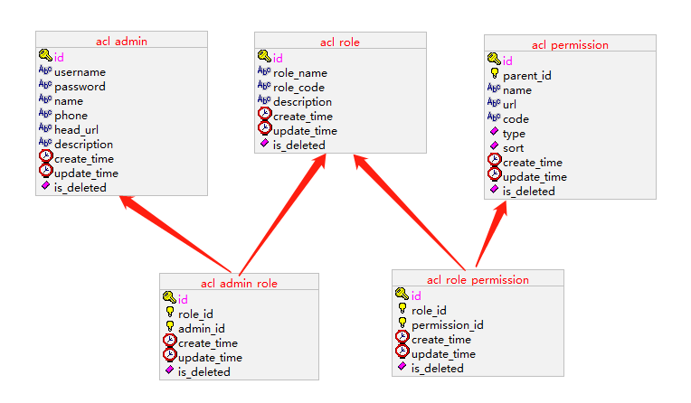
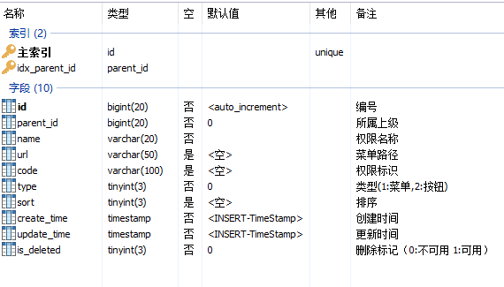
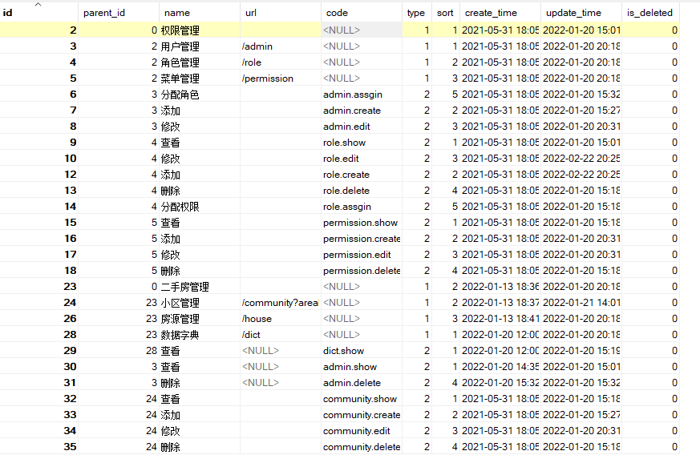
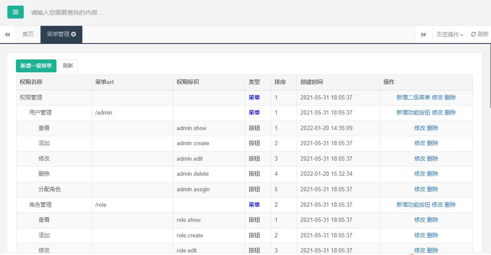

# 尚好房：权限管理

## 一、业务介绍

### 1、功能演示

参考：http://139.198.152.148:8001/

### 2、数据库表关系




### 3、权限表

#### 3.1、表结构



#### 3.2、表数据



#### 3.3、页面效果



## 二、权限管理

前面已经做了用户管理与角色管理，目前我们在此基础上完善权限管理功能

### 1、给用户分配角色

#### 1.1、接口分析

1、进入分配页面：获取已分配角色与未分配给用户的角色，进行页面展示

2、保存分配角色：删除之前分配的角色和保存现在分配的角色

#### 1.2 、service层接口

RoleService类添加接口

```java
/**
 * 根据用户获取角色数据
 * @param adminId
 * @return
 */
Map<String, Object> findRoleByAdminId(Long adminId);

/**
 * 分配角色
 * @param adminId
 * @param roleIds
 */
void saveUserRoleRealtionShip(Long adminId, Long[] roleIds);
```

#### 1.3 、service层接口实现

RoleServiceImpl类添加实现方法

```java
@Autowired
private AdminRoleDao adminRoleDao;
```

```java
/**
 * 根据用户获取角色数据
 * @param adminId
 * @return
 */
//@Override
public Map<String, Object> findRoleByAdminId(Long adminId) {
   //查询所有的角色
   List<Role> allRolesList = roleDao.findAll();

   //拥有的角色id
   List<Long> existRoleIdList = adminRoleDao.findRoleIdByAdminId(adminId);

   //对角色进行分类
   List<Role> noAssginRoleList = new ArrayList<>();
   List<Role> assginRoleList = new ArrayList<>();
   for (Role role : allRolesList) {
      //已分配
      if(existRoleIdList.contains(role.getId())) {
         assginRoleList.add(role);
      } else {
         noAssginRoleList.add(role);
      }
   }

   Map<String, Object> roleMap = new HashMap<>();
   roleMap.put("noAssginRoleList", noAssginRoleList);
   roleMap.put("assginRoleList", assginRoleList);
   return roleMap;
}

/**
 * 分配角色
 * @param adminId
 * @param roleIds
 */
@Override
public void saveUserRoleRealtionShip(Long adminId, Long[] roleIds) {
   adminRoleDao.deleteByAdminId(adminId);

   for(Long roleId : roleIds) {
      if(StringUtils.isEmpty(roleId)) continue;
      AdminRole userRole = new AdminRole();
      userRole.setAdminId(adminId);
      userRole.setRoleId(roleId);
      adminRoleDao.insert(userRole);
   }
}
```

#### 1.4 、dao层接口

添加AdminRoledao类

```java
package com.atguigu.dao;

import com.atguigu.base.BaseDao;
import com.atguigu.entity.AdminRole;

import java.util.List;

public interface AdminRoleDao extends BaseDao<AdminRole> {

    void deleteByAdminId(Long adminId);

    List<Long> findRoleIdByAdminId(Long adminId);
}
```

#### 1.5 、dao层xml

添加AdminRoledao.xml

```xml
<?xml version="1.0" encoding="UTF-8" ?>
<!DOCTYPE mapper
        PUBLIC "-//mybatis.org//DTD Mapper 3.0//EN"
        "http://mybatis.org/dtd/mybatis-3-mapper.dtd">


<mapper namespace="com.atguigu.dao.AdminRoleDao">
   
   <!-- 用于select查询公用抽取的列 -->
   <sql id="columns">
      select id,role_id,admin_id,create_time,update_time,is_deleted
   </sql>

   <insert id="insert" useGeneratedKeys="true" keyProperty="id">
        insert into acl_admin_role (
           role_id ,
           admin_id
        ) values (
           #{roleId} ,
           #{adminId}
        )
   </insert>
    
   <update id="update" >
        update acl_admin_role set
           role_id = #{roleId} ,
           admin_id = #{adminId}
        where 
           id = #{id} 
   </update>

    <update id="delete">
        update acl_admin_role set
         update_time = now() ,
         is_deleted = 1
        where 
           id = #{id}
    </update>
    
    <select id="getById" resultType="AdminRole">
      select <include refid="columns" />
          from acl_admin_role 
           where 
              id = #{id} 
   </select>

   <update id="deleteByAdminId">
      update acl_admin_role set
         update_time = now() ,
         is_deleted = 1
        where
         admin_id = #{adminId}
   </update>

   <select id="findRoleIdByAdminId" resultType="Long">
      select
      role_id
      from acl_admin_role
      where
      admin_id = #{adminId}
      and is_deleted = 0
   </select>

</mapper>
```

#### 1.6 、controller层

在AdminController类添加方法

```java
@Reference
private RoleService roleService;
```

```java
private final static String PAGE_ASSGIN_SHOW = "admin/assginShow";
private final static String PAGE_SUCCESS = "common/successPage";
```

```java
/**
 * 进入分配角色页面
 * @param adminId
 * @return
 */
@GetMapping("/assignShow/{adminId}")
public String assignShow(ModelMap model,@PathVariable Long adminId) {
   Map<String, Object> roleMap = roleService.findRoleByAdminId(adminId);
   model.addAllAttributes(roleMap);
   model.addAttribute("adminId", adminId);
   return PAGE_ASSGIN_SHOW;
}

/**
 * 根据用户分配角色
 * @param adminId
 * @param roleIds
 * @return
 */
@PostMapping("/assignRole")
public String assignRole(Long adminId, Long[] roleIds) {
   roleService.saveUserRoleRealtionShip(adminId,roleIds);
   return PAGE_SUCCESS;
}
```

#### 1.7、页面处理

1、用户列表页面处理：admin/index.html

```html
<a class="assign" th:attr="data-id=${item.id}">分配角色</a>
```

```javascript
$(".assign").on("click",function () {
    var id = $(this).attr("data-id");
    opt.openWin('/admin/assignShow/'+id,'分配角色',550,450)
});
```

2、分配页面

admin/assignShow.html

说明：页面效果不用关注，重点功能实现

```html
<!DOCTYPE html>
<html xmlns:th="http://www.thymeleaf.org">
<head th:include="common/head :: head"></head>

<style type="text/css">
    select option{
        width:260px;
        height:25px;
        line-height:25px;
        padding: 5px 5px;
    }
</style>
<body class="gray-bg">
<div class="wrapper wrapper-content animated fadeInRight">
    <div class="ibox float-e-margins">
        <form id="ec" th:action="@{/admin/assignRole}" method="post" class="form-horizontal">
            <input type="hidden" name="adminId" th:value="${adminId}">
            <input type="hidden" name="roleIds" id="roleIds" value="">
            <div style="text-align: center;padding-left: 20px;">
                <div id="s1" style="float: left;">
                    <div style="font-weight:900;">未选择</div>
                    <select id="select1" multiple="multiple" style="width: 220px;height: 280px;overflow-y:auto;" ondblclick="funRight()">
                        <option th:each="item: ${noAssginRoleList}" th:value="${item.id}" th:text="${item.roleName}">11</option>
                    </select>
                </div>
                <div style="float: left;padding-top:120px;">
                    <br />
                    <button type="button" id="right"> &gt;&gt; </button><br /><br />

                    <button type="button" id="left">  &lt;&lt; </button>

                </div>
                <div id="s2" style="float: left;">
                    <div style="font-weight:900;">已选择</div>
                    <select id="select2" multiple="multiple" style="width: 220px;height: 280px;overflow-y:auto;" ondblclick="funLeft()">
                        <option th:each="item: ${assginRoleList}" th:value="${item.id}" th:text="${item.roleName}">11</option>
                    </select>
                </div>

                <div class="form-group" style="clear: left;padding-top: 20px;">
                    <button type="button" class="btn btn-sm btn-primary " onclick="add()" style="margin-left: 10px;"> 保存</button>
                    <button type="button" class="btn btn-sm btn-primary " onclick="cancel()" style="margin-left: 10px;"> 重置</button>
                    <button class="btn btn-sm btn-white" type="button" onclick="javascript:opt.closeWin();" value="取消">取消</button>
                </div>
                <br/>
            </div>
        </form>
    </div>
</div>
<script th:inline="javascript">
    $(function(){
        $("#right").on("click",function() {
            $("#select1 option").each(function(index, item){
                if(item.selected == true){
                    document.getElementById("select2").appendChild(item);
                }
            });
        });

        $("#left").on("click",function() {
            $("#select2 option").each(function(index, item){
                if(item.selected == true){
                    document.getElementById("select1").appendChild(item);
                }
            });
        });
    });

    function funRight() {
        $("#right").trigger("click");
    }

    function funLeft() {
        $("#left").trigger("click");
    }

    function add() {
        var roleIds = "";
        $("#select2 option").each(function(index, item){
            roleIds += $(item).val() + ",";
        });
        $("#roleIds").val(roleIds);
        document.forms.ec.submit();
    }

    function cancel() {
        window.location.reload();
    }
</script>
</body>
</html>
```

### 2、给角色分配权限

#### 2.1、接口分析

1，该接口采用树形展示，使用zTree组件，通过树形复选框的形式显示分配与未分配

2、进入分配页面：根据zTree组件构建数据进行页面渲染

3、保存分配角色：删除之前分配的权限和保存现在分配的权限数据

#### 2.2、service层接口

添加PermissionService类

```java
package com.atguigu.service;

import com.atguigu.base.BaseService;
import com.atguigu.entity.Permission;

import java.util.List;

public interface PermissionService extends BaseService<Permission> {


    /**
     * 根据角色获取授权权限数据
     * @return
     */
    List<Map<String,Object>> findPermissionByRoleId(Long roleId);

    /**
     * 保存角色权限
     * @param roleId
     * @param permissionIds
     */
    void saveRolePermissionRealtionShip(Long roleId, Long[] permissionIds);

}
```

#### 2.3、service层接口实现

添加PermissionServiceImpl类

说明：构造zTree数据，参考文档：http://www.treejs.cn/v3/demo.php#_201

```java
package com.atguigu.service.impl;

import com.alibaba.dubbo.config.annotation.Service;
import com.alibaba.fastjson.JSON;
import com.atguigu.base.BaseDao;
import com.atguigu.base.BaseServiceImpl;
import com.atguigu.dao.PermissionDao;
import com.atguigu.dao.RolePermissionDao;
import com.atguigu.entity.Permission;
import com.atguigu.entity.RolePermission;
import com.atguigu.service.PermissionService;
import org.springframework.beans.factory.annotation.Autowired;
import org.springframework.transaction.annotation.Transactional;
import org.springframework.util.StringUtils;

import java.util.ArrayList;
import java.util.HashMap;
import java.util.List;
import java.util.Map;

@Transactional
@Service(interfaceClass = PermissionService.class)
public class PermissionServiceImpl extends BaseServiceImpl<Permission> implements PermissionService {

   @Autowired
   private PermissionDao permissionDao;

   @Autowired
   private RolePermissionDao rolePermissionDao;

   @Override
   protected BaseDao<Permission> getEntityDao() {
      return permissionDao;
   }

   @Override
   public List<Map<String,Object>> findPermissionByRoleId(Long roleId) {
      //全部权限列表
      List<Permission> permissionList = permissionDao.findAll();

      //获取角色已分配的权限数据
      List<Long> permissionIdList = rolePermissionDao.findPermissionIdListByRoleId(roleId);

      //构建ztree数据
      //参考文档：http://www.treejs.cn/v3/demo.php#_201
      // { id:2, pId:0, name:"随意勾选 2", checked:true, open:true},
      List<Map<String,Object>> zNodes = new ArrayList<>();
      for(Permission permission : permissionList) {
         Map<String,Object> map = new HashMap<>();
         map.put("id", permission.getId());
         map.put("pId", permission.getParentId());
         map.put("name", permission.getName());
         if(permissionIdList.contains(permission.getId())) {
            map.put("checked", true);
         }
         zNodes.add(map);
      };
      return zNodes;
   }

   /**
    * 保存角色权限
    * @param roleId
    * @param permissionIds
    */
   @Override
   public void saveRolePermissionRealtionShip(Long roleId, Long[] permissionIds) {
      rolePermissionDao.deleteByRoleId(roleId);

      for(Long permissionId : permissionIds) {
         if(StringUtils.isEmpty(permissionId)) continue;
         RolePermission rolePermission = new RolePermission();
         rolePermission.setRoleId(roleId);
         rolePermission.setPermissionId(permissionId);
         rolePermissionDao.insert(rolePermission);
      } 
   }
}
```

#### 2.4、dao层

1、添加PermissionDao类

```java
package com.atguigu.dao;

import com.atguigu.base.BaseDao;
import com.atguigu.entity.Permission;

import java.util.List;

public interface PermissionDao extends BaseDao<Permission> {

    List<Permission> findAll();

}
```

2、添加RolePermissionDao类

```java
package com.atguigu.dao;

import com.atguigu.base.BaseDao;
import com.atguigu.entity.RolePermission;

import java.util.List;

public interface RolePermissionDao extends BaseDao<RolePermission> {

    void deleteByRoleId(Long roleId);

    List<Long> findPermissionIdListByRoleId(Long roleId);
}
```

#### 2.5、dao层xml

1、添加PermissionDao.xml

基础增删改查方法默认添加

```xml
<?xml version="1.0" encoding="UTF-8" ?>
<!DOCTYPE mapper
        PUBLIC "-//mybatis.org//DTD Mapper 3.0//EN"
        "http://mybatis.org/dtd/mybatis-3-mapper.dtd">


<mapper namespace="com.atguigu.dao.PermissionDao">
   
   <!-- 用于select查询公用抽取的列 -->
   <sql id="columns">
      select id,parent_id,name,url,code,type,sort,create_time,update_time,is_deleted
   </sql>

   <insert id="insert" useGeneratedKeys="true" keyProperty="id">
        insert into acl_permission (
           id ,
           parent_id ,
           name ,
           url ,
           code ,
           type ,
           sort
        ) values (
           #{id} ,
           #{parentId} ,
           #{name} ,
           #{url} ,
           #{code} ,
           #{type} ,
           #{sort}
        )
   </insert>
    
   <update id="update" >
        update acl_permission set
      <if test="parentId != null and parentId != ''">
         parent_id = #{parentId} ,
      </if>
      <if test="name != null and name != ''">
         name = #{name} ,
      </if>
      <if test="url != null and url != ''">
         url = #{url} ,
      </if>
      <if test="code != null and code != ''">
         code = #{code} ,
      </if>
      <if test="type != null and type != ''">
         type = #{type} ,
      </if>
      <if test="sort != null and sort != ''">
         sort = #{sort} ,
      </if>
      update_time =  now()
      where
      id = #{id}
   </update>

    <update id="delete">
        update acl_permission set
         update_time = now() ,
         is_deleted = 1
        where 
           id = #{id}
    </update>
    
    <select id="getById" resultType="Permission">
      <include refid="columns" />
          from acl_permission 
           where 
              id = #{id} 
   </select>

   <select id="findAll" resultType="Permission">
      <include refid="columns" />
      from acl_permission
      where
      is_deleted = 0
      order by sort
   </select>

</mapper>
```

2、添加RolePermissionDao.xml

```xml
<?xml version="1.0" encoding="UTF-8" ?>
<!DOCTYPE mapper
        PUBLIC "-//mybatis.org//DTD Mapper 3.0//EN"
        "http://mybatis.org/dtd/mybatis-3-mapper.dtd">


<mapper namespace="com.atguigu.dao.RolePermissionDao">
   
   <!-- 用于select查询公用抽取的列 -->
   <sql id="columns">
      select id,role_id,permission_id,create_time,update_time,is_deleted
   </sql>

   <insert id="insert" useGeneratedKeys="true" keyProperty="id">
        insert into acl_role_permission (
           role_id ,
           permission_id
        ) values (
           #{roleId} ,
           #{permissionId}
        )
   </insert>
    
   <update id="update" >
        update acl_role_permission set
           role_id = #{roleId} ,
           permission_id = #{permissionId} ,
        where 
           id = #{id} 
   </update>

    <update id="delete">
        update acl_role_permission set
         update_time = now() ,
         is_deleted = 1
        where 
           id = #{id}
    </update>

   <update id="deleteByRoleId">
        update acl_role_permission set
         update_time = now() ,
         is_deleted = 1
        where
           role_id = #{roleId}
    </update>

    <select id="getById" resultType="RolePermission">
      select <include refid="columns" />
          from acl_role_permission 
           where 
              id = #{id} 
   </select>

   <select id="findPermissionIdListByRoleId" resultType="Long">
      select permission_id
      from acl_role_permission
      where
      role_id = #{roleId}
      and is_deleted = 0
   </select>

</mapper>
```

#### 2.6、controller层

在RoleController类添加方法

```java
private final static String PAGE_ASSGIN_SHOW = "role/assginShow";
private final static String PAGE_SUCCESS = "common/successPage";
```

```java
@Reference
private PermissionService permissionService;
```

```java
/**
 * 进入分配权限页面
 * @param roleId
 * @return
 */
@GetMapping("/assignShow/{roleId}")
public String assignShow(ModelMap model,@PathVariable Long roleId) {
   List<Map<String,Object>> zNodes = permissionService.findPermissionByRoleId(roleId);
   model.addAttribute("zNodes", zNodes);
   model.addAttribute("roleId", roleId);
   return PAGE_ASSGIN_SHOW;
}

/**
 * 给角色分配权限
 * @param roleId
 * @param permissionIds
 * @return
 */
@PostMapping("/assignPermission")
public String assignPermission(Long roleId,Long[] permissionIds) {
   permissionService.saveRolePermissionRealtionShip(roleId, permissionIds);
   return PAGE_SUCCESS;
}
```

#### 2.7、页面处理

1、角色列表页面

```html
<a class="assgin" th:attr="data-id=${item.id}">分配权限</a>
```

```javascript
$(".assgin").on("click",function () {
    var id = $(this).attr("data-id");
    opt.openWin("/role/assignShow/"+id,'修改',580,430);
});
```

2、分配权限页面

页面渲染参考：http://www.treejs.cn/v3/demo.php#_201

添加页面：role/assginShow.html

```html
<!DOCTYPE html>
<html xmlns:th="http://www.thymeleaf.org">
<head th:include="common/head :: head"></head>

<link rel="stylesheet" th:href="@{/static/js/plugins/zTree_v3/zTreeStyle.css}" type="text/css">
<script type="text/javascript" th:src="@{/static/js/plugins/zTree_v3/jquery.ztree.core.js}"></script>
<script type="text/javascript" th:src="@{/static/js/plugins/zTree_v3/jquery.ztree.excheck.js}"></script>
<body class="gray-bg">
<div class="wrapper wrapper-content animated fadeInRight">
    <div class="ibox float-e-margins">
        <div class="ibox-content" style="width: 98%;">
            <form id="ec" th:action="@{/role/assignPermission}" method="post" class="form-horizontal">
                <input type="hidden" name="roleId" th:value="${roleId}">
                <input type="hidden" name="permissionIds" id="permissionIds" value="">
                <div class="zTreeDemoBackground left">
                    <ul id="treeDemo" class="ztree"></ul>
                </div>
                <div class="hr-line-dashed"></div>
                <div class="form-group posf">
                    <div class="col-sm-4 col-sm-offset-2 text-right">
                        <button class="btn btn-primary" type="button" id="button">确定</button>
                        <button class="btn btn-white" type="button" onclick="javascript:opt.closeWin();" value="取消">取消</button></div>
                </div>
            </form>
        </div>
    </div>
</div>
<script th:inline="javascript">
    $(function(){
        // 文档地址:http://www.treejs.cn/v3/demo.php#_201
        var setting = {
            check: {
                enable: true
            },
            data: {
                simpleData: {
                    enable: true
                }
            }
        };

        //var zNodes = JSON.parse([[${zNodes}]]);
        var zNodes = [[${zNodes}]];
        // var zNodes =[
        //     { id:1, pId:0, name:"随意勾选 1", open:true},
        //     { id:11, pId:1, name:"随意勾选 1-1", open:true},
        //     { id:111, pId:11, name:"随意勾选 1-1-1"},
        //     { id:112, pId:11, name:"随意勾选 1-1-2"},
        //     { id:12, pId:1, name:"随意勾选 1-2", open:true},
        //     { id:121, pId:12, name:"随意勾选 1-2-1"},
        //     { id:122, pId:12, name:"随意勾选 1-2-2"},
        //     { id:2, pId:0, name:"随意勾选 2", checked:true, open:true},
        //     { id:21, pId:2, name:"随意勾选 2-1"},
        //     { id:22, pId:2, name:"随意勾选 2-2", open:true},
        //     { id:221, pId:22, name:"随意勾选 2-2-1", checked:true},
        //     { id:222, pId:22, name:"随意勾选 2-2-2"},
        //     { id:23, pId:2, name:"随意勾选 2-3"}
        // ];

        var zTree =$.fn.zTree.init($("#treeDemo"), setting, zNodes);
        zTree.expandAll(true);
        $("#button").on("click",function () {
            var checkedNodes = zTree.getCheckedNodes();
            console.log(checkedNodes)
            var permissionIdList = [];
            for(var i=0; i<checkedNodes.length; i++) {
                permissionIdList.push(checkedNodes[i].id)
            }
            $("#permissionIds").val(permissionIdList.join(","));
            document.forms.ec.submit();
        });
    });
</script>
</body>
</html>
```

### 3、左侧动态菜单

#### 3.1、 需要及实现思路

前面给用户分配了角色，给角色分配了权限，那么用户登录成功后就可以获取到左侧的动态菜单，分配了哪些菜单，那么左侧就显示哪些菜单。

当前菜单我们是直接写在frame/index.html页面的，现在我们要改成动态菜单。

权限处理过程中，系统会默认一个超级管理员，默认就有所以权限，当前默认admin账号为超级管理员。

实现思路：

​	用户登录成功（用户登录后续与spring security一起讲解，当前可以默认用户），根据用户id获取角色列表，然后根据角色获取用户的菜单权限。

#### 3.2、定义service接口

PermissionService类添加接口

```java
/**
 * 获取用户菜单权限
 * @param adminId
 * @return
 */
List<Permission> findMenuPermissionByAdminId(Long adminId);
```

#### 3.3、service接口实现

PermissionServiceImpl类添加接口实现

```java
public List<Permission> findMenuPermissionByAdminId(Long adminId) {
   List<Permission> permissionList = null;
   //admin账号id为：1
   if(adminId.longValue() == 1) {
      //如果是超级管理员，获取所有菜单
      permissionList = permissionDao.findAll();
   } else {
      permissionList = permissionDao.findListByAdminId(adminId);
   }
   //把权限数据构建成树形结构数据
   List<Permission> result = PermissionHelper.bulid(permissionList);
   return result;
}
```

从资源文件引入helper/PermissionHelper帮助类

```java
package com.atguigu.helper;


import com.atguigu.entity.Permission;

import java.util.ArrayList;
import java.util.List;

/**
 * <p>
 * 根据权限数据构建菜单数据
 * </p>
 *
 */
public class PermissionHelper {

    /**
     * 使用递归方法建菜单
     * @param treeNodes
     * @return
     */
    public static List<Permission> bulid(List<Permission> treeNodes) {
        List<Permission> trees = new ArrayList<>();
        for (Permission treeNode : treeNodes) {
            if (treeNode.getParentId().longValue() == 0) {
                treeNode.setLevel(1);
                trees.add(findChildren(treeNode,treeNodes));
            }
        }
        return trees;
    }

    /**
     * 递归查找子节点
     * @param treeNodes
     * @return
     */
    public static Permission findChildren(Permission treeNode,List<Permission> treeNodes) {
        treeNode.setChildren(new ArrayList<Permission>());

        for (Permission it : treeNodes) {
            if(treeNode.getId().longValue() == it.getParentId().longValue()) {
                int level = treeNode.getLevel() + 1;
                it.setLevel(level);
                if (treeNode.getChildren() == null) {
                    treeNode.setChildren(new ArrayList<>());
                }
                treeNode.getChildren().add(findChildren(it,treeNodes));
            }
        }
        return treeNode;
    }
}
```

#### 3.4、dao层接口

PermissionDao添加接口

```java
List<Permission> findListByAdminId(Long adminId);
```

#### 3.5、dao层xml

PermissionDao.xml

```xml
<select id="findListByAdminId" resultType="Permission">
   select
   distinct c.*
   from acl_admin_role a
   inner join acl_role_permission b on b.role_id = a.role_id
   inner join acl_permission c on c.id = b.permission_id
   where
   a.admin_id = #{adminId}
   and c.type = 1
   and a.is_deleted = 0
   and b.is_deleted = 0
   and c.is_deleted = 0
</select>
```

#### 3.6、controller层

修改进入框架主页面方法：IndexController.index()

```java
@Reference
private AdminService adminService;

@Reference
private PermissionService permissionService;
```

```java
/**
 * 框架首页
 *
 * @return
 */
@GetMapping("/")
public String index(ModelMap model) {
    //后续替换为当前登录用户id
    Long adminId = 1L;
    Admin admin = adminService.getById(adminId);
    List<Permission> permissionList = permissionService.findMenuPermissionByAdminId(adminId);
    model.addAttribute("admin", admin);
    model.addAttribute("permissionList",permissionList);
    return PAGE_INDEX;
}
```

#### 3.7、前端页面

调整frame/index.html

替换当前用户头像及名称，替换左侧菜单

代码片段

```html
<nav class="navbar-default navbar-static-side" role="navigation">
   <div class="nav-close"><i class="fa fa-times-circle"></i></div>
   <div class="sidebar-collapse">
      <ul class="nav" id="side-menu">
         <li class="nav-header">
            <div class="dropdown profile-element">
               <span></span>
               <a data-toggle="dropdown" class="dropdown-toggle" href="#">
                  <span class="clear">
                     <span class="block m-t-xs"><strong class="font-bold" th:text="${admin.name}">Beaut-zihan</strong></span>
                     <span class="text-muted text-xs block">超级管理员<b class="caret"></b></span>
                  </span>
               </a>
               <ul class="dropdown-menu animated fadeInRight m-t-xs">
                  <li><a class="J_menuItem" href="javascript:">修改头像</a></li>
                  <li><a class="J_menuItem" href="javascript:">个人资料</a></li>
                  <li><a class="J_menuItem" href="javascript:">联系我们</a></li>
                  <li><a class="J_menuItem" href="javascript:">信箱</a></li>
                  <li class="divider"></li>
                  <li><a href="/logout">安全退出</a></li>
               </ul>
            </div>
            <div class="logo-element">H+</div>
         </li>
         <li th:each="one: ${permissionList}">
            <a href="#">
               <i class="fa fa-home"></i>
               <span class="nav-label" th:text="${one.name}">系统管理</span>
               <span class="fa arrow"></span>
            </a>
            <ul class="nav nav-second-level collapse">
               <li th:each="two,it: ${one.children}"><a class="J_menuItem" th:href="${two.url}" th:data-index="${it.count}" th:text="${two.name}">用户管理</a></li>
            </ul>
         </li>
      </ul>
   </div>
</nav>
```

#### 3.8、测试

使用当前用户adminId=1分配好角色与权限，更改当前用户adminId测试菜单

### 4、菜单管理

只是附上代码，不用讲解

#### 4.1、service接口

PermissionService

```java
/**
 * 菜单全部数据
 * @return
 */
List<Permission> findAllMenu();
```

#### 4.2、service接口实现

PermissionServiceImpl

```java
@Override
public List<Permission> findAllMenu() {
   //全部权限列表
   List<Permission> permissionList = permissionDao.findAll();
   if(CollectionUtils.isEmpty(permissionList)) return null;

   //构建树形数据,总共三级
   //把权限数据构建成树形结构数据
   List<Permission> result = PermissionHelper.bulid(permissionList);
   return result;
}
```

#### 4.3、controller层

PermissionController

```java
package com.atguigu.controller;

import com.alibaba.dubbo.config.annotation.Reference;
import com.atguigu.base.BaseController;
import com.atguigu.entity.Permission;
import com.atguigu.service.PermissionService;
import org.springframework.beans.BeanUtils;
import org.springframework.stereotype.Controller;
import org.springframework.ui.ModelMap;
import org.springframework.web.bind.annotation.GetMapping;
import org.springframework.web.bind.annotation.PathVariable;
import org.springframework.web.bind.annotation.PostMapping;
import org.springframework.web.bind.annotation.RequestMapping;

import javax.servlet.http.HttpServletRequest;
import java.util.List;

@Controller
@RequestMapping(value="/permission")
@SuppressWarnings({"unchecked", "rawtypes"})
public class PermissionController {

   @Reference
   private PermissionService permissionService;
   
   private final static String LIST_ACTION = "redirect:/permission";
   
   private final static String PAGE_INDEX = "permission/index";
   private final static String PAGE_CREATE = "permission/create";
   private final static String PAGE_EDIT = "permission/edit";
   private final static String PAGE_SUCCESS = "common/successPage";


   /**
    * 获取菜单
    * @return
    */
   @GetMapping
   public String index(ModelMap model) {
      List<Permission> list = permissionService.findAllMenu();
      model.addAttribute("list", list);
      return PAGE_INDEX;
   }

   /** 
    * 进入新增
    * @param model
    * @param permission
    * @return
    */
   @GetMapping("/create")
   public String create(ModelMap model, Permission permission) {
      model.addAttribute("permission",permission);
      return PAGE_CREATE;
   }
   
   /**
    * 保存新增
    * @param model
    * @param permission
    * @param request
    * @return
    */
   @PostMapping("/save")
   public String save(Permission permission) {
      
      permissionService.insert(permission);
      
      return PAGE_SUCCESS;
   }
   
   /** 
    * 编辑
    * @param model
    * @param id
    * @return
    */
   @GetMapping("/edit/{id}")
   public String edit(ModelMap model,@PathVariable Long id) {
      Permission permission = permissionService.getById(id);
      model.addAttribute("permission",permission);
      return PAGE_EDIT;
   }
   
   /** 
    * 保存更新
    * @param model
    * @param id
    * @param permission
    * @param request
    * @return
    */
   @PostMapping(value="/update")
   public String update(Permission permission) {
      permissionService.update(permission);
      return PAGE_SUCCESS;
   }
   
   /**
    * 删除
    * @param model
    * @param id
    * @return
    */
   @GetMapping("/delete/{id}")
   public String delete(@PathVariable Long id) {
      permissionService.delete(id);
      return LIST_ACTION;
   }
   
}
```

#### 4.4、前端页面

1、permission/index.html

```html
<!DOCTYPE html>
<html xmlns:th="http://www.thymeleaf.org">

<head th:include="common/head :: head"></head>

<body class="gray-bg">
<form id="ec" action="#" method="post">
    <div class="wrapper wrapper-content animated fadeInRight">

        <div class="row">
            <div class="col-sm-12">
                <div class="ibox float-e-margins">
                    <div class="ibox-content">
                        <div>
                            <button type="button" class="btn btn-sm btn-primary create" th:attr="data-id=0,data-type=1,data-name='一级菜单'">新增一级菜单</button>
                            <button type="button" id="loading-example-btn" onclick="javascript:window.location.reload();" class="btn btn-white btn-sm">刷新</button>
                        </div>
                        <table class="table table-striped table-bordered table-hover dataTables-example">
                            <thead>
                            <tr>
                                <th>权限名称</th>
                                <th>菜单url</th>
                                <th>权限标识</th>
                                <th>类型</th>
                                <th>排序</th>
                                <th>创建时间</th>
                                <th>操作 </th>
                            </tr>
                            </thead>
                            <tbody>
                            <div th:each="one: ${list}">
                                <tr class="gradeX">
                                    <td th:text="${one.name}">22</td>
                                    <td th:text="${one.url}">33</td>
                                    <td th:text="${one.code}">22</td>
                                    <td>
                                        <strong><span th:if="${one.type } eq 1" style="color: blue">菜单</span></strong>
                                        <strong><span th:if="${one.type } eq 2">按钮</span></strong>
                                    </td>
                                    <td th:text="${one.sort}">22</td>
                                    <td th:text="${#dates.format(one.createTime,'yyyy-MM-dd HH:mm:ss')}" >33</td>
                                    <td class="text-center">
                                        <a class="create" th:attr="data-id=${one.id},data-type=1,data-name=${one.name}" sec:authorize="hasAuthority('permission.create')">新增二级菜单</a>
                                        <a class="edit" th:attr="data-id=${one.id}">修改</a>
                                        <a class="delete" th:attr="data-id=${one.id}">删除</a>
                                    </td>
                                </tr>
                                <div th:each="two: ${one.children}">
                                    <tr class="gradeX">
                                        <td th:text="'&nbsp;&nbsp;&nbsp;&nbsp;&nbsp;&nbsp;' + ${two.name}">22</td>
                                        <td th:text="${two.url}">33</td>
                                        <td th:text="${two.code}">22</td>
                                        <td>
                                            <strong><span th:if="${two.type } eq 1" style="color: blue">菜单</span></strong>
                                            <strong><span th:if="${two.type } eq 2">按钮</span></strong>
                                        </td>
                                        <td th:text="${two.sort}">22</td>
                                        <td th:text="${#dates.format(two.createTime,'yyyy-MM-dd HH:mm:ss')}" >33</td>
                                        <td class="text-center">
                                            <a class="create" th:attr="data-id=${two.id},data-type=2,data-name=${two.name}" sec:authorize="hasAuthority('permission.create')">新增功能按钮</a>
                                            <a class="edit" th:attr="data-id=${two.id}">修改</a>
                                            <a class="delete" th:attr="data-id=${two.id}">删除</a>
                                        </td>
                                    </tr>
                                    <div th:each="three: ${two.children}">
                                        <tr class="gradeX">
                                            <td th:text="'&nbsp;&nbsp;&nbsp;&nbsp;&nbsp;&nbsp;&nbsp;&nbsp;&nbsp;&nbsp;&nbsp;&nbsp;' + ${three.name}">22</td>
                                            <td th:text="${three.url}">33</td>
                                            <td th:text="${three.code}">22</td>
                                            <td>
                                                <strong><span th:if="${three.type } eq 1" style="color: blue">菜单</span></strong>
                                                <strong><span th:if="${three.type } eq 2">按钮</span></strong>
                                            </td>
                                            <td th:text="${three.sort}">22</td>
                                            <td th:text="${#dates.format(three.createTime,'yyyy-MM-dd HH:mm:ss')}" >33</td>
                                            <td class="text-center">
                                                <a class="edit" th:attr="data-id=${three.id}">修改</a>
                                                <a class="delete" th:attr="data-id=${three.id}">删除</a>
                                            </td>
                                        </tr>
                                    </div>
                                </div>
                            </div>
                            </tbody>
                        </table>
                    </div>
                </div>
            </div>
        </div>
    </div>
</form>
<script th:inline="javascript">
    $(function(){
        $(".create").on("click",function () {
            var parentId = $(this).attr("data-id");
            var type = $(this).attr("data-type");
            var parentName = $(this).attr("data-name");
            opt.openWin('/permission/create?parentId='+parentId+'&type='+type+'&parentName='+parentName,'新增',630,430)
        });
        $(".edit").on("click",function () {
            var id = $(this).attr("data-id");
            opt.openWin('/permission/edit/' + id,'修改',580,430);
        });
        $(".delete").on("click",function(){
            var id = $(this).attr("data-id");
            opt.confirm('/permission/delete/'+id);
        });
    });
</script>
</body>
</html>
```

2、permission/create.html

```html
<!DOCTYPE html>
<html xmlns:th="http://www.thymeleaf.org">
<head th:include="common/head :: head"></head>
<script type="text/javascript">
    $(function(){
        $('#ec').validate({
            rules:{
                name:"required"
            },
            messages:{
                name:"权限名称必须输入"
            },
            submitHandler: function(form) {
                $(form).find(":submit").attr("disabled", true).text("正在提交...");
                form.submit();
            }
        });
    });
</script>
<body class="gray-bg">
<div class="wrapper wrapper-content animated fadeInRight">
    <div class="ibox float-e-margins">
        <div class="ibox-content" style="width: 98%;">
            <form id="ec" th:action="@{/permission/save}" method="post" class="form-horizontal">
                <input type="hidden" name="parentId" th:value="${permission.parentId}"/>
                <input type="hidden" name="type" th:value="${permission.type}"/>
                <div class="form-group">
                    <label class="col-sm-2 control-label">上级权限：</label>
                    <div class="col-sm-10">
                        <input type="text" name="parentName" id="parentName" th:value="${permission.parentName}" disabled="disabled" class="form-control"/>
                    </div>
                </div>
                <div class="form-group">
                    <label class="col-sm-2 control-label">权限名称：</label>
                    <div class="col-sm-10">
                        <input type="text" name="name" id="name" value="" class="form-control"/>
                    </div>
                </div>
                <div class="hr-line-dashed"></div>
                <div class="form-group" th:if="${permission.type == 1}">
                    <label class="col-sm-2 control-label">菜单url：</label>
                    <div class="col-sm-10">
                        <input type="text" name="url" id="url" class="form-control" style="width:100%;height: 50px;" ></input>
                    </div>
                </div>
                <div class="hr-line-dashed" th:if="${permission.type == 1}"></div>
                <div class="form-group" th:if="${permission.type == 2}">
                    <label class="col-sm-2 control-label">权限值：</label>
                    <div class="col-sm-10">
                        <input type="text" name="code" id="code" class="form-control" style="width:100%;height: 50px;" ></input>
                    </div>
                </div>
                <div class="hr-line-dashed" th:if="${permission.type == 2}"></div>
                <div class="form-group">
                    <label class="col-sm-2 control-label">排序：</label>
                    <div class="col-sm-10">
                        <input type="text" name="sort" id="sort" value="1" class="form-control"/>
                    </div>
                </div>
                <div class="hr-line-dashed"></div>
                <div class="form-group posf">
                    <div class="col-sm-4 col-sm-offset-2 text-right">
                        <button class="btn btn-primary" type="submit">确定</button>
                        <button class="btn btn-white" type="button" onclick="javascript:opt.closeWin();" value="取消">取消</button></div>
                </div>
            </form>
        </div>
    </div>
</div>
</body>
</html>
```

2、permission/edit.html

```html
<!DOCTYPE html>
<html xmlns:th="http://www.thymeleaf.org">
<head th:include="common/head :: head"></head>
<script type="text/javascript">
    $(function(){
        $('#ec').validate({
            rules:{
                name:"required"
            },
            messages:{
                name:"权限名称必须输入"
            },
            submitHandler: function(form) {
                $(form).find(":submit").attr("disabled", true).text("正在提交...");
                form.submit();
            }
        });
    });
</script>
<body class="gray-bg">
<div class="wrapper wrapper-content animated fadeInRight">
    <div class="ibox float-e-margins">
        <div class="ibox-content" style="width: 98%;">
            <form id="ec" th:action="@{/permission/update}" method="post" class="form-horizontal">
                <input type="hidden" name="id" th:value="${permission.id}">
                <div class="form-group">
                    <label class="col-sm-2 control-label">权限名称：</label>
                    <div class="col-sm-10">
                        <input type="text" name="name" id="name" th:value="${permission.name}" class="form-control"/>
                    </div>
                </div>
                <div class="hr-line-dashed"></div>
                <div class="form-group" th:if="${permission.type == 1}">
                    <label class="col-sm-2 control-label">菜单url：</label>
                    <div class="col-sm-10">
                        <input type="text" name="url" id="url" th:value="${permission.url}" class="form-control" style="width:100%;height: 50px;" ></input>
                    </div>
                </div>
                <div class="hr-line-dashed" th:if="${permission.type == 1}"></div>
                <div class="form-group" th:if="${permission.type == 2}">
                    <label class="col-sm-2 control-label">权限值：</label>
                    <div class="col-sm-10">
                        <input type="text" name="code" id="code" th:value="${permission.code}" class="form-control" style="width:100%;height: 50px;" ></input>
                    </div>
                </div>
                <div class="hr-line-dashed" th:if="${permission.type == 2}"></div>
                <div class="form-group">
                    <label class="col-sm-2 control-label">排序：</label>
                    <div class="col-sm-10">
                        <input type="text" name="sort" id="sort" th:value="${permission.sort}" class="form-control"/>
                    </div>
                </div>
                <div class="hr-line-dashed"></div>
                <div class="form-group posf">
                    <div class="col-sm-4 col-sm-offset-2 text-right">
                        <button class="btn btn-primary" type="submit">确定</button>
                        <button class="btn btn-white" type="button" onclick="javascript:opt.closeWin();" value="取消">取消</button></div>
                </div>
            </form>
        </div>
    </div>
</div>
</body>
</html>
```
