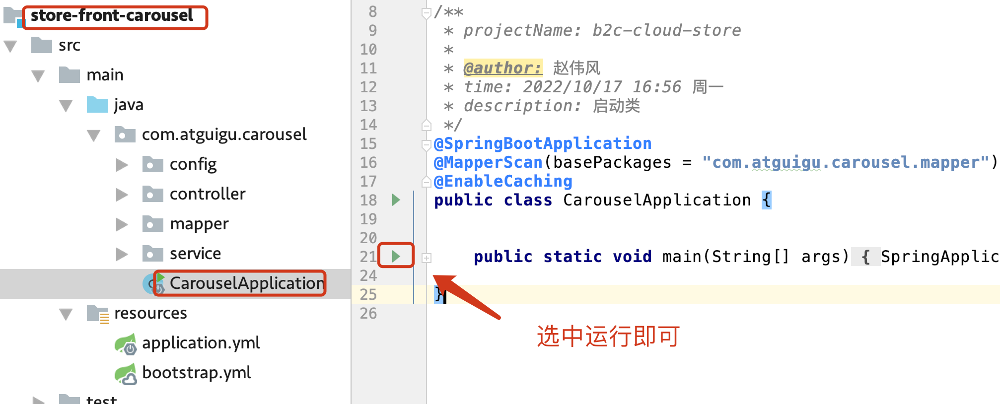
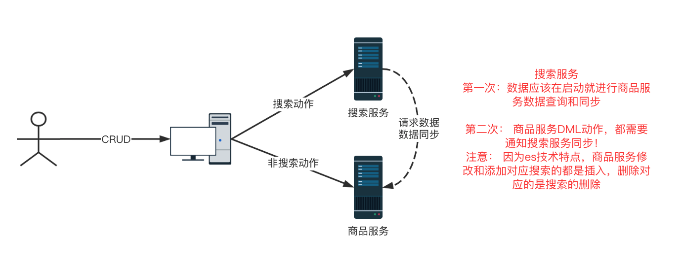
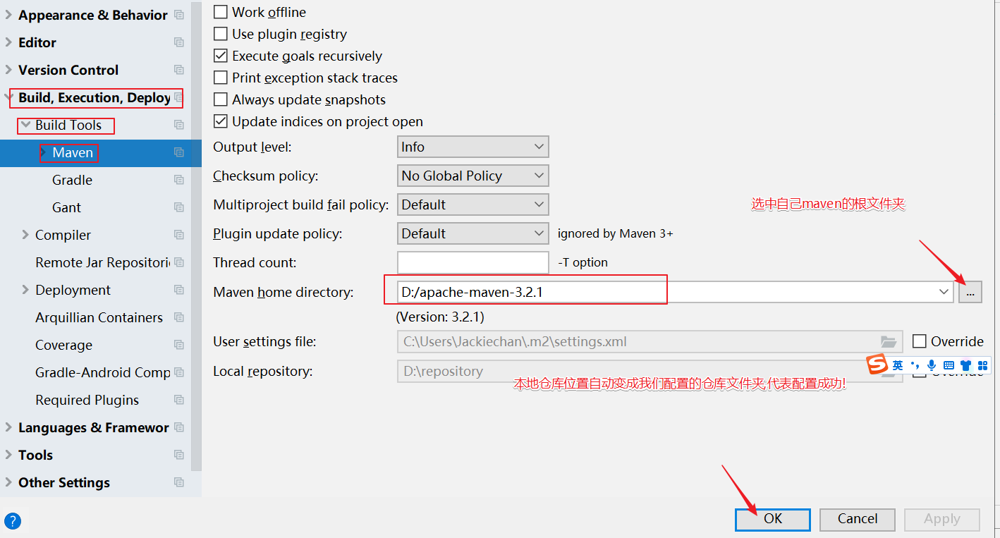

## 目录

*   [硅谷电商毕设项目\_微服务版本](#硅谷电商毕设项目_微服务版本)

    *   *   [一、前言](#一前言)

        *   [二、快速了解](#二快速了解)

        *   [三、微服务环境搭建](#三微服务环境搭建)

        *   [四、项目快速部署](#四项目快速部署)

        *   [五、项目基础搭建](#五项目基础搭建)

        *   [六、商城前端服务开发](#六商城前端服务开发)

        *   [七、后台管理服务开发](#七后台管理服务开发)

        *   [八、开发环境搭建](#八开发环境搭建)

        *   [九、技术普及](#九技术普及)

# 硅谷电商毕设项目\_微服务版本

***

### 一、前言

> 你是不是需要一个教程时长较短,微服务技术栈较全电商项目，充当毕业设计或者进行微服务**入门项目练习**！                                                                                                                    本次课程**技术全面**【springboot、mybatis-plus、微服务全家桶、缓存、异步消息、搜索等技术栈】，**功能齐全**【销售前端和后台管理功能】，并且代码完整!  也对项目结构和功能点进行优化,减少冗余**业务**项目！让你在**最快的时间**完成毕设项目开发和微服务入门练习！

***

### 二、快速了解

*   **项目简介**

    **B2C**模式电商项目，包含完整的销售前台和电商管理后台！

    前台部分主要通过浏览器访问，用户可以登录，浏览商品，以及添加购物车和订单生成等功能，完成购物车！

    后台部分主要管理员登录，对前台用户，类别，商品以及订单等数据维护！

    功能齐全，并针对人群，进行了项目调整，砍掉了部分冗余业务，学习周期更短，更快速的学习和掌握项目！

    本项目前端资料来自于互联网开源项目，技术分享，分享快乐！

*   **项目亮点**

    *   教案齐全，代码和物料完整，在线版本**一个链接**搞定全部

    *   技术栈全面，视频精炼，让在**更短时间**、**更快的入门**微服务

    *   后台**微服务技术**开发，并加入**缓存**和**搜索**以及**消息队列**技术栈

    *   前端技术新颖，使用**vue+elementui+node+layui**组合

    *   文件存储使用了阿里OSS技术，环境安装使用Docker技术

    *   项目**功能全面**、**难度适中**，**毕设**和微服务**入门良品**

    *   从零开始，涉及新技术专门普及讲解，**学习门槛低**

*   **核心技术栈**

    后台技术

    | 技术点                 | 版本号           |
    | ------------------- | ------------- |
    | springboot          | 2.3.9.RELEASE |
    | springcloud         | Hoxton.SR10   |
    | springcloud alibaba | 2.2.5.RELEASE |
    | spring cache        | 2.3.9.RELEASE |
    | rabbitmq            | 5.9.0         |
    | elasticsearch       | 7.12.1        |
    | druid               | 1.2.5         |
    | mybatis-plus        | 3.5.2         |
    | lombok              | 1.18.24       |

    前端技术

    | 技术点        | 版本号     |
    | ---------- | ------- |
    | vue        | 2.6.10  |
    | node       | 1.14.16 |
    | element-ui | 2.13.0  |
    | layui      | 2.9+    |
    | axios      | 0.19.0  |
    | vuex       | 3.1.2   |

*   **开发环境需求**

    | 开发工具  | 版本号    | 备注       |
    | ----- | ------ | -------- |
    | jdk   | 1.8.19 | 1.8+即可   |
    | idea  | 2019   | 无限制      |
    | maven | 3.6.3  | 3+即可     |
    | mysql | 5.7.25 | 推荐8.0+版本 |

*   **项目运行效果图**

    *   前台首页

        

    *   前台用户模块

        

    *   前台商品模块

        

    *   前台详情模块

        

    *   前台搜藏模块

        

    *   前台购物车模块

        

    *   前台地址模块

        

    *   前台订单模块

        

    *   **后台登录模块**

        

    *   **后台用户模块**

        

    *   **后台分类管理**

        

    *   **后台商品管理**

        

    *   **后台订单管理**

        

*   **内置功能详解**

    *   **商城前台**

        *   **用户模块：** 登录、注册、 账号检查

        *   **轮播模块：** 轮播图展示

        *   **商品模块：** 热门商品、类别商品、全部商品、单类别商品、商品详情、商品图片详情、商品搜索功

        *   **类别模块：** 类别展示

        *   **地址模块：** 地址添加、地址删除、地址展示

        *   **收藏模块：** 收藏添加、收藏展示、收藏删除

        *   **购物模块：** 购物车添加、购物车修改、购物车展示、购物车删除

        *   **订单模块：** 订单生成、订单展示

        *   **性能模块：** 缓存实现、搜索实现、搜索同步、搜索添加、搜索删除

    *   **商城后台**

        *   **用户模块：** 用户展示、用户添加、用户编辑、用户删除

        *   **类别模块：** 类别展示、类别添加、类别修改、类别删除

        *   **商品模块：** 商品添加、商品展示、商品搜索、商品修改、商品删除

        *   **订单模块：** 订单展示

    *   总体统计

        ```ybsz
        title 服务  12 d0 red
        title 模块  13 blue
        title 功能点 42 green
        title 数据表 8  gold
    
        ```

*   **数据库E-R图**

    

*   **项目服务架构图**

    

### 三、微服务环境搭建

*   **云服务购买和使用**

    提示：本地安装Linux虚拟机也可以，使用云服务器更加简单！

    系统：centos 7+ 版本即可

    性能：推荐2核2GB内存以及以上

    阿里云：[https://ecs-buy.aliyun.com/wizard/#/prepay/cn-beijing?fromDomain=true](https://ecs-buy.aliyun.com/wizard/#/prepay/cn-beijing?fromDomain=true "https://ecs-buy.aliyun.com/wizard/#/prepay/cn-beijing?fromDomain=true")

    腾讯云：[https://buy.cloud.tencent.com/cvm?tab=lite\&templateCreateMode=createLt](https://buy.cloud.tencent.com/cvm?tab=lite\&templateCreateMode=createLt "https://buy.cloud.tencent.com/cvm?tab=lite\&templateCreateMode=createLt")

    注意：一定要分配公网IP，带宽1MB即可

    注意：需要开通外部访问端口号，前期1-65535都可打开

*   **finalshell安装和使用**

    *   FinallShell介绍

        > finalshell是远程服务连接工具，它能帮助用户快速的连接服务器，而且界面设计十分的简洁操作非常的简单,而且免费使用！

    *   FinallShell安装

        > 安装一切正常！直接下一步即可！

        

    *   FinalShell连接

        

    *   FinalShell使用

        

*   **docker使用**

    *   docker介绍

        

        Docker 是一个开源的应用容器引擎，基于 [Go 语言](https://www.runoob.com/go/go-tutorial.html "Go 语言") 并遵从 Apache2.0 协议开源。

        Docker 可以让开发者打包他们的应用以及依赖包到一个轻量级、可移植的容器中，然后发布到任何流行的 Linux 机器上，也可以实现虚拟化。

        白话解释：docker可以理解成是手机中的应用市场，有了应用市场，就不用自己一个一个百度搜索软件并下载了，直接在应用市场中可以一键下载！

        白话作用：docker帮助我们安装微服务开发需要的中间件，使用简单的命令控制docker安装即可，不需要自己手动安装！

    *   docker安装

        1.  清空原有组件残留

            > 之前安装过旧版本，使用一下命令可以卸载！

            ```docker
            yum remove docker \
                              docker-client \
                              docker-client-latest \
                              docker-common \
                              docker-latest \
                              docker-latest-logrotate \
                              docker-logrotate \
                              docker-selinux \
                              docker-engine-selinux \
                              docker-engine \
                              docker-ce
            ```

        2.  设置docker仓库

            > 在新主机上首次安装 Docker Engine-Community 之前，需要设置 Docker 仓库。之后，您可以从仓库安装和更新 Docker.                                                                                    安装所需的软件包。yum-utils 提供了 yum-config-manager ，并且 device mapper 存储驱动程序需要 device-mapper-persistent-data 和 lvm2。

            ```docker
            yum install -y yum-utils \
                       device-mapper-persistent-data \
                       lvm2 --skip-broken
            ```

        3.  配置yum阿里镜像

            ```docker
            # 设置docker镜像源
            yum-config-manager \
                --add-repo \
                https://mirrors.aliyun.com/docker-ce/linux/centos/docker-ce.repo
                
            sed -i 's/download.docker.com/mirrors.aliyun.com\/docker-ce/g' /etc/yum.repos.d/docker-ce.repo

            yum makecache fast
            ```

        4.  安装docker

            > docker-ce为社区免费版本。稍等片刻，docker即可安装成功。

            ```docker
            yum install -y docker-ce
            ```

        5.  启动docker

            1.  关闭防火墙

                > docker涉及端口映射，建议先关闭防火墙，避免端口屏蔽！

                ```bash
                # 关闭
                systemctl stop firewalld
                # 禁止开机启动防火墙
                systemctl disable firewalld
                ```

            2.  启动和停止docker

                ```bash
                systemctl start docker  # 启动docker服务
        
                systemctl stop docker  # 停止docker服务
        
                systemctl restart docker  # 重启docker服务
        
                docker -v
        
                ```

        6.  配置docker阿里镜像

            > 更新docker对应的仓库，为阿里镜像，提升下载速度！

            ```bash
            sudo mkdir -p /etc/docker
            sudo tee /etc/docker/daemon.json <<-'EOF'
            {
              "registry-mirrors": ["https://as08lme3.mirror.aliyuncs.com"]
            }
            EOF
            sudo systemctl daemon-reload
            sudo systemctl restart docker
            ```

    *   docker基本概念

        *   **镜像（Image）**：Docker 镜像（Image），就相当于是一个 root 文件系统。比如官方镜像 ubuntu:16.04 就包含了完整的一套 Ubuntu16.04 最小系统的 root 文件系统。

            软件的安装包

        *   **容器（Container）**：镜像（Image）和容器（Container）的关系，就像是面向对象程序设计中的类和实例一样，镜像是静态的定义，容器是镜像运行时的实体。容器可以被创建、启动、停止、删除、暂停等。

            安装包安装以后的运行程序

        *   **仓库（Repository）**：仓库可看成一个代码控制中心，用来保存镜像。

            存放安装包的仓库

            <http://hub.docker.com> 查看镜像

            我们的目标，就是从仓库拉去镜像，启动运行成容器，即可！

    *   docker镜像基本命令

        *   基本命令

            

        *   基本练习

            1.  拉去nginx镜像

                输入： <http://hub.docker.com>

                搜索：nginx

                ```bash
                docker pull nginx //默认 最新 latest
                docker pull nginx:版本号

                docker images 查看版本
                ```

            2.  镜像备份和加载

                > 使用save和load进行镜像本地备份和镜像加载！

                ```bash
                docker save 镜像名 -o /输出的位置
                docker load -i /输入的镜像文件
                ```

    *   docker容器相关命令

        *   基本命令

            

        *   基本练习

            > 运行nginx容器，并进行访问

            ```bash
            docker run --name containerName -p 80:80 -d nginx


            docker run ：创建并运行一个容器
            --name : 给容器起一个名字，比如叫做mn
            -p ：将宿主机端口与容器端口映射，冒号左侧是宿主机端口，右侧是容器端口
            -d：后台运行容器
            nginx：镜像名称，例如nginx


            ```
    
    *   docker数据卷
    
        *   直接操作操作数据
    
            步骤一：进入容器，修改容器执行命令
    
            ```bash
            docker exec -it 容器名 bash 
    
            命令解读：
              docker exec ：进入容器内部，执行一个命令
              -it : 给当前进入的容器创建一个标准输入、输出终端，允许我们与容器交互
              mn ：要进入的容器的名称
              bash：进入容器后执行的命令，bash是一个linux终端交互命令
    
            ```
    
            步骤二：查找nginx对应存储html位置
    
            ```bash
            进入nginx的HTML所在目录 /usr/share/nginx/html
    
            cd /usr/share/nginx/html
    
            ```
    
            步骤三：修改index.html内容
    
            > 不支持vi, nginx镜像只会打包需要的标准命令
    
            ```bash
            sed -i 's#Welcome to nginx#Nginx是最快的服务器！#g' index.html
            sed -i 's#<head>#<head><meta charset="utf-8">#g' index.html
            ```
    
            总结：
    
            修改容器内数据，比较繁琐
    
            需要进入后，修改
    
            还会有命令限制
    
        *   命令数据操作
    
            *   介绍
    
                数据卷（volume）是一个虚拟目录，指向宿主机文件系统中的某个目录。
    
            *   基本命令
    
                ```bash
                数据卷操作的基本语法如下：
                docker volume [COMMAND]
                命令如下：
    
                create  创建一个volume
                inspect  显示一个或多个volume的信息
                ls    列出所有的volume
                prune    删除未使用的volume
                rm    删除一个或多个指定的volume
    
                创建容器，并关注数据卷语法
                  docker run \
                  --name mn \
                  -v html:/root/html \
                  -p 8080:80
                  nginx \
                  
                docker run ：就是创建并运行容器
                -- name mn ：给容器起个名字叫mn
                -v html:/root/htm ：把html数据卷挂载到容器内的/root/html这个目录中
                -p 8080:80 ：把宿主机的8080端口映射到容器内的80端口
                nginx ：镜像名称
    
                ```
    
            *   数据卷练习
    
                > 安装nginx容器，并且将html文件夹关联到volume上！
    
                ```bash
                创建容器并挂载数据卷到容器内的HTML目录
    
                docker run --name mn -v html:/usr/share/nginx/html -p 80:80 -d nginx
    
                进入html数据卷所在位置，并修改HTML内容
    
                # 查看html数据卷的位置
                docker volume inspect html
                # 进入该目录
                cd /var/lib/docker/volumes/html/_data
                # 修改文件
                vi index.html
    
                ```
    
    *   docker Compose安装
    
        > 安装docker compose，为了后期快速进行微服务集群部署！
    
        *   导入compse文件
    
            [docker-compose](file/docker-compose__8Sf3lx7B4)
    
            注意： 将文件上传到 /usr/local/bin文件夹
    
        *   修改访问权限
    
            ```bash
            # 修改权限
            chmod +x /usr/local/bin/docker-compose
            ```
    
        *   下载自动补全命令
    
            ```bash
            echo "199.232.68.133 raw.githubusercontent.com" >> /etc/hosts
    
            # 补全命令
            curl -L https://raw.githubusercontent.com/docker/compose/1.29.1/contrib/completion/bash/docker-compose > /etc/bash_completion.d/docker-compose
            ```

*   **mysql安装**

    *   mysql介绍

    *   镜像拉取

        ```bash
        docker pull mysql
        ```

    *   容器运行

        ```bash
        docker run --name mysql -v /mysql/conf:/etc/mysql/conf.d -e MYSQL_ROOT_PASSWORD=root -d mysql --character-set-server=utf8mb4 --collation-server=utf8mb4_unicode_ci
        ```

    *   连接测试

        ```bash
        docker exec -it 容器名 bash
    
        mysql -uroot -p密码连接即可
        ```

*   **rabbitmq安装**

    *   介绍

        **RabbitMQ**是实现了高级消息队列协议（AMQP）的开源消息代理软件（亦称面向消息的中间件）。RabbitMQ服务器是用[Erlang](https://baike.baidu.com/item/Erlang?fromModule=lemma_inlink "Erlang")语言编写的，而集群和故障转移是构建在[开放电信平台](https://baike.baidu.com/item/开放电信平台?fromModule=lemma_inlink "开放电信平台")框架上的。所有主要的[编程语言](https://baike.baidu.com/item/编程语言/9845131?fromModule=lemma_inlink "编程语言")均有与代理接口通讯的[客户端](https://baike.baidu.com/item/客户端/101081?fromModule=lemma_inlink "客户端")库。

    *   安装

        导入镜像压缩文件

        加载镜像

        ```yaml
        docker load -i mq.tar
        ```

        启动容器

        ```yaml
        docker run \
         -e RABBITMQ_DEFAULT_USER=root \
         -e RABBITMQ_DEFAULT_PASS=123456 \
         --name mq \
         --hostname mq1 \
         -p 15672:15672 \
         -p 5672:5672 \
         -d \
         rabbitmq:3-management
        ```

    *   基本使用

        外部访问： http\://ip:15672    输入账号和密码即可

*   **redis安装**

    *   redis介绍

        > Redis 是一个高性能的key-value数据库。 redis的出现，很大程度补偿了MySQL这类key/value存储的不足，在部 分场合可以对关系数据库起到很好的补充作用。它提供了Java，C/C++，C#，PHP，JavaScript，Perl，Object-C，Python，Ruby，Erlang等客户端，使用很方便

    *   redis安装

        *   下载镜像

            ```bash
            docker pull redis
            ```

        *   启动容器

            ```bash
             docker run --name myredis -p 6379:6379 -d redis redis-server --appendonly yes
             # 创建和启动容器
             redis-server --appendonly yes 设置持久化手段
    
            ```

    *   reids测试

        ```bash
         docker exec -it myredis redis-cli
         
         set name tom
         get name

        ```

    *   安装redis可视化客户端

        *   下载客户端

        *   连接查看

            

*   **elasticsearch安装**

    *   导入镜像到虚拟机

        **kibana太大，无法上传，在资料中下载并上传！**

    *   &#x20;配置网络

        > es 搜索数据库】和kibana 【可视化工具】容器互联！

        ```xml
        docker network create es-net
        ```

    *   加载镜像

        ```xml
        # 需要进入到对应存储文件的位置
        # 导入数据
        docker load -i es.tar
        docker load -i kibana.tar

        ```

    *   启动容器

        单点es容器运行

        ```xml
        docker run -d \
          --name es \
            -e "ES_JAVA_OPTS=-Xms512m -Xmx512m" \
            -e "discovery.type=single-node" \
            -v es-data:/usr/share/elasticsearch/data \
            -v es-plugins:/usr/share/elasticsearch/plugins \
            --privileged \
            --network es-net \
            -p 9200:9200 \
            -p 9300:9300 \
        elasticsearch:7.12.1
        ```

        在浏览器中输入：[http://ip地址:9200](http://192.168.150.101:9200 "http://ip地址:9200") 即可看到elasticsearch的响应结果！

        单点运行kibana! 提供数据可视化！

        ```xml
        docker run -d \
        --name kibana \
        -e ELASTICSEARCH_HOSTS=http://es:9200 \
        --network=es-net \
        -p 5601:5601  \
        kibana:7.12.1
        ```

        此时，在浏览器输入地址访问：[http://ip地址:5601](http://192.168.150.101:5601 "http://ip地址:5601")，即可看到结果！

        打开DevTools，进行es库操作！

    *   **配置ik\[中文]分词器**

        ```xml
        docker volume inspect es-plugins
        结果：
        [
            {
                "CreatedAt": "2022-05-06T10:06:34+08:00",
                "Driver": "local",
                "Labels": null,
                "Mountpoint": "/var/lib/docker/volumes/es-plugins/_data",
                "Name": "es-plugins",
                "Options": null,
                "Scope": "local"
            }
        ]

        将ik解压，导入到_data下

        docker restart es 即可！
        ```

    *   访问测

        http\://ip:5601

        

        ```java
        POST /_analyze
        {
          "analyzer": "standard",
          "text": "今天天气太好了！very good！"
        }
        
        //使用ik分词器，进行中文分词！
        
        POST /_analyze
        {
          "analyzer": "ik_smart",
          "text": "今天天气太好了！very good！"
        }
        
        POST /_analyze
        {
          "analyzer": "ik_max_word",
          "text": "今天天气太好了！very good！"
        }
        
        ```

### 四、项目快速部署

*   **快速部署环境环境**

    > 如果环境不会安装，请先学习环境安装教程

    ```sql
    JDK >= 1.8 (推荐1.8版本) 
    Mysql >= 5.7.25+ (推荐8.0.25版本) 
    Maven >= 3.0+ (推荐3.6.3版本)
    ```

*   **数据库脚本导入**

    脚本文件：

    ```sql
    # 将数据库脚本复制到某盘符下，方便导入！
    # 执行数据库脚本导入命令！注意乱码问题！
    # 步骤1:使用cmd命令窗口登录mysql，防止导入乱码问题
    mysql -u账号 -p密码 --default-character-set=utf8  回车
    # 步骤2:导入数据文件 注意，要写你自己的文件地址
    source d:\store.sql  回车  
    # 步骤3: 查看数据库
    show databases;
    ```

*   **注册中心搭建**

    > 本项目搭建单机注册中心，非集群搭建！

    *   linux搭建

        *   准备物料

            [jdk8.tar.gz](file/jdk8.tar_I3KRBaPbdj.gz)

            [nacos-server-1.4.4.tar.gz](file/nacos-server-1.4.4.tar_b97rG__a_P.gz)

        *   上传到Linux服务器

            将以上物料上传到服务器的任意位置！

        *   安装jdk

            解压jdk文件

            ```bash
            例如： 在/uer/local下
            进入文件夹
            cd /usr/local
            解压即可
            tar -xvf 文件名
            ```

            重命名

            ```bash
            mv 文件夹名 java
            ```

            配置环境变量

            ```bash
            export JAVA_HOME=/usr/local/java
            export PATH=$PATH:$JAVA_HOME/bin
            ```

            重启配置即可

            ```bash
            source /etc/profile
            ```

        *   安装nacos

            解压nacos文件

            ```bash
            例如： 在/uer/local下
            进入文件夹
            cd /usr/local
            解压即可
            tar -xvf 文件名
            ```

            删除两个安装包

            ```bash
            rm -rf 安装包名称
            ```

            进入nacos/bin

            ```bash
            cd /文件夹名
            ```

        *   启动和停止

            ```bash
            Linux
            单机模式启动
            sh startup.sh -m standalone
            关闭
            sh shutdown.sh
            
            Window
            cmd startup.cmd -m standalone
            关闭
            cmd shutdown.cmd
            
            访问地址：
            http://ip:8848/nacos
            
            默认：账号 nacos 密码 nacos


            ```
    
    *   window搭建
    
        *   文件夹解压
    
            [nacos-server-1.4.4.zip](file/nacos-server-1.4.4_i8mhEnHb9F.zip)
    
        *   启动和停止即可
    
            ```bash
            startup.cmd -m standalone
    
            shutdown.cmd
    
            访问地址未本机，账号密码和Linux一致！
            ```
    
    *   基于docker搭建
    
        *   拉取镜像
    
            ```bash
            docker pull nacos/nacos-server
    
            ```
    
        *   启动容器
    
            ```bash
            docker run --name nacos-quick -e MODE=standalone -p 8848:8848 -d nacos/nacos-server:latest
            ```
    
        *   访问即可
    
            http\://ip地址：8848/nacos&#x20;
    
            输入账号： nacos 密码 nacos

*   **程序代码导入**

    *   解压代码文件

    *   idea导入文件

        

    *   选中项目文件

        选中以后，一直next,最后finish即可

        

    *   maven依赖加载

        > 这是其他项目的结构图，但是都是一样的！等加载完毕！别着急！前期会下很多东西！

        

    *   编译maven工程

        等待步骤1，执行完毕以后执行步骤2

        

*   **项目代码结构**

    ```java
    b2c-cloud-store
      ├──store-admin  //后台管理服务 
      ├──store-common-feign //通用工具模块
      ├──store-front-carousel //轮播图服务
      ├──store-front-cart //购物车服务
      ├──store-front-category //类别服务
      ├──store-front-collect //收藏服务
      ├──store-front-order //订单服务
      ├──store-front-product //商品服务
      ├──store-front-user //前台用户服务
      ├──store-gateway //网关服务
      ├──store-search //搜索服务
      ├──store-static-oss //静态资源服务    
    ├──pom.xml //maven依赖配置文件位置
    ├──target  //maven构建后产生文件

    ```

*   **项目配置修改**

    *   修改数据库连接信息&#x20;

        注意：要修改数据库名称，改为对应的库

        &#x20;url: jdbc:mysql://127.0.0.1:3306/store\_admin?useSSL=false\&useUnicode=true\&characterEncoding=UTF-8

        例如：carousel服务 store\_carousel | product服务 store\_product

        

    *   rabbitMQ配置改成你的地址

        端口号和virtual-host不需要修改

        

    *   cache缓存中redis的地址

        

    *   nacos注册中心地址修改

        注意：每个服务的配置都需要修改，别落下！

        

*   **项目启动和访问**

    *   后台项目启动

        ```xml
          ├──store-admin  //后台管理服务 
          ├──store-front-carousel //轮播图服务
          ├──store-front-cart //购物车服务
          ├──store-front-category //类别服务
          ├──store-front-collect //收藏服务
          ├──store-front-order //订单服务
          ├──store-front-product //商品服务
          ├──store-front-user //前台用户服务
          ├──store-gateway //网关服务
          ├──store-search //搜索服务
          ├──store-static-oss //静态资源服务 
          
          按照上面顺序即可，【依次打开服务下】java/根包/XxxApplication
          执行main方法即可！
          
          注意：store-search 不能早于gateway和product服务
        ```

        

    *   商城后台访问地址

        http\://localhost:3000/admin

        账号：admin123 密码：admin123

*   **准备前端项目环境**

    *   介绍

        我们使用的是前后端分离项目，前端独立运行的程序！

        需要安装node，启动前端代码！

    *   安装node

        [http://nodejs.cn/download/](http://nodejs.cn/download/ "http://nodejs.cn/download/")  官方下载地址

        mac电脑自行下载！

        注意：尽量选择此版本，已测试node 18 版本不兼容！

        注意：如果之前误删过系统path环境变量，需要补全，否则无法启动！

        **双击安装即可**

        安装成功以后：可以使用 cmd **node -v** 测试！

        以下代表成功！ 如果出现不是内部或者外部命令，将node安装地址配置配置到环境变量path中！

        

    *   下载依赖包

        打开cmd黑窗口： win+r 或者 🔍  cmd&#x20;

        ```xml
        #安装vue-cli 全局安装
        npm install vue-cli -g
        #安装webpack 全局安装
        npm install webpack -g

        # 因为没有配置国内镜像，安装会慢一点，耐心等待！
        # 如果安装失败， ctrl+c 重新安装即可
        ```

    *   修改连接后台地址

        [vue-store-master.zip](file/vue-store-master_UZkq2aPlFL.zip)

        下载前端程序，👆压缩包，下载完以后随便解压即可！

        前端项目 `vue-store-master\src\global.js`  || `vue-store-master\vue.config.js` 文件为更改访问的后端服务器地址文件, 内容如下:

        如果本地部署后台程序，不用修改！默认就是本地！端口号3000！

        ```xml
        module.exports = {
          publicPath: './',
          devServer: {
            open: true,
            proxy: {
              '/api': {
                // 改为自己的服务器地址即可！
                target: 'http://localhost:3000/', // 本地后端地址
                //target: 'http://106.15.179.105:3000/', // 线上后端地址
                changeOrigin: true, //允许跨域
                pathRewrite: {
                  '^/api': ''
                }
              }
            }
          }
        }
        ```

    *   编译和运行

        

        ```xml
        # 注意 注意 注意 必须到前端根路径下执行！
        # 在线安装前端项目运行所需依赖包
        # 编译命令只需要输入一次即可！
        npm install

        # 运行命令每次都需要打开前端程序都需要！别忘了！
        # 运行前端项目命令, 执行这个命令必须在admin-ui文件夹内执行.
        npm run serve
        ```

    *   访问测试

        *   商城前端访问地址

            http\://localhost:8080 &#x20;

### 五、项目基础搭建

*   **工程搭建**

    *   创建父工程

        b2c-cloud-store

    *   导入依赖配置

        ```xml
        <?xml version="1.0" encoding="UTF-8"?>
        <project xmlns="http://maven.apache.org/POM/4.0.0"
                 xmlns:xsi="http://www.w3.org/2001/XMLSchema-instance"
                 xsi:schemaLocation="http://maven.apache.org/POM/4.0.0 http://maven.apache.org/xsd/maven-4.0.0.xsd">
            <modelVersion>4.0.0</modelVersion>
        
            <groupId>com.atguigu</groupId>
            <artifactId>b2c_cloud_store</artifactId>
            <version>1.0.0</version>
            <packaging>pom</packaging>


            <parent>
                <groupId>org.springframework.boot</groupId>
                <artifactId>spring-boot-starter-parent</artifactId>
                <version>2.3.9.RELEASE</version>
                <relativePath/>
            </parent>
    
            <properties>
                <project.build.sourceEncoding>UTF-8</project.build.sourceEncoding>
                <project.reporting.outputEncoding>UTF-8</project.reporting.outputEncoding>
                <java.version>1.8</java.version>
                <spring-cloud.version>Hoxton.SR10</spring-cloud.version>
                <mysql.version>5.1.47</mysql.version>
                <mybatis.version>2.1.1</mybatis.version>
                <druid.version>1.2.5</druid.version>
                <mybatis-plus.version>3.5.2</mybatis-plus.version>
    
            </properties>


            <!-- spring cloud 和 spring cloud alibaba 和 mybatis 相关依赖管理-->
            <dependencyManagement>
    
                <dependencies>
                    <!-- springCloud -->
                    <dependency>
                        <groupId>org.springframework.cloud</groupId>
                        <artifactId>spring-cloud-dependencies</artifactId>
                        <version>${spring-cloud.version}</version>
                        <type>pom</type>
                        <scope>import</scope>
                    </dependency>
                    <!--nacos的管理依赖-->
                    <dependency>
                        <groupId>com.alibaba.cloud</groupId>
                        <artifactId>spring-cloud-alibaba-dependencies</artifactId>
                        <version>2.2.5.RELEASE</version>
                        <type>pom</type>
                        <scope>import</scope>
                    </dependency>
                    <!-- mysql驱动 -->
                    <dependency>
                        <groupId>mysql</groupId>
                        <artifactId>mysql-connector-java</artifactId>
                        <version>${mysql.version}</version>
                    </dependency>
                    <!--mybatis-->
                    <dependency>
                        <groupId>org.mybatis.spring.boot</groupId>
                        <artifactId>mybatis-spring-boot-starter</artifactId>
                        <version>${mybatis.version}</version>
                    </dependency>
    
                    <dependency>
                        <groupId>com.baomidou</groupId>
                        <artifactId>mybatis-plus-boot-starter</artifactId>
                        <version>${mybatis-plus.version}</version>
                    </dependency>
    
                    <dependency>
                        <groupId>com.alibaba</groupId>
                        <artifactId>druid-spring-boot-starter</artifactId>
                        <version>${druid.version}</version>
                    </dependency>
    
                </dependencies>
    
            </dependencyManagement>


            <!-- 后续子莫夸可能需要的依赖 -->
        <!--    <dependency>-->
        <!--        <groupId>org.springframework.boot</groupId>-->
        <!--        <artifactId>spring-boot-starter-web</artifactId>-->
        <!--    </dependency>-->
    
            <!-- nacos 注册中心客户端依赖包 -->
        <!--    <dependency>-->
        <!--        <groupId>com.alibaba.cloud</groupId>-->
        <!--        <artifactId>spring-cloud-starter-alibaba-nacos-discovery</artifactId>-->
        <!--    </dependency>-->
        <!--    &lt;!&ndash;nacos 配置中心配置管理依赖&ndash;&gt;-->
        <!--    <dependency>-->
        <!--        <groupId>com.alibaba.cloud</groupId>-->
        <!--        <artifactId>spring-cloud-starter-alibaba-nacos-config</artifactId>-->
        <!--    </dependency>-->
             <!-- feign依赖 -->
        <!--    <dependency>-->
        <!--        <groupId>org.springframework.cloud</groupId>-->
        <!--        <artifactId>spring-cloud-starter-openfeign</artifactId>-->
        <!--    </dependency>-->
    
              <!-- feign相关依赖 -->
        <!--    <dependency>-->
        <!--        <groupId>io.github.openfeign</groupId>-->
        <!--        <artifactId>feign-httpclient</artifactId>-->
        <!--    </dependency>-->
    
            <!--网关gateway依赖-->
        <!--    <dependency>-->
        <!--        <groupId>org.springframework.cloud</groupId>-->
        <!--        <artifactId>spring-cloud-starter-gateway</artifactId>-->
        <!--    </dependency>-->


            <!-- lombok通用依赖引入 -->
            <dependencies>
                <dependency>
                    <groupId>org.projectlombok</groupId>
                    <artifactId>lombok</artifactId>
                </dependency>
            </dependencies>
    
        </project>
    
        ```
    
    *   **命名和使用规范**
    
        *   三层架构命名规范
    
            1.  控制层  服务简称Controller
    
            2.  业务层  服务简称 Service | 服务简称ServiceImpl
    
            3.  映射层  服务简称 Mapper
    
        *   服务名称命名规范
    
            1.  前台程序  store-front-功能名
    
            2.  后台程序  store-admin
    
            3.  通用程序  store-自定义
    
            4.  服务名称  模块名-service

*   **网关服务搭建**

    *   创建模块

        store-gateway

    *   导入依赖

        ```xml

        <dependencies>
        <!--        网关gateway依赖-->
            <dependency>
                <groupId>org.springframework.cloud</groupId>
                <artifactId>spring-cloud-starter-gateway</artifactId>
            </dependency>
        <!--         nacos 注册中心客户端依赖包-->
            <dependency>
                <groupId>com.alibaba.cloud</groupId>
                <artifactId>spring-cloud-starter-alibaba-nacos-discovery</artifactId>
            </dependency>
            <!--nacos 配置中心配置管理依赖-->
            <dependency>
                <groupId>com.alibaba.cloud</groupId>
                <artifactId>spring-cloud-starter-alibaba-nacos-config</artifactId>
            </dependency>
        </dependencies>
        ```

    *   添加配置

        *   bootstrap.yml

            ```bash
            server:
              port: 3000 # 前端默认访问端口号为3000
              servlet:
                context-path: / # 前端默认访问的根路径
            spring:
              application:
                name: gateway-service  # 程序名就是服务名
              cloud:
                nacos:
                  # 如果注册中心不在本机,需要移到本位置,否则一致查找本地:8848端口!
                  server-addr: 124.221.70.206:8848 #注册中心
            ```

        *   application.yml

            ```bash
            # 配置网关
            spring:
              cloud:
                gateway:
                  routes:
                    - id: user-service
                      uri: lb://user-service
                      predicates:
                        - Path=/user/**  # 访问user路径转发用户服务
                    - id: product-service # 此名称随意定义
                      uri: lb://product-service #使用负载均衡,调用服务名,这是服务名
                      predicates:
                        - Path=/product/** # 访问product相关,转发到product服务
            ```

    *   创建启动类

        包：com.atguigu.gateway

        ```bash
        package com.atguigu.gateway;
        
        import org.springframework.boot.SpringApplication;
        import org.springframework.boot.autoconfigure.SpringBootApplication;
        
        /**
         * projectName: b2c_cloud_store
         *
         * @author: 赵伟风
         * description: 启动类
         */
        @SpringBootApplication
        public class GatewayApplication {
        
            public static void main(String[] args) {
                SpringApplication.run(GatewayApplication.class,args);
            }
        
        }
        
        ```

### 六、商城前端服务开发

*   **通用服务**

    *   介绍

        > 创建一个通用服务，用于存放pojo，vo,param,utils,feign的接口，以及通用配置类和配置文件！主要是避免重复声明和互相依赖！但是可能会造成少量的冗余！

        

    *   创建模块

        模块名称： store-commons

    *   导入依赖

        ```xml
         <dependencies>
            <!-- feign依赖 -->
            <dependency>
                <groupId>org.springframework.cloud</groupId>
                <artifactId>spring-cloud-starter-openfeign</artifactId>
            </dependency>

            <dependency>
                <groupId>com.baomidou</groupId>
                <artifactId>mybatis-plus-boot-starter</artifactId>
            </dependency>

            <!-- https://mvnrepository.com/artifact/com.fasterxml.jackson.core/jackson-databind -->
            <dependency>
                <groupId>com.fasterxml.jackson.core</groupId>
                <artifactId>jackson-databind</artifactId>
            </dependency>

            <!-- 缓存依赖 -->
            <!--spring-cache-->
            <dependency>
                <groupId>org.springframework.boot</groupId>
                <artifactId>spring-boot-starter-cache</artifactId>
            </dependency>
            <dependency>
                <groupId>org.springframework.boot</groupId>
                <artifactId>spring-boot-starter-data-redis</artifactId>
            </dependency>
            <!-- redis连接池-->
            <dependency>
                <groupId>redis.clients</groupId>
                <artifactId>jedis</artifactId>
            </dependency>

            <dependency>
                <groupId>org.springframework.boot</groupId>
                <artifactId>spring-boot-starter-web</artifactId>
            </dependency>

            <!--AMQP依赖，包含RabbitMQ-->
            <dependency>
                <groupId>org.springframework.boot</groupId>
                <artifactId>spring-boot-starter-amqp</artifactId>
            </dependency>
            
            <!-- https://mvnrepository.com/artifact/org.hibernate.validator/hibernate-validator -->
            <dependency>
                <groupId>org.hibernate.validator</groupId>
                <artifactId>hibernate-validator</artifactId>
                <version>6.2.0.Final</version>
            </dependency>
            <!-- https://mvnrepository.com/artifact/org.hibernate.validator/hibernate-validator-annotation-processor -->
            <dependency>
                <groupId>org.hibernate.validator</groupId>
                <artifactId>hibernate-validator-annotation-processor</artifactId>
                <version>6.2.0.Final</version>
            </dependency>
        </dependencies>
        ```

    *   准备包结构

        

    *   导入工具类

        [MD5Util.java](file/MD5Util_GbunFuRj4r.java)

        [R.java](file/R_uFpJyZqxjJ.java)

        下载以上两个工具类，导入到utils包下！

    *   部署maven本地仓库

        

*   **用户服务**

    *   **介绍**

        > 商城用户模块！ 主要涉及用户登录，注册和账号检查功能！包含用户地址管理功能实现！

    *   **服务搭建**

        *   导入数据库

            ```sql
            # 将数据库脚本复制到某盘符下，方便导入！
            # 执行数据库脚本导入命令！注意乱码问题！
            # 步骤1:使用cmd命令窗口登录mysql，防止导入乱码问题
            mysql -u账号 -p密码 --default-character-set=utf8  回车
            # 步骤2:导入数据文件 注意，要写你自己的文件地址
            source d:\store_user.sql  回车  
            # 步骤3: 查看数据库
            show databases;
            ```

        *   创建服务

            模块名： store-front-user

        *   导入依赖

            ```xml
            <dependencies>
              <dependency>
                  <groupId>org.springframework.boot</groupId>
                  <artifactId>spring-boot-starter-web</artifactId>
              </dependency>
              <dependency>
                  <groupId>mysql</groupId>
                  <artifactId>mysql-connector-java</artifactId>
              </dependency>
              <!--mybatis-->
              <dependency>
                  <groupId>org.mybatis.spring.boot</groupId>
                  <artifactId>mybatis-spring-boot-starter</artifactId>
              </dependency>
              <!-- nacos客户端依赖包 -->
              <dependency>
                  <groupId>com.alibaba.cloud</groupId>
                  <artifactId>spring-cloud-starter-alibaba-nacos-discovery</artifactId>
              </dependency>
              <!--feign客户端依赖-->
              <dependency>
                  <groupId>org.springframework.cloud</groupId>
                  <artifactId>spring-cloud-starter-openfeign</artifactId>
              </dependency>
              <!--引入HttpClient依赖-->
              <dependency>
                  <groupId>io.github.openfeign</groupId>
                  <artifactId>feign-httpclient</artifactId>
              </dependency>

              <dependency>
                  <groupId>com.alibaba</groupId>
                  <artifactId>druid-spring-boot-starter</artifactId>
              </dependency>

              <!-- 此处是你的store_common模块的gav,如果不一致,需要改进,注意,需要放入maven本地库!-->
              <dependency>
                  <artifactId>store-commons</artifactId>
                  <groupId>com.atguigu</groupId>
                  <version>1.0.0</version>
              </dependency>
              
            </dependencies>
            ```

        *   声明配置

            *   bootstrap.yml

                ```yaml
                spring:
                  application:
                    name: user-service
                  cloud:
                    nacos:
                      server-addr: 124.221.70.206:8848
                server:
                  port: 3001
                ```

            *   application.yml

                ```yaml
                spring:
                  # 连接池配置
                  datasource:
                    url: jdbc:mysql://localhost:3306/store_user?useSSL=false&useUnicode=true&characterEncoding=UTF-8
                    username: root
                    password: 123456
                    driver-class-name: com.mysql.jdbc.Driver
                    type: com.alibaba.druid.pool.DruidDataSource
                mybatis-plus:
                  mapper-locations: classpath:mappers/*.xml
                  configuration:
                    map-underscore-to-camel-case: true
                    auto-mapping-behavior: full
                    lazy-loading-enabled: true
                    aggressive-lazy-loading: false
                  type-aliases-package: com.atguigu.pojo #设置别名
                ribbon:
                  eager-load:
                    enabled: true #开启饥饿加载提升第一次访问速度
                    clients:
                      - user-service #指定开启服务
                feign:
                  httpclient:
                    enabled: true  # 开启httpClient开关,启动连接池,提升feign连接效率!
                    max-connections: 200  #最大连接数量
                    max-connections-per-route: 50  #单路径最大连接数
    
                ```

        *   创建启动类

            ```java
            import org.springframework.cloud.openfeign.EnableFeignClients;
    
            /**
             * projectName: b2c_cloud_store
             *
             * description: 启动类
             */
            @MapperScan(basePackages = "com.atguigu.user.mapper")
            @SpringBootApplication
            public class FrontUserApplication {
    
                public static void main(String[] args) {
                    SpringApplication.run(FrontUserApplication.class,args);
                }
    
            }
    
            ```

    *   **功能实现**

        *   账号检查接口

            1.  接口分析

                请求URL：/user/check

                请求方式：POST

                请求类型:  JSON

                参数说明：

                {userName:"要检查的账号"}

                | 参数       | 是否必选 | 类型     | 说明  |
                | -------- | ---- | ------ | --- |
                | userName | 是    | string | 用户名 |

                返回结果：

                ```json
                # 分析返回结果，如何根据数据库查询，返回对应的结果！ 
                {
                  "code": "001", //001就是成功 可用的含义   004账号不可用
                  //004是错误码
                  "msg": "用户名不存在，可以注册"   //返回的提示语  固定的格式！ 后台和前端约定的格式！
                }
                ```

            2.  功能分析

                1.  检查账号是否为null，如果为null，直接返回失败！

                2.  不为null，进行数据库查询是否存在

                3.  存在，返回账号不可用

                4.  不存在，返回账号可用即可

            3.  功能实现

                1.  用户实体类 \[通用模块]

                    ```java
                    @Data
                    @TableName("user")
                    public class User implements Serializable {

                        public static final Long serialVersionUID = 1L;

                        @JsonProperty("user_id") //jackson的注解,用于进行属性格式化!
                        @TableId(type =  IdType.AUTO)
                        private Integer userId;

                        @Length(min = 6)
                        private String userName;
                          //忽略属性 不生成json 不接受json数据  @JsonIgnore
                          // @JsonInclude(JsonInclude.Include.NON_NULL)  + null 当这个值不为null的时候生成json,为null不生成
                          // 不影响接收json
                        @JsonInclude(JsonInclude.Include.NON_NULL)
                        @NotBlank
                        private String password;

                        @JsonInclude(JsonInclude.Include.NON_NULL)
                        @NotBlank
                        private String userPhonenumber;
                    }

                    ```

                2.  接收参数Param \[通用模块]

                    ```java
                    /**
                     * projectName: b2c-store
                     * <p>
                     * description: 接收前端参数的param
                     * TODO: 要使用jsr 303的注解 进行参数校验!
                     * @NotBlank 字符串 不能为null 和 空字符串 ""
                     * @NotNull  字符串 不能为null
                     * @NotEmpty 集合类型 集合长度不能为0
                     */
                    @Data
                    public class UserCheckParam {

                        @NotBlank
                        private String userName; //注意: 参数名称要等于前端传递的JSON key的名称!
                    }

                    ```

                3.  controller

                    ```java
                     /**
                       * 检查账号是否可用的接口
                       * @param userCheckParam 接收检查的账号实体 内部有参数校验注解
                       * @param result 获取校验结果的实体对象
                       * @return 返回封装结果R对象即可
                       */
                      @PostMapping("check")
                      public R check(@RequestBody @Validated UserCheckParam userCheckParam, BindingResult result){

                          //检查是否符合检验注解的规则  符合 false  不符合 true
                          boolean b = result.hasErrors();

                          if (b){
                              return R.fail("账号为null,不可使用!");
                          }

                          return userservice.check(userCheckParam);
                      }

                    ```

                4.  service

                    ```java
                    /**
                     * 检查账号是否可用业务
                     *
                     * @param userCheckParam 账号参数 已经校验完毕
                     * @return 检查结果 001  004
                     */
                    @Override
                    public R check(UserCheckParam userCheckParam) {

                        //参数封装
                        QueryWrapper<User> queryWrapper = new QueryWrapper<>();
                        queryWrapper.eq("user_name",userCheckParam.getUserName());
                        //数据库查询
                        Long total = userMapper.selectCount(queryWrapper);
                        //查询结果处理
                        if (total == 0){
                            //数据库中不存在,可用
                            log.info("UserServiceImpl.check业务结束，结果:{}","账号可以使用!");
                            return R.ok("账号不存在,可以使用!");
                        }

                        log.info("UserServiceImpl.check业务结束，结果:{}","账号不可使用!");

                        return R.fail("账号已经存在,不可注册!");
                    }

                    ```

                5.  mapper

                    ```java
                    public interface UserMapper extends BaseMapper<User> {
                    }
                    ```

        *   账号注册接口

            1.  接口分析

                **请求URL：**/user/register

                **请求方式：** POST

                **参数说明：** JSON

                {userName:root,password:123456}

                | 参数              | 是否必选 | 类型     | 说明       |
                | --------------- | ---- | ------ | -------- |
                | userName        | 是    | string | 用户名      |
                | password        | 是    | string | 密码，密码是明文 |
                | userPhonenumber | 是    | string | 用户电话     |

                返回结果：

                ```json
                {
                  code: '001', 成功 / 004  失败
                  msg: '注册成功'
                }
                ```

            2.  业务分析

                1.  根据账号密码进行用户数据插入

                2.  注意做好非空校验

                3.  注意需要做好密码加密，此处需要加盐处理

                4.  插入之前需要判断账号是否已经插入

                5.  插入成功以后进行数据结果判断

            3.  功能实现

                1.  用户常量

                    ```java
                    public class UserConstants {

                        /**
                         * 用户登录注册的盐!
                         */
                        public static final String USER_SLAT = "b2cstore";
                    }
                    ```

                2.  修改userpojo

                    ```java
                    @Data
                    @TableName("user")
                    public class User implements Serializable {

                        public static final Long serialVersionUID = 1L;

                        @JsonProperty("user_id") //jackson的注解,用于进行属性格式化!
                        @TableId(type =  IdType.AUTO)
                        private Integer userId;

                        @Length(min = 6)
                        private String userName;
                          //忽略属性 不生成json 不接受json数据  @JsonIgnore
                          // @JsonInclude(JsonInclude.Include.NON_NULL)  + null 当这个值不为null的时候生成json,为null不生成
                          // 不影响接收json
                        @JsonInclude(JsonInclude.Include.NON_NULL)
                        @NotBlank
                        private String password;

                        @JsonInclude(JsonInclude.Include.NON_NULL)
                        @NotBlank
                        private String userPhonenumber;
                    }
                    ```

                3.  controller

                    ```java
                    @PostMapping("register")
                    public R register(@RequestBody @Validated User user,BindingResult result){

                        if (result.hasErrors()){
                            //如果存在异常,证明请求参数不符合注解要求
                            return  R.fail("参数异常,不可注册!");
                        }

                        return userservice.register(user);
                    }
                    ```

                4.  service

                    ```java
                     /**
                     * 注册业务
                     *   2. 检查账号是否存在
                     *   1. 密码加密处理
                     *   3. 插入数据库数据
                     *   4. 返回结果封装
                     * @param user 参数已经校验,但是密码是明文!
                     * @return 结果 001 004
                     */
                    @Override
                    public R register(User user) {

                        //1.检查账号是否存在
                        QueryWrapper<User> queryWrapper = new QueryWrapper<>();
                        queryWrapper.eq("user_name",user.getUserName());
                        //数据库查询
                        Long total = userMapper.selectCount(queryWrapper);

                        if (total > 0){
                            log.info("UserServiceImpl.register业务结束，结果:{}","账号存在,注册失败!");
                            return R.fail("账号已经存在,不可注册!");
                        }
                        //2.密码加密处理,注意要加盐
                        /**
                         * MD5 一种不可逆转加密方式, 只能加密不能解密!
                         *     固定的明文加密以后的密文是固定!
                         *     123456  --> 加密 ---> 1111111
                         *     注册是加密以后存在密文!
                         *     登录实加密以后,用密文进行数据库对比!
                         * MD5可以暴力破解:
                         *     穷举法
                         *     简单的字符串都是不安全!
                         *     提示用户密码复杂度!
                         *     加盐处理    用户的密码 1 + 字符串[盐] 9999 = 10000
                         */

                        String newPwd = MD5Util.encode(user.getPassword() + UserConstants.USER_SLAT);
                        user.setPassword(newPwd);

                        //3.插入数据库数据
                        int rows = userMapper.insert(user);
                        //4.返回封装结果
                        if (rows == 0){
                            log.info("UserServiceImpl.register业务结束，结果:{}","数据插入失败!注册失败!");
                            return R.fail("注册失败!请稍后再试!");
                        }

                        log.info("UserServiceImpl.register业务结束，结果:{}","注册成功!");

                        return R.ok("注册成功!");
                    }
                    ```

                5.  mapper

        *   账号登录接口

            1.  接口介绍

                请求URL：/user/login

                请求方式：POST

                请求类型: JSON

                参数说明：

                {userName:账号,password:密码}&#x20;

                | 参数       | 是否必选 | 类型     | 说明                |
                | -------- | ---- | ------ | ----------------- |
                | userName | 是    | string | 用户名,登录账号!         |
                | password | 是    | string | 密码,注意是明文!加密需要自己处理 |

                返回示例:

                ```json
                {
                  //code约定好的数据状态字段  001 成功
                  "code": "001",
                  //不同的接口可能不同！待会的具体数据
                  "data": {
                    "user_id": 1,
                    "userName": "admin"
                  },
                  //提示语 msg
                  "msg": "登录成功"
                }
                失败！004
                ```

            2.  业务介绍

                1.  进行账号和密码非空校验

                2.  密码加密处理

                3.  账号密码进行数据库查询

                4.  判断查询结果，进行R封装

                5.  注意：密码为了安全，不返回

                6.  注意：返回的数据json的key

                7.  需要使用jackson注解格式化json的key

            3.  功能实现

                1.  param

                    ```java
                    @Data
                    public class UserLoginParam {

                        @NotBlank
                        private String userName;
                        @NotBlank
                        private String password;
                    }
                    ```

                2.  controller

                    ```java
                    @PostMapping("login")
                    public R login(@RequestBody @Validated UserLoginParam userLoginParam,BindingResult result){

                        if (result.hasErrors()){
                            //如果存在异常,证明请求参数不符合注解要求
                            return  R.fail("参数异常,不可登录!");
                        }

                        return userservice.login(userLoginParam);
                    }
                    ```

                3.  service

                    ```java
                    /**
                     * 登录业务
                     *   1. 密码的加密和加盐处理
                     *   2. 账号和密码进行数据库查询.返回一个完整的数据库user对象
                     *   3. 判断返回结果
                     * @param userLoginParam 账号和密码 已经校验 但是密码是明文!
                     * @return 结果 001 004
                     */
                    @Override
                    public R login(UserLoginParam userLoginParam) {

                        //1.密码处理
                        String newPwd = MD5Util.encode(userLoginParam.getPassword() + UserConstants.USER_SLAT);

                        //2.数据库查询
                        QueryWrapper<User> queryWrapper = new QueryWrapper<>();
                        queryWrapper.eq("user_name",userLoginParam.getUserName());
                        queryWrapper.eq("password",newPwd);

                        User user = userMapper.selectOne(queryWrapper);

                        //3.结果处理
                        if (user == null) {
                            log.info("UserServiceImpl.login业务结束，结果:{}","账号和密码错误!");
                            return R.fail("账号或者密码错误!");
                        }

                        log.info("UserServiceImpl.login业务结束，结果:{}","登录成功!");
                        //不返回password属性!
                        user.setPassword(null);
                        return R.ok("登录成功!",user);
                    }

                    ```

                4.  pojo \[store-commons]

                    注意：需要重新调用maven clean install

                    ```java
                    @TableName("user")
                    @Data
                    public class User implements Serializable {
        
                        public static final Long serialVersionUID = 1L;
        
                        @TableId(type = IdType.AUTO)
                        @JsonProperty("user_id")
                        private Integer userId;
                        private String  userName;
                        @JsonInclude(JsonInclude.Include.NON_NULL)
                        private String  password;
                        @JsonInclude(JsonInclude.Include.NON_NULL)
                        private String  userPhonenumber;
                    }
                    ```

        *   地址查看接口

            1.  接口分析

                **请求URL：**/user/address/list

                **请求方式：** POST

                **参数说明：** JSON

                | 参数       | 是否必选 | 类型  | 说明    |
                | -------- | ---- | --- | ----- |
                | user\_id | 是    | int | 用户id值 |

                返回结果：

                ```json
                {
                  code: '001', 成功 / 004  失败
                  data:[
                     {
                        "id": 1,
                        "address": "详细地址",
                        "linkman": "赵伟风",
                        "phone": "18514592456",
                        "userId": 12
                    }
                  ]
                }
                ```

            2.  业务分析

                1.  根据传递的用户ID,参数娇艳

                2.  查询用户的地址信息

                3.  封装返回即可

            3.  功能实现

                1.  param \[store-commons]

                    ```java
                    /**
                     * projectName: b2c-store
                     * <p>
                     * description: 地址结合参数接收
                     */
                    @Data
                    public class AddressListParam {

                        @NotNull
                        @JsonProperty("user_id")
                        private Integer userId;
                    }
                    ```

                2.  添加pojo \[store-commons]

                    ```java
                    @Data
                    @TableName("address")
                    public class Address implements Serializable {

                        public static final Long serialVersionUID = 1L;

                        @TableId(type = IdType.AUTO)
                        private Integer id;
                        @NotBlank
                        private String linkman;
                        @NotBlank
                        private String phone;
                        @NotBlank
                        private String address;
                        @NotNull
                        @TableField("user_id")
                        private Integer userId;
                    }
                    ```

                3.  controller

                    ```java
                     @PostMapping("list")
                    public R list(@RequestBody @Validated AddressListParam addressListParam, BindingResult result){

                        if (result.hasErrors()){

                            return R.fail("参数异常,查询失败!");
                        }

                        return  addressService.list(addressListParam.getUserId());
                    }
                    ```

                4.  service

                    ```java

                    @Autowired
                    private AddressMapper addressMapper;/**
                     * 根据用户id查询 地址数据!
                     *   1.直接进行数据库查询
                     *   2.结果封装即可
                     * @param userId 用户id 已经校验完毕
                     * @return 001 004
                     */
                    @Override
                    public R list(Integer userId) {

                        //1,封装查询参数
                        QueryWrapper<Address> queryWrapper = new QueryWrapper<>();
                        queryWrapper.eq("user_id",userId);
                        List<Address> addressList = addressMapper.selectList(queryWrapper);

                        //2.结果封装
                        R ok = R.ok("查询成功", addressList);
                        log.info("AddressServiceImpl.list业务结束，结果:{}",ok);
                        return ok;
                    }

                    ```

                5.  mapper

                    ```java
                    /**
                     * projectName: b2c-store
                     * <p>
                     * description: 地址数据库访问mapper接口
                     */
                    public interface AddressMapper extends BaseMapper<Address> {
                    }
                    ```

        *   地址添加接口

            1.  接口分析

                **请求URL：**/user/address/save

                **请求方式：** POST

                **参数说明：** JSON

                | 参数          | 是否必选 | 类型     | 说明   |
                | ----------- | ---- | ------ | ---- |
                | add.address | 是    | string | 详细地址 |
                | add.linkman | 是    | string | 联系人  |
                | add.phone   | 是    | string | 手机号  |
                | user\_id    | 是    | int    | 用户ID |

                返回结果：

                ```json
                {
                  "code": "001",
                  "data": [
                     {
                        "id": 1,
                        "address": "详细地址",
                        "linkman": "赵伟风",
                        "phone": "18514592456",
                        "user_id": 12
                    },
                      {
                        "id": 2,
                        "address": "详细地址",
                        "linkman": "赵伟风",
                        "phone": "18514592456",
                        "user_id": 12
                    }
                  ]
                }
                ```

            2.  业务分析

                1.  进行地址数据保存

                2.  保存成功返回最新地址信息

            3.  功能实现

                1.  controller

                    ```java
                    /**
                     * 插入地址数据,插入成功以后,要返回新的数据集合!
                     *
                     * @param address 地址数据已经校验完毕哦!
                     * @return 数据集合
                     */
                    @Override
                    public R save(Address address) {

                        //1.插入数据
                        int rows = addressMapper.insert(address);
                        //2.插入成功
                        if (rows == 0){
                            log.info("AddressServiceImpl.save业务结束，结果:{}","地址失败!");
                            return R.fail("插入地址失败!");
                        }
                        //复用查询业务
                        return list(address.getUserId());
                    }
                    ```

                2.  service

                    ```java
                    /**
                     * 插入地址数据,插入成功以后,要返回新的数据集合!
                     *
                     * @param address 地址数据已经校验完毕哦!
                     * @return 数据集合
                     */
                    @Override
                    public R save(Address address) {
        
                        //1.插入数据
                        int rows = addressMapper.insert(address);
                        //2.插入成功
                        if (rows == 0){
                            log.info("AddressServiceImpl.save业务结束，结果:{}","地址失败!");
                            return R.fail("插入地址失败!");
                        }
                        //复用查询业务
                        return list(address.getUserId());
                    }
                    ```

        *   地址删除接口

            1.  接口分析

                **请求URL：**/user/address/remove

                **请求方式：** POST

                **参数说明：** JSON

                | 参数 | 是否必选 | 类型      | 说明       |
                | -- | ---- | ------- | -------- |
                | id | 是    | inetger | 要删除的地址id |

                返回结果：

                ```json
                {
                  code: '001', 成功 / 004  失败
                  msg:"删除提示!"
                }
                ```

            2.  业务分析

                1.  根据传入的地址id，删除地址信息

                2.  删除以后，结果判断，给予返回结果封装

            3.  功能实现

                1.  param

                    ```java
                    @Data
                    public class AddressRemoveParam {

                        @NotNull
                        private Integer id;
                    }
                    ```

                2.  controller

                    ```java
                    @PostMapping("remove")
                    public R remove(@RequestBody @Validated AddressRemoveParam addressRemoveParam,BindingResult result){

                        if (result.hasErrors()){

                            return R.fail("参数异常,删除失败!");
                        }

                        return addressService.remove(addressRemoveParam.getId());
                    }
                    ```

                3.  service

                    ```java
                    /**
                     *
                     * TODO:
                     *   1.定义接收参数的param 并且添加参数校验注解
                     *   2.定义controller
                     *   3.定义service
                     *   4.定义mapper
                     *
                     * 根据id 删除地址数据
                     *
                     * @param id 地址id
                     * @return 结果 001  004
                     */
                    @Override
                    public R remove(Integer id) {
            
                        int rows = addressMapper.deleteById(id);
            
                        if (rows == 0){
                            log.info("AddressServiceImpl.remove业务结束，结果:{}","地址删除失败");
                            return R.fail("删除地址数据失败!");
                        }
            
                        log.info("AddressServiceImpl.remove业务结束，结果:{}","地址删除成功!");
            
                        return R.ok("地址删除成功!");
                    }
                    ```

    *   **postman测试**

    *   **前端连调**

*   **静态资源服务**

    *   介绍

        > 静态资源存储和静态资源外部访问服务！

    *   服务搭建

        *   创建模块

            模块名：store-static-oss

        *   导入依赖

            注意：导入静态资源需要的依赖

            ```xml
            <dependencies>
                  <dependency>
                      <groupId>org.springframework.boot</groupId>
                      <artifactId>spring-boot-starter-web</artifactId>
                  </dependency>

                  <!-- nacos客户端依赖包 -->
                  <dependency>
                      <groupId>com.alibaba.cloud</groupId>
                      <artifactId>spring-cloud-starter-alibaba-nacos-discovery</artifactId>
                  </dependency>

              </dependencies>
            ```

        *   导入静态资源

            [public.zip](file/public_beDHZ5nqew.zip)

            解压，放在resources包下即可

        *   添加配置文件

            *   bootstrap.yml

                ```yaml
                spring:
                  application:
                    name: static-service
                  cloud:
                    nacos:
                      server-addr: 124.221.70.206:8848
                server:
                  port: 3002
                ```

            *   application.yml

                ```yaml
                spring:
                  mvc:
                  # 配置静态资源可以被访问！
                    static-path-pattern: /public/**
                  resources:
                    static-locations: classpath:/public/
                ```

        *   添加启动类

            ```java
            @SpringBootApplication
            public class StaticOssApplication {

                public static void main(String[] args) {
                    SpringApplication.run(StaticOssApplication.class,args);
                }

            }
            ```

        *   修改网关配置

            位置： store\_gateway/application.yml

            ```java
            # 配置网关
            spring:
              cloud:
                gateway:
                  routes:
                    - id: user-service
                      uri: lb://user-service
                      predicates:
                        - Path=/user/**  # 访问user路径转发用户服务
                    - id: product-service # 此名称随意定义
                      uri: lb://product-service #使用负载均衡,调用服务名,这是服务名
                      predicates:
                        - Path=/product/** # 访问product相关,转发到product服务
                    # 静态资源对应的服务
                    - id: static-service
                      uri: lb://static-service #静态资源处理以及oss上传服务!
                      predicates:
                        - Path=/public/**
            ```

        *   重启服务

            注意！要重启修改配置文件的服务！

*   **轮播图服务**

    *   介绍

        > 首页轮播图广告图片展示，点击图片可以跳转到商品展示详情！

    *   服务搭建

        *   导入数据库

            [store\_carousel.sql](file/store_carousel_v0hH_C7nIZ.sql)

            ```sql
            # 将数据库脚本复制到某盘符下，方便导入！
            # 执行数据库脚本导入命令！注意乱码问题！
            # 步骤1:使用cmd命令窗口登录mysql，防止导入乱码问题
            mysql -u账号 -p密码 --default-character-set=utf8  回车
            # 步骤2:导入数据文件 注意，要写你自己的文件地址
            source d:\store_carousel.sql  回车  
            # 步骤3: 查看数据库
            show databases;
            ```

        *   创建服务

            模块名： store-front-carousel

        *   导入依赖

            ```xml
            <dependency>
                <groupId>org.springframework.boot</groupId>
                <artifactId>spring-boot-starter-web</artifactId>
            </dependency>
            <dependency>
                <groupId>mysql</groupId>
                <artifactId>mysql-connector-java</artifactId>
            </dependency>
            <!--mybatis-->
            <dependency>
                <groupId>org.mybatis.spring.boot</groupId>
                <artifactId>mybatis-spring-boot-starter</artifactId>
            </dependency>
            <!-- nacos客户端依赖包 -->
            <dependency>
                <groupId>com.alibaba.cloud</groupId>
                <artifactId>spring-cloud-starter-alibaba-nacos-discovery</artifactId>
            </dependency>
            <!--feign客户端依赖-->
            <dependency>
                <groupId>org.springframework.cloud</groupId>
                <artifactId>spring-cloud-starter-openfeign</artifactId>
            </dependency>
            <!--引入HttpClient依赖-->
            <dependency>
                <groupId>io.github.openfeign</groupId>
                <artifactId>feign-httpclient</artifactId>
            </dependency>

            <dependency>
                <groupId>com.baomidou</groupId>
                <artifactId>mybatis-plus-boot-starter</artifactId>
            </dependency>

            <dependency>
                <groupId>com.alibaba</groupId>
                <artifactId>druid-spring-boot-starter</artifactId>
            </dependency>

            <!-- 此处是你的store_common_feign模块的gav,如果不一致,需要改进,注意,需要放入maven本地库!-->
            <dependency>
                <artifactId>store-commons</artifactId>
                <groupId>com.atguigu</groupId>
                <version>1.0.0</version>
            </dependency>
            ```

        *   声明配置

            bootstrap.yml

            ```yaml
            spring:
              application:
                name: carousel-service
              cloud:
                nacos:
                  server-addr: 124.221.70.206:8848
            server:
              port: 3003
            ```

            application.yml

            ```yaml
            spring:
              # 连接池配置
              datasource:
                url: jdbc:mysql://localhost:3306/store_carousel?useSSL=false
                username: root
                password: 123456
                driver-class-name: com.mysql.jdbc.Driver
                type: com.alibaba.druid.pool.DruidDataSource
            mybatis-plus:
              mapper-locations: classpath:mappers/*.xml
              configuration:
                map-underscore-to-camel-case: true
                auto-mapping-behavior: full
                lazy-loading-enabled: true
                aggressive-lazy-loading: false
              type-aliases-package: com.atguigu.pojo #设置别名
            ribbon:
              eager-load:
                enabled: true #开启饥饿加载提升第一次访问速度
                clients:
                  - carousel-service #指定开启服务
            feign:
              httpclient:
                enabled: true  # 开启httpClient开关,启动连接池,提升feign连接效率!
                max-connections: 200  #最大连接数量
                max-connections-per-route: 50  #单路径最大连接数

            ```

        *   创建启动类

            ```java
            @SpringBootApplication
            @MapperScan(basePackages = "com.atguigu.carousel.mapper")
            public class CarouselApplication {

                public static void main(String[] args) {
                    SpringApplication.run(CarouselApplication.class,args);
                }
            }
            ```

        *   修改网关配置

            位置：store-gateway/application.yml

            ```yaml
            - id: carousel-service  # 轮播图服务
              uri: lb://carousel-service #静态资源处理以及oss上传服务!
              predicates:
                - Path=/carousel/**
            ```

    *   功能实现

        *   轮播图展示接口

            *   接口分析

                请求URL：/carousel/list

                请求方式：POST

                请求类型:  JSON

                参数说明：

                | 参数 | 是否必选 | 类型 | 说明 |
                | -- | ---- | -- | -- |

                返回结果：

                ```json
                # 分析返回结果，如何根据数据库查询，返回对应的结果！ 
                {"code":"001",
                  "data":[
                   {"carousel_id":1,
                   "imgPath":"public/imgs/cms_1.jpg",
                   "describes":"123456",
                   "priority":10,
                   "product_id":1}]
                }   
                ```

            *   业务分析

                *   查询数据库中轮播图数据

                *   查询优先级最高的六张图片

                *   需要返回关联的商品ID，点击可以触发广告商品

            *   功能实现

                1.  定义pojo \[store-common-feign]

                    ```java
                    @Data
                    @TableName("carousel")
                    public class Carousel  implements Serializable {

                        public static final Long serialVersionUID = 1L;

                        @TableId(type = IdType.AUTO)
                        @JsonProperty("carousel_id")
                        private Integer carouselId;
                        private String  imgPath;
                        private String  describes;
                        @JsonProperty("product_id")
                        private Integer productId;
                        //优先级
                        private Integer priority;

                    }
                    ```

                2.  controller

                    ```java
                    /**
                     * 查询首页数据,查询优先级最高的四条
                     * @return
                     */
                    @PostMapping("list")
                    public Object list(){

                        return  carouselService.list();
                    }
                    ```

                3.  service

                    ```java
                    @Slf4j
                    @Service
                    public class CarouselServiceImpl implements CarouselService {
        
                        @Autowired
                        private CarouselMapper carouselMapper;
        
                        /**
                         * 查询优先级最高的四条轮播图数据
                         *
                         * @return
                         */
                        @Override
                        public Object list() {
                            //声明数量
                            int limit = 4 ; //至多查询四条
        
                            //查询数据库
                            IPage<Carousel> iPage = new Page<>(1,limit);
                            QueryWrapper<Carousel> carouselQueryWrapper = new QueryWrapper<>();
                            carouselQueryWrapper.orderByDesc("priority");
                            IPage<Carousel> page = carouselMapper.selectPage(iPage, carouselQueryWrapper);
        
                            List<Carousel> carouselList = page.getRecords();
                           
                            return R.ok(carouselList);
                        }
                    }
                    ```

        *   商品详情接口

            > 展示轮播图商品显示，在商品服务中实现！

    *   postman测试

    *   前端连调

*   **商品服务**

    *   介绍

        > 商品相关功能实现！

    *   服务搭建

        *   导入数据库

            [store\_product.sql](file/store_product_CuygTtBA4a.sql)

            ```java
            # 将数据库脚本复制到某盘符下，方便导入！
            # 执行数据库脚本导入命令！注意乱码问题！
            # 步骤1:使用cmd命令窗口登录mysql，防止导入乱码问题
            mysql -u账号 -p密码 --default-character-set=utf8  回车
            # 步骤2:导入数据文件 注意，要写你自己的文件地址
            source d:\store_product.sql  回车  
            # 步骤3: 查看数据库
            show databases;
            ```

        *   创建服务

            模块：store-front-product

        *   导入依赖

            ```xml
            <dependencies>
                <dependency>
                    <groupId>org.springframework.boot</groupId>
                    <artifactId>spring-boot-starter-web</artifactId>
                </dependency>
                <dependency>
                    <groupId>mysql</groupId>
                    <artifactId>mysql-connector-java</artifactId>
                </dependency>
                <!--mybatis-->
                <dependency>
                    <groupId>org.mybatis.spring.boot</groupId>
                    <artifactId>mybatis-spring-boot-starter</artifactId>
                </dependency>
                <!-- nacos客户端依赖包 -->
                <dependency>
                    <groupId>com.alibaba.cloud</groupId>
                    <artifactId>spring-cloud-starter-alibaba-nacos-discovery</artifactId>
                </dependency>
                <!--feign客户端依赖-->
                <dependency>
                    <groupId>org.springframework.cloud</groupId>
                    <artifactId>spring-cloud-starter-openfeign</artifactId>
                </dependency>
                <!--引入HttpClient依赖-->
                <dependency>
                    <groupId>io.github.openfeign</groupId>
                    <artifactId>feign-httpclient</artifactId>
                </dependency>

                <dependency>
                    <groupId>com.baomidou</groupId>
                    <artifactId>mybatis-plus-boot-starter</artifactId>
                </dependency>

                <dependency>
                    <groupId>com.alibaba</groupId>
                    <artifactId>druid-spring-boot-starter</artifactId>
                </dependency>

                <!-- 此处是你的store_common_feign模块的gav,如果不一致,需要改进,注意,需要放入maven本地库!-->
                <dependency>
                    <artifactId>store-commons</artifactId>
                    <groupId>com.atguigu</groupId>
                    <version>1.0.0</version>
                </dependency>

            </dependencies>
            ```

        *   声明配置

            *   bootstrap.yml

                ```yaml
                spring:
                  application:
                    name: product-service
                  cloud:
                    nacos:
                      server-addr: 124.221.70.206:8848
                server:
                  port: 3004
                ```

            *   application.yml

                ```yaml
                spring:
                  # 连接池配置
                  datasource:
                    url: jdbc:mysql://localhost:3306/store_product?useSSL=false
                    username: root
                    password: 123456
                    driver-class-name: com.mysql.jdbc.Driver
                    type: com.alibaba.druid.pool.DruidDataSource
                    
                mybatis-plus:
                  mapper-locations: classpath:mappers/*.xml
                  configuration:
                    map-underscore-to-camel-case: true
                    auto-mapping-behavior: full
                    lazy-loading-enabled: true
                    aggressive-lazy-loading: false
                  type-aliases-package: com.atguigu.pojo #设置别名
                  
                ribbon:
                  eager-load:
                    enabled: true #开启饥饿加载提升第一次访问速度
                    clients:
                      - product-service #指定开启服务
                feign:
                  httpclient:
                    enabled: true  # 开启httpClient开关,启动连接池,提升feign连接效率!
                    max-connections: 200  #最大连接数量
                    max-connections-per-route: 50  #单路径最大连接数
                ```

        *   创建启动类

            *   创建启动类

                ```java
                /**
                 * projectName: b2c-cloud-store
                 *
                 * @author: 赵伟风
                 * description: 启动类
                 */
                @SpringBootApplication
                @MapperScan(basePackages = "com.atguigu.product.mapper")
                public class ProductApplication {

                    public static void main(String[] args) {
                        SpringApplication.run(ProductApplication.class,args);
                    }
                    
                }

                ```

            *   配置分页插件 直接添加到启动类中即可

                ```java


                /**
                 * 新的分页插件,一缓和二缓遵循mybatis的规则,需要设置 MybatisConfiguration#useDeprecatedExecutor = false 避免缓存出现问题(该属性会在旧插件移除后一同移除)
                 */
                @Bean
                public MybatisPlusInterceptor mybatisPlusInterceptor() {
                    MybatisPlusInterceptor interceptor = new MybatisPlusInterceptor();
                    interceptor.addInnerInterceptor(new PaginationInnerInterceptor(DbType.MYSQL));
                    return interceptor;
                }


                ```
    
        *   添加网关配置
    
            ```yaml
            - id: product-service # 此名称随意定义
              uri: lb://product-service #使用负载均衡,调用服务名,这是服务名
              predicates:
                - Path=/product/** # 访问product相关,转发到product服务
            ```
    
    *   功能实现
    
        *   **首页类别接口**
    
            *   **接口分析**
    
                **请求URL：**/product/promo
    
                **请求方式：** POST
    
                请求类型:   JSON
    
                **参数说明：**
    
                { categoryName：“手机” }  &#x20;
    
                | 参数           | 是否必选 | 类型     | 说明     |
                | ------------ | ---- | ------ | ------ |
                | categoryName | 是    | string | 商品类别名称 |
    
                返回示例:
    
                ```java
                {
                 "code":"001",
                    //返回数据最多7个
                 "data":[{"product_id":1,
                 "product_name":"Redmi K30",
                 "category_id":1,"product_title":"120Hz流速屏，
                 全速热爱","product_intro":"120Hz高帧率流速屏/
                  索尼6400万前后六摄 / 6.67'小孔径全面屏 / 
                  最高可选8GB+256GB大存储 / 高通骁龙730G处理器 /
                   3D四曲面玻璃机身 / 4500mAh+27W快充 / 
                   多功能NFC",
                   "product_picture":"public/imgs/phone
                   /Redmi-k30.png","product_price":2000,
                   "product_selling_price":1599,
                   "product_num":10,"product_sales":0},
                   {"product_id":2,"product_name":"Redmi K30 5G","category_id":1,"product_title":"双模5G,120Hz流速屏","product_intro":"双模5G / 三路并发 / 高通骁龙765G / 7nm 5G低功耗处理器 / 120Hz高帧率流速屏 / 6.67'小孔径全面屏 / 索尼6400万前后六摄 / 最高可选8GB+256GB大存储 / 4500mAh+30W快充 / 3D四曲面玻璃机身 / 多功能NFC","product_picture":"public/imgs/phone/Redmi-k30-5G.png","product_price":2599,"product_selling_price":2599,"product_num":10,"product_sales":0},{"product_id":3,"product_name":"小米CC9 Pro","category_id":1,"product_title":"1亿像素,五摄四闪","product_intro":"1亿像素主摄 / 全场景五摄像头 / 四闪光灯 / 3200万自拍 / 10 倍混合光学变焦，50倍数字变焦 / 5260mAh ⼤电量 / 标配 30W疾速快充 / ⼩米⾸款超薄屏下指纹 / 德国莱茵低蓝光认证 / 多功能NFC / 红外万能遥控 / 1216超线性扬声器","product_picture":"public/imgs/phone/Mi-CC9.png","product_price":2799,"product_selling_price":2599,"product_num":20,"product_sales":0},{"product_id":4,"product_name":"Redmi 8","category_id":1,"product_title":"5000mAh超长续航","product_intro":"5000mAh超长续航 / 高通骁龙439八核处理器 / 4GB+64GB","product_picture":"public/imgs/phone/Redmi-8.png","product_price":799,"product_selling_price":699,"product_num":20,"product_sales":0},{"product_id":5,"product_name":"Redmi 8A","category_id":1,"product_title":"5000mAh超长续航","product_intro":"5000mAh超长续航 / 高通骁龙439八核处理器 / 4GB+64GB / 1200万AI后置相机","product_picture":"public/imgs/phone/Redmi-8A.png","product_price":599,"product_selling_price":699,"product_num":20,"product_sales":0},{"product_id":6,"product_name":"Redmi Note8 Pro","category_id":1,"product_title":"6400万全场景四摄","product_intro":"6400万四摄小金刚拍照新旗舰超强解析力，超震撼","product_picture":"public/imgs/phone/Redmi-Note8-pro.png","product_price":1399,"product_selling_price":1199,"product_num":20,"product_sales":0},{"product_id":7,"product_name":"Redmi Note8","category_id":1,"product_title":"千元4800万四摄","product_intro":"千元4800万四摄 | 高通骁龙665 | 小金刚品质保证","product_picture":"public/imgs/phone/Redmi-Note8.png","product_price":999,"product_selling_price":999,"product_num":20,"product_sales":0}]}
                ```
    
            *   **业务分析**
    
                1.  根据传入的类别名称，进行商品名称查询
    
                2.  最多查询7条数据
    
                3.  查询销售量最多的商品信息
    
            *   功能实现
    
                1.  param \[store-commons]
    
                    ```java
                    /**
                     * projectName: b2c-store
                     * <p>
                     * description: 类别热门商品参数接收
                     */
                    @Data
                    public class ProductPromoParam {
    
                        @NotBlank
                        private String categoryName;
                    }
                    ```
    
                2.  pojo \[store-commons]
    
                    ```java
                    @Data
                    @TableName("product")
                    public class Product implements Serializable {
    
                        public static final Long serialVersionUID = 1L;
    
                        @TableId(type = IdType.AUTO)
                        @JsonProperty("product_id")
                        private Integer productId;
    
                        @JsonProperty("product_name")
                        private String productName;
    
                        @JsonProperty("category_id")
                        private String categoryId;
    
                        /**
                         * 手机title
                         */
                        @JsonProperty("product_title")
                        private String productTitle;
    
                        /**
                         * 手机信息描述
                         */
                        @JsonProperty("product_intro")
                        private String productIntro;
    
                        @JsonProperty("product_picture")
                        private String productPicture;
    
                        /**
                         * 商品价格
                         */
                        @JsonProperty("product_price")
                        private Double productPrice;
    
                        /**
                         * 售卖价格
                         */
                        @JsonProperty("product_selling_price")
                        private Double productSellingPrice;
    
                        /**
                         * 商品库存
                         */
                        @JsonProperty("product_num")
                        private int productNum;
    
                        /**
                         * 已卖数量
                         */
                        @JsonProperty("product_sales")
                        private int productSales;


                    }
                    ```
    
                3.  feignClient \[store-commons]
    
                    ```java
                    /**
                     * projectName: b2c-store
                     * <p>
                     * description: 类别的调用接口
                     */
                    @FeignClient("category-service")
                    public interface CategoryClient {
    
                        @GetMapping("/category/promo/{categoryName}")
                        R byName(@PathVariable String categoryName);
    
                    }
    
                    ```
    
                4.  controller
    
                    ```java
                    @RestController
                    @RequestMapping("product")
                    public class ProductController {
    
                        @Autowired
                        private ProductService productService;
    
                        @PostMapping("/promo")
                        public R promo(@RequestBody @Validated ProductPromoParam productPromoParam, BindingResult result){
    
                            if (result.hasErrors()){
                                return R.fail("数据查询失败!");
                            }
    
                            return  productService.promo(productPromoParam.getCategoryName());
                        }
    
                    }
    
                    ```
    
                5.  service
    
                    ```java
                    @Service
                    @Slf4j
                    public class ProductServiceImpl implements ProductService {


                        //引入feign客户端需要,在启动类添加配置注解
                        @Autowired
                        private CategoryClient categoryClient;
    
                        @Autowired
                        private ProductMapper productMapper;
                        /**
                         * 单类别名称 查询热门商品 至多7条数据
                         *    1. 根据类别名称 调用 feign客户端访问类别服务获取类别的数据
                         *    2. 成功 继续根据类别id查询商品数据  [热门 销售量倒序 查询7]
                         *    3. 结果封装即可
                         * @param categoryName 类别名称
                         * @return r
                         */
                        @Override
                        public R promo(String categoryName) {
    
                            R r = categoryClient.byName(categoryName);
    
                            if (r.getCode().equals(R.FAIL_CODE)) {
                                log.info("ProductServiceImpl.promo业务结束，结果:{}","类别查询失败!");
                                return r;
                            }
                            
                            // 类别服务中 data = category --- feign {json}  ----- product服务 LinkedHashMap jackson
    
                            LinkedHashMap<String,Object>  map = (LinkedHashMap<String, Object>) r.getData();
    
                            Integer categoryId = (Integer) map.get("categoryId");
                            //封装查询参数
                            QueryWrapper<Product> queryWrapper = new QueryWrapper<>();
                            queryWrapper.eq("category_id",categoryId);
                            queryWrapper.orderByDesc("product_sales");
    
                            IPage<Product> page = new Page<>(1,7);
    
                            //返回的是包装数据! 内部有对应的商品集合,也有分页的参数 例如: 总条数 总页数等等
                            page = productMapper.selectPage(page, queryWrapper);
    
                            List<Product> productList = page.getRecords(); //指定页的数据
                            long total = page.getTotal(); //获取总条数
    
                            log.info("ProductServiceImpl.promo业务结束，结果:{}",productList);
    
                            return R.ok("数据查询成功",productList);
                        }
                    }
    
                    ```
    
                6.  mapper
    
                    ```java
                    public interface ProductMapper extends BaseMapper<Product> {
                    }
                    ```
    
                7.  ProductApplication
    
                    ```java
                    @SpringBootApplication
                    @MapperScan(basePackages = "com.atguigu.product.mapper")
                    //开启feign客户端,引入对应的客户端
                    @EnableFeignClients(clients = {CategoryClient.class})
                    public class ProductApplication {
    
                        public static void main(String[] args) {
                            SpringApplication.run(ProductApplication.class,args);
                        }
                        
                        /**
                         * 新的分页插件,一缓和二缓遵循mybatis的规则,需要设置 MybatisConfiguration#useDeprecatedExecutor = false 避免缓存出现问题(该属性会在旧插件移除后一同移除)
                         */
                        @Bean
                        public MybatisPlusInterceptor mybatisPlusInterceptor() {
                            MybatisPlusInterceptor interceptor = new MybatisPlusInterceptor();
                            interceptor.addInnerInterceptor(new PaginationInnerInterceptor(DbType.MYSQL));
                            return interceptor;
                        }
    
                    }
                    ```
    
        *   **首页热门接口**
    
            *   接口分析
    
                **请求URL：**/product/hots
    
                **请求方式：** POST
    
                请求类型:   JSON
    
                **参数说明：**
    
                { categoryName：\[“手机”] }  &#x20;
    
                | 参数           | 是否必选 | 类型     | 说明     |
                | ------------ | ---- | ------ | ------ |
                | categoryName | 是    | string | 商品类别名称 |
    
                返回示例:
    
                ```java
                {
                 "code":"001",
                    //返回数据最多7个
                 "data":[{"product_id":1,
                 "product_name":"Redmi K30",
                 "category_id":1,"product_title":"120Hz流速屏，
                 全速热爱","product_intro":"120Hz高帧率流速屏/
                  索尼6400万前后六摄 / 6.67'小孔径全面屏 / 
                  最高可选8GB+256GB大存储 / 高通骁龙730G处理器 /
                   3D四曲面玻璃机身 / 4500mAh+27W快充 / 
                   多功能NFC",
                   "product_picture":"public/imgs/phone
                   /Redmi-k30.png","product_price":2000,
                   "product_selling_price":1599,
                   "product_num":10,"product_sales":0},
                   {"product_id":2,"product_name":"Redmi K30 5G","category_id":1,"product_title":"双模5G,120Hz流速屏","product_intro":"双模5G / 三路并发 / 高通骁龙765G / 7nm 5G低功耗处理器 / 120Hz高帧率流速屏 / 6.67'小孔径全面屏 / 索尼6400万前后六摄 / 最高可选8GB+256GB大存储 / 4500mAh+30W快充 / 3D四曲面玻璃机身 / 多功能NFC","product_picture":"public/imgs/phone/Redmi-k30-5G.png","product_price":2599,"product_selling_price":2599,"product_num":10,"product_sales":0},{"product_id":3,"product_name":"小米CC9 Pro","category_id":1,"product_title":"1亿像素,五摄四闪","product_intro":"1亿像素主摄 / 全场景五摄像头 / 四闪光灯 / 3200万自拍 / 10 倍混合光学变焦，50倍数字变焦 / 5260mAh ⼤电量 / 标配 30W疾速快充 / ⼩米⾸款超薄屏下指纹 / 德国莱茵低蓝光认证 / 多功能NFC / 红外万能遥控 / 1216超线性扬声器","product_picture":"public/imgs/phone/Mi-CC9.png","product_price":2799,"product_selling_price":2599,"product_num":20,"product_sales":0},{"product_id":4,"product_name":"Redmi 8","category_id":1,"product_title":"5000mAh超长续航","product_intro":"5000mAh超长续航 / 高通骁龙439八核处理器 / 4GB+64GB","product_picture":"public/imgs/phone/Redmi-8.png","product_price":799,"product_selling_price":699,"product_num":20,"product_sales":0},{"product_id":5,"product_name":"Redmi 8A","category_id":1,"product_title":"5000mAh超长续航","product_intro":"5000mAh超长续航 / 高通骁龙439八核处理器 / 4GB+64GB / 1200万AI后置相机","product_picture":"public/imgs/phone/Redmi-8A.png","product_price":599,"product_selling_price":699,"product_num":20,"product_sales":0},{"product_id":6,"product_name":"Redmi Note8 Pro","category_id":1,"product_title":"6400万全场景四摄","product_intro":"6400万四摄小金刚拍照新旗舰超强解析力，超震撼","product_picture":"public/imgs/phone/Redmi-Note8-pro.png","product_price":1399,"product_selling_price":1199,"product_num":20,"product_sales":0},{"product_id":7,"product_name":"Redmi Note8","category_id":1,"product_title":"千元4800万四摄","product_intro":"千元4800万四摄 | 高通骁龙665 | 小金刚品质保证","product_picture":"public/imgs/phone/Redmi-Note8.png","product_price":999,"product_selling_price":999,"product_num":20,"product_sales":0}]}
                ```
    
            *   业务分析
    
                *   热门类别商品查询
    
                *   传入的类别名称数量不确定
    
                *   最多查询7条
    
                *   需要调用类别服务，将类别名称转成ID
    
            *   功能实现
    
                1.  feignClient更新
    
                    ```java
                    @FeignClient("category-service")
                    public interface CategoryClient {
    
                        @GetMapping("/category/promo/{categoryName}")
                        R byName(@PathVariable String categoryName);
    
                        @PostMapping("/category/hots")
                        R hots(@RequestBody ProductHotParam productHotParam);
                    }
                    ```
    
                2.  controller
    
                    ```java
                    @PostMapping("hots")
                    public R hots(@RequestBody @Validated ProductHotParam productHotParam,BindingResult result){
    
                        if (result.hasErrors()){
                            return R.fail("数据查询失败!");
                        }
    
                        return productService.hots(productHotParam);
                    }
                    ```
    
                3.  service
    
                    ```java
                    /**
                     * 多类别热门商品查询 根据类别名称集合! 至多查询7条!
                     *   1. 调用类别服务
                     *   2. 类别集合id查询商品
                     *   3. 结果集封装即可
                     * @param productHotParam 类别名称集合
                     * @return r
                     */
                    @Override
                    public R hots(ProductHotParam productHotParam) {
    
                        R r = categoryClient.hots(productHotParam);
    
                        if(r.getCode().equals(R.FAIL_CODE)){
                            log.info("ProductServiceImpl.hots业务结束，结果:{}",r.getMsg());
                            return r;
                        }
    
                        List<Object> ids = (List<Object>) r.getData();
    
                        //进行商品数据查询
                        QueryWrapper<Product> queryWrapper = new QueryWrapper<>();
                        queryWrapper.in("category_id",ids);
                        queryWrapper.orderByDesc("product_sales");
    
                        IPage<Product> page = new Page<>(1,7);
    
                        page = productMapper.selectPage(page,queryWrapper);
    
                        List<Product> records = page.getRecords();
    
                        R ok = R.ok("多类别热门商品查询成功!", records);
    
                        log.info("ProductServiceImpl.hots业务结束，结果:{}",ok);
    
                        return ok;
                    }
                    ```
    
                4.  ProductApplication
    
                    上面接口已经引入categoryClient
    
        *   **类别信息接口**
    
            1.  接口分析
    
                请求URL：/product/catetory/list
    
                请求方式：POST
    
                请求类型: JSON
    
                参数说明：
    
                返回示例:
    
                ```java
                {
                  "code": "001",
                  "data": [
                    {
                      "category_id": 1,
                      "category_name": "手机"
                    },
                    {
                      "category_id": 2,
                      "category_name": "电视机"
                    },
                    {
                      "category_id": 3,
                      "category_name": "空调"
                    }
                  ]
                }
                ```
    
            2.  业务分析
    
                1.  调用商品服务
    
                2.  需要商品服务调用类别服务
    
            3.  代码实现
    
                1.  feignClient
    
                    ```java
                    @GetMapping("/category/list")
                    R list();
                    ```
    
                2.  controller
    
                    ```java
                    @PostMapping("category/list")
                    public R clist(){
    
                        return productService.clist();
                    }
                    ```
    
                3.  service
    
                    ```java
                    /**
                     * 查询类别商品集合
                     *
                     * @return
                     */
                    @Override
                    public R clist() {
                        R r = categoryClient.list();
                        log.info("ProductServiceImpl.clist业务结束，结果:{}",r);
    
                        return r;
                    }
                    ```
    
                4.  注意：需要修改promo业务方法
    
                    ```java
                    LinkedHashMap<String,Object>  map = (LinkedHashMap<String, Object>) r.getData();
    
                    Integer categoryId = (Integer) map.get("category_id");
                    ```
    
        *   **类别商品接口**
    
            1.  接口分析
    
                请求URL：/product/bycategory
    
                请求方式：POST
    
                请求类型:  JSON
    
                参数说明：
    
                > {"categoryID":\[5,6,7,8],"currentPage":1,"pageSize":15}
    
                | 参数          | 是否必选 | 类型      | 说明       |
                | ----------- | ---- | ------- | -------- |
                | categoryID  | 是    | int \[] | 类别id数组集合 |
                | currentPage | 是    | int     | 页数       |
                | pageSize    | 是    | int     | 页容量      |
    
                返回结果：
    
                ```java
                {
                  code:"001",
                  data:[{商品数据}],
                  total:20 //总数量
                }
                ```
    
            2.  业务分析
    
                1.  获取列别集合！动态判断是否添加条件
    
                2.  封装分页参数
    
                3.  进行数据查询
    
                4.  查询完毕进行结果封装
    
                5.  考虑：复用问题，获取全部商品也是同样参数，只不过类别ID集合为empty集合！
    
            3.  功能实现
    
                1.  定义接受参数param
    
                    > 因为此param 其他模块不会通用，所以定义在商品服务中！
    
                    ```java
                    @Data
                    public class ProductParamInteger {
    
                        private List<Integer> categoryID;
                        private int currentPage = 1; //默认值
                        private int pageSize = 15; //默认值
    
                    }
                    ```
    
                2.  controller
    
                    ```java
                    /**
                     * 类别查询
                     * @param productParamInteger
                     * @return
                     */
                    @PostMapping("bycategory")
                    public Object byCategory(@RequestBody ProductParamInteger productParamInteger){
    
                        return productService.byCategory(productParamInteger);
                    }
                    ```
    
                3.  service
    
                    ```java
                    /**
                     * 类别商品查询 前端传递类别集合
                     *
                     * @param productParamInteger
                     * @return
                     */
                    @Override
                    public Object byCategory(ProductParamInteger productParamInteger) {
    
                        //1.拆分请求参数
                        List<Integer> categoryID = productParamInteger.getCategoryID();
                        int currentPage = productParamInteger.getCurrentPage();
                        int pageSize = productParamInteger.getPageSize();
                        //2.请求条件封装
                        QueryWrapper<Product> productQueryWrapper = new QueryWrapper<>();
                        if (categoryID != null && categoryID.size() > 0){
                            productQueryWrapper.in("category_id",categoryID);
                        }
                        IPage<Product> page = new Page<>(currentPage,pageSize);
                        //3.数据查询
                        IPage<Product> iPage = productMapper.selectPage(page, productQueryWrapper);
                        //4.结果封装
                        List<Product> productList = iPage.getRecords();
                        long total = iPage.getTotal();
    
                        R ok = R.ok(null, productList, total);
    
                        log.info("ProductServiceImpl.byCategory业务结束，结果:{}",ok);
                        return ok;
                    }
                    ```
    
        *   **全部商品接口**
    
            1.  接口分析
    
                请求URL：/product/all
    
                请求方式：POST
    
                请求类型:  JSON
    
                参数说明：
    
                > {"categoryID":\[],"currentPage":1,"pageSize":15}
    
                | 参数          | 是否必选 | 类型      | 说明       |
                | ----------- | ---- | ------- | -------- |
                | categoryID  | 是    | int \[] | 类别id数组集合 |
                | currentPage | 是    | int     | 页数       |
                | pageSize    | 是    | int     | 页容量      |
    
                返回结果：
    
                ```java
                {
                  code:"001",
                  data:[{商品数据}],
                  total:20 //总数量
                }
                ```
    
            2.  业务分析
    
                1.  分页全部商品查询
    
                2.  类别集合为null
    
                3.  可以复用类别数据查询
    
            3.  功能实现
    
                1.  controller
    
                    ```java
                    /**
                     * 查询全部商品,可以复用业务!
                     * @param productParamInteger
                     * @return
                     */
                    @PostMapping("all")
                    public Object all(@RequestBody ProductParamInteger productParamInteger){
    
                        return productService.all(productParamInteger);
                    }
                    ```
    
                2.  service
    
                    ```java
                    /**
                     * 全部商品查询,可以进行类别集合数据查询业务复用
                     *
                     * @param productParamInteger
                     * @return
                     */
                    @Override
                    public Object all(ProductParamInteger productParamInteger) {
    
                        return byCategory(productParamInteger);
                    }
                    ```
    
        *   **商品详情接口**
    
            1.  接口分析
    
                请求URL：/product/detail
    
                请求方式：POST
    
                请求类型: JSON
    
                参数说明：
    
                > {"productID":10}
    
                | 参数        | 是否必选 | 类型  | 说明          |
                | --------- | ---- | --- | ----------- |
                | productID | 是    | int | 商品id,查询商品详情 |
    
                返回结果：
    
                ```sql
                {
                  "code": "001",
                  "data": 
                    {
                      "product_id": 10,
                      "product_name": "小米全面屏电视E55A",
                      "category_id": 2,
                      "product_title": "全面屏设计，人工智能语音",
                      "product_intro": "全面屏设计 | 内置小爱同学 | 4K + HDR | 杜比DTS | PatchWall | 海量内容 | 2GB + 8GB大存储 | 64位四核处理器",
                      "product_picture": "public/imgs/appliance/MiTv-E55A.png",
                      "product_price": 2099,
                      "product_selling_price": 1899,
                      "product_num": 10,
                      "product_sales": 0
                    }
                }
                ```
    
            2.  业务分析
    
                1.  根据商品ID查询商品详情
    
                2.  查询完毕进行结果封装
    
            3.  功能实现
    
                1.  controller
    
                    ```java
                    @PostMapping("detail")
                    public Object detail(@RequestBody Map<String,Integer> param){
                        Integer productID = param.get("productID");
                        return productService.detail(productID);
                    }
                    ```
    
                2.  service
    
                    ```java
                    /**
                     * 查询商品详情
                     *
                     * @param productID 商品id
                     * @return
                     */
                    @Override
                    public Object detail(Integer productID) {
    
                        Product product = productMapper.selectById(productID);
    
                        R ok = R.ok(product);
                        
                        log.info("ProductServiceImpl.detail业务结束，结果:{}",ok);
                        
                        return ok;
                    }
                    ```
    
        *   **商品图片接口**
    
            1.  接口分析
    
                请求URL：/product/pictures
    
                请求方式：POST
    
                请求类型: JSON
    
                参数说明：
    
                > {"productID":10}
    
                | 参数        | 是否必选 | 类型  | 说明          |
                | --------- | ---- | --- | ----------- |
                | productID | 是    | int | 商品id,查询商品详情 |
    
                返回结果：
    
                ```json
                {
                  "code": "001",
                  "data": [
                    {
                      "id": 42,
                      "product_id": 10,
                      "product_picture": "public/imgs/phone/picture/MiTv-E55A-1.jpg",
                      "intro": null
                    },
                    {
                      "id": 43,
                      "product_id": 10,
                      "product_picture": "public/imgs/phone/picture/MiTv-E55A-2.jpg",
                      "intro": null
                    },
                    {
                      "id": 44,
                      "product_id": 10,
                      "product_picture": "public/imgs/phone/picture/MiTv-E55A-3.jpg",
                      "intro": null
                    },
                    {
                      "id": 45,
                      "product_id": 10,
                      "product_picture": "public/imgs/phone/picture/MiTv-E55A-4.jpg",
                      "intro": null
                    }
                  ]
                }
                ```
    
            2.  业务分析
    
                1.  根据传入的商品ID，查询商品图片
    
            3.  功能实现
    
                1.  pojo \[store-common-feign]
    
                    ```java
                    @Data
                    @TableName("product_picture")
                    public class Picture implements Serializable {
    
                        public static final Long serialVersionUID = 1L;
    
                        @TableId(type= IdType.AUTO)
                        private Integer id;
                        @JsonProperty("product_id")
                        private Integer productId;
                        @JsonProperty("product_picture")
                        private String  productPicture;
                        private String  intro;
                    }
                    ```
    
                2.  controller
    
                    ```java
                    @PostMapping("pictures")
                    public Object productPictures(@RequestBody Map<String,Integer> param){
                        Integer productID = param.get("productID");
                        return productService.pictures(productID);
                    }
                    ```
    
                3.  service
    
                    ```java
                    /**
                     * 查询商品图片
                     *
                     * @param productID
                     * @return
                     */
                    @Override
                    public Object pictures(Integer productID) {
                        
                        //参数封装
                        QueryWrapper<Picture> queryWrapper = new QueryWrapper<>();
                        queryWrapper.eq("product_id",productID);
                        //数据库查询
                        List<Picture> pictureList = pictureMapper.selectList(queryWrapper);
                        //结果封装
                        R r = R.ok(pictureList);
                        
                        log.info("ProductServiceImpl.pictures业务结束，结果:{}",r);
    
                        return r;
                    }
    
                    ```
    
                4.  mapper
    
                    ```java
                    public interface PictureMapper extends BaseMapper<Picture> {
                    }
                    ```
    
        *   **商品搜索接口**
    
            *   功能分析
    
                
    
            *   接口分析
    
                请求URL：/product/search
    
                请求方式：POST
    
                请求类型:  JSON
    
                参数说明：
    
                > {"search":"关键字","currentPage":1,"pageSize":15}
    
                | 参数          | 是否必选 | 类型      | 说明       |
                | ----------- | ---- | ------- | -------- |
                | categoryID  | 是    | int \[] | 类别id数组集合 |
                | currentPage | 是    | int     | 页数       |
                | pageSize    | 是    | int     | 页容量      |
    
                返回结果：
    
                ```java
                {
                  code:"001",
                  data:[{商品数据}],
                  total:20 //总数量
                }
                ```
    
            *   业务介绍
    
                *   根据关键字进行商品查询
    
                *   商品查询调用搜索服务进行查询
    
            *   功能实现
    
                *   定义搜索Client \[store-commons]
    
                    ```java
                    @FeignClient(name = "search-service")
                    public interface SearchClient {
    
                        /**
                         * 搜索服务 商品查询
                         * @param productParamsSearch
                         * @return
                         */
                        @PostMapping("/search/product")
                        R search(@RequestBody ProductParamsSearch productParamsSearch);
    
                    }
                    ```
    
                *   修改启动类
    
                    ```java
                    @SpringBootApplication
                    @MapperScan(basePackages = "com.atguigu.product.mapper")
                    //开启feign客户端,引入对应的客户端
                    @EnableFeignClients(clients = {CategoryClient.class, SearchClient.class})
                    public class ProductApplication {
    
                        public static void main(String[] args) {
                            SpringApplication.run(ProductApplication.class,args);
                        }
    
                    }
    
                    ```
    
                *   controller
    
                    ```java
                    @PostMapping("search")
                    public Object search(@RequestBody ProductParamsSearch productParamsSearch){
    
                        return productService.search(productParamsSearch);
                    }
    
                    ```
    
                *   service
    
                    ```java
                    /**
                     * 关键字商品搜索
                     *
                     * @param productParamsSearch
                     * @return
                     */
                    @Cacheable(value = "list.product",key = "#productParamsSearch.search+'-'+#productParamsSearch.pageSize+'-'+#productParamsSearch.currentPage")
                    @Override
                    public Object search(ProductParamsSearch productParamsSearch) {
    
                        R r = searchClient.search(productParamsSearch);
    
                        log.info("ProductServiceImpl.search业务结束，结果:{}",r);
                        return r;
                    }
                    ```
    
    *   postman测试
    
    *   前端联调

*   **类别服务**

    *   介绍

        > 类别数据操作服务

    *   服务搭建

        *   导入数据库

            [store\_category.sql](file/store_category_ukd_ygn4f1.sql)

            ```java
            # 将数据库脚本复制到某盘符下，方便导入！
            # 执行数据库脚本导入命令！注意乱码问题！
            # 步骤1:使用cmd命令窗口登录mysql，防止导入乱码问题
            mysql -u账号 -p密码 --default-character-set=utf8  回车
            # 步骤2:导入数据文件 注意，要写你自己的文件地址
            source d:\store_category.sql  回车  
            # 步骤3: 查看数据库
            show databases;
            ```

        *   创建服务

            模块名： store-front-category

        *   导入依赖

            ```xml
            <dependencies>
              <dependency>
                  <groupId>org.springframework.boot</groupId>
                  <artifactId>spring-boot-starter-web</artifactId>
              </dependency>
              <dependency>
                  <groupId>mysql</groupId>
                  <artifactId>mysql-connector-java</artifactId>
              </dependency>
              <!--mybatis-->
              <dependency>
                  <groupId>org.mybatis.spring.boot</groupId>
                  <artifactId>mybatis-spring-boot-starter</artifactId>
              </dependency>
              <!-- nacos客户端依赖包 -->
              <dependency>
                  <groupId>com.alibaba.cloud</groupId>
                  <artifactId>spring-cloud-starter-alibaba-nacos-discovery</artifactId>
              </dependency>
              <!--feign客户端依赖-->
              <dependency>
                  <groupId>org.springframework.cloud</groupId>
                  <artifactId>spring-cloud-starter-openfeign</artifactId>
              </dependency>
              <!--引入HttpClient依赖-->
              <dependency>
                  <groupId>io.github.openfeign</groupId>
                  <artifactId>feign-httpclient</artifactId>
              </dependency>

              <dependency>
                  <groupId>com.baomidou</groupId>
                  <artifactId>mybatis-plus-boot-starter</artifactId>
              </dependency>

              <dependency>
                  <groupId>com.alibaba</groupId>
                  <artifactId>druid-spring-boot-starter</artifactId>
              </dependency>

              <!-- 此处是你的store_common_feign模块的gav,如果不一致,需要改进,注意,需要放入maven本地库!-->
              <dependency>
                  <artifactId>store-commons</artifactId>
                  <groupId>com.atguigu</groupId>
                  <version>1.0.0</version>
              </dependency>

            </dependencies>
            ```

        *   声明配置

            *   bootstrap.yml

                ```yaml
                spring:
                  application:
                    name: category-service
                  cloud:
                    nacos:
                      server-addr: 124.221.70.206:8848
                server:
                  port: 3005
                ```

            *   application.yml

                ```yaml
                spring:
                  # 连接池配置
                  datasource:
                    url: jdbc:mysql://localhost:3306/store_category?useSSL=false
                    username: root
                    password: 123456
                    driver-class-name: com.mysql.jdbc.Driver
                    type: com.alibaba.druid.pool.DruidDataSource
                mybatis-plus:
                  mapper-locations: classpath:mappers/*.xml
                  configuration:
                    map-underscore-to-camel-case: true
                    auto-mapping-behavior: full
                    lazy-loading-enabled: true
                    aggressive-lazy-loading: false
                  type-aliases-package: com.atguigu.pojo #设置别名
                ribbon:
                  eager-load:
                    enabled: true #开启饥饿加载提升第一次访问速度
                    clients:
                      - category-service #指定开启服务
                feign:
                  httpclient:
                    enabled: true  # 开启httpClient开关,启动连接池,提升feign连接效率!
                    max-connections: 200  #最大连接数量
                    max-connections-per-route: 50  #单路径最大连接数
                ```

        *   创建启动类

            ```java
            /**
             * projectName: b2c-cloud-store
             *
             * @author: 赵伟风
             * description: 启动类
             */
            @SpringBootApplication
            @MapperScan(basePackages = "com.atguigu.category.mapper")
            public class CategoryApplication {

                public static void main(String[] args) {
                    SpringApplication.run(CategoryApplication.class,args);
                }
                
                
                /**
                 * 新的分页插件,一缓和二缓遵循mybatis的规则,需要设置 MybatisConfiguration#useDeprecatedExecutor = false 避免缓存出现问题(该属性会在旧插件移除后一同移除)
                 */
                @Bean
                public MybatisPlusInterceptor mybatisPlusInterceptor() {
                    MybatisPlusInterceptor interceptor = new MybatisPlusInterceptor();
                    interceptor.addInnerInterceptor(new PaginationInnerInterceptor(DbType.MYSQL));
                    return interceptor;
                }
                
            }
            ```

        *   添加网关配置

            修改位置：store-gateway/application.yml

            ```yaml
            - id: category-service  # 类别服务
              uri: lb://category-service 
              predicates:
                - Path=/category/**
            ```

    *   功能实现

        *   类别列表接口

            1.  接口介绍

                请求URL：/category/list

                请求方式：get

                请求类型:   无

                参数说明：&#x20;

                | 参数 | 是否必选 | 类型 | 说明 |
                | -- | ---- | -- | -- |

                返回结果：

                ```json
                {
                  "code": "001",
                  "data": [
                    {
                      "category_id": 1,
                      "category_name": "手机"
                    },
                    {
                      "category_id": 2,
                      "category_name": "电视机"
                    },
                    {
                      "category_id": 3,
                      "category_name": "空调"
                    }
                  ]
                }
                ```

            2.  功能介绍

                1.  此接口提供**商品服务进行类别查询调用**

                2.  我们只需要返回类别数据集合即可

            3.  功能实现

                1.  pojo修改

                    位置： store-common

                    ```java
                    @Data
                    @TableName("category")
                    public class Category implements Serializable {
                        
                        public static final Long serialVersionUID = 1L;
                        
                        @TableId(type = IdType.AUTO)
                        @JsonProperty("category_id")
                        private Integer categoryId;
                        @JsonProperty("category_name")
                        private String  categoryName;
                    }
                    ```

                2.  controller

                    ```java
                    @GetMapping("list")
                    public R list(){

                        return categoryService.list();
                    }
                    ```

                3.  service

                    ```java
                    /**
                     * 查询类别数据,进行返回!
                     *
                     * @return r 类别数据集合
                     */
                    @Override
                    public R list() {

                        List<Category> categoryList = categoryMapper.selectList(null);
                        R ok = R.ok("类别全部数据查询成功!", categoryList);
                        log.info("CategoryServiceImpl.list业务结束，结果:{}",ok);
                        return ok;
                    }
                    ```

                4.  mapper

                    ```java
                    public interface CategoryMapper  extends BaseMapper<Category> {
                    }
                    ```

        *   类别详情接口

            1.  接口介绍

                请求URL：/category/{categoryName}

                请求方式：get

                请求类型:   路径参数

                参数说明：&#x20;

                | 参数           | 是否必选 | 类型     | 说明   |
                | ------------ | ---- | ------ | ---- |
                | categoryName | 是    | string | 类别名称 |

                返回结果：

                ```json
                # 分析返回结果，如何根据数据库查询，返回对应的结果！ 
                {
                 code:"001"
                 data:{category_id:1,category_name:"类别名"}
                }
                ```

            2.  功能介绍

                1.  根据类别名称，查询类别信息

                2.  路径方式进行参数传递

                3.  如果类别名称为null，给予一个默认值【手机】类别

                4.  返回是类别对象

            3.  功能实现

                1.  category \[store-commons

                    ```java
                    @TableName("category")
                    @Data
                    public class Category {

                        @TableId(type = IdType.AUTO)
                        private Integer categoryId;
                        private String  categoryName;
                    }
                    ```

                2.  controller

                    ```java
                    @RestController
                    @RequestMapping("category")
                    public class CategoryController {

                        @Autowired
                        private CategoryService categoryService;

                        @GetMapping("/promo/{categoryName}")
                        public R byName(@PathVariable String categoryName){

                            if (StringUtils.isEmpty(categoryName)){
                                return R.fail("类别名称为null,无法查询类别数据!");
                            }

                            return categoryService.byName(categoryName);
                        }

                    }
                    ```

                3.  service

                    ```java
                    @Service
                    @Slf4j
                    public class CategoryServiceImpl implements CategoryService {
        
                        @Autowired
                        private CategoryMapper categoryMapper;
        
                        /**
                         * 根据类别名称,查询类别对象
                         *
                         * @param categoryName
                         * @return
                         */
                        @Override
                        public R byName(String categoryName) {
        
                            //封装查询参数
                            QueryWrapper<Category> categoryQueryWrapper = new QueryWrapper<>();
                            categoryQueryWrapper.eq("category_name",categoryName);
                            //查询数据库
                            Category category = categoryMapper.selectOne(categoryQueryWrapper);
                            //结果封装
                            if (category == null){
                                log.info("CategoryServiceImpl.byName业务结束，结果:类别查询失败");
                                return R.fail("类别查询失败!");
                            }
                            log.info("CategoryServiceImpl.byName业务结束，结果:{}","类别查询成功");
                            return R.ok("类别查询成功!",category);
                        }
                    }
                    ```

        *   多类别接口

            1.  接口介绍

                请求URL：/category/names

                请求方式：post

                请求类型:   JSON

                参数说明：&#x20;

                { categoryName:\["类别名称","类别名称"] }

                | 参数           | 是否必选 | 类型         | 说明     |
                | ------------ | ---- | ---------- | ------ |
                | categoryName | 是    | string \[] | 类别名称集合 |

                返回结果：

                ```json
                # 分析返回结果，如何根据数据库查询，返回对应的结果！ 
                {
                 code:"001"
                 data:[1,2,3,4]
                }
                ```

            2.  业务介绍

                1.  根据类别名称，查询类别ID集合

                2.  该业务主要被商品业务调用

                3.  用于多类别热门商品查询

            3.  代码实现

                1.  声明param对象\[store-common]

                    > 声明param用于接受请求参数

                    ```java
                    /**
                     * projectName: b2c-store
                     * <p>
                     * description: 热门商品参数接收对象
                     */
                    @Data
                    public class ProductHotParam {

                        @NotEmpty
                        private List<String> categoryName;
                    }

                    ```

                2.  controller

                    ```java
                    /**
                     * 热门类别id查询!
                     * @param productHotParam
                     * @param result
                     * @return
                     */
                    @PostMapping("hots")
                    public R hotsCategory(@RequestBody @Validated ProductHotParam productHotParam, BindingResult result){

                        if (result.hasErrors()){
                            return R.fail("类别集合查询失败!");
                        }

                        return categoryService.hotsCategory(productHotParam);
                    }
                    ```

                3.  serivice

                    ```java
                    /**
                     * 根据传入的热门类别名称集合!返回类别对应的id集合
                     *
                     * @param productHotParam
                     * @return
                     */
                    @Override
                    public R hotsCategory(ProductHotParam productHotParam) {
            
                        //封装查询参数
                        QueryWrapper<Category> queryWrapper = new QueryWrapper<>();
                        queryWrapper.in("category_name",productHotParam.getCategoryName());
                        queryWrapper.select("category_id");
            
                        //查询数据库
                        List<Object> ids = categoryMapper.selectObjs(queryWrapper);
            
                        R ok = R.ok("类别集合查询成功", ids);
                        log.info("CategoryServiceImpl.hotsCategory业务结束，结果:{}",ok);
                        return ok;
                    }
                    ```

    *   postman测试

    *   前端连调

*   **搜索服务**

    *   介绍

        > 使用elasticsearch技术实现商品搜索功能，相对mysql，效率更高，分词查找更合理！

    *   服务搭建

        *   创建服务

            模块名：store-search

        *   导入依赖

            父工程中，声明es依赖版本：

            <**elasticsearch.version**>7.12.1\</**elasticsearch.version**>

            ```xml
             <dependencies>
                  <dependency>
                      <groupId>org.springframework.boot</groupId>
                      <artifactId>spring-boot-starter-web</artifactId>
                  </dependency>
                  <dependency>
                      <groupId>mysql</groupId>
                      <artifactId>mysql-connector-java</artifactId>
                  </dependency>
                  <!--mybatis-->
                  <dependency>
                      <groupId>org.mybatis.spring.boot</groupId>
                      <artifactId>mybatis-spring-boot-starter</artifactId>
                  </dependency>
                  <!-- nacos客户端依赖包 -->
                  <dependency>
                      <groupId>com.alibaba.cloud</groupId>
                      <artifactId>spring-cloud-starter-alibaba-nacos-discovery</artifactId>
                  </dependency>
                  <!--feign客户端依赖-->
                  <dependency>
                      <groupId>org.springframework.cloud</groupId>
                      <artifactId>spring-cloud-starter-openfeign</artifactId>
                  </dependency>
                  <!--引入HttpClient依赖-->
                  <dependency>
                      <groupId>io.github.openfeign</groupId>
                      <artifactId>feign-httpclient</artifactId>
                  </dependency>

                  <dependency>
                      <groupId>com.baomidou</groupId>
                      <artifactId>mybatis-plus-boot-starter</artifactId>
                  </dependency>

                  <dependency>
                      <groupId>com.alibaba</groupId>
                      <artifactId>druid-spring-boot-starter</artifactId>
                  </dependency>

                  <!-- 此处是你的store_common_feign模块的gav,如果不一致,需要改进,注意,需要放入maven本地库!-->
                  <dependency>
                      <artifactId>store-commons</artifactId>
                      <groupId>com.atguigu</groupId>
                      <version>1.0.0</version>
                  </dependency>

                  <!--AMQP依赖，包含RabbitMQ-->
                  <dependency>
                      <groupId>org.springframework.boot</groupId>
                      <artifactId>spring-boot-starter-amqp</artifactId>
                  </dependency>

                  <!-- 导入es依赖 -->
                  <dependency>
                      <groupId>org.elasticsearch.client</groupId>
                      <artifactId>elasticsearch-rest-high-level-client</artifactId>
                  </dependency>

            </dependencies>
            ```

        *   声明配置

            *   bootstrap.yml

                ```yaml
                spring:
                  application:
                    name: search-service
                  cloud:
                    nacos:
                      server-addr: 124.221.70.206:8848
                server:
                  port: 3007
                ```

            *   application.yml

                ```yaml
                ribbon:
                  eager-load:
                    enabled: true #开启饥饿加载提升第一次访问速度
                    clients:
                      - search-service #指定开启服务
                feign:
                  httpclient:
                    enabled: true  # 开启httpClient开关,启动连接池,提升feign连接效率!
                    max-connections: 200  #最大连接数量
                    max-connections-per-route: 50  #单路径最大连接数
                ```

        *   配置启动类

            ```java
            //排除自动导入数据库配置,否者出现为配置连接池信息异常
            @SpringBootApplication(exclude = {
                    DataSourceAutoConfiguration.class,
                    DataSourceTransactionManagerAutoConfiguration.class,
                    DruidDataSourceAutoConfigure.class ,
                    HibernateJpaAutoConfiguration.class}).
            public class SearchApplication {

                public static void main(String[] args) {
                    System.out.println("SearchApplication.main-----");
                    SpringApplication.run(SearchApplication.class,args);
                    System.out.println("SearchApplication.main+++++");
                }
            }

            ```

        *   添加网关配置

            store-gateway中，添加网关配置

            ```yaml
            - id: search-service  # 类别服务
              uri: lb://search-service
              predicates:
                - Path=/search/**
            ```

    *   功能实现

        *   **同步数据**

            *   同步数据时机

                

                1.  监控查询服务启动

                2.  **每次启动，进行es数据整体更新**

                3.  商城后台管理商品修改删除添加，出发更新

            *   定义商品服务返回数据接口【store-front-product】

                *   接口分析

                    请求URL：/product/list

                    请求方式：get

                    请求类型:   无

                    参数说明：&#x20;

                    | 参数 | 是否必选 | 类型 | 说明 |
                    | -- | ---- | -- | -- |

                    返回结果：

                    ```json
                    # 分析返回结果，如何根据数据库查询，返回对应的结果！ 
                    [
                      {商品json}
                    ] 
                    ```

                *   controller

                    ```java
                    /**
                     * 查询全部商品信息,供search服务更新
                     * @return
                     */
                    @GetMapping("list")
                    public List<Product> list(){
                        
                        return productService.list();
                    }
                    ```

                *   service

                    ```java
                    /**
                     * 查询全部商品信息
                     *
                     * @return
                     */
                    @Override
                    public List<Product> list() {
                
                        List<Product> products = productMapper.selectList(null);
                
                        return products;
                    }
                    ```

            *   定义商品feignClient 【store-common-feign】

                ```java
                /**
                 * projectName: b2c-cloud-store
                 *
                 * @author: 赵伟风
                 * description:商品客户端
                 */
                @FeignClient(value = "product-service")
                public interface ProductClient {

                    /**
                     * 商品全部数据调用
                     * @return
                     */
                    @GetMapping("/product/list")
                    List<Product> list();
                }
                ```

            *   准备dsl语句

                准备商品索引创建DSL语句！

                将商品名，标题以及详细描述，添加到all字段，直接使用all字段搜索即可!

                不在单独进行搜索,提高查询效率!

                ```json
                # 删除索引结构
                DELETE /product


                # 创建商品索引!
                # 根据多列搜索性能较差,组成成一列搜索提高性能
                PUT /product
                {
                  "mappings": {
                    "properties": {
                      "productId":{
                        "type": "integer"
                      },
                      "productName":{
                        "type": "text",
                        "analyzer": "ik_smart",
                        "copy_to": "all"
                      },
                      "categoryId":{
                        "type": "integer"
                      },
                      "productTitle":{
                        "type": "text",
                        "analyzer": "ik_smart",
                        "copy_to": "all"
                      },
                      "productIntro":{
                        "type":"text",
                        "analyzer": "ik_smart",
                        "copy_to": "all"
                      },
                      "productPicture":{
                        "type": "keyword",
                        "index": false
                      },
                      "productPrice":{
                        "type": "double",
                        "index": true
                      },
                      "productSellingPrice":{
                        "type": "double"
                      },
                      "productNum":{
                        "type": "integer"
                      },
                      "productSales":{
                        "type": "integer"
                      },
                      "all":{
                        "type": "text",
                        "analyzer": "ik_max_word"
                      }
                    }
                  }
                }


                #查询索引
                GET /product/_mapping
    
                #全部查询
    
                GET /product/_search
                {
                  "query": {
                      "match_all": {
                        
                      }
                  }
                }
    
                #关键字查询
    
                GET /product/_search
                {
                  "query": {
                     "match": {
                       "all": "最好"
                     }
                  }
    
                }


                # 关键字 和 添加分页
                GET /product/_search
                {
                  "query": {
                     "match": {
                       "all": "最好"
                     }
                  },
                  "from": 0,
                  "size": 1
    
                }


                # 添加数据
                POST /product/_doc/1
                {
                  "productId":1,
                  "productName":"雷碧",
                  "productTitle":"最好的碳酸饮料",
                  "categoryId":1,
                  "productIntro":"硫酸+煤炭制品最好的产品!",
                  "productPicture":"http://www.baidu.com",
                  "productPrice":10.5,
                  "productSellingPrice":6.0,
                  "productNum":10,
                  "productSales":5
                }
    
                # 删除数据
                DELETE /product/_doc/1
    
                ```
    
            *   定义商品DOC模型【store-common-feign】
    
                修改Product
    
                ```java
                @Data
                @NoArgsConstructor
                @AllArgsConstructor
                @TableName("product")
                @JsonIgnoreProperties(ignoreUnknown = true)
                public class Product implements Serializable {
    
                    public static final Long serialVersionUID = 1L;
    
                    @TableId(type = IdType.AUTO)
                    @JsonProperty("product_id")
                    private Integer productId;
    
                    @JsonProperty("product_name")
                    private String productName;
    
                    @JsonProperty("category_id")
                    private String categoryId;
    
                    /**
                     * 手机title
                     */
                    @JsonProperty("product_title")
                    private String productTitle;
    
                    /**
                     * 手机信息描述
                     */
                    @JsonProperty("product_intro")
                    private String productIntro;
    
                    @JsonProperty("product_picture")
                    private String productPicture;
    
                    /**
                     * 商品价格
                     */
                    @JsonProperty("product_price")
                    private Double productPrice;
    
                    /**
                     * 售卖价格
                     */
                    @JsonProperty("product_selling_price")
                    private Double productSellingPrice;
    
                    /**
                     * 商品库存
                     */
                    @JsonProperty("product_num")
                    private int productNum;
    
                    /**
                     * 已卖数量
                     */
                    @JsonProperty("product_sales")
                    private int productSales;


                }
                ```
    
                添加ProductDoc
    
                ```java
                @Data
                @NoArgsConstructor
                public class ProductDoc extends Product {
    
                    /**
                     * 用于模糊查询字段,由商品名,标题和描述组成
                     */
                    private String all;
    
                    public ProductDoc(Product product) {
                        super(product.getProductId(),product.getProductName(),
                                product.getCategoryId(),product.getProductTitle(),
                                product.getProductIntro(),product.getProductPicture(),
                                product.getProductPrice(),product.getProductSellingPrice(),
                                product.getProductNum(),product.getProductSales());
                        this.all = product.getProductName()+product.getProductTitle()+product.getProductIntro();
                    }
                }
    
                ```
    
            *   导入数据
    
                添加配置类
    
                ```java
                /**
                 * projectName: b2c-cloud-store
                 *
                 * @author: 赵伟风
                 * description: 消息队列配置
                 */
                @Configuration
                public class SearchConfiguration {
    
                    /**
                     * mq序列化方式，选择json！
                     * @return
                     */
                    @Bean
                    public MessageConverter messageConverter(){
    
                        return new Jackson2JsonMessageConverter();
                    }
                    
                    /**
                     * es客户端添加到ioc容器
                     * @return
                     */
                    @Bean
                    public RestHighLevelClient restHighLevelClient(){
                        RestHighLevelClient client =
                                new RestHighLevelClient(
                                        RestClient.builder(HttpHost.create("http://124.221.70.206:9200")));
    
                        return client;
                    }
                }
                ```
    
                修改启动类
    
                ```java
                @SpringBootApplication(exclude={DataSourceAutoConfiguration.class})
                @EnableFeignClients(clients = ProductClient.class)
                public class SearchApplication {
    
                    public static void main(String[] args) {
                        SpringApplication.run(SearchApplication.class,args);
                    }
                }
                ```
    
                程序启动监控
    
                ```java
                /**
                 * projectName: b2c-cloud-store
                 *
                 * @author: 赵伟风
                 * description: 监控程序启动,初始化es数据
                 */
                @Slf4j
                @Component
                public class ApplicationRunListener implements ApplicationRunner {


                    @Autowired
                    private RestHighLevelClient client;
    
                    @Autowired
                    private ProductClient productClient;
    
                    private String createIndex = "{\n" +
                            "  \"mappings\": {\n" +
                            "    \"properties\": {\n" +
                            "      \"productId\":{\n" +
                            "        \"type\": \"integer\"\n" +
                            "      },\n" +
                            "      \"productName\":{\n" +
                            "        \"type\": \"text\",\n" +
                            "        \"analyzer\": \"ik_smart\",\n" +
                            "        \"copy_to\": \"all\"\n" +
                            "      },\n" +
                            "      \"categoryId\":{\n" +
                            "        \"type\": \"integer\"\n" +
                            "      },\n" +
                            "      \"productTitle\":{\n" +
                            "        \"type\": \"text\",\n" +
                            "        \"analyzer\": \"ik_smart\",\n" +
                            "        \"copy_to\": \"all\"\n" +
                            "      },\n" +
                            "      \"productIntro\":{\n" +
                            "        \"type\":\"text\",\n" +
                            "        \"analyzer\": \"ik_smart\",\n" +
                            "        \"copy_to\": \"all\"\n" +
                            "      },\n" +
                            "      \"productPicture\":{\n" +
                            "        \"type\": \"keyword\",\n" +
                            "        \"index\": false\n" +
                            "      },\n" +
                            "      \"productPrice\":{\n" +
                            "        \"type\": \"double\",\n" +
                            "        \"index\": true\n" +
                            "      },\n" +
                            "      \"productSellingPrice\":{\n" +
                            "        \"type\": \"double\"\n" +
                            "      },\n" +
                            "      \"productNum\":{\n" +
                            "        \"type\": \"integer\"\n" +
                            "      },\n" +
                            "      \"productSales\":{\n" +
                            "        \"type\": \"integer\"\n" +
                            "      },\n" +
                            "      \"all\":{\n" +
                            "        \"type\": \"text\",\n" +
                            "        \"analyzer\": \"ik_max_word\"\n" +
                            "      }\n" +
                            "    }\n" +
                            "  }\n" +
                            "}";


                    @Override
                    public void run(ApplicationArguments args) throws Exception {
                       //数据库数据初始化
                        //查询全部数据
                        List<Product> list = productClient.list();
    
                        //判断是否存在product索引
                        GetIndexRequest getIndexRequest = new GetIndexRequest("product");
                        boolean exists = client.indices().exists(getIndexRequest, RequestOptions.DEFAULT);


                        if (!exists){
                            //不存在,创建新索引
                            CreateIndexRequest createIndexRequest = new CreateIndexRequest("product");
                            createIndexRequest.source(createIndex, XContentType.JSON);
                            client.indices().create(createIndexRequest,RequestOptions.DEFAULT);
                        }
    
                        //删除全部数据
                        DeleteByQueryRequest deleteIndexRequest = new DeleteByQueryRequest("product");
                        deleteIndexRequest.setQuery(QueryBuilders.matchAllQuery());
                        client.deleteByQuery(deleteIndexRequest,RequestOptions.DEFAULT);


​                        

                        //插入全部数据
                        BulkRequest bulkRequest = new BulkRequest();
                        ObjectMapper objectMapper = new ObjectMapper();
                        for (Product product : list) {
                            ProductDoc productDoc = new ProductDoc(product);
    
                            bulkRequest.add(new IndexRequest("product")
                                                .id(productDoc.getProductId().toString())
                                                .source(objectMapper.writeValueAsString(productDoc),XContentType.JSON));
                        }
    
                        client.bulk(bulkRequest,RequestOptions.DEFAULT);
    
                        log.info("ApplicationRunListener.run业务结束，完成数据更新!");
    
                    }
                }
                ```
    
        *   搜索功能
    
            *   接口分析
    
                请求URL：/search/product
    
                请求方式：POST
    
                请求类型:  JSON
    
                参数说明：
    
                > {"search":"关键字","currentPage":1,"pageSize":15}
    
                | 参数          | 是否必选 | 类型     | 说明    |
                | ----------- | ---- | ------ | ----- |
                | search      | 是    | string | 搜索关键字 |
                | currentPage | 是    | int    | 页数    |
                | pageSize    | 是    | int    | 页容量   |
    
                返回结果：
    
                ```java
                {
                  code:"001",
                  data:[{商品数据}],
                  total:20 //总数量
                }
                ```
    
            *   业务分析
    
                1.  根据关键字和分页参数，进行es索引查询
    
                2.  将结果封装到R中，返回商品服务即可
    
            *   功能实现
    
                1.  定义查询Param \[store-common-feign]
    
                    ```java
                    @Data
                    public class ProductParamsSearch {
    
                        private String search;
                        private int    currentPage = 1;
                        private int    pageSize = 15;
    
                        /**
                         * 运算分页起始值
                         * @return
                         */
                        public int getFrom(){
                            return (currentPage-1)*pageSize;
                        }
    
                        /**
                         * 返回查询值
                         * @return
                         */
                        public int getSize(){
                            return pageSize;
                        }
                    }
                    ```
    
                2.  controller
    
                    ```java
                    @RestController
                    @RequestMapping("search")
                    public class SearchController {
    
                        @Autowired
                        private SearchService searchService;
    
                        @PostMapping("product")
                        public R productList(@RequestBody ProductParamsSearch productParamsSearch) throws JsonProcessingException {


                            return searchService.search(productParamsSearch);
                        }
    
                    }
                    ```
    
                3.  service
    
                    ```java
                    @Autowired
                    private RestHighLevelClient client;
    
                    /**
                     * 商品搜索
                     * @param productParamsSearch
                     * @return
                     */
                    @Override
                    public R search(ProductParamsSearch productParamsSearch) throws JsonProcessingException {
    
                        SearchRequest searchRequest = new SearchRequest("product");
    
                        if (StringUtils.isEmpty(productParamsSearch.getSearch())){
                            //如果为null,查询全部
                            searchRequest.source().query(QueryBuilders.matchAllQuery());
                        }else{
                            //不为空 all字段进行搜索
                            searchRequest.source().query(QueryBuilders.matchQuery("all",productParamsSearch.getSearch()));
                        }
    
                        //设置分页参数
                        searchRequest.source().from(productParamsSearch.getFrom());
                        searchRequest.source().size(productParamsSearch.getSize());
    
                        SearchResponse response = null;
                        try {
                            response = client.search(searchRequest, RequestOptions.DEFAULT);
                        } catch (IOException e) {
                            throw  new RuntimeException(e);
                        }
    
                        //结果集解析
                        //获取集中的结果
                        SearchHits hits = response.getHits();
                        //获取符合的数量
                        long total = hits.getTotalHits().value;
    
                        SearchHit[] items = hits.getHits();
    
                        List<Product> productList = new ArrayList<>();
                        ObjectMapper objectMapper = new ObjectMapper();
    
                        for (SearchHit item : items) {
                            //获取单挑json数据
                            String json = item.getSourceAsString();
                            Product product = objectMapper.readValue(json, Product.class);
                            productList.add(product);
                        }
    
                        return R.ok(null,productList,total);
                    }
                    ```
    
                4.  SearchClient \[store-common-feign]
    
                    ```java
                    @FeignClient(name = "search-service")
                    public interface SearchClient {
    
                        /**
                         * 搜索服务 商品查询
                         * @param productParamsSearch
                         * @return
                         */
                        @PostMapping("/search/product")
                        R search(@RequestBody ProductParamsSearch productParamsSearch);
    
                    }
                    ```
    
                5.  **商品服务，完成搜索接口！**
    
        *   rabbitmq配置
    
            *   业务需求
    
                1.  对es商品数据进行删除、添加(覆盖更新)场景消息通信
    
                2.  后台管理模块添加，修改商品发送更新指令
    
                3.  后台管理删除删除商品发送删除指令
    
                4.  监听消息，实现es的数据更新和删除
    
            *   交换机和消息key关系
    
                
    
            *   store-commons声明mq配置
    
                *   介绍
    
                    > 使用消息队列的服务配置全一致，所以声明到通用模块，需要使用的服务，只需要导入此模块，激活配置即可！
    
                *   application-mq.yml
    
                    ```yaml
                    spring:
                      rabbitmq:
                        host: 124.221.70.206
                        port: 5672
                        virtual-host: /
                        username: root
                        password: 123456
                        listener:
                          simple:
                            prefetch: 1   # 预先分配1个 能者多劳
                    ```
    
                *   修改application.yml
    
                    ```json
                    spring:
                      profiles:
                        active: mq  # 激活配置
                    ```
    
            *   rabbit配置配置类
    
                配置示例
    
                ```java
                /**
                 * 演示，注解方式，在消息消费者位置完成 交换机队列关系绑定！
                 * @param data
                 */
                @RabbitListener(bindings = @QueueBinding(
                        value = @Queue(name = "insert.queue"),
                        exchange = @Exchange("topic.ex"),
                        key = "insert.product"
                ))
                public void insert(Map data){
                    System.out.println("SpringRabbitListener.insert");
                    System.out.println("data = [" + data + "]");
                }
                ```
    
        *   更新数据
    
            ```java
            @Component
            public class RabbitMQListener {


                @Autowired
                private RestHighLevelClient client;
    
                /**
                 * 更新和插入数据同一个!
                 */
                @RabbitListener(bindings = @QueueBinding(
                        value = @Queue(name = "insert.queue"),
                        exchange = @Exchange("topic.ex"),
                        key = "insert.product"
                ))
                public void insert(Product product) throws IOException {
    
                    IndexRequest indexRequest = new IndexRequest("product")
                            .id(product.getProductId().toString());
    
                    ProductDoc productDoc = new ProductDoc(product);
    
                    ObjectMapper objectMapper = new ObjectMapper();
                    String json  = objectMapper.writeValueAsString(productDoc);
    
                    indexRequest.source(json, XContentType.JSON);
                    
                    client.index(indexRequest, RequestOptions.DEFAULT);
    
                }
             }   
    
            ```
    
        *   删除数据
    
            ```java
            /**
               * 删除数据
               * @param productId
               */
              @RabbitListener(bindings = @QueueBinding(
                      value = @Queue(name = "delete.queue"),
                      exchange = @Exchange("topic.ex"),
                      key = "delete.product"
              ))
              public void remove(Integer productId) throws IOException {
    
                  DeleteRequest request = new DeleteRequest("product")
                          .id(productId.toString());
                  
                  client.delete(request,RequestOptions.DEFAULT);
              }
            ```
    
    *   postman测试
    
    *   前端连调

*   **服务缓存设计**

    *   **缓存必要性**

        

        **总的来说，涉及查询场景都可以考虑使用缓存优化性能：1、查数据库2、读取文件3、网络访问，特别是调用第三方服务查询接口！**

        **注意：并不是缓存设计的多，性能就一定好，对更新频繁的数据，不推荐缓存，保证数据一致性是缓存的前提！**

        一致性解释：缓存数据和数据库数据一致，避免脏（错误）数据！

    *   **多服务缓存配置**

        *   导入配置类

            store-common-feign

            ```java
            /**
             * projectName: b2c-cloud-store
             *
             * @author: 赵伟风
             * description: 缓存配置类 放置配置的方法,子模板继承和复用
             */
            public class CacheConfiguration {


                //配置缓存manager
                @Bean
                @Primary  //同类型,多个bean,默认生效! 默认缓存时间1小时!  可以选择!
                public RedisCacheManager cacheManagerHour(RedisConnectionFactory redisConnectionFactory){
    
                    RedisCacheConfiguration instanceConfig = instanceConfig(1 * 3600L);//缓存时间1小时
    
                    //构建缓存对象
                    return RedisCacheManager.builder(redisConnectionFactory)
                            .cacheDefaults(instanceConfig)
                            .transactionAware()
                            .build();
                }
    
                //缓存一天配置
                @Bean
                public RedisCacheManager cacheManagerDay(RedisConnectionFactory redisConnectionFactory){
    
                    RedisCacheConfiguration instanceConfig = instanceConfig(24 * 3600L);//缓存时间1小时
    
                    //构建缓存对象
                    return RedisCacheManager.builder(redisConnectionFactory)
                            .cacheDefaults(instanceConfig)
                            .transactionAware()
                            .build();
                }


                /**
                 * 实例化具体的缓存配置!
                 *    设置缓存方式JSON
                 *    设置缓存时间 单位秒
                 * @param ttl
                 * @return
                 */
                private RedisCacheConfiguration instanceConfig(Long ttl){
    
                    //设置jackson序列化工具
                    Jackson2JsonRedisSerializer<Object> jackson2JsonRedisSerializer
                            = new Jackson2JsonRedisSerializer<Object>(Object.class);
    
                    //常见jackson的对象映射器,并设置一些基本属性
                    ObjectMapper objectMapper = new ObjectMapper();
                    objectMapper.disable(SerializationFeature.WRITE_DATES_AS_TIMESTAMPS);
                    objectMapper.registerModule(new JavaTimeModule());
                    objectMapper.configure(MapperFeature.USE_ANNOTATIONS,false);
                    objectMapper.setSerializationInclusion(JsonInclude.Include.NON_NULL);
                    objectMapper.activateDefaultTyping(LaissezFaireSubTypeValidator.instance,
                            ObjectMapper.DefaultTyping.NON_FINAL, JsonTypeInfo.As.PROPERTY);
    
                    jackson2JsonRedisSerializer.setObjectMapper(objectMapper);
    
                    return RedisCacheConfiguration.defaultCacheConfig()
                            .entryTtl(Duration.ofSeconds(ttl)) //设置缓存时间
                            .disableCachingNullValues()
                            .serializeValuesWith(RedisSerializationContext.SerializationPair.fromSerializer(jackson2JsonRedisSerializer));
                }
    
            }
    
            ```
    
        *   声明缓存配置
    
            application-cache.yml
    
            指定环境配置变量，应用模块只需要激活，不用重复写！
    
            ```yaml
            spring:
              cache:
                type: redis
              redis:
                host: 124.221.70.206
                port: 6379
                jedis: # 设置Redis连接池
                  pool:
                    max-wait: 2000ms
                    min-idle: 2
                    max-idle: 8
                    max-active: 10
            ```
    
        *   生效服务激活cache配置
    
            使用缓存的模块和服务
    
            ```yaml
            spring:
              # 连接池配置
              datasource:
                url: jdbc:mysql://localhost:3306/store_product?useSSL=false
                username: root
                password: 123456
                driver-class-name: com.mysql.jdbc.Driver
                type: com.alibaba.druid.pool.DruidDataSource
              profiles:
                active: cache  #激活store-common模块的缓存配置
            ```
    
        *   生效服务即成配置类
    
            ```java
            @Configuration
            public class ProductConfiguration extends CacheConfiguration {
            ```
    
    *   **商品服务缓存设计**
    
        *   单类别名热门商品缓存
    
            ```java
            涉及接口：/product/promo
            缓存时间：1小时
            缓存分区：list.product #方便后期批量移除
            缓存key: 类别名
            备注：
                 这种集合缓存，当后台管理修改商品的时候，需要清空！！
    
            ```
    
        *   多类别名热门商品缓存
    
            ```java
            涉及接口：/product/hots
            缓存时间：1小时
            缓存分区：list.product #方便后期批量移除
            缓存key: 类别名集合
            备注：
                 这种集合缓存，当修改商品的时候，需要清空！
            ```
    
        *   全部分页商品缓存
    
            ```java
            涉及接口：/product/all
            缓存时间：1小时
            缓存分区：list.product #方便后期批量移除
            缓存key: currentPage-pageSize  1-15  2-15
            备注：
                 这种集合缓存，当修改商品的时候，需要清空！
            ```
    
        *   类别分页商品缓存
    
            ```java
            涉及接口：/product/bycategory
            缓存时间：1小时
            缓存分区：list.product #方便后期批量移除
            缓存key: 类别ID-currentPage-pageSize
            备注：
                 这种集合缓存，当修改商品的时候，需要清空！
            ```
    
        *   商品详情缓存
    
            ```java
            涉及接口：/product/detail
            缓存时间：1小时
            缓存分区：product 
            缓存key: productID
            备注：
                 区分集合类型，只有对应ID的商品修改，才修改此缓存！
            ```
    
        *   商品图片缓存
    
            ```java
            涉及接口：/product/pictures
            缓存时间：1小时
            缓存分区: picture
            缓存key: productID
            备注：
                 
            ```
    
        *   类别集合缓存
    
            ```java
            涉及接口：/product/category/list
            缓存时间：1小时
            缓存分区：list.category
            缓存key: 方法名
            备注：
                 这种集合缓存，当修改商品的时候，需要清空！
            ```
    
    *   **商品服务缓存实现**
    
        *   单类别名热门商品缓存
    
            添加到业务方法中！
    
            ```java
             /**
             * 类别名称,查询商品集合,最多查询7条
             * @param categoryName
             * @return
             */
            @Cacheable(value = "list.product",key = "#categoryName")
            @Override
            public Object promo(String categoryName) {
    
            ```
    
        *   多类别名热门商品缓存
    
            ```java
            /**
             * 热门商品查询,最多查询7条
             *
             * @param productParamsString
             * @return
             */
            @Cacheable(value = "list.product",key = "#productParamsString.categoryName")
            @Override
            public Object hots(ProductParamsString productParamsString) {
            ```
    
        *   全部分页商品缓存
    
            ```java
            /**
             * 全部商品查询,可以进行类别集合数据查询业务复用
             *
             * @param productParamInteger
             * @return
             */
            @Cacheable(value = "list.product",key ="#productParamInteger.currentPage+" +
                            "'-'+#productParamInteger.pageSize")
            @Override
            public Object all(ProductParamInteger productParamInteger) {
            ```
    
        *   类别分页商品缓存
    
            ```java
            /**
             * 类别商品查询 前端传递类别集合
             *
             * @param productParamInteger
             * @return
             */
            @Cacheable(value = "list.product",key = 
                                                "#productParamInteger.categoryID+" +
                                                "'-'+#productParamInteger.currentPage+" +
                                                "'-'+#productParamInteger.pageSize")
            @Override
            public Object byCategory(ProductParamInteger productParamInteger) {
            ```
    
        *   商品详情缓存
    
            ```java
            /**
             * 查询商品详情
             *
             * @param productID 商品id
             * @return
             */
            @Override
            @Cacheable(value = "product",key = "#productID")
            public Object detail(Integer productID) {
            ```
    
        *   商品图片缓存
    
            ```java
            /**
             * 查询商品图片
             *
             * @param productID
             * @return
             */
            @Cacheable(value = "picture",key = "#productID")
            @Override
            public Object pictures(Integer productID) {
            ```
    
        *   类别集合缓存
    
            ```java
            /**
             * 查询类别数据集合!
             * 最多返回12条数据
             *
             * @return
             */
    
            @Override
            @Cacheable(value = "list.category",key = "#root.methodName",)
            public Object clist() {
            ```
    
    *   **轮播图服务缓存设计**
    
        *   轮播图展示缓存
    
            ```java
            涉及接口：/carousel/list
            缓存时间：1小时
            缓存分区：list.carousel 
            缓存key: 方法名
            备注：
                 这种集合缓存，当修改商品的时候，需要清空！
            ```
    
    *   **轮播图缓存实现**
    
        *   轮播图展示实现
    
            ```java
            /**
             * 查询优先级最高的四条轮播图数据
             *
             * @return
             */
            @Cacheable(value = "list.carousel",key = "#root.methodName")
            @Override
            public Object list() {
            ```
    
    *   **其他服务缓存**

*   **收藏服务**

    *   介绍

        > 收藏功能实现，涉及收藏添加，收藏获取和收藏删除功能！

    *   服务搭建

        *   导入数据库

            [store\_collect.sql](file/store_collect_eMPC7l2wsH.sql)

            ```java
            # 将数据库脚本复制到某盘符下，方便导入！
            # 执行数据库脚本导入命令！注意乱码问题！
            # 步骤1:使用cmd命令窗口登录mysql，防止导入乱码问题
            mysql -u账号 -p密码 --default-character-set=utf8  回车
            # 步骤2:导入数据文件 注意，要写你自己的文件地址
            source d:\store_collect.sql  回车  
            # 步骤3: 查看数据库
            show databases;
            ```

        *   创建服务

            模块名：store-front-collect

        *   导入依赖

            ```xml
            <dependencies>
                <dependency>
                    <groupId>org.springframework.boot</groupId>
                    <artifactId>spring-boot-starter-web</artifactId>
                </dependency>
                <dependency>
                    <groupId>mysql</groupId>
                    <artifactId>mysql-connector-java</artifactId>
                </dependency>
                <!--mybatis-->
                <dependency>
                    <groupId>org.mybatis.spring.boot</groupId>
                    <artifactId>mybatis-spring-boot-starter</artifactId>
                </dependency>
                <!-- nacos客户端依赖包 -->
                <dependency>
                    <groupId>com.alibaba.cloud</groupId>
                    <artifactId>spring-cloud-starter-alibaba-nacos-discovery</artifactId>
                </dependency>
                <!--feign客户端依赖-->
                <dependency>
                    <groupId>org.springframework.cloud</groupId>
                    <artifactId>spring-cloud-starter-openfeign</artifactId>
                </dependency>
                <!--引入HttpClient依赖-->
                <dependency>
                    <groupId>io.github.openfeign</groupId>
                    <artifactId>feign-httpclient</artifactId>
                </dependency>

                <dependency>
                    <groupId>com.baomidou</groupId>
                    <artifactId>mybatis-plus-boot-starter</artifactId>
                </dependency>

                <dependency>
                    <groupId>com.alibaba</groupId>
                    <artifactId>druid-spring-boot-starter</artifactId>
                </dependency>

                <!-- 此处是你的store_common_feign模块的gav,如果不一致,需要改进,注意,需要放入maven本地库!-->
                <dependency>
                    <artifactId>store-commons</artifactId>
                    <groupId>com.atguigu</groupId>
                    <version>1.0.0</version>
                </dependency>

            </dependencies>
            ```

        *   声明配置

            *   bootstrap.yml

                ```yaml
                spring:
                  application:
                    name: collect-service
                  cloud:
                    nacos:
                      server-addr: 124.221.70.206:8848 #注册中心
                server:
                  port: 3008

                ```

            *   application.yml

                ```yaml
                spring:
                  # 连接池配置
                  datasource:
                    url: jdbc:mysql://localhost:3306/store_collect?useSSL=false
                    username: root
                    password: 123456
                    driver-class-name: com.mysql.jdbc.Driver
                    type: com.alibaba.druid.pool.DruidDataSource
                mybatis-plus:
                  mapper-locations: classpath:mappers/*.xml
                  configuration:
                    map-underscore-to-camel-case: true
                    auto-mapping-behavior: full
                    lazy-loading-enabled: true
                    aggressive-lazy-loading: false
                  type-aliases-package: com.atguigu.pojo #设置别名a
                ribbon:
                  eager-load:
                    enabled: true #开启饥饿加载提升第一次访问速度
                    clients:
                      - collect-service #指定开启服务
                feign:
                  httpclient:
                    enabled: true  # 开启httpClient开关,启动连接池,提升feign连接效率!
                    max-connections: 200  #最大连接数量
                    max-connections-per-route: 50  #单路径最大连接数
                ```

        *   创建启动类

            ```java
            @MapperScan(basePackages = "com.atguigu.collect.mapper")
            @SpringBootApplication
            public class CollectApplication {

                public static void main(String[] args) {
                    SpringApplication.run(CollectApplication.class,args);
                }
            }
            ```

        *   添加网关配置 【store-gateway】

            ```xml
            - id: collect-service  # 收藏服务
              uri: lb://collect-service
              predicates:
                - Path=/collect/**
            ```

    *   功能实现

        *   添加收藏接口

            *   接口介绍

                请求URL：/collect/save

                请求方式：POST

                请求类型:  JSON

                参数说明：

                > {"user\_id":4573,"product\_id":2}

                | 参数          | 是否必选 | 类型  | 说明   |
                | ----------- | ---- | --- | ---- |
                | product\_id | 是    | int | 商品id |
                | user\_id    | 是    | int | 用户id |

                返回示例:

                ```json
                {"code":"001","msg":"添加收藏成功"}
                失败 自己定义一个map
                {"code":"004","msg":"该商品已经添加收藏，请到我的收藏查看"}
                ```

            *   业务介绍

                1.  判断是否存在收藏

                2.  存在，提示对应的错误

                3.  不存在，添加，并且提示添加成功即可

            *   功能实现

                *   CollectParam \[store-common-feign]

                    ```java
                    @JsonIgnoreProperties(ignoreUnknown = true)
                    @Data
                    public class CollectParam {

                        @JsonProperty("user_id")
                        private Integer userId;
                        @JsonProperty("product_id")
                        private Integer productId;
                    }

                    ```

                *   collect pojo&#x20;

                    ```java
                    @Data
                    public class Collect implements Serializable {

                        public static final Long serialVersionUID = 1L;

                        @TableId(type = IdType.AUTO)
                        private Integer id;
                        private Integer userId;
                        private Integer productId;
                        private Long    collectTime;
                    }
                    ```

                *   controller

                    ```java
                    @PostMapping("save")
                    public Object save(@RequestBody CollectParam collectParam){

                        return collectService.save(collectParam);
                    }
                    ```

                *   service

                    ```java
                    /**
                     * 收藏保存服务
                     * @param collectParam
                     * @return
                     */
                    @Override
                    public Object save(CollectParam collectParam) {

                        //分解参数
                        Integer userId = collectParam.getUserId();
                        Integer productId = collectParam.getProductId();
                        //数据库查询
                        QueryWrapper<Collect> queryWrapper
                                              = new QueryWrapper<>();
                        queryWrapper.eq("user_id",userId);
                        queryWrapper.eq("product_id",productId);
                        Long count = collectMapper.selectCount(queryWrapper);

                        if ( count> 0){
                            log.info("CollectServiceImpl.save业务结束，结果:{}",count);
                            return R.fail("商品已在收藏夹! 无需二次添加!");
                        }
                        //实体类封装
                        Collect collect = new Collect();
                        collect.setProductId(productId);
                        collect.setUserId(userId);
                        collect.setCollectTime(System.currentTimeMillis());
                        //数据库插入
                        int rows = collectMapper.insert(collect);
                        //结果封装
                        return R.ok("商品添加成功!");
                    }

                    ```

                *   mapper

                    ```java
                    public interface CollectMapper extends BaseMapper<Collect> {
                    }
                    ```

        *   查看收藏接口

            *   接口介绍

                请求URL：/collect/list

                请求方式：POST

                请求类型: JSON

                参数说明：

                > {"user\_id":4573}

                | 参数       | 是否必选 | 类型  | 说明 |
                | -------- | ---- | --- | -- |
                | user\_id | 是    | int |    |

                返回示例:

                ```json
                {
                  "code": "001",
                  "data": [
                    {
                      "product_id": 2,
                      "product_name": "Redmi K30 5G",
                      "category_id": 1,
                      "product_title": "双模5G,120Hz流速屏",
                      "product_intro": "双模5G / 三路并发 / 高通骁龙765G / 7nm 5G低功耗处理器 / 120Hz高帧率流速屏 / 6.67'小孔径全面屏 / 索尼6400万前后六摄 / 最高可选8GB+256GB大存储 / 4500mAh+30W快充 / 3D四曲面玻璃机身 / 多功能NFC",
                      "product_picture": "public/imgs/phone/Redmi-k30-5G.png",
                      "product_price": 2599,
                      "product_selling_price": 2599,
                      "product_num": 10,
                      "product_sales": 0
                    }
                  ]
                }
                ```

            *   业务介绍

                1.  根据用户ID，查询用户的收藏的商品ID

                2.  根据商品ID调用商品服务，查询商品集合

                3.  进行结果封装即可

            *   功能实现

                *   productidsParam \[store-common-feign]

                    ```java
                    @Data
                    public class ProductIdsParam {

                        private List<Integer> productIds;
                    }
                    ```

                *   controller \[store-front-product]

                    ```java
                    /**
                     * 供收藏服务使用,根据传入的id,查询商品集合!
                     * @return
                     */
                    @PostMapping("ids")
                    public List<Product> list(@RequestBody ProductIdsParam productIdsParam){

                        return productService.ids(productIdsParam);
                    }
                    ```

                *   service \[store-front-product]

                    ```java
                    /**
                     * 查询商品集合
                     * @param productIdsParam
                     * @return
                     */
                    @Cacheable(value = "list.product",key = "#productIdsParam.productIds")
                    @Override
                    public List<Product> ids(ProductIdsParam productIdsParam) {

                        List<Integer> productIds = productIdsParam.getProductIds();

                        QueryWrapper<Product> queryWrapper =
                                                        new QueryWrapper<>();
                        queryWrapper.in("product_id",productIds);

                        List<Product> productList = productMapper.selectList(queryWrapper);

                        return productList;
                    }
                    ```

                *   productClient \[store-common-feign]

                    ```java
                    @FeignClient(value = "product-service")
                    public interface ProductClient {

                        /**
                         * 商品全部数据调用
                         * @return
                         */
                        @GetMapping("/product/list")
                        List<Product> list();

                        /**
                         * 收藏模块调用
                         * @param productIdsParam
                         * @return
                         */
                        @PostMapping("/product/ids")
                        List<Product> ids(@RequestBody ProductIdsParam productIdsParam);
                    }
                    ```

                *   controller \[store-front-collect]

                    ```java
                    @PostMapping("list")
                    public Object list(@RequestBody CollectParam collectParam){

                        return collectService.list(collectParam);
                    }
                    ```

                *   service \[store-front-collect]

                    ```java
                    /**
                     * 查询收藏列表
                     *
                     * @param collectParam
                     * @return
                     */
                    @Override
                    public Object list(CollectParam collectParam) {

                        //获取用户id
                        Integer userId = collectParam.getUserId();

                        //查询商品id
                        QueryWrapper<Collect> queryWrapper = new QueryWrapper<>();
                        queryWrapper.in("user_id",userId);
                        queryWrapper.select("product_id");
                        List<Object> list = collectMapper.selectObjs(queryWrapper);

                        //结果封装
                        Integer[] idsArray = list.toArray(new Integer[]{});
                        List<Integer> ids = new ArrayList<>();
                        ids = Arrays.asList(idsArray);

                        if (ids.size() == 0){
                            log.info("CollectServiceImpl.list业务结束，结果:{}");
                            return R.ok(ids);
                        }
                        
                        //调用商品服务
                        ProductIdsParam productIdsParam = new ProductIdsParam();
                        productIdsParam.setProductIds(ids);
                        List<Product> productList = productClient.ids(productIdsParam);

                        //结果封装
                        return R.ok(productList);
                    }
                    ```

                *   启动类修改 \[store-front-collect]

                    ```java
                    @MapperScan(basePackages = "com.atguigu.collect.mapper")
                    @SpringBootApplication
                    @EnableFeignClients(clients = {ProductClient.class})
                    public class CollectApplication {
        
                        public static void main(String[] args) {
                            SpringApplication.run(CollectApplication.class,args);
                        }
                    }
        
                    ```

        *   删除收藏接口

            *   接口介绍

                请求URL：/collect/remove

                请求方式：POST

                请求类型: JSON

                参数说明：

                > {"user\_id":1,"product\_id":10}

                | 参数          | 是否必选 | 类型  | 说明   |
                | ----------- | ---- | --- | ---- |
                | user\_id    | 是    | int | 用户id |
                | product\_id | 是    | int | 商品id |

                返回示例:

                ```json
                {
                  "code": "001",
                   msg:"是否删除成功！"
                }
                ```

            *   业务介绍

                1.  根据用户和商品ID，删除收藏数据

                2.  返回删除结果即可

            *   功能实现

                *   controller

                    ```json
                    @PostMapping("remove")
                    public Object remove(@RequestBody CollectParam collectParam){

                        return collectService.remove(collectParam);
                    }
                    ```

                *   service

                    ```json
                    /**
                     * 删除收藏业务
                     *
                     * @param collectParam
                     * @return
                     */
                    @Override
                    public Object remove(CollectParam collectParam) {
            
                        //参数封装
                        QueryWrapper queryWrapper = new QueryWrapper();
                        queryWrapper.eq("user_id",collectParam.getUserId());
                        queryWrapper.eq("product_id",collectParam.getProductId());
            
                        int rows = collectMapper.delete(queryWrapper);
            
                        log.info("CollectServiceImpl.remove业务结束，结果:{}",rows);
            
                        return R.ok("收藏移除成功!");
                    }
                    ```

    *   postman测试

    *   前端联调

*   **购物车服务**

    *   介绍

        > 完成购物车相关功能，例如：购物车添加，展示，修改数量等！

    *   服务搭建

        *   导入数据库

            [store\_cart.sql](file/store_cart_OHMouXJnBl.sql)

            ```json
            # 将数据库脚本复制到某盘符下，方便导入！
            # 执行数据库脚本导入命令！注意乱码问题！
            # 步骤1:使用cmd命令窗口登录mysql，防止导入乱码问题
            mysql -u账号 -p密码 --default-character-set=utf8  回车
            # 步骤2:导入数据文件 注意，要写你自己的文件地址
            source d:\store_cart.sql  回车  
            # 步骤3: 查看数据库
            show databases;
            ```

        *   创建服务

            服务名：store-front-cart

        *   导入依赖

            ```xml
            <dependencies>
                <dependency>
                    <groupId>org.springframework.boot</groupId>
                    <artifactId>spring-boot-starter-web</artifactId>
                </dependency>
                <dependency>
                    <groupId>mysql</groupId>
                    <artifactId>mysql-connector-java</artifactId>
                </dependency>
                <!--mybatis-->
                <dependency>
                    <groupId>org.mybatis.spring.boot</groupId>
                    <artifactId>mybatis-spring-boot-starter</artifactId>
                </dependency>
                <!-- nacos客户端依赖包 -->
                <dependency>
                    <groupId>com.alibaba.cloud</groupId>
                    <artifactId>spring-cloud-starter-alibaba-nacos-discovery</artifactId>
                </dependency>
                <!--feign客户端依赖-->
                <dependency>
                    <groupId>org.springframework.cloud</groupId>
                    <artifactId>spring-cloud-starter-openfeign</artifactId>
                </dependency>
                <!--引入HttpClient依赖-->
                <dependency>
                    <groupId>io.github.openfeign</groupId>
                    <artifactId>feign-httpclient</artifactId>
                </dependency>

                <dependency>
                    <groupId>com.baomidou</groupId>
                    <artifactId>mybatis-plus-boot-starter</artifactId>
                </dependency>

                <dependency>
                    <groupId>com.alibaba</groupId>
                    <artifactId>druid-spring-boot-starter</artifactId>
                </dependency>

                <!-- 此处是你的store_common_feign模块的gav,如果不一致,需要改进,注意,需要放入maven本地库!-->
                <dependency>
                    <artifactId>store-commons</artifactId>
                    <groupId>com.atguigu</groupId>
                    <version>1.0.0</version>
                </dependency>
            </dependencies>
            ```

        *   添加配置

            *   bootstrap.yml

                ```yaml
                spring:
                  application:
                    name: cart-service
                  cloud:
                    nacos:
                      server-addr: 124.221.70.206:8848 #注册中心
                server:
                  port: 3009
                ```

            *   application.yml

                ```yaml
                spring:
                  # 连接池配置
                  datasource:
                    url: jdbc:mysql://localhost:3306/store_cart?useSSL=false
                    username: root
                    password: 123456
                    driver-class-name: com.mysql.jdbc.Driver
                    type: com.alibaba.druid.pool.DruidDataSource
                mybatis-plus:
                  mapper-locations: classpath:mappers/*.xml
                  configuration:
                    map-underscore-to-camel-case: true
                    auto-mapping-behavior: full
                    lazy-loading-enabled: true
                    aggressive-lazy-loading: false
                  type-aliases-package: com.atguigu.pojo #设置别名a
                ribbon:
                  eager-load:
                    enabled: true #开启饥饿加载提升第一次访问速度
                    clients:
                      - cart-service #指定开启服务
                feign:
                  httpclient:
                    enabled: true  # 开启httpClient开关,启动连接池,提升feign连接效率!
                    max-connections: 200  #最大连接数量
                    max-connections-per-route: 50  #单路径最大连接数
                ```

        *   启动类

            ```java
            @MapperScan(basePackages = "com.atguigu.cart.mapper")
            @SpringBootApplication
            public class CartApplication {

                public static void main(String[] args) {
                    SpringApplication.run(CartApplication.class,args);
                }
            }
            ```

        *   网关配置

            ```json
            - id: cart-service  # 购物车服务
                  uri: lb://cart-service
                  predicates:
                    - Path=/cart/**
            ```

    *   功能实现

        *   添加购物车接口

            *   接口介绍

                请求URL：/cart/save

                请求方式：POST

                请求类型: JSON

                参数说明：

                > {"user\_id":4573,"product\_id":3}

                | 参数          | 是否必选 | 类型  | 说明          |
                | ----------- | ---- | --- | ----------- |
                | product\_id | 是    | int | 商品id,查询商品详情 |
                | user\_id    | 是    | int | 用户id!       |

                返回示例:

                ```xml
                //添加成功
                {"code":"001","msg":"添加购物车成功","data":
                {"id":11206,"productID":3,"productName":"小米CC9 Pro",
                "productImg":"public/imgs/phone/Mi-CC9.png",
                "price":2599,"num":1,"maxNum":10,"check":false}}

                //已经存在
                {"code":"002","msg":"该商品已在购物车，数量 +1"}

                {"code":"003","msg":"该商品已在购物车，数量 +1"}

                ```

            *   业务介绍

                1.  进行购物车数据保存

                2.  初次保存，返回的数量为1

                3.  非初次保存，返回002状态码即可，提示已经添加过，前端会自动化数量+1

                4.  如果超出购物买数量，返回003！

            *   功能实现

                *   pojo \[store-common-feign 订单复用]

                    ```java
                    @TableName("cart")
                    @Data
                    public class Cart implements Serializable {

                        public static final Long serialVersionUID = 1L;

                        @TableId(type = IdType.AUTO)
                        private Integer id;
                        private Integer userId;
                        private Integer productId;
                        private Integer num;

                    }
                    ```

                *   vo \[store-common-feign 订单复用]

                    ```java
                    @JsonIgnoreProperties(ignoreUnknown = true)
                    @Data
                    @NoArgsConstructor
                    public class CartVo implements Serializable {

                        private Integer id;  //购物车id
                        private Integer productID;  //商品id
                        private String  productName; //商品名称
                        private String  productImg; //商品显示图片
                        private Double price;  //商城价格
                        private Integer num;  //商品购买数量
                        private Integer maxNum; //商品限购数量
                        private Boolean check = false; //是否勾选

                        public CartVo(Product product, Cart cart) {
                            this.id = cart.getId();
                            this.productID = product.getProductId();
                            this.productName = product.getProductName();
                            this.productImg = product.getProductPicture();
                            this.price = product.getProductSellingPrice();
                            this.num = cart.getNum();
                            this.maxNum = product.getProductNum();
                            this.check = false;
                        }
                    }
                    ```

                *   param \[store-common-feign 订单复用]

                    ```java
                    @Data
                    @JsonIgnoreProperties(ignoreUnknown = true)
                    public class CartParam {

                        @JsonProperty("user_id")
                        private Integer userId;
                        @JsonProperty("product_id")
                        private Integer productId;
                        private Integer num;
                    }
                    ```

                *   productClient \[store-common-feign]

                    **注意：复用此服务！**

                    ```java
                    /**
                     * 收藏模块调用
                     * @param productIdsParam
                     * @return
                     */
                    @PostMapping("/product/ids")
                    List<Product> ids(@RequestBody ProductIdsParam productIdsParam);

                    ```

                *   controller

                    ```java
                    @PostMapping("save")
                    public R save(@RequestBody CartParam cartParam){

                        return cartService.save(cartParam);
                    }
                    ```

                *   service

                    ```java
                    /**
                     * 添加购物车
                     *
                     * @param cartParam
                     * @return
                     */
                    @Override
                    public R save(CartParam cartParam) {

                        //查询关联的商品信息 复用商品集合查询
                        List<Integer> ids = new ArrayList<>();
                        ids.add(cartParam.getProductId());
                        ProductIdsParam productIdsParam = new ProductIdsParam();
                        productIdsParam.setProductIds(ids);
                        List<Product> productList = productClient.ids(productIdsParam);

                        if (productList == null || productList.size() == 0){
                            log.info("CartServiceImpl.save业务开始，商品被移除,无法添加!");
                            return R.fail("商品已经被删除,无法添加!");
                        }
                        //1.检查是否已经达到最大库存
                        Product product = productList.get(0);
                        int productNum = product.getProductNum();
                        if (productNum == 0){
                            R fail = R.fail("已经没有库存,无法购买!");
                            fail.setCode("003"); //没有库存的错误码
                            return fail;
                        }
                        //2.检查是不是第一次添加
                        QueryWrapper<Cart> queryWrapper = new QueryWrapper<>();
                        queryWrapper.eq("user_id",cartParam.getUserId());
                        queryWrapper.eq("product_id",cartParam.getProductId());
                        Cart cart = cartMapper.selectOne(queryWrapper);
                        if (cart != null){
                            //不是第一次,直接返回已经添加过即可!
                            //更新属性 + 1
                            cart.setNum(cart.getNum()+1);
                            cartMapper.updateById(cart);
                            R ok = R.ok("商品已经在购物车,数量+1!");
                            ok.setCode("002");
                            return ok;
                        }
                        //3.第一次结果封装
                        cart = new Cart();
                        cart.setNum(1);
                        cart.setProductId(cartParam.getProductId());
                        cart.setUserId(cartParam.getUserId());

                        cartMapper.insert(cart);

                        //结果封装
                        CartVo cartVo = new CartVo(product,cart);
                        log.info("CartServiceImpl.save业务结束，结果:{}",cartVo);
                        return R.ok(cartVo);
                    }

                    ```

                *   mapper

                    ```java
                    public interface CartMapper extends BaseMapper<Cart> {
                    }
                    ```

        *   购物车展示接口

            *   接口分析

                请求URL：/cart/list

                请求方式：POST

                请求类型: JSON

                参数说明：

                > {"user\_id":10}

                | 参数       | 是否必选 | 类型  | 说明   |
                | -------- | ---- | --- | ---- |
                | user\_id | 是    | int | 用户id |

                返回结果：

                ```json
                {
                  "code": "001",
                  "data": [  # 注意，就算没有数据也要返回data空数组
                    {
                      "id": 11205,
                      "productID": 2,
                      "productName": "Redmi K30 5G",
                      "productImg": "public/imgs/phone/Redmi-k30-5G.png",
                      "price": 2599,
                      "num": 3,
                      "maxNum": 5,
                      "check": false
                    },
                    {
                      "id": 11206,
                      "productID": 3,
                      "productName": "小米CC9 Pro",
                      "productImg": "public/imgs/phone/Mi-CC9.png",
                      "price": 2599,
                      "num": 3,
                      "maxNum": 10,
                      "check": false
                    }
                  ]
                }
                ```

            *   业务分析

                1.  查询用户对应的购物车数据

                2.  查询购物车对应的商品数据

                3.  进行数据封装

                4.  返回结果即可

            *   功能实现

                *   controller

                    ```java
                    @PostMapping("list")
                    public R list(@RequestBody CartParam cartParam){

                        return cartService.list(cartParam);
                    }
                    ```

                *   service

                    ```java
                    /**
                     * 查询购物车数据集合
                     *
                     * @param cartParam
                     * @return
                     */
                    @Override
                    public R list(CartParam cartParam) {
                        //获取用户id
                        Integer userId = cartParam.getUserId();
                        //查询用户id对应的购物车数据
                        QueryWrapper<Cart> queryWrapper = new QueryWrapper<>();
                        queryWrapper.eq("user_id",userId);
                        List<Cart> cartList = cartMapper.selectList(queryWrapper);
                        if (cartList == null || cartList.size() == 0){
                            return R.ok("购物车没有数据!",cartList);
                        }
                        //封装商品集合,查询商品数据
                        List<Integer> ids = new ArrayList<>();
                        for (Cart cart : cartList) {
                            ids.add(cart.getProductId());
                        }
                        
                        ProductIdsParam productIdsParam = new ProductIdsParam();
                        productIdsParam.setProductIds(ids);
        
                        List<Product> productList = productClient.ids(productIdsParam);
                        //集合转map!
                        Map<Integer, Product> map = productList.stream().
                        collect(Collectors.
                                toMap(Product::getProductId, v -> v));
                        System.out.println("map = " + map);
                        //结果封装即可
                        List<CartVo> list = new ArrayList<>(cartList.size());
                        for (Cart cart : cartList) {
                            CartVo cartVo = new CartVo(map.get(cart.getProductId()),cart);
                            list.add(cartVo);
                        }
        
                        R ok = R.ok(list);
                        log.info("CartServiceImpl.list业务结束，结果:{}",ok);
                        return ok;
                    }
        
                    ```

        *   购物车修改接口

            *   接口分析

                请求URL：/cart/update

                请求方式：POST

                请求类型: JSON

                参数说明：

                > {"user\_id":4573,"product\_id":3,"num":3}

                | 参数          | 是否必选 | 类型  | 说明          |
                | ----------- | ---- | --- | ----------- |
                | product\_id | 是    | int | 商品id,查询商品详情 |
                | user\_id    | 是    | int | 用户id!       |
                | num         | 是    | int | 修改后的数量      |

                返回结果：

                ```json
                {"code":"001","msg":"修改购物车数量成功"}
                ```

            *   业务分析

                1.  检查修改后的数量是否超出库存

                2.  没有，进行修改

                3.  修改成功，进行结果处理

            *   功能实现

                *   controller

                    ```java
                    @PostMapping("update")
                    public R update(@RequestBody CartParam cartParam){

                        return cartService.update(cartParam);
                    }
                    ```

                *   service

                    ```java
                    /**
                     * 修改购物车数量
                     *
                     * @param cartParam
                     * @return
                     */
                    @Override
                    public R update(CartParam cartParam) {
        
                        //1.查询商品对应的详情
                        List<Integer> ids = new ArrayList<>();
                        ids.add(cartParam.getProductId());
                        ProductIdsParam productIdsParam = new ProductIdsParam();
                        productIdsParam.setProductIds(ids);
                        List<Product> productList = productClient.ids(productIdsParam);
        
                        if (productList == null || productList.size() == 0){
                            log.info("CartServiceImpl.update业务开始，商品被移除,无法添加!");
                            return R.fail("商品已经被删除,无法添加!");
                        }
                        //1.检查是否已经达到最大库存
                        Product product = productList.get(0);
                        int productNum = product.getProductNum();
                        //2.对比是否购买数量是够超出库存
                        if (cartParam.getNum() > productNum){
                            R fail = R.fail("修改失败,超出库存数量!");
                            log.info("CartServiceImpl.update业务结束，结果:{}",fail);
                            return fail;
                        }
        
                        //3.数据修改
                        QueryWrapper<Cart> queryWrapper = new QueryWrapper<>();
                        queryWrapper.eq("user_id",cartParam.getUserId());
                        queryWrapper.eq("product_id",cartParam.getProductId());
                        Cart cart = cartMapper.selectOne(queryWrapper);
        
                        cart.setNum(cartParam.getNum());
        
                        cartMapper.updateById(cart);
                        //4.结果封装
                        R ok = R.ok("购物车数量更新成功!");
                        log.info("CartServiceImpl.update业务结束，结果:{}",ok);
                        return ok;
                    }
        
                    ```

        *   购物车删除接口

            *   接口分析

                请求URL：/cart/remove

                请求方式：POST

                请求类型: JSON

                参数说明：

                > {"user\_id":4573,"product\_id":3}

                | 参数          | 是否必选 | 类型  | 说明          |
                | ----------- | ---- | --- | ----------- |
                | product\_id | 是    | int | 商品id,查询商品详情 |
                | user\_id    | 是    | int | 用户id!       |

                返回示例:

                ```json
                {"code":"001","msg":"删除购物车成功"}
                ```

            *   业务分析

                1.  根据传入的用户ID和商品ID进行购物车删除

                2.  删除以后，进行结果封装

            *   功能实现

                *   controller

                    ```java
                    @PostMapping("remove")
                    public R remove(@RequestBody CartParam cartParam){

                        return cartService.remove(cartParam);
                    }
                    ```

                *   service

                    ```java
                    /**
                     * 移除购物车数据
                     *
                     * @param cartParam
                     * @return
                     */
                    @Override
                    public R remove(CartParam cartParam) {
            
                        //删除参数封装
                        QueryWrapper<Cart> queryWrapper = new QueryWrapper<>();
                        queryWrapper.eq("user_id",cartParam.getUserId());
                        queryWrapper.eq("product_id",cartParam.getProductId());
                        //删除数据
                        cartMapper.delete(queryWrapper);
                        return R.ok("删除数据成功!");
                    }
                    ```

    *   postman测试

    *   前后端联调

*   **订单服务**

    *   介绍

        > 订单相关的功能实现，订单生成，订单展示等！

    *   服务搭建

        *   数据库导入

            [store\_order.sql](file/store_order_jn4NBm42Lu.sql)

            ```java
            # 将数据库脚本复制到某盘符下，方便导入！
            # 执行数据库脚本导入命令！注意乱码问题！
            # 步骤1:使用cmd命令窗口登录mysql，防止导入乱码问题
            mysql -u账号 -p密码 --default-character-set=utf8  回车
            # 步骤2:导入数据文件 注意，要写你自己的文件地址
            source d:\store_order.sql  回车  
            # 步骤3: 查看数据库
            show databases;
            ```

        *   服务创建

            服务名：store-front-order

        *   依赖导入

            ```xml
            <dependencies>
                <dependency>
                    <groupId>org.springframework.boot</groupId>
                    <artifactId>spring-boot-starter-web</artifactId>
                </dependency>
                <dependency>
                    <groupId>mysql</groupId>
                    <artifactId>mysql-connector-java</artifactId>
                </dependency>
                <!--mybatis-->
                <dependency>
                    <groupId>org.mybatis.spring.boot</groupId>
                    <artifactId>mybatis-spring-boot-starter</artifactId>
                </dependency>
                <!-- nacos客户端依赖包 -->
                <dependency>
                    <groupId>com.alibaba.cloud</groupId>
                    <artifactId>spring-cloud-starter-alibaba-nacos-discovery</artifactId>
                </dependency>
                <!--feign客户端依赖-->
                <dependency>
                    <groupId>org.springframework.cloud</groupId>
                    <artifactId>spring-cloud-starter-openfeign</artifactId>
                </dependency>
                <!--引入HttpClient依赖-->
                <dependency>
                    <groupId>io.github.openfeign</groupId>
                    <artifactId>feign-httpclient</artifactId>
                </dependency>

                <dependency>
                <groupId>com.baomidou</groupId>
                    <artifactId>mybatis-plus-boot-starter</artifactId>
                </dependency>

                <dependency>
                    <groupId>com.alibaba</groupId>
                    <artifactId>druid-spring-boot-starter</artifactId>
                </dependency>

                <!-- 此处是你的store_common_feign模块的gav,如果不一致,需要改进,注意,需要放入maven本地库!-->
                <dependency>
                    <artifactId>store-commons</artifactId>
                    <groupId>com.atguigu</groupId>
                    <version>1.0.0</version>
                </dependency>

                <!--AMQP依赖，包含RabbitMQ-->
                <dependency>
                    <groupId>org.springframework.boot</groupId>
                    <artifactId>spring-boot-starter-amqp</artifactId>
                </dependency>

            </dependencies>
            ```

        *   配置文件

            bootstrap.yml

            ```yaml
            spring:
              application:
                name: order-service
              cloud:
                nacos:
                  server-addr: 124.221.70.206:8848
            server:
              port: 3010
            ```

            application.yml

            ```yaml
            spring:
              # 连接池配置
              datasource:
                url: jdbc:mysql://localhost:3306/store_order?useSSL=false
                username: root
                password: 123456
                driver-class-name: com.mysql.jdbc.Driver
                type: com.alibaba.druid.pool.DruidDataSource
              profiles:
                active: mq # 激活缓存和mq配置
            mybatis-plus:
              mapper-locations: classpath:mappers/*.xml
              configuration:
                map-underscore-to-camel-case: true
                auto-mapping-behavior: full
                lazy-loading-enabled: true
                aggressive-lazy-loading: false
              type-aliases-package: com.atguigu.pojo #设置别名

            ribbon:
              eager-load:
                enabled: true #开启饥饿加载提升第一次访问速度
                clients:
                  - order-service #指定开启服务
            feign:
              httpclient:
                enabled: true  # 开启httpClient开关,启动连接池,提升feign连接效率!
                max-connections: 200  #最大连接数量
                max-connections-per-route: 50  #单路径最大连接数
            ```

        *   配置类

            ```java
            @Configuration
            public class OrderConfiguration {


                /**
                 * mq序列化方式，选择json！
                 * @return
                 */
                @Bean
                public MessageConverter messageConverter(){
    
                    return new Jackson2JsonMessageConverter();
                }
            }
            ```
    
        *   启动类
    
            ```java
            @MapperScan(basePackages = "com.atguigu.order.mapper")
            @SpringBootApplication
            @EnableFeignClients(clients = {ProductClient.class})
            public class OrderApplication {
    
                public static void main(String[] args) {
                    SpringApplication.run(OrderApplication.class,args);
                }
            }
            ```
    
        *   网关配置&#x20;
    
            ```yaml
            - id: order-service  # 订单服务
              uri: lb://order-service
              predicates:
                - Path=/order/**
            ```
    
    *   功能实现
    
        *   订单生成
    
            *   接口介绍
    
                请求URL：/order/save
    
                请求方式：POST
    
                请求类型: JSON
    
                参数说明：
    
                ```json
                {"user_id":4573,"products":
                    [{"id":11206,"productID":3,
                    "productName":"小米CC9 Pro",
                    "productImg":"public/imgs/phone/Mi-CC9.png",
                    "price":2599,"num":3,
                    "maxNum":10,
                    "check":true}]}
                ```
    
                返回示例:
    
                ```json
                {"code":"001","msg":"购买成功"}
                ```
    
            *   业务介绍
    
                1.  支付成功
    
                2.  进行订单数据保存
    
                3.  异步清空对应的购物车数据
    
                4.  异步修改商品的库存和销售信息
    
                5.  单业务涉及多DML语句，注意添加事务
    
            *   功能实现
    
                *   param定义 \[store-common-feign]
    
                    ```java
                    //订单参数
                    @JsonIgnoreProperties(ignoreUnknown = true)
                    @Data
                    public class OrderParam implements Serializable {
    
                        public static final Long serialVersionUID = 1L;
    
                        @JsonProperty("user_id")
                        private Integer userId;
                        private List<CartVo> products;
    
                    }
    
                    //调用product参数
                    /**
                     * projectName: b2c-cloud-store
                     *
                     * @author: 赵伟风
                     * description: 商品库存信息保存param
                     */
                    @Data
                    public class ProductNumberParam {
    
                        //商品id
                        private Integer productId;
                        //购买数量
                        private Integer productNum;
                    }
    
                    ```
    
                *   pojo定义  \[store-common-feign]
    
                    ```java
                    @JsonIgnoreProperties(ignoreUnknown = true)
                    @Data
                    @TableName("orders")
                    public class Order implements Serializable {
    
                        @TableId(type = IdType.AUTO)
                        private Integer id;
                        @JsonProperty("order_id")
                        private Long    orderId; //订单编号,选择使用时间戳
                        @JsonProperty("user_id")
                        private Integer userId;
                        @JsonProperty("product_id")
                        private Integer productId;
                        @JsonProperty("product_num")
                        private Integer productNum;
                        @JsonProperty("product_price")
                        private Double  productPrice;
                        @JsonProperty("order_time")
                        private Long    orderTime;
                     }
                    ```
    
                *   orderVo  \[store-common-feign]
    
                    ```java
                    //查询订单需要返回结果
                    @JsonIgnoreProperties(ignoreUnknown = true)
                    @Data
                    public class OrderVo extends Order {
    
                        @JsonProperty("product_name")
                        private String productName;
                        @JsonProperty("product_picture")
                        private String productPicture;
    
                    }
    
                    ```
    
                *   controller
    
                    ```java
                    @RequestMapping("/order")
                    public class OrderController {


                        @Autowired
                        private OrderService orderService;
    
                        /**
                         * 订单数据保存
                         * @param orderParam
                         * @return
                         */
                        @PostMapping("save")
                        public Object save(@RequestBody OrderParam orderParam){


                            return orderService.save(orderParam);
                        }
                    ```
    
                *   rabbitMQ绑定关系
    
                    
    
                *   service
    
                    ```java
                    public interface OrderService extends IService<Order> {
    
                    @Slf4j
                    @Service
                    public class OrderServiceImpl  extends ServiceImpl<OrderMapper,Order> implements OrderService {
    
                        @Autowired
                        private ProductClient productClient;
    
                        /**
                         * 消息队列发送
                         */
                        @Autowired
                        private RabbitTemplate rabbitTemplate;
    
                        //@Autowired
                        //private OrderMapper orderMapper;
    
                        /**
                         * 订单保存业务
                         * 库存和购物车使用mq异步,避免分布式事务!
                         * @param orderParam
                         * @return
                         */
                        @Transactional //添加事务
                        @Override
                        public Object save(OrderParam orderParam) {
    
                            //修改清空购物车的参数
                            List<Integer> cartIds = new ArrayList<>();
                            //修改批量插入数据库的参数
                            List<Order>  orderList = new ArrayList<>();
                            //商品修改库存参数集合
                            List<ProductNumberParam>  productNumberParamList  =
                                                                 new ArrayList<>();
    
                            Integer userId = orderParam.getUserId();
                            List<CartVo> products = orderParam.getProducts();
                            //封装order实体类集合
                            //统一生成订单编号和创建时间
                            //使用时间戳 + 做订单编号和事件
                            long ctime = System.currentTimeMillis();
    
                            for (CartVo cartVo : products) {
                                cartIds.add(cartVo.getId()); //进行购物车订单保存
                                //订单信息保存
                                Order order = new Order();
                                order.setOrderId(ctime);
                                order.setUserId(userId);
                                order.setOrderTime(ctime);
                                order.setProductId(cartVo.getProductID());
                                order.setProductNum(cartVo.getNum());
                                order.setProductPrice(cartVo.getPrice());
                                orderList.add(order); //添加用户信息
    
                                //修改信息存储
                                ProductNumberParam productNumberParam = new ProductNumberParam();
                                productNumberParam.setProductId(cartVo.getProductID());
                                productNumberParam.setProductNum(cartVo.getNum());
                                productNumberParamList.add(productNumberParam); //添加集合
                            }
                            //批量数据插入//
                            this.saveBatch(orderList); //批量保存
    
                            //修改商品库存 [product-service] [异步通知]
                            /**
                             *  交换机: topic.ex
                             *  routingkey: sub.number
                             *  消息: 商品id和减库存数据集合
                             */
                            rabbitTemplate.convertAndSend("topic.ex","sub.number",productNumberParamList);
                            //清空对应购物车数据即可 [注意: 不是清空用户所有的购物车数据] [cart-service] [异步通知]
                            /**
                             * 交换机:topic.ex
                             * routingkey: clear.cart
                             * 消息: 要清空的购物车id集合
                             */
                            rabbitTemplate.convertAndSend("topic.ex","clear.cart",cartIds);
    
                            R ok = R.ok("订单生成成功!");
                            log.info("OrderServiceImpl.save业务结束，结果:{}",ok);
                            return ok;
                        }
                     
                     }
    
                    ```
    
                *   mapper
    
                    ```java
                    public interface OrderMapper extends BaseMapper<Order> {
                    }
                    ```
    
                *   productListener \[store-front-product]
    
                    注意：引入mq的配置和配置类
    
                    ```java
                    @Component
                    public class ProductListener {
    
                        @Autowired
                        private ProductService productService;
    
                        /**
                         * 修改库存数据
                         * @param productNumberParams
                         */
                        @RabbitListener(bindings = @QueueBinding(
                                value = @Queue(name = "sub.queue"),
                                exchange = @Exchange("topic.ex"),
                                key = "sub.number"
                        ))
                        public void subNumber(List<ProductNumberParam> productNumberParams){
                            System.err.println("ProductListener.subNumber");
                            System.err.println("productNumberParams = " + productNumberParams);
    
                            //调用业务修改库存即可
                            productService.batchNumber(productNumberParams);
                        }
    
                    }
    
                    //productService
                     /**
                     * 修改商品库存
                     *
                     * @param productNumberParams
                     */
                    @Transactional
                    @Override
                    public void batchNumber(List<ProductNumberParam> productNumberParams) {
    
                        //将productNumberParams转成map
                        //使用id作为key, item做值, 比较相邻的两次key,如果相同,去掉重读!
                        Map<Integer, ProductNumberParam> productNumberParamMap = productNumberParams.stream()
                                .collect(Collectors.toMap(ProductNumberParam::getProductId, v -> v));
    
                        //封装商品集合
                        Set<Integer> productIds = productNumberParamMap.keySet();
    
                        //查询
                        List<Product> productList = baseMapper.selectBatchIds(productIds);
                        //修改
    
                        for (Product product : productList) {
                            //设置新库存
                            product.setProductNum(product.getProductNum() -
                                    productNumberParamMap.get(product.getProductId()).getProductNum());
                            //设置销售量
                            product.setProductSales(product.getProductSales() +
                                    productNumberParamMap.get(product.getProductId()).getProductNum());
                        }
    
                        //批量数据更新
                        this.updateBatchById(productList);
                    }
    
                    ```
    
                *   cartListener \[store-fron-cart]
    
                    注意：引入mq的配置和配置类
    
                    ```java
                    @Component
                    public class CartListener {


                        @Autowired
                        private CartService cartService;
    
                        /**
                         * 购物车数据清空监听
                         * @param cartIds //要清空的购物车数据集合
                         */
                        @RabbitListener(bindings = @QueueBinding(
                                value = @Queue(name = "clear.queue"),
                                exchange = @Exchange("topic.ex"),
                                key = "clear.cart"
                        ))
                        public void subNumber(List<Integer> cartIds){
                            System.out.println("CartListener.subNumber");
                            System.out.println("cartIds = " + cartIds);
    
                            //调用业务修改库存即可
                            cartService.removeBatchByIds(cartIds);
                        }
    
                    }


                    public class CartServiceImpl extends ServiceImpl<CartMapper,Cart> implements CartService {
    
                    ```
    
        *   订单展示
    
            *   接口介绍
    
                请求URL：/order/list
    
                请求方式：POST
    
                请求类型: JSON
    
                参数说明：
    
                > {"user\_id":4573}
    
                | 参数       | 是否必选 | 类型  | 说明    |
                | -------- | ---- | --- | ----- |
                | user\_id | 是    | int | 用户id! |
    
                返回结果：
    
                ```json
                {
                  "code": "001",
                  "data": [
                    [
                      //注意： 同一个订单项，内容添加到同一个集合中！
                      {
                        "id": 5807,
                        "order_id": 45731632152375070,
                        "user_id": 4573,
                        "product_id": 3,
                        "product_num": 3,
                        "product_price": 2599,
                        "order_time": 1632152375072,
                        "product_name": "小米CC9 Pro",
                        "product_picture": "public/imgs/phone/Mi-CC9.png"
                      }
                    ],
                    [
                      {
                        "id": 5805,
                        "order_id": 45731632141402664,
                        "user_id": 4573,
                        "product_id": 10,
                        "product_num": 4,
                        "product_price": 1899,
                        "order_time": 1632141402666,
                        "product_name": "小米全面屏电视E55A",
                        "product_picture": "public/imgs/appliance/MiTv-E55A.png"
                      }
                    ]
                  ]
                }
                ```
    
            *   业务介绍
    
                1.  接受用户编号
    
                2.  根据用户编号查询订单数据
    
                3.  订单分组查询，最后封装数据返回
    
                4.  需要调用商品服务，进行商品信息查询
    
            *   功能实现
    
                *   OrderVo
    
                    ```java
                    //查询订单需要返回结果
                    @JsonIgnoreProperties(ignoreUnknown = true)
                    @Data
                    public class OrderVo extends Order {
    
                        @JsonProperty("product_name")
                        private String productName;
                        @JsonProperty("product_picture")
                        private String productPicture;
    
                    }
                    ```
    
                *   controller
    
                    ```java
                     /**
                     * 订单集合查询,注意,按照类别查询!
                     * @param orderParam
                     * @return
                     */
                    @PostMapping("/list")
                    public Object list(@RequestBody OrderParam orderParam){
    
                        return orderService.list(orderParam);
                    }
                    ```
    
                *   service
    
                    ```java
                    /**
                     * 订单数据查询业务
                     *
                     * @param orderParam
                     * @return
                     */
                    @Override
                    public Object list(OrderParam orderParam) {
    
                        Integer userId = orderParam.getUserId();
                        //查询用户对应的全部订单数据
                        QueryWrapper<Order> orderQueryWrapper = new QueryWrapper<>();
                        orderQueryWrapper.eq("user_id",userId);
                        List<Order> orderList = this.list(orderQueryWrapper);
    
                        Set<Integer> productIds = new HashSet<>();
                        for (Order order : orderList) {
                            productIds.add(order.getProductId());
                        }


                        //数据按订单分组
                        Map<Long, List<Order>> listMap = orderList.stream().
                                collect(Collectors.groupingBy(Order::getOrderId));
    
                        //结果集封装,返回即可
                        ProductIdsParam productIdsParam = new ProductIdsParam();
                        productIdsParam.setProductIds(new ArrayList<>(productIds));
    
                        List<Product> productList = productClient.ids(productIdsParam);
                        //商品数据
                        Map<Integer, Product> productMap = productList.stream().collect(Collectors.toMap(Product::getProductId, v -> v));
    
                        //结果封装
                        List<List<OrderVo>> result = new ArrayList<>();
    
                        for (List<Order> orders : listMap.values()) {
                            List<OrderVo> orderVos = new ArrayList<>();
                            for (Order order : orders) {
                                //返回vo数据封装
                                OrderVo orderVo = new OrderVo();
                                Product product = productMap.get(order.getProductId());
                                orderVo.setProductName(product.getProductName());
                                orderVo.setProductPicture(product.getProductPicture());
                                orderVo.setId(order.getId());
                                orderVo.setOrderId(order.getOrderId());
                                orderVo.setOrderTime(order.getOrderTime());
                                orderVo.setProductNum(order.getProductNum());
                                orderVo.setProductId(order.getProductId());
                                orderVo.setProductPrice(order.getProductPrice());
                                orderVo.setUserId(order.getUserId());
                                orderVos.add(orderVo);
                            }
                            result.add(orderVos);
                        }
    
                        R ok = R.ok(result);
                        log.info("OrderServiceImpl.list业务结束，结果:{}",ok);
                        return ok;
                    }
                    ```
    
    *   postman测试
    
    *   前后联调

### 七、后台管理服务开发

*   **工程搭建**

    *   模块名：store-admin

*   **数据库导入**

    [store-admin.sql](file/store-admin_OaQiiiZYEf.sql)

    ```yaml
    # 将数据库脚本复制到某盘符下，方便导入！
    # 执行数据库脚本导入命令！注意乱码问题！
    # 步骤1:使用cmd命令窗口登录mysql，防止导入乱码问题
    mysql -u账号 -p密码 --default-character-set=utf8  回车
    # 步骤2:导入数据文件 注意，要写你自己的文件地址
    source d:\store_admin.sql  回车  
    # 步骤3: 查看数据库
    show databases;

    注意： 默认账号和密码为 admin123
    ```

*   **依赖导入**

    ```xml
     <dependencies>
        <!--        验证码-->
        <dependency>
            <groupId>com.github.whvcse</groupId>
            <artifactId>easy-captcha</artifactId>
            <version>1.6.2</version>
        </dependency>
        <dependency>
            <groupId>org.springframework.boot</groupId>
            <artifactId>spring-boot-starter-thymeleaf</artifactId>
        </dependency>
        <dependency>
            <groupId>org.springframework.boot</groupId>
            <artifactId>spring-boot-starter-web</artifactId>
        </dependency>
        <dependency>
            <groupId>mysql</groupId>
            <artifactId>mysql-connector-java</artifactId>
        </dependency>
        <!--mybatis-->
        <dependency>
            <groupId>org.mybatis.spring.boot</groupId>
            <artifactId>mybatis-spring-boot-starter</artifactId>
        </dependency>
        <!-- nacos客户端依赖包 -->
        <dependency>
            <groupId>com.alibaba.cloud</groupId>
            <artifactId>spring-cloud-starter-alibaba-nacos-discovery</artifactId>
        </dependency>
        <!--feign客户端依赖-->
        <dependency>
            <groupId>org.springframework.cloud</groupId>
            <artifactId>spring-cloud-starter-openfeign</artifactId>
        </dependency>
        <!--引入HttpClient依赖-->
        <dependency>
            <groupId>io.github.openfeign</groupId>
            <artifactId>feign-httpclient</artifactId>
        </dependency>
    
        <dependency>
            <groupId>com.baomidou</groupId>
            <artifactId>mybatis-plus-boot-starter</artifactId>
        </dependency>
    
        <dependency>
            <groupId>com.alibaba</groupId>
            <artifactId>druid-spring-boot-starter</artifactId>
        </dependency>
    
        <!-- 此处是你的store_common_feign模块的gav,如果不一致,需要改进,注意,需要放入maven本地库!-->
        <dependency>
            <artifactId>store-commons</artifactId>
            <groupId>com.atguigu</groupId>
            <version>1.0.0</version>
        </dependency>
    
        <!--AMQP依赖，包含RabbitMQ-->
        <dependency>
            <groupId>org.springframework.boot</groupId>
            <artifactId>spring-boot-starter-amqp</artifactId>
        </dependency>


        <!-- https://mvnrepository.com/artifact/org.hibernate.validator/hibernate-validator -->
        <dependency>
            <groupId>org.hibernate.validator</groupId>
            <artifactId>hibernate-validator</artifactId>
            <version>6.2.0.Final</version>
        </dependency>
        <!-- https://mvnrepository.com/artifact/org.hibernate.validator/hibernate-validator-annotation-processor -->
        <dependency>
            <groupId>org.hibernate.validator</groupId>
            <artifactId>hibernate-validator-annotation-processor</artifactId>
            <version>6.2.0.Final</version>
        </dependency>
    
        <!-- 阿里云OSS文件上传开始 -->
        <!-- 阿里云 OSS -->
        <dependency>
            <groupId>com.aliyun.oss</groupId>
            <artifactId>aliyun-sdk-oss</artifactId>
            <version>3.14.1</version>
        </dependency>
        <!--日期时间工具-->
        <dependency>
            <groupId>joda-time</groupId>
            <artifactId>joda-time</artifactId>
            <version>2.10.14</version>
        </dependency>
        <dependency>
            <groupId>commons-io</groupId>
            <artifactId>commons-io</artifactId>
            <version>2.4</version>
        </dependency>
    </dependencies>
    ```

*   **配置文件**

    *   bootstrap.yml

        ```yaml
        spring:
          application:
            name: admin-service
          cloud:
            nacos:
              server-addr: 124.221.70.206:8848 #注册中心
        server:
          port: 3011
        ```

    *   appliction.yml

        ```yaml
        spring:
          # 连接池配置
          datasource:
            url: jdbc:mysql://localhost:3306/store_admin?useSSL=false
            username: root
            password: 123456
            driver-class-name: com.mysql.jdbc.Driver
            type: com.alibaba.druid.pool.DruidDataSource
          profiles:
            active: cache,mq
          thymeleaf:
            cache: true  #开启缓存
            check-template: true  #检查模板是否存在
            check-template-location: true # 检查模板位置正确性 默认查找 resources templates文件夹内
            servlet:
              content-type: text/html # 直接嵌入到html文件中
            enabled: true
            encoding: UTF-8
    
        mybatis-plus:
          mapper-locations: classpath:mappers/*.xml
          configuration:
            map-underscore-to-camel-case: true
            auto-mapping-behavior: full
            lazy-loading-enabled: true
            aggressive-lazy-loading: false
          type-aliases-package: com.atguigu.pojo #设置别名a
        ribbon:
          ReadTimeout: 60000
          ConnectTimeout: 60000
          eager-load:
            enabled: true #开启饥饿加载提升第一次访问速度
            clients:
              - store-service #指定开启服务
        feign:
          httpclient:
            enabled: true  # 开启httpClient开关,启动连接池,提升feign连接效率!
            max-connections: 200  #最大连接数量
            max-connections-per-route: 50  #单路径最大连接数
          client: #默认 1秒
            default: # 设置连接超时时间
              ConnectTimeOut: 10000
              ReadTimeOut: 10000 #设置读取数据超时时间
    
        server:
          servlet:
            context-path: /admin
    
        #OSS配置
        aliyun:
          oss:
            file:
              # 控制台 - oss - 点击对应桶 - 概览 - 地域节点
              endpoint: oss-cn-beijing.aliyuncs.com
              keyid: LTAI5t82cN3TfofxJywKvoj5
              keysecret: 7cPhJQBMNewuqXXnUiEjpj1l8YeONo
              bucketname: store-b2c
        ```

*   **配置类**

    ```json
        继承缓存的配置类 spring-cache
        /**
         * mq序列化方式，选择json！
         * @return
         */
        @Bean
        public MessageConverter messageConverter(){

            return new Jackson2JsonMessageConverter();
        }
        
        /**
         * 新的分页插件,一缓和二缓遵循mybatis的规则,需要设置 MybatisConfiguration#useDeprecatedExecutor = false 避免缓存出现问题(该属性会在旧插件移除后一同移除)
         */
        @Bean
        public MybatisPlusInterceptor mybatisPlusInterceptor() {
            MybatisPlusInterceptor interceptor = new MybatisPlusInterceptor();
            interceptor.addInnerInterceptor(new PaginationInnerInterceptor(DbType.MYSQL));
            return interceptor;
        }
    ```

*   **静态资源导入**

    > 静态资源全部导入到**resources**包下即可

    *   静态资源

        [static.zip](file/static_l7bTRXnX15.zip)

    *   thymeleaf页面

        [templates.zip](file/templates_Ssy-WhbfXo.zip)

*   **启动类配置**

    ```java
    @MapperScan("com.atguigu.admin.mapper")
    @SpringBootApplication
    @EnableCaching //开启缓存支持
    public class AdminApplication  {

        public static void main(String[] args) {
            SpringApplication.run(AdminApplication.class,args);
        }
    }

    ```

*   **网关配置**

    配置后台管理网关 /admin/\*\*&#x20;

    ```java
    - id: admin-service  # 后台管理服务
      uri: lb://admin-service
      predicates:
        - Path=/admin/**
    ```

*   **功能实现**

    *   跳转页面controller设计

        ```java
        package com.atguigu.controller;
        
        import com.atguigu.clients.CategoryClient;
        import com.atguigu.pojo.Category;
        import lombok.extern.slf4j.Slf4j;
        import org.springframework.beans.factory.annotation.Autowired;
        import org.springframework.stereotype.Controller;
        import org.springframework.ui.Model;
        import org.springframework.web.bind.annotation.GetMapping;
        import org.springframework.web.bind.annotation.RequestMapping;
        
        import java.util.List;
        
        /**
         * projectName: b2c-cloud-store
         *
         * @author: 赵伟风
         * description:  专门用于存储,页面跳转handler方法的controller
         */
        @Slf4j
        @Controller
        @RequestMapping
        public class HtmlJumpController {
        
            @Autowired
            private CategoryClient categoryClient;
        
            /**
             *  设计欢迎页面跳转controller
              * @return login 登录页面
             */
           @GetMapping({"/","index.html","index"})
           public String  welcome(){
               log.info("HtmlJumpController.welcome 跳转登录页面!");
               return "login";
           }


            /**
             * 登录成功跳转到index页面!
             * @return
             */
           @GetMapping("/home")
           public String home(){
               log.info("HtmlJumpController.home登录成功,跳转程序首页!index页面!");
               return "index";
           }
    
            /**
             * 跳转用户管理页面
             */
            @GetMapping("/user")
            public String user(){
                log.info("HtmlJumpController.user,跳转用户管理!user页面!");
                return "user/user";
            }
    
            /**
             * 跳转商品管理页面
             */
            @GetMapping("/product")
            public String product(){
                log.info("HtmlJumpController.product,跳转商品管理!product页面!");
                return "product/product";
            }


            /**
             * 跳转类别管理页面
             */
            @GetMapping("/category")
            public String category(){
                log.info("HtmlJumpController.category,跳转用户管理!category页面!");
                return "category/category";
            }


            /**
             * 跳转订单管理页面
             */
            @GetMapping("/order")
            public String order(){
                log.info("HtmlJumpController.order,跳转用户管理!order页面!");
                return "order/order";
            }
    
            /**
             * 打开编辑用户页面
             */
            @GetMapping("/user/update/html")
            public String userUpdateHtml(){
                log.info("HtmlJumpController.userUpdateHtml业务结束，结果:{}");
                return "user/edit";
            }


            /**
             * 打开编辑用户页面
             */
            @GetMapping("/user/save/html")
            public String userSaveHtml(){
                log.info("HtmlJumpController.userSaveHtml业务结束，结果:{}");
                return "user/add";
            }


            /**
             * 打开编辑类别页面
             */
            @GetMapping("/category/update/html")
            public String categoryUpdateHtml(){
                log.info("HtmlJumpController.categoryUpdateHtml业务结束，结果:{}");
                return "category/edit";
            }
    
            @GetMapping("/category/save/html")
            public String categorySaveHtml(){
                log.info("HtmlJumpController.categorySaveHtml结束，结果:{}");
                return "category/add";
            }


            /**
             * 商品保存页面跳转
             * @return
             */
            @GetMapping("/product/save/html")
            public String productSaveHtml(Model model){
                log.info("HtmlJumpController.productSaveHtml业务结束，结果:{}");
    
                //查询类别列表,存入共享域
                List<Category> list = categoryClient.list();
                model.addAttribute("clist",list);
                return "product/add";
            }
    
            /**
             * 商品保存页面跳转
             * @return
             */
            @GetMapping("/product/update/html")
            public String productUpdateHtml(Model model){
                log.info("HtmlJumpController.productUpdateHtml业务结束，结果:{}");
    
                //查询类别列表,存入共享域
                List<Category> list = categoryClient.list();
                model.addAttribute("clist",list);
                return "product/edit";
            }
        }
    
        ```
    
    *   管理用户登录功能
    
        *   接口介绍
    
            请求URL：/admin/user/login
    
            请求方式：post
    
            请求类型:   formdata
    
            参数说明：&#x20;
    
            | 参数           | 是否必选 | 类型     | 说明  |
            | ------------ | ---- | ------ | --- |
            | userAccount  | 是    | string | 账号  |
            | userPassword | 是    | string | 密码  |
            | verCode      | 是    | string | 验证码 |
    
            返回结果：
    
            ```json
            {
               code:"001",
               msg: "登录成功"
            }
    
            需要将 user对象，存储到session. key = userInfo 
            ```
    
        *   业务分析
    
            1.  前端传递的是普通参数类型
    
            2.  进行参数校验，进行验证码校验
    
            3.  合理，进行数据库校验
    
            4.  合理，将数据存储到session共享域即可， key = userInfo
    
        *   功能实现
    
            *   验证码controller
    
                ```java
                @Controller
                @RequestMapping()
                public class CaptchaController {
    
                    @RequestMapping("/captcha")
                    @ResponseBody
                    public void captcha(HttpServletRequest request, HttpServletResponse response) throws Exception {
                        //默认四个字符长度的验证码
                        //默认放入session key = captcha 的位置
                        CaptchaUtil.out(request, response);
                    }
    
                }
                ```
    
            *   AdminUserParam
    
                ```java
                @Data
                public class AdminUserParam {
    
                    @Length(min = 6)
                    private String userAccount; //账号
                    @Length(min = 6)
                    private String userPassword; //密码
                    @NotBlank
                    private String verCode;  //验证码
    
                }
                ```
    
            *   pojo
    
                ```java
                @Data
                @TableName("admin_user")
                public class AdminUser  implements Serializable {
    
                    @TableId(type = IdType.AUTO)
                    private Integer userId;
                    private String userName;
                    private String userAccount;
                    private String userPassword;
                    private String userPhone;
                    private Date   createTime;
                    private Integer userRole;
    
                }
                ```
    
            *   controller
    
                ```java
                @Slf4j
                @Controller
                @RequestMapping("/user")
                public class AdminUserController {


                    @Autowired
                    private AdminUserService adminUserService;
    
                    /**
                     * 后台登录功能实现
                     * @param adminUserParam
                     * @return
                     */
                    @PostMapping("login")
                    @ResponseBody
                    public Object login(@Validated AdminUserParam adminUserParam, BindingResult bindingResult, HttpSession session){
    
                        //参数校验
                        if (bindingResult.hasErrors()) {
                            log.info("AdminUserController.login业务,参数异常!");
                            return R.fail("登录失败,核心参数为null");
                        }
                        //校验验证码
                        String varCode = adminUserParam.getVerCode();
                        String captcha = (String) session.getAttribute("captcha");
                        if (!varCode.equalsIgnoreCase(captcha)){
    
                            return R.fail("登录失败,验证码错误!");
                        }
                        //验证码通过验证数据
                        R r = adminUserService.login(adminUserParam);
    
                        //获取数据存储到session共享域,后期登录访问判断
                        AdminUser adminUser = (AdminUser) r.getData();
                        //存储到session共享域  key = userInfo 其他页面固定读取
                        session.setAttribute("userInfo",adminUser);
                        return r;
                    }


                }
                ```
    
            *   service
    
                ```java
                @Slf4j
                @Service
                public class AdminUserServiceImpl extends ServiceImpl<AdminUserMapper,AdminUser> implements AdminUserService {
    
                    /**
                     * 后台管理登录页面
                     * @param adminUserParam
                     * @return
                     */
                    @Override
                    public R login(AdminUserParam adminUserParam) {
                        //密码加密处理
                        //代码加密处理,注意加盐,生成常量
                        String newPwd = MD5Util.encode(adminUserParam.getUserPassword() +
                                UserConstants.USER_SLAT);
    
                        //数据库登录查询
                        QueryWrapper<AdminUser> adminUserQueryWrapper =
                                new QueryWrapper<>();
    
                        adminUserQueryWrapper.eq("user_account",adminUserParam.getUserAccount());
                        adminUserQueryWrapper.eq("user_password",newPwd);
    
                        AdminUser adminUser = this.getOne(adminUserQueryWrapper);
                        //结果封装
    
                        if (adminUser == null) {
                            return R.fail("账号或者密码错误!");
                        }
    
                        R ok = R.ok("用户登录成功!", adminUser);
                        log.info("AdminUserServiceImpl.login业务结束，结果:{}",ok);
    
                        return ok;
                    }
                }
                ```
    
            *   mapper
    
                ```java
                public interface AdminUserMapper extends BaseMapper<AdminUser> {
                }
                ```
    
    *   管理用户退出登录功能
    
        *   接口介绍
    
            请求URL：/admin/user/logout
    
            请求方式：get
    
            请求类型:   formdata
    
            参数说明： 无
    
            返回结果：
    
            ```json
            {
               code:"001",
               msg: "退出登录成功"
            }
    
            ```
    
        *   业务分析
    
            1.  清空session数据
    
            2.  返回登录退出登录成功
    
            3.  前端会判断，跳转到登录页面
    
        *   功能实现
    
            *   controller
    
                ```java
                @GetMapping("logout")
                @ResponseBody
                public Object logout(HttpSession session){
                    //清空session
                    session.invalidate();
    
                    return R.ok("退出登录成功!");
                }
                ```
    
    *   登录保护功能&#x20;
    
        *   业务介绍
    
            1.  实现简单的权限管理
    
            2.  必须登录，并且在有效期内方可进行后台访问
    
            3.  利用拦截器，拦截请求，检查session用户登录凭证
    
            4.  存在，方形，反之，拦截！
    
            5.  注意。登录，退出登录，以及静态资源需要放行处理
    
        *   功能实现
    
            *   登录保护拦截器
    
                ```java
                public class LoginProtectInterceptor implements HandlerInterceptor {
    
                    @Override
                    public boolean preHandle(HttpServletRequest request, HttpServletResponse response, Object handler) throws Exception {
    
                        System.err.println("LoginProtectInterceptor.preHandle");


                        if (null == request.getSession().getAttribute("userInfo")) {
                            //对应拦截路径,没有登录,跳转到登录页面!
                            //request.getSession().setAttribute(Constants.USER_ERROR_MSG, "请重新登陆");
                            //重定向到登录页面
                            response.sendRedirect(request.getContextPath()+"/index.html");
                            return false;
                        } else {
                            //放行
                            return true;
                        }
                    }
                }
                ```
    
            *   mvc配置注册配置类
    
                ```java
                @Configuration
                public class MvcConfiguration implements WebMvcConfigurer {
    
                    /**
                     * 用户注册拦截器
                     * @param registry
                     */
                    @Override
                    public void addInterceptors(InterceptorRegistry registry) {
                        //拦截后台管理模块的路径  排除登录和资源路径
                        registry.addInterceptor(new LoginProtectInterceptor()).addPathPatterns("/**")
                                .excludePathPatterns("/","/index.html","/index","/static/**",
                                        "/user/login", "/user/logout",
                                        "/api/**", "/css/**", "/images/**",
                                        "/js/**", "/lib/**","/captcha"
                                );
                    }
                }
                ```
    
    *   用户管理功能
    
        *   用户数据展示
    
            *   接口介绍
    
                请求URL：/admin/user/list
    
                请求方式：get
    
                请求类型:   formdata
    
                参数说明：&#x20;
    
                | 参数              | 是否必选 | 类型  | 说明  |
                | --------------- | ---- | --- | --- |
                | **currentPage** | 是    | int | 当前页 |
                | pageSize        | 是    | int | 叶容量 |
    
                返回结果：
    
                ```json
                {
                   code:"001",
                   msg: "查询成功"，
                   data:[
                   
                      {pu
                         user_id:1,
                         userName:"账号",
                         password:"密码",
                         userPhonenumber:"手机号"
                      }
                   ],
                   total:10
                }
    
                ```
    
            *   业务介绍
    
                1.  store-front-user服务。提供分页查询业务！！
    
                2.  后台管理模块，进行远程服务调用
    
                3.  最终进行结果封装
    
                4.  需要提供缓存功能，进行数据缓存！
    
                5.  如果涉及数据缓存，被缓存的实体类需要实现序列化接口！
    
            *   功能实现
    
                *   pageParam \[store-common-feign]
    
                    ```java
                    @Data
                    public class PageParam {
    
                        private int    currentPage = 1;
                        private int    pageSize = 15;
                    }
                    ```
    
                *   userClient \[store-common-feign]
    
                    ```java
                    @FeignClient(value = "user-service")
                    public interface UserClient {
    
                        /**
                         * 后台管理,展示用户信息接口
                         * @param pageParam
                         * @return
                         */
                        @PostMapping("/user/list")
                        R listPage(@RequestBody PageParam pageParam);
    
                    }
                    ```
    
                *   controller \[store-front-user]
    
                    ```java
                     /**
                     * 后台管理调用
                     * @param pageParam
                     * @return
                     */
                    @PostMapping("/list")
                    public Object listPage(@RequestBody PageParam pageParam){
    
                        return userService.listPage(pageParam);
                    }
                    ```
    
                *   service \[store-front-user]
    
                    ```java
                    /**
                     * 分页数据查询
                     *
                     * @param pageParam
                     * @return
                     */
                    @Override
                    public Object listPage(PageParam pageParam) {
    
                        int currentPage = pageParam.getCurrentPage();
                        int pageSize = pageParam.getPageSize();
    
                        //设置分页属性
                        IPage<User> page = new Page<>(currentPage,pageSize);
                        page = userMapper.selectPage(page, null);
    
                        //结果封装
                        long total = page.getTotal();
                        List<User> records = page.getRecords();
    
                        R ok = R.ok("查询成功!", records, total);
    
                        log.info("UserServiceImpl.listPage业务结束，结果:{}",ok);
    
                        return ok;
                    }
                    ```
    
                *   controller \[store-admin]
    
                    ```java
                    @Controller
                    @RequestMapping("/user")
                    public class UserController {


                        @Autowired
                        private UserService userService;
    
                        @GetMapping("list")
                        @ResponseBody
                        public Object list(PageParam pageParam){
    
                            return userService.listPage(pageParam);
                        }
    
                    }
                    ```
    
                *   service \[store-admin]
    
                    ```java
                    @Service
                    @Slf4j
                    public class UserServiceImpl implements UserService {


                        @Autowired
                        private UserClient userClient;
    
                        /**
                         * 分页数据查询,用户模块
                         *
                         * @param pageParam
                         * @return
                         */
                        //添加缓存功能! 修改 和 删除 以及添加用户 要清空 list.user对应缓存
                        @Cacheable(value = "list.user",key = "#pageParam.currentPage+'-'+#pageParam.pageSize")
                        @Override
                        public Object listPage(PageParam pageParam) {
    
                            R r = userClient.listPage(pageParam);
    
                            log.info("UserServiceImpl.listPage业务结束，结果:{}",r);
    
                            return r;
                        }
                    }
                    ```
    
                *   启动类修改
    
                    ```java
                    @MapperScan("com.atguigu.admin.mapper")
                    @SpringBootApplication
                    @EnableFeignClients(clients = {UserClient.class})  //添加客户端引用
                    @EnableCaching //开启缓存支持
                    public class AdminApplication  {
    
                        public static void main(String[] args) {
                            SpringApplication.run(AdminApplication.class,args);
                        }
                    }
                    ```
    
        *   用户数据删除
    
            *   接口介绍
    
                请求URL：/admin/user/remove
    
                请求方式：post
    
                请求类型:   formdata
    
                参数说明：&#x20;
    
                | 参数         | 是否必选 | 类型  | 说明      |
                | ---------- | ---- | --- | ------- |
                | **u**serId | 是    | int | 删除的用户ID |
    
                返回结果：
    
                ```json
                {
                   code:"001" / "004",
                   msg: "删除成功"
                }
    
                ```
    
            *   业务介绍
    
                1.  根据用户ID，删除用户数据
    
                2.  需要调用前端用户服务
    
                3.  清空用户缓存集合，需要清空对应用户ID的缓存
    
                4.  最后需要刷新table
    
            *   功能实现
    
                *   controller \[store-front-user]
    
                    ```java
                    /**
                     * 后台管理调用,删除用户数据
                     * @param userId
                     * @return
                     */
                    @PostMapping("/remove")
                    public Object remove(@RequestBody Integer userId){
    
                        return userService.remove(userId);
                    }
                    ```
    
                *   service \[store-front-user]
    
                    ```java
                     /**
                     * 删除用户数据
                     *
                     * @param userId
                     * @return
                     */
                    @Override
                    public Object remove(Integer userId) {
    
                        int rows = userMapper.deleteById(userId);
    
                        log.info("UserServiceImpl.remove业务结束，结果:{}",rows);
    
                        if (rows > 0){
                            return R.ok("删除用户数据成功!");
                        }
                        return R.fail("删除用户数据失败!");
                    }
                    ```
    
                *   userClient \[store-common-feign]
    
                    ```java
                    @FeignClient(value = "user-service")
                    public interface UserClient {
    
                        /**
                         * 后台管理,展示用户信息接口
                         * @param pageParam
                         * @return
                         */
                        @PostMapping("/user/list")
                        R listPage(@RequestBody PageParam pageParam);
    
                        @PostMapping("/user/remove")
                        R remove(@RequestBody Integer userId);
                    ```
    
                *   controller \[store-admin]
    
                    ```java
                    @PostMapping("remove")
                    @ResponseBody
                    public Object remove(Integer userId){
    
                        if (userId == null){
                            return R.fail("删除失败!");
                        }
                        return userService.remove(userId);
                    }
                    ```
    
                *   service \[store-admin]
    
                    ```java
                    /**
                     * 删除用户数据
                     *
                     * @param userId
                     * @return
                     */
                    @Caching(
                         //删除,清空缓存集合
                         //删除,清空对应单条id的数据
                         evict = {
                                 @CacheEvict(value = "list.user",allEntries = true),
                                 @CacheEvict(value = "user",key = "#userId" )
                         }
                    )
                    @Override
                    public Object remove(Integer userId) {
    
                        R r = userClient.remove(userId);
    
                        log.info("UserServiceImpl.remove业务结束，结果:{}",r);
                        return r;
                    }
                    ```
    
        *   用户数据修改
    
            *   接口介绍
    
                请求URL：/admin/user/update
    
                请求方式：post
    
                请求类型:   formdata
    
                参数说明：&#x20;
    
                | 参数              | 是否必选 | 类型     | 说明      |
                | --------------- | ---- | ------ | ------- |
                | **u**serId      | 是    | int    | 删除的用户ID |
                | userName        | 是    | string | 账号      |
                | password        | 是    | string | 密码      |
                | userPhonenumber | 否    | string | 手机号     |
    
                返回结果：
    
                ```json
                {
                   code:"001" / "004",
                   msg: "修改成功"
                }
    
                ```
    
            *   业务介绍
    
                1.  修改用户信息，注意，ID和账号不可修改
    
                2.  需要添加跳转修改页面handler方法
    
                3.  需要调用前端用户模块修改
    
                4.  需要判断用户密码是否修改，需要先校验
    
                5.  修改成功也应该清空缓存
    
            *   功能实现
    
                *   controller \[store-front-user]
    
                    ```java
                    /**
                     * 后台管理调用,修改用户数据
                     * @param user
                     * @return
                     */
                    @PostMapping("/update")
                    public  Object update(@RequestBody User user){
    
                        return userService.update(user);
                    }
                    ```
    
                *   userConstants \[store-common-feign]
    
                    ```java
                    public class UserConstants {
    
                        /**
                         * 密码加密的盐,添加到密码后面!
                         */
                        public static final String USER_SLAT = "b2c_cloud_store";
                    }
                    ```
    
                *   service \[store-front-user]
    
                    ```java
                    /**
                     * 修改用户密码
                     *
                     * @param user
                     * @return
                     */
                    @Override
                    public Object update(User user) {
    
                        //检查密码,如果和数据库一致 不需要加密! 证明密码没有修改!
                        QueryWrapper<User> queryWrapper = new QueryWrapper<>();
                        queryWrapper.eq("user_id",user.getUserId());
                        queryWrapper.eq("password",user.getPassword());
                        Long total = userMapper.selectCount(queryWrapper);
    
                        if (total == 0){
                           //密码不同,已经修改! 新密码需要加密
                           user.setPassword(MD5Util.encode(user.getPassword()+ com.atguigu.constants.UserConstants.USER_SLAT));
                        }
    
                        int rows = userMapper.updateById(user);
    
                        if (rows == 0){
                            return R.fail("用户修改失败!");
                        }
                        return R.fail("用户修改成功");
                    }
                    ```
    
                *   userClient \[store-common-feign]
    
                    ```java
                    @FeignClient(value = "user-service")
                    public interface UserClient {
    
                        /**
                         * 后台管理,展示用户信息接口
                         * @param pageParam
                         * @return
                         */
                        @PostMapping("/user/list")
                        R listPage(@RequestBody PageParam pageParam);
    
                        @PostMapping("/user/remove")
                        R remove(@RequestBody Integer userId);
    
                        @PostMapping("/user/update")
                        R update(@RequestBody User user);
                    ```
    
                *   jumpController \[store-admin]
    
                    ```java
                    /**
                     * 打开编辑用户页面
                     */
                    @GetMapping("/user/update/html")
                    public String userUpdateHtml(){
                        log.info("HtmlJumpController.userUpdateHtml业务结束，结果:{}");
                        return "user/edit";
                    }
    
                    ```
    
                *   controller \[store-admin]
    
                    ```java
                    @PostMapping("update")
                    @ResponseBody
                    public Object update(User user){
    
                        return userService.update(user);
                    }
                    ```
    
                *   service \[store-admin]
    
                    ```java
                    /**
                     * 修改用户数据
                     *
                     * @param user
                     * @return
                     */
                    @Caching(
                            //删除,清空缓存集合
                            //删除,清空对应单条id的数据
                            evict = {
                                    @CacheEvict(value = "list.user",allEntries = true),
                                    @CacheEvict(value = "user",key = "#user.userId" )
                            }
                    )
                    @Override
                    public Object update(User user) {
    
                        R r = userClient.update(user);
                        log.info("UserServiceImpl.update业务结束，结果:{}",r);
                        return r;
                    }
                    ```
    
        *   用户数据添加
    
            *   接口介绍
    
                请求URL：/admin/user/save
    
                请求方式：post
    
                请求类型:   formdata
    
                参数说明：&#x20;
    
                | 参数              | 是否必选 | 类型     | 说明  |
                | --------------- | ---- | ------ | --- |
                | userName        | 是    | string | 账号  |
                | password        | 是    | string | 密码  |
                | userPhonenumber | 否    | string | 手机号 |
    
                返回结果：
    
                ```json
                {
                   code:"001" / "004",
                   msg: "保存成功"
                }
    
                ```
    
            *   业务介绍
    
                1.  保存用户信息
    
                2.  需要添加跳转保存页面handler方法
    
                3.  需要调用前端用户模块原有的注册业务
    
                4.  需要进行密码加密处理
    
                5.  保存成功也应该清空集合缓存
    
            *   功能实现
    
                *   userClient \[store-common-feign]
    
                    ```java
                    @FeignClient(value = "user-service")
                    public interface UserClient {
    
                        /**
                         * 后台管理,展示用户信息接口
                         * @param pageParam
                         * @return
                         */
                        @PostMapping("/user/list")
                        R listPage(@RequestBody PageParam pageParam);
    
                        @PostMapping("/user/remove")
                        R remove(@RequestBody Integer userId);
    
                        @PostMapping("/user/update")
                        R update(@RequestBody User user);
    
                        @PostMapping("/user/register")
                        R save(@RequestBody User user);
                    }
                    ```
    
                *   jumpController \[store-admin]
    
                    ```java
                    /**
                     * 打开编辑用户页面
                     */
                    @GetMapping("/user/save/html")
                    public String userSaveHtml(){
                        log.info("HtmlJumpController.userSaveHtml业务结束，结果:{}");
                        return "user/add";
                    }
                    ```
    
                *   controller \[store-admin]
    
                    ```java
                    @PostMapping("save")
                    @ResponseBody
                    public Object save(User user){
    
                        return userService.save(user);
                    }
                    ```
    
                *   service \[store-admin]
    
                    ```java
                    /**
                     * 保存用户数据,用户注册功能
                     * 清空保存
                     * @param user
                     * @return
                     */
                    @Caching(
                            //删除,清空缓存集合
                            //删除,清空对应单条id的数据
                            evict = {
                                    @CacheEvict(value = "list.user",allEntries = true)
                            }
                    )
                    @Override
                    public Object save(User user) {
    
                        R ok = userClient.save(user);
                        log.info("UserServiceImpl.save业务结束，结果:{}",ok);
                        return ok;
                    }
                    ```
    
    *   类别管理功能
    
        *   类别数据展示
    
            *   接口介绍
    
                请求URL：/admin/category/list
    
                请求方式：get
    
                请求类型:   formdata
    
                参数说明：&#x20;
    
                | 参数              | 是否必选 | 类型  | 说明  |
                | --------------- | ---- | --- | --- |
                | **currentPage** | 是    | int | 当前页 |
                | pageSize        | 是    | int | 叶容量 |
    
                返回结果：
    
                ```json
                {
                   code:"001",
                   msg: "查询成功"，
                   data:[
                   
                      {
                         category_id:1,
                         category_name:"账号"
                      }
                   ],
                   total:10
                }
                ```
    
            *   业务介绍
    
                1.  分页类别数据查询
    
                2.  后台管理需要调用前端类别服务
    
                3.  注意，缓存，提高查询性能
    
            *   功能实现
    
                *   categoryClient \[store-common-feign]
    
                    ```java
                    @PostMapping("/category/admin/list")
                    R pageList(@RequestBody PageParam pageParam);
                    ```
    
                *   controller \[store-front-category]
    
                    ```java
                    ```
    
                *   service \[store-front-category]
    
                    ```java
                    /**
                     * 分页查询
                     *
                     * @param pageParam
                     * @return
                     */
                    @Override
                    public R page(PageParam pageParam) {
    
                        //分页参数
                        IPage<Category> page = new Page<>(pageParam.getCurrentPage()
                                                ,pageParam.getPageSize());
                        //查询参数获取
                        page = categoryMapper.selectPage(page, null);
    
                        List<Category> records = page.getRecords();
                        long total = page.getTotal();
    
                        R r = R.ok("查询类别数据成功!", records, total);
    
                        log.info("CategoryServiceImpl.page业务结束，结果:{}",r);
    
                        return r;
                    }
                    ```
    
                *   controller \[store-admin]
    
                    ```java
                    @GetMapping("/list")
                    public Object list(PageParam pageParam){
    
                        return  categoryService.listPage(pageParam);
                    }
                    ```
    
                *   service \[store-admin]
    
                    ```java
                     /**
                     * 分页数据查询
                     * @param pageParam
                     * @return
                     */
                    @Cacheable(value="list.category",key = "#pageParam.currentPage+'-'+#pageParam.pageSize")
                    @Override
                    public Object listPage(PageParam pageParam) {
    
                        R r = categoryClient.pageList(pageParam);
    
                        log.info("CategoryServiceImpl.listPage业务结束，结果:{}",r);
                        return r;
                    }
                    ```
    
                *   启动类 \[store-admin]
    
                    ```java
                    @MapperScan("com.atguigu.mapper")
                    @SpringBootApplication
                    @EnableFeignClients(clients = {UserClient.class, CategoryClient.class})  //添加客户端引用
                    @EnableCaching //开启缓存支持
                    public class AdminApplication  {
    
                        public static void main(String[] args) {
                            SpringApplication.run(AdminApplication.class,args);
                        }
                    }
                    ```
    
        *   类别数据添加
    
            *   接口介绍
    
                请求URL：/admin/category/save
    
                请求方式：post
    
                请求类型:   formdata
    
                参数说明：&#x20;
    
                | 参数           | 是否必选 | 类型     | 说明   |
                | ------------ | ---- | ------ | ---- |
                | categoryName | 是    | string | 类别名称 |
    
                返回结果：
    
                ```json
                {
                   code:"001" / "004",
                   msg: "保存成功"
                }
    
                ```
    
            *   业务介绍
    
                1.  保存类别信息
    
                2.  需要添加跳转保存页面handler方法
    
                3.  需要调用前端类别模块保存业务
    
                4.  保存成功也应该清空集合缓存
    
            *   功能实现
    
                *   categoryClient \[store-common-feign]
    
                    ```java
                    @PostMapping("/category/admin/save")
                    R save(@RequestBody Category category);
                    ```
    
                *   jumpController \[store-admin]
    
                    ```java
                    @GetMapping("/category/save/html")
                    public String categorySaveHtml(){
                        log.info("HtmlJumpController.categorySaveHtml结束，结果:{}");
                        return "category/add";
                    }
                    ```
    
                *   controller \[store-front-category]
    
                    ```java
                    @PostMapping("admin/save")
                    public R remove(@RequestBody Category category){
    
                        return categoryService.save(category);
                    }
                    ```
    
                *   service  \[store-front-category]
    
                    ```java
                    /**
                     * 保存类别数据
                     *
                     * @param category
                     * @return
                     */
                    @Override
                    public R save(Category category) {
    
                        int rows = categoryMapper.insert(category);
    
                        if (rows > 0){
                            return R.ok("类别保存成功!");
                        }
    
                        return R.fail("类别保存失败!");
                    }
                    ```
    
                *   controller \[store-admin]
    
                    ```java
                    @PostMapping("/save")
                    public Object save(Category category){
    
                      return categoryService.save(category);
                    }
                    ```
    
                *   service \[store-admin]
    
                    ```java
                    /**
                     * 类别数据保存
                     *
                     * @param category
                     * @return
                     */
                    @CacheEvict(value = "list.category",allEntries = true)
                    @Override
                    public Object save(Category category) {
    
                        //类别数据保存
                        R r = categoryClient.save(category);
    
                        log.info("CategoryServiceImpl.save业务结束，结果:{}",r);
    
                        return r;
                    }
                    ```
    
        *   类别数据删除
    
            *   接口介绍
    
                请求URL：/admin/user/remove
    
                请求方式：post
    
                请求类型:   formdata
    
                参数说明：&#x20;
    
                | 参数         | 是否必选 | 类型  | 说明      |
                | ---------- | ---- | --- | ------- |
                | categoryId | 是    | int | 删除的用户ID |
    
                返回结果：
    
                ```json
                {
                   code:"001" / "004",
                   msg: "删除成功"
                }
    
                ```
    
            *   业务介绍
    
                1.  根据类别ID，删除类别数据
    
                2.  需要调用前端类别、商品服务
    
                3.  需要检查是否有商品引用，有则不能删除
    
                4.  清空类别缓存集合，同时要清空ID对应类别缓存
    
                5.  最后需要刷新table
    
            *   功能实现
    
                *   categoryClient \[store-common-feign]
    
                    ```java
                    @PostMapping("/category/admin/remove")
                    R remove(@RequestBody Integer categoryId);
                    ```
    
                *   productClient \[store-common-feign]
    
                    ```java
                    @PostMapping("/product/category/count")
                    Long count(@RequestBody  Integer categoryId);
                    ```
    
                *   controller \[store-front-product]
    
                    ```java
                    /**
                     * 类别服务调用管理调用
                     */
                    @PostMapping("/category/count")
                    public Long categoryCount(@RequestBody Integer categoryId){
    
                        return productService.categoryCount(categoryId);
                    }
                    ```
    
                *   service \[store-front-product]
    
                    ```java
                    /**
                     * 类别对应商品数量
                     *
                     * @param categoryId
                     * @return
                     */
                    @Override
                    public Long categoryCount(Integer categoryId) {
                        
                        QueryWrapper<Product> queryWrapper  =
                                new QueryWrapper<>();
                        
                        queryWrapper.eq("category_id",categoryId);
    
                        Long count = productMapper.selectCount(queryWrapper);
                        
                        log.info("ProductServiceImpl.categoryCount业务结束，结果:{}",count);
                        return count;
                    }
                    ```
    
                *   controller \[store-front-category]
    
                    ```java
                    @PostMapping("admin/remove")
                    public R remove(@RequestBody Integer categoryId){
    
                        return categoryService.remove(categoryId);
                    }
                    ```
    
                *   service \[store-front-user]
    
                    ```java
                     /**
                     * 删除对应的类别! 需要判断是否被引用
                     *
                     * @param categoryId
                     * @return
                     */
                    @Override
                    public R remove(Integer categoryId) {
    
                        //调用商品服务,查询类别对应的商品数量
                        long count = productClient.count(categoryId);
                        //判断数量,如果有引用,不能删除,反之可以删除
                        if (count > 0){
    
                            return R.fail("无法删除类别,有:"+count+"件商品引用!");
                        }
    
                        int rows = categoryMapper.deleteById(categoryId);
    
                        if (rows == 0){
    
                            return R.fail("删除类别失败!");
                        }
                        return R.ok("类别删除成功!");
                    }
                    ```
    
                *   controller \[store-admin]
    
                    ```java
                    @PostMapping("/remove")
                    public Object remove(Integer categoryId){
    
                        return categoryService.remove(categoryId);
                    }
                    ```
    
                *   service \[store-admin]
    
                    ```java
                    /**
                     * 移除类别数据
                     * @param categoryId
                     * @return
                     */
                    @Caching(
                            evict = {
                                    @CacheEvict(value="list.category",allEntries = true),
                                    @CacheEvict(value = "category",key = "#categoryId")
                            }
                    )
                    @Override
                    public Object remove(Integer categoryId) {
    
                        R r = categoryClient.remove(categoryId);
                        log.info("CategoryServiceImpl.remove业务结束，结果:{}",r);
                        return r;
                    }
                    ```
    
        *   类别数据修改
    
            *   接口介绍
    
                请求URL：/admin/category/update
    
                请求方式：post
    
                请求类型:   formdata
    
                参数说明：&#x20;
    
                | 参数           | 是否必选 | 类型     | 说明  |
                | ------------ | ---- | ------ | --- |
                | categoryId   | 是    | int    | ID  |
                | categoryName | 是    | string | 类别名 |
    
                返回结果：
    
                ```json
                {
                   code:"001" / "004",
                   msg: "修改成功"
                }
    
                ```
    
            *   业务介绍
    
                1.  修改类别信息，注意，ID不可修改
    
                2.  需要添加跳转修改页面handler方法
    
                3.  需要调用前端类别模块修改
    
                4.  修改成功也应该清空缓存
    
            *   功能实现
    
                *   categoryClient \[store-common-feign]
    
                    ```java
                    @PostMapping("/category/admin/update")
                    R update(@RequestBody  Category category);
                    ```
    
                *   jumpController \[store-admin]
    
                    ```java
                    /**
                     * 打开编辑类别页面
                     */
                    @GetMapping("/category/update/html")
                    public String categoryUpdateHtml(){
                        log.info("HtmlJumpController.categoryUpdateHtml业务结束，结果:{}");
                        return "category/edit";
                    }
    
                    ```
    
                *   controller \[store-front-category]
    
                    ```java
                    @PostMapping("admin/update")
                    public R update(@RequestBody Category category){
    
                        return categoryService.update(category);
                    }
                    ```
    
                *   service \[store-front-category]
    
                    ```java
                    /**
                     * 修改类别名
                     *
                     * @param category
                     * @return
                     */
                    @Override
                    public R update(Category category) {
    
                        int rows = categoryMapper.updateById(category);
    
                        if (rows > 0){
                            return R.ok("类别修改成功!");
                        }
    
                        return R.fail("类别修改失败!");
                    }
                    ```
    
                *   controller \[store-admin]
    
                    ```java
                    @PostMapping("/update")
                    public Object update(Category category){
    
                        return categoryService.update(category);
                    }
                    ```
    
                *   service \[store-admin]
    
                    ```java
                    /**
                     * 类别数据修改
                     *
                     * @param category
                     * @return
                     */
                    @Caching(
                            evict = {
                                    @CacheEvict(value="list.category",allEntries = true),
                                    @CacheEvict(value = "category",allEntries = true)
                            }
                    )
                    @Override
                    public Object update(Category category) {
    
                        R r = categoryClient.update(category);
                        log.info("CategoryServiceImpl.update业务结束，结果:{}",r);
    
                        return r;
                    }
                    ```
    
    *   商品管理功能
    
        *   商品数据展示/搜索
    
            *   接口介绍
    
                请求URL：/admin/product/list
    
                请求方式：get
    
                请求类型:   formdata
    
                参数说明：&#x20;
    
                | 参数              | 是否必选 | 类型     | 说明    |
                | --------------- | ---- | ------ | ----- |
                | **currentPage** | 是    | int    | 当前页   |
                | pageSize        | 是    | int    | 页容量   |
                | search          | 否    | string | 搜索关键字 |
    
                返回结果：
    
                ```json
                {"code":"001",
                "data":[{"product_id":9,
                "product_name":"小米电视4A 32英寸","category_id":"2","product_title":"人工智能系统，高清液晶屏","product_intro":"小米电视4A 32英寸 | 64位四核处理器 | 1GB+4GB大内存 | 人工智能系统","product_picture":"public/imgs/appliance/MiTv-4A-32.png","product_price":799.0,"product_selling_price":799.0,"product_num":8,"product_sales":2},{"product_id":33,"product_name":"小米9 SE 街头风保护壳黑色","category_id":"5","product_title":"个性时尚,细节出众","product_intro":"个性时尚 / 细节出众 / 纤薄轻巧 / 多彩时尚","product_picture":"public/imgs/accessory/protectingShell-Mi-9SE.png","product_price":49.0,"product_selling_price":49.0,"product_num":20,"product_sales":0},{"product_id":34,"product_name":"小米9 街头风保护壳 红色","category_id":"5","product_title":"个性时尚,细节出众","product_intro":"时尚多彩 / 细节出众 / 纤薄轻巧 / 是腕带也是支架","product_picture":"public/imgs/accessory/protectingShell-Mi-9-red.png","product_price":49.0,"product_selling_price":49.0,"product_num":20,"product_sales":0},{"product_id":21,"product_name":"小米CC9&小米CC9美图定制版 标准高透贴膜","category_id":"6","product_title":"高清透亮，耐磨性强","product_intro":"耐磨性强，防护更出众 / 疏油疏水，有效抗水抗脏污 / 高清透亮，保留了原生屏幕的亮丽颜色和清晰度 / 操作灵敏，智能吸附 / 进口高端PET材质，裸机般手感","product_picture":"public/imgs/accessory/protectingMen-Mi-CC9.png","product_price":19.0,"product_selling_price":19.0,"product_num":20,"product_sales":9},{"product_id":29,"product_name":"小米二合一移动电源（充电器）","category_id":"7","product_title":"一个设备多种用途","product_intro":"5000mAh充沛电量 / 多协议快充 / USB 口输出","product_picture":"public/imgs/accessory/charger-tio.png","product_price":99.0,"product_selling_price":99.0,"product_num":20,"product_sales":0},{"product_id":20,"product_name":"小米9 ARE U OK保护壳","category_id":"5","product_title":"一个与众不同的保护壳","product_intro":"彰显独特个性 / 轻薄无负担 / 优选PC材料 / 贴合机身 / 潮流五色","product_picture":"public/imgs/accessory/protectingShell-Mi-9.png","product_price":49.0,"product_selling_price":39.0,"product_num":20,"product_sales":10},{"product_id":24,"product_name":"小米USB充电器快充版（18W）","category_id":"7","product_title":"安卓、苹果设备均可使用","product_intro":"支持QC3.0设备充电 / 支持iOS设备充电/ 美观耐用","product_picture":"public/imgs/accessory/charger-18w.png","product_price":29.0,"product_selling_price":29.0,"product_num":20,"product_sales":8},{"product_id":28,"product_name":"小米车载充电器快充版(37W)","category_id":"7","product_title":"双口快充，车载充电更安全","product_intro":"单口27W 快充 / 双口输出 / 多重安全保护","product_picture":"public/imgs/accessory/charger-car-37w.png","product_price":49.0,"product_selling_price":49.0,"product_num":20,"product_sales":0},{"product_id":30,"product_name":"小米无线充电宝青春版10000mAh","category_id":"8","product_title":"能量满满，无线有线都能充","product_intro":"10000mAh大容量 / 支持边充边放 / 有线无线都能充 / 双向快充","product_picture":"public/imgs/accessory/charger-10000mAh.png","product_price":129.0,"product_selling_price":129.0,"product_num":20,"product_sales":8},{"product_id":31,"product_name":"小米CC9 Pro/尊享版 撞色飘带保护壳","category_id":"5","product_title":"全面贴合，无感更舒适","product_intro":"优选环保PC材质，强韧张力，全面贴合，无感更舒适","product_picture":"public/imgs/accessory/protectingShell-Mi-CC9Pro.png","product_price":69.0,"product_selling_price":69.0,"product_num":20,"product_sales":0},{"product_id":27,"product_name":"小米车载充电器快充版","category_id":"7","product_title":"让爱车成为移动充电站","product_intro":"QC3.0 双口输出 / 智能温度控制 / 5重安全保护 / 兼容iOS&Android设备","product_picture":"public/imgs/accessory/charger-car.png","product_price":69.0,"product_selling_price":69.0,"product_num":20,"product_sales":0},{"product_id":26,"product_name":"小米USB充电器36W快充版（2口）","category_id":"7","product_title":"6多重安全保护，小巧便携","product_intro":"双USB输出接口 / 支持QC3.0快充协议 / 多重安全保护 / 小巧便携","product_picture":"public/imgs/accessory/charger-36w.png","product_price":59.0,"product_selling_price":59.0,"product_num":20,"product_sales":0},{"product_id":35,"product_name":"小米MIX 3 极简保护壳蓝色","category_id":"5","product_title":"时尚简约设计，手感细腻顺滑","product_intro":"时尚简约设计，手感细腻顺滑 / 优质环保PC原材料，强韧张力，经久耐用 / 超薄 0.8MM厚度","product_picture":"public/imgs/accessory/protectingShell-Mix-3.png","product_price":49.0,"product_selling_price":12.9,"product_num":20,"product_sales":0},{"product_id":14,"product_name":"小米电视4A 65英寸","category_id":"2","product_title":"4K HDR，人工智能系统","product_intro":"人工智能 | 大内存 | 杜比音效 | 超窄边 | 4K HDR | 海量片源 | 纤薄机身| 钢琴烤漆","product_picture":"public/imgs/appliance/MiTv-4A-65.png","product_price":2999.0,"product_selling_price":2799.0,"product_num":10,"product_sales":0},{"product_id":23,"product_name":"小米USB充电器30W快充版（1A1C）","category_id":"7","product_title":"多一种接口，多一种选择","product_intro":"双口输出 / 30W 输出 / 可折叠插脚 / 小巧便携","product_picture":"public/imgs/accessory/charger-30w.png","product_price":59.0,"product_selling_price":59.0,"product_num":20,"product_sales":8}],"total":23}
                ```
    
            *   业务介绍
    
                1.  商品数据查询，此接口实现全部查询和关键字查询
    
                2.  直接复用前端商品搜索服务，使用es进行搜索
    
                3.  如果不输入，默认查询全部！
    
            *   功能实现
    
                *   productClient \[store-common-feign]
    
                    ```java
                    /**
                     * 后台管理调用!
                     * @param paramsSearch
                     * @return
                     */
                    @PostMapping("/product/search")
                    R searchPage(@RequestBody ProductParamsSearch paramsSearch);
                    ```
    
                *   controller \[store-admin]
    
                    ```java
                    @RestController
                    @RequestMapping("product")
                    public class ProductController {
    
                        @Autowired
                        private ProductService productService;
    
                        @GetMapping("list")
                        public Object list(ProductParamsSearch productParamsSearch){
    
                            return productService.list(productParamsSearch);
                        }
                    }
                    ```
    
                *   service \[store-admin]
    
                    ```java
                    @Service
                    @Slf4j
                    public class ProductServiceImpl implements ProductService {
    
                        @Autowired
                        private ProductClient productClient;
    
                        /**
                         * 商品分页,关键字分页查询!
                         * @param productParamsSearch
                         * @return
                         */
                        @Override
                        public Object list(ProductParamsSearch productParamsSearch) {
    
                            R r = productClient.searchPage(productParamsSearch);
    
                            log.info("ProductServiceImpl.list业务结束，结果:{}",r);
                            return r;
                        }
                    }
                    ```
    
                *   启动类 \[store-admin]
    
                    ```java
                    @MapperScan("com.atguigu.mapper")
                    @SpringBootApplication
                    @EnableFeignClients(clients = {UserClient.class, CategoryClient.class, ProductClient.class})  //添加客户端引用
                    @EnableCaching //开启缓存支持
                    public class AdminApplication  {
    
                        public static void main(String[] args) {
                            SpringApplication.run(AdminApplication.class,args);
                        }
                    }
    
                    ```
    
        *   图片上传功能
    
            *   接口介绍
    
                请求URL：/admin/product/upload
    
                请求方式：post
    
                请求类型:   multipart/form-data
    
                参数说明：&#x20;
    
                | 参数      | 是否必选 | 类型 | 说明  |
                | ------- | ---- | -- | --- |
                | **i**mg | 是    | 文件 | 当前页 |
    
                返回结果：
    
                ```json
                {
                   code:"001",
                   msg: "上传成功"，
                   data: "图片地址"
                }
                ```
    
            *   业务介绍
    
                1.  异步上传文件，返回图片地址
    
                2.  需要使用oss文件上传
    
            *   功能实现
    
                *   **技术普及oss文件上传**
    
                    > 参照oss普及，导入依赖，导入配置和工具类等
    
                *   controller \[store-admin]
    
                    ```java
                    @PostMapping("upload")
                    public Object upload(MultipartFile img) throws Exception {
    
                        String filename = img.getOriginalFilename();
                        String contentType = img.getContentType();
                        long millis = System.currentTimeMillis();
    
                        filename = millis + filename; //防止重复
    
                        String url = aliyunOSSUtils.uploadImage(filename, img.getBytes(), contentType, 1000);
                        System.out.println("url = " + url);
                        return R.ok("上传成功",url);
    
                    }
                    ```
    
        *   商品添加功能
    
            *   接口介绍
    
                请求URL：/admin/product/save
    
                请求方式：post
    
                请求类型:   formdata
    
                参数说明：&#x20;
    
                | 参数       | 是否必选 | 类型     | 说明          |
                | -------- | ---- | ------ | ----------- |
                | product  | 是    | 商品     | 涉及商品全部属性    |
                | pictures | 是    | string | 详情图片地址 + 拼接 |
    
                返回结果：
    
                ```json
                {
                   code:"001",
                   msg: "保存成功"
                }
                ```
    
            *   业务介绍
    
                1.  商品数据保存，也要保存商品对应的图片信息！
    
                2.  注意：商品详情图片地址使用 + 拼接
    
                3.  需要清空商品缓存信息
    
                4.  需要异步更新search服务，添加商品数据
    
            *   功能实现
    
                *   productSaveParam \[store-common-feign]
    
                    ```java
                    @Data
                    public class ProductSaveParam extends Product {
    
                        //商品详情图片地址, 多图片地址使用 + 号拼接
                        private String pictures;
                    }
                    ```
    
                *   productClient \[store-common-feign]
    
                    ```java
                    @PostMapping("/product/save")
                    R save(@RequestBody ProductSaveParam saveParam);
                    ```
    
                *   controller \[store-front-product]
    
                    ```java
                    @PostMapping("save")
                    public R save(@RequestBody ProductSaveParam productSaveParam){
                        return productService.save(productSaveParam);
                    }
                    ```
    
                *   service \[store-front-product]
    
                    ```java
                    /**
                     * 保存商品信息
                     *   1.保存商品信息
                     *   2.保存商品图片信息
                     *   3.发送消息,es库进行插入
                     * @param productSaveParam
                     * @return
                     */
                    @Transactional
                    @Override
                    public R save(ProductSaveParam productSaveParam) {
    
                        Product product = new Product();
                        //参数赋值
                        BeanUtils.copyProperties(productSaveParam,product);
    
                        //进行Picture对象封装
                        String pictures = productSaveParam.getPictures();
    
                        if (!StringUtils.isEmpty(pictures)){
                            //$ + - * | / ？^符号在正则表达示中有相应的不同意义。
                            //一般来讲只需要加[]、或是\\即可
                            String[] pics = pictures.split("\\+");
                            for (String pic : pics) {
                                Picture picture = new Picture();
                                picture.setIntro(null);
                                picture.setProductId(product.getProductId());
                                picture.setProductPicture(pic);
                                //因为没有复用业务,无法使用mybatis-plus批量插入
                                pictureMapper.insert(picture);
                            }
                        }
    
                        //商品数据保存
                        int rows = productMapper.insert(product);
    
                        if (rows == 0){
                            return R.fail("商品保存失败!");
                        }
    
                        //保存成功,进行发送消息,product插入到es库中
                        rabbitTemplate.convertAndSend("topic.ex","insert.product",product);
                        return R.ok("商品数据保存成功!");
                    }
                    ```
    
                *   controller \[store-admin]
    
                    ```java
                     /**
                       * 商品信息保存
                       * @param saveParam
                       * @return
                       */
                      @PostMapping("save")
                      public Object save(ProductSaveParam saveParam){
                          return productService.save(saveParam);
                      }
                    ```
    
                *   service \[store-admin]
    
                    ```java
                    /**
                     * 保存商品业务!
                     * 1.保存商品
                     * 2.保存商品图片
                     * 3.商品缓存数据处理 [注解]
                     * 4.查询缓存es处理 [异步]
                     *
                     * @param saveParam
                     * @return
                     */
                    @CacheEvict(value = "list.product", allEntries = true)
                    @Override
                    public Object save(ProductSaveParam saveParam) {
    
                        //保存 商品和商品图片
                        R r = productClient.save(saveParam);
                        log.info("ProductServiceImpl.save业务结束，结果:{}",r);
                        return r;
                    }
                    ```
    
        *   商品修改功能
    
            *   接口介绍
    
                请求URL：/admin/product/update
    
                请求方式：post
    
                请求类型:   formdata
    
                参数说明：&#x20;
    
                | 参数        | 是否必选 | 类型      | 说明     |
                | --------- | ---- | ------- | ------ |
                | product实体 | 是    | product | 包含商品信息 |
    
                返回结果：
    
                ```json
                {
                   code:"001",
                   msg: "修改成功"
                }
                ```
    
            *   业务介绍
    
                1.  商品数据进行更新
    
                2.  需要清空商品集合缓存和对应ID的缓存
    
                3.  修改更新es搜索服务，es直接覆盖更新即可
    
            *   功能实现
    
                *   productClient \[store-common-feign]
    
                    ```java
                    @PostMapping("/product/update")
                    R update(@RequestBody  Product product);
                    ```
    
                *   controller \[store-front-product]
    
                    ```java
                    @PostMapping("update")
                    public R update(@RequestBody Product product){
                        return productService.update(product);
                    }
                    ```
    
                *   service \[store-front-product]
    
                    ```java
                    /**
                     * 商品数据进行更新
                     *   1.更新数据
                     *   2.通知es服务,进行更新数据
                     * @param product
                     * @return
                     */
                    @Override
                    public R update(Product product) {
    
                        int rows = baseMapper.updateById(product);
    
                        if (rows == 0){
                            return R.fail("商品数据更新失败!");
                        }
                        //es更新就是插入覆盖即可~
                        rabbitTemplate.convertAndSend("topic.ex",
                                "insert.product",product);
    
                        return R.ok("商品数据更新成功!");
                    }
    
                    ```
    
                *   controller \[store-admin]
    
                    ```java
                    /**
                     * 修改商品信息
                     * @param product
                     * @return
                     */
                    @PostMapping("update")
                    public Object update(Product product){
    
                        return productService.update(product);
                    }
                    ```
    
                *   service \[store-admin]
    
                    ```java
                    /**
                       * 修改商品信息
                       * 1.修改商品信息
                       * 2.清空商品缓存集合
                       * 3.更新缓存es处理 [异步]
                       *
                       * @param product
                       * @return
                       */
                      @CacheEvict(value = "list.product",allEntries = true)
                      @CachePut(value = "product",key = "#product.productId")
                      @Override
                      public Object update(Product product) {
    
                          R r = productClient.update(product);
                          log.info("ProductServiceImpl.update业务结束，结果:{}",r);
                          return r;
                      }
                    ```
    
        *   商品删除功能
    
            *   接口介绍
    
                请求URL：/admin/product/remove
    
                请求方式：post
    
                请求类型:   formdata
    
                参数说明：&#x20;
    
                | 参数        | 是否必选 | 类型  | 说明       |
                | --------- | ---- | --- | -------- |
                | productId | 是    | int | 要删除的商品ID |
    
                返回结果：
    
                ```json
                {
                   code:"001",
                   msg: "删除成功"
                }
                ```
    
            *   业务介绍
    
                1.  删除商品数据，商品对应的图片详情
    
                2.  购物车，订单存在引用，不删除，收藏存在先清除收藏
    
                3.  需要清空商品集合缓存，清空特定ID的缓存
    
                4.  删除es搜索服务中的对应商品
    
            *   功能实现
    
                *   cartClient \[store-common-feign]
    
                    ```java
                    @FeignClient(value = "cart-service")
                    public interface CartClient {
    
                        /**
                         * 检查商品有没有被引用,有取消删除!
                         * @param productId
                         * @return
                         */
                        @PostMapping("/cart/check")
                        R checkProduct(Integer productId);
                    }
                    ```
    
                *   orderClient \[store-common-feign]
    
                    ```java
                    @FeignClient(value = "order-service")
                    public interface OrderClient {


                        /**
                         * 检查商品有没有被引用,有取消删除!
                         * @param productId
                         * @return
                         */
                        @PostMapping("/order/check")
                        R checkProduct(Integer productId);
    
                    }
                    ```
    
                *   collectClient \[store-common-feign]
    
                    ```java
                    @FeignClient(value = "collect-service")
                    public interface CollectClient {
    
                        @PostMapping("/collect/remove/bypid")
                        R removeByPID(@RequestBody Integer productId);
                    }
                    ```
    
                *   productClient\[store-common-feign]
    
                    ```java
                    @PostMapping("product/remove")
                    R remove(@RequestBody Integer productId);
                    ```
    
                *   controller \[store-front-cart]
    
                    ```java
                    /**
                     * 检查是否存在对应商品
                     * @param productId
                     * @return
                     */
                    @PostMapping("check")
                    public R check(@RequestBody Integer productId){
    
                        return cartService.check(productId);
                    }
                    ```
    
                *   service \[store-front-cart]
    
                    ```java
                    /**
                     * 检查商品是否存在
                     *
                     * @param productId
                     * @return
                     */
                    @Override
                    public R check(Integer productId) {
    
                        QueryWrapper<Cart> queryWrapper = new QueryWrapper<>();
                        queryWrapper.eq("product_id",productId);
                        Long total = cartMapper.selectCount(queryWrapper);
    
                        if (total == 0L){
                            return R.ok("购物车中不存在要删除的商品!");
                        }
    
                        return R.fail("购物车中存在要删除的商品!");
                    }
                    ```
    
                *   controller \[store-front-order]
    
                    ```java
                    /**
                     * 检查订单是否包含要删除的商品
                     * @param productId
                     * @return
                     */
                    @PostMapping("/check")
                    public  Object check(@RequestBody Integer productId){
                        return orderService.check(productId);
                    }
    
                    ```
    
                *   service \[store-front-order]
    
                    ```java
                    /**
                     * 检查订单是否包含要删除的商品
                     *
                     * @param productId
                     * @return
                     */
                    @Override
                    public Object check(Integer productId) {
    
                        QueryWrapper<Order> queryWrapper
                                  = new QueryWrapper<>();
    
                        queryWrapper.eq("product_id",productId);
    
                        Long total = baseMapper.selectCount(queryWrapper);
    
                        if (total == 0){
    
                            return R.ok("订单中不存在要删除的商品!");
                        }
    
                        return R.fail("订单中存在要删除的商品,删除失败!");
                    }
                    ```
    
                *   controller \[store-front-collect]
    
                    ```java
                    /**
                     * 根据商品id删除
                     * @param productId
                     * @return
                     */
                    @PostMapping("remove/bypid")
                    public Object removeByPid(@RequestBody Integer productId){
    
                        return collectService.removeByPid(productId);
                    }
                    ```
    
                *   service \[store-front-collect]
    
                    ```java
                    /**
                     * 商品商品id对应的收藏信息
                     *
                     * @param productId
                     * @return
                     */
                    @Override
                    public Object removeByPid(Integer productId) {
    
                        QueryWrapper<Collect> queryWrapper = new QueryWrapper<>();
    
                        queryWrapper.eq("product_id",productId);
    
                        int rows = collectMapper.delete(queryWrapper);
    
                        return R.ok(rows);
                    }
                    ```
    
                *   controller \[store-front-product]
    
                    ```java
                    @PostMapping("remove")
                    public R remove(@RequestBody Integer productId){
    
                        return productService.remove(productId);
                    }
                    ```
    
                *   service \[store-front-product]
    
                    ```java
                    /**
                     * 移除商品信息
                     * 1.检查购物车是否存在  存在 不删除
                     * 2.检查账单是否存在    存在 不删除
                     * 3.删除商品数据 和 删除商品对应的图片详情
                     * 3.检查收藏夹是否存在  删除 收藏夹商品
                     * 4.通知es搜索服务删除
                     * @param productId
                     * @return
                     */
                    @Transactional
                    @Override
                    public R remove(Integer productId) {
    
                        //1.检查购物车是否存在
                        R r = cartClient.checkProduct(productId);
    
                        if ("004".equals(r.getCode())){
                            log.info("ProductServiceImpl.remove结束,{}",r.getMsg());
                            return r;
                        }
    
                        //2.简单账单是否存在
                        R or = orderClient.checkProduct(productId);
                        if ("004".equals(or.getCode())){
                            log.info("ProductServiceImpl.remove结束,{}",or.getMsg());
                            return or;
                        }
    
                        //删除商品图片详情
                        QueryWrapper<Picture> wrapper = new QueryWrapper<>();
                        wrapper.eq("product_id",productId);
                        pictureMapper.delete(wrapper);
                        //删除收藏中的商品
                        collectClient.removeByPID(productId);
    
                        //3.删除商品数据 和 删除商品对应的图片数据
                        int rows = productMapper.deleteById(productId);
    
                        if (rows == 0 ){
                            log.info("ProductServiceImpl.remove业务结束，结果:{}","商品删除失败!");
                            return R.fail("商品删除失败!");
                        }


                        //删除es缓存中对应商品的数据
                        rabbitTemplate.convertAndSend("topic.ex","delete.product",productId);


                        try {
                            Thread.sleep(500);
                        } catch (InterruptedException e) {
                            e.printStackTrace();
                        }
                        R ok = R.ok("商品数据删除成功!");
                        log.info("ProductServiceImpl.remove业务结束，结果:{}",ok);
                        return ok;
                    }
    
                    ```
    
                *   controller \[store-admin]
    
                    ```java
                    @PostMapping("remove")
                    public Object remove(Product product){
    
                        return productService.remove(product.getProductId());
                    }
    
                    ```
    
                *   service \[store-admin]
    
                    ```java
                    /**
                     * 删除商品数据
                     *    清空缓存
                     *    调用商品服务
                     * @param productId
                     * @return
                     */
                    @Caching(
                        evict = {
                           @CacheEvict(value = "list.product",allEntries = true),
                           @CacheEvict(value = "product",key = "#productId")
                        }
                    )
                    @Override
                    public Object remove(Integer productId) {
    
                        R r = productClient.remove(productId);
                        log.info("ProductServiceImpl.remove业务结束，结果:{}",r);
                        return r;
                    }
                    ```
    
                *   启动类 \[store-admin]
    
                    ```java
                    @MapperScan("com.atguigu.mapper")
                    @SpringBootApplication
                    @EnableFeignClients(clients = {UserClient.class, CategoryClient.class, ProductClient.class})  //添加客户端引用
                    @EnableCaching //开启缓存支持
                    public class AdminApplication  {
    
                        public static void main(String[] args) {
                            SpringApplication.run(AdminApplication.class,args);
                        }
                    }
    
                    ```
    
    *   订单管理功能
    
        *   订单展示功能
    
            *   接口介绍
    
                请求URL：/admin/order/list
    
                请求方式：get
    
                请求类型:   formdata
    
                参数说明：&#x20;
    
                | 参数              | 是否必选 | 类型  | 说明  |
                | --------------- | ---- | --- | --- |
                | **currentPage** | 是    | int | 当前页 |
                | pageSize        | 是    | int | 叶容量 |
    
                返回结果：
    
                ```json
                {
                   code:"001" / "004",
                   msg: "查询成功",
                   total:20 ,
                   data:[
                      order_id: 111111,
                      user_id: 11,
                      product_num: 2, # 订单商品种类
                      order_num: 20,  #订单商品件数量
                      order_price: 999.8, #订单总金额
                      order_time: 时间戳 
                   ]
                }
    
                ```
    
            *   业务介绍
    
                1.  查询订单数据，进行后台展示
    
                2.  需要进行订单分组查询，返回对应的格式
    
            *   功能实现
    
                *   orderClient \[store-common-feign]
    
                    ```java
                    @PostMapping("order/admin/list")
                    R adminList(@RequestBody PageParam pageParam);
                    ```
    
                *   adminOrderVo \[store-common-feign]
    
                    ```java
                    @JsonIgnoreProperties(ignoreUnknown = true)
                    @Data
                    public class AdminOrderVo {
    
                        @JsonProperty("order_id")
                        private Long orderId;
                        @JsonProperty("user_id")
                        private Integer userId;
                        @JsonProperty("product_num")
                        private Integer productNum; //商品种类
                        @JsonProperty("order_num")
                        private Integer orderNum; //订单中商品数量
                        @JsonProperty("order_price")
                        private Double  orderPrice; //订单金额
                        @JsonProperty("order_time")
                        private Long    orderTime; //订单时间
                    }
                    ```
    
                *   controller \[store-front-order]
    
                    ```java
                    @PostMapping("/admin/list")
                    public Object adminList(@RequestBody PageParam pageParam){
    
                        return orderService.adminList(pageParam);
                    }
                    ```
    
                *   service \[store-front-order]
    
                    ```java
                    /**
                     * 分页查询订单数据
                     *
                     * @param pageParam
                     * @return
                     */
                    @Override
                    public Object adminList(PageParam pageParam) {
    
                        int offset = (pageParam.getCurrentPage()-1)*pageParam.getPageSize();
                        int number = pageParam.getPageSize();
    
                        //查询数量
                        Long total = orderMapper.selectCount(null);
                        //自定义查询
                        List<AdminOrderVo> adminOrderVoList = orderMapper.selectAdminOrders(offset,number);


                        return R.ok("查询成功",adminOrderVoList,total);
                    }
                    ```
    
                *   mapper \[store-front-order]
    
                    ```java
                    public interface OrderMapper extends BaseMapper<Order> {
    
                        /**
                         * 分页查询数据,返回order封装vo
                         * @param offset
                         * @param number
                         * @return
                         */
                        List<AdminOrderVo> selectAdminOrders(@Param("offset") int offset, @Param("number")int number);
                    }


                    <?xml version="1.0" encoding="UTF-8" ?>
                    <!DOCTYPE mapper
                            PUBLIC "-//mybatis.org//DTD Mapper 3.0//EN"
                            "http://mybatis.org/dtd/mybatis-3-mapper.dtd">
                    <mapper namespace="com.atguigu.order.mapper.OrderMapper">
    
                        <select id="selectAdminOrders" resultType="com.atguigu.vo.AdminOrderVo">
                            SELECT order_id orderId, user_id userId , COUNT(product_id) productNum , SUM(product_num) orderNum,
                                        SUM(product_price) orderPrice, order_time orderTime
                                                FROM orders GROUP BY order_id LIMIT #{offset} , #{number};
                        </select>
    
                    </mapper>
    
                    ```
    
                *   controller \[store-admin]
    
                    ```java
                    @RestController
                    @RequestMapping("order")
                    public class OrderController
                    {
                        @Autowired
                        private OrderService orderService;
    
                        @GetMapping("list")
                        public Object list(PageParam pageParam){
    
                            return orderService.list(pageParam);
                        }
    
                    }
                    ```
    
                *   service \[store-admin]
    
                    ```java
                    @Service
                    @Slf4j
                    public class OrderServiceImpl implements OrderService {
    
                        @Autowired
                        private OrderClient orderClient;
    
                        /**
                         * 分页查询订单数据
                         *
                         * @param pageParam
                         * @return
                         */
                        @Override
                        public Object list(PageParam pageParam) {
    
                            R r = orderClient.adminList(pageParam);
    
                            log.info("OrderServiceImpl.list业务结束，结果:{}",r);
    
                            return r;
                        }
                    }
                    ```

*   **功能扩展**

    预留作业，添加轮播图管理！

### 八、开发环境搭建

*   **jdk环境安装**

    *   环境准备

    *   软件安装

        直接双击安装即可! 留意安装路径,后续需要配置环境变量!

    *   环境配置

        *   第一步: 右击我的电脑->属性->高级系统设置->环境变量→ **系统变量**

        *   第二步: JAVA\_HOME变量

            点击新建 - 输入信息 - 确定即可 ! 注意:变量名固定,变量值为安装jdk的根路径!

            

        *   第三步: Path变量

            系统变量 - 选中Path - 点击编辑 - 新建 - 追加 **%JAVA\_HONE%\bin** - 确定!

            

        *   配置测试

            window + r  → cmd  → java -version 出现jdk版本即可!

*   \*\*idea环境安装 \*\*

    *   idea介绍和其他版本下载 &#x20;

        > IntelliJ IDEA 的每个方面都旨在最大化开发者生产力。结合智能编码辅助与符合人体工程学的设计，让开发不仅高效，更成为一种享受。

        [https://www.jetbrains.com.cn/idea/download/download-thanks.html](https://www.jetbrains.com.cn/idea/download/download-thanks.html "https://www.jetbrains.com.cn/idea/download/download-thanks.html")

    *   环境准备

    *   环境安装

        右键直接安装即可,只需要调整安装地址即可,其他无注意事项!

    *   测试和激活    &#x20;

        idea工具专业版需要付费使用,新用户可以按一下选择,免费使用一个月!

        

*   **maven环境安装**

    *   maven介绍

        *   maven是一款项目构建和依赖管理的工具

        *   可以简化导入jar的过程

        *   maven可以使用命令简化对项目构建

    *   环境准备

    *   软件安装

        注意: maven依赖java环境,要求本地必须配置JAVA\_HOME环境变量

        安装: maven是绿色解压版,直接解压即可,注意:所在的路径不要有中文空格等即可!

    *   环境变量

        maven需要配置maven\_home和 path环境变量配置方式和jdk基本相同!

        ```java
        MAVEN_HOME配置: 系统变量  变量名MAVEN_HOME 变量值 maven文件夹根路径即可

        Path配置:  系统变量 修改Path变量, 添加 %MAVEN_HOME%\bin 即可
        ```

    *   配置修改

        *   修改maven本地仓库

            > maven会根据配置下载依赖jar包,缓存到本地仓库,默认存储是c盘/用户/.m2下,避免c盘占用过大,修改maven的配置,修改maven的本地缓存位置!

            修改文件位置:  maven/conf/settings.xml&#x20;

            ```xml
            <!-- 大概55行左右,改为本地其他文件夹即可,如果没有,会自动创建! -->
            <localRepository>D:\repository</localRepository>
            ```

        *   修改maven镜像地址

            > maven会自动下载jar包,默认去网络中的中央仓库下载,中央仓库在外网,下载速度较慢,可以切换成国内大厂提供的仓库地址镜像! 我们本次改为阿里镜像!

            修改文件位置:  maven/conf/settings.xml&#x20;

            ```xml
              <mirrors>
               <!-- 大概在148行中,在mirrors标签中添加以下参数的mirror标签即可! -->
                 <mirror>
                    <id>alimaven</id>
                    <name>aliyun maven</name>
                    <url>http://maven.aliyun.com/nexus/content/groups/public/</url>
                    <mirrorOf>central</mirrorOf>
                </mirror>
              </mirrors>
            ```

        *   修改maven jdk编译版本

            > 我们将使用maven作为项目构建工具,编译java工程,默认maven选择使用1.5版本进行项目构建,我们可以通过修改配置,调整为1.8版本进行项目构建!

            修改文件位置:  maven/conf/settings.xml&#x20;

            ```xml
            <!-- 注意: 是在profiles标签中,添加此标签内容! -->
            <profile>
               <id>jdk8</id>
               <activation>  
                 <activeByDefault>true</activeByDefault>  
                 <jdk>1.8</jdk>  
               </activation>  
               <properties>  
                 <maven.compiler.source>1.8</maven.compiler.source>  
                 <maven.compiler.target>1.8</maven.compiler.target>  
                 <maven.compiler.compilerVersion>1.8</maven.compiler.compilerVersion>  
               </properties>
            </profile>
            ```

    *   idea配置

        > idea自带maven,但是配置文件没有修改,我们将idea自带的maven调整成我们安装的maven!

        *   idea打开配置

            **注意: 需要选中other settings 而不是settings, other setting配置新项目都生效**

            

        *   idea选中本地maven

            

        *   校验成功

            local repository选项自动变成我们配置的本地仓库位置,即配置成功!
            如果不改变,唯一的原因就是上一步的 maven/conf/setting.xml文件写错,可能标签内容错误!仔细查看即可!

*   **mysql环境安装**

    *   环境准备

        [https://downloads.mysql.com/archives/community/](https://downloads.mysql.com/archives/community/ "https://downloads.mysql.com/archives/community/")

        mysql安装包

        mysql运行系统需要的环境包 \[注意:安装出现某种错误才需要]

    *   环境安装

        *   mysql安装

            

            

            

            **注意:缺少c++库,请运行下面环境包安装exe文件,点开执行即可!**

            

            

            以下步骤一致next即可,不需要处理,默认端口号3306

            

            设置root账号的密码,两次密码输入一致即可!

            

            服务名,要记住,后面要重启服务使用!

            

            没有其他核心步骤,excute执行即可,全部选中以后,next,最后finish即可!
            注意:中间有非核心步骤,直接next即可!

        *   环境包安装

    *   编码配置

        *   数据库服务开关

            *   管理员模式打开cmd&#x20;

                

            *   服务开关命令

                ```xml
                net stop 安装的时候服务名默认MySQL57   //关闭服务
                net start 服务名 //开启服务
                ```

        *   修改数据库编码格式配置

            关闭mysql服务,修改mysql编码格式配置文件

            文件位置:C:\ProgramData\MySQL\MySQL Server 5.7\my.ini

            注意: programdata为隐藏文件夹! 需设置隐藏文件夹可见

            ```ini
            [mysql]
            no-beep
            # 服务设置编码格式
            default-character-set=utf8
            # default-character-set=
        
            [mysqld]
            default-storage-engine=INNODB
            # 服务设置驱动编码格式
            character-set-server=utf8
            collation-server=utf8_general_ci
            ```

    *   服务测试

        *   启动mysql服务

            net start mysql服务名

        *   测试连接

            ```ini
            //cmd
            mysql  -u账号 -p密码 -P 3306端口号  -h ip地址
            如果是本地,端口号默认3306只需简写
            mysql -uroot -p密码 回车即可
            
            ```

### 九、技术普及

*   **springboot基本使用**

    *   springboot介绍

        官方：springboot makes it easy to create stand-alone, production-grade Spring based Applications that you can "just run".                                                                                                                       we take an opinionated view of the Spring platform and third-party libraries so you can get started with minimum fuss. Most Spring Boot applications need minimal Spring configuration.

        解释：springboot可以轻松创建单体、生产级的、基于Spring的应用程序，我们只需要运行即可！

        第三方依赖都会有默认并且最优的配置，我们甚至可以不用做任何配置改动。大多数springboot工程只需要少量的Spring配置即可启动程序。

        springboot是快速启动框架，真正的开发还是使用ssm框架！

    *   springboot优势

        *   约定俗成：

            *   springboot有很多约定，只要按照约定就不用可以声明配置！&#x20;

            *   例如：controller/service等，只要放在启动类所在的包或者子包下，自动扫描！

        *   零配置：

            *   springboot对很多配置，都有默认值，一般默认值都是经过考量，避免逐一声明

            *   例如： 启动端口号 server.port = 8080  | server.servlet.context-path = /

        *   依赖启动器：

            *   springboot推行启动器机制，依赖一个启动器，就自动依赖一个方向的所有依赖！

            *   例如：导入starter-web，就相当于maven工程导入 springmvc,servlet,jackson等依赖

    *   springboot配置

        *   配置优化

            *   springboot规避了一个项目多个配置文件的麻烦场景

            *   将所有的配置都进行汇总到application.properties/application.yaml文件

            *   配置文件少，代码结构更加清晰

            *   配置位置统一，方便代码维护

            *   配置键springboot规则统一，方便记忆和声明

        *   配置规则

            *   命名必须是application , 文件格式可以是properties | yaml |\*\* yml\*\*&#x20;

            *   位置必须是resources文件夹的直接路径下

            *   具体配置符合yaml和properties语法即可

    *   springboot项目快速构建

        *   需求

            *   搭建基于springboot 的web项目

            *   提供controller进行访问，返回“hello springboot”

        *   项目创建

            *   项目创建

                

            *   项目参数

                

            *   依赖导入

                pom.xml

                ```xml
                 <!-- 添加父工程依赖！依赖的是springboot 2.3.7.RELEASE -->
                <parent>
                    <groupId>org.springframework.boot</groupId>
                    <artifactId>spring-boot-starter-parent</artifactId>
                    <version>2.3.7.RELEASE</version>
                    <relativePath/>
                </parent>
                
                <!-- 设置maven编译版本-->
                <properties>
                    <java.version>1.8</java.version>
                    <project.build.sourceEncoding>UTF-8</project.build.sourceEncoding>
                    <project.reporting.outputEncoding>UTF-8</project.reporting.outputEncoding>
                </properties>


                <!-- 导入项目 -->
                <dependencies>
                    <!-- thymeleaf启动器依赖导入 -->
                    <dependency>
                        <groupId>org.springframework.boot</groupId>
                        <artifactId>spring-boot-starter-thymeleaf</artifactId>
                    </dependency>
                    <!-- javaWeb相关起来导入 -->
                    <dependency>
                        <groupId>org.springframework.boot</groupId>
                        <artifactId>spring-boot-starter-web</artifactId>
                    </dependency>
                    <!-- 测试包 -->
                    <dependency>
                        <groupId>org.springframework.boot</groupId>
                        <artifactId>spring-boot-starter-test</artifactId>
                    </dependency>
                </dependencies>
                ```
    
            *   声明controller
    
                位置：com.atguigu.personblog.controller包
    
                ```java
                /**
                 * projectName: blogexpends
                 *
                 * @author: 赵伟风
                 * description:
                 */
                @RestController
                public class HelloController {
                    
                    @GetMapping("say/hi")
                    public String  hello(){
                        return "hi!!";
                    }
                }
                ```
    
        *   基础配置
    
            springboot很少配置即可启动
    
            ```.properties
            # 应用名称
            spring.application.name=01_springboot
            server.port=8080
            ```
    
        *   启动项目
    
            执行**Application**启动类，main方法即可！
    
        *   访问测试
    
            http\://localhost:8080/say/hi

*   **springboot+mybatis使用**

    *   mybatis介绍

        > MyBatis 是一款优秀的持久层框架，它支持自定义 SQL、存储过程以及高级映射。MyBatis 免除了几乎所有的 JDBC 代码以及设置参数和获取结果集的工作。MyBatis 可以通过简单的 XML 或注解来配置和映射原始类型、接口和 Java POJO（Plain Old Java Objects，普通老式 Java 对象）为数据库中的记录。

    *   导入依赖

        ```xml
         <!-- mybaits相关依赖导入-->
        <dependency>
            <groupId>org.mybatis.spring.boot</groupId>
            <artifactId>mybatis-spring-boot-starter</artifactId>
            <version>1.3.2</version>
        </dependency>
        
        <dependency>
            <groupId>mysql</groupId>
            <artifactId>mysql-connector-java</artifactId>
            <version>5.1.47</version>
        </dependency>


        <dependency>
            <groupId>com.alibaba</groupId>
            <artifactId>druid-spring-boot-starter</artifactId>
            <version>1.2.5</version>
        </dependency>
    
        ```
    
    *   mybatis配置
    
        配置位置: resources/application.yml
    
        ```.properties
        mybatis-plus:
          mapper-locations: classpath:mappers/*.xml
          configuration:
            map-underscore-to-camel-case: true
            auto-mapping-behavior: full
            lazy-loading-enabled: true
            aggressive-lazy-loading: false
          type-aliases-package: com.atguigu.pojo #设置别名
    
        spring:
          # 连接池配置
          datasource:
            url: jdbc:mysql://localhost:3306/store_user?useSSL=false
            username: root
            password: 123456
            driver-class-name: com.mysql.jdbc.Driver
            type: com.alibaba.druid.pool.DruidDataSource
    
        ```
    
    *   启动类添加注解
    
        ```java
        //mybatis mapper接口所在包扫描位置!
        @MapperScan("com.atguigu.personblog.mapper")
        @SpringBootApplication
        public class PersonblogApplication {
            public static void main(String[] args) {
                SpringApplication.run(PersonblogApplication.class, args);
            }
        }
    
        ```

*   **springboot+mybatis-plus+druid使用**

    *   mybatis-plus介绍

        [MyBatis-Plus (opens new window)](https://github.com/baomidou/mybatis-plus "MyBatis-Plus (opens new window)")（简称 MP）是一个 [MyBatis (opens new window)](https://www.mybatis.org/mybatis-3/ "MyBatis (opens new window)")的增强工具，在 MyBatis 的基础上只做增强不做改变，为简化开发、提高效率而生。

    *   导入依赖

        ```xml
        <dependency>
            <groupId>com.baomidou</groupId>
            <artifactId>mybatis-plus-boot-starter</artifactId>
            <version>3.5.2</version>
        </dependency>

        <dependency>
            <groupId>mysql</groupId>
            <artifactId>mysql-connector-java</artifactId>
            <version>5.1.47</version>
        </dependency>

        <dependency>
            <groupId>com.alibaba</groupId>
            <artifactId>druid-spring-boot-starter</artifactId>
            <version>1.2.5</version>
        </dependency>

        <dependency>
            <groupId>org.springframework.boot</groupId>
            <artifactId>spring-boot-starter-test</artifactId>
        </dependency>

        <dependency>
            <groupId>org.projectlombok</groupId>
            <artifactId>lombok</artifactId>
        </dependency>

        ```

    *   mybatis配置

        配置位置: resources/application.yml

        ```.properties
        mybatis-plus:
          mapper-locations: classpath:mappers/*.xml
          configuration:
            map-underscore-to-camel-case: true
            auto-mapping-behavior: full
            lazy-loading-enabled: true
            aggressive-lazy-loading: false
          type-aliases-package: com.atguigu.pojo #设置别名

        spring:
          # 连接池配置
          datasource:
            url: jdbc:mysql://localhost:3306/store_user?useSSL=false
            username: root
            password: 123456
            driver-class-name: com.mysql.jdbc.Driver
            type: com.alibaba.druid.pool.DruidDataSource
        ```

    *   准备数据库

        ```sql
        DROP TABLE IF EXISTS user;

        CREATE TABLE user
        (
            id BIGINT(20) NOT NULL COMMENT '主键ID',
            name VARCHAR(30) NULL DEFAULT NULL COMMENT '姓名',
            age INT(11) NULL DEFAULT NULL COMMENT '年龄',
            email VARCHAR(50) NULL DEFAULT NULL COMMENT '邮箱',
            PRIMARY KEY (id)
        );

        DELETE FROM user;

        INSERT INTO user (id, name, age, email) VALUES
        (1, 'Jone', 18, 'test1@baomidou.com'),
        (2, 'Jack', 20, 'test2@baomidou.com'),
        (3, 'Tom', 28, 'test3@baomidou.com'),
        (4, 'Sandy', 21, 'test4@baomidou.com'),
        (5, 'Billie', 24, 'test5@baomidou.com');

        ```

    *   编写pojo

        ```java
        @Data
        public class User {
            private Long id;
            private String name;
            private Integer age;
            private String email;
        }
        ```

    *   编写mapper

        ```java
        public interface UserMapper extends BaseMapper<User> {

        }
        ```

    *   测试类

        ```java
        @SpringBootTest
        public class SampleTest {

            @Autowired
            private UserMapper userMapper;

            @Test
            public void testSelect() {
                System.out.println(("----- selectAll method test ------"));
                List<User> userList = userMapper.selectList(null);
                Assert.assertEquals(5, userList.size());
                userList.forEach(System.out::println);
            }

        }
        ```

    *   启动类

        ```java
        @SpringBootApplication
        @MapperScan("com.baomidou.mybatisplus.samples.quickstart.mapper")
        public class Application {
    
            public static void main(String[] args) {
                SpringApplication.run(Application.class, args);
            }
    
        }
        ```

*   **springboot+thymeleaf使用**

    *   &#x20;thymeleaf介绍

        Thymeleaf 是新一代 Java 模板引擎，支持 HTML 原型，以直接被浏览器打开，此时浏览器会忽略未定义的 Thymeleaf 标签属性，展示 thymeleaf 模板的静态页面效果。当在应用程序中会动态地替换掉页面设置的标签属性。

    *   导入依赖

        ```xml
        <!-- thymeleaf启动器依赖导入 -->
        <dependency>
            <groupId>org.springframework.boot</groupId>
            <artifactId>spring-boot-starter-thymeleaf</artifactId>
        </dependency>
        ```

    *   thymeleaf配置

        ```.properties
        # 清空缓存
        # thymeleaf的文件放在resources/templates会自动查找!
        # 如果其他位置需要指定
        #spring.thymeleaf.prefix= 默认值 classpath /templates
        #spring.thymeleaf.suffix= 默认值 .html
        spring.thymeleaf.mode=HTML
        spring.thymeleaf.encoding=utf-8
        spring.thymeleaf.cache=false
        ```

*   **lombok基本使用**

    *   介绍

        Lombok项目是一个java库，它可以自动插入到编辑器和构建工具中，增强java的性能。不需要再写getter、setter或equals方法，只要有一个[注解](https://baike.baidu.com/item/注解/22344968?fromModule=lemma_inlink "注解")，你的类就有一个功能齐全的构建器、自动记录变量等等。

    *   引入

        *   idea插件下载

            

        *   lombok依赖导入

            ```xml
            <dependency>
                <groupId>org.projectlombok</groupId>
                <artifactId>lombok</artifactId>
                <version>1.18.24</version>
            </dependency>
            ```

    *   常用注解

        需要简化类上添加以下注解即可!

        ```java
        @Setter 注解在类或字段，注解在类时为所有字段生成setter方法，注解在字段上时只为该字段生成setter方法。
        @Getter 使用方法同上，区别在于生成的是getter方法。
        @ToString 注解在类，添加toString方法。
        @EqualsAndHashCode 注解在类，生成hashCode和equals方法。
        @NoArgsConstructor 注解在类，生成无参的构造方法。
        @RequiredArgsConstructor 注解在类，为类中需要特殊处理的字段生成构造方法，比如final和被@NonNull注解的字段。
        @AllArgsConstructor 注解在类，生成包含类中所有字段的构造方法。
        @Data 注解在类，生成setter/getter、equals、canEqual、hashCode、toString方法，如为final属性，则不会为该属性生成setter方法。
        @Slf4j 注解在类，生成log变量，严格意义来说是常量。private static final Logger log = LoggerFactory.getLogger(UserController.class);
        ```

*   **阿里oss云文件存储**

    *   什么是对象存储OSS?

        阿里云对象存储OSS（Object Storage Service）是阿里云提供的海量、安全、低成本、高持久的云存储服务。其数据设计持久性不低于99.9999999999%（12个9），服务可用性（或业务连续性）不低于99.995%。

    *   对象存储OSS作用

        阿里云对象存储OSS简单的说就是我们花钱在阿里购买存储空间

        然后我们可以将项目中的图片文件等资源存储在对象存储OSS服务器上

        对象存储OSS提供对文件的上传,下载, 删除等管理操作

        这样我们就省去了购买存储服务器, 搭建存储服务器, 运营管理存储服务器的繁琐操作.

    *   对象存储OSS中的概念

        *   存储类型（Storage Class）

            OSS提供标准、低频访问、归档、冷归档四种存储类型，全面覆盖从热到冷的各种数据存储场景。其中标准存储类型提供高持久、高可用、高性能的对象存储服务，能够支持频繁的数据访问；低频访问存储类型适合长期保存不经常访问的数据（平均每月访问频率1到2次），存储单价低于标准类型；归档存储类型适合需要长期保存（建议半年以上）的归档数据；冷归档存储适合需要超长时间存放的极冷数据。

        *   存储空间（Bucket）

            存储空间是您用于存储对象（Object）的容器，所有的对象都必须隶属于某个存储空间。存储空间具有各种配置属性，包括地域、访问权限、存储类型等。您可以根据实际需求，创建不同类型的存储空间来存储不同的数据。

        *   对象（Object）

            对象是OSS存储数据的基本单元，也被称为OSS的文件。对象由元信息（Object Meta）、用户数据（Data）和文件名（Key）组成。对象由存储空间内部唯一的Key来标识。对象元信息是一组键值对，表示了对象的一些属性，例如最后修改时间、大小等信息，同时您也可以在元信息中存储一些自定义的信息。

        *   地域（Region）

            地域表示OSS的数据中心所在物理位置。您可以根据费用、请求来源等选择合适的地域创建Bucket。

        *   访问域名（Endpoint）

            Endpoint表示OSS对外服务的访问域名。OSS以HTTP RESTful API的形式对外提供服务，当访问不同地域的时候，需要不同的域名。通过内网和外网访问同一个地域所需要的域名也是不同的。

        *   访问密钥（AccessKey）

            AccessKey简称AK，指的是访问身份验证中用到的AccessKey ID和AccessKey Secret。OSS通过使用AccessKey ID和AccessKey Secret对称加密的方法来验证某个请求的发送者身份。AccessKey ID用于标识用户；AccessKey Secret是用户用于加密签名字符串和OSS用来验证签名字符串的密钥，必须保密。

    *   网站介绍

        阿里云对象存储OSS \[官网]

        [https://cn.aliyun.com/product/oss](https://cn.aliyun.com/product/oss "https://cn.aliyun.com/product/oss")

        阿里云对象存储OSS在线文档地址:

        [https://help.aliyun.com/product/31815.html?spm=5176.19720258.J\_2686872250.3.54212c4ac3QCCP](https://help.aliyun.com/product/31815.html?spm=5176.19720258.J_2686872250.3.54212c4ac3QCCP "https://help.aliyun.com/product/31815.html?spm=5176.19720258.J_2686872250.3.54212c4ac3QCCP")

    *   **访问开通流程**

        

        

        

    *   获取AccessKey

        写代码的时候, 需要在项目配置文件中配置自己阿里云服务的账号和密码,如果写真实的支付宝账号密码会造成账号密码泄露, 不安全

        所以创建AccessKey也就是在当前账户下, 创建子账户和密码使用, 可以随时更换, 启用, 停用!用来替代账号！

        

    *   springBoot工程文件上传实战

        *   导入依赖

            ```xml
             <!-- 阿里云OSS文件上传开始 -->
            <!-- 阿里云 OSS -->
            <dependency>
                <groupId>com.aliyun.oss</groupId>
                <artifactId>aliyun-sdk-oss</artifactId>
                <version>3.14.1</version>
            </dependency>
            <!--日期时间工具-->
            <dependency>
                <groupId>joda-time</groupId>
                <artifactId>joda-time</artifactId>
                <version>2.10.14</version>
            </dependency>
            <dependency>
                <groupId>commons-io</groupId>
                <artifactId>commons-io</artifactId>
                <version>2.4</version>
            </dependency>
            </dependencies>
            ```

        *   声明配置

            ```java
            #OSS配置
            aliyun:
              oss:
                file:
                  # 控制台 - oss - 点击对应桶 - 概览 - 地域节点
                  endpoint: 你的地狱节点
                  keyid: 你的accesskey
                  keysecret: 你的accesssecret
                  bucketname: 你的桶名
            ```

        *   导入工具类

            需要加入到ioc容器，注意位置！

            ```java
            package com.atguigu.config;
            
            import com.aliyun.oss.OSS;
            import com.aliyun.oss.OSSClientBuilder;
            import com.aliyun.oss.model.GetObjectRequest;
            import com.aliyun.oss.model.ObjectMetadata;
            import lombok.Data;
            import org.springframework.boot.context.properties.ConfigurationProperties;
            import org.springframework.stereotype.Component;
            
            import java.io.ByteArrayInputStream;
            import java.io.File;
            import java.util.Date;
            
            /**
             * projectName: b2c-cloud-store
             *
             * @author: 赵伟风
             * description:
             */
            @Component
            @Data
            @ConfigurationProperties(prefix = "aliyun.oss.file")
            public class AliyunOSSUtils {
            
                //基本属性 读取配置文件
                private  String endPoint;
                private  String keyId;
                private  String keySecret;
                private  String bucketName;


                /**
                 * byte数组格式上传文件并返回上传后的URL地址
                 * @param objectName        完整文件名, 例如abc/efg/123.jpg
                 * @param content           文件内容, byte数组格式
                 * @param contentType       文件类型   image/png  image/jpeg
                 * @param hours             过期时间   单位小时
                 * @Author zhaoweifeng
                 */
                public  String uploadImage(String objectName,
                                                 byte[] content,String contentType,int hours)  throws Exception {
                    // 创建OSSClient实例。
                    OSS ossClient = new OSSClientBuilder().build(endPoint, keyId, keySecret);
                    // 创建上传文件的元信息，可以通过文件元信息设置HTTP header(设置了才能通过返回的链接直接访问)。
                    ObjectMetadata objectMetadata = new ObjectMetadata();
                    objectMetadata.setContentType(contentType);
                    // 文件上传
                    ossClient.putObject(bucketName, objectName, new ByteArrayInputStream(content), objectMetadata);
                    // 设置URL过期时间为hours小时。
                    Date expiration = new Date(System.currentTimeMillis() + 3600 * 1000 * 300 * hours);
                    //返回url地址
                    String url = ossClient.generatePresignedUrl(bucketName, objectName, expiration).toString();
                    //关闭OSSClient。
                    ossClient.shutdown();
                    return url;
                }
    
                /**
                 * 下载文件到本地
                 * @param objectName        完整文件名, 例如abc/efg/123.jpg
                 * @param localFile         下载到本地文件目录
                 * @Author zhaoweifeng
                 */
                public  void downFile(String objectName,
                                            String localFile) throws Exception {
                    // 创建OSSClient实例。
                    OSS ossClient = new OSSClientBuilder().build(endPoint, keyId, keySecret);
    
                    // 下载OSS文件到本地文件。如果指定的本地文件存在会覆盖，不存在则新建。
                    ossClient.getObject(new GetObjectRequest(bucketName, objectName), new File(localFile));
    
                    // 关闭OSSClient。
                    ossClient.shutdown();
                }
    
                /**
                 * 删除文件
                 * @param objectName        完整文件名, 例如abc/efg/123.jpg
                 * @Author zhaoweifeng
                 */
                public  void deleteFile(String objectName) {
                    // 创建OSSClient实例。
                    OSS ossClient = new OSSClientBuilder().build(endPoint, keyId, keySecret);
    
                    // 删除文件。如需删除文件夹，请将ObjectName设置为对应的文件夹名称。如果文件夹非空，则需要将文件夹下的所有object删除后才能删除该文件夹。
                    ossClient.deleteObject(bucketName, objectName);
    
                    // 关闭OSSClient。
                    ossClient.shutdown();
                }
    
            }
    
            ```
    
        *   实战代码
    
            ```java
            @PostMapping("upload")
            public Object upload(MultipartFile img) throws Exception {
    
                String filename = img.getOriginalFilename();
                String contentType = img.getContentType();
                long millis = System.currentTimeMillis();
    
                filename = millis + filename; //防止重复
    
                String url = aliyunOSSUtils.uploadImage(filename, img.getBytes(), contentType, 1000);
                System.out.println("url = " + url);
                return R.ok("上传成功",url);
    
            }
            ```

*   **springboot+springCache+redis缓存中间件使用**

    *   缓存作用

        > 举个例子：在我们程序中，很多配置数据（例如一个商品信息、一个白名单、一个第三方客户的回调接口），这些数据存在我们的DB上，数据量比较少，但是程序访问很频繁，这种情况下，将数据放一份到我们的内存缓存中将大大提升我们系统的访问效率，因为减少了数据库访问，有可能减少了数据库建连时间、网络数据传输时间、数据库磁盘寻址时间……

        总的来说，涉及查询场景都可以考虑使用缓存优化性能：1、查数据库2、读取文件3、网络访问，特别是调用第三方服务查询接口！

        **注意：并不是缓存设计的多，性能就一定好，对更新频繁的数据，不推荐缓存，保证数据一致性是缓存的前提！**

        一致性解释：缓存数据和数据库数据一致，避免脏（错误）数据！

    *   SpringCache概念

        > Spring Cache 是Spring 提供的一整套的缓存解决方案，它不是具体的缓存实现，它只提供一整套的接口和代码规范、配置、注解等，用于整合各种缓存方案，比如Redis、Caffeine、Guava Cache、Ehcache。使用注解方式替代原有硬编码方式缓存，语法更加简单优雅！

        SpringCache使用三步骤： 导入依赖  缓存配置  添加注解

    *   SpringCache依赖导入

        > 缓存具体实现技术，我们选择redis

        ```xml
        <!--spring-cache-->
        <dependency>
            <groupId>org.springframework.boot</groupId>
            <artifactId>spring-boot-starter-cache</artifactId>
        </dependency>
        <dependency>
            <groupId>org.springframework.boot</groupId>
            <artifactId>spring-boot-starter-data-redis</artifactId>
        </dependency>
        <!-- redis连接池-->
        <dependency>
            <groupId>redis.clients</groupId>
            <artifactId>jedis</artifactId>
        </dependency>

        ```

    *   SpringCache配置

        *   application.yml&#x20;

            > 配置缓存固定的连接信息等配置！

            ```yaml
            spring:  
              cache:
                type: redis  # 缓存设置为Redis类型
              redis:  # 设置Redis连接信息
                host: 124.221.70.206
                port: 6379
                jedis: # 设置Redis连接池
                  pool:
                    max-wait: 2000ms
                    min-idle: 2
                    max-idle: 8
                    max-active: 10
            ```

        *   配置类

            > 声明缓存配置序列化方式【json】，配置缓存时间多样化配置

            ```java
             //配置缓存manager
            @Bean
            @Primary  //同类型,多个bean,默认生效! 默认缓存时间1小时!  可以选择!
            public RedisCacheManager cacheManagerHour(RedisConnectionFactory redisConnectionFactory){
            
                RedisCacheConfiguration instanceConfig = instanceConfig(1 * 3600L);//缓存时间1小时
            
                //构建缓存对象
                return RedisCacheManager.builder(redisConnectionFactory)
                        .cacheDefaults(instanceConfig)
                        .transactionAware()
                        .build();
            }
            
            //缓存一小时配置
            @Bean
            public RedisCacheManager cacheManagerDay(RedisConnectionFactory redisConnectionFactory){
            
                RedisCacheConfiguration instanceConfig = instanceConfig(24 * 3600L);//缓存时间1小时
            
                //构建缓存对象
                return RedisCacheManager.builder(redisConnectionFactory)
                        .cacheDefaults(instanceConfig)
                        .transactionAware()
                        .build();
            }


            /**
             * 实例化具体的缓存配置!
             *    设置缓存方式JSON
             *    设置缓存时间 单位秒
             * @param ttl
             * @return
             */
            private RedisCacheConfiguration instanceConfig(Long ttl){
                
                //设置jackson序列化工具
                Jackson2JsonRedisSerializer<Object> jackson2JsonRedisSerializer 
                        = new Jackson2JsonRedisSerializer<Object>(Object.class);
                
                //常见jackson的对象映射器,并设置一些基本属性
                ObjectMapper objectMapper = new ObjectMapper();
                objectMapper.disable(SerializationFeature.WRITE_DATES_AS_TIMESTAMPS);
                objectMapper.registerModule(new JavaTimeModule());
                objectMapper.configure(MapperFeature.USE_ANNOTATIONS,false);
                objectMapper.setSerializationInclusion(JsonInclude.Include.NON_NULL);
                objectMapper.activateDefaultTyping(LaissezFaireSubTypeValidator.instance,
                        ObjectMapper.DefaultTyping.NON_FINAL, JsonTypeInfo.As.PROPERTY);
                
                jackson2JsonRedisSerializer.setObjectMapper(objectMapper);
                
                return RedisCacheConfiguration.defaultCacheConfig()
                        .entryTtl(Duration.ofSeconds(ttl)) //设置缓存时间
                        .disableCachingNullValues()
                        .serializeValuesWith(RedisSerializationContext.SerializationPair.fromSerializer(jackson2JsonRedisSerializer));
            }
            ```
    
    *   SpringCache 注解
    
        *   @EnableCaching
    
            添加到启动类，开启缓存支持！
    
            ```java
            @SpringBootApplication
            @MapperScan(basePackages = "com.atguigu.product.mapper")
            //开启feign客户端,引入对应的客户端
            @EnableFeignClients(clients = {CategoryClient.class})
            @EnableCaching //开启缓存支持
            public class ProductApplication {
    
                public static void main(String[] args) {
                    SpringApplication.run(ProductApplication.class,args);
                }
    
            }
            ```
    
        *   @Cacheable
    
            ```java
            位置：添加到方法和类上
            作用：调用方法，查询是否有缓存，有直接走缓存，没有走方法，将方法的返回值进行缓存！
            参数：
                 value = String{} 配置缓存的 配置缓存‘分区’，相当于缓存的标示！
                 key   = String   配置缓存的 ‘分区’下的具体表示，此处支持SpringEL表达式，动态命名
                 cacheManager = String 选择配置类中的缓存配置对象beanname，不选走默认！
                 condition = String 注解生效条件， 支持SpringEl表达式 例如： "#result != null"
                                        结果不为null，进行缓存！
            例如：
                @Cacheable(value = "product",key = "#root.methodName+" +
                                                    "'-'+#productParamInteger.categoryID+" +
                                                    "'-'+#productParamInteger.currentPage+" +
                                                    "'-'+#productParamInteger.pageSize",cacheManager = "cacheManagerbean")
                                                    
            SpringEL表达式简单了解：
                
                #开头
                #root.method 被调用的方法
                #root.methodName 被调用的方法名称
                #root.target 调用方法的对象
                #root.args  方法的参数对象数组 支持[index]获取具体参数
                #result 方法执行后的结果
                #形参名  直接获取行参数名称 支持ognl向下继续读取
             
            注意：
                缓存也分为curd
                所以，设计缓存value和key的时候，多思考，后期还需要进行删除和替换动作！   
    
            ```
    
        *   @CachePut
    
            ```java
            位置：添加到方法和类上
            作用：不影响方法使用，将方法的返回值，进行指定的key更新，通常添加到修改方法上！
            参数：
                 value = String{} 配置缓存的 配置缓存‘分区’，相当于缓存的标示！
                 key   = String   配置缓存的 ‘分区’下的具体表示，此处支持SpringEL表达式，动态命名
                 cacheManager = String 选择配置类中的缓存配置对象beanname，不选走默认！
                 condition = String 注解生效条件， 支持SpringEl表达式 例如： "#result != null"
                                        结果不为null，进行更新！
            例如：
                @CachePut(key = "#id", condition = "#result != null"),
    
            ```
    
        *   @CacheEvict
    
            ```java
            位置：添加到方法和类上
            作用：不影响方法使用，将方法的返回值，进行指定的key失效，通常添加到删除方法上！
            参数：
                 value = String{} 配置缓存的 配置缓存‘分区’，相当于缓存的标示！
                 key   = String   配置缓存的 ‘分区’下的具体表示，此处支持SpringEL表达式，动态命名
                 cacheManager = String 选择配置类中的缓存配置对象beanname，不选走默认！
                 condition = String 注解生效条件， 支持SpringEl表达式 例如： "#result != null"
                                        结果不为null，进行失效！
            例如：
               //单一失效
               @CacheEvict(value = "student", key = "'saveCache01'")
               //allEntries = true 删除分区所有的数据
               @CacheEvict(value = "list.product",allEntries = true)
               //多点失效
               @Caching(evict = {
                        @CacheEvict(value = "student", key = "'saveCache01'"),
                        @CacheEvict(value = "student", key = "'saveCache02'")
                }）
    
            ```
    
        *   @Caching
    
            ```java
            位置：添加方法和类上
            作用：多包涵注解，可以包含上面三个注解，用于复杂的缓存策略！
            参数：
                Cacheable [] cacheable 配置多个缓存
                CachePut []  put 配置多个更新
                CacheEvict [] evict() 配置多个缓存
    
            例如：
               订单模块
               订单支付，需要更新订单缓存，还要清空热门商品缓存！
            ```
    
    *   **多服务缓存配置**优化
    
        > 提取缓存配置和配置文件，减少代码冗余！
    
        *   导入依赖
    
            store-common-feign
    
            ```xml
            <!-- 缓存依赖 -->
            <!--spring-cache-->
            <dependency>
                <groupId>org.springframework.boot</groupId>
                <artifactId>spring-boot-starter-cache</artifactId>
            </dependency>
            <dependency>
                <groupId>org.springframework.boot</groupId>
                <artifactId>spring-boot-starter-data-redis</artifactId>
            </dependency>
            <!-- redis连接池-->
            <dependency>
                <groupId>redis.clients</groupId>
                <artifactId>jedis</artifactId>
            </dependency>
    
            <dependency>
                <groupId>org.springframework.boot</groupId>
                <artifactId>spring-boot-starter-web</artifactId>
            </dependency>
            ```
    
        *   导入配置类
    
            store-common-feign
    
            ```java
            /**
             * projectName: b2c-cloud-store
             *
             * @author: 赵伟风
             * description: 缓存配置类 放置配置的方法,子模板继承和复用
             */
            public class CacheConfiguration {


                //配置缓存manager
                @Bean
                @Primary  //同类型,多个bean,默认生效! 默认缓存时间1小时!  可以选择!
                public RedisCacheManager cacheManagerHour(RedisConnectionFactory redisConnectionFactory){
    
                    RedisCacheConfiguration instanceConfig = instanceConfig(1 * 3600L);//缓存时间1小时
    
                    //构建缓存对象
                    return RedisCacheManager.builder(redisConnectionFactory)
                            .cacheDefaults(instanceConfig)
                            .transactionAware()
                            .build();
                }
    
                //缓存一小时配置
                @Bean
                public RedisCacheManager cacheManagerDay(RedisConnectionFactory redisConnectionFactory){
    
                    RedisCacheConfiguration instanceConfig = instanceConfig(24 * 3600L);//缓存时间1小时
    
                    //构建缓存对象
                    return RedisCacheManager.builder(redisConnectionFactory)
                            .cacheDefaults(instanceConfig)
                            .transactionAware()
                            .build();
                }


                /**
                 * 实例化具体的缓存配置!
                 *    设置缓存方式JSON
                 *    设置缓存时间 单位秒
                 * @param ttl
                 * @return
                 */
                private RedisCacheConfiguration instanceConfig(Long ttl){
    
                    //设置jackson序列化工具
                    Jackson2JsonRedisSerializer<Object> jackson2JsonRedisSerializer
                            = new Jackson2JsonRedisSerializer<Object>(Object.class);
    
                    //常见jackson的对象映射器,并设置一些基本属性
                    ObjectMapper objectMapper = new ObjectMapper();
                    objectMapper.disable(SerializationFeature.WRITE_DATES_AS_TIMESTAMPS);
                    objectMapper.registerModule(new JavaTimeModule());
                    objectMapper.configure(MapperFeature.USE_ANNOTATIONS,false);
                    objectMapper.setSerializationInclusion(JsonInclude.Include.NON_NULL);
                    objectMapper.activateDefaultTyping(LaissezFaireSubTypeValidator.instance,
                            ObjectMapper.DefaultTyping.NON_FINAL, JsonTypeInfo.As.PROPERTY);
    
                    jackson2JsonRedisSerializer.setObjectMapper(objectMapper);
    
                    return RedisCacheConfiguration.defaultCacheConfig()
                            .entryTtl(Duration.ofSeconds(ttl)) //设置缓存时间
                            .disableCachingNullValues()
                            .serializeValuesWith(RedisSerializationContext.SerializationPair.fromSerializer(jackson2JsonRedisSerializer));
                }
    
            }
    
            ```
    
        *   声明缓存配置
    
            application-cache.yml
    
            指定环境配置变量，应用模块只需要激活，不用重复写！
    
            ```yaml
            spring:
              cache:
                type: redis
              redis:
                host: 124.221.70.206
                port: 6379
                jedis: # 设置Redis连接池
                  pool:
                    max-wait: 2000ms
                    min-idle: 2
                    max-idle: 8
                    max-active: 10
            ```
    
        *   生效服务激活cache配置
    
            使用缓存的模块和服务
    
            ```yaml
            spring:
              # 连接池配置
              datasource:
                url: jdbc:mysql://localhost:3306/store_product?useSSL=false
                username: root
                password: 123456
                driver-class-name: com.mysql.jdbc.Driver
                type: com.alibaba.druid.pool.DruidDataSource
              profiles:
                active: cache  #激活store-common模块的缓存配置
            ```
    
        *   生效服务即成配置类
    
            ```java
            @Configuration
            public class ProductConfiguration extends CacheConfiguration {
            ```

*   **springboot+es 搜索中间件使用**

    *   介绍

        springboot,整合es，进行数据初始化和数据查询！

    *   导入依赖

        ```xml
        <!-- 导入es依赖 -->
        <dependency>
            <groupId>org.elasticsearch.client</groupId>
            <artifactId>elasticsearch-rest-high-level-client</artifactId>
        </dependency>

        ```

    *   声明配置 【初始化api对象】

        ```java
        @Configuration
        public class SearchConfiguration {
            /**
             * es客户端添加到ioc容器
             * @return
             */
            @Bean
            public RestHighLevelClient restHighLevelClient(){
                RestHighLevelClient client =
                        new RestHighLevelClient(
                                RestClient.builder(HttpHost.create("http://124.221.70.206:9200")));
        
                return client;
            }


        }
        ```
    
    *   使用
    
        ```java
         /**
         * 更新和插入数据同一个!
         */
        @RabbitListener(bindings = @QueueBinding(
                value = @Queue(name = "insert.queue"),
                exchange = @Exchange("topic.ex"),
                key = "insert.product"
        ))
        public void insert(Product product) throws IOException {
    
            IndexRequest indexRequest = new IndexRequest("product")
                    .id(product.getProductId().toString());
    
            ProductDoc productDoc = new ProductDoc(product);
    
            ObjectMapper objectMapper = new ObjectMapper();
            String json  = objectMapper.writeValueAsString(productDoc);
    
            indexRequest.source(json, XContentType.JSON);
    
            client.index(indexRequest, RequestOptions.DEFAULT);
    
        }


        /**
         * 删除数据
         * @param productId
         */
        @RabbitListener(bindings = @QueueBinding(
                value = @Queue(name = "delete.queue"),
                exchange = @Exchange("topic.ex"),
                key = "delete.product"
        ))
        public void remove(Integer productId) throws IOException {
    
            System.out.println("RabbitMQListener.remove");
            System.out.println("productId = " + productId);
            DeleteRequest request = new DeleteRequest("product")
                    .id(productId.toString());
    
            client.delete(request,RequestOptions.DEFAULT);
        }
        ```

*   **springboot+rabbitMQ 消息队列中间件使用**

    *   介绍

        进行服务之间异步通信。例如，生成订单，修改库存和删除购物车数据！

    *   导入依赖

        ```java
        <!--AMQP依赖，包含RabbitMQ-->
        <dependency>
            <groupId>org.springframework.boot</groupId>
            <artifactId>spring-boot-starter-amqp</artifactId>
        </dependency>

        ```

    *   配置文件

        ```yaml
        spring:
          rabbitmq:
            host: 124.221.70.206
            port: 5672
            virtual-host: /
            username: root
            password: 123456
            listener:
              simple:
                prefetch: 1   # 预先分配1个 能者多劳
        ```

    *   配置类

        ```java
        @Configuration
        public class MqAndIPageConfiguration {
            /**
             * 添加rabbitmq的数据序列化方式使用JSON
             * @return
             */
            @Bean
            public MessageConverter messageConverter(){

                return new Jackson2JsonMessageConverter();
            }
        }
        ```

    *   基本使用

        *   消息流程

            生产者 - 交换机 - key - 消息队列 - 消费者

            

        *   生产者

            ```java
            @Autowired
            private RabbitTemplate rabbitTemplate;

            //发送消息即可
            rabbitTemplate.convertAndSend("topic.ex","delete.product",productId);

            ```

        *   消费者

            ```java
            @Component
            public class RabbitMQListener {
            
                /**
                 * 监听指定的交换机和key
                 * 有对应的消息，即可接受！
                 */
                @RabbitListener(bindings = @QueueBinding(
                        value = @Queue(name = "insert.queue"),
                        exchange = @Exchange("topic.ex"),
                        key = "insert.product"
                ))
                public void insert(Product product) throws IOException {
            
                   接收后业务代码！
                }
            ```
