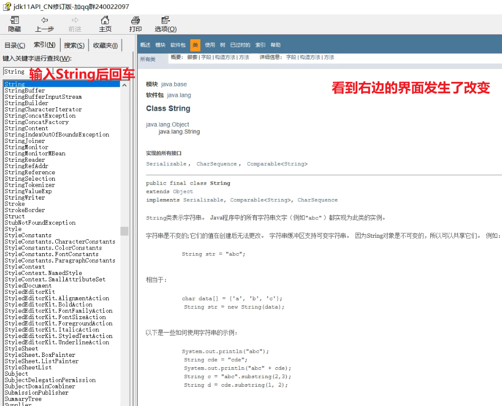
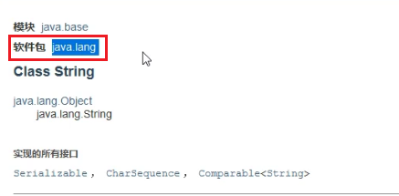
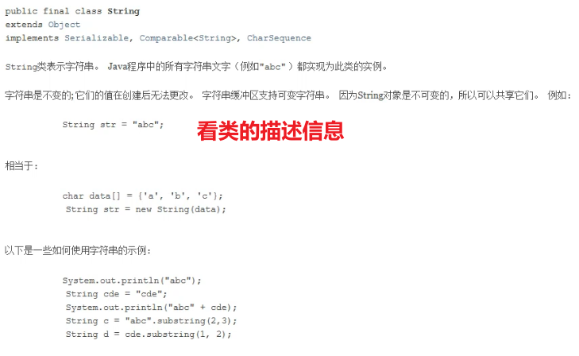
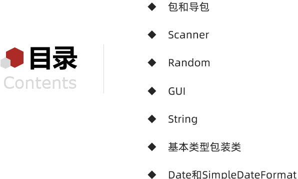
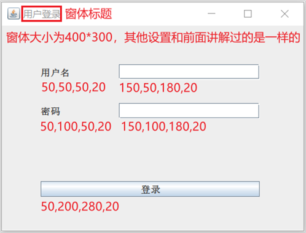
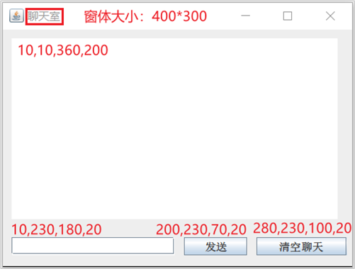
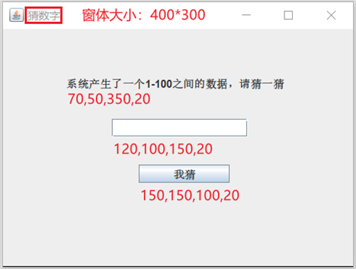
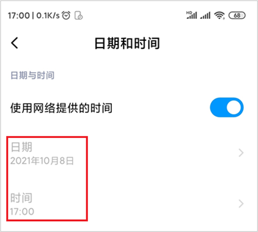
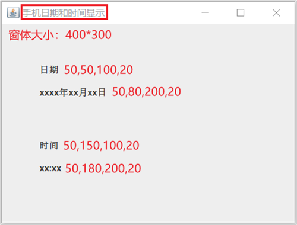

# 常用API(1)

**今日目标：**

- 能够知道什么是API
- 能够使用帮助文档学习API
- 能够理解包和导包
- 能够知道Scanner的作用和基本使用
- 能够知道Random的作用和基本使用
- 能够知道GUI的作用和基本使用
- 能够完成GUI相关的授课案例
- 能够理解事件监听机制
- 能够对按钮添加事件

## 1：API 概述

### 1.1 API概述和课程安排

来，继续啊，我们在讲解面向对象的时候，提到了学习面向对象重点就是学习两块内容：


第一块：学习如何自己设计对象并使用

第二块：学习获取已有对象并使用

而关于第一块知识：学习如何自己设计对象并使用，我们现在已经有一些基础了。

通过前面的学习呢，我们知道了如何定义类，并通过构造方法创建对象，然后通过对象使用成员变量和成员方法。

接下来，我们要学习的是第二块知识：获取已有对象并使用。而获取已有对象并使用呢，在Java中我们习惯称之为常用API的学习。

所以下面我们来学习常用API。首先，我们来说一下什么是API：

- **API(Application Programming Interface)** ：应用程序编程接口

那如何理解应用程序编程接口呢？这里我们通过下面的场景给大家解释一下。

看这里，我想编写一个机器人踢足球的程序，那么程序就要向机器人发出向前跑、向后跑、射门、抢球等各种命令。


如果我自己来编写呢，就会比较麻烦，因为机器人不是我设计的。所以，为了方便其他的开发者使用机器人，

机器人厂商呢就会提供一些用于控制机器人的类，这些类中会定义好操作机器人各种动作的方法。

有了这些类之后，开发一个机器人踢足球的程序就会非常的方便了。

其实，这些类就是机器人厂商提供给开发者的应用程序编程接口，而这些类我们称之为：API

知道了什么是API之后呢，我们来说一下，Java的API。

- **Java API** ：指的就是 JDK 中提供的各种功能的 Java类。

这些类将底层的实现封装了起来，我们不需要关心这些类是如何实现的，只需要学习这些类如何使用即可，

为了帮助我们使用这些类，Java还提供了对应的帮助文档。我们可以通过帮助文档来学习这些API如何使用

下面呢，我们一起来学习一下**帮助文档的使用**：

要想使用帮助文档，首先我们得有一个帮助文档：来，打开课程资料下面，我们这里有一个帮助文档。


这个文档对应的是JDK11版本的，是目前比较新的中文版的帮助文档。

有了文档之后呢，我们来打开帮助文档。

文档打开后，找到索引这里，下面有一个输入框，在这个框框里输入我们要学习的API。


这里，我们拿字符串类做一个说明：在这个框框里面我们输入：String，然后一回车，看到一个新的界面

这个界面中，就是关于String相关的知识了。




接着，我们来说一下，在学习一个API的时候，**我们重点要看四个地方：**

**第一个地方：看类所在的包**



为什么要看这里呢，因为java.lang包下的类，我们是可以直接使用的，不需要导包。

其他包下的类，我们都是要导包后才能使用的，至于如何导包，下个知识我们会讲解。

很明显，String类在使用的时候，我们是不需要导包的。

**第二个地方：看类的描述**

也就是看这里，这里一般描述了类是干什么的。



比如说：String类表示字符串。 Java程序中的所有字符串文字（例如"abc" ）都实现为此类的实例。 

告诉了我们String就是用来表示字符串的类，直接写一个字符串数据：abc就是String类的一个对象。

**第三个地方：看类的构造方法**


往下滑，这就是String类的构造方法，为什么要看构造方法呢？因为我们在使用一个类的时候，其实使用的是该类的对象，

而创建对象，我们是需要通过构造方法实现的，所以，我们得看看它提供了哪些构造方法。

这里的构造方法提供的比较多，至于用哪个，后面我们用到的时候再讲解，目前知道看哪里就行了
	
**第四个地方：看类的成员方法**


这是我们学习一个API的重点，我们之所以学习一个API，重点就是为了使用该API来完成某些功能。

而API的功能，都是通过一个个方法实现的，所以我们重点得看看类的成员方法。往下滑，这就是String提供的成员方法，有很多。

而一个方法，我们重点又看什么呢？回到第一个方法，我们说一下：


先看描述，通过描述，我们就知道了方法是干什么的。

再看方法名和参数，这样我们就知道调用哪个方法，以及参数的类型和个数。

最后，我们看返回值类型，这样我们就知道调用该方法后，最终给我们返回了一个什么类型结果

通过这些步骤，我们就知道了所学习的API该如何使用了，然后就可以到IDEA中去使用API了。

知道了帮助文档的使用步骤后，回到资料我们总结一下**帮助文档的使用流程：**

① 打开帮助文档

② 找到索引选项，输入要学习的API，然后回车

③ 看类所在包：因为java.lang包下的类在使用的时候不需要导包

④ 看类的描述：这样我们就知道了类是干什么的

⑤ 看类的构造方法：这样我们就可以创建对象了

⑥ 看类的成员方法：这样我们就可以通过这些方法完成某些功能了

知道了什么是API，以及通过帮助文档如何学习API后，我们来说一下常用API这部分内容的课程安排：



首先，我们学习一下包和导包的基本概念和操作，为API的使用做一个基础铺垫

接着我们来学习两个API：Scanner和Random

Scanner：是用来实现键盘录入数据的

Random：是用来产生随机数的

通过这两个API的学习，可以让我们熟悉帮助文档的使用

再接着我们来学习GUI相关的API，这里不是一个API的学习，而是多个API的学习，通过这部分内容的学习，可以让我们的操作可视化，也就是有界面了，不在仅仅是在控制台输出数据了。

最后，我们学习这几个API，学习这几个API的目的，是为了完成我们在GUI部分未完成的案例。

好了，到此关于API概述和常用API的课程安排我们就先讲到这里

### 1.2 包和导包

来，继续啊，下面我们来学习一下，包和导包。

那什么是包呢？

- 包其实就是文件夹
- 作用：对类进行分类管理

**包的定义格式：**

- 格式：package 包名;  
- 注意：包名一般是公司域名反写，并且多级包用.分开
- 举例：www.itheima.com
- 范例：package com.itheima;

知道了如何定义包之后，下面我们来定义两个包，并且在不同包下定义同名的类。

```java
package com.itheima_01;

public class Student {
    public void study() {
        System.out.println("好好学习天天向上");
    }
}
```

```java

package com.itheima_01;

public class StudentTest {
    public static void main(String[] args) {
        Student s = new Student();
        s.study();
    }
}
```

```java
package com.itheima_02;

public class StudentTest {
    public static void main(String[] args) {
        com.itheima_01.Student s = new com.itheima_01.Student();
        s.study();

        com.itheima_01.Student s2 = new com.itheima_01.Student();
        s2.study();
    }
}
```

在这里我们讲解了同一个包下类的使用，以及不同包下类的使用。发现不同包下类的使用太麻烦了，所以，这个时候，我们就要学习一下导包了。

使用不同包下的类时，使用的时候要写类的全路径，写起来太麻烦了。

为了简化带包的操作，Java就提供了导包的功能。

**导包的格式：**

- 格式：import 包名;
- 范例：import com.itheima.Student;

知道了如何导包后，我们再来修改一下不同包下类的使用代码：

```java
package com.itheima_02;

import com.itheima_01.Student;
//Alt+Enter 快捷键导包

public class StudentTest {
    public static void main(String[] args) {
        Student s = new Student();
        s.study();

        Student s2 = new Student();
        s2.study();


//        com.itheima_01.Student s = new com.itheima_01.Student();
//        s.study();
//
//        com.itheima_01.Student s2 = new com.itheima_01.Student();
//        s2.study();
    }
}
```

在这里我们讲解了导包的三种方式：

1. 手动导包
2. 快捷键导包
3. 写一个类，写一部分的时候，如果给出了对应的提示，回车后会自动导包

讲解完毕后，大家赶快动手练习一下吧。

## 2：Scanner

### 2.1 Scanner基本使用

了解了API相关的知识后，下面我们来学习一下Scanner的使用。

通过查看帮助文档，我们知道了如下的信息：

**Scanner：**

- 一个简单的文本扫描程序，可以获取基本类型数据和字符串数据

**构造方法：**

- Scanner(InputStream source)：创建 Scanner 对象
- System.in：对应的是InputStream类型，可以表示键盘输入
- Scanner sc = new Scanner(System.in);

**成员方法：**

- int nextInt()：获取一个int类型的数据
- int i = sc.nextInt();

知道了Scanner的构造方法和成员方法后，我们到IDEA中去使用一下：

```java
import java.util.Scanner;

/*
    Scanner的基本使用
 */
public class ScannerDemo {
    public static void main(String[] args) {
        //Scanner(InputStream source)：创建 Scanner 对象
        Scanner sc = new Scanner(System.in);

        //int nextInt()：获取一个int类型的数据
        System.out.println("请输入一个整数：");
        int i = sc.nextInt();

        //输出获取到的数据
        System.out.println("你输入的数据是：" + i);
    }
}
```

讲解完毕后，大家赶快动手练习一下吧。

### 2.2 练习(数据求和)

需求：键盘录入两个整数，求两个数据和，并在控制台输出求和结果

首先，我们来简单的分析一下：

**分析：**

① 创建键盘录入数据对象

② 通过键盘录入数据对象调用nextInt()方法获取数据

③ 对获取的两个整数求和

④ 在控制台输出求和结果

分析完毕后，我们到IDEA中去实现一下：

```java
/*
    需求：键盘录入两个整数，求两个数据和，并在控制台输出求和结果
    分析：
        1:创建键盘录入数据对象
        2:通过键盘录入数据对象调用nextInt()方法获取数据
        3:对获取的两个整数求和
        4:在控制台输出求和结果
 */
public class ScannerTest {
    public static void main(String[] args) {
        //创建键盘录入数据对象
        Scanner sc = new Scanner(System.in);

        //通过键盘录入数据对象调用nextInt()方法获取数据
        System.out.println("请输入第一个整数：");
        int firstNumber = sc.nextInt();

        System.out.println("请输入第二个整数：");
        int secondNumber = sc.nextInt();

        //对获取的两个整数求和
        int sum = firstNumber + secondNumber;

        //在控制台输出求和结果
        System.out.println("求和结果是：" + sum);
    }
}
```

讲解完毕后，大家赶快动手练习一下吧。

## 3：Random

### 3.1 Random基本使用

来，继续啊，下面我们来学习一下Random的使用。

通过查看帮助文档，我们知道了如下的信息：

**Random：**

- 该类的实例用于生成随机数

**构造方法：**

- Random()：创建一个新的随机数生成器

**成员方法：**

- int nextInt(int bound)：获取一个int类型的随机数，参数bound表示获取到的随机数在[0,bound)之间

知道了Random的构造方法和成员方法后，我们到IDEA中去使用一下：

```java
import java.util.Random;

/*
    Random的基本使用
 */
public class RandomDemo {
    public static void main(String[] args) {
        //Random()：创建一个新的随机数生成器
        Random r = new Random();

        //int nextInt(int bound)：获取一个int类型的随机数，参数bound表示获取到的随机数在[0,bound)之间
//        int i = r.nextInt(10);
//        System.out.println(i);

//        for (int i=1; i<=10; i++) {
//            int j = r.nextInt(10);
//            System.out.println(j);
//        }

        //需求：如何获取1-100之间的随机数呢？
//        int number = r.nextInt(100);//0-99
//        int number = r.nextInt(101);//0-100
        int number = r.nextInt(100) + 1;
        System.out.println(number);
    }
}
```

讲解完毕后，大家赶快动手练习一下吧。

### 3.2 练习(猜数字游戏)

需求：系统自动产生一个1-100之间的整数，使用程序实现猜这个数字是多少？

  	猜的时候根据不同情况给出相应的提示

  	如果猜的数字比真实数字大，提示你猜的数据大了

  	如果猜的数字比真实数字小，提示你猜的数据小了

  	如果猜的数字与真实数字相等，提示恭喜你猜中了

首先，我们来简单的分析一下：

**分析：**

① 使用Random获取一个1-100之间的整数

② 使用Scanner实现键盘录入猜的数据值

③ 使用if…else if…else 的格式实现猜数字，并给出对应的提示

分析完毕后，我们到IDEA中去实现一下：

```java
import java.util.Random;
import java.util.Scanner;

/*
    需求：系统自动产生一个1-100之间的整数，使用程序实现猜这个数字是多少？
        猜的时候根据不同情况给出相应的提示
        如果猜的数字比真实数字大，提示你猜的数据大了
        如果猜的数字比真实数字小，提示你猜的数据小了
        如果猜的数字与真实数字相等，提示恭喜你猜中了
    分析：
        1:使用Random获取一个1-100之间的整数
        2:使用Scanner实现键盘录入猜的数据值
        3:使用if…else if…else 的格式实现猜数字，并给出对应的提示
 */
public class RandomTest {
    public static void main(String[] args) {
        //使用Random获取一个1-100之间的整数
        Random r = new Random();
        int number = r.nextInt(100) + 1;
        System.out.println("系统已经产生了一个1-100之间的整数");

        while (true) {
            //使用Scanner实现键盘录入猜的数据值
            Scanner sc = new Scanner(System.in);
            System.out.println("请输入你要猜的数字：");
            int guessNumber = sc.nextInt();

            //使用if…else if…else 的格式实现猜数字，并给出对应的提示
            if (guessNumber > number) {
                System.out.println("你猜的数据" + guessNumber + "大了");
            } else if (guessNumber < number) {
                System.out.println("你猜的数据" + guessNumber + "小了");
            } else {
                System.out.println("恭喜你猜中了");
                break;
            }
        }
    }
}
```

讲解完毕后，大家赶快动手练习一下吧。

## 4：GUI

### 4.1 GUI概述

来，继续啊，下面呢我们来学习GUI相关的API。

首先呢，我们来说一下，什么是GUI：

- **GUI：**Graphical User Interface(图形用户接口)
- 用图形的方式，来显示计算机操作的界面

怎么理解呢？我们把后面要做的案例拿来举例说明一下：

看这里：


这是用户登录的案例，在这个界面上，有显示文本的标签，显示输入内容的文本框以及按钮。

再来看一个：


聊天室的案例，在这个界面上，有显示聊天内容的文本域，显示输入内容的文本框以及操作的按钮。

给出这样的界面，我们自己就能够看明白，非常的方便直观，这就是使用GUI相关的API来实现的。

而Java为GUI提供的API都存在java.awt和javax.Swing两个包中，我们分别来看一下这两个包：

- **java.awt 包：**
  - awt是这三个单词首字母的缩写，翻译过来是抽象窗口工具包，只不过这个包的API，需要调用本地系统方法实现功能，和本地系统有关联，不利于代码移植，属重量级控件
- **javax.swing 包：**
  - 它是在awt的基础上，建立的一套图形界面系统，提供了更多的组件，而且完全由Java实现。增强了移植性，属轻量级控件

所以，我们做图形界面开发使用的是swing包下的类。

这里出现了一个名词：组件。那什么是组件呢？

- **组件**是具有图形表示的对象，该图形表示可以显示在屏幕上并且可以与用户交互

比如说，在用户登录中，文本框和按钮等，都是能够表示图形的对象，所以它们都称为组件。

最后，我们来说一下，我们会用到的常用组件，

看这里：


**组件：**

- **基本组件：**具有图形表示的对象
- **容器组件：**是可以添加组件的组件。也就是在容器中可以通过add方法添加组件，既可以添加基本组件，也可以添加容器组件。

我们先来看常用的基本组件：	

- JButton，这是按钮

- JLabel，这是用来显示文本内容的，或者展示图片使用

- JTextFile，这是文本框，用来输入内容的

- JTextArea，这是文本域，用来输入多行多列的数据的

接着，我们再来看容器组件：

- 面板也是一个容器，我们常用JPanel，后面用到在具体讲解
- 窗体，下面是Frame，这是awt包下，而我们使用的是JFrame，这是swing包下。


看到这里，我要说一下，由于我们使用的都是swing包下的，所以将来使用的组件，都是以J开头的。

好了，GUI相关的基础知识我们就先讲到这里

### 4.2 常用组件

#### 4.2.1 JFrame(初识窗体)

来，继续啊，下面我们来学习JFrame窗体类。

在学习JFrame之前，先说一下，在学习GUI相关的API的时候，我就不带着大家到帮助文档中查看了。

在资料中，我们会把要讲解的类的作用，构造方法，和成员方法给大家展示出来，简单的分析后，到IDEA中去实现。

首先，我们来看一下JFrame：

**JFrame：**

- 是一个顶层窗口

**构造方法：**

- JFrame()：构造一个最初不可见的新窗体

**成员方法：**

- void setVisible(boolean b)：显示或隐藏此窗体具体取决于参数b的值
- void setSize(int width, int height)：调整此组件的大小，使其宽度为width，高度为height，单位是像素

知道了JFrame的构造方法和成员方法后，我们到IDEA中去使用一下：

```java
import javax.swing.*;

/*
    构造方法
        JFrame()：构造一个最初不可见的新窗体

    成员方法
        void setVisible(boolean b)：显示或隐藏此窗体具体取决于参数b的值
        void setSize(int width, int height)：调整此组件的大小，使其宽度为width，高度为height，单位是像素
 */
public class JFrameDemo01 {
    public static void main(String[] args) {
        //JFrame()：构造一个最初不可见的新窗体
        JFrame jf = new JFrame();

        //void setSize(int width, int height)：调整此组件的大小，使其宽度为width，高度为height，单位是像素
        jf.setSize(400,300);

        //void setVisible(boolean b)：显示或隐藏此窗体具体取决于参数b的值
        jf.setVisible(true);
    }
}
```

讲解完毕后，大家赶快动手练习一下吧。

#### 4.2.2 JFrame(常用设置)

来，继续啊，下面呢，我们再来学习几个JFrame窗体的常用方法：

- void setTitle(String title)：设置窗体标题
- void setLocationRelativeTo(Component c)：设置位置，值为null，则窗体位于屏幕中央
- void setDefaultCloseOperation(int operation)：设置窗体关闭时默认操作
  - 整数3表示：窗口关闭时退出应用程序
- void setAlwaysOnTop(boolean alwaysOnTop)：设置此窗口是否应始终位于其他窗口之上

了解了这几个方法后，我们到IDEA中去使用一下：

```java
import javax.swing.*;

/*
    void setTitle(String title)：设置窗体标题
    void setLocationRelativeTo(Component c)：设置位置，值为null，则窗体位于屏幕中央
    void setDefaultCloseOperation(int operation)：设置窗体关闭时默认操作(整数3表示：窗口关闭时退出应用程序)
    void setAlwaysOnTop(boolean alwaysOnTop)：设置此窗口是否应始终位于其他窗口之上
 */
public class JFrameDemo02 {
    public static void main(String[] args) {
        //创建窗体对象
        JFrame jf = new JFrame();

        //void setTitle(String title)：设置窗体标题
        jf.setTitle("百度一下，你就知道");
        //设置窗体大小
        jf.setSize(400, 300);
        //void setDefaultCloseOperation(int operation)：设置窗体关闭时默认操作(整数3表示：窗口关闭时退出应用程序)
        jf.setDefaultCloseOperation(3);
        //void setLocationRelativeTo(Component c)：设置位置，值为null，则窗体位于屏幕中央
        jf.setLocationRelativeTo(null);
        //void setAlwaysOnTop(boolean alwaysOnTop)：设置此窗口是否应始终位于其他窗口之上
        jf.setAlwaysOnTop(true);

        //设置窗体可见
        jf.setVisible(true);
    }
}
```

讲解完毕后，大家赶快动手练习一下吧。

#### 4.2.3 JButton(窗口中添加按钮)

来，继续啊，下面我们来学习JButton，它是按钮的实现。

**JButton：**

- 按钮的实现

**构造方法：**

- JButton(String text)：创建一个带文本的按钮

**成员方法：**

- void setSize(int width, int height)：设置大小
- void setLocation(int x, int y)：设置位置(x坐标，y坐标)

知道了JButton的构造方法和成员方法后，我们到IDEA中去使用一下：

```java
import javax.swing.*;

/*
    构造方法
        JButton(String text)：创建一个带文本的按钮

    成员方法
        void setSize(int width, int height)：设置大小
        void setLocation(int x, int y)：设置位置(x坐标，y坐标)
 */
public class JButtonDemo {
    public static void main(String[] args) {
        //创建窗体对象
        JFrame jf = new JFrame();

        jf.setTitle("窗口中添加按钮");
        jf.setSize(400, 300);
        jf.setDefaultCloseOperation(3);
        jf.setLocationRelativeTo(null);
        jf.setAlwaysOnTop(true);
        jf.setLayout(null); //取消窗体的默认布局

        //JButton(String text)：创建一个带文本的按钮
        JButton btn = new JButton("我是按钮");
//        //void setSize(int width, int height)：设置大小
//        btn.setSize(100,20);
//        //void setLocation(int x, int y)：设置位置(x坐标，y坐标)
////        btn.setLocation(0,0);
//        btn.setLocation(100,100);
        btn.setBounds(100,100,100,20);

        JButton btn2 = new JButton("我是按钮2");
        btn2.setBounds(100,120,100,20);

        jf.add(btn);
        jf.add(btn2);

        //设置窗体可见
        jf.setVisible(true);
    }
}
```

演示完毕之后，回到资料再总结一下：

**JButton：**

- 按钮的实现

**构造方法：**

- JButton(String text)：创建一个带文本的按钮

**成员方法：**

- void setSize(int width, int height)：设置大小
- void setLocation(int x, int y)：设置位置(x坐标，y坐标)

- <font color='red'>**void setBounds(int x, int y, int width, int height)：设置位置和大小**</font>

**和窗体相关操作：**

- 取消窗体默认布局：<font color='red'>**窗体对象.setLayout(null);**</font>
- 把按钮添加到窗体：<font color='red'>**窗体对象.add(按钮对象);**</font>

讲解完毕后，大家赶快动手练习一下吧。

#### 4.2.4 JLabel(显示文本和图像)

来，继续啊，下面呢，我们来学习JLable，它是用来做短文本字符串或图像的显示的。

 **JLable：**

- 短文本字符串或图像的显示区域

**构造方法：**

- JLabel(String text)：使用指定的文本创建 JLabel实例
- JLabel(Icon image)：使用指定的图像创建 JLabel实例
  - ImageIcon(String filename)：从指定的文件创建ImageIcon
  - 文件路径：绝对路径和相对路径
  - 绝对路径：完整的路径名，不需要任何其他信息就可以定位它所表示的文件
    - 例如：D:\IdeaProjects\javase_code\itheima-api-gui\images\mn.png
  - 相对路径：必须使用取自其他路径名的信息进行解释
    - 例如：itheima-api-gui\images\mn.png

**成员方法：**

- void setBounds(int x, int y, int width, int height)：设置位置和大小

知道了JLabel的构造方法和成员方法后，我们到IDEA中去使用一下：

```java
import javax.swing.*;

/*
    构造方法
        JLabel(String text)：使用指定的文本创建 JLabel实例
        JLabel(Icon image)：使用指定的图像创建 JLabel实例
            ImageIcon(String filename)：从指定的文件创建ImageIcon
    成员方法
        void setBounds(int x, int y, int width, int height)：设置位置和大小
 */
public class JLabelDemo {
    public static void main(String[] args) {
        //创建窗体对象
        JFrame jf = new JFrame();

        jf.setTitle("显示文本和图像");
        jf.setSize(400, 300);
        jf.setDefaultCloseOperation(3);
        jf.setLocationRelativeTo(null);
        jf.setAlwaysOnTop(true);
        jf.setLayout(null);

        //JLabel(String text)：使用指定的文本创建 JLabel实例
        JLabel jLabel = new JLabel("好好学习");
        jLabel.setBounds(0,0,100,20);

        //JLabel(Icon image)：使用指定的图像创建 JLabel实例
        //ImageIcon(String filename)：从指定的文件创建ImageIcon
        //D:\IdeaProjects\javase_code\itheima-api-gui\images\mn.png
//        ImageIcon imageIcon = new ImageIcon("D:\\IdeaProjects\\javase_code\\itheima-api-gui\\images\\mn.png");
//        JLabel jLabel2 = new JLabel(imageIcon);
//        JLabel jLabel2 = new JLabel(new ImageIcon("D:\\IdeaProjects\\javase_code\\itheima-api-gui\\images\\mn.png"));
        JLabel jLabel2 = new JLabel(new ImageIcon("itheima-api-gui\\images\\mn.png"));
        jLabel2.setBounds(50,50,100,143);

        jf.add(jLabel);
        jf.add(jLabel2);

        //设置窗体可见
        jf.setVisible(true);
    }
}
```

讲解完毕后，大家赶快动手练习一下吧。

<font color='red'>**注意：**</font>在实际开发中，大家不用担心每个组件的位置和大小。因为这些都是前端人员设计好的。

### 4.3 案例

来，继续啊，下面呢，我们通过几个案例，来使用一下GUI中的常用组件。目前呢，我们仅仅是把界面做出来，下一次课呢，我们就要把最终的功能给实现了。首先，我们来看第一个案例。

#### 4.3.1 案例1(用户登录)

需求：如图所示，做出界面

提示：给出的数据就是按照组件位置和大小给出的



首先，我们来简单的分析一下：

**分析：**

① 2个JLabel

② 2个JTextField

③ 1个JButton

分析完毕后，我们到IDEA中去实现一下：

```java
import javax.swing.*;

/*
    用户登录
 */
public class UserLogin {
    public static void main(String[] args) {
        //创建窗体对象
        JFrame jf = new JFrame();

        jf.setTitle("用户登录");
        jf.setSize(400, 300);
        jf.setDefaultCloseOperation(3);
        jf.setLocationRelativeTo(null);
        jf.setAlwaysOnTop(true);
        jf.setLayout(null);

        //显示用户名文本
        JLabel usernameLable = new JLabel("用户名");
        usernameLable.setBounds(50,50,50,20);
        jf.add(usernameLable);

        //用户名输入框
        JTextField usernameField = new JTextField();
        usernameField.setBounds(150,50,180,20);
        jf.add(usernameField);

        //显示密码文本
        JLabel passwordLable = new JLabel("密码");
        passwordLable.setBounds(50,100,50,20);
        jf.add(passwordLable);

        //密码输入框
//        JTextField passwordField = new JTextField();
//        passwordField.setBounds(150,100,180,20);
//        jf.add(passwordField);

        JPasswordField passwordField = new JPasswordField();
        passwordField.setBounds(150,100,180,20);
        jf.add(passwordField);

        //登录按钮
        JButton loginButton = new JButton("登录");
        loginButton.setBounds(50,200,280,20);
        jf.add(loginButton);

        jf.setVisible(true);
    }
}
```

在讲解的过程中，引入了一个新的组件JPasswordField，用来表示密码框。

讲解完毕后，大家赶快动手练习一下吧。

#### 4.3.2 案例2(聊天室)

需求：如图所示，做出界面

提示：给出的数据就是按照组件位置和大小给出的



首先，我们来简单的分析一下：

**分析：**

① 1个JTextArea

② 1个JTextField

③ 2个JButton

分析完毕后，我们到IDEA中去实现一下：

```java
import javax.swing.*;

/*
    聊天室
 */
public class ChatRoom {
    public static void main(String[] args) {
        //创建窗体对象
        JFrame jf = new JFrame();

        jf.setTitle("聊天室");
        jf.setSize(400, 300);
        jf.setDefaultCloseOperation(3);
        jf.setLocationRelativeTo(null);
        jf.setAlwaysOnTop(true);
        jf.setLayout(null);

        //显示聊天信息的文本域
        JTextArea messageArea = new JTextArea();
        messageArea.setBounds(10,10,360,200);
        jf.add(messageArea);

        //输入聊天信息的文本框
        JTextField messageField = new JTextField();
        messageField.setBounds(10,230,180,20);
        jf.add(messageField);

        //发送按钮
        JButton sendButton = new JButton("发送");
        sendButton.setBounds(200,230,70,20);
        jf.add(sendButton);

        //清空聊天按钮
        JButton clearButton = new JButton("清空聊天");
        clearButton.setBounds(280,230,100,20);
        jf.add(clearButton);

        jf.setVisible(true);
    }
}
```

讲解完毕后，大家赶快动手练习一下吧。

#### 4.3.3 案例3(猜数字)

需求：如图所示，做出界面

提示：给出的数据就是按照组件位置和大小给出的



首先，我们来简单的分析一下：

**分析：**

① 1个JLabel

② 1个JTextField

③ 1个JButton

分析完毕后，我们到IDEA中去实现一下：

```java
import javax.swing.*;

/*
    猜数字
 */
public class GuessNumber {
    public static void main(String[] args) {
        //创建窗体对象
        JFrame jf = new JFrame();

        jf.setTitle("猜数字");
        jf.setSize(400, 300);
        jf.setDefaultCloseOperation(3);
        jf.setLocationRelativeTo(null);
        jf.setAlwaysOnTop(true);
        jf.setLayout(null);

        //提示信息
        JLabel messageLable = new JLabel("系统产生了一个1-100之间的数据，请猜一猜");
        messageLable.setBounds(70,50,350,20);
        jf.add(messageLable);

        //输入要猜的数字
        JTextField numberField = new JTextField();
        numberField.setBounds(120,100,150,20);
        jf.add(numberField);

        //猜数字的按钮
        JButton guessButton = new JButton("我猜");
        guessButton.setBounds(150,150,100,20);
        jf.add(guessButton);

        jf.setVisible(true);
    }
}
```

讲解完毕后，大家赶快动手练习一下吧。

#### 4.3.4 案例4(手机日期和时间显示)

需求：如图所示，做出界面

提示：给出的数据就是按照组件位置和大小给出的

参照图：



我们要实现的图：



首先，我们来简单的分析一下：

**分析：**

① 4个JLabel

分析完毕后，我们到IDEA中去实现一下：

```java
import javax.swing.*;

/*
    手机日期和时间显示
 */
public class ShowDateTime {
    public static void main(String[] args) {
        //创建窗体对象
        JFrame jf = new JFrame();

        jf.setTitle("手机日期和时间显示");
        jf.setSize(400, 300);
        jf.setDefaultCloseOperation(3);
        jf.setLocationRelativeTo(null);
        jf.setAlwaysOnTop(true);
        jf.setLayout(null);

        //提示日期
        JLabel dateLable = new JLabel("日期");
        dateLable.setBounds(50,50,100,20);
        jf.add(dateLable);

        //按照格式显示日期的字符串
        JLabel showDateLable = new JLabel("xxxx年xx月xx日");
        showDateLable.setBounds(50,80,200,20);
        jf.add(showDateLable);

        //提示时间
        JLabel timeLable = new JLabel("时间");
        timeLable.setBounds(50,150,100,20);
        jf.add(timeLable);

        //按照格式显示时间的字符串
        JLabel showTimeLable = new JLabel("xx:xx");
        showTimeLable.setBounds(50,180,200,20);
        jf.add(showTimeLable);

        jf.setVisible(true);
    }
}
```

讲解完毕后，大家赶快动手练习一下吧。

#### 4.3.5 案例5(考勤查询)

需求：如图所示，做出界面

提示：给出的数据就是按照组件位置和大小给出的


首先，我们来简单的分析一下：

**分析：**

① 3个JLabel

② 2个JTextField

③ 1个JButton

分析完毕后，我们到IDEA中去实现一下：

```java
import javax.swing.*;

/*
    考勤查询
 */
public class AttendanceQuery01 {
    public static void main(String[] args) {
        //创建窗体对象
        JFrame jf = new JFrame();

        jf.setTitle("考勤查询");
        jf.setSize(400, 300);
        jf.setDefaultCloseOperation(3);
        jf.setLocationRelativeTo(null);
        jf.setAlwaysOnTop(true);
        jf.setLayout(null);

        //显示考勤日期的文本
        JLabel dateLable = new JLabel("考勤日期");
        dateLable.setBounds(50,20,100,20);
        jf.add(dateLable);

        //显示开始时间文本
        JLabel startDateLable = new JLabel("开始时间");
        startDateLable.setBounds(50,70,100,20);
        jf.add(startDateLable);

        //开始时间输入框
        JTextField startDateField = new JTextField();
        startDateField.setBounds(50,100,100,20);
        jf.add(startDateField);

        //显示结束时间文本
        JLabel endDateLable = new JLabel("结束时间");
        endDateLable.setBounds(250,70,100,20);
        jf.add(endDateLable);

        //结束时间输入框
        JTextField endDateField = new JTextField();
        endDateField.setBounds(250,100,100,20);
        jf.add(endDateField);

        //确定按钮
        JButton confirmButton = new JButton("确定");
        confirmButton.setBounds(250,180,60,20);
        jf.add(confirmButton);

        jf.setVisible(true);
    }
}
```

讲解完毕后，大家赶快动手练习一下吧。

#### 4.3.6 案例5(考勤查询之日历控件)

需求：用日历控件改进考勤查询的日期字符串填写

来，继续啊，下面我们来学习考勤查询之日历控件

首先，我们看一下需求：用日历控件改进考勤查询的日期字符串填写

什么意思呢？我们刚在做的考勤查询系统，是需要手动输入日期字符串的，而在实际开发中，我们一般会选择使用日历控件来实现，

也就是下面这个样子的，我们点击一下，就会出现日历控件，我们选择日期就可以了。


这个相信大家有见过。

知道了要做什么之后，下面我们来说一下，怎么做。

我们可以自己写这个日历控件，也可以使用别人写好的日历控件。鉴于目前所学知识有限，我们先使用别人提供的日历控件。

这里呢，我准备好了一个**日历控件类(DateChooser.java)**，我们到IDEA中一起去看一下如何使用：

```java
public static void main(String[] args) {
    //创建窗体
    JFrame jf = new JFrame();

    //设置窗体大小
    jf.setSize(400, 300);
    //设置窗体标题
    jf.setTitle("日历控件");
    //设置位置，值为null，则窗体位于屏幕中央
    jf.setLocationRelativeTo(null);
    //设置窗体关闭时默认操作，窗口关闭时退出应用程序
    jf.setDefaultCloseOperation(3);
    //设置此窗口是否应始终位于其他窗口之上
    jf.setAlwaysOnTop(true);
    //取消窗体默认布局：窗体对象.setLayout(null);
    jf.setLayout(null);

    //创建日期选择器对象，指定日期字符串格式
    DateChooser dateChooser = DateChooser.getInstance("yyyy-MM-dd");

    JTextField showDateField = new JTextField("单击选择日期");
    showDateField.setBounds(50, 50, 100, 20);

    //把日历控件和文本框进行绑定
    dateChooser.register(showDateField);

    jf.add(showDateField);

    jf.setVisible(true);
}
```

了解了如何使用日历控件后，我们把开始写的代码改进一下：

```java
import javax.swing.*;

/*
    考勤查询
 */
public class AttendanceQuery02 {
    public static void main(String[] args) {
        //创建窗体对象
        JFrame jf = new JFrame();

        jf.setTitle("考勤查询");
        jf.setSize(400, 300);
        jf.setDefaultCloseOperation(3);
        jf.setLocationRelativeTo(null);
        jf.setAlwaysOnTop(true);
        jf.setLayout(null);

        //显示考勤日期的文本
        JLabel dateLable = new JLabel("考勤日期");
        dateLable.setBounds(50,20,100,20);
        jf.add(dateLable);

        //显示开始时间文本
        JLabel startDateLable = new JLabel("开始时间");
        startDateLable.setBounds(50,70,100,20);
        jf.add(startDateLable);

        DateChooser dateChooser1 = DateChooser.getInstance("yyyy/MM/dd");
        DateChooser dateChooser2 = DateChooser.getInstance("yyyy/MM/dd");
        //开始时间输入框
        JTextField startDateField = new JTextField();
        startDateField.setBounds(50,100,100,20);
        dateChooser1.register(startDateField);
        jf.add(startDateField);

        //显示结束时间文本
        JLabel endDateLable = new JLabel("结束时间");
        endDateLable.setBounds(250,70,100,20);
        jf.add(endDateLable);

        //结束时间输入框
        JTextField endDateField = new JTextField();
        endDateField.setBounds(250,100,100,20);
        dateChooser2.register(endDateField);
        jf.add(endDateField);

        //确定按钮
        JButton confirmButton = new JButton("确定");
        confirmButton.setBounds(250,180,60,20);
        jf.add(confirmButton);

        jf.setVisible(true);
    }
}
```

讲解完毕后，大家赶快动手练习一下吧。

### 4.4 事件监听机制

来，继续啊，目前呢，我们做好了几个GUI的界面，但是具体的功能，我们没法实现。因为要想实现功能，就必须要学习一下事件监听机制。

这里，我们一起来说一下**事件监听机制的组成：**

- **事件源：**事件发生的地方。可以是按钮，窗体，图片等
- **事件：**发生了什么事情。例如：鼠标点击事件，键盘按下事件等
- **事件绑定：**把事件绑定到事件源上，当发生了某个事件，则触发对应的处理逻辑
  - 事件源对象. addXXXListener(事件);

GUI中的事件比较多，这里呢，我们先告诉一下大家如何给按钮添加事件，能够把我们前面的案例给实现就可以了。至于其他事件，后面我们用到的时候再去学习。


了解了如何给按钮添加事件后，我们到IDEA中去体验一下：

```java
import javax.swing.*;
import java.awt.event.ActionEvent;
import java.awt.event.ActionListener;

/*
    事件监听机制
 */
public class ActionListenerDemo {
    public static void main(String[] args) {
        //创建窗体对象
        JFrame jf = new JFrame();

        jf.setTitle("事件监听机制");
        jf.setSize(400, 300);
        jf.setDefaultCloseOperation(3);
        jf.setLocationRelativeTo(null);
        jf.setAlwaysOnTop(true);
        jf.setLayout(null);

        //创建按钮
        JButton jButton = new JButton("你点我啊");
        jButton.setBounds(0, 0, 100, 100);
        jf.add(jButton);

        jButton.addActionListener(new ActionListener() {
            @Override
            public void actionPerformed(ActionEvent e) {
                System.out.println("你点我啊");
            }
        });

        jf.setVisible(true);
    }
}
```

讲解完毕后，大家赶快动手练习一下吧。