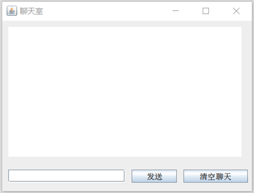
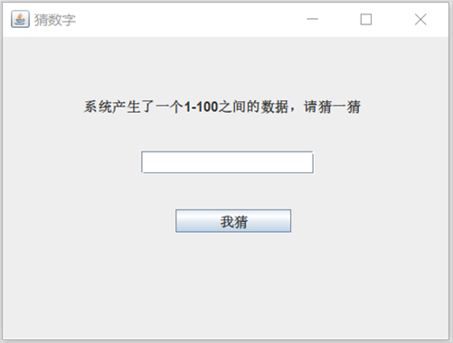

# 常用API(2)

**今日目标：**

- 能够使用String类的功能完成用户登录案例
- 能够使用String类的功能完成聊天室案例
- 能够使用Integer类的功能完成猜数字案例
- 能够使用Date类和SimpleDateFormat类的功能完成手机日期和时间显示案例
- 能够使用Date类和SimpleDateFormat类的功能完成考勤查询案例

## 1：String

### 1.1 String(构造方法)

来，继续啊，前面我们做过了GUI中的案例，也就是把一些小应用的界面做好了，但是具体功能并没有实现。接下来呢，我们就来一起实现一下。

首先，我们先来学习String类，它涉及到两个案例：用户登录和聊天室。

先来看用户登录案例：需要输入用户名和密码，和已知的用户名和密码进行比较，涉及到比较的方法，

一般来说，用户名和密码的长度可能会有一定限制，涉及到获取字符串长度的方法，


再来看聊天室案例，这里输入聊天的内容，然后把聊天内容显示到上面的文本域。

在聊天的时候，可能不小心打了空格，我们不需要的，需要去掉前后空格，


当然了，还有很多其他的成员方法，只不过，目前我们暂时用不上，后面用的时候再讲。

下面，我们就来学习一下字符串类String，最后完成用户登录案例和聊天室案例。

而关于String类呢，我们先到帮助文档中去查看，然后回来总结，最后到IDEA中去演示。

来，打开我们准备好的帮助文档，关于通过帮助文档查看String，大家按照老师讲解的API的使用步骤看看即可。

通过文档了解了String类之后，下面我们回到资料中总结一下：

**String：**

- String类表示字符串。 Java程序中的所有字符串文字（例如"abc" ）都实现为此类的实例

**构造方法：**

- String()：初始化新创建的 String对象，使其表示空字符序列
- String(String original)：初始化新创建的String对象，使其表示与参数相同的字符序列

知道了String的构造方法后，我们到IDEA中去使用一下：

```java
/*
    String类表示字符串。 Java程序中的所有字符串文字（例如"abc" ）都实现为此类的实例

    构造方法：
        String()：初始化新创建的 String对象，使其表示空字符序列
        String(String original)：初始化新创建的String对象，使其表示与参数相同的字符序列
 */
public class StringDemo01 {
    public static void main(String[] args) {
        //String()：初始化新创建的 String对象，使其表示空字符序列
        String s1 = new String();
        System.out.println(s1);
        //int length() 返回此字符串的长度
        System.out.println(s1.length());
        System.out.println("------------");

        //String(String original)：初始化新创建的String对象，使其表示与参数相同的字符序列
        String s2 = new String("itheima");
        System.out.println(s2);
        System.out.println(s2.length());
        System.out.println("------------");

        //Java程序中的所有字符串文字（例如"abc" ）都实现为此类的实例
        String s3 = "itheima";
        System.out.println(s3);
        System.out.println(s3.length());
    }
}
```

讲解完毕后，大家赶快动手练习一下吧。

### 1.2 String(成员方法)

来，继续啊，下面我们来学习String类中常用的成员方法：

- int length()：返回此字符串的长度
- boolean equals(Object anObject)：将此字符串与指定的对象进行比较
- boolean equalsIgnoreCase(String anotherString)：将此 String与另一个 String比较，忽略了大小写
- String trim()：返回一个字符串，其值为此字符串，删除了所有前导和尾随空格

而关于这几个成员方法呢，我们到IDEA中一边使用，一边讲解。

```java
/*
    int length()：返回此字符串的长度
    boolean equals(Object anObject)：将此字符串与指定的对象进行比较
    boolean equalsIgnoreCase(String anotherString)：将此 String与另一个 String比较，忽略了大小写
    String trim()：返回一个字符串，其值为此字符串，删除了所有前导和尾随空格
 */
public class StringDemo02 {
    public static void main(String[] args) {
        String s1 = "itheima";
        String s2 = "itheima";
        String s3 = "Itheima";

        //boolean equals(Object anObject)：将此字符串与指定的对象进行比较
        System.out.println(s1.equals(s2));
        System.out.println(s1.equals(s3));

        //boolean equalsIgnoreCase(String anotherString)：将此 String与另一个 String比较，忽略了大小写
        System.out.println(s1.equalsIgnoreCase(s2));
        System.out.println(s1.equalsIgnoreCase(s3));
        System.out.println("-------------------");

        String s4 = " itheima ";
        //String trim()：返回一个字符串，其值为此字符串，删除了所有前导和尾随空格
        System.out.println(s4);
        System.out.println(s4.trim());

        String s5 = "it heima";
        System.out.println(s5.trim());
    }
}
```

讲解完毕后，大家赶快动手练习一下吧。

### 1.3 GUI案例1(用户登录实现)

需求：根据下列要求，完成用户登录的逻辑，并给出相应的提示


要求：

① 已知的用户名和密码

  	用户名：itheima

  	密码：123456

② 用户名和密码的长度都是6-12位

③ 点击登录按钮

  	先判断输入的用户名和密码是否符合要求

  	再判断用户登录是否成功

知道了用户登录案例的需求和要求后，下面我们到IDEA中去实现一下：

```java
import javax.swing.*;
import java.awt.event.ActionEvent;
import java.awt.event.ActionListener;

/*
    1:已知的用户名和密码
        用户名：itheima
       密码：123456
    2:用户名和密码的长度都是6-12位
    3:点击登录按钮
       先判断输入的用户名和密码是否符合要求
       再判断用户登录是否成功
 */
public class UserLogin {
    public static void main(String[] args) {
        //创建窗体对象
        JFrame jf = new JFrame();

        jf.setTitle("用户登录");
        jf.setSize(400, 300);
        jf.setDefaultCloseOperation(3);
        jf.setLocationRelativeTo(null);
        jf.setAlwaysOnTop(true);
        jf.setLayout(null);

        //显示用户名文本
        JLabel usernameLable = new JLabel("用户名");
        usernameLable.setBounds(50, 50, 50, 20);
        jf.add(usernameLable);

        //用户名输入框
        JTextField usernameField = new JTextField();
        usernameField.setBounds(150, 50, 180, 20);
        jf.add(usernameField);

        //显示密码文本
        JLabel passwordLable = new JLabel("密码");
        passwordLable.setBounds(50, 100, 50, 20);
        jf.add(passwordLable);

        //密码输入框
        JPasswordField passwordField = new JPasswordField();
        passwordField.setBounds(150, 100, 180, 20);
        jf.add(passwordField);

        //登录按钮
        JButton loginButton = new JButton("登录");
        loginButton.setBounds(50, 200, 280, 20);
        jf.add(loginButton);

        //已知的用户名和密码
        String name = "itheima";
        String pwd = "123456";

        loginButton.addActionListener(new ActionListener() {
            @Override
            public void actionPerformed(ActionEvent e) {
                //获取用户输入的用户名和密码
                String username = usernameField.getText();
                String password = passwordField.getText();

                //先判断输入的用户名和密码是否符合要求
                //用户名和密码的长度都是6-12位
                if(username.length()<6 || username.length()>12) {
//                    System.out.println("用户名的长度是6-12位，请重新输入");
                    //静态的成员方法和成员变量是可以通过类名访问的
                    JOptionPane.showMessageDialog(jf,"用户名的长度是6-12位，请重新输入");
                    usernameField.setText("");
                    return;
                }

                //再判断用户登录是否成功
                if(username.equals(name) && password.equals(pwd)) {
//                    System.out.println("登录成功");
                    JOptionPane.showMessageDialog(jf,"登录成功");
                    usernameField.setText("");
                    passwordField.setText("");
                } else {
//                    System.out.println("用户名或者密码有误");
                    JOptionPane.showMessageDialog(jf,"用户名或者密码有误");
                }
            }
        });

        jf.setVisible(true);
    }
}
```

讲解完毕后，大家赶快动手练习一下吧。

### 1.4 GUI案例2(聊天室实现)

需求：根据下列要求，完成聊天室的逻辑



要求：

① 把文本框的内容发送到文本域中

② 每次发送的文本内容不带前后空格

③ 多次发送的内容在文本域以追加的方式呈现

④ 清空聊天就是把文本域的内容设置为空

知道了聊天室案例的需求和要求后，下面我们到IDEA中去实现一下：

```java
import javax.swing.*;
import java.awt.event.ActionEvent;
import java.awt.event.ActionListener;

/*
    1:把文本框的内容发送到文本域中
    2:每次发送的文本内容不带前后空格
    3:多次发送的内容在文本域以追加的方式呈现
    4:清空聊天就是把文本域的内容设置为空
 */
public class ChatRoom {
    public static void main(String[] args) {
        //创建窗体对象
        JFrame jf = new JFrame();

        jf.setTitle("聊天室");
        jf.setSize(400, 300);
        jf.setDefaultCloseOperation(3);
        jf.setLocationRelativeTo(null);
        jf.setAlwaysOnTop(true);
        jf.setLayout(null);

        //显示聊天信息的文本域
        JTextArea messageArea = new JTextArea();
        messageArea.setBounds(10, 10, 360, 200);
        jf.add(messageArea);

        //输入聊天信息的文本框
        JTextField messageField = new JTextField();
        messageField.setBounds(10, 230, 180, 20);
        jf.add(messageField);

        //发送按钮
        JButton sendButton = new JButton("发送");
        sendButton.setBounds(200, 230, 70, 20);
        jf.add(sendButton);

        //清空聊天按钮
        JButton clearButton = new JButton("清空聊天");
        clearButton.setBounds(280, 230, 100, 20);
        jf.add(clearButton);

        sendButton.addActionListener(new ActionListener() {
            @Override
            public void actionPerformed(ActionEvent e) {
                //获取文本框的内容
//                String message = messageField.getText();
//                messageField.setText("");

                //每次发送的文本内容不带前后空格
//                String message = messageField.getText();
//                message = message.trim();
                String message = messageField.getText().trim(); //链式调用
                messageField.setText("");


                //把文本框的内容发送到文本域中
//                messageArea.setText(message);
                //多次发送的内容在文本域以追加的方式呈现
                messageArea.append(message+"\n");
            }
        });

        clearButton.addActionListener(new ActionListener() {
            @Override
            public void actionPerformed(ActionEvent e) {
                //清空聊天就是把文本域的内容设置为空
                messageArea.setText("");
            }
        });

        jf.setVisible(true);
    }
}
```

讲解完毕后，大家赶快动手练习一下吧。

## 2：Integer

### 2.1 Integer(构造方法)

来，继续啊，下面我们来学习基本类型包装类，它涉及到1个案例：猜数字。


来，我们一起看一下，在这个输入框里，我们要输入一个猜的数据，然后点击我猜这个按钮，和已经产生的数据进行比对，给出相应的提示即可。

而且呢，猜数字案例的基本逻辑，我们前面是讲解过的，只不过当时使用的是键盘录入数据，而这里我们采用的是在输入框里输入数据而已。

那我们为什么要学习基本类型包装类呢？

因为，在输入框里输入的数据，我们得到的是一个字符串数据，而实际比较的时候我们需要的是一个int类型的数据，所以，我们得想办法把字符串数据转换为int类型的数据。

为了实现这个效果，Java就提供了基本类型包装类供我们使用。所以，我们说，将基本数据类型封装成对象的好处就是可以通过对象调用方法操作数据。

而我们常用的操作之一呢：就是用于基本数据类型与字符串之间的转换。

在这里呢，我们一起来看一下，八种基本数据类型和其对应的包装类类型


从名字上看，包装类类型就是把基本类型的第一个单词改为大写即可。

当然，这里也有两个比较特殊的，一个是int类型的包装类，一个是字符类型的包装类，它们的包装类名称是这个样子的，大家了解一下即可。

下面呢，我们以Integer举例来讲解字符串和int类型之间的相互转换，其他基本类型和字符串的转换方式类似，在使用的时候，大家参照Integer的使用即可。

而关于Integer类的学习呢，我们先到帮助文档中去查看，然后回来总结，最后到IDEA中去演示。

来，打开我们准备好的帮助文档，关于通过帮助文档查看Integer，大家按照老师讲解的API的使用步骤看看即可。

通过文档了解了Integer类之后，下面我们回到资料中总结一下：

**Integer：**

- Integer类在对象中包装基本类型int的值

**构造方法：**

- Integer(int value)：根据 int 值创建 Integer 对象(过时)
- Integer(String s)：根据 String 值创建 Integer 对象(过时)

**成员方法：**

- static Integer valueOf(int i)：返回表示指定的 int 值的 Integer 实例
- static Integer valueOf(String s)：返回一个保存指定值的 Integer 对象 String

知道了Integer的构造方法后，我们到IDEA中去使用一下：

```java
/*
    构造方法
        Integer(int value)：根据 int 值创建 Integer 对象(过时)
        Integer(String s)：根据 String 值创建 Integer 对象(过时)

    成员方法
        static Integer valueOf(int i)：返回表示指定的 int 值的 Integer 实例
        static Integer valueOf(String s)：返回一个保存指定值的 Integer 对象 String
 */
public class IntegerDemo01 {
    public static void main(String[] args) {
//        //Integer(int value)：根据 int 值创建 Integer 对象(过时)
//        Integer i1 = new Integer(100);
//        System.out.println(i1);
//
//        //Integer(String s)：根据 String 值创建 Integer 对象(过时)
//        Integer i2 = new Integer("100");
//        System.out.println(i2);

//        static Integer valueOf(int i)：返回表示指定的 int 值的 Integer 实例
//        static Integer valueOf(String s)：返回一个保存指定值的 Integer 对象 String
        Integer i1 = Integer.valueOf(100);
        Integer i2 = Integer.valueOf("100");
        System.out.println(i1);
        System.out.println(i2);
    }
}
```

讲解完毕后，大家赶快动手练习一下吧。

### 2.2 Integer(int和String的相互转换)

来，继续啊，下面我们来学习int类型数据和String类型数据的相互转换，关于它们之间的相互转换，我们先到IDEA中去讲解，然后回来总结。

```java
/*
    int和String的相互转换
 */
public class IntegerDemo02 {
    public static void main(String[] args) {
        //int --- String
        int number = 100;
        //方式1
        String s1 = number + "";
        System.out.println(s1);
        //方式2
        //static String valueOf(int i)
        String s2 = String.valueOf(number);
        System.out.println(s2);
        System.out.println("---------------");

        //String --- int
        String s = "100";
        //方式1：String --- Integer --- int
        Integer i = Integer.valueOf(s);
        //int intValue() 返回此值 Integer为 int
        int x = i.intValue();
        System.out.println(x);
        //方式2
        //static int parseInt(String s)
        int y = Integer.parseInt(s);
        System.out.println(y);
    }
}
```

讲解完毕int类型和String类型的相互转换后，回到资料总结一下：

- **int 转换为 String**
  - <font color='red'>**static String valueOf(int i)：**</font>返回 int 参数的字符串表示形式。该方法是 String 类中的方法
- **String 转换为 int**
  - <font color='red'>**static int parseInt(String s)：**</font>将字符串解析为 int 类型。该方法是 Integer 类中的方法

好了，int类型数据和String类型数据的相互转换我们就先讲到这里。

### 2.3 GUI案例3(猜数字实现)

需求：根据下列要求，完成猜数字的逻辑



要求：

① 系统产生一个1-100之间的随机数

② 猜的内容不能为空

③ 每次根据猜的数字给出相应的提示

知道了猜数字案例的需求和要求后，下面我们到IDEA中去实现一下：

```java
import javax.swing.*;
import java.awt.event.ActionEvent;
import java.awt.event.ActionListener;
import java.util.Random;

/*
    1:系统产生一个1-100之间的随机数
    2:猜的内容不能为空
    3:每次根据猜的数字给出相应的提示
*/
public class GuessNumber {
    public static void main(String[] args) {
        //创建窗体对象
        JFrame jf = new JFrame();

        jf.setTitle("猜数字");
        jf.setSize(400, 300);
        jf.setDefaultCloseOperation(3);
        jf.setLocationRelativeTo(null);
        jf.setAlwaysOnTop(true);
        jf.setLayout(null);

        //系统产生一个1-100之间的随机数
        Random r = new Random();
        int number = r.nextInt(100) + 1;

        //提示信息
        JLabel messageLable = new JLabel("系统产生了一个1-100之间的数据，请猜一猜");
        messageLable.setBounds(70, 50, 350, 20);
        jf.add(messageLable);

        //输入要猜的数字
        JTextField numberField = new JTextField();
        numberField.setBounds(120, 100, 150, 20);
        jf.add(numberField);

        //猜数字的按钮
        JButton guessButton = new JButton("我猜");
        guessButton.setBounds(150, 150, 100, 20);
        jf.add(guessButton);

        guessButton.addActionListener(new ActionListener() {
            @Override
            public void actionPerformed(ActionEvent e) {
                //猜的内容不能为空
                String stringNumber = numberField.getText().trim();
                if(stringNumber.equals("")) {
                    JOptionPane.showMessageDialog(jf,"猜的数字不能为空");
                    return;
                }

                //每次根据猜的数字给出相应的提示
                int guessNumber = Integer.parseInt(stringNumber);

                if(guessNumber > number) {
                    JOptionPane.showMessageDialog(jf,"你猜的数字"+guessNumber+"大了");
                    numberField.setText("");
                } else if(guessNumber < number) {
                    JOptionPane.showMessageDialog(jf,"你猜的数字"+guessNumber+"小了");
                    numberField.setText("");
                } else  {
                    JOptionPane.showMessageDialog(jf,"恭喜你猜中了");
                }
            }
        });

        jf.setVisible(true);
    }
}
```

讲解完毕后，大家赶快动手练习一下吧。

### 2.4 Integer(自动装箱和拆箱)

来，继续啊，下面我们来学习自动装箱和拆箱。

首先，我们来说一下什么是装箱和拆箱：

- **装箱：**把基本数据类型转换为对应的包装类类型
- **拆箱：**把包装类类型转换为对应的基本数据类型

了解了装箱和拆箱后，下面我们到IDEA中去演示一下：

```java
/*
    装箱：把基本数据类型转换为对应的包装类类型
    拆箱：把包装类类型转换为对应的基本数据类型
 */
public class IntegerDemo03 {
    public static void main(String[] args) {
        //装箱：把基本数据类型转换为对应的包装类类型
//        Integer i = Integer.valueOf(100);
        Integer ii = 100; //Integer.valueOf(100);

        //拆箱：把包装类类型转换为对应的基本数据类型
        ii += 200;
        /*
            ii = ii + 200;
            ii = ii.intValue() + 200;   //自动拆箱
            ii = 300; //Integer.valueOf(300);
         */
        System.out.println(ii);
    }
}
```

好了，自动装箱和拆箱我们就先讲到这里。

## 3：Date和SimpleDateFormat

### 3.1 Date(构造方法)

来，继续啊，下面我们来学习Date类和SimpleDateFormat类，它们涉及到两个案例：手机日期和时间显示和考勤查询

先来看手机日期和时间显示案例：获取当前时间，按照指定的格式显示在窗体上。

也就是在这里我们要进行把一个Date类型的数据，按照指定的格式，变成一个字符串数据显示出来。


再来看考勤查询案例，我们要通过输入的指定格式的日期字符串数据，得到Date类型的数据。

所以，我们学习Date类和SimpleDateFormat类的重点就是为了把Date类型数据和String类型数据之间进行按照指定格式进行转换。


首先呢，我们先来学习一下Date类，而关于Date类呢，我们先到帮助文档中去查看，然后回来总结，最后到IDEA中去演示。

来，打开我们准备好的帮助文档，关于通过帮助文档查看Date，大家按照老师讲解的API的使用步骤看看即可。

通过文档了解了Date类之后，下面我们回到资料中总结一下：

**Date：**

- Date类表示特定的时刻，精度为毫秒

**构造方法：**

- Date()：分配 Date对象并对其进行初始化，使其表示分配时间，测量 Date到毫秒
- Date(long date)：分配 Date对象并初始化它以表示自<font color='red'>**标准基准时间**</font>以来的指定毫秒数，即<font color='red'>**1970年1月1日00:00:00**</font>

知道了(的构造方法后，我们到IDEA中去使用一下：

```java
import java.util.Date;

/*
    构造方法：
        Date()：分配 Date对象并对其进行初始化，使其表示分配时间，测量 Date到毫秒
        Date(long date)：分配 Date对象并初始化它以表示自标准基准时间以来的指定毫秒数，即1970年1月1日00:00:00
 */
public class DateDemo {
    public static void main(String[] args) {
        //Date()：分配 Date对象并对其进行初始化，使其表示分配时间，测量 Date到毫秒
        Date d1 = new Date();
        System.out.println(d1);

        //Date(long date)：分配 Date对象并初始化它以表示自标准基准时间以来的指定毫秒数，即1970年1月1日00:00:00
        Date d2 = new Date(1000 * 60 * 60);
        System.out.println(d2);
    }
}
```

而目前呢，Date类中没有我们要使用的成员方法，所以，我们也就不看它的成员方法了。

讲解完毕后，大家赶快动手练习一下吧。

### 3.2 SimpleDateFormat(Date和String的相互转换)

来，继续啊，下面我们来学习SimpleDateFormat这个类。

打开我们准备好的帮助文档，关于通过帮助文档查看SimpleDateFormat，大家按照老师讲解的API的使用步骤看看即可。

通过文档了解了SimpleDateFormat类之后，下面我们回到资料中总结一下：

**SimpleDateFormat：**

- SimpleDateFormat 是一个用于以区域设置敏感的方式格式化和解析日期的具体类。我们重点学习日期格式化和解析

- 日期和时间格式由日期和时间模式字符串指定，在日期和时间模式字符串中，从‘A’到‘Z’以及从‘a’到‘z’引号的字母被解释为表示日期或时间字符串的组成部分的模式字母

常用的模式字母及对应关系如下：


- **举例：**2021年10月27日 11:11:11
- **模式：**yyyy年MM月dd日 HH:mm:ss

**构造方法：**

- SimpleDateFormat()：构造一个SimpleDateFormat，使用默认模式和日期格式
- SimpleDateFormat(String pattern)：构造一个SimpleDateFormat使用给定的模式和默认的日期格式

**格式化(从 Date 到 String )：**

- String format(Date date)：将日期格式化成日期/时间字符串

**解析(从 String 到 Date )：**

- Date parse(String source)：从给定字符串的开始解析文本以生成日期

了解了SimpleDateFormat类，以及Date和String相互转换的方法后，我们到IDEA中去体验一下：

```java
import java.text.ParseException;
import java.text.SimpleDateFormat;
import java.util.Date;

/*
    构造方法
        SimpleDateFormat()：构造一个SimpleDateFormat，使用默认模式和日期格式
        SimpleDateFormat(String pattern)：构造一个SimpleDateFormat使用给定的模式和默认的日期格式

    格式化(从 Date 到 String )
        String format(Date date)：将日期格式化成日期/时间字符串

    解析(从 String 到 Date )
        Date parse(String source)：从给定字符串的开始解析文本以生成日期
 */
public class SimpleDateFormatDemo {
    public static void main(String[] args) throws ParseException {
        //格式化(从 Date 到 String )
        Date d = new Date();
        //SimpleDateFormat()：构造一个SimpleDateFormat，使用默认模式和日期格式
//        SimpleDateFormat sdf = new SimpleDateFormat();
        //SimpleDateFormat(String pattern)：构造一个SimpleDateFormat使用给定的模式和默认的日期格式
        SimpleDateFormat sdf = new SimpleDateFormat("yyyy年MM月dd日 HH:mm:ss");
        String s = sdf.format(d);
        System.out.println(s);
        System.out.println("-----------------");

        //解析(从 String 到 Date )
        String ss = "2021-10-27 11:11:11";
//        SimpleDateFormat sdf2 = new SimpleDateFormat("yyyy年MM月dd日 HH:mm:ss");
        SimpleDateFormat sdf2 = new SimpleDateFormat("yyyy-MM-dd HH:mm:ss");

        Date dd = sdf2.parse(ss);
        System.out.println(dd);
    }
}
```

讲解完毕后，大家赶快动手练习一下吧。

### 3.3 GUI案例4(手机日期和时间显示实现)

需求：根据下列要求，完成手机日期和时间显示


要求：以当前时间根据格式分别获取日期和时间显示

知道了手机日期和时间显示案例的需求和要求后，下面我们到IDEA中去实现一下：

```java
import javax.swing.*;
import java.text.SimpleDateFormat;
import java.util.Date;

/*
    手机日期和时间显示
 */
public class ShowDateTime {
    public static void main(String[] args) {
        //创建窗体对象
        JFrame jf = new JFrame();

        jf.setTitle("手机日期和时间显示");
        jf.setSize(400, 300);
        jf.setDefaultCloseOperation(3);
        jf.setLocationRelativeTo(null);
        jf.setAlwaysOnTop(true);
        jf.setLayout(null);

        //提示日期
        JLabel dateLable = new JLabel("日期");
        dateLable.setBounds(50, 50, 100, 20);
        jf.add(dateLable);

        Date d = new Date();

        SimpleDateFormat sdf = new SimpleDateFormat("yyyy年MM月dd日");
        String dateString = sdf.format(d);

        //按照格式显示日期的字符串
        JLabel showDateLable = new JLabel(dateString);
        showDateLable.setBounds(50, 80, 200, 20);
        jf.add(showDateLable);

        //提示时间
        JLabel timeLable = new JLabel("时间");
        timeLable.setBounds(50, 150, 100, 20);
        jf.add(timeLable);

        SimpleDateFormat sdf2 = new SimpleDateFormat("HH:mm");
        String timeString = sdf2.format(d);

        //按照格式显示时间的字符串
        JLabel showTimeLable = new JLabel(timeString);
        showTimeLable.setBounds(50, 180, 200, 20);
        jf.add(showTimeLable);

        jf.setVisible(true);
    }
}
```

讲解完毕后，大家赶快动手练习一下吧。

### 3.4 GUI案例5(考勤查询实现)

需求：根据下列要求，完成考勤查询的逻辑


要求：根据开始时间和结束时间的字符串解析为日期提示出来

知道了考勤查询案例的需求和要求后，下面我们到IDEA中去实现一下：

<font color='red'>**这里用到了日历控件类，需要大家把DateChooser.java类准备好**</font>

```java
import javax.swing.*;
import java.awt.event.ActionEvent;
import java.awt.event.ActionListener;
import java.text.ParseException;
import java.text.SimpleDateFormat;
import java.util.Date;

/*
    考勤查询
 */
public class AttendanceQuery {
    public static void main(String[] args) {
        //创建窗体对象
        JFrame jf = new JFrame();

        jf.setTitle("考勤查询");
        jf.setSize(400, 300);
        jf.setDefaultCloseOperation(3);
        jf.setLocationRelativeTo(null);
        jf.setAlwaysOnTop(true);
        jf.setLayout(null);

        //显示考勤日期的文本
        JLabel dateLable = new JLabel("考勤日期");
        dateLable.setBounds(50, 20, 100, 20);
        jf.add(dateLable);

        //显示开始时间文本
        JLabel startDateLable = new JLabel("开始时间");
        startDateLable.setBounds(50, 70, 100, 20);
        jf.add(startDateLable);

        DateChooser dateChooser1 = DateChooser.getInstance("yyyy/MM/dd");
        DateChooser dateChooser2 = DateChooser.getInstance("yyyy/MM/dd");
        //开始时间输入框
        JTextField startDateField = new JTextField();
        startDateField.setBounds(50, 100, 100, 20);
        dateChooser1.register(startDateField);
        jf.add(startDateField);

        //显示结束时间文本
        JLabel endDateLable = new JLabel("结束时间");
        endDateLable.setBounds(250, 70, 100, 20);
        jf.add(endDateLable);

        //结束时间输入框
        JTextField endDateField = new JTextField();
        endDateField.setBounds(250, 100, 100, 20);
        dateChooser2.register(endDateField);
        jf.add(endDateField);

        //确定按钮
        JButton confirmButton = new JButton("确定");
        confirmButton.setBounds(250, 180, 60, 20);
        jf.add(confirmButton);

        confirmButton.addActionListener(new ActionListener() {
            @Override
            public void actionPerformed(ActionEvent e) {
                SimpleDateFormat sdf = new SimpleDateFormat("yyyy/MM/dd");

                //获取开始时间和结束时间的字符串
                String startDateString = startDateField.getText();
                String endDateString = endDateField.getText();

                try {
                    Date startDate = sdf.parse(startDateString);
                    Date endDate = sdf.parse(endDateString);

                    JOptionPane.showMessageDialog(jf,startDate+"\n"+endDate);
                } catch (ParseException ex) {
                    ex.printStackTrace();
                }
            }
        });

        jf.setVisible(true);
    }
}
```

这里我们仅仅是演示了考勤查询的日期数据处理，将来呢，我们就可以根据这两个日期数据到考勤查询系统中去查询考勤信息了。

讲解完毕后，大家赶快动手练习一下吧。