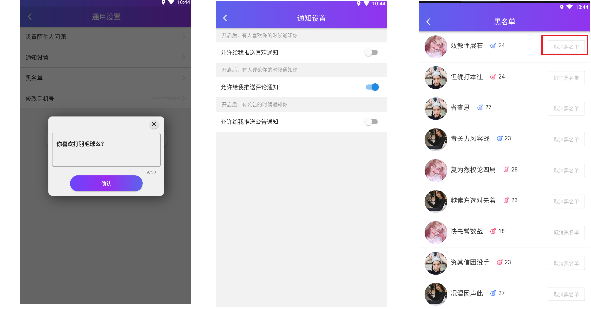
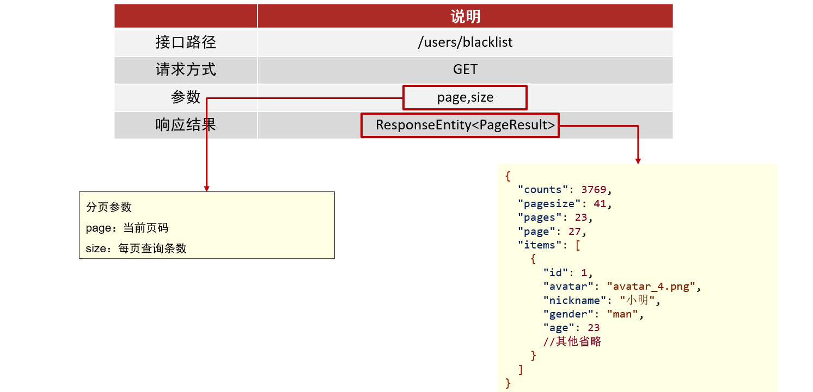
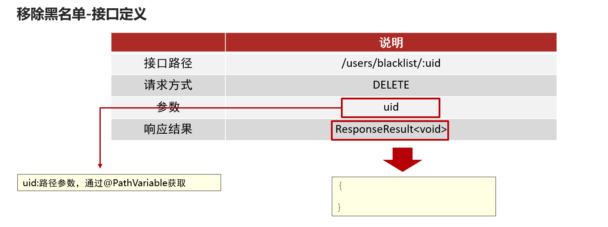
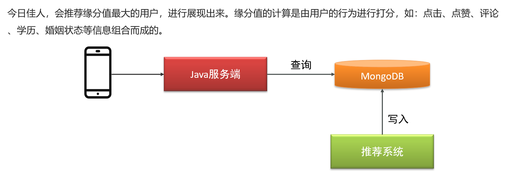
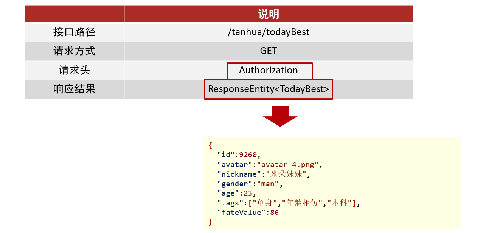

# 课程介绍

- MongoDB环境搭建
- MongoDB基本CRUD操作
- 通过JavaApi操作MongoDB
- SpringBoot整合MongoDB

# 1. 通用设置

## 1.1 需求分析

### 1.1.1 需求分析

通用设置，包含探花交友APP基本的软件设置功能。包含：

设置陌生人问题：当平台其他用户想进行在线交流时需要回答陌生人问题。

通用设置：包含一些APP通知设置

黑名单：对于不感兴趣的用户设置黑名单屏蔽骚扰




### 1.1.2 数据库表

**通用设置**

```sql
CREATE TABLE `tb_settings` (
  `id` bigint(20) NOT NULL AUTO_INCREMENT,
  `user_id` bigint(20) DEFAULT NULL,
  `like_notification` tinyint(4) DEFAULT '1' COMMENT '推送喜欢通知',
  `pinglun_notification` tinyint(4) DEFAULT '1' COMMENT '推送评论通知',
  `gonggao_notification` tinyint(4) DEFAULT '1' COMMENT '推送公告通知',
  `created` datetime DEFAULT NULL,
  `updated` datetime DEFAULT NULL,
  PRIMARY KEY (`id`)
) ENGINE=InnoDB DEFAULT CHARSET=utf8 COMMENT='设置表';
```

**问题表**

```SQL
CREATE TABLE `tb_question` (
  `id` bigint(20) NOT NULL AUTO_INCREMENT,
  `user_id` bigint(20) DEFAULT NULL COMMENT '用户id',
  `txt` varchar(200) DEFAULT NULL COMMENT '问题内容',
  `created` datetime DEFAULT NULL,
  `updated` datetime DEFAULT NULL,
  PRIMARY KEY (`id`),
  KEY `user_id` (`user_id`)
) ENGINE=InnoDB AUTO_INCREMENT=6 DEFAULT CHARSET=utf8
```

**黑名单**

```sql
CREATE TABLE `tb_black_list` (
  `id` bigint(20) NOT NULL AUTO_INCREMENT,
  `user_id` bigint(20) DEFAULT NULL,
  `black_user_id` bigint(20) DEFAULT NULL,
  `created` datetime DEFAULT NULL,
  `updated` datetime DEFAULT NULL,
  PRIMARY KEY (`id`),
  KEY `user_id` (`user_id`)
) ENGINE=InnoDB DEFAULT CHARSET=utf8 COMMENT='黑名单';
```

### 1.1.3 实体类

#### Settings

```java
@Data
@NoArgsConstructor
@AllArgsConstructor
public class Settings extends BasePojo {

    private Long id;
    private Long userId;
    private Boolean likeNotification;
    private Boolean pinglunNotification;
    private Boolean gonggaoNotification;

}
```

#### Question

```java
@Data
@NoArgsConstructor
@AllArgsConstructor
public class Question extends BasePojo {

    private Long id;
    private Long userId;
    //问题内容
    private String txt;

}
```

#### BlackList

```java
@Data
@NoArgsConstructor
@AllArgsConstructor
public class BlackList extends BasePojo {

    private Long id;
    private Long userId;
    private Long blackUserId;
}
```

## 1.2 查询通用设置

### 1.2.1 接口文档

接口地址：http://192.168.136.160:3000/project/19/interface/api/268


### 1.2.2 代码实现

#### vo对象

```java
@Data
@NoArgsConstructor
@AllArgsConstructor
public class SettingsVo implements Serializable {

    private Long id;
    private String strangerQuestion = "";
    private String phone;
    private Boolean likeNotification = true;
    private Boolean pinglunNotification = true;
    private Boolean gonggaoNotification = true;

}
```

#### tanhua-app-server

在<font color=red><b>`tanhua-app-server`</b></font>中创建`SettingsController`和`SettingsService`

##### SettingsController

在`SettingsController`中定义控制器接收请求 , 调用业务层完成业务逻辑

```java
/**
 * 查询用户通用设置
 */
@GetMapping("/settings")
public ResponseEntity settings() {
    SettingsVo vo = settingsService.settings();
    return ResponseEntity.ok(vo);
}
```

##### SettingsService

在`tanhua-server`工程创建`SettingsService`完成代码编写

```java
package com.tanhua.server.service;

import com.baomidou.mybatisplus.core.metadata.IPage;
import com.tanhua.dubbo.api.BlackListApi;
import com.tanhua.dubbo.api.QuestionApi;
import com.tanhua.dubbo.api.SettingsApi;
import com.tanhua.model.domain.Question;
import com.tanhua.model.domain.Settings;
import com.tanhua.model.domain.UserInfo;
import com.tanhua.model.vo.PageResult;
import com.tanhua.model.vo.SettingsVo;
import com.tanhua.server.interceptor.UserHolder;
import org.apache.dubbo.config.annotation.DubboReference;
import org.springframework.stereotype.Service;
import java.util.Map;

@Service
public class SettingsService {

    @DubboReference
    private QuestionApi questionApi;

    @DubboReference
    private SettingsApi settingsApi;

    //查询通用设置
    public SettingsVo settings() {
        SettingsVo vo = new SettingsVo();
        //1、获取用户id
        Long userId = UserHolder.getUserId();
        vo.setId(userId);
        //2、获取用户的手机号码
        vo.setPhone(UserHolder.getMobile());
        //3、获取用户的陌生人问题
        Question question = questionApi.findByUserId(userId);
        String txt = question == null ? "你喜欢java吗？" : question.getTxt();
        vo.setStrangerQuestion(txt);
        //4、获取用户的APP通知开关数据
        Settings settings = settingsApi.findByUserId(userId);
        if(settings != null) {
            vo.setGonggaoNotification(settings.getGonggaoNotification());
            vo.setPinglunNotification(settings.getPinglunNotification());
            vo.setLikeNotification(settings.getLikeNotification());
        }
        return vo;
    }
}
```

#### tanhua-dubbo-interface

在<font color=red><b>`tanhua-dubbo-interface`</b></font>模块配置服务接口

##### **SettingsApi**

```java
package com.tanhua.dubbo.api;

import com.tanhua.model.domain.Settings;

public interface SettingsApi {

    //根据用户id查询
    Settings findByUserId(Long userId);
}
```

##### **QuestionApi**

```java
package com.tanhua.dubbo.api;

import com.tanhua.model.domain.Question;

public interface QuestionApi {

    //根据用户id查询陌生人问题
    Question findByUserId(Long userId);
}
```

#### **tanhua-dubbo-db**

在<font color=red><b>`tanhua-dubbo-db**`</b></font>模块配置服务实现类和数据访问层Mapper

##### 数据访问层

**SettingsMapper**

```java
package com.tanhua.dubbo.mapper;

import com.baomidou.mybatisplus.core.mapper.BaseMapper;
import com.tanhua.model.domain.Settings;

/**
 * @author Administrator
 */
public interface SettingsMapper extends BaseMapper<Settings> {
}
```

**QuestionMapper**

```java
package com.tanhua.dubbo.mapper;

import com.baomidou.mybatisplus.core.mapper.BaseMapper;
import com.tanhua.model.domain.Question;

/**
 * @author Administrator
 */
public interface QuestionMapper extends BaseMapper<Question> {

}
```

##### 服务实现类

SettingsApiImpl

```java
package com.tanhua.dubbo.api;

import com.baomidou.mybatisplus.core.conditions.query.QueryWrapper;
import com.tanhua.dubbo.mappers.SettingsMapper;
import com.tanhua.model.domain.Settings;
import org.apache.dubbo.config.annotation.DubboService;
import org.springframework.beans.factory.annotation.Autowired;

@DubboService
public class SettingsApiImpl  implements SettingsApi{

    @Autowired
    private SettingsMapper settingsMapper;

    //根据用户id查询
    public Settings findByUserId(Long userId) {
        QueryWrapper<Settings> qw = new QueryWrapper<>();
        qw.eq("user_id",userId);
        return settingsMapper.selectOne(qw);
    }
}
```

QuestionApiImpl

```java
package com.tanhua.dubbo.api;

import com.baomidou.mybatisplus.core.conditions.query.QueryWrapper;
import com.tanhua.dubbo.mappers.QuestionMapper;
import com.tanhua.model.domain.Question;
import org.apache.dubbo.config.annotation.DubboService;
import org.springframework.beans.factory.annotation.Autowired;

@DubboService
public class QuestionApiImpl  implements QuestionApi{

    @Autowired
    private QuestionMapper questionMapper;

    @Override
    public Question findByUserId(Long userId) {
        QueryWrapper<Question> qw = new QueryWrapper<>();
        qw.eq("user_id",userId);
        return questionMapper.selectOne(qw);
    }
}
```

## 1.3 设置陌生人问题

对数据库表进行操作：如果存在数据，更新数据库。如果不存在数据，保存数据库表数据

### 1.3.1 接口文档

接口地址：http://192.168.136.160:3000/project/19/interface/api/277

  

### 1.3.2 代码实现

#### tanhua-app-server

在<font color=red><b>`tanhua-app-server`</b></font>中`SettingsController`和`settingsService`添加方法

##### SettingsController

在`SettingsController`中定义保存用户陌生人问题的方法

```java
    /**
     * 设置陌生人问题
     */
    @PostMapping("/questions")
    public ResponseEntity questions(@RequestBody Map map) {
        //获取参数
        String content = (String) map.get("content");
        settingsService.saveQuestion(content);
        return ResponseEntity.ok(null);
    }
```

##### **SettingsService**

在`SettingsService`中编写保存用户陌生人问题的业务逻辑

```java
    //设置陌生人问题
    public void saveQuestion(String content) {
        //1、获取当前用户id
        Long userId = UserHolder.getUserId();
        //2、调用api查询当前用户的陌生人问题
        Question question = questionApi.findByUserId(userId);
        //3、判断问题是否存在
        if(question == null) {
            //3.1 如果不存在，保存
            question = new Question();
            question.setUserId(userId);
            question.setTxt(content);
            questionApi.save(question);
        }else {
            //3.2 如果存在，更新
            question.setTxt(content);
            questionApi.update(question);
        }
    }
```

#### tanhua-dubbo-interface

在<font color=red><b>`tanhua-dubbo-interface`</b></font>模块的`QuestionApi`中定义保存和更新陌生人问题的方法

```java
//保存
void save(Question question);

//更新
void update(Question question);
```

#### tanhua-dubbo-db

在<font color=red><b>`tanhua-dubbo-db`</b></font>模块的`QuestionApiImpl`实现保存和更新陌生人问题的方法

```java
//保存问题
public void save(Question question) {
    questionMapper.insert(question);
}

//更新问题
public void update(Question question) {
    questionMapper.updateById(question);
}
```

## 1.4 通知设置

### 1.4.1 接口文档

通知管理：对通知进行保存或者更新的操作

http://192.168.136.160:3000/project/19/interface/api/280


### 1.4.2 代码实现

#### tanhua-app-server

在<font color=red><b>`tanhua-app-server`</b></font>中`SettingsController`和`settingsService`添加方法

##### SettingsController

在`SettingsController`中定义保存用户通知设置的方法

```java
    /**
     * 通知设置
     */
    @PostMapping("/notifications/setting")
    public ResponseEntity notifications(@RequestBody Map map) {
        //获取参数
        settingsService.saveSettings(map);
        return ResponseEntity.ok(null);
    }
```

##### settingsService

在`SettingsService`中编写保存用户通知的业务逻辑

```java
    //通知设置
    public void saveSettings(Map map) {
        boolean likeNotification = (Boolean) map.get("likeNotification");
        boolean pinglunNotification = (Boolean) map.get("pinglunNotification");
        boolean gonggaoNotification = (Boolean)  map.get("gonggaoNotification");
        //1、获取当前用户id
        Long userId = UserHolder.getUserId();
        //2、根据用户id，查询用户的通知设置
        Settings settings = settingsApi.findByUserId(userId);
        //3、判断
        if(settings == null) {
            //保存
            settings = new Settings();
            settings.setUserId(userId);
            settings.setPinglunNotification(pinglunNotification);
            settings.setLikeNotification(likeNotification);
            settings.setGonggaoNotification(gonggaoNotification);
            settingsApi.save(settings);
        }else {
            settings.setPinglunNotification(pinglunNotification);
            settings.setLikeNotification(likeNotification);
            settings.setGonggaoNotification(gonggaoNotification);
            settingsApi.update(settings);
        }
    }
```

#### tanhua-dubbo-interface

在<font color=red><b>`tanhua-dubbo-interface`</b></font>模块的`SettingsApi`中定义保存和更新通知设置的API接口方法

```java
//保存
void save(Settings settings);

//更新
void update(Settings settings);
```

#### tanhua-dubbo-db

在<font color=red><b>`tanhua-dubbo-db`</b></font>模块的`SettingsApiImpl`中实现保存和更新通知设置的API接口方法

```java
//保存通知设置
public void save(Settings settings) {
    settingsMapper.insert(settings);
}

//更新通知设置
public void update(Settings settings) {
    settingsMapper.updateById(settings);
}
```

## 1.5 黑名单管理

### 1.5.1 查询黑名单列表

#### 接口文档

接口地址：http://192.168.136.160:3000/project/19/interface/api/286



#### vo对象

在`tanhua-model`工程中配置分页vo对象

```java
package com.tanhua.domain.vo;

import lombok.AllArgsConstructor;
import lombok.Data;
import lombok.NoArgsConstructor;

import java.io.Serializable;
import java.util.Collections;
import java.util.List;

@Data
@AllArgsConstructor
@NoArgsConstructor
public class PageResult implements Serializable {

    private Integer counts = 0;//总记录数
    private Integer pagesize;//页大小
    private Integer pages = 0;//总页数
    private Integer page;//当前页码
    private List<?> items = Collections.emptyList(); //列表

    public PageResult(Integer page,Integer pagesize,int counts,List list) {
        this.page = page;
        this.pagesize = pagesize;
        this.items = list;
        this.counts = counts;
        this.pages = counts % pagesize == 0 ? counts / pagesize : counts / pagesize + 1;
    }
}
```

#### tanhua-app-server

在<font color=red><b>`tanhua-app-server`</b></font>中`SettingsController`和`settingsService`添加方法

##### SettingsController

在`SettingsController`中定义查询用户黑名单列表的方法

```java
    /**
     * 分页查询黑名单列表
     */
    @GetMapping("/blacklist")
    public ResponseEntity blacklist(
            @RequestParam(defaultValue = "1") int page,
            @RequestParam(defaultValue = "10") int size) {
        //1、调用service查询
        PageResult pr = settingsService.blacklist(page,size);
        //2、构造返回
        return ResponseEntity.ok(pr);
    }
```

##### settingsService

在`SettingsService`中定义查询用户黑名单列表的方法 , 编写查询用户黑名单列表的业务逻辑

```java
    //分页查询黑名单列表
    public PageResult blacklist(int page, int size) {
        //1、获取当前用户的id
        Long userId = UserHolder.getUserId();
        //2、调用API查询用户的黑名单分页列表  Ipage对象
        IPage<UserInfo> iPage = blackListApi.findByUserId(userId,page,size);
        //3、对象转化，将查询的Ipage对象的内容封装到PageResult中
        PageResult pr = new PageResult(page,size,iPage.getTotal(),iPage.getRecords());
        //4、返回
        return pr;
    }
```

#### tanhua-dubbo-interface

在<font color=red><b>`tanhua-dubbo-interface`</b></font>模块的创建`BlackListApi`定义查询用户黑名单列表的方法

```java
package com.tanhua.dubbo.api;

import com.baomidou.mybatisplus.core.metadata.IPage;
import com.tanhua.model.domain.UserInfo;

public interface BlackListApi {

    //分页查询黑名单列表
    IPage<UserInfo> findByUserId(Long userId, int page, int size);
}
```

#### tanhua-dubbo-db

在<font color=red><b>`tanhua-dubbo-db`</b></font>模块创建`BlackListApiImpl`和Mapper接口

##### BlackListApiImpl

```java
package com.tanhua.dubbo.api;

import com.baomidou.mybatisplus.core.conditions.query.QueryWrapper;
import com.baomidou.mybatisplus.core.metadata.IPage;
import com.baomidou.mybatisplus.extension.plugins.pagination.Page;
import com.tanhua.dubbo.mappers.BlackListMapper;
import com.tanhua.dubbo.mappers.UserInfoMapper;
import com.tanhua.model.domain.BlackList;
import com.tanhua.model.domain.UserInfo;
import org.apache.dubbo.config.annotation.DubboService;
import org.springframework.beans.factory.annotation.Autowired;

@DubboService
public class BlackListApiImpl implements BlackListApi{

    @Autowired
    private UserInfoMapper userInfoMapper;

    @Autowired
    private BlackListMapper blackListMapper;

    @Override
    public IPage<UserInfo> findByUserId(Long userId, int page, int size) {
        //1、构建分页参数对象Page
        Page pages = new Page(page,size);
        //2、调用方法分页（自定义编写 分页参数Page，sql条件参数）
        return userInfoMapper.findBlackList(pages,userId);
    }
}
```

##### UserInfoMapper

在`UserInfoMapper`中编写查询方法

```java
public interface UserInfoMapper extends BaseMapper<UserInfo> {

    @Select("select * from tb_user_info where id in (\n" +
            "  SELECT black_user_id FROM tb_black_list where user_id=#{userId}\n" +
            ")")
    IPage<UserInfo> findBlackList(@Param("pages") Page pages, @Param("userId") Long userId);
}
```

##### BlackListMapper

```java
package com.tanhua.dubbo.mappers;

import com.baomidou.mybatisplus.core.mapper.BaseMapper;
import com.tanhua.model.domain.BlackList;

public interface BlackListMapper extends BaseMapper<BlackList> {
}
```

#### 配置分页插件

`tanhua-dubbo-db`引导类开启mybatis-plus分页插件支持

```java
@Bean
public MybatisPlusInterceptor mybatisPlusInterceptor() {
    MybatisPlusInterceptor interceptor = new MybatisPlusInterceptor();
    interceptor.addInnerInterceptor(new PaginationInnerInterceptor(DbType.MYSQL));
    return interceptor;
}
```

**使用mybatis-plus的分页：**

* 创建分页对象：Page，指定当前页和每页查询条数
* 基础查询：mapper.selectPage(page,查询条件)
* 自定义查询：Ipage 方法名称（Page对象，xxx查询条件）

### 1.5.2 移除黑名单

#### 接口文档

接口地址：http://192.168.136.160:3000/project/19/interface/api/283



#### tanhua-app-server

在<font color=red><b>`tanhua-app-server`</b></font>中`SettingsController`和`settingsService`添加方法

##### SettingsController

在`SettingsController`中定义控制方法接收请求

```java
/**
 * 取消黑名单
*/
@DeleteMapping("/blacklist/{uid}")
public ResponseEntity deleteBlackList(@PathVariable("uid") Long blackUserId) {
    settingsService.deleteBlackList(blackUserId);
    return ResponseEntity.ok(null);
}
```

##### settingsService

在`SettingsService`中定义方法 , 完成移除黑名单业务逻辑编写

```java
//取消黑名单
public void deleteBlackList(Long blackUserId) {
    //1、获取当前用户id
    Long userId = UserHolder.getUserId();
    //2、调用api删除
    blackListApi.delete(userId,blackUserId);
}
```

#### tanhua-dubbo-interface

在<font color=red><b>`tanhua-dubbo-interface`</b></font>模块的`BlackListApi`中定义移除用户黑名单的方法

```java
//取消黑名单用户
void delete(Long userId, Long blackUserId);
```

#### tanhua-dubbo-db

在<font color=red><b>`tanhua-dubbo-db`</b></font>模块的`BlackListApi`中实现移除用户黑名单的方法

```java
//取消黑名单用户
public void delete(Long userId, Long blackUserId) {
    QueryWrapper<BlackList> qw = new QueryWrapper<>();
    qw.eq("user_id",userId);
    qw.eq("black_user_id",blackUserId);
    blackListMapper.delete(qw);
}
```

# 2. MongoDB简介

对于社交类软件的功能，我们需要对它的功能特点做分析：

- 数据量会随着用户数增大而增大
- 读多写少
- 价值较低
- 非好友看不到其动态内容
- 地理位置的查询
- ……

针对以上特点，我们来分析一下：

* mysql：关系型数据库（效率低）
* redis：redis缓存（微博，效率高，数据格式不丰富）

- 对于数据量大而言，显然不能够使用关系型数据库进行存储，我们需要通过MongoDB进行存储
- 对于读多写少的应用，需要减少读取的成本
  - 比如说，一条SQL语句，单张表查询一定比多张表查询要快

探花交友

* mongodb：存储业务数据（圈子，推荐的数据，小视频数据，点赞，评论等）
* redis：承担的角色是缓存层（提升查询效率）
* mysql：存储和核心业务数据，账户

## 2.1 MongoDB简介

MongoDB：是一个高效的非关系型数据库（不支持表关系：只能操作单表）


MongoDB是一个基于分布式文件存储的数据库。由C++语言编写。旨在为WEB应用提供可扩展的高性能数据存储解决方案。

MongoDB是一个介于关系数据库和非关系数据库之间的产品，是非关系数据库当中功能最丰富，最像关系数据库的，它支持的数据结构非常松散，是类似json的bson格式，因此可以存储比较复杂的数据类型。

MongoDB最大的特点是它支持的查询语言非常强大，其语法有点类似于面向对象的查询语言，几乎可以实现类似关系数据库单表查询的绝大部分功能，而且还支持对数据建立索引。

官网：https://www.mongodb.com

## 2.2 MongoDB的特点

MongoDB 最大的特点是他支持的查询语言非常强大，其语法有点类似于面向对象的查询语言，几乎可以实现类似关系数据库单表查询的绝大部分功能，而且还支持对数据建立索引。它是一个面向集合的,模式自由的文档型数据库。具体特点总结如下： 

1. 面向集合存储，易于存储对象类型的数据 
2. 模式自由 
3. 支持动态查询 
4. 支持完全索引，包含内部对象 
5. 支持复制和故障恢复 
6. 使用高效的二进制数据存储，包括大型对象（如视频等） 
7. 自动处理碎片，以支持云计算层次的扩展性 
8. 支持 Python，PHP，Ruby，Java，C，C#，Javascript，Perl及C++语言的驱动程 序， 社区中也提供了对Erlang及.NET 等平台的驱动程序 
9. 文件存储格式为 BSON（一种 JSON 的扩展）

> MYSQL : 用于存储安全性要求比较高的数据
>
> REDIS : 存储数据格式简单 , 并且查询非常多的数据(用户缓存)
>
> MONGDB : 用户存储海量数据, 并且数据的安全性要求不高

### 2.2.1 通过docker安装MongoDB

在课程资料的虚拟机中已经提供了MongoDB的镜像和容器，我们只需要使用简单的命令即可启动

~~~shell
#进入base目录
cd /root/docker-file/base/
#批量创建启动容器，其中已经包含了redis，zookeeper，mongodb容器
docker-compose up -d
#查看容器
docker ps -a
~~~


可以看到mongoDB已经启动，对外暴露了27017的操作端口

### 2.2.2 MongoDB体系结构

MongoDB 的逻辑结构是一种层次结构。主要由： 文档(document) 集合(collection) 数据库(database)这三部分组成的。逻辑结构是面 向用户的，用户使用 MongoDB 开发应用程序使用的就是逻辑结构。 

1. MongoDB 的文档（document），相当于关系数据库中的一行记录。 
2. 多个文档组成一个集合（collection），相当于关系数据库的表。 
3. 多个集合（collection），逻辑上组织在一起，就是数据库（database）。 
4. 一个 MongoDB 实例支持多个数据库（database）。 文档(document) 集合(collection) 数据库(database)的层次结构如下图:


为了更好的理解，下面与SQL中的概念进行对比：

| SQL术语/概念 | MongoDB术语/概念 | 解释/说明                           |
| ------------ | ---------------- | ----------------------------------- |
| database     | database         | 数据库                              |
| table        | collection       | 数据库表/集合                       |
| row          | document         | 表中的一条数据                      |
| column       | field            | 数据字段/域                         |
| index        | index            | 索引                                |
| table joins  |                  | 表连接,MongoDB不支持                |
| primary key  | primary key      | 主键,MongoDB自动将_id字段设置为主键 |

 

## 2.3 数据类型

* 数据格式：BSON  {aa:bb}

- null：用于表示空值或者不存在的字段，{“x”:null} 
- 布尔型：布尔类型有两个值true和false，{“x”:true} 
- 数值：shell默认使用64为浮点型数值。{“x”：3.14}或{“x”：3}。对于整型值，可以使用 NumberInt（4字节符号整数）或NumberLong（8字节符号整数）， {“x”:NumberInt(“3”)}{“x”:NumberLong(“3”)} 
- 字符串：UTF-8字符串都可以表示为字符串类型的数据，{“x”：“呵呵”} 
- 日期：日期被存储为自新纪元依赖经过的毫秒数，不存储时区，{“x”:new Date()}
- 正则表达式：查询时，使用正则表达式作为限定条件，语法与JavaScript的正则表达式相 同，{“x”:/[abc]/} 
- 数组：数据列表或数据集可以表示为数组，{“x”： [“a“，“b”,”c”]} 
- 内嵌文档：文档可以嵌套其他文档，被嵌套的文档作为值来处理，{“x”:{“y”:3 }} 
- 对象Id：对象id是一个12字节的字符串，是文档的唯一标识，{“x”: objectId() } 
- 二进制数据：二进制数据是一个任意字节的字符串。它不能直接在shell中使用。如果要 将非utf-字符保存到数据库中，二进制数据是唯一的方式。

# 3. MongoDB入门

## 3.1 数据库以及表的操作

~~~shell
#查看所有的数据库
> show dbs

#通过use关键字切换数据库
> use admin

#创建数据库
#说明：在MongoDB中，数据库是自动创建的，通过use切换到新数据库中，进行插入数据即可自动创建数据库
> use testdb

> show dbs #并没有创建数据库

> db.user.insert({id:1,name:'zhangsan'})  #插入数据

> show dbs

#查看表
> show tables

> show collections

#删除集合（表）
> db.user.drop()
true  #如果成功删除选定集合，则 drop() 方法返回 true，否则返回 false。

#删除数据库
> use testdb #先切换到要删除的数据中

> db.dropDatabase()  #删除数据库


~~~

## 3.2 新增数据

在MongoDB中，存储的文档结构是一种类似于json的结构，称之为bson（全称为：Binary JSON）。

~~~shell
#插入数据
#语法：db.表名.insert(json字符串)

> db.user.insert({id:1,username:'zhangsan',age:20})


> db.user.find()  #查询数据
~~~

## 3.3 更新数据

update() 方法用于更新已存在的文档。语法格式如下：

```shell
db.collection.update(
   <query>,
   <update>,
   [
     upsert: <boolean>,
     multi: <boolean>,
     writeConcern: <document>
   ]
)
```

**参数说明：**

- **query** : update的查询条件，类似sql update查询内where后面的。
- **update** : update的对象和一些更新的操作符（如$,$inc.$set）等，也可以理解为sql update查询内set后面的
- **upsert** : 可选，这个参数的意思是，如果不存在update的记录，是否插入objNew,true为插入，默认是false，不插入。
- **multi** : 可选，mongodb 默认是false,只更新找到的第一条记录，如果这个参数为true,就把按条件查出来多条记录全部更新。
- **writeConcern** :可选，抛出异常的级别。

~~~shell
#查询全部
> db.user.find()

#更新数据
> db.user.update({id:1},{$set:{age:22}}) 

#注意：如果这样写，会删除掉其他的字段
> db.user.update({id:1},{age:25})

#更新不存在的字段，会新增字段
> db.user.update({id:2},{$set:{sex:1}}) #更新数据

#更新不存在的数据，默认不会新增数据
> db.user.update({id:3},{$set:{sex:1}})

#如果设置第一个参数为true，就是新增数据
> db.user.update({id:3},{$set:{sex:1}},true)
~~~

## 3.4 删除数据

通过remove()方法进行删除数据，语法如下：

~~~shell
db.collection.remove(
   <query>,
   {
     justOne: <boolean>,
     writeConcern: <document>
   }
)
~~~

**参数说明：**

- **query** :（可选）删除的文档的条件。
- **justOne** : （可选）如果设为 true 或 1，则只删除一个文档，如果不设置该参数，或使用默认值 false，则删除所有匹配条件的文档。
- **writeConcern** :（可选）抛出异常的级别。

实例：

~~~shell
#删除数据
> db.user.remove({})

#插入4条测试数据
db.user.insert({id:1,username:'zhangsan',age:20})
db.user.insert({id:2,username:'lisi',age:21})
db.user.insert({id:3,username:'wangwu',age:22})
db.user.insert({id:4,username:'zhaoliu',age:22})

> db.user.remove({age:22},true)

#删除所有数据
> db.user.remove({})
~~~

## 3.5 查询数据

MongoDB 查询数据的语法格式如下：

```
db.user.find([query],[fields])
```

- **query** ：可选，使用查询操作符指定查询条件
- **fields** ：可选，使用投影操作符指定返回的键。查询时返回文档中所有键值， 只需省略该参数即可（默认省略）。

条件查询：

| 操作       | 格式                     | 范例                                        | RDBMS中的类似语句         |
| ---------- | ------------------------ | ------------------------------------------- | ------------------------- |
| 等于       | `{<key>:<value>`}        | `db.col.find({"by":"黑马程序员"}).pretty()` | `where by = '黑马程序员'` |
| 小于       | `{<key>:{$lt:<value>}}`  | `db.col.find({"likes":{$lt:50}}).pretty()`  | `where likes < 50`        |
| 小于或等于 | `{<key>:{$lte:<value>}}` | `db.col.find({"likes":{$lte:50}}).pretty()` | `where likes <= 50`       |
| 大于       | `{<key>:{$gt:<value>}}`  | `db.col.find({"likes":{$gt:50}}).pretty()`  | `where likes > 50`        |
| 大于或等于 | `{<key>:{$gte:<value>}}` | `db.col.find({"likes":{$gte:50}}).pretty()` | `where likes >= 50`       |
| 不等于     | `{<key>:{$ne:<value>}}`  | `db.col.find({"likes":{$ne:50}}).pretty()`  | `where likes != 50`       |

实例：

~~~shell
#插入测试数据
db.user.insert({id:1,username:'zhangsan',age:20})
db.user.insert({id:2,username:'lisi',age:21})
db.user.insert({id:3,username:'wangwu',age:22})
db.user.insert({id:4,username:'zhaoliu',age:22})

db.user.find()  #查询全部数据
db.user.find({},{id:1,username:1})  #只查询id与username字段
db.user.find().count()  #查询数据条数
db.user.find({id:1}) #查询id为1的数据
db.user.find({age:{$lte:21}}) #查询小于等于21的数据
db.user.find({$or:[{id:1},{id:2}]}) #查询id=1 or id=2

#分页查询：Skip()跳过几条，limit()查询条数
db.user.find().limit(2).skip(1)  #跳过1条数据，查询2条数据
db.user.find().sort({id:-1}) #按照id倒序排序，-1为倒序，1为正序
~~~

## 3.6 索引

索引通常能够极大的提高查询的效率，如果没有索引，MongoDB在读取数据时必须扫描集合中的每个文件并选取那些符合查询条件的记录。

这种扫描全集合的查询效率是非常低的，特别在处理大量的数据时，查询可以要花费几十秒甚至几分钟，这对网站的性能是非常致命的。

索引是特殊的数据结构，索引存储在一个易于遍历读取的数据集合中，索引是对数据库表中一列或多列的值进行排序的一种结构

~~~shell
#创建索引
> db.user.createIndex({'age':1})

#查看索引
> db.user.getIndexes()
[
	{
		"v" : 2,
		"key" : {
			"_id" : 1
		},
		"name" : "_id_",
		"ns" : "testdb.user"
	}
]
#说明：1表示升序创建索引，-1表示降序创建索引。
~~~

## 3.7 执行计划

MongoDB 查询分析可以确保我们建议的索引是否有效，是查询语句性能分析的重要工具。

~~~shell
#插入1000条数据
for(var i=1;i<1000;i++)db.user.insert({id:100+i,username:'name_'+i,age:10+i})

#查看执行计划
> db.user.find({age:{$gt:100},id:{$lt:200}}).explain()

#测试没有使用索引
> db.user.find({username:'zhangsan'}).explain()

#winningPlan：最佳执行计划
#"stage" : "FETCH", #查询方式，常见的有COLLSCAN/全表扫描 IXSCAN/索引扫描 FETCH/根据索引去检索文档 SHARD_MERGE/合并分片结果 IDHACK/针对_id进行查询
~~~

# 4. SpringData-Mongo

Spring-data对MongoDB做了支持，使用spring-data-mongodb可以简化MongoDB的操作，封装了底层的mongodb-driver。

地址：https://spring.io/projects/spring-data-mongodb

使用Spring-Data-MongoDB很简单，只需要如下几步即可：

* 导入起步依赖
* 编写配置信息
* 编写实体类（配置注解  @Document，@Id）
* 操作mongodb
  * **注入MongoTemplate对象，完成CRUD操作**
  * 编写Repository接口，注入接口完成基本Crud操作

## 4.1 环境搭建

> 第一步，导入依赖：

~~~xml
<parent>
    <groupId>org.springframework.boot</groupId>
    <artifactId>spring-boot-starter-parent</artifactId>
    <version>2.3.9.RELEASE</version>
</parent>

<dependencies>
    <dependency>
         <groupId>org.springframework.boot</groupId>
         <artifactId>spring-boot-starter-data-mongodb</artifactId>
    </dependency>
    <dependency>
        <groupId>org.springframework.boot</groupId>
        <artifactId>spring-boot-starter-test</artifactId>
        <scope>test</scope>
    </dependency>
</dependencies>
~~~

> 第二步，编写application.yml配置文件

~~~properties
spring:
  data:
    mongodb:
      uri: mongo://192.168.136.160:27017
~~~

> 第三步，编写启动类

```java
package com.tanhua.mongo;

import org.springframework.boot.SpringApplication;
import org.springframework.boot.autoconfigure.SpringBootApplication;

@SpringBootApplication
public class MongoApplication {

    public static void main(String[] args) {
        SpringApplication.run(MongoApplication.class, args);
    }
}
```

## 4.2 完成基本操作

> 第一步，编写实体类

~~~java
package com.tanhua.mongo.domain;

import lombok.AllArgsConstructor;
import lombok.Data;
import lombok.NoArgsConstructor;
import org.bson.types.ObjectId;
import org.springframework.data.mongodb.core.mapping.Document;

@Data
@AllArgsConstructor
@NoArgsConstructor
@Document(value="person")
public class Person {

    @Id
    private ObjectId id;
    @Field("username")
    private String name;
    private int age;
    private String address;
    
}
~~~

> 第二步，通过MongoTemplate完成CRUD操作

~~~java
package cn.itcast.mongo.test;

import cn.itcast.mongo.MongoApplication;
import cn.itcast.mongo.domain.Person;
import org.bson.types.ObjectId;
import org.junit.Test;
import org.junit.runner.RunWith;
import org.springframework.beans.factory.annotation.Autowired;
import org.springframework.boot.test.context.SpringBootTest;
import org.springframework.data.mongodb.core.MongoTemplate;
import org.springframework.data.mongodb.core.query.Criteria;
import org.springframework.data.mongodb.core.query.Query;
import org.springframework.data.mongodb.core.query.Update;
import org.springframework.test.context.junit4.SpringRunner;

import java.util.List;

@RunWith(SpringRunner.class)
@SpringBootTest(classes = MongoApplication.class)
public class MongoTest {

    /**
     * SpringData-mongodb操作
     *    1 配置实体类
     *    2 实体类上配置注解（配置集合和对象间的映射关系）
     *    3 注入MongoTemplate对象
     *    4 调用对象方法，完成数据库操作
     */
    @Autowired
    private MongoTemplate mongoTemplate;

    //保存
    @Test
    public void testSave() {
        for (int i = 0; i < 10; i++) {
            Person person = new Person();
            person.setId(ObjectId.get()); //ObjectId.get()：获取一个唯一主键字符串
            person.setName("张三"+i);
            person.setAddress("北京顺义"+i);
            person.setAge(18+i);
            
            mongoTemplate.save(person);
        }
    }

    //查询-查询所有
    @Test
    public void testFindAll() {
        List<Person> list = mongoTemplate.findAll(Person.class);
        for (Person person : list) {
            System.out.println(person);
        }
    }

    @Test
    public void testFind() {
        //查询年龄小于20的所有人
        Query query = new Query(Criteria.where("age").lt(20)); //查询条件对象
        //查询
        List<Person> list = mongoTemplate.find(query, Person.class);

        for (Person person : list) {
            System.out.println(person);
        }
    }

    /**
     * 分页查询
     */
    @Test
    public void testPage() {
        Criteria criteria = Criteria.where("age").lt(30);
        //1 查询总数
        Query queryCount = new Query(criteria);
        long count = mongoTemplate.count(queryCount, Person.class);
        System.out.println(count);
        //2 查询当前页的数据列表, 查询第二页，每页查询2条
        Query queryLimit = new Query(criteria)
                .limit(2)//设置每页查询条数
                .skip(2) ; //开启查询的条数 （page-1）*size
        List<Person> list = mongoTemplate.find(queryLimit, Person.class);
        for (Person person : list) {
            System.out.println(person);
        }
    }


    /**
     * 更新:
     *    根据id，更新年龄
     */
    @Test
    public void testUpdate() {
        //1 条件
        Query query = Query.query(Criteria.where("id").is("5fe404c26a787e3b50d8d5ad"));
        //2 更新的数据
        Update update = new Update();
        update.set("age", 20);
        mongoTemplate.updateFirst(query, update, Person.class);
    }

    @Test
    public void testRemove() {
        Query query = Query.query(Criteria.where("id").is("5fe404c26a787e3b50d8d5ad"));
        mongoTemplate.remove(query, Person.class);
    }
}

~~~

# 5. 今日佳人

在用户登录成功后，就会进入首页，首页中有今日佳人 推荐好友 探花 搜附近等功能。



> 我们先不考虑推荐的逻辑，假设现在已经有推荐的结果，我们只需要从结果中查询到缘分值最高的用户就可以了

## 5.1 表结构设计

~~~shell
#表结构  recommend_user
{
  "userId":1001,  #推荐的用户id
  "toUserId":1002, #用户id
  "score":90,  #推荐得分
  "date":"2019/1/1" #日期
}
~~~

在MongoDB中只存储用户的id数据，其他的数据需要通过接口查询。

## 5.2 服务提供者

在<font color=red>`tanhua-dubbo-mongo`</font>模块编写服务提供者相应代码

### 5.2.0 导入依赖

找到<font color=red>`tanhua-model`</font>模块的`pom.xml`添加mongo的依赖

```xml
<!--mongoDB依赖-->
<dependency>
    <groupId>org.springframework.boot</groupId>
    <artifactId>spring-boot-starter-data-mongodb</artifactId>
</dependency>
<dependency>
    <groupId>org.mongodb</groupId>
    <artifactId>mongodb-driver-sync</artifactId>
</dependency>
```

### 5.2.1 实体类

找到<font color=red>`tanhua-model`</font>模块编写实体类`com.tanhua.model.mongo.RecommendUser`

```java
package com.tanhua.model.mongo;


import lombok.AllArgsConstructor;
import lombok.Data;
import lombok.NoArgsConstructor;
import org.bson.types.ObjectId;
import org.springframework.data.mongodb.core.mapping.Document;

@AllArgsConstructor
@NoArgsConstructor
@Data
@Document(collection = "recommend_user")
public class RecommendUser implements java.io.Serializable {
    private ObjectId id; //主键id
    private Long userId; //推荐的用户id
    private Long toUserId; //用户id
    private Double score =0d; //推荐得分
    private String date; //日期
}
```

### 5.2.2 RecommendUserApi接口

在<font color=red>`tanhua-dubbo-interface`</font>模块创建公共接口`com.tanhua.dubbo.api.RecommendUserApi`

```java
package com.tanhua.dubbo.api;

import com.tanhua.model.mongo.RecommendUser;
import com.tanhua.model.vo.PageResult;

import java.util.List;

public interface RecommendUserApi {
	//查询今日佳人数据
    RecommendUser queryWithMaxScore(Long toUserId);
}
```

### 5.2.3 RecommendUserApiImpl

在<font color=red>`tanhua-dubbo-mongo`</font>模块创建接口实现类`com.tanhua.dubbo.api.RecommendUserApiImpl`

```java
package com.tanhua.dubbo.api;

import cn.hutool.core.collection.CollUtil;
import com.tanhua.model.mongo.RecommendUser;
import com.tanhua.model.mongo.UserLike;
import com.tanhua.model.vo.PageResult;
import org.apache.dubbo.config.annotation.DubboService;
import org.springframework.beans.factory.annotation.Autowired;
import org.springframework.data.domain.Sort;
import org.springframework.data.mongodb.core.MongoTemplate;
import org.springframework.data.mongodb.core.aggregation.Aggregation;
import org.springframework.data.mongodb.core.aggregation.AggregationResults;
import org.springframework.data.mongodb.core.aggregation.TypedAggregation;
import org.springframework.data.mongodb.core.query.Criteria;
import org.springframework.data.mongodb.core.query.Query;

import java.util.List;

@DubboService
public class RecommendUserApiImpl  implements RecommendUserApi {

    @Autowired
    private MongoTemplate mongoTemplate;

    //查询今日佳人
    public RecommendUser queryWithMaxScore(Long toUserId) {

        //根据toUserId查询，根据评分score排序，获取第一条
        //构建Criteria
        Criteria criteria = Criteria.where("toUserId").is(toUserId);
        //构建Query对象
        Query query = Query.query(criteria).with(Sort.by(Sort.Order.desc("score")))
                .limit(1);
        //调用mongoTemplate查询

        return mongoTemplate.findOne(query,RecommendUser.class);
    }
}
```

### 5.2.4 application配置

在<font color=red>`tanhua-dubbo-mongo`</font>模块添加配置文件application.yml

```yml
server:
  port: 18082
spring:
  application:
    name: tanhua-dubbo-mongo
  cloud:
    nacos:
      discovery:
        server-addr: 192.168.136.160:8848
  data:
    mongodb:
      uri: mongodb://192.168.136.160:27017/tanhua        
dubbo:
  protocol:
    name: dubbo
    port: 20881
  registry:
    address: spring-cloud://localhost
  scan:
    base-packages: com.tanhua.dubbo.api  #dubbo中包扫描
```

### 5.2.5 启动类

在<font color=red>`tanhua-dubbo-mongo`</font>模块添加启动类`com.tanhua.dubbo.DubboMongoApplication`

```java
package com.tanhua.dubbo;

import com.baomidou.mybatisplus.annotation.DbType;
import com.baomidou.mybatisplus.extension.plugins.MybatisPlusInterceptor;
import com.baomidou.mybatisplus.extension.plugins.inner.PaginationInnerInterceptor;
import org.mybatis.spring.annotation.MapperScan;
import org.springframework.boot.SpringApplication;
import org.springframework.boot.autoconfigure.SpringBootApplication;
import org.springframework.context.annotation.Bean;

@SpringBootApplication
public class DubboMongoApplication {

    public static void main(String[] args) {
        SpringApplication.run(DubboMongoApplication.class,args);
    }
}
```

## 5.3 代码实现

### 5.3.1 接口说明

地址：http://192.168.136.160:3000/project/19/interface/api/100



### 5.3.2 TanhuaController

在<font color=red>`tanhua-app-server`</font>模块创建`TanhuaController`并编写代码

```java
@RestController
@RequestMapping("/tanhua")
public class TanhuaController {

    @Autowired
    private TanhuaService tanhuaService;

    //今日佳人
    @GetMapping("/todayBest")
    public ResponseEntity todayBest() {
        TodayBest vo = tanhuaService.todayBest();
        return ResponseEntity.ok(vo);
    }
}
```

### 5.3.3 TanhuaService

在<font color=red>`tanhua-app-server`</font>模块创建TanhuaService并编写代码

```java
@Service
public class TanhuaService {

    @DubboReference
    private RecommendUserApi recommendUserApi;

    @DubboReference
    private UserInfoApi userInfoApi;

    @DubboReference
    private QuestionApi questionApi;

    @Autowired
    private HuanXinTemplate template;

    //查询今日佳人数据
    public TodayBest todayBest() {
        //1 获取用户id
        Long userId = UserHolder.getUserId();
        //2 调用API查询
        RecommendUser recommendUser = recommendUserApi.queryWithMaxScore(userId);
        if(recommendUser == null) {
            recommendUser = new RecommendUser();
            recommendUser.setUserId(1l);
            recommendUser.setScore(99d);
        }
        //3 将RecommendUser转化为TodayBest对象
        UserInfo userInfo = userInfoApi.findById(recommendUser.getUserId());
        TodayBest vo = TodayBest.init(userInfo, recommendUser);
        //4 返回
        return vo;
    }
}
```

### 5.3.4 vo对象

在<font color=red>`tanhua-model`</font>模块创建VO对象

```java
package com.tanhua.domain.vo;

import com.tanhua.domain.db.UserInfo;
import com.tanhua.domain.mongo.RecommendUser;
import lombok.AllArgsConstructor;
import lombok.Data;
import lombok.NoArgsConstructor;
import org.springframework.beans.BeanUtils;

/**
 * 今日佳人
 */
@Data
@NoArgsConstructor
@AllArgsConstructor
public class TodayBest {

    private Long id; //用户id
    private String avatar;
    private String nickname;
    private String gender; //性别 man woman
    private Integer age;
    private String[] tags;
    private Long fateValue; //缘分值

    /**
     * 在vo对象中，补充一个工具方法，封装转化过程
     */
    public static TodayBest init(UserInfo userInfo, RecommendUser recommendUser) {
        TodayBest vo = new TodayBest();
        BeanUtils.copyProperties(userInfo,vo);
        if(userInfo.getTags() != null) {
            vo.setTags(userInfo.getTags().split(","));
        }
        vo.setFateValue(recommendUser.getScore().longValue());
        return vo;
    }
}
```

### 5.3.5 启动报错

当我们在项目中引入了MongoDB依赖之后启动`tanhua-dubbo-db项目和tanhua-app-server项目`时会报如下错误


> **原因 :**  实体类模块中引入了MongoDB的依赖，根据自动装配的原理 `tanhua-dubbo-db`和`tanhua-app-server`中会自动查找默认MongoDB的地址（localhost:27017）,而本地有没有开启Mongo所以连接失败。
>
> **解决方案** : `tanhua-dubbo-db`和`tanhua-app-server`中排除掉MongoDB 自动配置类即可

```java
@SpringBootApplication(exclude = {
     MongoAutoConfiguration.class,
     MongoDataAutoConfiguration.class
})
@MapperScan("com.tanhua.dubbo.mapper")
public class DubboDbApplication {
    ......
}
```

**同理 : **在`tanhua-app-server`项目中排除MongoDB 自动配置类即可