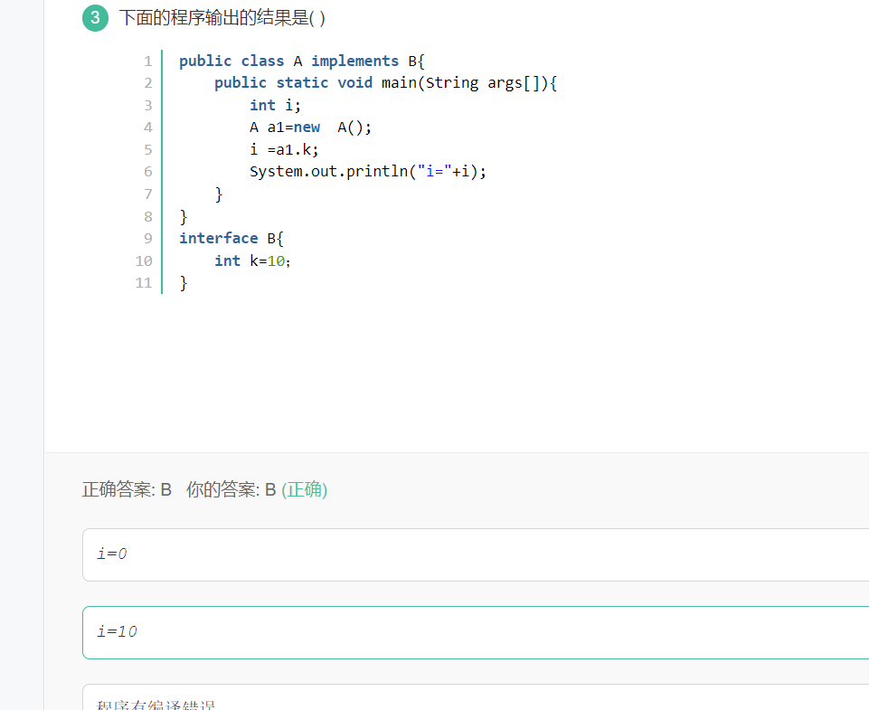
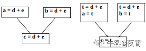

# 牛客网刷题小记

## MySQL
### 1.查询语句执行顺序

（8）Select
（9）distinct 字段名1,字段名2，
（6）[fun(字段名)]  
（1）from 表1
（3）<join类型>join 表2 
（2）on <join条件> 
（4）where <where条件> 
（5）group by <字段> 
（7）having <having条件> 
（10）order by <排序字段> 
（11）limit <起始偏移量,行数>

### 2.使用聚合函数，则判断条件使用having

where---过滤指定的行
having--过滤分组，与group by连用
返回订单数量总和不小于100:having sum(quantity)>= 100

### 3.返回同一表中的字段及字段别名，group、order同时使用

返回每个订单号（order_num）各有多少行数（order_lines），并按 order_lines对结果进行升序排序。
SELECT 
    order_num,
    COUNT(order_num) order_lines
FROM
    OrderItems
GROUP BY
    order_num
ORDER BY
    order_lines;

### 4.

可以使用ORDER BY，GROUP BY和HAVING子句中的列别名来引用该列。
不能在WHERE子句中使用列别名。原因是当MySQL评估求值WHERE子句时，SELECT子句中指定的列的值可能尚未确定。

### 5.MYSQL中何时使用group by

1）当聚合列和非聚合列出现在一起时必须使用group by,如:
#emp为员工表,deptno为部门编号字段,sal为工资字段
SELECT deptno,MAX(sal),AVG(sal) FROM emp
GROUP BY deptno #按照部门分组

当使用group by时,应使用非聚合列为分组依据.

2）什么是聚合列
聚合列是指根据需求算出结果的列,
常使用的聚合列函数有
count(求个数),
sum(求合),
max(求最大值),
min(求最小值),
avg(求平均数)

#emp为员工表,sal为工资字段

#求emp字段一共有几条数据
select count(*) from emp
#求员工工资总和
select sum(sal) from emp
#求员工最高工资
select max(sal) from emp
#求员工最低工资
select min(sal) from emp
#求员工平均 工资
select avg(sal) from emp

3）having条件查询
当使用group by进行分组时,想要使用条件查询,必须使用having,而不是where

#查询平均工资小于8000的部门
#emp为员工表,deptno为部门编号字段,sal为工资字段
select deptno, AVG(sal) from emp
group by deptno #按部门分组
having AVG(sal)<8000 #查询条件,类似where,但是group by中只能使用having
将两个 SELECT 语句结合起来（一）#
发表于 04-28 17:08
结合多个select结果采用union或者union all，union会自动去除重复的元组(行);
根据题意推断，拼接多个查询结果集时需要去重，因此采用union；
需要以BNBG开头，所以需要用模糊查询；
最后排序使用order by;

### 6.union

union--连接表，对行操作。
union--将两个表做行拼接，同时自动删除重复的行。
union all---将两个表做行拼接，保留重复的行
【问题】
    将两个 SELECT 语句结合起来，以便从 OrderItems表中检索产品 id（prod_id）和 quantity。其中，一个 SELECT 语句过滤数量为 100 的行，另一个 SELECT 语句过滤 id 以 BNBG 开头的产品，最后按产品 id 对结果进行升序排序。
    
结合多个select结果采用union或者union all，union会自动去除重复的元组(行);
根据题意推断，拼接多个查询结果集时需要去重，因此采用union；
需要以BNBG开头，所以需要用模糊查询；
最后排序使用order by;
select *  from OrderItems where quantity=100
union
select * from OrderItems where prod_id like "BNBG%"
order by prod_id;

使用union组合查询时，只能使用一条order by字句，他必须位于最后一条select语句之后，因为对于结果集不存在对于一部分数据进行排序，而另一部分用另一种排序规则的情况。 

## java
### 1.HttpServlet容器响应Web客户请求流程如下：

1）Web客户向Servlet容器发出Http请求；

2）Servlet容器解析Web客户的Http请求；

3）Servlet容器创建一个HttpRequest对象，在这个对象中封装Http请求信息；

4）Servlet容器创建一个HttpResponse对象；

5）Servlet容器调用HttpServlet的service方法，这个方法中会根据request的Method来判断具体是执行doGet还是doPost，把HttpRequest和HttpResponse对象作为service方法的参数传给HttpServlet对象；

6）HttpServlet调用HttpRequest的有关方法，获取HTTP请求信息；

7）HttpServlet调用HttpResponse的有关方法，生成响应数据；

8）Servlet容器把HttpServlet的响应结果传给Web客户。

### 2.try块中放置可能引发异常的代码 故不可被省略

Jdk1.7中新增了多个catch块的功能，用以捕获多异常， 捕获顺序为先小后大
finally块用作回收无法被JVM回收的物理资源 例如数据库链接 网络链接等 Jdk1.7中虽增强了try()的功能，使得其中的代码在程序执行完毕后自动关闭代码 相当与隐含finally块
catch块用作捕获异常
总结
异常处理语法结构中只有try块是必须的，但不能只有try块，1.7中的增强try除外 因为其中的try()已经隐含了finally了 
通常一个类实现序列化方式是实现序列化接口 Serializable

### 3.序列化

序列化的作用：把数据长久的保存在磁盘中，磁盘和内存是不同的，内存一般在程序运行时占用，数据保存周期短，随程序结束而结束，磁盘可以长久保存数据

transient关键字的作用，在已实现序列化的类中，有的变量不需要保存在磁盘中，就要transient关键字修饰，如银行卡密码等，就这个作用------在已序列化的类中使变量不序列化

### 4.super

特殊变量super，提供了对父类的访问。

可以使用super访问父类被子类隐藏的变量或覆盖的方法。

每个子类构造方法的第一条语句，都是隐含地调用super()，如果父类没有这种形式的构造函数，那么在编译的时候就会报错。

构造是不能被继承的。

### 5.规范

1、项目名全部小写.
2、包名全部小写.
3、类名首字母大写,其余组成词首字母依次大写.
4、变量名,方法名首字母小写,如果名称由多个单词组成,除首字母外的每个单词的首字母都要大写.
5、常量名全部大写.
6、所有命名规则必须遵循以下规则 :

名称只能由字母、数字、下划线、$符号组成.
不能以数字开头.
名称不能使用Java中的关键字.
坚决不允许出现中文及拼音命名.

### 5.public,protected,private,default详解

public： Java语言中访问限制最宽的修饰符，一般称之为“公共的”。被其修饰的类、属性以及方法不
　　　　　仅可以跨类访问，而且允许跨包（package）访问。
[private](https://so.csdn.net/so/search?q=private&spm=1001.2101.3001.7020): Java语言中对访问权限限制的最窄的修饰符，一般称之为“私有的”。被其修饰的类、属性以
　　　　　及方法只能被该类的对象访问，其[子类](https://so.csdn.net/so/search?q=子类&spm=1001.2101.3001.7020)不能访问，更不能允许跨包访问。
protect: 介于public 和 private 之间的一种访问修饰符，一般称之为“保护形”。被其修饰的类、
　　　　　属性以及方法只能被类本身的方法及子类访问，即使子类在不同的包中也可以访问。
default：即不加任何访问修饰符，通常称为“默认访问模式“。该模式下，只允许在同一个包中进行访
　　　　　问。


### 6.Java数据库连接库JDBC用到哪种设计模式?

**JDBC使用的是桥接模式**

**定义:将抽象部分与它的实现部分分离,使它们都可以独立的变化**

**意图:将抽象与实现解耦**


### 7.

在Java中数据域和方法都必须属于某一个对象。不能单独存在，没有C++中的全局变量和方法一说。对象必须属于某一个类。**

对象中可以什么也没有**

数据域可以是基本数据类型，也可以是引用类型。**

### 8.在JAVA中，假设A有构造方法A(int a)，则在类A的其他构造方法中调用该构造方法和语句格式应该为（）

```
this(x)
```

### 9.关于cookie和session

  程序一般都是在用户做log off的时候发个指令去删除session，然而浏览器从来不会主动在关闭之前通知服务器它将要被关闭，因此服务器根本不会有机会知道浏览器已经关闭。服务器会一直保留这个会话对象直到它处于非活动状态超过设定的间隔为止。 
   大部分session机制都使用会话cookie来保存session id，而关闭浏览器后这个session id就消失了，再次连接到服务器时也就无法找到原来的session。 如果服务器设置的cookie被保存到硬盘上，或者使用某种手段改写浏览器发出的HTTP请求报头，把原来的session id发送到服务器，则再次打开浏览器仍然能够找到原来的session。 
   恰恰是由于关闭浏览器不会导致session被删除，迫使服务器为session设置了一个失效时间，当距离客户上一次使用session的时间超过了这个失效时间时，服务器就可以认为客户端已经停止了活动，才会把session删除以节省存储空间。 
   **由此我们可以得出如下结论：** 
   关闭浏览器，只会是浏览器端内存里的session cookie消失，但不会使保存在服务器端的session对象消失，同样也不会使已经保存到硬盘上的持久化cookie消失。


### 10.整数相除之后还是整数，会丢失掉小数部分的数值。

### 11.HashMap底层是数组+链表+红黑树（JDK1.8）来实现的，根据key的hash值查找对应的位桶。

1.当前索引数组为空，则将键值对以链表形式插入。

2.当前索引数组已经存在，则判断当前链表是红黑树还时链表，然后插入。如果是链表插入到最后一个，判断长度是否大于8，大于8将链表转成红黑树。

所以应该是**拉链法**解决冲突。

### 12.jvm


大多数 JVM    将内存区域划分为 **Method    Area（Non-Heap）（方法区）** ,**Heap（堆）** , **Program    Counter Register（程序计数器）** ,  **VM Stack（虚拟机栈，也有翻译成JAVA    方法栈的）,Native Method    Stack** （ **本地方法栈** ），其中**Method Area** 和     ***\*Heap\**** 是线程共享的     ***\*，VM \*\*Stack，Native Method Stack 和\*\*Program          Counter Register\*\*\*\*\****       是非线程共享的。为什么分为 线程共享和非线程共享的呢?请继续往下看。 

  首先我们熟悉一下一个一般性的  Java 程序的工作过程。一个 Java 源程序文件，会被编译为字节码文件（以 class  为扩展名），每个java程序都需要运行在自己的JVM上，然后告知 JVM 程序的运行入口，再被 JVM  通过字节码解释器加载运行。那么程序开始运行后，都是如何涉及到各内存区域的呢？ 

​    概括地说来，JVM初始运行的时候都会分配好 **Method  Area（方法区）** 和**Heap（堆）** ，而JVM    每遇到一个线程，就为其分配一个 **Program Counter    Register（程序计数器）** ,  **VM Stack（虚拟机栈）和Native Method  Stack （本地方法栈），** 当线程终止时，三者（虚拟机栈，本地方法栈和程序计数器）所占用的内存空间也会被释放掉。这也是为什么我把内存区域分为线程共享和非线程共享的原因，非线程共享的那三个区域的生命周期与所属线程相同，而线程共享的区域与JAVA程序运行的生命周期相同，所以这也是系统垃圾回收的场所只发生在线程共享的区域（实际上对大部分虚拟机来说知发生在Heap上）的原因。

即，方法区用于存储JVM加载的类信息以及类相关的东西，比如类变量、常量等，是线程隔离的，但是编译器编译后的代码等数据，是线程共享的


### 13.

java有8种基本类型，请问byte、int、long、char、float、double、boolean各占多少个字节？

```
1 4 8 2 4 8 1
```

### 14.

成员变量与局部变量的区别 1、在类中的位置不同 成员变量：在类中方法外面 局部变量：在方法或者代码块中，或者方法的声明上（即在参数列表中） 2、在内存中的位置不同，可以看看Java程序内存的简单分析 成员变量：在堆中（方法区中的静态区） 局部变量：在栈中 3、生命周期不同 成员变量：随着对象的创建而存在，随着对象的消失而消失 局部变量：随着方法的调用或者代码块的执行而存在，随着方法的调用完毕或者代码块的执行完毕而消失 4、初始值 成员变量：有默认初始值 局部变量：没有默认初始值，使用之前需要赋值，否则编译器会报错（The local variable xxx may not have been initialized）

### 15.Java 中堆和栈有什么区别？

  JVM 中堆和栈属于不同的内存区域，使用目的也不同。栈常用于保存方法帧和局部变量，而对象总是在堆上分配。栈通常都比堆小，也不会在多个线程之间共享，而堆被整个 JVM 的所有线程共享。

        栈：在函数中定义的一些基本类型的变量和对象的引用变量都是在函数的栈内存中分配，当在一段代码块定义一个变量时，Java 就在栈中为这个变量分配内存空间，当超过变量的作用域后，Java 会自动释放掉为该变量分配的内存空间，该内存空间可以立即被另作它用。
    
        堆：堆内存用来存放由 new 创建的对象和数组，在堆中分配的内存，由 Java 虚拟机的自动垃圾回收器来管理。在堆中产生了一个数组或者对象之后，还可以在栈中定义一个特殊的变量，让栈中的这个变量的取值等于数组或对象在堆内存中的首地址，栈中的这个变量就成了数组或对象的引用变量，以后就可以在程序中使用栈中的引用变量来访问堆中的数组或者对象，引用变量就相当于是为数组或者对象起的一个名称。


### 16.接口无构造函数，抽象类不允许多继承

抽象类可以有构造函数，毕竟是类。 但是不能实例化。 1.8加入了default和静态方法，可以有方法体

### 17.构造方法的作用是初始化成员变量

### 18.

java提供了一个系统级的线程，即垃圾回收器线程。用来对每一个分配出去的内存空间进行跟踪。当JVM空闲时，自动回收每块可能被回收的内存，GC是完全自动的，不能被强制执行。程序员最多只能用System.gc()来建议执行垃圾回收器回收内存，但是具体的回收时间，是不可知的。当对象的引用变量被赋值为null，可能被当成垃圾。

### 19.

接口和抽象类的区别：
 1.接口的方法默认为public abstract ,接口中的变量默认为public static final，在java8之前所有的方法不能有实现
 抽象类中可以有非抽象方法
 2.一个类可以实现多个接口，但只能继承一个抽象类
 3.一个类实现接口，要实现该接口的所有抽象方法。
 4.接口不能被实例化，但可以声明，但是必须引用一个实现该接口的对象。
 抽象类可以有构造方法，但是不能被直接通过new进行实例化。但可以通过子类继承，实例化子类的时候抽象类也会被实例化。
 这其实用到了多态，向上转型。父类引用指向子类对象。
 5.从设计层面来说，抽象类是对类的抽象，是一种模板设计，接口是行为的抽象，是一种行为的规范。


### 20.jsp

给定includel.isp文件代码片段，如下：
   <% pageContext.setAttribute(“User”,”HAHA”);%>
  ______ // 此处填写代码
   给定include2.jsp文件代码片段如下：
   <%=pageContext.getAttribute(“User”)%>
   要求运行include1.jsp时，浏览器上输出：HAHA
                                        

- ```
  &lt;jsp:include page=&rdquo;include2.jsp&rdquo; flash=&rdquo;true&rdquo;&gt;
  ```

- ```
  &lt;%@include file=&rdquo;include2.jsp&rdquo;%&gt;
  ```

- ```
  &lt;jsp:forward page=&rdquo;include2.jsp&rdquo;&gt;
  ```

- ```
  &lt;% response.sendRedirect(&ldquo;include2.jsp&rdquo;); %&gt;
  ```

A选项使用了jsp中动作标签的包含标签，这里是动态包含。原理是包含与被包含的页面单独翻译成不同的java文件，然后运行时合并在一起。因为是存在域中的数据，故刚开始就直接翻译数据还不存在，因此浏览器上不能显示出HAHA。 

  B选项使用了jsp三大指令中的包含指令，这里是静态包含。原理是直接把包含与被包含页面的内容先合并在一起，然后翻译成一个java源文件，最后编译执行。故可以在浏览器上显示出HAHA。 

  C和D选项分别使用了跳转和重定向，我们知道jsp中有四个域对象，从小到大分别为： 

- ​    page域：在同一个jsp页面中数据有效      
- ​    request域：在同一个请求中数据有效      
- ​    session域：在用一个会话中数据有效      
- ​    application域：在同一个网站中数据有效     

 题中使用的是page域对象：pageContext，而C选项应该使用request域对象：HttpServletRequest，而D选项应该至少使用session域对象：HttpSession（如果处于同一会话中）。


### 21.super

1、子类构造函数调用父类构造函数用super 2、子类重写父类方法后，若想调用父类中被重写的方法，用super 3、未被重写的方法可以直接调用。

### 22.泛型只是提高了数据传输安全性，并没有改变程序运行的性能

### 23.

1、不管有木有出现异常，finally块中代码都会执行；
2、当try和catch中有return时，finally仍然会执行；
3、finally是在return后面的表达式运算后执行的（此时并没有返回运算后的值，而是先把要返回的值保存起来，管finally中的代码怎么样，返回的值都不会改变，虽然是之前保存的值），所以函数返回值是在finally执行前确定的；
4、finally中最好不要包含return，否则程序会提前退出，返回值不是try或catch中保存的返回值。

(不管你try中有没有return，finally中的代码一定会执行。当try中有return，但是finally中没有，则finally中的代码在try中return执行前执行；当两者中均有return，那么先执行finally中return之前的代码，然后执行try中return，最后执行finally中的return!!!)

### 24.


### 25.

类变量在不设置初始值时，会进行默认赋值，而局部变量（方法中的变量）必须进行初始化，不会进行默认的赋值，Java中基本数据类型默认值为： 　　short: 0 　　int: 0 　　long:0 　　float: 0.0 　　double: 0.0 　　char:0 　　String:null 　　Java中对象引用默认值为null

### 26.关于静态方法

静态只能调用静态，非静态既可以调用静态也可以非静态


### 27.

Thread类中start()和run()方法的使用的不同。start()方法真正启动线程，让线程处于就绪状态，一旦得到时间片，则会调用线程的run()方法进行到运行状态。而run()方法只是一个普通方法调用而已，可以直接理解为调用方法A()。

类似的考题还有wait()和sleep()方法的比较。

① 这两个方法来自 不同的类 分别是，sleep来自Thread类，和wait来自Object类。


② 锁: 最主要是sleep方法没有释放锁，而wait方法释放了锁，使得其他线程可以使用同步控制块或者方法。

③ 使用范围：wait，notify和notifyAll只能在同步控制方法或者同步控制块里面使用，而sleep可以在任何地方使用。

  synchronized(x){ 
   x.notify() 
   //或者wait() 

  }


### 28.

在方法中改变了对象的引用，指的是仅仅改变引用而已，对象还是那个对象。

**就相当于你银行卡丢了，你重新补办换了一张卡，变的是银行卡，而你卡里的钱一分都没少。**


> 1.Java中没有指针，所以也没有引用传递了，仅仅有值传递。不过，可以通过对象的方式来实现引用传递。类似java没有多继承，但可以用多次implements接口实现多继承的功能。
>
> 2.在Java应用程序中永远不会传递对象，而只**传递对象的引用**。因此是按**引用传递对象**。但重要的是要区分参数是如何传递的。
>
> 3.Java应用程序**按引用传递对象**这一事实并不意味着 Java 应用程序按引用传递参数。参数可以是对象引用，而 Java应用程序是**按值传递对象引用的。**
>
> 4.Java应用程序中的变量可以为以下两种类型之一：引用类型或基本类型。当作为参数传递给一个方法时，处理这两种类型的方式是相同的。**两种类型都是按值传递的，**没有一种按引用传递。

```
链接：https://www.nowcoder.com/questionTerminal/72096d298bd344168441361f9c16659c
来源：牛客网

解析: 注意!Java中方法的参数传递都是值传递
A. 在方法中，修改一个基础类型的参数不会影响原始参数值
1
2
3
4
5
6
7
8
9
10
11
public static void main(String []args){
    int i = 5;   
    func(i);
    System.out.println(i);
}
static void func(int j){
    j = 10;
}
 
//输出结果
5
在主方法调用func(int j) 时 , 参数i是实际参数 , 值为5 , 参数j是形式参数 , 值是i给的 , 也是5 , i和j没有任何关系 , 是两个独立的参数 , 所以修改j的值时与i没有关系 , 仍然输出5。

B. 在方法中，改变一个对象参数的引用不会影响到原始引用
1
2
3
4
5
6
7
8
9
10
11
12
13
public static void main(String []args){
    User rabbiter = new User();
    rabbiter.setName("rabbiter");
    func(rabbiter);
    System.out.println(rabbiter.getName());
}
static void func(User user){
    user = new User();
    user.setName("zhangsan");
}
 
//输出结果
rabbiter
在主方法调用func(User user) 时 , 对象rabbiter保存的是一个地址值 , 本质上就是把rabbiter的地址值给了形参user , 所以此时实参rabbiter和形参user指向在堆中的同一个对象 , 他们的地址值相同 , 只是指向的对象一致 , 所以并不违反值传递的理论。
此时 , 如果修改形参user , new一个新的对象并让user指向它 , 修改的只是形参保存的地址 , 与实参rabbiter无关 , rabbiter指向的对象仍然是之前的那个对象。

C. 在方法中，修改一个对象的属性会影响原始对象参数
1
2
3
4
5
6
7
8
9
10
11
12
public static void main(String []args){
    User rabbiter = new User();
    rabbiter.setName("rabbiter");
    func(rabbiter);
    System.out.println(rabbiter.getName());
}
static void func(User user){
    user.setName("zhangsan");
}
 
//输出结果
zhangsan
在主方法调用func(User user) 时 , 对象rabbiter保存的是一个地址值 , 本质上就是把rabbiter的地址值给了形参user , 所以此时实参rabbiter和形参user指向在堆中的同一个对象 , 他们的地址值相同 , 指向的对象一致 , 所以并不违反值传递的理论。
那么user对其指向的对象的属性name进行修改 , rabbiter指向的对象的name属性也就被修改了。

D. 在方法中，修改集合和Maps的元素不会影响原始集合参数
集合和Maps都是对象 , 所以此项跟C选项的解析一致。
```


### 29.


### 30


Math类中提供了三个与取整有关的方法：ceil,floor,round,这些方法的作用于它们的英文名称的含义相对应，例如：ceil的英文意义是天花板，该方法就表示向上取整，Math.ceil（11.3）的结果为12，Math.ceil(-11.6)的结果为-11；floor的英文是地板，该方法就表示向下取整，Math.floor(11.6)的结果是11，Math.floor(-11.4)的结果-12；最难掌握的是round方法，他表示“四舍五入”，算法为Math.floor(x+0.5),即将原来的数字加上0.5后再向下取整，所以，Math.round(11.5)的结果是12，Math.round(-11.5)的结果为-11.

### 31

JAVA语言中定义了8种基本的数据类型，来保存变量。JAVA要求程序中的每一个变量都规定自己的类型。正因为如此，JAVA属于强类型语言，从而不同于JavaScript这样的弱类型脚本语言。
 下面我们来看看这8种类型： 
byte：8位，最大存储数据量是255，存放的数据范围是-128~127之间。
short：16位，最大数据存储量是65536，数据范围是-32768~32767之间。
int：32位，最大数据存储容量是2的32次方减1，数据范围是负的2的31次方到正的2的31次方减1。
long：64位，最大数据存储容量是2的64次方减1，数据范围为负的2的63次方到正的2的63次方减1。
float：32位，数据范围在3.4e-45~1.4e38，直接赋值时必须在数字后加上f或F。
double：64位，数据范围在4.9e-324~1.8e308，赋值时可以加d或D也可以不加。
boolean：只有true和false两个取值。
char：16位，存储Unicode码，用单引号赋值。
注：一个字节=8位。
所以，整型数据类型中，需要内存空间最多的是long。

### 32

数据类型转换，遵循一个原则：范围小的转到范围大的自动进行转换，范围大的转为范围小的要进行强制类型转换

> 自动转换按从低到高的顺序转换。不同类型数据间的优先关系如下： 
>  低 ---------------------------------------------> 高 
>  byte,short,char-> int -> long -> float -> double
>  其中虽然float占4个字节，long占8个字节，因为底层的实现方式不同，float大于long

### 33抽象类和接口

***\*jdk1.8之前\****  

  ***\*接口\****  

  1.多实现  

  2.变量类型默认且只能为为public static final  

  3.函数类型默认且只能为public，只能有public类型的静态成员函数  

  4.非静态成员函数没有方法体，静态成员函数有方法体  

  5.子类必须实现所有接口函数  

  6.可以有main方法；可以new一个接口，需要在方法体中实现所有接口函数  

  7.没有构造器  

   

  ***\*抽象类\****  

  1.单继承  

  2.变量类型不限（静态变量+非静态变量）  

  3.函数类型不限（静态函数+非静态函数）  

  4.非静态函数包含没有方法体的抽象函数. 有方法体的普通函数  

  5.子类可以不覆写父类的抽象方法，但子类也要申明为抽象类；子类可以选择覆写父类的非抽象方法  

  6.可以有main方法；不可以new一个抽象类  

  7.可以有构造器  


​    接口（interface）可以说成是抽象类的一种特例，接口中的所有方法都必须是抽象的。接口中的方法定义默认为public abstract类型，接口中的成员变量类型默认为public static final。另外，接口和抽象类在方法上有区别：  

1.抽象类可以有构造方法，接口中不能有构造方法。 

2.抽象类中可以包含非抽象的普通方法，接口中的所有方法必须都是抽象的，不能有非抽象的普通方法。

3.抽象类中可以有普通成员变量，接口中没有普通成员变量 

\4. 抽象类中的抽象方法的访问类型可以是public，protected和默认类型

\5. 抽象类中可以包含静态方法，接口中不能包含静态方法

\6. 抽象类和接口中都可以包含静态成员变量，抽象类中的静态成员变量的访问类型可以任意，但接口中定义的变量只能是public static final类型，并且默认即为public static final类型

\7. 一个类可以实现多个接口，但只能继承一个抽象类。二者在应用方面也有一定的区别：接口更多的是在系统架构设计方法发挥作用，主要用于定义模块之间的通信契约。而抽象类在代码实现方面发挥作用，可以实现代码的重用，例如，模板方法设计模式是抽象类的一个典型应用，假设某个项目的所有Servlet类都要用相同的方式进行权限判断、记录访问日志和处理异常，那么就可以定义一个抽象的基类，让所有的Servlet都继承这个抽象基类，在抽象基类的service方法中完成权限判断、记录访问日志和处理异常的代码，在各个子类中只是完成各自的业务逻辑代码。

  ***\*Jdk1.8\****  

  ***\*接口中可以有default、static类型的方法，实现类可以选择实现该方法\****  

  ***\*意义：\****默认方法的主要优势是提供一种拓展接口的方法，而不破坏现有代码。另一个优势为该方法是可选的，子类可以根据不同的需求Override或默认实现。

### 34编码

1.不同的编码格式，字符所占用的字节数是不一样的。如GBK中每个中文占用2个字节，UTF-8中则是变长编码，可能占用3个字节或者4个字节。因此A不正确。 

  2.不同的编码方式之间是可以转换的，如果数据库GBK编码，页面上可以使用任意支持汉字编码的编码方式显示都可以，只要在向页面传输的数据过程中进行编码的转换即可。如：数据库是GBK，页面上是UTF-8,那么可以这样转换：实例代码以java语法编写 

[复制代码](#)

```
byte``[] bytesGBK = readContentFromDatabase(); ``// 从数据库读取的字符数据，GBK编码``String str = ``new` `String(bytesGBK, Charset.forName(``"GBK"``)); ``// GBK编码转换成字符串``// 在向页面传输时，将字符串转换成UTF-8编码的数据流``Writer out = getResponseWriter();``response.setContentType(``"text/plain;charset=utf-8"``); ``// 指定内容的编码格式是UTF-8``out.write(str.getByte(``"UTF-8"``)); ``// 写入UTF-8数据流
```

  3.Java的char类型，通常以UTF-16 Big Endian的方式保存一个字符。

  4.ResourceBundle能够按Local的不同，优先读取对应后缀的properties文件，这个是java中自带的。使用的地方很多。

### 35.Hashtable与HashMap

**Hashtable**：

（1）Hashtable 是一个散列表，它存储的内容是键值对(key-value)映射。

（2）Hashtable 的函数都是同步的，这意味着它是**线程安全**的。它的key、value都不可以为null。

（3）HashTable直接使用对象的hashCode。

**HashMap：**

（1）由**数组+链表**组成的，基于**哈希表的Map**实现，数组是HashMap的主体，链表则是主要为了解决哈希冲突而存在的。

（2）不是线程安全的，HashMap可以接受为null的键(key)和值(value)。

（3）HashMap重新计算hash值

**Hashtable,HashMap,Properties**继承关系如下：

```
public` `class` `Hashtable<K,V> ``extends` `Dictionary<K,V>``  ``implements` `Map<K,V>, Cloneable, java.io.Serializable` `public` `class` `HashMap<K,V>``extends` `AbstractMap<K,V> ``implements` `Map<K,V>, Cloneable, Serializable
```

[复制代码](https://www.nowcoder.com/test/question/done?tid=61320447&qid=57787#)

```
java.lang.Objecct`` ``java.util.Dictionary<K,V>``  ``java.util.Hashtable<Object,Object>``   ``java.util.Properties 
```


### 36重载

重载是Java多态性（在一个类中）的一种表现方式，要注意以下几点：

  1.参数列表不同。包括参数个数、参数类型、参数顺序等的不同；

  2.不能通过方法的访问权限、返回值类型和抛出的异常类型来判断重载；

  3.对于继承来说，如果父类方法的访问权限为private，那么就不能在子类对其重载；如果子类也定义了一个同名的函数，只是一个新方法，并不是重载方法。

### 37&运算

&运算符：两个数都转为二进制，然后从两个数的最高位进行与运算，两个都为真（1），结果才为真（1），否则为假（0）

13：01101
17：10001
结果：00001，既为1


### 38包装类与基本数据类型

基本类型存储在栈里，包装类型存储在堆里。因为栈的效率更高，所以保留了基本类型

```
long和double都占了64位（64bit）的存储空间
```

默认的浮点数据类型是double，如果要指明使用float，则需要在后面加f 

基本数据类型是没有静态方法的，但是基本数据类型的包装类却有

### 39final与abstract

final修饰类时，此类**不能被继承**，但是**可以创建对象**。如包装类（Double、Float等等），String类也是。（所以B错误）

顺便补充一下final修饰方法和属性时的细节：

1. final修饰方法时，子类不能重写该方法； 
2. final修饰不了构造方法； 
3. final修饰属性时，此属性不能被更改，并且必须被赋值。 

abstract修饰类时，表示抽象类。该类**不能被实例化**，即不能创建对象。一般来说，创建抽象类，需要子类来实现抽象方法，所以可以被继承。（所以A正确）
正因为抽象类需要子类来实现，所以与final修饰的类（不能被继承）相违背（所以C正确）。
抽象类不一定要包含abstract方法，但是一旦类包含了abstract方法，则这个类必须声明为abstract（所以D正确）

### 40基本类型与包装类比较


### 41局部变量与静态变量


```
a=11 t.a=2
```


### 42Java中的异常分类:  

 可分为:   
 RuntimeException: 
 运行时异常(战之过,程序员的过错),也叫做unchecked Exception, 非编译期异常(编译器检查不出来,只有运行时才能显现出来的异常,叫做非编译异常,或者运行时异常,一般是由于程序员逻辑错误引起的,如空指针异常,数组越界异常等,所以称之为战之过)   

 Exception中除了RuntimeException之外的所有异常,比如IOException,SQLException等    
 非运行时异常(非战之过),也叫做检查异常(check Exception) ,编译异常(编译期可以检查出来的异常,不需要运行就可以检测到的异常,比如IOException,SQLException,等预期之内的异常,因为可以预料到,因此是必须检查的异常,所以,也叫做check Exception)  

 常见的,IOException,SQLException,等所有继承与Exception,但是不继承与RuntimeException的,都属于非运行时异常,是必须在编写程序的时候就要throw的  
 所有继承与RuntimeException的,都是程序员逻辑错误引起的异常,比如空指针异常等,是unchecked Exception  


### 43


单例的目的是保证某个类仅有一个实例。当有某些类创建对象内存开销较大时可以考虑使用该模式。**单例模式又分为 饿汉式 和 懒汉式** 。下面分别说明： 

  1.饿汉式。顾名思义，该模式在类被加载时就会实例化一个对象。具体代码如下： 

  public class Person {
   //饿汉式单例
   private static Person person = new Person();
   private Person(){}

   public static Person getInstance(){
   return person;
   }
 }
 该模式能简单快速的创建一个单例对象，而且是**线程安全的(只在类加载时才会初始化，以后都不会)**。但它有一个缺点，就是不管你要不要都会直接创建一个对象，会消耗一定的性能(当然很小很小，几乎可以忽略不计，所以这种模式在很多场合十分常用而且十分简单)

### 43

关于抽象类

JDK 1.8以前，抽象类的方法默认访问权限为protected

JDK 1.8时，抽象类的方法默认访问权限变为default

关于接口

JDK 1.8以前，接口中的方法必须是public的

JDK 1.8时，接口中的方法可以是public的，也可以是default的

JDK 1.9时，接口中的方法可以是private的

### 44

抽象类和接口的区别:

\1. 抽象类可以有构造方法，接口中不能有构造方法。

\2. 抽象类中可以有普通成员变量，接口中没有普通成员变量。

\3. 抽象类中可以包含非抽象普通方法，接口中的所有方法必须都是抽象的，不能有非抽象的方法。

\4. 抽象类中的抽象方法的访问权限可以是 public、protected 和默认类型，接口中的抽象方法只能是 public 类型的，并且默认即为 public abstract 类型。

\5. 抽象类中可以包含静态方法，在 JDK1.8 之前接口中不能不包含静态方法，JDK1.8 以后可以包含。

\6. 抽象类和接口中都可以包含静态成员变量，抽象类中的静态成员变量的访问权限可以是任意的，但接口中定义的变量只能是 public static final 类型的，并且默认即为 public static final 类型。

\7. 一个类可以实现多个接口，用逗号隔开，但只能继承一个抽象类，接口不可以实现接口，但可以继承接口，并且可以继承多个接口，用逗号隔开。

```
如果是java 7，接口中可以包含的类容有：
1.常量
2.抽象方法

如果是java 8，还可以额外包含：
3.默认方法
4.静态方法

如果是java 9，还可以额外包含有：
5.私有方法
```

### 45取反公式

负数的补码 = 原码取反 + 1，即：

-n = ~n + 1    →  ~n = -n -1   

~j：~10 =  - 10 - 1 = -11

i + j = 5 + -11 = -6 

### 46

- ```
  Java网络编程API建立在Socket基础之上
  ```

- ```
  Java网络接口支持IP以上的所有高层协议
  ```

### 47序列化

- 序列化： **将Java对象或数据结构通过序列化机制转换成二进制字节流传输到网络其他节点或存储介质上。**
- 反序列化： **将网络或存储介质中的二进制字节流通过反序列化机制将其转换成Java对象或数据结构。**


 使用ObjectOutputStream和ObjectInputStream可以将对象进行传输.

​    声明为static和transient类型的成员数据不能被串行化。因为static代表类的状态， transient代表对象的临时数据。

### 48


HashMap可以插入null的key或value，插入的时候，检查是否已经存在相同的key，如果不存在，则直接插入，如果存在，则用新的value替换旧的value，在本题中，第一条put语句，会将key/value对插入HashMap，而第二条put，因为已经存在一个key为name的项，所以会用新的value替换旧的vaue，因此，两条put之后，HashMap中只有一个key/value键值对。那就是（name，jack）。所以，size为1.

### 49

意思就是存的顺序 与取出来的顺序完全相反
 Stack 栈 先进后出
 Queue 队列 先进先出
 List 集合 有下标 存的顺序与取得的顺序一致
 LinedList 类 是Queue的子类 存的顺序与取得的顺序一致

### 50Switch

switch...case的三个规则： 

  （1）既无成功匹配，又无default子句，那么swtich语句块什么也不做； 

  （2）无成功匹配，但有default，那么swtich语句块做default语句块的事； 

  （3）有成功匹配，没有break，那么成功匹配后，一直执行，直到遇到break。

### 51

外部类：只能有两种访问控制级别，public 和 默认。外部类没有处于任何类的内部，因此private和public访问控制符没有任何意义。 

  成员内部类：位于类内部但不包括位于块、构造器、方法内，且有名称的类，修饰符有public,private,protected访问控制符，也可以用static,final关键字修饰。 

  局部内部类：位于块、构造器、方法内的有名称类，最多只能有final修饰。


### 52static

静态成员被所有对象共享

即如果某对象调用静态成员变量并修改了静态成员变量的值 那么所有的对象调用静态成员变量的值都将被修改

### 53精度

会产生信息丢失不如说**丢失精度**，这样可能更容易明白，而**精度丢失只会发生在从大范围到小范围的转换**

### 54

ArrayList和LinkedList在性能上各 有优缺点,都有各自所适用的地方,总的说来可以描述如下： 　

1．对ArrayList和LinkedList而言,在列表末尾增加一个元素所花的开销都是固定的.对 ArrayList而言,主要是在内部数组中增加一项,指向所添加的元素,偶尔可能会导致对数组重新进行分配；而对LinkedList而言,这个开销是统一的,分配一个内部Entry对象. 　

2．在ArrayList的 中间插入或删除一个元素意味着这个列表中剩余的元素都会被移动；而在LinkedList的中间插入或删除一个元素的开销是固定的

3．LinkedList不 支持高效的随机元素访问. 　

4．ArrayList的空间浪费主要体现在在list列表的结尾预留一定的容量空间,而LinkedList的空间花费则体现在它的每一个元素都需要消耗相当的空间 　可以这样说：当操作是在一列数据的后面添加数据而不是在前面或中间,并且需要随机地访问其中的元素时,使用ArrayList会提供比较好的性能；当你的操作是在一列数据的前面或中间添加或删除数据,并且按照顺序访问其中的元素时,就应该使用LinkedList了.

### 55

- String：不可变，线程安全；
- StringBuffer：可变，线程安全；
- StringBuilder：可变，线程不安全；

  B.同时用 abstract和final就会自相矛盾。 

抽象类不能声明为 `final`, 被声明为 `final` 的类无法被继承，很明显不符合抽象类的定义

  C.Hashmap中的value可以之null，get(key)==null有两种情况，一是key不存在，二是该key中存的是null，所以应该使用map.containskey(key)返回的true/false来判断是否存在这个key。 

  D.volatile关键字有两个作用： 

  1.并发环境可见性：volatile修饰后的变量能够保证该变量在线程间的可见性，线程进行数据的读写操作时将绕开工作内存（CPU缓存）而直接跟主内存进行数据交互，即线程进行读操作时直接从主内存中读取，写操作时直接将修改后端变量刷新到主内存中，这样就能保证其他线程访问到的数据是最新数据 

  2.并发环境有序性：通过对volatile变量采取内存屏障（Memory barrier）的方式来防止编译重排序和CPU指令重排序，具体方式是通过在操作volatile变量的指令前后加入内存屏障，来实现happens-before关系，保证在多线程环境下的数据交互不会出现紊乱

### 55volatile

出于运行速率的考虑，java编译器会把经常经常访问的变量放到缓存（严格讲应该是工作内存）中，读取变量则从缓存中读。但是在多线程编程中,内存中的值和缓存中的值可能会出现不一致。volatile用于限定变量只能从内存中读取，保证对所有线程而言，值都是一致的。但是volatile不能保证原子性，也就不能保证线程安全。

### 56标识符

**标识符：**

  **1. 只能由数字，字母，符号（有且仅有_和$两个）组成。**

  **2. 数字不能作为标识符的开头。**

  **3. 不能和关键字，保留字，显式常量一样。关键字都是小写的。**

  **4. null，true，false都不是关键字，属于显式常量。goto，const都是保留关键字。**

### 57类修饰符

普通类（外部类）：只能用public、default（不写）、abstract、final修饰。 

（成员）内部类：可理解为外部类的成员，所以修饰类成员的public、protected、default、private、static等关键字都能使用。 

局部内部类：出现在方法里的类，不能用上述关键词来修饰。 

匿名内部类：给的是直接实现，类名都没有，没有修饰符。

### 58构造方法

构造方法是一种特殊的方法，具有以下特点。    （1）构造方法的方法名必须与类名相同。    （2）构造方法没有返回类型，也不能定义为void，在方法名前面不声明方法类型。    （3）构造方法的主要作用是完成对象的初始化工作，它能够把定义对象时的参数传给对象的域。     （4）一个类可以定义多个构造方法，如果在定义类时没有定义构造方法，则编译系统会自动插入一个无参数的默认构造器，这个构造器不执行任何代码。    （5）构造方法可以重载，以参数的个数，类型，顺序。

### 59JAVA得变量声明方式可以避免程序在多线程竞争

- ```A
  A volatile
  ```

- ```
  B static volatile
  ```

A B选项，免程序在多线程竞争情况下读到不正确的值需要保证内存可见性，即当一个线程修改了volatile修饰的变量的值，volatile会保证新值立即同步到主内存，以及每次使用前立即从主内存读取。 

  C选项，synchronized可以修饰方法、代码块或对象，并不修饰变量。 

  D选项，static修饰的变量属于类，线程在使用这个属性的时候是从类中复制拷贝一份到线程工作内存中的，如果修改线程内存中的值之后再写回到原先的位置，就会有线程安全问题。用static修饰的变量可见性是无法确保的。

### 60封装

**1** **、什么是封装？**

**封装就是将属性私有化，提供公有的方法访问私有属性。------------------- 所以CD错误。**

做法就是：修改属性的可见性来限制对属性的访问，并为每个属性创建一对取值（ getter ）方法和赋值（ setter ）方法，用于对这些属性的访问。

如： private String name;

public String getName(){

​          return;

​      }

​    public void setName(String name){

​          this.name=name;

​      }

**2、**   **为什么需要封装？**

  **通过封装，可以实现对属性的数据访问限制，同时增加了程序的可维护性。**

  **由于取值方法和赋值方法隐藏了实现的变更，因此并不会影响读取或修改该属性的类，避免了大规模的修改，程序的可维护性增强**


### 61

关于String、StringBuffer、StringBuilder区别总结： 

  1.可变不可变 

  String用final修饰，所以string对象是不可变的 

  StringBuffer和StringBuilder都是继承AbstratStringBuilder，在AbstratStringBuilder中是使用字符串数组保存字符串，由此可知这两种对象是可变的 

  2.线程安全 

  String对象是不可变的，可以理解为常量，所以是线程安全的 

  StringBuffer对方法加了同步锁或者对被调用的方法加了同步锁，所以是线程安全的 

  StringBuilder没有对方法加同步锁，所以是非线程安全的 

  3.效率 

  String<StringBuffer<StringBuilder 

### 62


1.Statement、PreparedStatement和CallableStatement都是接口(interface)。 

2.Statement继承自Wrapper、PreparedStatement继承自Statement、CallableStatement继承自PreparedStatement。 
\3. 
Statement接口提供了执行语句和获取结果的基本方法； 
PreparedStatement接口添加了处理 IN 参数的方法； 
CallableStatement接口添加了处理 OUT 参数的方法。 
\4. 
a.Statement: 
普通的不带参的查询SQL；支持批量更新,批量删除; 
b.PreparedStatement: 
可变参数的SQL,编译一次,执行多次,效率高; 
安全性好，有效防止Sql注入等问题; 
支持批量更新,批量删除; 
c.CallableStatement: 
继承自PreparedStatement,支持带参数的SQL操作; 
支持调用存储过程,提供了对输出和输入/输出参数(INOUT)的支持; 

Statement每次执行sql语句，数据库都要执行sql语句的编译 ， 
最好用于仅执行一次查询并返回结果的情形，效率高于PreparedStatement。 

PreparedStatement是预编译的，使用PreparedStatement有几个好处 
\1. 在执行可变参数的一条SQL时，PreparedStatement比Statement的效率高，因为DBMS预编译一条SQL当然会比多次编译一条SQL的效率要高。 
\2. 安全性好，有效防止Sql注入等问题。 
\3. 对于多次重复执行的语句，使用PreparedStament效率会更高一点，并且在这种情况下也比较适合使用batch； 
\4. 代码的可读性和可维护性。

### 63


A选项，静态内部类继承ReentrantLock可重入锁来管理锁，没有用synchronized


```
static` `class` `Segment<K,V> ``extends` `ReentrantLock ``implements` `Serializable {``    ``private` `static` `final` `long` `serialVersionUID = 2249069246763182397L;``    ``final` `float` `loadFactor;``    ``Segment(``float` `lf) { ``this``.loadFactor = lf; }``  ``}
```

B选项，应该是实现了Map接口


```
public` `class` `HashMap<K,V> ``extends` `AbstractMap<K,V>``  ``implements` `Map<K,V>, Cloneable, Serializable
```

C选项，查看源码可以看出返回的是Arrays的私有内部类
而不是ArrayList对象


```
// Arrays.java``private` `static` `class` `ArrayList ``extends` `AbstractList``    ``implements` `RandomAccess, java.io.Serializable``  ``{``    ``private` `static` `final` `long` `serialVersionUID = -2764017481108945198L;``    ``private` `final` `E[] a;``    ``ArrayList(E[] array) {``      ``a = Objects.requireNonNull(array);``    ``}
```

D选项，的确线程不安全，文档上是这么写的

```
日期格式不同步。 建议为每个线程创建单独的格式实例。 ``如果多个线程同时访问格式，则必须在外部进行同步。
```

### 64父类引用指向子类


也就是是编译的时候会把它当成左边的类型，运行的时候看右边类型的方法体。这个题动物类没有另一个方法，而b调用了，所以编译器会认为b是一个动物类，所以报错。这就是多态的特性吧

### 65重载与重写要求

方法的重载要求：（方法名必须一样， 方法签名必须不同）

  方法名必须一样

  参数表必须不同（数目或者类型不同）

  返回类型、修饰符可以相同也可以不同。

   

方法的重写：         方法的签名必须一样（方法名必须一样，参数保持一致）并且返回类型、访问权限、抛出的异常都有限制

​            返回类型小于等于父类的返回类型

​            子类抛出的异常小于等于父类方法抛出的异常

​            子类方法的访问权限不得小于父类方法的访问权限

### 66 **=**与equal

#### 1.== 和 equals():

(1)“==” 用于比较基本数据类型时比较的是值，用于比较引用类型时比较的是引用指向的地址。

(2)Object 中的equals() 与 “==” 的作用相同，但String类重写了equals()方法，比较的是对象中的内容。

  2.String对象的两种创建方式:

(1)第一种方式: String str1 = "aaa"; 是在常量池中获取对象("aaa" 属于字符串字面量，因此编译时期会在常量池中创建一个字符串对象，如果常量池中已经存在该字符串对象则直接引用)

(2)第二种方式: String str2 = new String("aaa") ; 一共会创建两个字符串对象一个在堆中，一个在常量池中（前提是常量池中还没有 "aaa" 象）。

​    System.out.println(str1==str2);//false


#### 3.String类型的常量池比较特殊。它的主要使用方法有两种：

(1)直接使用双引号声明出来的String对象会直接存储在常量池中。
(2)如果不是用双引号声明的String对象,可以使用 String 提供的 intern 方法。 String.intern() 是一个 Native 方法，它的作用是： 如果运行时常量池中已经包含一个等于此 String 对象内容的字符串，则返回常量池中该字符串的引用； 如果没有，则在常量池中创建与此 String 内容相同的字符串，并返回常量池中创建的字符串的引用。
  String s1 = new String("AAA");
  String s2 = s1.intern();
  String s3 = "AAA";
  System.out.println(s2);//AAA
  System.out.println(s1 == s2);//false，因为一个是堆内存中的String对象一个是常量池中的String对象，

  System.out.println(s2 == s3);//true， s1,s2指向常量池中的”AAA“

#### 4字符串拼接：

  String a = "a";
  String b = "b";
    
  String str1 = "a" + "b";//常量池中的对象
  String str2 = a + b; //在堆上创建的新的对象  
  String str3 = "ab";//常量池中的对象
  System.out.println(str1 == str2);//false
System.out.println(str1 == str3);//true 
  System.out.println(str2 == str3);//false

### 67值传递与引用传递

1、按值传递（传递数值）
 2、按引用传递（传递对象的引用，即数据的地址）

 一、按值传递 call by value
 1、不会改变传递的数值大小

 二、按引用传递 call by reference
 1、不会改变传递的数据的地址
 2、可以改变传递的数据参数内容


### 68


```
public` `static` `String toString(``char` `c) {``  ``return` `String.valueOf(c);``}
```


```
public` `static` `String valueOf(``char` `c) {``  ``char` `data[] = {c};``  ``return` `new` `String(data, ``true``);``}
```

 返回的结果是一样的

只有char变int才会变数字

### 69

final修饰的变量，变量的引用（地址）是不可变得，但是引用的内容是可变的

### 70


- 静态方法（static修饰）是静态绑定，编译期间根据创建对象时，等号左边的数据类型确定调用父类还是子类的方法。因此不会调用子类Sub的`getType`方法，只会调用父类Super的。    
-    重载是静态绑定，编译时多态，编译期间根据实参的等号左边的数据类型去严格匹配形参的数据类型和个数。   

[复制代码](#)

```
public` `class` `StaticInherit {``  ``public` `static` `void` `main(String[] args) {``    ``Collection<?>[] collections =``        ``{``new` `HashSet<String>(), ``new` `ArrayList<String>(), ``new` `HashMap<String, String>().values()};``    ``System.out.println(``"静态绑定，看编译类型(左边)"``);` `    ``System.out.println(``"----------> 通过对象调用方法 <--------------"``);``    ``System.out.println(``"左边为父类，调用父类"``);``    ``Super subToSuper = ``new` `Sub();``    ``for``(Collection<?> collection: collections) {``      ``System.out.println(subToSuper.getType(collection));``    ``}` `    ``System.out.println(``"-------------------------"``);``    ``System.out.println(``"左边为子类，调用子类"``);``    ``Sub sub = ``new` `Sub();``    ``for``(Collection<?> collection: collections){``      ``System.out.println(sub.getType(collection));``    ``}` `    ``System.out.println(``"----------> 通过类调用方法 <--------------"``);``    ``System.out.println(``"Super调用方法"``);``    ``for``(Collection<?> collection: collections){``      ``System.out.println(Super.getType(collection));``    ``}``    ``System.out.println(``"---------------------"``);``    ``System.out.println(``"Sub调用方法"``);``    ``for``(Collection<?> collection: collections){``      ``System.out.println(Sub.getType(collection));``    ``}` `    ``System.out.println(``"------------> 通过对象调用属性 <-------------"``);``    ``System.out.println(subToSuper.name);``    ``System.out.println(sub.name);``    ``System.out.println(``"------------> 通过类调用属性 <-------------"``);``    ``System.out.println(Super.name);``    ``System.out.println(Sub.name);``  ``}` `  ``abstract` `static` `class` `Super {``    ``static` `String name = ``"Super"``;` `    ``public` `static` `String getType(Collection<?> collection) {``      ``return` `"Super:collection"``;``    ``}``    ``public` `static` `String getType(List<?> list) {``      ``return` `"Super:list"``;``    ``}``    ``public` `String getType(ArrayList<?> list) {``      ``return` `"Super:arrayList"``;``    ``}``    ``public` `static` `String getType(Set<?> set) {``      ``return` `"Super:set"``;``    ``}``    ``public` `String getType(HashSet<?> set) {``      ``return` `"Super:hashSet"``;``    ``}``  ``}` `  ``static` `class` `Sub ``extends` `Super {``    ``static` `String name = ``"Sub"``;` `    ``public` `static` `String getType(Collection<?> collection) {``      ``return` `"Sub"``; }``  ``}``}
```

-    输出结果   

[复制代码](#)

```
静态绑定，看编译类型(左边)``----------> 通过对象调用方法 <--------------``左边为父类，调用父类``Super:collection``Super:collection``Super:collection``-------------------------``左边为子类，调用子类``Sub``Sub``Sub``----------> 通过类调用方法 <--------------``Super调用方法``Super:collection``Super:collection``Super:collection``---------------------``Sub调用方法``Sub``Sub``Sub``------------> 通过对象调用属性 <-------------``Super``Sub``------------> 通过类调用属性 <-------------``Super``Sub
```

### 71java中的集合类型


### 72


以下哪些表达式返回为真（）  

```
String a=``"My field1"``;``String b=``"My field1"``;``  ``String c=``new` `String(``"My field1"``);``  ``String d=``new` `String(``"My field1"``);
```


==，如果作用的是基本数据类型，则比较的是存储的值是否相同，如果作用引用的数据类型，则比较的是存储的值和对象的地址是否相同； 

  equals只作用于引用型的数据类型，equals方法是用来比较两个对象的引用是否相等

### 73

A，Java 并发库 的Semaphore 可以很轻松完成信号量控制，Semaphore可以控制某个资源可被同时访问的个数，通过 acquire() 获取一个许可，如果没有就等待，而 release() 释放一个许可。
 B，CyclicBarrier 主要的方法就是一个：await()。await() 方法没被调用一次，计数便会减少1，并阻塞住当前线程。当计数减至0时，阻塞解除，所有在此 CyclicBarrier 上面阻塞的线程开始运行。
 C，直译过来就是倒计数(CountDown)门闩(Latch)。倒计数不用说，门闩的意思顾名思义就是阻止前进。在这里就是指 CountDownLatch.await() 方法在倒计数为0之前会阻塞当前线程。
 D，Counter不是并发编程的同步器

### 74

（1）基本类型，比如int，double，char都是值传递 

  例： 

  void change(int a) 

  {a++;}                 

​    public static void main(String[] args)  

​    {  

​     int i=1;


​     change(i);


​    }  

   change执行之后i为1，为什么呢？因为执行change(i)时复制了一份i(pie)，然后把复制的i(pie)撇传进去了，这就是值传递，没有影响到原来的i本身。  

   **这里注意，String为值传递，具体原因：记住就行，经常有人用这个考你。**


   （2）对象类型:比如一个pojo，或者是数组对象  

   例：  

  class User 

  { 

​    public int id;


   }


  void change(User user) 

  { 

​    user.id++;


  } 

   public static void main(String[] args)  

​    {  

​      User user = new User();


​     user.id=1;


​     change(user);  

​    }  

   change执行后的user.id不是之前的1而变成了2，为什么呢？因为执行change(user)时是引用传递，直接将user本身的地址传了进去，实际参数都会发生变化。  

   **数组和对象一样，也是引用传递，具体原因：记住就行，经常有人用这个考你。**  

   这个问题引申出来就会出现对象的复制问题

   User a = new User();  

   User b = a;  

   不是新建一个和a一样的User b，而是b和a一起引用User a这个对象

### 75 

instance of 用来判断该对象是否是一个类的实例，一个子类的实例，一个接口的实现类

### 76

synchrozied关键字称作同步，主要用来给方法、代码块加锁，被加锁的代码段，同一时间内多线程同时访问同一对象的加锁方法/代码块时，只能有一个线程执行能执行方法/代码块中的代码，其余线程必须等待当前线程执行完以后才执行该方法/代码块。

volatile关键字1.保证了不同线程对该变量操作的内存可见性.(当一个线程修改了变量,其他使用次变量的线程可以立即知道这一修改)。2.禁止了指令重排序.

Lock接口提供了与synchronized关键字类似的同步功能，但需要在使用时手动获取锁和释放锁。

transient关键字 简单地说，就是让某些被修饰的成员属性变量不被序列化。

### 77

接口体现的是一种规范和实现分离的设计哲学，代码编写过程中充分利用接口可以很大程度的降低程序各个模块之间的耦合，从而提高系统的可扩展性和可维护性。基于这一原则，很多软件架构更提倡面向接口编程而不是实现类编程。

接口和抽象类都可以被声明使用

类到底能不能被实例化是初学者很容易犯的错误，抽象类确实有构造方法，但这个构造方法是用来被子类调用的，因为任何子类都必须调用从Object开始的所有父亲的构造方法，才算完成初始化工作。如果抽象类被实例化，就会报错，编译无法通过。而接口里不包含构造器，自然无法被实例化。

### 78

记住接口中的方法都是public abstract类型的，变量都是public static final类型的，既然方法字段都是public类型的，就是为了让所有的类、包使用的，所以自然需要使用public去修饰了。

### 79

后端获取数据，向前端输出的过程中，输出前应该采用信息安全部发布的XSSFilter进行相应编码。

### 80

Java 的屏幕坐标是以像素为单位，容器的左上角被确定为坐标的起点 是左上角，不是左下角

### 81

方法区和堆内存是线程共享的。 程序计数器、虚拟机栈是线程隔离的。

### 82

Socket套接字，就是源端口号和目标端口号的组合 

  服务器端：ServerSocket提供的实例 

   ServerSocket server = new ServerSocket(端口号) 

  客户端，Socket提供的实例 

  Socket soc = new Socket(ip地址，端口号)

```
客户端通过new Socket()方法创建通信的Socket对象
服务器端通过new ServerSocket()创建TCP连接对象  accept接纳客户端请求
```

### 83

首先分为异常和错误： 

​      错误不用处理，因为也没法处理 

​      异常：分为运行时异常、非运行时异常 

​          运行时异常自己选择是否要 try catch ,也可以自己 throw 

​          非运行时异常就必须得try catch 或者 throws 

### 84执行顺序

初始化静态变量--执行静态代码块--执行main方法

public class Test1 {

    static int cnt = 6;
    
    static {
        cnt += 9;
    }
    
    public static void main(String[] args) {
        System.out.println("cnt =" + cnt);
    }
    
    static {
        cnt /= 3;
    }
    }
\1. static int cnt = 6; 父类静态变量

\2. cnt += 9; （cnt＝15），父类静态代码块1

\3. cnt /=3;（cnt＝5），父类静态代码块2


### 85

**Applet** 是一种在 Web 环境下，运行于客户端的Java程序组件。Applet 必须运行于某个特定的“容器”，这个容器可以是浏览器本身，也可以是通过各种插件，或者包括支持 Applet 的移动设备在内的其他各种程序来运行。与一般的Java应用程序不同，Applet 不是通过 main 方法来运行的。**Applet运行之前，先调用 Init() 方法，然后调用 start() 方法，最后调用 paint() 方法。**

### 86

如果将父类放在前面的话，异常将被父类完全捕获，子类永远不能捕获异常

简单记忆：老将（牛X的）都是最后出马

（ 若 catch 中的参数类型有父类子类关系，此时应该将父类放在后面，子类放在前面 ）

### 87

**以下** **b** **的值是：** **byte b = (byte)129;**

这题考察的就两个知识点：一、强制转换（主要涉及各个类型占几个字节，这里我只简单说一下byte型占一个字节，也就是8位，int型4个字节，32位）；二、在计算机系统中，数值一律用**补码**来表示（存储）

正数：补码=反码=原码（当然以二进制形式表达）

129 int类型（4个字节）二进制： 00000000 00000000 00000000 10000001

强制转换byte型后，只有一个字节即 10000001（注意这里从二进制角度看，第一位是符号位，即求负数的补码接下来）

只要求出上面原码对应的补码就行了，然后再转换对应的int型数值（因为题干所给的答案都是比较int型）

10000001（原码） 对应的反码为1111 1110

又补码等于反码+1

即1111 1111 该二进制转换int型刚好是-127（1+2+4+8+16+32+64）

普及一下：正数原码，反码，补码相同

负数反码除了符号位不变，其他位取反，补码=反码+1；

### 88 Arraylist扩容


### 89

Java中线程实现有两种方式

1、实现Runnable接口，覆盖了run()方法，调用方法, new Thread(new A()).start()，调用线程。

2、继承Thread，并重写run()方法，调用方法，new A().start()  就调用了线程。

### 90位运算符


### 91ThreadLoacl

1、ThreadLocal的类声明：

public class ThreadLocal<T>

可以看出ThreadLocal并没有继承自Thread，也没有实现Runnable接口。

2、ThreadLocal类为每一个线程都维护了自己独有的变量拷贝。每个线程都拥有了自己独立的一个变量。

所以ThreadLocal重要作用并不在于多线程间的数据共享，而是数据的独立

由于每个线程在访问该变量时，读取和修改的，都是自己独有的那一份变量拷贝，不会被其他线程访问，

变量被彻底封闭在每个访问的线程中。

3、ThreadLocal中定义了一个哈希表用于为每个线程都提供一个变量的副本：

 static class ThreadLocalMap {

​    static class Entry extends WeakReference<ThreadLocal> {

​      /** The value associated with this ThreadLocal. */

​      Object value;

​      Entry(ThreadLocal k, Object v) {

​        super(k);

​        value = v;

​      }

​    }

​    /**

​     \* The table, resized as necessary.

​     \* table.length MUST always be a power of two.

​     */

​    private Entry[] table;

}

### 92类型转换

**低级向高级是隐式类型转换，高级向低级必须强制类型转换，byte<char<short<int<long<float<double**


### 93

重载  同一个类中   方法名相同，参数列表（参数类型/个数不同 ），与权限修饰符和返回值类型无关

重写  子类重写父类方法   方法名，参数列表（参数类型/个数相同），子类方法访问权限修饰符不小于父类，返回值类型不大于父类 抛出的异常范围不大于父类

### 94

1.类与类之间的关系为继承，只能单继承，但可以多层继承。 

2.类与接口之间的关系为实现，既可以单实现，也可以多实现。 3.接口与接口之间的关系为继承，既可以单继承，也可以多继承。

### 95

有四种方法可以实现会话跟踪技术：URL重写、隐藏表单域、Cookie、Session。 1）.隐藏表单域：，非常适合步需要大量数据存储的会话应用。 

2）.URL 重写:URL 可以在后面附加参数，和服务器的请求一起发送，这些参数为名字/值对。 

3）.Cookie:一个 Cookie 是一个小的，已命名数据元素。服务器使用 SET-Cookie 头标将它作为 HTTP 响应的一部分传送到客户端，客户端被请求保存 Cookie 值，在对同一服务器的后续请求使用一个 Cookie 头标将之返回到服务器。与其它技术比较，Cookie 的一个优点是在浏览器会话结束后，甚至 在客户端计算机重启后它仍可以保留其值                           Session：使用 setAttribute(String str,Object obj)方法将对象捆绑到一个会话

### 96编译及运行时的异常


### 97


### 98

Java基本数据类型共有八大类，这八大数据类型又可分为四小类，分别是整数类型（byte/short/int/long）、浮点类型（float、double）、字符类型（char）和布尔类型（boolean），其中并不包括String。

C语言当中的String，Java的String虽然也是char类型的数组char[]实现的，但并不以“\0”结尾。

String类重写了Object类的equals()方法，使用equals()方法可以用于比较两个String是否内容一样。

 char 类型的编码是Unicode 编码。

### 99


ArrayList（D）继承List（B），List（B）继承Collection（A），而Set（C）继承Collection（A）。 

  那么可以说ArrayList（D）是List（B）类型的，也可以说是Collection（A）类型的，但是不能说是Set（C）类型的。

根据英文直译也可以看出，A is-a B:A是一个B，表示A是B的子类，这样A才能称作是一个B，A like-a B:A好像是一个B，表示A实现了B这个接口，A has-a B:A有一个B，表示A是B的父类，这样才能称作A有一个B

### 100

Servlet 与 CGI 的比较 

  和CGI程序一样，Servlet可以响应用户的指令(提交一个FORM等等)，也可以象CGI程序一样，收集用户表单的信息并给予动态反馈(简单的注册信息录入和检查错误)。
 然而，Servlet的机制并不仅仅是这样简单的与用户表单进行交互。传统技术中，动态的网页建立和显示都是通过CGI来实现的，但是，有了Servlet,您可以大胆的放弃所有CGI(perl?php?甚至asp!)，利用Servlet代替CGI,进行程序编写。
   对比一：当用户浏览器发出一个Http/CGI的请求，或者说 ***调用一个CGI程序的时候，服务器端就要新启用一个进程\*** (而且是每次都要调用)，调用CGI程序越多(特别是访问量高的时候)，就要消耗系统越多的处理时间，只剩下越来越少的系统资源，对于用户来说，只能是漫长的等待服务器端的返回页面了，这对于电子商务激烈发展的今天来说，不能不说是一种技术上的遗憾。
 ***而Servlet充分发挥了服务器端的资源并高效的利用。每次调用Servlet时并不是新启用一个进程\*** ，而是在一个Web服务器的进程敏感词享和分离线程，而线程最大的好处在于可以共享一个数据源，使系统资源被有效利用。
   对比二：传统的CGI程序，不具备平台无关性特征，系统环境发生变化，CGI程序就要瘫痪，而Servlet具备Java的平台无关性，在系统开发过程中保持了系统的可扩展性、高效性。
   对比三：传统技术中，一般大都为二层的系统架构，即Web服务器+数据库服务器，导致网站访问量大的时候，无法克服CGI程序与数据库建立连接时速度慢的瓶颈，从而死机、数据库死锁现象频繁发生。而我们的Servlet有连接池的概念，它可以利用多线程的优点，在系统缓存中事先建立好若干与数据库的连接，到时候若想和数据库打交道可以随时跟系统"要"一个连接即可，反应速度可想而知。

### 101

使用new关键字来生成对象只是最常用的方式；除此之外，还可以：
1，使用反射创建对象，调用java.lang.Class或者java.lang.reflect.Constructor类的new Instance()实例方法；
2，调用对象的clone()方法（要拷贝的对象需要实现Cloneable接口，并重写clone()方法）；
3，使用反序列化方式，通过让类实现Serializable接口，然后使用new ObjectInputStream().readObject()来创建对象


### 102

in读取文件到编译器上，out从编译器输出到文本文件上

### 103线程安全分类

简单记忆线程安全的集合类： **喂！SHE！  喂是指** **vector，S是指 stack，** **H是指**  **hashtable，E是指：Enumeration**

### 104 取值

**byte：-128~127。直接给个128，编译器会认为是int值，这个时候需要强转成byte。** 

  **boolean：基本数据类型，只有false，true。默认值是false。一旦是包装类Boolean，那默认值是null。**

### 105 ThreadLocal

```
ThreadLocal存放的值是线程封闭，线程间互斥的，主要用于线程内共享一些数据，避免通过参数来传递
线程的角度看，每个线程都保持一个对其线程局部变量副本的隐式引用，只要线程是活动的并且 ThreadLocal 实例是可访问的；在线程消失之后，其线程局部实例的所有副本都会被垃圾回收
在Thread类中有一个Map，用于存储每一个线程的变量的副本。
对于多线程资源共享的问题，同步机制采用了“以时间换空间”的方式，而ThreadLocal采用了“以空间换时间”的方式
```

### 106

getDeclaredField：查找该Class所有声明属性(静态/非静态)，但是他不会去找实现的接口/父类的属性

getField：只查找该类public类型的属性，如果找不到则往上找他的接口、父类，依次往上，直到找到或者已经没有接口/父类

### 107构造函数

构造函数只能被调用，不能被继承。子类默认调用父类无参构造器，若父类没有无参构造器，子类需要用super()调用父类有参构造器，且super()位于子类构造器的第一行，构造函数没有继承这一说

### 108Collection&Map接口


### 109 Switch支持类型

以java8为准，switch支持10种类型  基本类型：byte char short int  对于包装类 ：Byte,Short,Character,Integer  String  enum      2、实际只支持int类型  Java实际只能支持int类型的switch语句，那其他的类型时如何支持的  a、基本类型byte char short       原因：这些基本数字类型可自动向上转为int, 实际还是用的int。  b、基本类型包装类Byte,Short,Character,Integer        原因：java的自动拆箱机制 可看这些对象自动转为基本类型  c、String 类型       原因：实际switch比较的string.hashCode值，它是一个int类型       如何实现的，网上例子很多。此处不表。   d、enum类型       原因 ：实际比较的是enum的ordinal值（表示枚举值的顺序），它也是一个int类型     所以也可以说 switch语句只支持int类型

### 110


**LinkedHashSet**   

  继承于HashSet、又基于 LinkedHashMap 来实现  

  **TreeSet**  

  使用二叉树的原理对新 add()的对象按照指定的顺序排序（升序、降序），每增加一个对象都会进行排序，将对象插入的二叉树指定的位置。 

   **HashSet**    

   存储元素的顺序并不是按照存入时的顺序（和 List 显然不同） 而是按照哈希值来存的所以取数据也是按照哈希值取得

### 111运行时常量池

**白话讲解:**

  运行时常量池,是jvm内存模型的一种,是内存模型方法区的一部分. 

  那我们先讲讲方法区是个啥:方法区是jvm里线程共享的一部分内存,主要放,**存储已被虚拟机加载的类信息，常量，静态常量，即编译器编译后的代码数据等。****也称为永久代，嗯,就是放一些不会经常改变的东西,和class那个有关.**

  运行时常量池嘛,在方法区的基础上存放编译期生成的各种字面量(基本类型赋值方式)和符号引用(引用类型)，比如字符串常量池,整形常量池啥的,就是在这里放着的,

 运行时常量池对于Class文件常量池的一个特征是具备动态性，Java语言不要求常量一定是在编译期才产生，即并非预置入Class文件中的常量池的内容可以才能进入方法区运行时常量池，运行期也可以将新的常量放入池中，比如String的intern()方法。当常量池无法在申请内存时会抛出OutOfMethodError异常。

### 112 OOP与AOP

AOP和OOP都是一套方法论，也可以说成设计模式、思维方式、理论规则等等。
AOP不能替代OOP，OOP是obejct abstraction，而AOP是concern abstraction，前者主要是对对象的抽象，诸如抽象出某类业务对象的公用接口、报表业务对象的逻辑封装，更注重于某些共同对象共有行为的抽象，如报表模块中专门需要报表业务逻辑的封装，其他模块中需要其他的逻辑抽象 ，而AOP则是对分散在各个模块中的共同行为的抽象，即关注点抽象。一些系统级的问题或者思考起来总与业务无关又多处存在的功能，可使用AOP，如异常信息处理机制统一将自定义的异常信息写入响应流进而到前台展示、行为日志记录用户操作过的方法等，这些东西用OOP来做，就是一个良好的接口、各处调用，但有时候会发现太多模块调用的逻辑大都一致、并且与核心业务无大关系，可以独立开来，让处理核心业务的人专注于核心业务的处理，关注分离了，自然代码更独立、更易调试分析、更具好维护。
核心业务还是要OOP来发挥作用，与AOP的侧重点不一样，前者有种纵向抽象的感觉，后者则是横向抽象的感觉， AOP只是OOP的补充，无替代关系。

### 113 

**1. static块只执行一次，在JVM加载类的时候。**

**2. 构造块在没有实例化对象的时候执行。**

### 114流

按照流是否直接与特定的地方（如磁盘、内存、设备等）相连，分为节点流和处理流两类。

- 节点流：可以从或向一个特定的地方（节点）读写数据。如FileReader.
- 处理流：是对一个已存在的流的连接和封装，通过所封装的流的功能调用实现数据读写。如BufferedReader.处理流的构造方法总是要带一个其他的流对象做参数。一个流对象经过其他流的多次包装，称为流的链接。

**JAVA常用的节点流：**

- 文 件 FileInputStream FileOutputStrean FileReader FileWriter 文件进行处理的节点流。
- 字符串 StringReader StringWriter 对字符串进行处理的节点流。
- 数 组 ByteArrayInputStream ByteArrayOutputStreamCharArrayReader CharArrayWriter 对数组进行处理的节点流（对应的不再是文件，而是内存中的一个数组）。
- 管 道 PipedInputStream PipedOutputStream PipedReaderPipedWriter对管道进行处理的节点流。

**常用处理流（关闭处理流使用关闭里面的节点流）**

- 缓冲流：BufferedInputStrean BufferedOutputStream BufferedReader BufferedWriter 增加缓冲功能，避免频繁读写硬盘。

- 转换流：InputStreamReader OutputStreamReader 实现字节流和字符流之间的转换。
- 数据流 DataInputStream DataOutputStream 等-提供将基础数据类型写入到文件中，或者读取出来.

流的关闭顺序

1. 一般情况下是：先打开的后关闭，后打开的先关闭
2. 另一种情况：看依赖关系，如果流a依赖流b，应该先关闭流a，再关闭流b。例如，处理流a依赖节点流b，应该先关闭处理流a，再关闭节点流b
3. 可以只关闭处理流，不用关闭节点流。处理流关闭的时候，会调用其处理的节点流的关闭方法。

### 115

定义在类中的变量是类的成员变量，可以不进行初始化，Java会自动进行初始化，如果是引用类型默认初始化为null,如果是基本类型例如int则会默认初始化为0

局部变量是定义在方法中的变量，必须要进行初始化，否则不同通过编译

被static关键字修饰的变量是静态的，静态变量随着类的加载而加载，所以也被称为类变量

被final修饰发变量是常量

### 116request

request.getAttribute()方法返回request范围内存在的对象，而request.getParameter()方法是获取http提交过来的数据。getAttribute是返回对象,getParameter返回字符串。

### 117

**父类对子类构造方法的影响：**

如果**父类拥有无****参构造方法**（无论隐式的还是显式的）且子类中的构造方法又没有明确指定调用父类的哪个构造方法，则子类中没有调用该子类其它构造方法的构造方法使用super()隐式调用父类的无参构造方法，如下代码：

如果**父类没有无参构造方法**（无论隐式的还是显式的），则要求子类构造方法必须直接或间接指定调用父类哪个构造方法并且放在有效代码第一行，如下代码：


**一句话：子类必须调用父类的构造方法。**

### 118

被static修饰的变量称为静态变量，静态变量属于整个类，而局部变量属于方法，只在该方法内有效，所以static不能修饰局部变量

### 119

this()和super()都是构造器，this()调用本类构造器，super()调用父类构造器

### 120

package为第一行，其次再是import;   java.util.*，只能读取其目录下的类，不能读取其子目录下的类。因为其根目录和子目录下可能有同名类. 举个栗子： a.b.j 和a.b.c.j 调用j时不能确定是哪个j

### 121

在执行URL u =new URL("http://www.123.com");这句话的时候确实要抛出异常，但是这个异常属于IOException，不管网址是否存在，最后都会返回该网址的一个连接，打印出来就是该网址。


### 122 volatile 

链接：https://www.nowcoder.com/questionTerminal/81888b413fae42348429b845242c4edd
来源：牛客网


关于volatile:有序性,可见性, 

  


  volatile用与修饰实例变量和类变量,是一种维护线程安全的手段,作用是实现共享资源的可见性  

  


####   可见性的意思: 

  进程中的内存分为工作内存(线程内存)和主内存,普通变量的读写依赖于当前工作内存,直到线程结束,才会把值更新到主内存,  

  


  当有多线程存在时,就无法保证数据的真实性(可见性),其他线程读到的数据可能旧的.  

  


  volatile修饰的变量每次获取的值都是从主内存中直接读的,写完之后也会直接更新到主内存,实现方式以**机器指令(硬编码)**的方式实现  

  


  jkd之后的版本在设计线程安全上都是基于volition和显示锁的方式,很少有用同步块和同步方法的方式,因为同步块方法的来讲,线程以串行的方式经过,效率太低.容易阻塞,而且保持原子性,只要线程进去就无法被打断,而volatile不会阻塞.不保证原子性.  

  


####   有序性的意思: 

  jvm和处理器在编译Java代码的时候,出于性能考虑,会对原有的代码进行重排序,(也就是指令重排)我们写好的代码都有顺序,在我们执行的时候由ＪＶＭ内存模型里的程序计数器标记的,保证线程安全的时候，一般都会禁止指令重排即保证有序性．说是并发环境下指令重排会有很多问题．  

  


  但是volatile和synchronized的有序是不同的:  

  


  volatile关键字禁止JVM编译器已及处理器对其进行重排序,  

  


  synchronized保证顺序性是串行化的结果，但同步块里的语句是会发生指令从排。  

  


**深入volatile关键字的介绍
 1）被volatile关键字修饰的实例变量或者类变量具备两层语义：
         \**保证了不同线程之间对共享变量的可见性，\**          \**禁止对volatile变量进行重排序。\**      2）volatile和synchronized区别
         \**使用上区别：\****      

1. ​    **volatile关键字只能用来修饰实例变量或者类变量，不能修饰方法已及方法参数和局部变量和常量。**      
2. ​    **synchronized关键字不能用来修饰变量，只能用于修饰方法和语句块。**      
3. ​    **volatile修饰的变量可以为空，同步块的monitor不能为空。**     

​         ***\*对原子性的保证\****      

1. ​    **volatile无法保证原子性**      
2. ​    **synchronizde能够保证。因为无法被中途打断。**     

​         ***\*对可见性的保证\****      

1. ​    **都可以实现共享资源的可见性，但是实现的机制不同，synchronized借助于JVM指令monitor enter 和monitor exit ，通过排他的机制使线程串行通过同步块，在monitor退出后所共享的内存会被刷新到主内存中。volatile使用机器指令(硬编码)的方式，“lock”迫使其他线程工作内存中的数据失效，不得不主内存继续加载。**     

​         ***\*对有序性的保证\****      

1. ​    **volatile关键字禁止JVM编译器已及处理器对其进行重排序，能够保证有序性。**      
2. ​    **synchronized保证顺序性是串行化的结果，但同步块里的语句是会发生指令从排。**     

​         ***\*其他：\****      

1. ​    **volatile不会使线程陷入阻塞**      
2. ​    **synchronized会会使线程进入阻塞。**     

```
    ``关键字``volatile``是线程同步的轻量级实现，所以``volatile``性能肯定比``synchronized``要好，并且只能修改变量，而``synchronized``可以修饰方法，以及代码块。
  
```

 

```
  
    ``多线程访问``volatile``不会发生阻塞，而``synchronized``会出现阻塞
  
```

 

```
  
    ``volatile``能保证数据的可见性，但不能保证原子性；而``synchronized``可以保证原子性，也可以间接保证可见性，因为它会将私有内存和公共内存中的数据做同步
  
```

 

```
  
    ``关键字``volatile``解决的下变量在多线程之间的可见性；而``synchronized``解决的是多线程之间资源同步问题
  
```

 

 

### 123 重载与重写

面试很喜欢问的：   首先，重载和重写都是多态的一种体现方式。重载是编译期间的活动，重写是运行期间的活动。   其次，重载是在一个类中定义相同的名字的方法，方法的参数列表或者类型要互相不同，但是返回值类型不作为是否重载的标准，可以修改可见性；   重写是不同的，要求子类重写基类的方法时要与父类方法具有相同的参数类型和返回值，可见性需要大于等于基类的方法   ****

方法重写的注意事项： 

  构造方法不能被重写，不要问为什么？因为构造方法名必须和类名相同 

  private修饰的成员方法不能被重写 

  static修饰的方法不能被重写 

  final修饰的方法不能被重写 

  当子类重写了父类中的方法后，子类对象调用该方法时调用的是子类重写后的方法

### 124

ResultSet默认的第一列的索引是1

### 125反射

JAVA的反射机制主要提供的功能有：
     1、在运行时判断任意一个对象所属的类；
     2、在运行时构造任意一个类的对象；
     3、在运行时判断任意一个类所具有的成员变量和方法；
     4、在运行时调用任意一个对象的方法；
     5、生成动态***；


### 126 IO


### 127

在一个程序当中代码段访问了同一个对象从单独的并发的线程当中，那么这个代码段叫”临界区” 
*怎么解决呢：使用同步的机制对临界区进行保护* 

**同步的两种方式**：同步块和同步方法 
对于同步来说都是使用synchronized方法

  每一个对象都有一个  **监视器**  ，或者叫做  **锁**  。

  java用  监视器  机制实现了进程之间的异步执行

**监视器** **”monitor”** 是操作系统实现同步的重要基础概念，同样它也用在JAVA的线程同步中， 在语法的表现就是synchronized  。

### 128jvm


#### 一、 程序计数器 

  一块较小的内存空间，可以看作是当前线程所执行的字节码的**信号指示器**。在虚拟机的概念模型里面，字节码解释器工作时就是通过改变**这个计数器的值**来选取下一条需要执行的字节码指令，它是程序控制流的指示器，分支、循环、跳转、异常处理、线程恢复等基础功能都需要以来这个计数器完成。 

  

  由于Java虚拟机的多线程是通过**线程轮流切换**、**分配处理器执行时间**的方式来实现，在任何一个确定的时刻，一个处理器（对于多核处理器来说是一个内核）都只会执行一条线程中的指令。因此，**为了线程切换后能恢复到正常的执行位置**，每条线程都需要有一个独立的程序计数器，各条线程之间的计数器互不影响，独立存储，我们称这类内存区域为“线程私有”的内存。 

  

  如果线程正在执行的是一个Java方法，计数器记录的是正在执行的虚拟机字节码指令的地址；如果正在执行的是本地（Native）方法，计数器值应为空（Undefined）。 


####   二、 Java虚拟机栈 

  与程序计数器一样，它也是线程私有的。 

  

  Java虚拟机栈描述的是**Java方法执行的线程内存模型**： 

  每个方法被执行的时候，Java虚拟机都会同步创建一个**栈帧**用于存储**局部变量表**、**操作数栈**、**动态连接**、**方法出口**等信息。每一个方法被调用直至执行完毕的过程，就对应着一个栈帧在虚拟机栈中从入栈到出栈的过程。 

  

  什么是局部变量表： 

  存放了编译器可知的各种Java虚拟机**基本数据类型**（boolean、byte、char、short、int、float、long、double）、**对象引用**（reference类型，她并不等同于对象本身，可能是一个指向对象起始地址的引用指针，也可能是指向一个代表对象的句柄或者其他与此对象相关的位置）和returnAddress类型（指向了一条字节码指令的地址）。 


这些数据类型在局部变量表中的存储空间以**局部变量槽**（Slot）来表示，其中64位长度的long、double类型的数据会占用**两个**变量槽，其余的只占用一个。局部变量表所需的内存空间在编译期间完成分配，当进入一个方法时，这个方法需要在栈帧中分配多大的局部变量空间是完全确定的，在方法运行期间不会改变局部变量表的大小。

####   三、 Java堆 

  Java堆（Java Heap）虚拟机管理的内存中**最大**的一块。Java堆是被**所有线程共享**的一块内存区域，在虚拟机**启动时创建**。 

  

  此内存的唯一目的就是：**存放对象实例。** 

  **
**  

  **因此，**Java堆也是**垃圾收集器**管理的内存区域。 

  

####   四、 方法区 

  与Java堆一样，方法区是**各个线程共享**的内存区域，用于存储已被虚拟机加载的**类型信息**、**常量**、**静态变量**、即时编译器编译后的**代码缓存**等数据。 


### 129


Java是一门支持反射的语言,基于反射为Java提供了丰富的动态性支持，下面关于Java反射的描述，哪些是错误的：(  )                                        

- ```
  Java反射主要涉及的类如Class, Method, Filed,等，他们都在java.lang.reflet包下
  ```

- ```
  通过反射可以动态的实现一个接口，形成一个新的类，并可以用这个类创建对象，调用对象方法
  ```

- ```
  通过反射，可以突破Java语言提供的对象成员、类成员的保护机制，访问一般方式不能访问的成员
  ```

- ```
  Java反射机制提供了字节码修改的技术，可以动态的修剪一个类
  ```

- ```
  Java的反射机制会给内存带来额外的开销。例如对永生堆的要求比不通过反射要求的更多
  ```

- ```
  Java反射机制一般会带来效率问题，效率问题主要发生在查找类的方法和字段对象，因此通过缓存需要反射类的字段和方法就能达到与之间调用类的方法和访问类的字段一样的效率
  ```

A Class类在java.lang包 

  B 动态代理技术可以动态创建一个代理对象，反射不行 

  C 反射访问私有成员时，Field调用setAccessible可解除访问符限制 

  D CGLIB实现了字节码修改，反射不行 

  E 反射会动态创建额外的对象，比如每个成员方法只有一个Method对象作为root，他不胡直接暴露给用户。调用时会返回一个Method的包装类 

  F 反射带来的效率问题主要是动态解析类，JVM没法对反射代码优化。

### 130

volatile与synchronized的区别：

volatile本质是在告诉jvm当前变量在寄存器中的值是不确定的,需要从主存中读取,synchronized则是锁定当前变量,只有当前线程可以访问该变量,其他线程被阻塞住.

volatile仅能使用在变量级别,synchronized则可以使用在变量,方法.

volatile仅能实现变量的修改可见性,但不具备原子特性,而synchronized则可以保证变量的修改可见性和原子性.

volatile不会造成线程的阻塞,而synchronized可能会造成线程的阻塞.

volatile标记的变量不会被编译器优化,而synchronized标记的变量可以被编译器优化.

### 131

字符串和整型变量的拼接“+”，字符串变量之前的变量为整型相加，字符串之后则是字符串的拼接。

### 132

System 是java.lang中的一个类，out是system类中的一个成员变量，而println就是一个方法

### 133

thread.join()，当线程A中调用线程B.join()，线程A会到等到线程B执行完成后再执行。B.join()作用等待B线程执行完成。

### 134

java中整型默认的是int,浮点默认的是double.

### 135


重写要满足的条件：（好比父亲给儿子100块钱让儿子去花） 

  1.参数列表要完全相同——（你拿的就是100块钱，变不成别的，怎么花随你，但是钱数、参数列表不变） 

  2.返回类型是父类方法的返回类型的子类型——（返回值，可以说是你花100得到的是价值小于等于100的东西，你能买回来的一定在100之内） 

  3.访问权限不能大于父类方法权限——（就是访问修饰符要比父类的小于等于）

### 136


### 137


### 138


### 139代码执行顺序

牢记代码的执行流程：

父类静态代码块-->子类静态代码块-->父类普通代码块-->父类构造方法-->子类代码块-->子类构造方法

```
class A{
	static {
		System.out.println("父类静态代码块");
	}
	public A(){
		System.out.println("父类构造方法");
	}
	{
		System.out.println("父类初始化块");
	}
}
public class B extends A{
	static{
		System.out.println("子类静态代码块");
	}
	public B(){
		System.out.println("子类构造方法");
	}
	{
		System.out.println("子类初始化块");
	}
	public static void main(String[] args){
		new B();
	}
}
```


### 140

1、普通成员变量不能通过 Class.变量名 访问

2、静态成员变量可以通过 实例名.变量名 访问

### 141


==:是判断地址值是否相同    

​    由于String的特点，其值是不会改变的，所有的String操作，并且是在JVM的常量池中不存在的字符串值，都会新创建一个String对象。操作是针对在空间中的值进行操作，而不是引用。    

​    并且，操作后的String新对象都是存放在JVM中的堆中。随着JVM的优化，永久代被元空间替代，所以字符串常量池也是存在堆中的。参考：[请问下常量池到底是存储在元空间还是堆中呢?-慕课网 (imooc.com)](https://coding.imooc.com/learn/questiondetail/110454.html)    

​    那么，以上的所有变量，都是单独的String对象。所有的对象比较，都是不同的地址，所以false false    

​    但是由于String的对象是存储在堆中的字符流常量池。所以S1,S2,S4的值都是存储在常量值中。S3和S5都是存储在堆中。    

​    只有存在常量池中的对象才可以复用，比如JDBC连接池，线程池等等。    

​    所以S1和S2以及“coder”指向的引用都是同一个地址。那么“codercoder”和S4也是指向的同一个地址


### 142UML

UML类图类与类之间的关系：

\1. 泛化(继承)
\2. 实现(接口)

\3. 关联(类之间有关联的关系，由单向关联 双向关联)

\4. 聚合(整体与部分关系，但是部分可以脱离整体存在：汽车和引擎)

\5. 组合(特殊的聚合关系，但是两者不能脱离，同生共死，比如公司和部门，没部门要啥公司，没公司还要啥部门)

\6. 依赖关系(即一个类的实现需要其他类的协助，通常代码表现为方法参数，局部变量，静态方法调用，util类调用)

### 143


##### 要先知道： 

1.    Java中通过new关键字实例化一个类的对象时，会自动调用该类的构造方法。    
2.    Java中的每一个类中至少有一个构造方法。如果在一个类中没有显式定义一个构造方法，系统就会自动为这个类创建一个默认的无参构造方法，且方法体为空。如一个类中已经自定义了构造方法，系统将不再提供默认的无参构造方法。    
3.    在继承中，由于子类继承于父类，当实例化子类的对象时，在子类的构造方法中一定会调用父类的构造方法。此时，在子类的构造方法中通过super关键字指定调用父类的哪一个构造方法，如果没有指定，则在实例化子类实例对象时，会默认调用父类的无参构造方法。   

#####   再来看题： 

  子类中没有用super关键字去调用父类的构造方法，那我们现在就去看父类中是否有无参构造方法，显然此时的父类中定义了一个有参构造方法，却未定义无参构造方法，因此就会编译出错。

```
子类构造方法在调用时必须先调用父类的，由于父类没有无参构造，必须在子类中显式调用，修改子类构造方法如下即可：
public Derived(String s){
		super("s");
		System.out.print("D");
	}
```

### 144线程创建对象 

   1.继承Thread类，重载run方法；  

   2.实现Runnable接口，实现run方法  

   3.实现Callable接口，重载call方法   

  4.使用线程池产生线程对象。	

### 145


### 146


**做这种题还是要一步一步来，不然一不小心就掉坑里：**

**List中的 get ( i )指的是获取下标（索引）为 i 的元素，也就是第 i+1 个元素**

本题：

**zero==0，如果get(k)==0,执行remove(k); ;**

​      size==8 ; k==0 , 因此第一次remove(0) ，删除索引为0的元素也就是第一个元素0，然后k++, size()--;

此时集合元素为 ：**[****0，4，2，5，0，3，0]**

​      size==7; k==1，因此get(1)==4 !=0 , 不执行remove(); k++,因没有删除元素，size()不变，

此时集合元素为：**[****0，4，2，5，0，3，0]**

​      size==7;k==2，k++;

​      size==7;k==3，k++;

​      size==7;k==4，get(4)==0，remove(4) ; k++, size()--; 

此时集合元素为： **[****0，4，2，5，3，0]**

​      size==6;k==5，get(5)==0，remove(5)；k++, size()--;

此时集合元素为： **[****0，4，2，5，3]**

​      size==5; k==6 ;退出循环；最终输出此时集合元素为  **[****0，4，2，5，3]** ；

**一般更改删除集合元素，使用iterator()迭代器，不推荐使用这种；**

### 147

解决哈希冲突 HashMap，链地址； ThreadLocal，开放式地址。

### 148

两个最基本的java回收算法：复制算法和标记清理算法

复制算法：两个区域A和B，初始对象在A，继续存活的对象被转移到B。此为新生代最常用的算法

标记清理：一块区域，标记可达对象（可达性分析），然后回收不可达对象，会出现碎片，那么引出

标记-整理算法：多了碎片整理，整理出更大的内存放更大的对象

两个概念：新生代和年老代

新生代：初始对象，生命周期短的

永久代：长时间存在的对象

整个java的垃圾回收是新生代和年老代的协作，这种叫做分代回收。

P.S：**Serial New收集器是针对新生代的收集器，采用的是复制算法**

**Parallel New（并行）收集器，新生代采用复制算法，老年代采用标记整理**

**Parallel** **Scavenge（并行）收集器，针对新生代，采用复制收集算法**

**Serial Old（串行）收集器，新生代采用复制，老年代采用标记整理
**

**Parallel** **Old（并行）收集器，针对老年代，标记整理**

**CMS收集器，基于标记清理
**

**G1收集器：整体上是基于标记** **整理** **，局部采用复制
**

**综上：新生代基本采用复制算法，老年代采用标记整理算法。cms采用标记清理。**


### 149


### 150

堆可以分为两部分：新生代，老年代。

新生代：1/3的堆空间 老年代：2/3的堆空间

而新生代可以细分：8/10的Eden区。2/10的Survivor区

Suivivor又可以细分为From区和To区，各占一半。


注意：

1.永久代MetaData在jdk1.8之前属于堆，现在属于物理内存，与堆完全隔开了

2.方法区只是逻辑概念，MetaData永久代和元空间是实实在在存在的，不能混为一体，元空间是方法区的具体实现。

### 151


### 152

在你面前有一个n阶的楼梯，你一步只能上1阶或2阶。请问，当N=11时，你可以采用多少种不同的方式爬完这个楼梯（）,当N=9时呢呢（）？

想起来很久以前看的电影《少年班》

你需要爬11楼的时候，你倒回去一步只能待在第10楼或者第9楼。换句话说就是到达第9楼的方法次数加上第10楼的方法次数。

如果你待在第10楼，就得待在第9楼或者第8楼

如果你待在第9楼，就得待在第8楼或者第7楼

......

如果你待在第3楼，就得待在第1楼或者第2楼

爬1楼一种方法，

爬2楼两种方法。

爬3楼就是爬1楼方法次数加2楼的方法次数。

用数学表达就是：

a（11）=a（10）+a（9）=144

a（10）=a（9）+a（8）=89

a（9）=a（8）+a（7）=55

a（8）=a（7）+a（6）=34

a（7）=a（6）+a（5）=21

a（6）=a（5）+a（4）=13

a（5）=a（4）+a（3）=8

a（4）=a（3）+a（2）=5

a（3）=a（2）+a（1）=3

a（2）=2

a（1）=1

就跟斐波那契一样的，第一阶一种，第二阶两种，第三阶是第一阶走两步加第二阶走一步，同理第n阶是第n-1阶走一步和n-2阶走两步。


两种解决思路递归和动态规划

1.递归

```
public int fun(int n){ if (n==1){ return 1;  } if (n==2){ return 2;  } return fun(n-2)+fun(n-1); }
```

2.这是动态规划的入门题目

```
public int fun2(int n){ if (n==1){ return 1;} if (n==2){ return 2;} int [] res=new int[n+1];  res[1]=1;  res[2]=2;  for (int i = 3; i < res.length; i++) {
        res[i]=res[i-2]+res[i-1];  } return res[n]; }
```

### 153


### 154

private static final String name = "李四";

private final static String name = "张三";

上面两行代码的效果是一样的；

只是，习惯上是 类型名 紧跟在 final 的后面

习惯用法：[访问限定符] [static] [final] [类型名]

例如：public static final Integer id = 100

### 155

**（1）GBK -> UTF8 转换，****前提：byte[] src, dst;** 

  **（字节数组先解码得到字符串，再编码得到字节数组）：****dst = new String(src，"GBK").getBytes("UTF-8")** 


  **（2）GBK -> UTF8 转换，前提：String src, dst;** 

  **（字符串先编码得到字节数组，再解码得到字符串****）：dst =** **new String(src.getBytes(“gbk”), "UTF-8")**

### 156Servlet生命周期


### 157

既然是实现接口，就要实现接口的所以方法，相当于重写方法，方法的重写需要满足：三同一大一小（方法名、返回值类型、形参相同；访问权限>=重写前；抛出异常<=重写前）

### 158TCP


### 159


ServletConfig对象是当前Servlet的对象，就是在当前Servlet执行init初始化方法之后产生的，是属于当前servlet的对象。 

  ServletContext对象是web应用上下文对象，是web服务器启动之后就产生了的，因此在每个servlet里面都可以通过getServletConfig().getServletContext()拿到ServletContext对象

### 160

抛InterruptedException的代表方法有：

- java.lang.Object 类的 wait 方法
- java.lang.Thread 类的 sleep 方法
- java.lang.Thread 类的 join 方法


### 161

🤑start()方法可以让多个线程从新建态转换到就绪态从而进入等待队列，一旦一个线程获得CPU时间片即进入运行态会自动调用run()方法即线程的执行体。start()方法让多个线程从宏观上并发执行微观上串行实现系统资源利用率的最大化和极大提高系统的吞吐量。     

   🤮run()方法即线程的执行体，当单独调用的时候就是一个普通的方法按照调用的顺序执行。

### 162

**HttpSessionAttributeListener**：可以实现此侦听器接口获取此web应用程序中会话属性列表更改的通知；

**HttpSessionBindingListener**：当该对象从一个会话中被绑定或者解绑时通知该对象，这个对象由HttpSessionBindingEvent对象通知。这可能是servlet程序显式地从会话中解绑定属性的结果，可能是由于会话无效，也可能是由于会话超时；

**HttpSessionObjectListener**：没有该接口API；

**HttpSessionListener**：当web应用程序中的活动会话列表发生更改时通知该接口的实现类，为了接收该通知事件，必须在web应用程序的部署描述符中配置实现类；

**HttpSessionActivationListener**：绑定到会话的对象可以侦听容器事件，通知它们会话将被钝化，会话将被激活。需要一个在虚拟机之间迁移会话或持久会话的容器来通知所有绑定到实现该接口会话的属性。

### 163

一个Java源程序文件中定义几个类和接口，则编译该文件后生成几个以.class为后缀的字节码文件。


### 164


```
Java中的位运算符：

>>表示右移，如果该数为正，则高位补0，若为负数，则高位补1；

>>>表示无符号右移，也叫逻辑右移，即若该数为正，则高位补0，而若该数为负数，则右移后高位同样补0。
```

5的二进制是0101。

x=5>>2 （>>带符号右移）

将0101右移2位，为：0001。

y=x>>>2 （>>>无符号右移，左边空缺补充为0）

将0001右移2位，补0。结果为：0000。

所以得出答案0


这道题首先要知道二进制的计算方式

举例：0011

二进制换算十进制，从右到左，以当前位数字 乘以 2 的索引字幂，然后相加，索引从0开始计算。

如：

右一数字为1，索引为0。所以为：1*2^0（1乘以2的0次方）

右二数字为1，索引为1。所以为：1*2^1（1乘以2的1次方）

右三数字为0，索引为2。所以为：0*2^2（0乘以2的2次方）

右四数字为0，索引为3。所以为：0*2^3（0乘以2的3次方）

最后把结果相加。所以计算方式为：

0*2^3+0*2^2+1*2^1+1*2^0

=0+0+2+1

=3

### 165

File不能修改文件，读写的是OutputStream InputStream


### 166

1、一个线程只能属于一个进程，而一个进程可以有多个线程，但至少有一个线程（通常说的主线程）。
2、资源分配给进程，同一进程的所有线程共享该进程的所有资源。
3、线程在执行过程中，需要协作同步。不同进程的线程间要利用消息通信的办法实现同步。
4、处理机分给线程，即真正在处理机上运行的是线程。
5、线程是指进程内的一个执行单元，也是进程内的可调度实体。

### 167

Java中静态变量只能在类主体中定义，不能在方法中定义。静态变量属于类所有而不属于方法。


### 168

final修饰的变量必须初始化，且一次赋值，但static final可以不设初始值，系统默认初始化（数值为0，boolean型为false，引用型为null）。 

  final字段赋值方法有两种：1.定义变量时赋初值。2.构造方法中赋初值。

### 169

定义几个枚举常量，会调用构造函数几次


### 170

子类可以获得父类的全部Field和方法，但是不能获得父类的构造器

在java中，子类构造器会默认调用super()(无论构造器中是否写有super（）),用于初始化父类成员，同时当父类中存在有参构造器时，必须提供无参构造器，子类构造器中并不会自动继承有参构造器，仍然默认调用super()，使用无参构造器。因此，一个类想要被继承必须提供无参构造器。 

  **PS：方法没有继承一说，只有重载和重写**

### 171

Java中不可以将布尔值与整数进行比较

但包装类可以


### 172 内部类


class AA{
    public class Point{ public int x=1 , y=2 ; }
    public static class X11{};
    public Point getPoint(){ return new Point() ; }

    public void printPoint(){
        Point point = new Point();
        System.out.println("point.x="+point.x+";point.y="+point.y);
    }

}

public class InnerClass {

    public static void main(String[] args) {
    
        AA aa = new AA();
        aa.printPoint();
        //静态内部类实例化
        com.map.AA.X11 x11 = new AA.X11();
    
        //内部类实例化的声明类型可以打全路径名或者外部类.内部类的形式
        com.map.AA.Point point = aa.new Point();
        System.out.println("point.x="+point.x+";point.y="+point.y);
    
        AA.Point point2 = aa.new Point();
        System.out.println("point.x="+point2.x+";point.y="+point2.y);
    
        com.map.AA.Point point1 = aa.getPoint();
        System.out.println("point.x="+point1.x+";point.y="+point1.y);
    
        AA.Point point3 = aa.getPoint();
        System.out.println("point.x="+point3.x+";point.y="+point3.y);
    
    }
### 173

**1、基本型和基本型封装型进行“==”运算符的比较，基本型封装型将会自动拆箱变为基本型后再进行比较，因此Integer(0)会自动拆箱为int类型再进行比较，显然返回true；**

​     int a = 220;

​     Integer b = 220;

​    System.out.println(a==b);//true
**2、两个Integer类型进行“==”比较， 如果其值在-128至127 ，那么返回true，否则返回false, 这跟Integer.valueOf()的缓冲对象有关，这里不进行赘述。**

​    Integer c=3;

​    Integer h=3;

​    Integer e=321;

​    Integer f=321;

​    System.out.println(c==h);//true

​    System.out.println(e==f);//false

**3、两个基本型的封装型进行equals()比较，首先equals()会比较类型，如果类型相同，则继续比较值，如果值也相同，返回true。**

​    Integer a=1;

​    Integer b=2;

​    Integer c=3;

​    System.out.println(c.equals(a+b));//true

**4、基本型封装类型调用equals(),但是参数是基本类型，这时候，先会进行自动装箱，基本型转换为其封装类型，再进行3中的比较。** 

​    int i=1;

​    int j = 2;

​    Integer c=3;

​    System.out.println(c.equals(i+j));//true

### 174

接口没有构造方法，所以不能实例化，抽象类有构造方法，但是不是用来实例化的，是用来初始化的
抽象类可以定义普通成员变量而接口不可以，但是抽象类和接口都可以定义静态成员变量，只是接口的静态成员变量要用static final public 来修饰。

### 175


A.由于y的值不确定，所以要加锁；

B,C 两个在多线程情况下是必须要加锁的，因为他们是先被读入寄存器，然后再进行+1操作，如果没有加锁，那么可能会出现数据异常；

D 原子操作，所以不需要加锁

  原子性：指该操作不能再继续划分为更小的操作。

  Java中的原子操作包括：   

​    1、除long和double之外的基本类型的赋值操作

​    2、所有引用reference的赋值操作

​    3、java.concurrent.Atomic.* 包中所有类的一切操作

### 176

D"捕获到的异常只能在当前方法中处理，不能在其他方法中处理"这句话是错的，在实际应用中，当一个异常出现时，单靠某个方法无法完全处理该异常，必须由几个方法协作才可以处理，这个时候同时使用catch和throw语句，捕获异常后，只对异常进行部分处理，还有些处理需要在该方法的调用者中才能完成，所以应该再次抛出异常，让该方法的调用者也能捕获到异常。（引用自《Java疯狂讲义》）

### 177


因为this()和super()都指的是对象，所以，均不可以在static环境中使用。包括：static变量,static方法，static语句块。Static修饰的内容，先于任何的实例（对象）存在。即Static内容在类加载时就已经存在了，但是对象是在创建时才在内存中生成。

### 178默认值与取值


### 179

Integer类型在-128-->127范围之间是被缓存了的，也就是每个对象的内存地址是相同的，赋值就直接从缓存中取，不会有新的对象产生，而大于这个范围，将会重新创建一个Integer对象，也就是new一个对象出来，当然地址就不同了，也就！=；

### 180


三元操作符类型的转换规则：
1.若两个操作数不可转换，则不做转换，返回值为Object类型
2.若两个操作数是明确类型的表达式（比如变量），则按照正常的二进制数字来转换，int类型转换为long类型，long类型转换为float类型等。
3.若两个操作数中有一个是数字S,另外一个是表达式，且其类型标示为T，那么，若数字S在T的范围内，则转换为T类型；若S超出了T类型的范围，则T转换为S类型。

  4.若两个操作数都是直接量数字，则返回值类型为范围较大者

byte b = 1;
char c = 1;
short s = 1;
int i = 1;

// 三目，一边为byte另一边为char，结果为int
// 其它情况结果为两边中范围大的。适用包装类型
i = true ? b : c; // int
b = true ? b : b; // byte
s = true ? b : s; // short

// 表达式，两边为byte,short,char，结果为int型
// 其它情况结果为两边中范围大的。适用包装类型
i = b + c; // int
i = b + b; // int
i = b + s; // int

// 当 a 为基本数据类型时，a += b，相当于 a = (a) (a + b)
// 当 a 为包装类型时， a += b 就是 a = a + b
b += s; // 没问题
c += i; // 没问题

// 常量任君搞，long以上不能越
b = (char) 1 + (short) 1 + (int) 1; // 没问题
// i = (long) 1 // 错误

### 181

以前我是堆，你是栈

你总是能精准的找到我，给我指明出路

后来有一天我明白了

我变成了栈，你却隐身堆海

我却找不到你了，空指针了

我不愿意如此，在下一轮full gc前

我找到了object家的finalize

又找到了你，这次我不会放手

在世界重启前，一边躲着full gc一边老去

### 182

 JVM在判定两个class是否相同时，不仅要判断两个类名是否相同，而且要判断是否由同一个类加载器实例加载的。

### 183

在基本JAVA类型中，如果不明确指定，整数型的默认是int类型,带小数的默认是double类型

### 184

还记得马老师说过，yiled方法属于高风亮节的行为，这个坑位我不上了，后面跟我同级别的先上厕所。这样比较好记！

高优先级的就是你们的县长，县长要上厕所，对不起，你得出来，县长先上，县长上完了，CPU分配到你了，你才能继续拉X。

Thread.sleep()不会释放占有的锁，Object.wait()会释放占有的锁。

### 185Acscii与ansi及unicode


### 186中间件

中间件是一种独立的系统软件或服务程序，分布式应用软件借助这种软件在不同的技术之间共享资源。中间件位于客户机/ 服务器的操作系统之上，管理计算机资源和网络通讯。是连接两个独立应用程序或独立系统的软件。相连接的系统，即使它们具有不同的接口，但通过中间件相互之间仍能交换信息。执行中间件的一个关键途径是信息传递。通过中间件，应用程序可以工作于多平台或OS环境。

（简单来说，中间件并不能提高内核的效率，一般只是负责网络信息的分发处理）

中间件特点的描述：

\1. 中间件应支持标准的协议和接口

\2. 中间件可运行于多种硬件和操作系统平台上

\3. 跨越网络,硬件，操作系统平台的应用或服务可通过中间件透明交互

### 187

基类，父类，超类是指被继承的类，派生类，子类是指继承于基类的类．

Class类可以装载其它类。。。。。。敲过两年代码都会用Class.forName，敲过三年代码的人都知道数据库驱动需要提前用forName加载，但是，看到这选项不知所谓的说法，我也不知所谓，根本就没有读懂“可以装载其他类”是什么意思。

### 188Object的方法


### 189二维数组


==数组下标是从零开始的!==

二维数组： 

​      0       1     2 

  0   {1  ，  2  ，  3}


  1   {3   ，   4} 

  2   {5   ，   6} 

  a[0][0]=1；a[0][1]=3；a[]0[2]=5；a[2][0]=3；。。。。。。这样的赋值方式，所以a[1][1]=4；

### 190

**关于Java中length、length()、size()的区别:**

.length: 数组的属性

.length(): String的方法

.size(): 集合的方法

### 191

解析：处理异常常用的两种方式：
1、try...catch(捕获处理机制)； 
2、throws(冒泡处理机制).
注意细节：使用try...catch块捕获时可以没有catch块,但当没用catch块的时候必须得有finally块

1、throw代表动作,表示抛出一个异常的动作; throws代表一种状态,代表方法可能有异常抛出。
2、throw用在方法实现中,而throws用在方法声明中。
3、throw只能用于抛出一种异常,而throws可以抛出多个异常。

### 192


Java中类的方法分为类方法（用static修饰，也叫静态方法）和实例方法（没有用static修饰，也叫非静态方法）
实例方法，就是一般的方法
类方法，有static修饰符，典型的主函数
构造方法，没有返回值(就是连void都没有)，方法名与类名一样

```
public static void myMethod();//类方法
public void myMethod2();//实例方法
public Test(){}//构造方法，没有返回值，方法名与类名一样
```


static修饰的方法内部不允许出现非静态成员变量或方法

而this是具体类的对象实例

this就是对象的实例，对象能做的事情this都能做。this只有在调用本类的其他构造方法时才需要放到首行，其余情况下this就的一个本类的实例对象。


### 193

类中声明的变量有默认初始值；方法中声明的变量没有默认初始值，必须在定义时初始化，否则在访问该变量时会出错。

boolean类型默认值是false

### 194

> hashCode()方法和equals()方法的作用其实是一样的，在Java里都是用来对比两个对象是否相等一致。
>
> ***那么equals()既然已\******经\******能\******实现\******对\******比的功能了，为什么还要hashCode()呢？\***因为重写的equals()里一般比较的比较全面比较复杂，这样效率就比较低，而利用hashCode()进行对比，则只要生成一个hash值进行比较就可以了，效率很高。*
> *
>
> ***那么hashCode()既然效率这么高为什么还要equals()呢******？*** 因为hashCode()并不是完全可靠，有时候不同的对象他们生成的hashcode也会一样（生成hash值得公式可能存在的问题），所以hashCode()只能说是大部分时候可靠，并不是绝对可靠，
>
> **所以我们可以得出：**
>
> **1.equals()相等的两个对象他们的hashCode()肯定相等，也就是用equals()对比是绝对可靠的。**
>
> **2.hashCode()相等的两个对象他们的equal()不一定相等，也就是hashCode()不是绝对可靠的。**
>
> 所有对于需要大量并且快速的对比的话如果都用equals()去做显然效率太低，所以解决方式是，每当需要对比的时候，首先用hashCode()去对比，如果hashCode()不一样，则表示这两个对象肯定不相等（也就是不必再用equal()去再对比了）,如果hashCode()相同，此时再对比他们的equals()，如果equals()也相同，则表示这两个对象是真的相同了，这样既能大大提高了效率也保证了对比的绝对正确性！

### 195

外部类不能用static,private,protected,这些修饰符。 另外成员内部类和静态内部类可以拥有四种访问修饰符和属性一样。 局部内部类和匿名内部类就相当于局部变量，不能用访问修饰符，除了final，毕竟这两种的地位相当于局部变量。

### 196

 static修饰的的方法是存放在栈里面的，属于类的信息，因此不需要new对象就可以直接用类名调用由static修饰的方法。而其他的方法或属性属于对象的，它们放在堆里，因此需要new出某个类的对象才能引用。


### 197


**A.Java系统提供3种类加载器：****启动类加载器（Bootstrap ClassLoader） 扩展类加载器（Extension ClassLoader） 应用程序类加载器（Application ClassLoader）. A正确**  

  **B.《深入理解Java虚拟机》P228：对于任意一个类，都需要由加载它的类加载器和这个类本身一同确立其在Java虚拟机中的唯一性，每一个类加载器，都拥有一个独立的类名称空间。这句话可以表达得更通俗一些：比较两个类是否“相等”，只有在这两个类是由同一个类加载器加载的前提下才有意义，否则，即使这两个类来源于同一个Class文件，被同一个虚拟机加载，只要加载它们的类加载器不同，那么这两个类必定不相等。**接口类是一种特殊类，因此对于同一接口不同的类装载器装载所获得的类是不相同的。**B错误**  

  **C.类只需加载一次就行，因此要保证类加载过程线程安全，防止类加载多次。C正确** 

  **D.** **Java程序的类加载器采用双亲委派模型，实现双亲委派的代码集中在java.lang.ClassLoader的loadClass()方法中，此方法实现的大致逻辑是：先检查是否已经被加载，若没有加载则调用父类加载器的loadClass()方法，若父类加载器为空则默认使用启动类加载器作为父类加载器。如果父类加载失败，抛出ClassNotFoundException异常。D错误****
**   

  **E.双亲委派模型的工作过程：如果一个类加载器收到了类加载的请求，它首先不会自己去尝试加载这个类，而是把这个请求委派给父类加载器去完成，每一个层次的类加载器都是如此，因此所有的加载请求最终都应该传送到顶层的启动类加载器中，只有当父加载器反馈自己无法完成这个加载请求时，子加载器才会尝试自己去加载。E正确**  

  **F.\**应用程序类加载器（Application ClassLoader）负责加载\******用户类路径（ClassPath）上所指定的类库，不是所有的ClassLoader都加载此路径。F错误**

### 198

链接：https://www.nowcoder.com/questionTerminal/ea753f170fff4b9f8e242458b2fc5a6d
来源：牛客网


> 我从我觉得很有道理的两个角度的回答结合平时碰到的问题分析总结如下：

#### 1. String 的不可变性

首先，这里函数中 **String 和 Char[ ] 毫无疑问传给方法的肯定是引用**，也就是说不是值、内容，而是**内存地址**

而按照预想两个都应该改变

String 在 Java 8 如下:


```
public final class String
    implements java.io.Serializable, Comparable, CharSequence {
    /** The value is used for character storage. */
    private final char value[];
}
```

可以看出 String 被 final 修饰 value[ ] 也是final 的，**那么赋值了一次 就没办法再赋值了 这就是 String 的不可变性**

#### 2. String 不可变为何可以"赋新值"

我们平常在没有经过方法作用域时，也改变字符串的值啊，这怎么说？ 如下例子：


```
class TestIII {
    public static void main(String[] args) {
        String testStr="most";
        System.out.println(Integer.toHexString(testStr.hashCode()));
        testStr="less";
        System.out.println(Integer.toHexString(testStr.hashCode()));
        testStr="more";
        System.out.println(Integer.toHexString(testStr.hashCode()));
    }
}
```

获取 testStr 引用指向的对象的 hashcode 打印结果为：

333b83
         32a199
         333b55

发现不一样啊三次同一对象的 hashcode 都不一样

而我们知道如对象的 hashcode 相等，不能推出两个对象是相同的，但如果**对象的 hashcode 不相等，我们可以推出对象就是不同的**，这里的结果三次不同，说明，**每一次赋值，testStr 这个引用指向了三个不同的对象啊！**换句话说，每一次都是三个新的内存地址！

所以，对于方法形参的作用域来说，你赋值给方法里的 String，那么地址传过去了，在方法里改变了 String 的值，它就新创建一个对象，然后把引用指向这个新的对象，跟上面的举例套路一样

最关键的来了，Java 的方法参数传递中引用是传不回去的，换句话说，你可以对引用指向的地址所存储的数据操作，例如你获得了 char[] 引用指向的内存地址，你就可以对 char[] 里面的数据值更改，但它不能改变引用！

意思如下：


```
public static void change(char [] oldz){
        char[] newz = {'n','o'};
        oldz = newz;
    }
```

在这段代码中，newz 赋值给了 oldz，这**试图传递新的引用指向的地址，这是不可能的，在 C 语言可以用指针传递，Java 传不了！**

#### 3. 回到题目中的 String

所以，总结一下，题目的方法里的 String 看似没有 new，只是赋了新值，但其实它背地里就是 new 了新的对象，并试图把指向了新的对象回传回去，这肯定就没法传了

PS：题外话，赋新值就创建一个新的对象，这也是为什么 String 被 final 修饰还不报错的原因

而且有个字符串常量池的存在，每次新创建一个对象时先检查常量池，有了，就不 new 了，直接让引用指向它

虽然上面说 hashcode 相等，两个对象不一定相等，但我们可以简单测试一下


```
class TestIII {
    public static void main(String[] args) {
        String testStr = "most";
        String testStr2 = "most";
        String testStr3 = "less";
        System.out.println(testStr == testStr2); // true，两个引用，它们引用的是同一对象
        System.out.println(testStr == testStr3);// false，两个引用，它们引用的是不同对象
    }
}
```

### 199

 **类中变量：**除了private权限外，其他权限的变量（没有表示默认default），均可以用“对象.变量名”来调用。对于private变量，即使使用static，也不能用“类.变量名”来调用私有变量。只能通过类中的public get()方法来调用。
 **类中方法：**除了private权限外，其他权限的方法（没有表示默认default），均可以用“对象.方法名”来调用。private方法可以用java反射机制调用。当然如果用 private修饰方法，该方法只在类的内部调用。其中比较著名的就是单例模式中的私有构造方法。
 **static属性：**static方法在编译期就已经生成了，其他方法在运行期生成。非私有的static方法可以用“类.方法名”调用。但是私有的static变量和方法都是不可能被调用的，虽然private static这种写法很少见，但仍然存在，且编译器不会报错。题中static void method2() {  }的权限是默认权限，所以可以用“类.方法名”来调用。如果题目中写成private static void method2(){ } ,那么D选项也是错误的。

### 200

```
1、jps：查看本机java进程信息。

2、jstack：打印线程的**栈**信息，制作线程dump文件。

3、jmap：打印内存映射，制作**堆**dump文件

4、jstat：性能监控工具

5、jhat：内存分析工具

6、jconsole：简易的可视化控制台

7、jvisualvm：功能强大的控制台
```

### 201


序列化保存的是对象的状态，静态变量属于类的状态，因此，序列化并不保存静态变量。所以i是没有改变的。               ！！！！扩展：①实例化：是把类创建为对象的过程。格式一般为:｛类名 对象名 = new 类名（参数1，参数2...参数n）构成｝，也就是new对象。②序列化：将对象的状态信息转换为可以存储或传输的形式的过程(对象转化为字节序列的过程)。序列化期间，对象将其当前状态写入到临时或持久性存储区。③反序列化:把字节序列恢复为对象的过程称为对象的反序列化。

### 202

以前认为，类的静态属性/方法只能通过【类名.方法名】/【类名.属性名】来访问，只能说我先入为主了。。我们类的静态成员不依赖实例对象，静态成员在类编译的时候就已经被创建好了，经测试后发现，无论是是**使用类名**，还是使用我们定义的**类变量**都是可以访问的，哪怕它已经被**实例化**。


### 203编码

经常遇到乱码问题，所以这一类问题的重点在于：

1.使浏览器与服务器编码相匹配

2.tomcat默认编码是ISO-8859-1

3.servlet中可以主动设置编码格式，来进行数据读取

### 204

通俗的讲，就是基本数据类型和包装类之间的转换。如： int 类型和 Integer 类的转换
基本数据类型转化成包装类是装箱 (如： int --> Integer)。
包装类转化成基本数据类型就是拆箱 (如：Integer --> int)。
包装类就是引用类型，基本数据类型就是值类型。

### 205

​      1.多态中成员方法使用规则 编译看左边，运行看右边。

​      2..多态中，子类重写的方法，当super调用就是调用父类方法。


### 206

当x和y的正负相同时，取余和取模结果相同；

当x和y的正负不同时，取余结果的符号和x相同，取模结果的符号和y相同。（口诀：取余取头，取模取尾）

### 207引用状态


### 208

java,exe是java虚拟机

javadoc.exe用来制作java文档

jdb.exe是java的调试器

javaprof,exe是剖析工具

### 209集合框架图


### 210

**java接口中变量的默认修饰符为 public static final**
接口里的变量相当于全局常量,可不写修饰符.

**java接口中方法的默认修饰符为 public abstract**



### 211


知识点: 

  1.float f = 45.0;  

  注意: 这里带了小数,所以默认的类型是double类型,如果赋值给float,会导致精度的缺失 float(小) ---> double(大) 精度丢失
 所以改为: float f = 45.0f ; 强制转换
  2.Double d =100 ; 
 注意: 这里100是默认整型int,不能直接赋值给Double型的包装类,可以赋值给int的包装类Integer
 可以改为: double d = 100; int (小) ---->double(大) 可以赋值

### 212正则


```
A选项：isIDCard=/^[1-9]\d{7}((0\d)|(1[0-2]))(([0|1|2]\d)|3[0-1])\d{3}$/ 

 C选项：isIDCard=/^[1-9]\d{5}[1-9]\d{3}((0\d)|(1[0-2]))(([0|1|2]\d)|3[0-1])\d{4}$/
 ^：起始符号，^x表示以x开头
 $：结束符号，x$表示以x结尾
 [n-m]：表示从n到m的数字
 \d：表示数字，等同于[0-9]
 X{m}：表示由m个X字符构成，\d{4}表示4位数字

 15位身份证的构成：六位出生地区码+六位出身日期码+三位顺序码
 18位身份证的构成：六位出生地区码+八位出生日期码+三位顺序码+一位校验码

 C选项的构成：
 [1-9]\d{5}：六位出生地区码，出生地区码没有以0开头，因此第一位为[1-9]。
 [1-9]\d{3}：八位出生日期码的四位年份，同样年份没有以0开头。
 ((0\d)|(1[0-2]))：八位出生日期码的两位月份，| 表示或者，月份的形式为0\d或者是10、11、12。
 (([0|1|2]\d)|3[0-1])：八位出生日期码的两位日期，日期由01至31。
 \d{4}：三位顺序码+一位校验码，共四位。
 A选项的构成：
 [1-9]\d{7}：六位出生地区码+两位出生日期码的年份，这里的年份指后两位，因此没有第一位不能为0的限制，所以合并了。
 后面的与C选项类似了。
 好吧其实我也是第一次知道身份证还有15位的。
```

### 213执行顺序plus


```
 1.程序入口main方法要执行首先要加载类B 2.静态域：分为静态变量，静态方法，静态块。这里面涉及到的是静态变量和静态块，当执行到静态域时，按照静态域的顺序加载。并且静态域只在类的第一次加载时执行 3.每次new对象时，会执行一次构造块和构造方法，构造块总是在构造方法前执行（当然，第一次new时，会先执行静态域，静态域〉构造块〉构造方法） 注意：加载类时并不会调用构造块和构造方法，只有静态域会执行  4.根据前三点，首先加载类B，执行静态域的第一个静态变量，static b1=new B，输出构造块和构造方法（空）。ps:这里为什么不加载静态方法呢？因为执行了静态变量的初始化，意味着已经加载了B的静态域的一部分，这时候不能再加载另一个静态域了，否则属于重复加载 了（静态域必须当成一个整体来看待。否则加载会错乱）   于是，依次static b2 =new B，输出构造块，再执行静态块，完成对整个静态域的加载，再执行main方法，new b，输出构造块。
```

### 214


- 存根类是一个类，它实现了一个接口，它的作用是：如果一个接口有很多方法，如果要实现这个接口，就要实现所有的方法。但是一个类从业务来说，可能只需要其中一两个方法。如果直接去实现这个接口，除了实现所需的方法，还要实现其他所有的无关方法。而如果通过继承存根类就实现接口，就免去了这种麻烦。   

- ​    RMI 采用stubs 和 skeletons 来进行远程对象(remote object)的通讯。stub 充当远程对象的客户端代理，有着和远程对象相同的远程接口，远程对象的调用实际是通过调用该对象的客户端代理对象stub来完成的。      
- ​    每个远程对象都包含一个代理对象stub，当运行在本地Java虚拟机上的程序调用运行在远程Java虚拟机上的对象方法时，它首先在本地创建该对象的代理对象stub, 然后调用代理对象上匹配的方法。每一个远程对象同时也包含一个skeleton对象，skeleton运行在远程对象所在的虚拟机上，接受来自stub对象的调用。这种方式符合等到程序要运行时将目标文件**动态链接**的思想。

### 215

```
floor: 求小于参数的最大整数。返回double类型-----n. 地板，地面

​     例如：Math.floor(-4.2) = -5.0

\-----------------------------------------------------------

ceil:  求大于参数的最小整数。返回double类型-----vt. 装天花板；

​     例如：Math.ceil(5.6) = 6.0

\-----------------------------------------------------------

round: 对小数进行四舍五入后的结果。返回int类型

​     例如：Math.round(-4.6) = -5
```

### 216

**1.管道(pipe)**
   管道是一种具有两个端点的通信通道，一个管道实际上就是只存在在内存中的文件，对这个文件操作需要两个已经打开文件进行，他们代表管道的两端，也叫两个句槟，管道是一种特殊的文件，不属于一种文件系统，而是一种独立的文件系统，有自己的数据结构，根据管道的使用范围划分为无名管道和命名管道。
 无名管道用于父进程和子进程之间，通常父进程创建管道，然后由通信的子进程继承父进程的读端点句柄和写端点句柄，或者父进程有读写句柄的子进程，这些子进程可以使用管道直接通信，不需要通过父进程。
 命名管道，命名管道是为了解决无名管道只能在父子进程间通信而设计的，命名管道是建立在实际的磁盘介质或文件系统(而不是只存在内存中)，任何进程可以通过文件名或路径建立与该文件的联系，命名换到需要一种FIFO文件(有先进先出的原则)，虽然FIFO文件的inode节点在磁盘上，但仅是一个节点而已，文件的数据还是存在于内存缓冲页面中，和普通管道相同。
 **2.信号**
   信号，用于接受某种事件发生，除了用于进程间通信之外，进程还可以发送信号给进程本身。除了系统内核和root之外，只有具备相同id的进程才可以信号进行通信。
 **3.消息队列**
   消息队列是消息的链表，包括Posix消息队列和system v消息队列(Posix常用于线程，system常用于进程)，有权限的进程可以向消息队列中添加消息，有读权限的进程可以读走消息队列的消息。
 消息队列克服了信号承载信息量少，管道只能承载无格式字节流及缓冲区大小受限等缺陷。
 **4.共享内存**
   共享内存使多个进程可以访问同一块内存空间，是最快的IPC形式，是针对其他通信方式运行效率低而设计的，往往与其他进程结合使用，如与信号量结合，来达到进程间的同步与互斥。传递文件最好用共享内存的方式。 

### 217重写与实现接口原则

**两同两小一大**原则：

方法名相同，参数类型相同

子类返回类型小于等于父类方法返回类型，
        子类抛出异常小于等于父类方法抛出异常，
        子类访问权限大于等于父类方法访问权限。

如果是abstract方法在接口中的修饰符是default，在实现该方法的子类中方法的修饰符一定是public

```
方法头指：修饰符+[返回类型]+方法名（形参列表）

接口的访问权限：public，abstract
```

### 218

复制的效率System.arraycopy>clone>Arrays.copyOf>for循环，这个有兴趣自己测试一下就知道了。这里面在System类源码中给出了arraycopy的方法，是native方法，也就是本地方法，肯定是最快的。而Arrays.copyOf(注意是Arrays类，不是Array)的实现，在源码中是调用System.copyOf的，多了一个步骤，肯定就不是最快的。前面几个说System.copyOf的不要看，System类底层根本没有这个方法，自己看看源码就全知道了。

### 219


```java
public static void main(String[] args) {
		List<A> a;
		List list;
		list = a;   //A对，因为List就是List<?>，代表最大的范围，A只是其中的一个点，肯定被包含在内
		List<B> b;
		a = b;      //B错，点之间不能相互赋值
		List<?> qm;
		List<Object> o;
		qm = o;     //C对，List<?>代表最大的范围，List<Object>只是一个点，肯定被包含在内
		List<D> d;
		List<? extends B> downB;
		downB = d;  //D对，List<? extends B>代表小于等于B的范围，List<D>是一个点，在其中
		List<?extends A> downA;
		a = downA;  //E错，范围不能赋值给点
		a = o;      //F错，List<Object>只是一个点
		downA = downB;  //G对，小于等于A的范围包含小于等于B的范围，因为B本来就比A小，B时A的子类嘛
	}
```

### 220代码执行顺序（1、静态优先，构造随后 2、无论静态还是构造，先父再子）

父类静态代码块 ->子类静态代码块 ->父类非静态代码块 -> 父类构造函数 -> 子类非静态代码块 -> 子类构造函数。

案例代码如下：

```java
public class Father {  static {
        System.out.println("父类静态代码块");    }

    {
        System.out.println("父类非静态代码块");    }  public Father(){
        System.out.println("父类构造函数");    }   }
public class Son extends Father{  static {
        System.out.println("子类静态代码块");    }

    {
        System.out.println("子类非静态代码块");    }  public Son(){
        System.out.println("子类构造函数");    }  public static void main(String[] args) {
        Son son = new Son();    }
}

结果为：   父类静态代码块
    子类静态代码块
    父类非静态代码块
    父类构造函数
    子类非静态代码块
    子类构造函数 
```

### 221堆与栈


堆区：只存放类对象（类中的成员变量），线程共享；

方法区：又叫静态存储区，存放class文件和静态数据，线程共享;

栈区：存放方法局部变量，基本类型变量区、执行环境上下文、操作指令区，线程不共享;

### 222

1. 接口方法的修饰符可以是：public，abstract，default，static（后两者需要有{}）
2. 构造方法可以用private，protected，default，private

### 223

final修饰的类为终态类，不能被继承，而 抽象类是必须被继承的才有其意义的，因此，final是不能用来修饰抽象类的。

 final修饰的方法为终态方法，不能被重写。而继承抽象类，必须重写其方法。因此final不能修饰抽象方法

抽象方法是仅声明，并不做实现的方法。因此，抽象方法没有方法体和大括号，直接以分号结束

```
       1、抽象类不能被实例化，实例化的工作应该交由它的子类来完成，它只需要有一个引用即可。

​       2、抽象方法必须由子类来进行重写。

​       3、只要包含一个抽象方法的类，该类必须要定义成抽象类，不管是否还包含有其他方法。

​       4、抽象类中可以包含具体的方法，当然也可以不包含抽象方法。

​       5、abstract不能与final并列修饰同一个类。

​       6、abstract 不能与private、static、final或native并列修饰同一个方法。
```

### 224

是否大家有没有刷到这类面试题：在执行String s = "Hello";s = s + " world!";这两行代码后，原始的String对象中的内容到底变了没有？

答案的解析：

没有。因为String被设计成不可变(immutable)类，所以它的所有对象都是不可变对象。在这段代码中，s原先指向一个String对象，内容是 "Hello"，然后我们对s进行了+操作，那么s所指向的那个对象是否发生了改变呢？答案是没有。这时，s不指向原来那个对象了，而指向了另一个 String对象，内容为"Hello world!"，原来那个对象还存在于内存之中，只是s这个引用变量不再指向它了。

通过上面的说明，我们很容易导出另一个结论，如果经常对字符串进行各种各样的修改，或者说，不可预见的修改，那么使用String来代表字符串的话会引起很大的内存开销。因为 String对象建立之后不能再改变，所以对于每一个不同的字符串，都需要一个String对象来表示。这时，应该考虑使用StringBuffer类，它允许修改，而不是每个不同的字符串都要生成一个新的对象。并且，这两种类的对象转换十分容易。
同时，我们还可以知道，如果要使用内容相同的字符串，不必每次都new一个String。例如我们要在构造器中对一个名叫s的String引用变量进行初始化，把它设置为初始值，应当这样做：
public class Demo {
    private String s;
       ...
    public Demo {
       s = "Initial Value";
    }
    ...
}
而非
s = new String("Initial Value");

后者每次都会调用构造器，生成新对象，性能低下且内存开销大，并且没有意义，因为String对象不可改变，所以对于内容相同的字符串，只要一个String对象来表示就可以了。也就说，多次调用上面的构造器创建多个对象，他们的String类型属性s都指向同一个对象。

上面的结论还基于这样一个事实：对于字符串常量，如果内容相同，Java认为它们代表同一个String对象。而用关键字new调用构造器，总是会创建一个新的对象，无论内容是否相同。

至于为什么要把String类设计成不可变类，是它的用途决定的。其实不只String，很多Java标准类库中的类都是不可变的。在开发一个系统的时候，我们有时候也需要设计不可变类，来传递一组相关的值，这也是面向对象思想的体现。不可变类有一些优点，比如因为它的对象是只读的，所以多线程并发访问也不会有任何问题。当然也有一些缺点，比如每个不同的状态都要一个对象来代表，可能会造成性能上的问题。所以Java标准类库还提供了一个可变版本，即 StringBuffer。

说说我的看法：字面量的创建是发生在编译期，类似于上述面试题，答案只创建一个对象。

### 225


### 226

**Java一维数组有两种初始化方法**
**1、静态初始化**

```
int array[] = new int[]{1,2,3,4,5}
```

或者

```
int array[] = {1,2,3,4,5}
```

需要**注意**的是，写成如下形式也是**错误**的

```
int array[] = new int[5]{1,2,3,4,5}
```

**2、动态初始化**

```
int array[] = new int[5];
array[0] = 1;
array[1] = 2;
array[2] = 3;
array[3] = 4;
array[4] = 5;
```

静态与动态初始化的区别就在于，前者是声明的时候就初始化，后者是先声明，再动态初始化。

### 227

单例模式的四种线程安全

1.饿汉式

2.双检锁

3.静态内部类

4.枚举

### 228接口与抽象类


### 229

类方法=类的静态方法 类变量=类的静态变量 对象方法=类的非静态方法 对象变量=类的非静态变量 所以static方法调用非静态变量不行，必须初始化对象之后调用

### 230

**A，start是开启线程，run是线程的执行体，run是线程执行的入口。**

**B，****CyclicBarrier和CountDownLatch都可以让一组线程等待其他线程。前者是让一组线程相互等待到某一个状态再执行。后者是一个线程等待其他线程结束再执行。**

**C，Callable中的call比Runnable中的run厉害就厉害在有返回值和可以抛出异常。同时这个返回值和线程池一起用的时候可以返回一个异步对象Future。**

**D，start是把线程从new变成了runnable**

### 231for循环执行顺序

```java
public class Test
{
	static boolean foo(char c)
	{
		System.out.print(c);
		return true;
	}
	public static void main( String[] argv )
	{
		int i = 0;
		for ( foo('A'); foo('B') && (i < 2); foo('C'))
		{
			i++ ;
			foo('D');
		}
	}
}
//ABDCBDCB
```

for(条件1;条件2;条件3) {

  //语句

}

执行顺序是条件1->条件2->语句->条件3->条件2->语句->条件3->条件2........

如果条件2为true，则一直执行。如果条件2位false，则for循环结束

### 232

jre判断程序是否执行结束的标准是：所有的前台线程执行完毕。

### 233使用try时，catch和finally必须存在一个

根据官方的JVM规范：
  **如果try语句里有return，返回的是try语句块中变量值。**  
详细执行过程如下：

1. 如果有返回值，就把返回值保存到局部变量中；  
2. 执行jsr指令跳到finally语句里执行；  
3. 执行完finally语句后，返回之前保存在局部变量表里的值。

  **如果try，finally语句里均有return，忽略try的return，而使用finally的return.**

### 234

JDK中提供了三个ClassLoader，根据层级从高到低为： 

1. ​    Bootstrap ClassLoader，主要加载JVM自身工作需要的类。      
2. ​    Extension ClassLoader，主要加载%JAVA_HOME%\lib\ext目录下的库类。      
3. ​    Application ClassLoader，主要加载Classpath指定的库类，一般情况下这是程序中的默认类加载器，也是**ClassLoader.getSystemClassLoader()** 的返回值。（这里的Classpath默认指的是环境变量中配置的Classpath，但是可以在执行Java命令的时候使用-cp 参数来修改当前程序使用的Classpath）     

​    JVM加载类的实现方式，我们称为 **双亲委托模型**：   

​    如果一个类加载器收到了类加载的请求，他首先不会自己去尝试加载这个类，而是把这个请求委托给自己的父加载器，每一层的类加载器都是如此，因此所有的类加载请求最终都应该传送到顶层的**Bootstrap ClassLoader**中，只有当父加载器反馈自己无法完成加载请求时，子加载器才会尝试自己加载。   

   **双亲委托模型的重要用途是为了解决类载入过程中的安全性问题。**  

   假设有一个开发者自己编写了一个名为***[Java](http://lib.csdn.net/base/java).lang.Object\***的类，想借此欺骗JVM。现在他要使用**自定义ClassLoader**来加载自己编写的***java.lang.Object\***类。然而幸运的是，**双亲委托模型**不会让他成功。因为JVM会优先在**Bootstrap ClassLoader**的路径下找到***java.lang.Object\***类，并载入它

### 235


其实很简单，涉及转型的题目，分为**向上或者向下**转型。 

  关键的来了，**不论向上或者向下转型，**都是一句话**，“编译看左边，运行看右边”。也就是编译时候，会看左边引用类型是否能正确编译通过，运行的时候是调用右边的对象的方法。**

  就本题来说，编译时候会发现左边满足条件所以编译通过，运行时候又会调用右边也就是 class B 的方法，所以答案都是150。

>
>
> 对于多态，可以总结它为：    
>
>​     一、使用父类类型的引用指向子类的对象； 
>
>​    二、该引用只能调用父类中定义的方法和变量； 
>
>​    三、如果子类中重写了父类中的一个方法，那么在调用这个方法的时候，将会调用子类中的这个方法；（动态连接、动态调用） 
>
>​    四、变量不能被重写（覆盖），”重写“的概念只针对方法，如果在子类中”重写“了父类中的变量，那么在编译时会报错。 
>
>  多态的3个必要条件： 
>
>​      1.继承  2.重写  3.父类引用指向子类对象。 
>
>  
>
>  向上转型： Person p = new Man() ; //向上转型不需要强制类型转化
>
>​    向下转型： Man man = (Man)new Person() ; //必须强制类型转化

### 236好题

```java
class Test {
    public static void main(String[] args) {
        System.out.println(new B().getValue());
    }
    static class A {
        protected int value;
        public A (int v) {
            setValue(v);
        }
        public void setValue(int value) {
            this.value= value;
        }
        public int getValue() {
            try {
                value ++;
                return value;
            } finally {
                this.setValue(value);
                System.out.println(value);
            }
        }
    }
    static class B extends A {
        public B () {
            super(5);
            setValue(getValue()- 3);
        }
        public void setValue(int value) {
            super.setValue(2 * value);
        }
    }
}
```

==（1）执行B构造函数前先执行A的构造函数==

==（2）继承关系时，方法覆盖，属性隐藏，因此父类的getValue始终调用被子类重写的getValue==

思考和解决这个题的主要核心在于对java多态的理解。个人理解时，执行对象实例化过程中遵循多态特性 ==> 调用的方法都是***将要实例化的子类中\***的重写方法，只有明确调用了super.xxx关键词或者是子类中没有该方法时，才会去调用父类相同的同名方法。 

####   Step 1: new B()构造一个B类的实例 

  此时super(5)语句调用显示调用父类A带参的构造函数，该构造函数调用setValue(v)，这里有两个注意点一是虽然构造函数是A类的构造函数，但此刻正在初始化的对象是B的一个实例，**因此这里调用的实际是B类的setValue方法**，于是调用B类中的setValue方法 ==> 而B类中setValue方法显示调用父类的setValue方法，将B实例的value值设置为2 x 5 = **10**。
 紧接着，B类的构造函数还没执行完成，继续执行setValue(getValue()- 3)   // 备注1语句。 

  先执行getValue方法，B类中没有重写getValue方法，因此调用父类A的getValue方法。这个方法比较复杂，需要分步说清楚： 

1.    调用getValue方法之前，B的成员变量value值为10。    
2.    value++ 执行后， B的成员变量value值为11，此时开始执行到return语句，将11这个值作为getValue方法的返回值返回出去    
3.    但是由于getValue块被try finally块包围，因此finally中的语句无论如何都将被执行，所以步骤2中**11这个返回值会先暂存起来**，到finally语句块执行完毕后再真正返回出去。    
4.    这里有很重要的一点：finally语句块中 this.setValue(value)方法调用的是**B类的setValue方法**。为什么？因为此刻正在初始化的是B类的一个对象（运行时多态），就像最开始第一步提到的一样(而且这里用了使用了this关键词显式指明了调用当前对象的方法)。因此，此处会再次调用B类的setValue方法，同上，super.关键词显式调用A的setValue方法，**将B的value值设置成为了2 \* 11 = 22**。    
5.    因此第一个打印项为22。      
6.    finally语句执行完毕 会把刚刚暂存起来的11 返回出去，也就是说这么经历了这么一长串的处理，getValue方法最终的返回值是11。   

  回到前面标注了 **//备注1** 的代码语句，其最终结果为setValue(11-3)=>setValue(8)
 而大家肯定也知道，这里执行的setValue方法，将会是B的setValue方法。 之后B的value值再次变成了2*8 = 16; 

####   Step2: new B().getValue() 

  B类中没有独有的getValue方法，此处调用A的getValue方法。同Step 1， 

1.    调用getValue方法之前，B的成员变量value值为**16**。    
2.    value++ 执行后， B的成员变量value值为17，此时执行到return语句，会将17这个值作为getValue方法的返回值返回出去    
3.    但是由于getValue块被try finally块包围而finally中的语句无论如何都一定会被执行，所以步骤2中**17这个返回值会先暂存起来**，到finally语句块执行完毕后再真正返回出去。    
4.    finally语句块中继续和上面说的一样: this.setValue(value)方法调用的是**B类的setValue()方法将B的value值设置成为了2 \* 17 = 34**。    
5.    因此第二个打印项为34。     
6.    finally语句执行完毕 会把刚刚暂存起来的17返回出去。    
7.    因此new B().getValue()最终的返回值是17.   

####   Step3: main函数中的System.out.println 

  将刚刚返回的值打印出来，也就是第三个打印项：17  

  最终结果为 **22 34 17**。 如果朋友们在看的过程中仍然有疑问，可以亲自把代码复制进去ide，在关键语句打下断点，查看调用方法的对象以及运行时的对象值，可以有更深刻的理解。

```
new B()  ->[super(5)(显示调用父类)->setValue(5)->(调用子类重写的的setValue(5)->super.setValue(10)-> this.value= 10) 

  ->[setValue(getValue()-3){setValue([getValue()(调用父类的方法) value++(value = 11,return value = 11),执行finally{ 

  this.setValue(11)调用子类的setValue(11)->(super.setValue(22) Sysout.system.out(22)) 

  ->[ setValue(11-3)(return 的是11)]setValue(8) ->super.setValue(2 * 8) )->super.setValue(16) this.value = 16; 

  (new B()).getValue())->value ++->return value ;return value值(value=17 )->finally (this.setValue(17 *2)System.out.print(34)) 

  ->System.out.print(new B().getValue));System.out.print(17)
```

### 237


### 238


**CountDownLatch**：老师要等所有学生来教室了才能讲课（这种等待只与老师有关，与学生无关，因为他们到教室后不需要等谁就可以做自己的事情）。  

​    **流程**：首先给CountDownLatch对象设置一个count。老师await(),每个学生来了都要CountDown()一下把count减一，所有学生都CountDown()完了count也就等于0了，这时老师await()结束（CountDownLatch对象本身根据count判断await()结束与否，程序员无须自己判断），然后才能开始上课。  

  **CyclicBarrier**：无论老师、学生都要等其他人到教室了才能做自己的事，否则老师不能讲课，学生也不能自顾自的做自己的事（都得等着）。


​    **流程**：首先给CyclicBarrier对象设置一个sum。每个人就位后就await()等待其他人，同时CyclicBarrier对象也获知新增一个人在await()了，当最后一个人也await()时，CyclicBarrier对象就知道所有人都到齐了（通过内部与事先设定的人数sum比较得知）。然后它一声令下：“人都到齐了，各干各的吧！”，然后所有人才接着各忙各的。

### 239二维数组


### 240

非运行时异常 （编译异常）：是RuntimeException以外的异常，类型上都属于Exception类及其子类。从程序语法角度讲是必须进行处理的异常，如果不处理，程序就不能编译通过。 **通俗的话说就是在写代码时出现红线，需要try catch或者throws时出现的异常。**

### 241常见的循环代码优化


常见的代码优化技术有：复写传播，删除死代码, 强度削弱，归纳变量删除

#### 复写传播:



- 复写语句：形式为f = g 的赋值
  - 优化过程中会大量引入复写
  - 复写传播变换的做法是在复写语句f = g后，尽可能用g代表f
  - 复写传播变换本身并不是优化，但它给其他优化带来机会
    - 常量合并（编译时可完成的计算）
    - 死代码删除

#### 死代码删除

- 死代码是指计算的结果决不被引用的语句
- 一些优化变换可能会引起死代码

#### 代码外提

- 代码外提是循环优化的一种
- 循环优化的其它重要技术
  - 归纳变量删除
  - 强度削弱

例:

[复制代码](#)

```
while``(i <= limit - ``2``) ...``// 代码外提后变成``t = limit - ``2``;``while``(i <= t) ...
```

#### 归纳变量删除

[复制代码](#)

```
j = j - ``1``t4 = ``4` `* j``t5 = a[t4]``if` `t5 > value ``goto` `B3
```

- j和t4的值步伐一致地变化，这样的变量叫作归纳变量
- 在循环中有多个归纳变量时，也许只需要留下一个
- 这个操作由归纳变量删除过程来完成
- 对本例可以先做强度削弱，它给删除归纳变量创造机会

#### 强度削弱

- 强度削弱的本质是把强度大的运算换算成强度小的运算，例如将乘法换成加法运算。

### 242

局部内部类在访问权限修饰符上相当于局部变量，不能有任何访问权限修饰符修饰，**且不能用static修饰**但是它可以像其它类一样被 abstract 和 final 修饰。

### 243


synchronized关键字和volatile关键字的不同点： 

​    \* 粒度不同，volatile关键字只能用于变量而synchronized关键字可以修饰方法以及代码块。 

​    \* 多线程访问volatile关键字不会发生阻塞，而synchronized关键字可能会发生阻塞。 

​    \* volatile只能保证可见性和有序性不能保证原子性，而synchronized则三者都能保证 

​    \* volatile关键字主要用于解决变量在多个线程之间的可见性，而synchronized解决的则是多个线程之间访问资源的同步性

### 244

修饰非静态方法 锁的是this 对象

修饰静态方法 锁的是class对象


>
>
>a:同步方法，锁的是当前对象this 
>
>  b:同步代码块，可以锁任何对象，这里锁的是this 
>
>  c:静态同步方法,锁的是Test类的字节码文件，即Test.class 
>
>  d:同步代码块，同b，这里锁的是Test.class 
>
>  ab锁的是当前对象 
>
>  cd锁的是Test.class

### 245


Statement获取数据库操作对象不需传参，执行sql语句时才传sql语句，但是存在sql注入问题； 

  PreparedStatement获取数据库操作对象时先把sql框架+占位符传进去，然后给占位符传参，最后执行sql语句，解决sql注入问题。

### 246

Java 程序的运行包括编译和运行两个步骤，Java 是一种解释型语言。

\1. 源程序由编译器编译成 .class 字节码；

\2. 被编译的字节码在 JVM 上运行。

### 247 HttpServletResponse接口完成的功能

A：设置HTTP头标  

[复制代码](#)

```
response.setHeader(``"Refresh"``,``"3"``); ``//三秒刷新页面一次
```

  B：设置cookie 

[复制代码](#)

```
Cookie c1 = ``new` `Cookie(``"username"``,``"only"``);``response.addCookie(c1);
```

  C（错误）：读取路径信息,request读取路径信息 

[复制代码](#)

```
从request获取各种路径总结 ``request.getRealPath(``"url"``); ``// 虚拟目录映射为实际目录``request.getRealPath(``"./"``);  ``// 网页所在的目录``request.getRealPath(``"../"``); ``// 网页所在目录的上一层目录``request.getContextPath();  ``// 应用的web目录的名称
```

  

  D：输出返回数据 

[复制代码](#)

```
HttpServleteResponse.getOutputStream().write();
```

### 248变量


### 249


Set: HashSet，LinkedHashSet，TreeSet，EnumSet（后三个有序） 

  List: ArrayList，LinkedList，Stack，Vector（全部有序） 

  Queue：LinkedBlockingQueue，ArraysBlockingQueue（全部有序） 

  Map: HashMap，TreeMap，LinkedHashMap，EnumMap（前三有序），ConcurrentHashMap，IdentityHashMap

List 可以有重复元素，且是有序的，要有空值也可以有多个，因为它可重复

Set 不能有重复的元素，且是无序的，要有空值也就只能有一个。因为它不允许重复。

list底层是数组，set底层是map

### 250异常


出现多个catch块时，应该先处理小异常，再处理大异常，也就是将处理父类异常的catch块放在处理子类异常的catch块之后。Exception是所有异常的父类，如果处理Exception的catch语句块放在前面，会导致任何异常在这个catch块都能被匹配，后续catch块将变得没有意义。

### 251

JVM内存区：程序计数器、虚拟机栈、本地方法栈、堆、方法区（包括常量池）。

不属于JVM内存区：直接内存（Direct Memory），用户I/O操作


### 252


Java致力于检查程序在编译和运行时的错误。 Java虚拟机实现了跨平台接口 类型检查帮助检查出许多开发早期出现的错误。
Java自己操纵内存减少了内存出错的可能性。 Java还实现了真数组，避免了覆盖数据的可能。 注意，是避免数据覆盖的可能，而不是数据覆盖类型

### 253CMS的GC过程


**用户线程（user-level threads）**指不需要内核支持而在用户程序中实现的线程，其不依赖于操作系统核心，应用进程利用线程库提供创建、同步、调度和管理线程的函数来控制用户线程。  

  CMS的GC过程有6个阶段（4个并发，2个暂停其它应用程序）


  **1. 初次标记(STW initial mark)**  

  **2. 并发标记(Concurrent marking)**  

  **3. 并发可中断预清理(Concurrent precleaning)**  

  **4. 最终重新标记(STW remark)**  

  **5. 并发清理(Concurrent sweeping)**  

  **6. 并发重置(Concurrent reset)**  

  在初次标记，重新标志的时候，要求我们暂停其它应用程序，那么这两个阶段用户线程是不会参与的

### 254

final修饰的成员变量在赋值时可以有三种方式。1、在声明时直接赋值。2、在构造器中赋值。3、在初始代码块中进行赋值。 


### 255

switch语句后的控制表达式只能是short、char、int、long整数类型和枚举类型，不能是float，double和boolean类型。String类型是java7开始支持。

### 256

**intValue()是把Integer对象类型变成int的基础数据类型**

**parseint()是把String变成int的基础数据类型**

**Valueof()是把String转换为Integer对象类型;**

### 257

```java
1）Bootstrap ClassLoader

负责加载$JAVA_HOME中jre/lib/rt.jar里所有的class，由C++实现，不是ClassLoader子类

2）Extension ClassLoader

负责加载java平台中扩展功能的一些jar包，包括$JAVA_HOME中jre/lib/*.jar或-Djava.ext.dirs指定目录下的jar包

3）App ClassLoader

负责记载classpath中指定的jar包及目录中class

4）Custom ClassLoader

属于应用程序根据自身需要自定义的ClassLoader，如tomcat、jboss都会根据j2ee规范自行实现ClassLoader

加载过程中会先检查类是否被已加载，检查顺序是自底向上，从Custom ClassLoader到BootStrap ClassLoader逐层检查，只要某个classloader已加载就视为已加载此类，保证此类只所有ClassLoader加载一次。而加载的顺序是自顶向下，也就是由上层来逐层尝试加载此类。
```


### 258


事实上Java的设计原则是属性私有，接口公开，方法看情况，静态数据成员也不例外，枚举类型才公开，但枚举的也不能叫成员，是实例。


### 259请求转发与重定向


```
1.从地址栏显示来说 
forward是服务器请求资源,服务器直接访问目标地址的URL,把那个URL的响应内容读取过来,然后把这些内容再发给浏览器.浏览器根本不知道服务器发送的内容从哪里来的,所以它的地址栏还是原来的地址.
redirect是服务端根据逻辑,发送一个状态码,告诉浏览器重新去请求那个地址.所以地址栏显示的是新的URL.
2.从数据共享来说 
forward:转发页面和转发到的页面可以共享request里面的数据.
redirect:不能共享数据.
3.从运用地方来说 
forward:一般用于用户登陆的时候,根据角色转发到相应的模块.
redirect:一般用于用户注销登陆时返回主页面和跳转到其它的网站等.
4.从效率来说 
forward:高.
redirect:低.
本质区别


解释一　　
一句话，转发是服务器行为，重定向是客户端行为。为什么这样说呢，这就要看两个动作的工作流程： 
转发过程：客户浏览器发送http请求----》web服务器接受此请求--》调用内部的一个方法在容器内部完成请求处理和转发动作----》将目标资源 发送给客户；在这里，转发的路径必须是同一个web容器下的url，其不能转向到其他的web路径上去，中间传递的是自己的容器内的request。在客 户浏览器路径栏显示的仍然是其第一次访问的路径，也就是说客户是感觉不到服务器做了转发的。转发行为是浏览器只做了一次访问请求。 

重定向过程：客户浏览器发送http请求----》web服务器接受后发送302状态码响应及对应新的location给客户浏览器--》客户浏览器发现 是302响应，则自动再发送一个新的http请求，请求url是新的location地址----》服务器根据此请求寻找资源并发送给客户。在这里 location可以重定向到任意URL，既然是浏览器重新发出了请求，则就没有什么request传递的概念了。在客户浏览器路径栏显示的是其重定向的 路径，客户可以观察到地址的变化的。重定向行为是浏览器做了至少两次的访问请求的。 

解释二 
重定向，其实是两次request, 第一次，客户端request A,服务器响应，并response回来，告诉浏览器，你应该去B。这个时候IE可以看到地址变了，而且历史的回退按钮也亮了。重定向可以访问自己web应用以外的资源。在重定向的过程中，传输的信息会被丢失。
解释三
假设你去办理某个执照， 
重定向：你先去了A局，A局的人说：“这个事情不归我们管，去B局”，然后，你就从A退了出来，自己乘车去了B局。 
转发：你先去了A局，A局看了以后，知道这个事情其实应该B局来管，但是他没有把你退回来，而是让你坐一会儿，自己到后面办公室联系了B的人，让他们办好后，送了过来。
```

### 260


对于外部类来说，只有两种修饰，public和默认（default），因为外部类放在包中，只有两种可能，包可见和包不可见。 

  对于内部类来说，可以有所有的修饰，因为内部类放在外部类中，与成员变量的地位一致，所以有四种可能。

1、**外部类**前可以修饰：**public、default、abstract、final** 

  


  2、**内部类**前可以修饰：**public、****protected、****default、private、abstract、final、static** 

  


  3、**局部内部类**前可以修饰：**abstract、final** 

  


  **其中：访问修饰符（public、protected、default、private），其他都是非访问修饰符**

### 261


### 261


1.泛型是用擦除实现的，原因是为了解决移植兼容性，1.5之前不存在泛型，使用擦除实现允许泛化的代码与非泛化的代码共存； 

  2.泛型的类型参数编译时检查，运行时擦除； 

  3.使用原生态类型就会失去泛型的优势，<<efffective java>>也有指出不要在新代码中使用原生态类型； 

  4.泛型擦除意味着在运行时无法通过class.getTypeParameters()获得类型参数；但是可以通过擦除补偿机制来保存泛型参数类型，比如Class<T>,Class/Method/Filed的signature属性。

没有了泛型的概念不代表不能获取泛型类型，反射机制是很强大的：

ParameterizedType pt = (ParameterizedType) this.getClass().getGenericSuperclass();

### 262


final在Java中作用： 

  1、Class：修饰一个不能被继承的类（no-inherited）; 

  2、Math:修饰一个不能被重写的方法（no-overrided）; 

  3、veriable：修饰一个常量；

### 263


### 264


  接口与抽象类是不同的概念。抽象类是用于捕捉子类的通用特性，接口是抽象方法的集合； 

  若要实现一个接口为普通类则必须实现接口的所有抽象方法（抽象类则不需要所有）

  接口可以继承一个或多个接口，抽象类只能继承一个类或者实现多个接口； 

  一个类只能继承一个类，但是可以实现多个接口。

### 265


A 类方法中  永远不能使用this调用类方法

B 对

C 访问权限可以的话  可以调用其他类方法

D 通过new对象来调用实力方法


A.静态成员随类的加载而加载，这个时候对象都还没有，this代表当前对象，所以this不能用于static方法中.C还可以调用静态变量D.可以通过对象.进行调用

C也可以调用其他类的静态变量

### 266


intValue()是把Integer对象类型变成int的基础数据类型； 
 parseInt()是把String  变成int的基础数据类型； 
 Valueof()是把String  转化成Integer对象类型；（现在JDK版本支持自动装箱拆箱了。）
  本题：parseInt得到的是基础数据类型int，valueof得到的是装箱数据类型Integer，然后再通过valueInt转换成int，所以选择D

### 267集合


### 268接口与抽象类

抽象类 中的抽象方法要么是public 要么是protect 不能是private

接口中的方法 要么是abstract的, 要么是public的, 不加public 默认是public的.

### 269变量初始化规则

成员变量为int类型可以不初始化，默认值为0

局部变量为int类型必须初始化，没有默认值

----

一刷java专项结束


## Spring刷题小记

### 1.@Bean

@Bean注解通常出现在带有@Configuration注解的类中，但这不是必要的条件，它也可以出现在带有@Component注解的类中，甚至是普通的类中。

### 2.

默认情况下，Bean在Spring容器中是单例的。

### 3.

@ComponentScan注解默认规则是对当前包及其子包中的Bean进行扫描。

### 4.

@Autowired配合使用@Qualifier("对象名称”)可以按照名称匹配，但是单独使用只能按照类型匹配。

### 5.

Spring IoC的注入方式有三种，分别是基于属性注入、基于构造方法注入、基于setter方法注入。

### 6.

在Web应用中，服务器启动过程中会自动创建Spring容器。一个类实现ApplicationContextAware接口，重写setApplicationContext方法就可以获取到ApplicationContext对象。

### 7.事务


 **事务属性的种类：**  **传播行为、隔离级别、只读和事务超时** 

  **a)**  **传播行为定义了被调用方法的事务边界。** 

  


**b)**  **隔离级别**  

   **在操作数据时可能带来** **3** **个副作用，分别是脏读、不可重复读、幻读。为了避免这** **3** **中副作用的发生，在标准的** **SQL** **语句中定义了** **4** **种隔离级别，分别是未提交读、已提交读、可重复读、可序列化。而在** **spring** **事务中提供了** **5** **种隔离级别来对应在** **SQL** **中定义的** **4** **种隔离级别，如下：******  

**


**c)**  **只读**  

   **如果在一个事务中所有关于数据库的操作都是只读的，也就是说，这些操作只读取数据库中的数据，而并不更新数据，那么应将事务设为只读模式（** **READ_ONLY_MARKER** **）** **,** **这样更有利于数据库进行优化** **。**  

   **因为只读的优化措施是事务启动后由数据库实施的，因此，只有将那些具有可能启动新事务的传播行为** **(PROPAGATION_NESTED** **、** **PROPAGATION_REQUIRED** **、** **PROPAGATION_REQUIRED_NEW)** **的方法的事务标记成只读才有意义。**  

   **如果使用** **Hibernate** **作为持久化机制，那么将事务标记为只读后，会将** **Hibernate** **的** **flush** **模式设置为** **FULSH_NEVER,** **以告诉** **Hibernate** **避免和数据库之间进行不必要的同步，并将所有更新延迟到事务结束。**  

   **d)**  **事务超时**  

   **如果一个事务长时间运行，这时为了尽量避免浪费系统资源，应为这个事务设置一个有效时间，使其等待数秒后自动回滚。与设****置“只读”属性一样，事务有效属性也需要给那些具有可能启动新事物的传播行为的方法的事务标记成只读才有意义。**

1、脏读：脏读就是指当一个事务正在访问数据，并且对数据进行了修改，而这种修改还没有提交到数据库中，这时，另外一个事务也访问这个数据，然后使用了这个数据。
例如：
张三的工资为5000,事务A中把他的工资改为8000,但事务A尚未提交。
与此同时，
事务B正在读取张三的工资，读取到张三的工资为8000。
随后，
事务A发生异常，而回滚了事务。张三的工资又回滚为5000。
最后，
事务B读取到的张三工资为8000的数据即为脏数据，事务B做了一次脏读。

2、不可重复读：是指在一个事务内，多次读同一数据。在这个事务还没有结束时，另外一个事务也访问该同一数据。那么，在第一个事务中的两次读数据之间，由于第二个事务的修改，那么第一个事务两次读到的的数据可能是不一样的。这样就发生了在一个事务内两次读到的数据是不一样的，因此称为是不可重复读。
例如：
在事务A中，读取到张三的工资为5000，操作没有完成，事务还没提交。
与此同时，
事务B把张三的工资改为8000，并提交了事务。
随后，
在事务A中，再次读取张三的工资，此时工资变为8000。在一个事务中前后两次读取的结果并不致，导致了不可重复读。

3、幻读：是指当事务不是独立执行时发生的一种现象，例如第一个事务对一个表中的数据进行了修改，这种修改涉及到表中的全部数据行。同时，第二个事务也修改这个表中的数据，这种修改是向表中插入一行新数据。那么，以后就会发生操作第一个事务的用户发现表中还有没有修改的数据行，就好象发生了幻觉一样。
例如：
目前工资为5000的员工有10人，事务A读取所有工资为5000的人数为10人。
此时，
事务B插入一条工资也为5000的记录。
这是，事务A再次读取工资为5000的员工，记录为11人。此时产生了幻读。

### 8.

MVC的处理过程，首先控制器接受用户的请求，并决定应该调用哪个模型来进行处理，然后模型用业务逻辑来处理用户的请求并返回数据，最后控制器用相应的视图格式化模型返回的数据，并通过表示层呈现给用户。

### 9.

Model 对象可以被自动实例化。

### 10.

@EnableAutoConfiguration的主要功能是启动Spring应用程序上下文时进行自动配置，它会尝试猜测并配置项目可能需要的Bean。自动配置通常是基于项目classpath中引入的类和已定义的Bean来实现的，在此过程中，被自动配置的组件来自项目自身和项目依赖的jar包中。

### 11.

Spring容器中Bean包含五种作用域：singleton、prototype、request、session、globalSession。

#### 12.

可以管理Spring Bean的生命周期的注解有：@PostContruct、@PreDestroy。

### 13.

IoC和AOP是Spring的核心功能。而不是SpringBoot的

### 14.

Spring提供了众多容器类，最常用的有BeanFactory和ApplicationContext。

### 15.

定义为request的Bean；作用域为Session的Bean在同一个HTTP Session共享一个Bean，不同的HTTP Session使用不同的Bean。

### 16.

@Before:Before 通知，用于方法执行前增强 

@AfterReturning ：After Returning 通知，方法正常执行返回后增强

 @AfterThrowing：After Throwing 通知，方法执行通过抛出异常退出时

 @After：After (Finally) 通知，方法执行退出时执行增强，不管是正常返回，还是抛出异常退出，相当于try{}catch{}finally{}中的finally的语句。 @Around：Around 通知，最强大的通知，环绕在目标方法前后执行。它有机会在方法运行之前和之后进行工作，并确定该方法何时、如何以及是否真正开始运行

目标方法允许结束后，若发生异常，会先执行异常通知，再执行后置通知。返回通知仅在无异常时执行

### 17.


### 18.

@RequestParam注解的required成员用于指定该参数是否必填，其默认值为true，也就是映射的参数默认不能为空。

### 19.

Spring容器bean的注入有3种方式：1.属性注入、2.构造器注入、3.接口注入。

Spring容器bean的创建方式：1.构造器创建、2.实例工厂创建、3.静态工厂创建。

### 20.

BeanFactory是所有Spring Bean的容器根接口，其给IoC容器提供了一套完整的规范。FactoryBean是 一种创建Bean的方式，是对Bean的一种扩展。

### 21.

在Spring MVC中实现上传功能，主要依赖MultipartHttpServletRequest从读取请求中的文件，然后对读取到的MultipartFile类型进行处理。

### 22.

getBean(String name)方法是从Spring容器中获取对应Bean对象的方法，如存在，则返回该对象。containsBean(String name)方法用于判断Spring容器中是否存在该对象。isSingleton(String name)方法用于判断Bean对象是否为单例对象。getType(String name)可以用于获取Bean的Class类型

### 23.

IoC是控制反转的意思，是一种面向对象编程的设计思想。在不采用这种思想的情况下，我们需要自己维护对象与对象之间的依赖关系，很容易造成对象之间的耦合度过高，在一个大型的项目中这十分的不利于代码的维护。IoC则可以解决这种问题，它可以帮我们维护对象与对象之间的依赖关系，并且降低对象之间的耦合度。

### 24.

JDK动态代理，是Java提供的动态代理技术，可以在运行时创建接口的代理实例。Spring AOP默认采用这种方式，在接口的代理实例中织入代码。CGLib动态代理，采用底层的字节码技术，在运行时创建子类代理的实例。当目标对象不存在接口时，Spring AOP就会采用这种方式，在子类实例中织入代码。

### 25.

当发现有多种类型的Bean时，@Primary注解会通知IoC容器优先使用它所标注的Bean进行注入；@Quelifier注解可以与@AutoWired注解组合使用，达到通过类型和名称一起筛选Bean的效果。

### 26.

在Spring MVC中，Model、ModelMap、ModelAndView都可以作为数据模型对象，以上述类型作为控制器的方法参数时，Spring MVC会自动实例化这些类型。ModelAttribute是注解，用于定义控制器方法执行之前，对数据模型的操作。

### 27.

Spring MVC拦截器包含三个方法：preHandle()、postHandle()、afterCompletion()。

### 28.

拦截器需实现HandlerInterceptor接口，而WebMvcConfigurer接口是MVC配置类要实现的接口。

### 29.

@Transactional可以作用在类上，代表这个类的所有公共非静态方法都将启用事务。

### 30.

可以在运行时织入，需要为目标生成代理对象。

 织入是将增强添加对目标类具体连接点上的过程。AOP像一台织布机，将目标类、增强或引介通过AOP这台织布机天衣无缝地编织到一起。根据不同的实现技术，AOP有三种织入的方式：    a、编译期织入，这要求使用特殊的Java编译器。    b、类装载期织入，这要求使用特殊的类装载器。    c、动态代理织入，在运行期为目标类添加增强生成子类的方式。    Spring采用动态代理织入，而AspectJ采用编译期织入和类装载期织入。


### 31.

method属性代表指定请求的method的类型，value属性指请求的实际地址，params是指定request中一定要有的参数值。required是@RequestParam注解的属性，是指该参数是否为必传项，默认为true，表示请求中一定要传入对应的参数。

### 32.

SpringApplication调用的run方法执行流程如下： 

  


  \1. 初始化监听器，以及添加到SpringApplication的自定义监听器。 

  \2. 发布ApplicationStartedEvent事件，如果想监听ApplicationStartedEvent事件，你可以这样定义：public class ApplicationStartedListener implements ApplicationListener，然后通过SpringApplication.addListener(..)添加进去即可。 

  \3. 装配参数和环境，确定是web环境还是非web环境。 

  \4. 装配完环境后，就触发ApplicationEnvironmentPreparedEvent事件。 

  \5. 如果SpringApplication的showBanner属性被设置为true，则打印启动的Banner。 

  \6. 创建ApplicationContext，会根据是否是web环境，来决定创建什么类型的ApplicationContext。 

  \7. 装配Context的环境变量，注册Initializers、beanNameGenerator等。 

  \8. 发布ApplicationPreparedEvent事件。 

  \9. 注册springApplicationArguments、springBootBanner，加载资源等 

  \10. 遍历调用所有SpringApplicationRunListener的contextLoaded()方法。 

  \11. 调用ApplicationContext的refresh()方法,装配context beanfactory等非常重要的核心组件。 

  \12. 查找当前ApplicationContext中是否注册有CommandLineRunner，如果有，则遍历执行它们。 

  \13. 发布ApplicationReadyEvent事件，启动完毕，表示服务已经可以开始正常提供服务了。通常我们这里会监听这个事件来打印一些监控性质的日志，表示应用正常启动了。


### 33.

＠Autowired注解提供这样的规则，首先根据类型找到对应的Bean，如果对应类型的 Bean 不是唯一的，那么就根据属性名称和Bean的名称进行匹配。如果匹配得上，就会使用该Bean。如果还无法匹配，就会抛出异常。

### 34.

在有些场景下，我们需要获取事务的状态，是执行成功了还是失败回滚了，那么使用声明式事务就不够用了，需要编程式事务。

声明式事务:通过xml或注解方式进行事务的配置。最小只能配置到方法。 编程式事务:代码中根据业务逻辑进行事务实现。可配置方法或代码块，粒度更小。

### 35.

spring AOP的术语： 

  


  Aspect：切面，由一系列切点、增强和引入组成的模块对象，可定义优先级，从而影响增强和引入的执行顺序。事务管理（Transaction management）在java企业应用中就是一个很好的切面样例。所以他不是一个被代理的对象。 


 Join point：接入点，程序执行期的一个点，例如方法执行、类初始化、异常处理。 在Spring AOP中，接入点始终表示方法执行。
 Advice：增强，切面在特定接入点的执行动作，包括 “around,” “before” and "after"等多种类型。包含Spring在内的许多AOP框架，通常会使用拦截器来实现增强，围绕着接入点维护着一个拦截器链。 


 Pointcut：切点，用来匹配特定接入点的谓词（表达式），增强将会与切点表达式产生关联，并运行在任何切点匹配到的接入点上。通过切点表达式匹配接入点是AOP的核心，Spring默认使用AspectJ的切点表达式。 


 Introduction：引入，为某个type声明额外的方法和字段。Spring AOP允许你引入任何接口以及它的默认实现到被增强对象上。 


 Target object：目标对象，被一个或多个切面增强的对象。也叫作被增强对象。既然Spring AOP使用运行时代理（runtime proxies），那么目标对象就总是代理对象。 


 AOP proxy：AOP代理，为了实现切面功能一个对象会被AOP框架创建出来。在Spring框架中AOP代理的默认方式是：有接口，就使用基于接口的JDK动态代理，否则使用基于类的CGLIB动态代理。但是我们可以通过设置proxy-target-class="true"，完全使用CGLIB动态代理。 


 Weaving：织入，将一个或多个切面与类或对象链接在一起创建一个被增强对象。织入能发生在编译时 （compile time ）(使用AspectJ编译器)，加载时（load time），或运行时（runtime） 。Spring AOP默认就是运行时织入，可以通过枚举AdviceMode来设置。
