 

### 文章目录

*   [系列文章目录](about:blank#_0)
*   [前言](about:blank#_12)
*   [一、j](about:blank#pandas_22)meter
*   [二、](about:blank#_26)使用步骤
    *   [1.](about:blank#1_27)安装jmeter前置必须jdk8
    *   [2.](about:blank#2_41)jmeter插件，用于监控性能数据
*   三、环境变量配置

[jmeter](https://so.csdn.net/so/search?q=jmeter&spm=1001.2101.3001.7020 "jmeter")作为一种开源测试软件 ，在接口及性能测试中广泛使用，可以说是测试的必备技能，在轻量级的接口测试工具中占用很重要的部位。

* * *

`提示：以下是本篇文章正文内容，下面案例可供参考`

一、[j](about:blank#pandas_22)meter是什么？
===================================================================================================================================================================================================================================================================================================================================================================================================================================================================================================================================================

Apache JMeter 是 Apache 组织基于 Java 开发的压力测试工具，用于对软件做压力测试。JMeter 最初被设计用于 Web 应用测试，但后来扩展到了其他测试领域，可用于测试静态和动态资源，如静态文件、Java [小服务程序](https://baike.baidu.com/item/%E5%B0%8F%E6%9C%8D%E5%8A%A1%E7%A8%8B%E5%BA%8F/4148836?fromModule=lemma_inlink "小服务程序")、CGI 脚本、Java 对象、数据库和 [FTP](https://baike.baidu.com/item/FTP/13839?fromModule=lemma_inlink "FTP") 服务器等等。JMeter 可对服务器、网络或对象模拟巨大的负载，在不同压力类别下测试它们的强度和分析整体性能。另外，JMeter 能够对应用程序做功能/[回归测试](https://baike.baidu.com/item/%E5%9B%9E%E5%BD%92%E6%B5%8B%E8%AF%95/1925732?fromModule=lemma_inlink "回归测试")，通过创建带有断言的脚本来验证程序是否返回了期望结果

二、使用步骤
====================================================================================================================================================================================================================================================================================================================================================================================================================================================================================================================

7)1.安装jmeter前置必须jdk8
--------------------------------------------------------------------------------------------------------------------------------------------------------------------------------------------------------------------------------------------------------------------------------------------------------------------------------------------------------------------------------------------------------------------------------------------------------------------------------------------------------------------------------

点击这里：[jmeter官网](https://jmeter.apache.org/download_jmeter.cgi "jmeter官网")

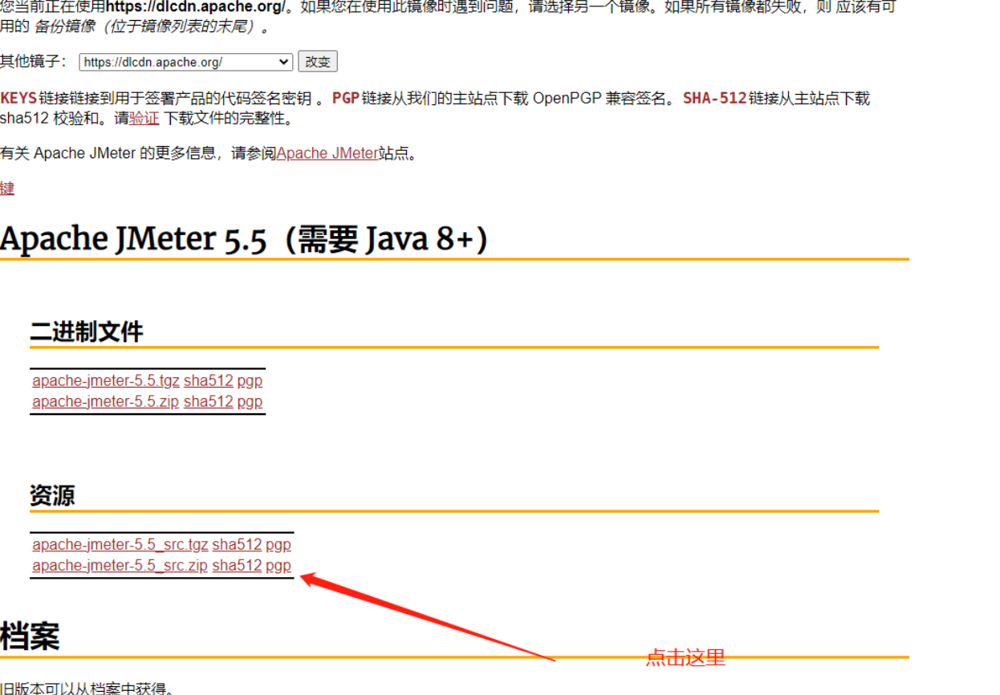

 下载后本地解压打开，找到 e:\\[apache](https://so.csdn.net/so/search?q=apache&spm=1001.2101.3001.7020 "apache")\-jmeter-5.5\\bin 目录下的jmeter.bat 点击即可启动。

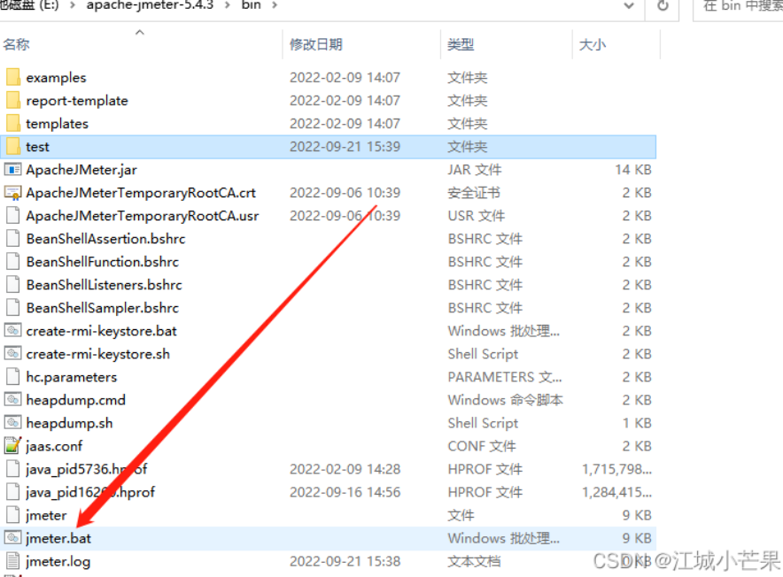

 可以看到，是英文界面,需要在jmeter.properties，搜索language， 去掉前面的#，值改为zh\_CN，保存文件。

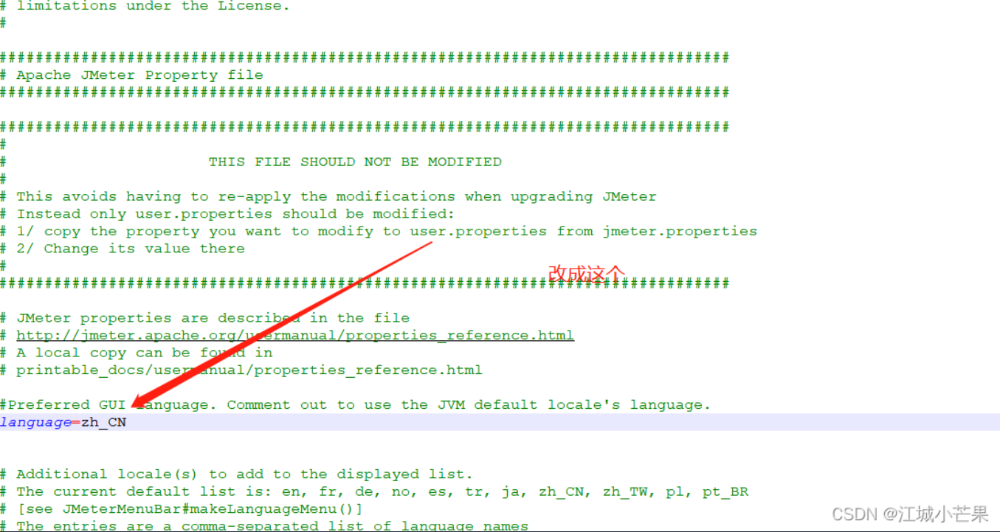

点击【jmeter.bat】重启jmeter客户端，可以看到界面变成中文了

 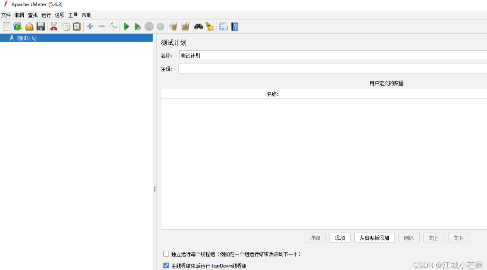

[2.](about:blank#2_41)jmeter插件，用于监控性能数据
---------------------------------------

点击这里进行下载：[jmeter插件](https://jmeter-plugins.org/ "jmeter插件")

下载jmeter-plugins-manager.jar，将此插件复制到Jmeter的lib下的ext目录下

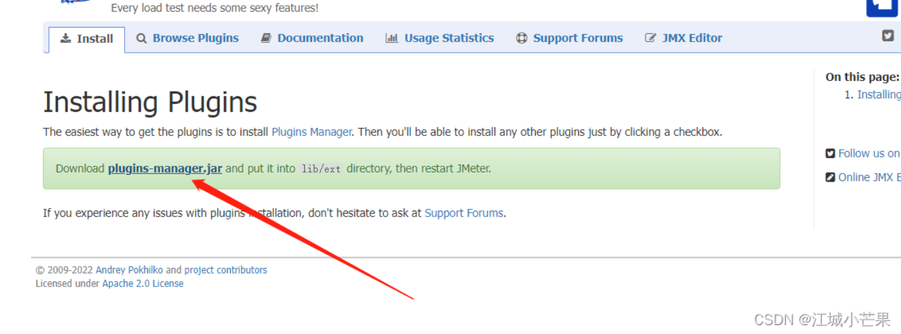

重启后，单击菜单 选项——Plugins Manager打开Jmeter Plugins Manager窗体

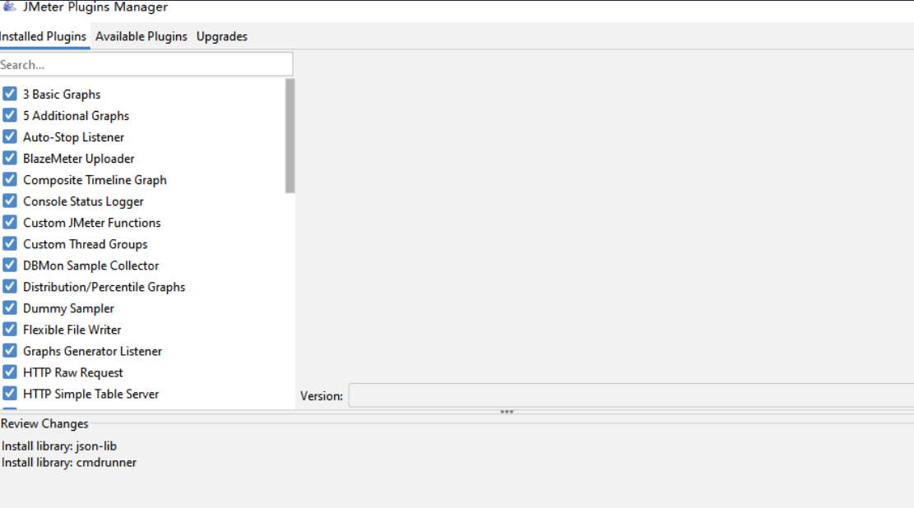

 选择安装插件：

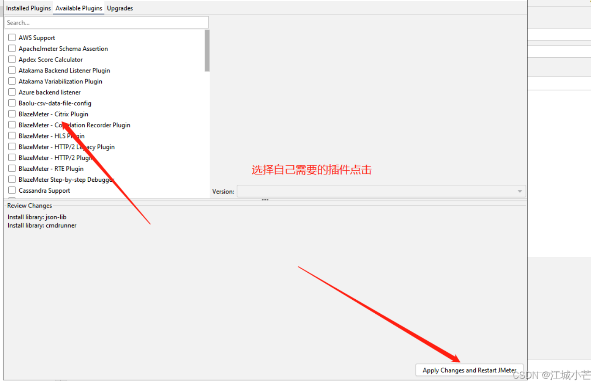

再次重启jmeter，就可以看到对应的插件了。

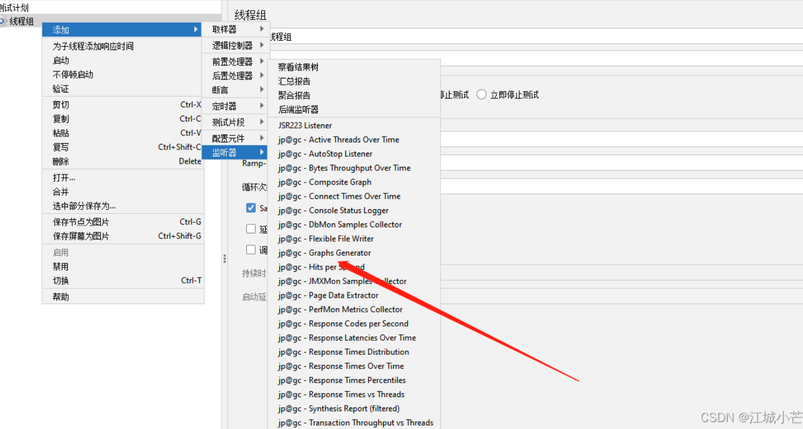

三、环境变量配置
--------

系统环境变量中新增：

JMETER\_HOME=xxx(你的jmeter安装目录)

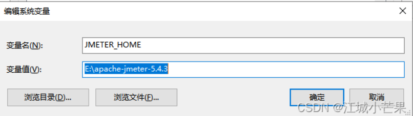

* * *

 验证变量配置是否成功：echo %JMETER\_HOME%

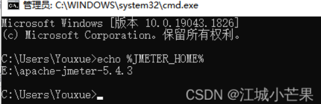

配置path：

PATH=%JMETER\_HOME%\\bin

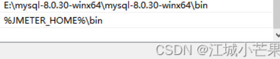

配置后，即可命令行启动jmeter

如果要用到ApacheJMeter\_core.jar中的类，就修改CLASSPATH变量，

CLASSPATH变量值中添加%JMETER\_HOME%\\lib\\ext\\ApacheJMeter\_core.jar;即可。

总结
================================================================================================================================================================================================================================================================================================================================================================================================================================================================================================================

  
