1.补全变量

==Map<String, Object> map = userMapper.selectMapById(id);==

userMapper.selectMapById(id)后alt+enter补全变量

2.下载mybatisX插件后快速生成crud

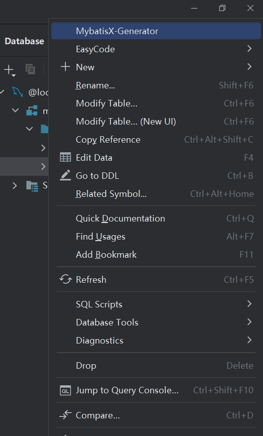

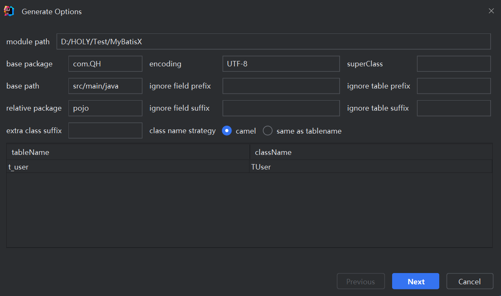

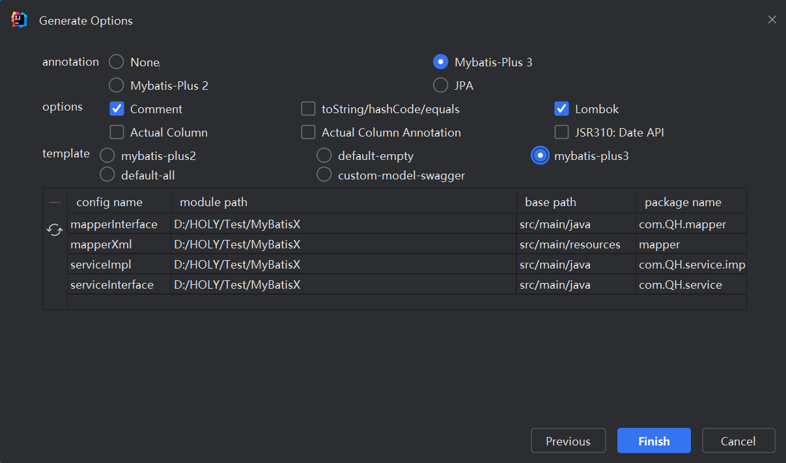

在接口类中：

如写入insert

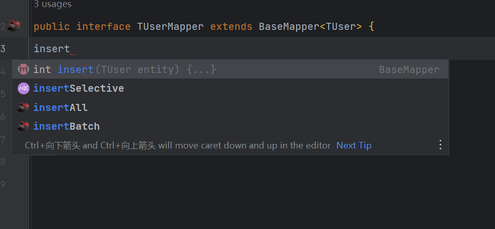

选择插件自带的方法

alt+enter

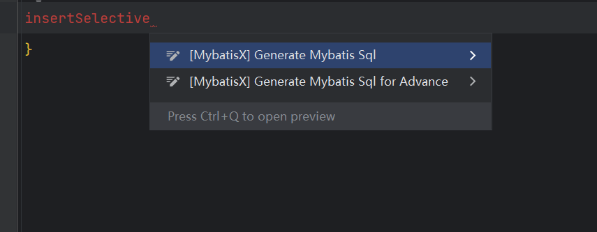

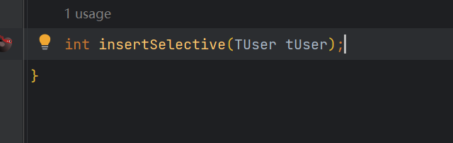

自动生成xml文件

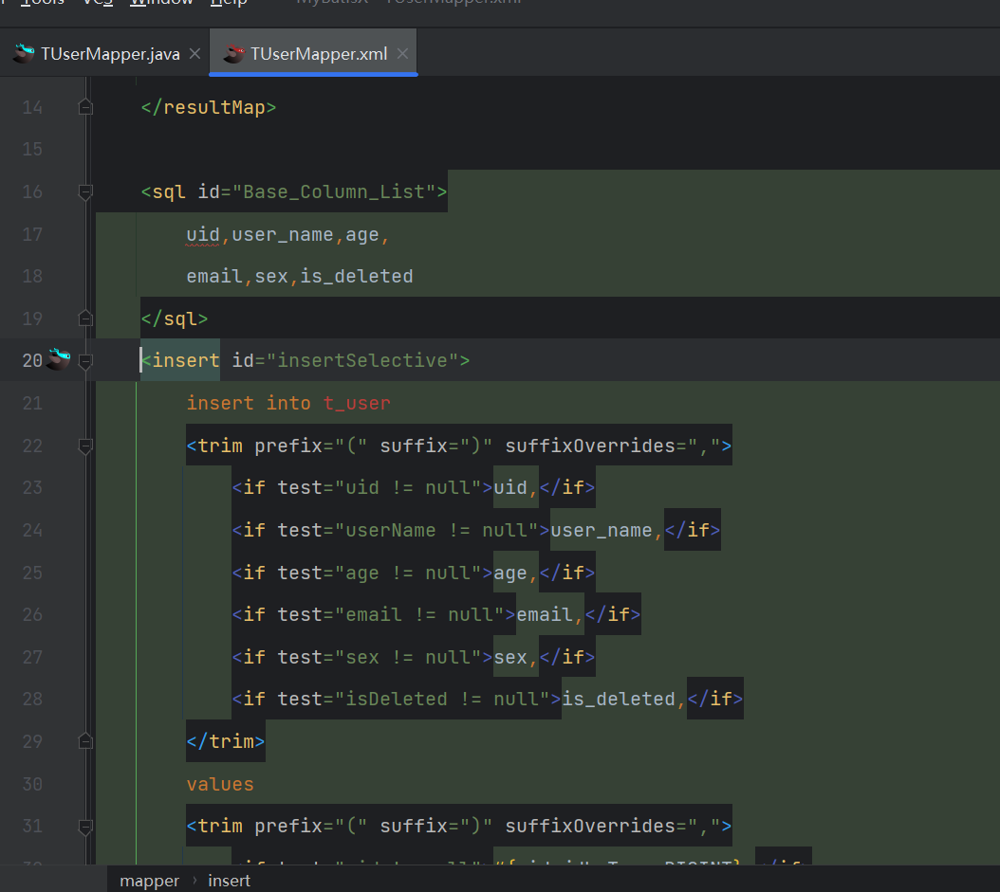

根据年龄和性别修改

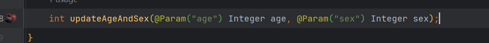

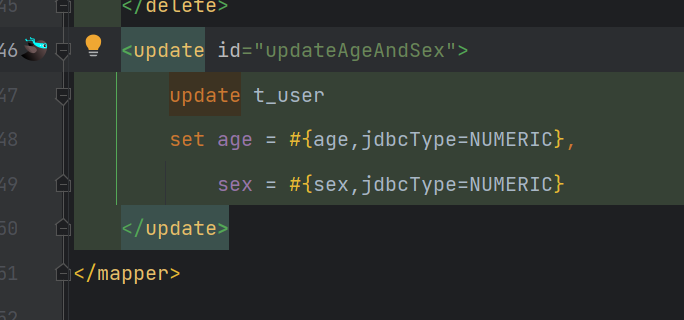

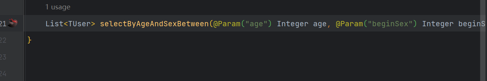

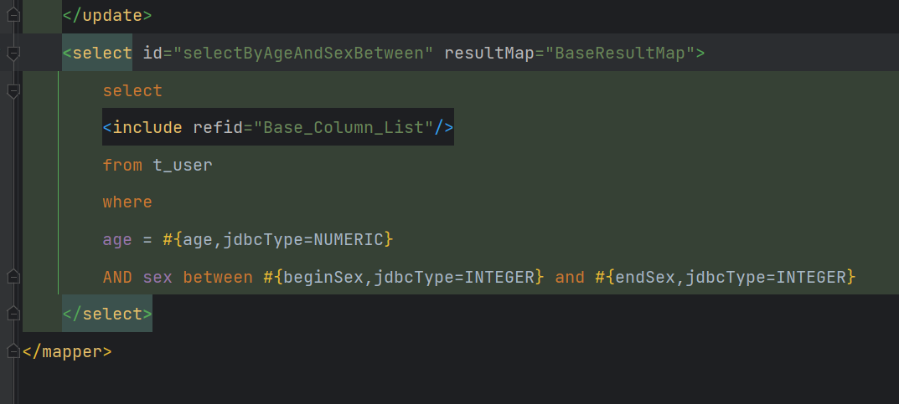

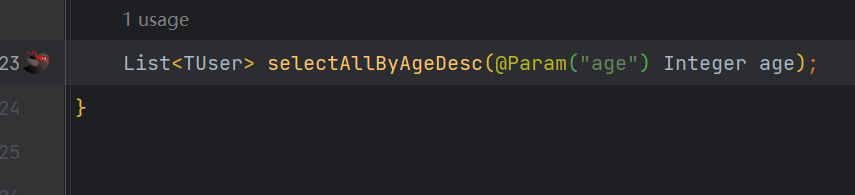

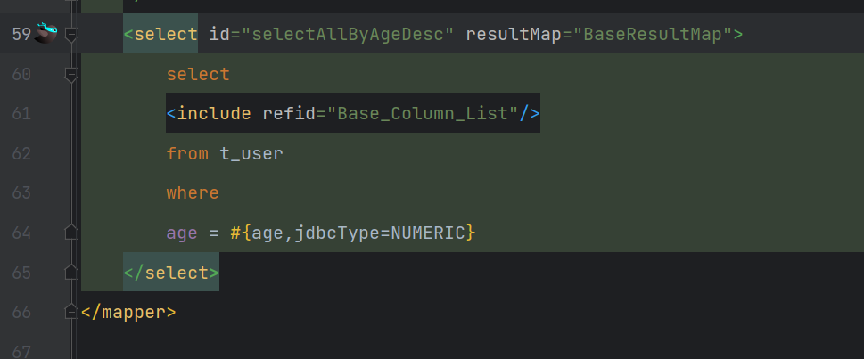

3.替换所有相同变量

先ctrl+f

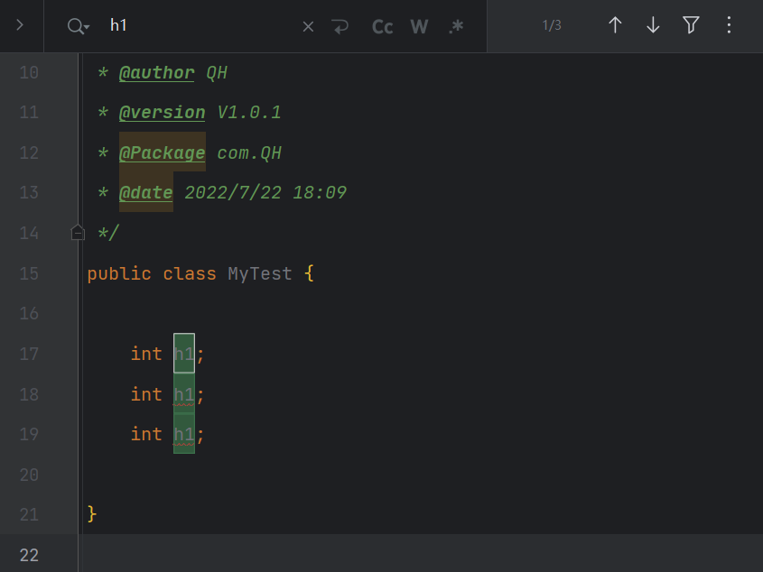

ctrl+r

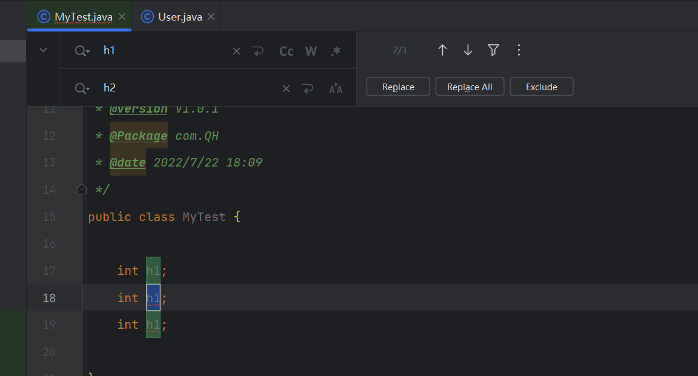

replace all

  /Ctrl+Shift+Alt+J/shift+F6(选中相同变量)

--------

1.1 ctrl + …
常用的快捷键如下：
功能	快捷键
删除当前行	ctrl + Y
复制当前行	ctrl + D（Duplicate 复制）
选中整个单词，连续按可以扩大选中范围	ctrl + W
快速替换字符串，可以替换单个/全部选中字符串	ctrl + R （replace 替换）
在当前文件中查找	ctrl + F（Find 查找）
快速搜索，一般用来快速搜索源码	ctrl + N
查看一个类的层级关系	ctrl + H （Hierarhcy 层级）
快速定位源码，将光标放在一个方法上输入 ctrl + B , 可以去到方法的源码	ctrl + B
添加注释和取消注释，【第一次是添加注释，第二次是取消注释】	ctrl + /
添加/取消多行注释，【第一次是添加注释，第二次是取消注释】	ctrl + shift + /
重写基类的方法	ctrl + O（Override 重写）
1.2 alt + …
常用的快捷键如下：
功能	快捷键
补全代码	alt + /
快速提示完成，在代码可能存在语法问题时，IDEA会提示使用该快捷键可以快速自动修正	alt + enter
快速生成构造器，可以生成含有任意形参的构造器	alt + insert
快速显示类结构，可以显示类中包含的所有属性和方法	alt + 7
1.3 ctrl + alt + …
常用的快捷键如下：
功能	快捷键
快速格式化代码	ctrl + alt + L
自动缩进行	ctrl + alt + I
将选中的代码使用if、while、try/catch等包装	ctrl + alt + T
1.4 ctrl + shift + …
常用的快捷键如下：
功能	快捷键
去除相关的包装代码	ctrl + shift + Delete
将光标所在的代码块向上/下整体移动	ctrl + shift + 向上/下箭头
快速运行当前的程序	ctrl + shift + F10
添加/取消多行注释，【第一次是添加注释，第二次是取消注释】	ctrl + shift + /
1.5 其它
常用的快捷键如下：
功能	快捷键
自动分配变量名，在新建对象时在后面加 .var

> idea快捷建新类
> 先alt+1选中左边项目再上下键选择软件包最后alt+insert

> 快捷键：shift+enter换下一行
> ctrl+d复制上一行

> 使用smart tomcat可以简化部署，避免自带使用自带tomcat时，若project settings中artifacts中的web application archive&exploded没有导入，或web application exploded
> 中的lib未导入导致访问jsp报404（若使用自带插件则需要删除原有web application archive&exploded重新导入，先导入exploded再导入archive）

> 统一配置所有项目的maven:
> File->New Projects Setup->Setting for New Projects->搜索maven，修改maven home 
> path为自带的，users setting file中选择maven文件中的conf->setting.xml/C盘.m2下的
> setting.xml,local repostory选择提前创建好的文件夹
>
> 配置mapper文件时如UserMapper时，把变量粘贴到本页面的注释中，能cv则不手写

快捷键：shift+enter换下一行
ctrl+d复制上一行
