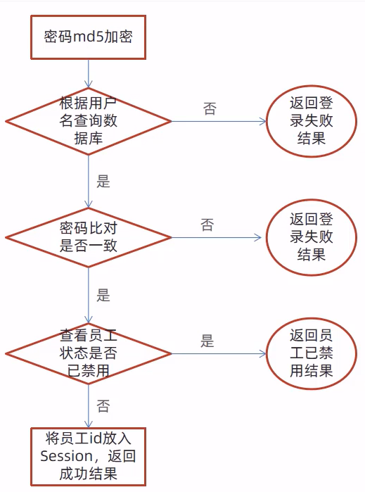
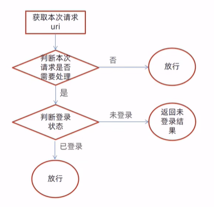
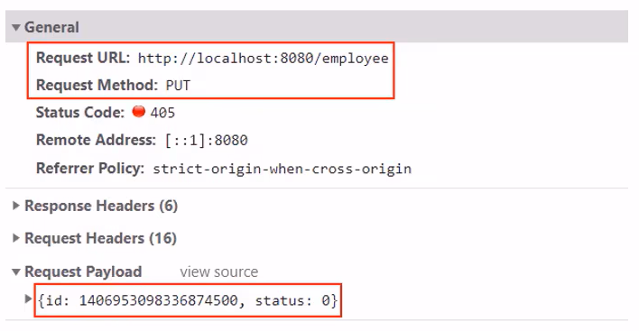
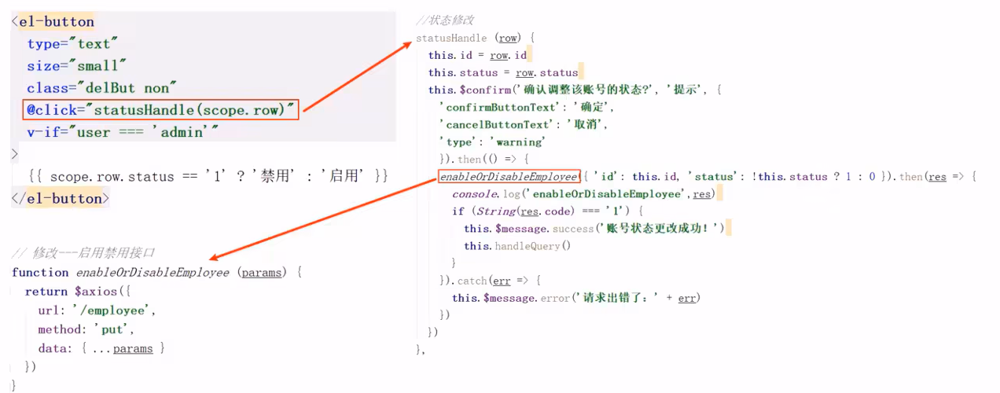
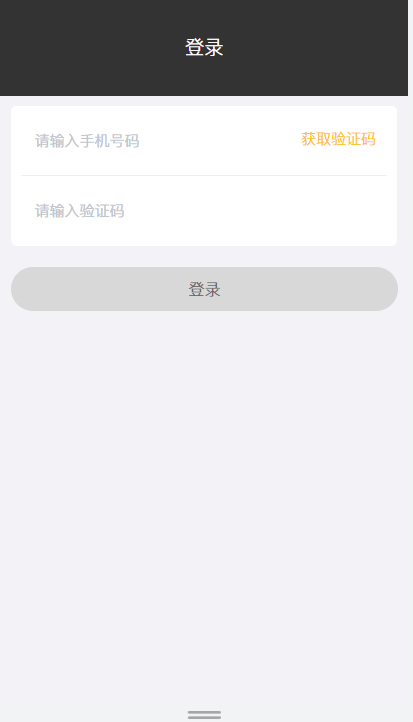
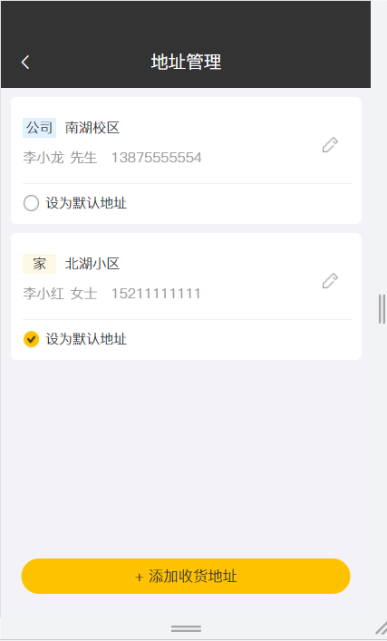

# [Java项目实战——瑞吉外卖Day01](https://www.cnblogs.com/KizunaAI/p/16253032.html)

 

# 瑞吉外卖开发笔记 一

笔记内容为**黑马程序员**视频内容

## 1、软件开发整体介绍

### 软件开发流程


### 角色分工


### 软件环境


## 2、瑞奇外卖项目介绍

### 项目介绍


### 产品原型展示


### 技术选型


### 功能架构


### 角色


## 3、环境搭建

### 数据库环境搭建

- **创建数据库**
  
- **执行SQL脚本**
  
- **数据表**
  

### maven项目搭建


**解决IDEA加载maven工程缓慢**
VM Options:-DarchetypeCatalog=local

**添加依赖:**

```xml
    <parent>
        <groupId>org.springframework.boot</groupId>
        <artifactId>spring-boot-starter-parent</artifactId>
        <version>2.4.5</version>
        <relativePath/> <!-- lookup parent from repository -->
    </parent>
    <groupId>com.ka</groupId>
    <artifactId>reggie</artifactId>
    <version>1.0-SNAPSHOT</version>
    <properties>
        <java.version>1.8</java.version>
    </properties>
    <dependencies>

        <dependency>
            <groupId>org.springframework.boot</groupId>
            <artifactId>spring-boot-starter</artifactId>
        </dependency>

        <dependency>
            <groupId>org.springframework.boot</groupId>
            <artifactId>spring-boot-starter-test</artifactId>
            <scope>test</scope>
        </dependency>

        <dependency>
            <groupId>org.springframework.boot</groupId>
            <artifactId>spring-boot-starter-web</artifactId>
            <scope>compile</scope>
        </dependency>

        <dependency>
            <groupId>com.baomidou</groupId>
            <artifactId>mybatis-plus-boot-starter</artifactId>
            <version>3.4.2</version>
        </dependency>

        <dependency>
            <groupId>org.projectlombok</groupId>
            <artifactId>lombok</artifactId>
            <version>1.18.20</version>
        </dependency>

        <dependency>
            <groupId>com.alibaba</groupId>
            <artifactId>fastjson</artifactId>
            <version>1.2.76</version>
        </dependency>

        <dependency>
            <groupId>commons-lang</groupId>
            <artifactId>commons-lang</artifactId>
            <version>2.6</version>
        </dependency>

        <dependency>
            <groupId>mysql</groupId>
            <artifactId>mysql-connector-java</artifactId>
            <scope>runtime</scope>
        </dependency>

        <dependency>
            <groupId>com.alibaba</groupId>
            <artifactId>druid-spring-boot-starter</artifactId>
            <version>1.1.23</version>
        </dependency>

    </dependencies>

    <build>
        <plugins>
            <plugin>
                <groupId>org.springframework.boot</groupId>
                <artifactId>spring-boot-maven-plugin</artifactId>
                <version>2.4.5</version>
            </plugin>
        </plugins>
    </build>
```

**application.yml**

```yaml
server:
  port: 8080
spring:
  application:
    #应用名称
    name: reggie_take_out
  datasource:
    druid:
      driver-class-name: com.mysql.cj.jdbc.Driver
      url: jdbc:mysql://localhost:3306/reggie?serverTimezone=Asia/Shanghai&useUnicode=true&characterEncoding=utf-8&zeroDateTimeBehavior=convertToNull&useSSL=false&allowPublicKeyRetrieval=true
      username: root
      password: 1234
mybatis-plus:
  configuration:
    #address_book->AddressBook
    #在映射实体或者属性时，将数据库中表名和字段名中的下划线去掉，按照驼峰命名法映射
    map-underscore-to-camel-case: true
    log-impl: org.apache.ibatis.logging.stdout.StdOutImpl
  global-config:
    db-config:
      id-type: ASSIGN_ID
```

**配置application启动类**

```less
@Slf4j
@SpringBootApplication
public class ReggieApplication {
    public static void main(String[] args) {
        SpringApplication.run(ReggieApplication.class,args);
        log.info("项目启动成功！！！");
    }
}
```

把前端的静态资源放在resource目录


设置静态资源映射

```scala
@Slf4j
@Configuration
public class WebMvcConfig extends WebMvcConfigurationSupport {
    @Override
    protected void addResourceHandlers(ResourceHandlerRegistry registry) {
        log.info("开始静态资源映射");
        registry.addResourceHandler("/backend/**").addResourceLocations("classpath:/backend/");
        registry.addResourceHandler("/front/**").addResourceLocations("classpath:/front/");
    }
}
```

启动项目，访问http://localhost:8080/backend/index.html


## 4、后台登录功能开发

### 需求分析

- 登录页面展示(http://localhost:8080/backend/page/login/login.html)
  
- 查看登录请求信息
  
- 数据模型（employee表）
  

### 代码开发

- 创建实体类Employee，和employee表进行映射

```typescript
@Data
public class Employee implements Serializable {

    private static final long serialVersionUID = 1L;

    private Long id;

    private String username;

    private String name;

    private String password;

    private String phone;

    private String sex;

    private String idNumber;//身份证号码

    private Integer status;

    private LocalDateTime createTime;

    private LocalDateTime updateTime;

    @TableField(fill = FieldFill.INSERT)
    private Long createUser;

    @TableField(fill = FieldFill.INSERT_UPDATE)
    private Long updateUser;

}
```

- 创建Controller，Service，Mapper

EmployeeMapper

```java
@Mapper
public interface EmployeeMapper extends BaseMapper<Employee> {
}
```

EmployeeService

```csharp
public interface EmployeeService extends IService<Employee> {
}
```

EmployeeServiceImpl

```scala
@Service
public class EmployeeServiceImpl extends ServiceImpl<EmployeeMapper, Employee> implements EmployeeService {
}
```

EmployeeController

```less
@Slf4j
@RestController
@RequestMapping("/employee")
public class EmployeeController {
    @Autowired
    private EmployeeServiceImpl employeeService;
}
```

- 导入返回结果类R
  - 此类是一个通用结果类，服务端响应的所有结果最终都会包装成此种类型返回给前端页面

```typescript
@Data
public class R<T> {

    private Integer code; //编码：1成功，0和其它数字为失败

    private String msg; //错误信息

    private T data; //数据

    private Map map = new HashMap(); //动态数据

    public static <T> R<T> success(T object) {
        R<T> r = new R<T>();
        r.data = object;
        r.code = 1;
        return r;
    }

    public static <T> R<T> error(String msg) {
        R r = new R();
        r.msg = msg;
        r.code = 0;
        return r;
    }

    public R<T> add(String key, Object value) {
        this.map.put(key, value);
        return this;
    }

}
```

- 在Controller中创建登录方法
  
  

```kotlin
@Slf4j
@RestController
@RequestMapping("/employee")
public class EmployeeController {
    @Autowired
    private EmployeeServiceImpl employeeService;

    @PostMapping("/login")
    public R<Employee> logib(HttpServletRequest request, @RequestBody Employee employee) {

        //1、将页面提交的密码进行md5加密处理
        String password = employee.getPassword();
        password = DigestUtils.md5DigestAsHex(password.getBytes());

        //2、根据页面提交的用户名来查数据库
        LambdaQueryWrapper<Employee> queryWrapper = new LambdaQueryWrapper<>();
        queryWrapper.eq(Employee::getUsername, employee.getUsername());
        Employee emp = employeeService.getOne(queryWrapper);

        //3、如果没有查询到则返回失败结果
        if (emp == null) {
            return R.error("登录失败");
        }

        //4、比对密码，如果不一致则返回失败结果
        if (!emp.getPassword().equals(password)) {
            return R.error("密码错误");
        }

        //5、查看员工状态，如果已禁用状态，则返回员工已禁用结果
        if (emp.getStatus() == 0) {
            return R.error("账号已禁用");
        }

        //6、登录成功，将用户id存入Session并返回成功结果
        request.getSession().setAttribute("employee", emp.getId());
        return R.success(emp);
    }
}
```

## 5、后台退出功能开发

**需求分析**


**代码实现**

在Controller中创建退出方法

```typescript
    //员工退出
    @PostMapping("/logout")
    public R<String> logout(HttpServletRequest request){
        //清理Session中保存的当前员工登录的id
        request.getSession().removeAttribute("employee");
        return R.success("退出成功");
    }
```

# [Java项目实战——瑞吉外卖Day02](https://www.cnblogs.com/KizunaAI/p/16258050.html)

# 瑞吉外卖开发笔记 二

笔记内容为**黑马程序员**视频内容

## 1、完善登录功能

### 问题分析

前面我们已经完成了后台系统的员工登录功能开发，但是还存在一个问题:用户如果不登录，直接访问系统首页面，照样可以正常访问。

这种设计并不合理，我们希望看到的效果应该是，**只有登录成功后才可以访问系统中的页面**，如果没有登录则跳转到登录页面。

那么，具体应该怎么实现呢?

答案就是使用**过滤器或者拦截器**，在过滤器或者拦截器中**判断用户是否已经完成登录**，如果没有登录则跳转到登录页面

### 代码实现

实现步骤:

- **创建自定义过滤器LoginCheckFilter**

```java
@WebFilter(filterName = "LoginCheckFilter",urlPatterns = "/*")
@Slf4j
public class LoginCheckFilter implements Filter {
    @Override
    public void doFilter(ServletRequest servletRequest, ServletResponse servletResponse, FilterChain filterChain) throws IOException, ServletException {
        HttpServletRequest request=(HttpServletRequest) servletRequest;
        HttpServletResponse response=(HttpServletResponse) servletResponse;
        log.info("拦截到请求：{}",request.getRequestURI());
        filterChain.doFilter(request,response);
    }
}
```

- **在启动类上加入注解@ServletComponentScan**

```less
@Slf4j
@SpringBootApplication
@ServletComponentScan
public class ReggieApplication {
    public static void main(String[] args) {
        SpringApplication.run(ReggieApplication.class,args);
        log.info("项目启动成功！！！");
    }
}
```

- **完善过滤器的处理逻辑**

过滤器具体的处理逻辑如下:

1、获取本次请求的URI

2、判断本次请求是否需要处理

3、如果不需要处理，则直接放行

4、判断登录状态，如果已登录，则直接放行

5、如果未登录则返回未登录结果


```typescript
/**
 * @ClassName: LoginCheckFilter
 * @Description: 检查用户是否已经完成登录
 * @author: 名字
 * @date: 2022/5/10  15:57
 */
@WebFilter(filterName = "LoginCheckFilter",urlPatterns = "/*")
@Slf4j
public class LoginCheckFilter implements Filter {
    //路径匹配器，支持通配符
    public static final AntPathMatcher PATH_MATCHER=new AntPathMatcher();

    @Override
    public void doFilter(ServletRequest servletRequest, ServletResponse servletResponse, FilterChain filterChain) throws IOException, ServletException {
        HttpServletRequest request=(HttpServletRequest) servletRequest;
        HttpServletResponse response=(HttpServletResponse) servletResponse;

//        1、获取本次请求的URI
        String requestURI = request.getRequestURI();

        log.info("拦截到请求：{}",requestURI);

//        定义不需要处理的请求路径
        String[] urls=new String[]{
                "/employee/login",
                "/employee/logout",
                "/backend/**",
                "/front/**"
        };
//        2、判断本次请求是否需要处理
        boolean check = check(urls, requestURI);
//        3、如果不需要处理，则直接放行
        if(check){
            log.info("本次请求{}不需要处理",requestURI);
            filterChain.doFilter(request,response);
            return;
        }
//        4、判断登录状态，如果已登录，则直接放行
        if(request.getSession().getAttribute("employee")!=null){
            log.info("用户已登录，用户id为：{}",request.getSession().getAttribute("employee"));
            filterChain.doFilter(request,response);
            return;
        }
        log.info("用户未登录");
//        5、如果未登录则返回未登录结果,通过输出流向客户端页面响应数据
        response.getWriter().write(JSON.toJSONString(R.error("NOTLOGIN")));
        return;
    }
    //路径匹配，检查本次请求是否需要放行
    public boolean check(String[] urls,String requestURI){
        for (String url : urls) {
            boolean match = PATH_MATCHER.match(url, requestURI);
            if(match==true){
                return true;
            }
        }
        return  false;
    }
}
```

## 2、新增员工

### 需求分析

后台系统中可以管理员工信息，通过新增员工来添加后台系统用户。点击 **添加员工** 按钮跳转到新增页面，如下:


### 数据模型

新增员工，其实就是将我们新增页面录入的员工数据插入到employee表。需要注意，employee表中对username字段加入了唯一约束，因为username是员工的登录账号，必须是**唯一**的

### 代码开发

在开发代码之前，需要梳理一下整个程序的执行过程:

- 页面发送ajax请求，将新增员工页面中输入的数据以json的形式提交到服务端
- 服务端Controller接收页面提交的数据并调用Service将数据进行保存
- Service调用Mapper操作数据库，保存数据
  

```kotlin
    //新增员工
    @PostMapping
    public R<String> save(HttpServletRequest request, @RequestBody Employee employee){
        log.info("新增员工，员工信息：{}",employee.toString());
        //设置初始密码，需要进行md5加密处理
        employee.setPassword(DigestUtils.md5DigestAsHex("123456".getBytes()));

        employee.setCreateTime(LocalDateTime.now());
        employee.setUpdateTime(LocalDateTime.now());

        Long empId = (Long) request.getSession().getAttribute("employee");

        employee.setCreateUser(empId);
        employee.setUpdateUser(empId);

        employeeService.save(employee);

        return R.success("新增员工成功");
    }
```

前面的程序还存在一个问题，就是当我们在新增员工时输入的账号已经存在，由于employee表中对该字段加入了唯一约束，此时程序会抛出异常:
`java.sql.SQLIntegrityConstraintViolationException: Duplicate entry 'heniang' for key 'idx_username'`

此时需要我们的程序进行异常捕获，通常有两种处理方式:

1、在Controller方法中加入try.catch进行异常捕获

2、使用异常处理器进行全局异常捕获

```typescript
@ControllerAdvice(annotations = {RestController.class, Controller.class})
@ResponseBody
@Slf4j
public class GlobalExceptionHandler {

    //进行异常处理方法
    @ExceptionHandler(SQLIntegrityConstraintViolationException.class)
    public R<String> exceptionHandler(SQLIntegrityConstraintViolationException ex){
        log.error(ex.getMessage());

        if(ex.getMessage().contains("Duplicate entry")){
            String[] split = ex.getMessage().split(" ");
            String msg=split[2]+"已存在";
            return R.error(msg);
        }

        return R.error("未知错误");
    }
}
```

**总结**

1、根据产品原型明确业务需求

2、重点分析数据的流转过程和数据格式

3、通过debug断点调试跟踪程序执行过程

## 3、员工信息分页查询

### 需求分析

系统中的员工很多的时候，如果在一个页面中全部展示出来会显得比较乱，不便于查看，所以一般的系统中都会以分页的方式来展示列表数据。


### 代码开发

在开发代码之前，需要梳理一下整个程序的执行过程:

- 页面发送ajax请求，将分页查询参数(page.pageSize、name)提交到服务端
- 服务端Controller接收页面提交的数据并调用Service查询数据
- Service调用Mapper操作数据库，查询分页数据
- Controller将查询到的分页数据响应给页面
- 页面接收到分页数据并通过ElementUI的Table组件展示到页面上

配置MP分页插件

```java
@Configuration
public class MybatisPlusConfig {
    @Bean
    public MybatisPlusInterceptor mybatisPlusInterceptor(){
        MybatisPlusInterceptor mybatisPlusInterceptor = new MybatisPlusInterceptor();
        mybatisPlusInterceptor.addInnerInterceptor(new PaginationInnerInterceptor());
        return  mybatisPlusInterceptor;
    }
}
```

员工信息分页查询

```java
@GetMapping("/page")
public R<Page> page(int page, int pageSize, String name) {
    log.info("page={},pageSize={},name={}", page, pageSize, name);

    //构造分页构造器
    Page pageInfo=new Page(page,pageSize);

    //构造条件构造器
    LambdaQueryWrapper<Employee> queryWrapper=new LambdaQueryWrapper();
    //添加过滤条件
    queryWrapper.like(!StringUtils.isEmpty(name),Employee::getName,name);
    //添加排序条件
    queryWrapper.orderByDesc(Employee::getUpdateTime);

    //执行查询
    employeeService.page(pageInfo,queryWrapper);

    return R.success(pageInfo);
}
```

### 功能测试


## 4、启用/禁用员工账号

### 需求分析

在员工管理列表页面，可以对某个员工账号进行启用或者禁用操作。账号禁用的员工不能登录系统，启用后的员工可以正常登录。

需要注意，只有管理员（admin用户）可以对其他普通用户进行启用、禁用操作，所以普通用户登录系统后启用、禁用按钮不显示。

### 代码开发

页面中是怎么做到只有管理员admin能够看到启用、禁用按钮的？


在开发代码之前，需要梳理一下整个程序的执行过程:

1、页面发送ajax请求，将参数(id、 status)提交到服务端

2、服务端Controller接收页面提交的数据并调用Service更新数据

3、Service调用Mapper操作数据库



页面中的ajax请求是如何发送的？


根据id修改员工信息

```kotlin
@PutMapping
public R<String> update(HttpServletRequest request,@RequestBody Employee employee){
    log.info(employee.toString());

    Long empId = (Long) request.getSession().getAttribute("employee");
    employee.setUpdateTime(LocalDateTime.now());
    employee.setUpdateUser(empId);
    employeeService.updateById(employee);

    return R.success("员工信息修改成功");
}
```

测试过程中没有报错，但是功能并没有实现，查看数据库中的数据也没有变化。观察控制台输出的SQL:


SQL执行的结果是更新的数据行数为0，仔细观察id的值，和数据库中对应记录的id值并不相同


### 代码修复

通过观察控制台输出的SQL发现页面传递过来的员工id的值和数据库中的id值不一致，这是怎么回事呢?

分页查询时服务端响应给页面的数据中id的值为19位数字，类型为long

页面中js处理long型数字只能精确到**前16位**，所以最终通过ajax请求提交给服务端的时候id就改变了

前面我们已经发现了问题的原因，即js对long型数据进行处理时**丢失精度**，导致提交的id和数据库中的id不一致。

如何解决这个问题?

我们可以在**服务端**给页面**响应json数据时进行处理**，**将long型数据统一转为String字符串**。

**具体实现步骤:**

**1)** 提供对象转换器JacksonobjectMapper，基于Jackson进行Java对象到json数据的转换（资料中已经提供，直接复制到项目中使用)

```scala
/**
 * 对象映射器:基于jackson将Java对象转为json，或者将json转为Java对象
 * 将JSON解析为Java对象的过程称为 [从JSON反序列化Java对象]
 * 从Java对象生成JSON的过程称为 [序列化Java对象到JSON]
 */
public class JacksonObjectMapper extends ObjectMapper {

    public static final String DEFAULT_DATE_FORMAT = "yyyy-MM-dd";
    public static final String DEFAULT_DATE_TIME_FORMAT = "yyyy-MM-dd HH:mm:ss";
    public static final String DEFAULT_TIME_FORMAT = "HH:mm:ss";

    public JacksonObjectMapper() {
        super();
        //收到未知属性时不报异常
        this.configure(FAIL_ON_UNKNOWN_PROPERTIES, false);

        //反序列化时，属性不存在的兼容处理
        this.getDeserializationConfig().withoutFeatures(DeserializationFeature.FAIL_ON_UNKNOWN_PROPERTIES);


        SimpleModule simpleModule = new SimpleModule()
                .addDeserializer(LocalDateTime.class, new LocalDateTimeDeserializer(DateTimeFormatter.ofPattern(DEFAULT_DATE_TIME_FORMAT)))
                .addDeserializer(LocalDate.class, new LocalDateDeserializer(DateTimeFormatter.ofPattern(DEFAULT_DATE_FORMAT)))
                .addDeserializer(LocalTime.class, new LocalTimeDeserializer(DateTimeFormatter.ofPattern(DEFAULT_TIME_FORMAT)))

                .addSerializer(BigInteger.class, ToStringSerializer.instance)
                .addSerializer(Long.class, ToStringSerializer.instance)
                .addSerializer(LocalDateTime.class, new LocalDateTimeSerializer(DateTimeFormatter.ofPattern(DEFAULT_DATE_TIME_FORMAT)))
                .addSerializer(LocalDate.class, new LocalDateSerializer(DateTimeFormatter.ofPattern(DEFAULT_DATE_FORMAT)))
                .addSerializer(LocalTime.class, new LocalTimeSerializer(DateTimeFormatter.ofPattern(DEFAULT_TIME_FORMAT)));

        //注册功能模块 例如，可以添加自定义序列化器和反序列化器
        this.registerModule(simpleModule);
    }
}
```

**2)** 在WebMvcConfig配置类中扩展Spring mvc的消息转换器，在此消息转换器中使用提供的对象转换器进行Java对象到json数据的转换

```java
@Override
protected void extendMessageConverters(List<HttpMessageConverter<?>> converters) {
    //创建消息转换器
    MappingJackson2HttpMessageConverter messageConverter = new MappingJackson2HttpMessageConverter();
    //设置对象转换器，底层使用Jackson将Java转换为json
    messageConverter.setObjectMapper(new JacksonObjectMapper());
    //将上面的消息转换器对象追加到mvc框架的转换器集合中
    converters.add(0,messageConverter);
    super.extendMessageConverters(converters);
}
```

## 5、编辑员工信息

### 需求分析

在员工管理列表页面点击编辑按钮，跳转到编辑页面，在编辑页面回显员工信息并进行修改，最后点击保存按钮完成编辑操作


### 代码开发

在开发代码之前需要梳理一下操作过程和对应的程序的执行流程:

1、点击编辑按钮时，页面跳转到add.html，并在url中携带参数[员工id]

2、在add.html页面获取url中的参数[员工id]

3、发送ajax请求，请求服务端，同时提交员工id参数

4、服务端接收请求，根据员工id查询员工信息，将员工信息以json形式响应给页面

```kotlin
//根据id查询员工信息
@GetMapping("/{id}")
public R<Employee> getById(@PathVariable String id){
    log.info("根据id查对象");
    Employee emp = employeeService.getById(id);
    if(emp!=null){
        return R.success(emp);
    }
    return R.error("没有查询到该用户信息");
}
```

5、页面接收服务端响应的json数据，通过VUE的数据绑定进行员工信息回显

6、点击保存按钮，发送ajax请求，将页面中的员工信息以json方式提交给服务端

7、服务端接收员工信息，并进行处理，完成后给页面响应

8、页面接收到服务端响应信息后进行相应处理

**注意**:add.html页面为公共页面，**新增员工和编辑员工都是在此页面操作**，所以该代码部分与之前添加员工代码对应，不需要重写。

# [Java项目实战——瑞吉外卖Day03](https://www.cnblogs.com/KizunaAI/p/16262875.html)

# 瑞吉外卖开发笔记 三

笔记内容为**黑马程序员**视频内容

## 分类管理业务开发

### 公共字段自动填充

#### 问题分析

前面我们已经完成了后台系统的员工管理功能开发，在新增员工时需要设置创建时间、创建人、修改时间、修改人等字段，在编辑员工时需要设置修改时间和修改人等字段。这些字段属于公共字段，也就是很多表中都有这些字段，如下:


能不能对于这些公共字段在某个地方统一处理，来简化开发呢?答案就是使用Mybatis Plus提供的**公共字段自动填充**功能。

#### 代码实现

Mybatis Plus公共字段自动填充，也就是在插入或者更新的时候为指定字段赋予指定的值，使用它的好处就是可以统一对这些字段进行处理，避免了重复代码。

实现步骤:

1、在实体类的属性上加入@TableField注解，指定自动填充的策略

```kotlin
@TableField(fill = FieldFill.INSERT)//插入时填充字段
private LocalDateTime createTime;

@TableField(fill = FieldFill.INSERT_UPDATE)//插入和更新时填充字段
private LocalDateTime updateTime;

@TableField(fill = FieldFill.INSERT)
private Long createUser;

@TableField(fill = FieldFill.INSERT_UPDATE)
private Long updateUser;
```

2、按照框架要求编写元数据对象处理器，在此类中统一为公共字段赋值，此类需要实现MetaObjectHandler接口

```typescript
@Component
@Slf4j
public class MyMetaObjectHandler implements MetaObjectHandler {
    //插入时自动填充
    @Override
    public void insertFill(MetaObject metaObject) {
        log.info("公共字段自动填充【insert】。。。");
        log.info(metaObject.toString());
        metaObject.setValue("createTime", LocalDateTime.now());
        metaObject.setValue("updateTime", LocalDateTime.now());
        metaObject.setValue("createUser",new Long(1));
        metaObject.setValue("updateUser",new Long(1));
    }
    //更新时自动填充
    @Override
    public void updateFill(MetaObject metaObject) {
        log.info("公共字段自动填充【update】。。。");
        log.info(metaObject.toString());
        metaObject.setValue("updateTime",LocalDateTime.now());
        metaObject.setValue("updateUser",new Long(1));
    }
}
```

#### 功能完善

前面我们已经完成了公共字段自动填充功能的代码开发，但是还有一个问题没有解决，就是我们在自动填充createUser和updateUser时设置的用户id是固定值，现在我们需要改造成动态获取当前登录用户的id。

有的同学可能想到，用户登录成功后我们将用户id存入了HttpSession中，现在我从HttpSession中获取不就行了?

**注意**，我们在MyMetaObjectHandler类中是不能获得HttpSession对象的，所以我们需要通过其他方式来获取登录用户id。

可以使用**ThreadLocal**来解决此问题,它是JDK中提供的一个类。

在学习ThreadLocal之前，我们需要先确认一个事情，**就是客户端发送的每次http请求，对应的在服务端都会分配一个新的线程来处理**，在处理过程中涉及到下面类中的方法**都属于相同的一个线程**:

1、LoginCheckFilter的doFilter方法

2、EmployeeContraller的update方法

3、MyMetaObjectHandler的updateFill方法

可以在上面的三个方法中分别加入下面代码（获取当前线程id):

```objectivec
long id = Thread.currentThread().getId() ;
log.info("线程id:{}" ,id);
```

执行编辑员工功能进行验证，通过观察控制台输出可以发现，一次请求对应的线程id是相同的:


**什么是ThreadLocal?**

ThreadLocal并不是一个Thread，而是Thread的局部变量。当使用ThreadLocal维护变量时，ThreadLocal为每个使用该变量的线程提供独立的变量副本，所以每一个线程都可以独立地改变自己的副本，而不会影响其它线程所对应的副本。
ThreadLocal为每个线程提供单独一份存储空间，具有线程隔离的效果，只有在线程内才能获取到对应的值，线程外则不能访问。

ThreadLocal常用方法：

- public void set(T value) 设置当前线程局部变量的值
- public T get() 返回当前线程所对应的线程局部变量的值

我们可以在LoginCheckFilter的doFilter方法中获取当前登录用户id，并调用ThreadLocal的set方法来设置当前线程的线程局部变量的值（用户id)，然后在MyMetaObjectHandler的updateFill方法中调用ThreadLocal的get方法来获得当前线程所对应的线程局部变量的值(用户id)。

**实现步骤:**

1、编写BaseContext工具类，基于ThreadLocal封装的工具类

```csharp
/**
 * 基于ThreadLocal封装的工具类，用于保存和获取当前登录用户的id
 */
public class BaseContext {
    private static ThreadLocal<Long> threadLocal=new ThreadLocal<>();

    public static void setCurrentId(Long id){
        threadLocal.set(id);
    }

    public static Long getCurrentId(){
        return threadLocal.get();
    }
}
```

2、在LogincheckFilter的doFilter方法中调用BaseContext来设置当前登录用户的id

```kotlin
if (request.getSession().getAttribute("employee") != null) {
    log.info("用户已登录，用户id为：{}", request.getSession().getAttribute("employee"));

    Long empId= (Long) request.getSession().getAttribute("employee");

    BaseContext.setCurrentId(empId);

    filterChain.doFilter(request, response);
    return;
}
```

3、在MyMeta0bjectHandler的方法中调用BaseContext获取登录用户的id

```typescript
@Component
@Slf4j
public class MyMetaObjectHandler implements MetaObjectHandler {
    //插入时自动填充
    @Override
    public void insertFill(MetaObject metaObject) {
        log.info("公共字段自动填充【insert】。。。");
        log.info(metaObject.toString());
        metaObject.setValue("createTime", LocalDateTime.now());
        metaObject.setValue("updateTime", LocalDateTime.now());
        metaObject.setValue("createUser",BaseContext.getCurrentId());
        metaObject.setValue("updateUser",BaseContext.getCurrentId());
    }
    //更新时自动填充
    @Override
    public void updateFill(MetaObject metaObject) {
        log.info("公共字段自动填充【update】。。。");
        log.info(metaObject.toString());

        metaObject.setValue("updateTime",LocalDateTime.now());
        metaObject.setValue("updateUser",BaseContext.getCurrentId());
    }
}
```

### 新增分类

#### 需求分析

后台系统中可以管理分类信息，分类包括两种类型，分别是菜品分类和套餐分类。当我们在后台系统中添加菜品时需要选择一个菜品分类，当我们在后台系统中添加一个套餐时需要选择一个套餐分类，在移动端也会按照菜品分类和套餐分类来展示对应的菜品和套餐。


#### 数据模型

新增分类，其实就是将我们新增窗口录入的分类数据插入到category表，表结构如下:


#### 代码开发

在开发业务功能前，先将需要用到的类和接口基本结构创建好:

- 实体类Category(直接从课程资料中导入即可)

```java
@Data
public class Category implements Serializable {

    private static final long serialVersionUID = 1L;

    private Long id;


    //类型 1 菜品分类 2 套餐分类
    private Integer type;


    //分类名称
    private String name;


    //顺序
    private Integer sort;


    //创建时间
    @TableField(fill = FieldFill.INSERT)
    private LocalDateTime createTime;


    //更新时间
    @TableField(fill = FieldFill.INSERT_UPDATE)
    private LocalDateTime updateTime;


    //创建人
    @TableField(fill = FieldFill.INSERT)
    private Long createUser;


    //修改人
    @TableField(fill = FieldFill.INSERT_UPDATE)
    private Long updateUser;


    //是否删除
    private Integer isDeleted;

}
```

- Mapper接口CategoryMapper

```java
@Mapper
public interface CategoryMapper extends BaseMapper<Category> {
}
```

- 业务层接口CategoryService

```csharp
public interface CategoryService extends IService<Category> {
}
```

- 业务层实现类CategoryServicelmpl

```scala
@Service
public class CategoryServicelmpl extends ServiceImpl<CategoryMapper, Category> implements CategoryService {
}
```

- 控制层CategoryController

```less
@Slf4j
@RestController
@RequestMapping("/category")
public class CategoryController {
    @Autowired
    private CategoryService categoryService;
}
```

在开发代码之前，需要梳理一下整个程序的执行过程:

1、页面(backend/page/category/list.html)发送ajax请求，将新增分类窗口输入的数据以json形式提交到服务端

2、服务端Controller接收页面提交的数据并调用Service将数据进行保存

3、Service调用Mapper操作数据库，保存数据

可以看到新增菜品分类和新增套餐分类请求的服务端地址和提交的json数据结构相同，所以服务端只需要提供一个方法统一处理即可


```less
//新增分类
@PostMapping
public R<String> save(@RequestBody Category category){
    log.info("category:{}",category);
    categoryService.save(category);
    return R.success("新增分类成功");
}
```

### 分类信息分页查询

#### 需求分析

系统中的分类很多的时候，如果在一个页面中全部展示出来会显得比较乱，不便于查看，所以一般的系统中都会以分页的方式来展示列表数据。

#### 代码开发

在开发代码之前，需要梳理一下整个程序的执行过程:

1、页面发送ajax请求，将分页查询参数(page.pageSize)提交到服务端

2、服务端Controller接收页面提交的数据并调用Service查询数据

3、Service调用Mapper操作数据库，查询分页数据

4、Controller将查询到的分页数据响应给页面

5、页面接收到分页数据并通过ElementUI的Table组件展示到页面上


```java
@GetMapping("/page")
public R<Page> page(int page, int pageSize) {
    //构造分页构造器
    Page<Category> pageInfo=new Page<>(page,pageSize);
    //构造条件构造器
    LambdaQueryWrapper<Category> queryWrapper=new LambdaQueryWrapper<>();
    //添加排序条件，根据sort进行排序
    queryWrapper.orderByAsc(Category::getSort);
    //进行分页查询
    categoryService.page(pageInfo,queryWrapper);

    return R.success(pageInfo);
}
```

**注意**：要把Category中的`private Integer isDeleted;`注释掉才能查询到数据

### 删除分类

#### 需求分析

在分类管理列表页面，可以对某个分类进行删除操作。需要注意的是当分类关联了菜品或者套餐时，此分类不允许删除。

#### 代码开发

在开发代码之前，需要梳理一下整个程序的执行过程:

1、页面发送ajax请求，将参数(id)提交到服务端


2、服务端Controller接收页面提交的数据并调用Service删除数据

3、Service调用Mapper操作数据库

```typescript
//根据id删除分类
@DeleteMapping
public R<String> delete(Long ids){
    log.info("删除分类，id为{}",ids);
    categoryService.removeById(ids);
    //代码完善之后categoryService.remove(ids);
    return R.success("分类信息删除成功");
}
```

#### 代码完善

前面我们已经实现了根据id删除分类的功能，但是并没有检查删除的分类是否关联了菜品或者套餐，所以我们需要进行功能完善。

要完善分类删除功能，需要先准备基础的类和接口:

1、实体类Dish和Setmeal （从课程资料中复制即可)

```kotlin
@Data
public class Dish implements Serializable {

    private static final long serialVersionUID = 1L;

    private Long id;


    //菜品名称
    private String name;


    //菜品分类id
    private Long categoryId;


    //菜品价格
    private BigDecimal price;


    //商品码
    private String code;


    //图片
    private String image;


    //描述信息
    private String description;


    //0 停售 1 起售
    private Integer status;


    //顺序
    private Integer sort;


    @TableField(fill = FieldFill.INSERT)
    private LocalDateTime createTime;


    @TableField(fill = FieldFill.INSERT_UPDATE)
    private LocalDateTime updateTime;


    @TableField(fill = FieldFill.INSERT)
    private Long createUser;


    @TableField(fill = FieldFill.INSERT_UPDATE)
    private Long updateUser;


    //是否删除
    private Integer isDeleted;

}
@Data
public class Setmeal implements Serializable {

    private static final long serialVersionUID = 1L;

    private Long id;


    //分类id
    private Long categoryId;


    //套餐名称
    private String name;


    //套餐价格
    private BigDecimal price;


    //状态 0:停用 1:启用
    private Integer status;


    //编码
    private String code;


    //描述信息
    private String description;


    //图片
    private String image;


    @TableField(fill = FieldFill.INSERT)
    private LocalDateTime createTime;


    @TableField(fill = FieldFill.INSERT_UPDATE)
    private LocalDateTime updateTime;


    @TableField(fill = FieldFill.INSERT)
    private Long createUser;


    @TableField(fill = FieldFill.INSERT_UPDATE)
    private Long updateUser;


    //是否删除
    private Integer isDeleted;
}
```

2、Mapper接口DishMapper和SetmealMapper

```java
@Mapper
public interface DishMapper extends BaseMapper<Dish> {
}
@Mapper
public interface SetmealMapper extends BaseMapper<Setmeal> {
}
```

3、Service接口DishService和SetmealService

```csharp
public interface DishService extends IService<Dish> {
}
public interface SetmealService extends IService<Setmeal> {
}
```

4、Service实现类DishServicelmpl和SetmealServicelmpl

```scala
@Service
public class DishServiceImpl extends ServiceImpl<DishMapper, Dish> implements DishService {
}
@Service
public class SetmealServiceImpl extends ServiceImpl<SetmealMapper, Setmeal> implements SetmealService{
}
```

#### 关键代码

- 在CategoryService添加remove方法

```csharp
public interface CategoryService extends IService<Category> {
    public void remove(Long id);
}
```

- 在CategoryServicelmpl实现remove方法

```scala
@Service
public class CategoryServicelmpl extends ServiceImpl<CategoryMapper, Category> implements CategoryService {

    @Autowired
    private DishService dishService;

    @Autowired
    private SetmealService setmealService;

    @Override
    public void remove(Long id) {
        LambdaQueryWrapper<Dish> dishLambdaQueryWrapper=new LambdaQueryWrapper<>();
        //添加查询条件，根据分类id进行查询
        dishLambdaQueryWrapper.eq(Dish::getCategoryId,id);
        int count1 = dishService.count(dishLambdaQueryWrapper);

        //查询当前分类是否关联菜品,如果已经关联，抛出业务异常
        if(count1>0){
            //已经关联菜品，抛出业务异常
            throw new CustomException("已经关联菜品，不能删除");
        }

        //查询当前分类是否关联了套餐，如果已经关联，抛出业务异常
        LambdaQueryWrapper<Setmeal> setmealLambdaQueryWrapper=new LambdaQueryWrapper<>();
        //添加查询条件，根据分类id进行查询
        setmealLambdaQueryWrapper.eq(Setmeal::getCategoryId,id);
        int count2 = setmealService.count(setmealLambdaQueryWrapper);

        if(count2>0){
            //已经关联套餐，抛出业务异常
            throw new CustomException("已经关联套餐，不能删除");
        }
        //正常删除分类
        super.removeById(id);
    }
}
```

- 定义异常类CustomException

```scala
public class CustomException extends RuntimeException{
    public CustomException(String message){
        super(message);
    }
}
```

- 在全局异常处理器**GlobalExceptionHandler**添加

```typescript
//进行异常处理方法
@ExceptionHandler(CustomException.class)
public R<String> exceptionHandler(CustomException ex){
    log.error(ex.getMessage());

    return R.error(ex.getMessage());
}
```

### 修改分类

#### 需求分析

在分类管理列表页面点击修改按钮，弹出修改窗口，在修改窗口回显分类信息并进行修改，最后点击确定按钮完成修改操作

#### 代码实现

```less
//修改分类
@PutMapping
public R<String> update(@RequestBody Category category){
    categoryService.updateById(category);
    return R.success("分类修改成功");
```

# [Java项目实战——瑞吉外卖Day04](https://www.cnblogs.com/KizunaAI/p/16267720.html)

# 瑞吉外卖开发笔记 四

笔记内容为**黑马程序员**视频内容

## 菜品管理业务开发

### 文件上传下载

#### 文件上传介绍

文件上传，也称为upload，是指将本地图片、视频、音频等文件上传到服务器上，可以供其他用户浏览或下载的过程。文件上传在项目中应用非常广泛，我们经常发微博、发微信朋友圈都用到了文件上传功能。

文件上传时，对页面的form表单有如下要求:

- method="post" 　　　　　　　　　　　采用post方式提交数据
- enctype="multipart/form-data" 　　　　采用multipart格式上传文件
- type="file"　　　　　　　　　　　　 　使用input的file控件上传
  

目前一些前端组件库也提供了相应的上传组件，但是底层原理还是基于form表单的文件上传。例如ElementUI中提供的upload上传组件:


服务端要接收客户端页面上传的文件，通常都会使用Apache的两个组件:

- commons-fileupload
- commons-io

Spring框架在spring-web包中对文件上传进行了封装，大大简化了服务端代码，我们只需要在Controller的方法中声明一个MultipartFile类型的参数即可接收上传的文件。

#### 文件下载介绍

文件下载，也称为download，是指将文件从服务器传输到本地计算机的过程。
通过浏览器进行文件下载，通常有两种表现形式:

- 以附件形式下载，弹出保存对话框，将文件保存到指定磁盘目录
- 直接在浏览器中打开

通过浏览器进行文件下载，本质上就是服务端将文件以流的形式写回浏览器的过程。

#### 文件上传代码实现

文件上传，页面端可以使用ElementuI提供的上传组件。
可以直接使用资料中提供的上传页面，位置:资料/文件上传下载页面/upload.html

```xml
<!DOCTYPE html>
<html lang="en">
<head>
  <meta charset="UTF-8">
  <meta http-equiv="X-UA-Compatible" content="IE=edge">
  <meta name="viewport" content="width=device-width, initial-scale=1.0">
  <title>文件上传</title>
  <!-- 引入样式 -->
  <link rel="stylesheet" href="../../plugins/element-ui/index.css" />
  <link rel="stylesheet" href="../../styles/common.css" />
  <link rel="stylesheet" href="../../styles/page.css" />
    <link rel="shortcut icon" href="../../favicon.ico">
</head>
<body>
   <div class="addBrand-container" id="food-add-app">
    <div class="container">
        <el-upload class="avatar-uploader"
                action="/common/upload"
                :show-file-list="false"
                :on-success="handleAvatarSuccess"
                :before-upload="beforeUpload"
                ref="upload">
            </img>
            <i v-else class="el-icon-plus avatar-uploader-icon"></i>
        </el-upload>
    </div>
  </div>
    <!-- 开发环境版本，包含了有帮助的命令行警告 -->
    <script src="../../plugins/vue/vue.js"></script>
    <!-- 引入组件库 -->
    <script src="../../plugins/element-ui/index.js"></script>
    <!-- 引入axios -->
    <script src="../../plugins/axios/axios.min.js"></script>
    <script src="../../js/index.js"></script>
    <script>
      new Vue({
        el: '#food-add-app',
        data() {
          return {
            imageUrl: ''
          }
        },
        methods: {
          handleAvatarSuccess (response, file, fileList) {
              this.imageUrl = `/common/download?name=${response.data}`
          },
          beforeUpload (file) {
            if(file){
              const suffix = file.name.split('.')[1]
              const size = file.size / 1024 / 1024 < 2
              if(['png','jpeg','jpg'].indexOf(suffix) < 0){
                this.$message.error('上传图片只支持 png、jpeg、jpg 格式！')
                this.$refs.upload.clearFiles()
                return false
              }
              if(!size){
                this.$message.error('上传文件大小不能超过 2MB!')
                return false
              }
              return file
            }
          }
        }
      })
    </script>
</body>
</html>
```

添加CommonController,负责文件上传与下载

```less
@Slf4j
@RestController
@RequestMapping("/common")
public class CommonController {

    //文件上传
    @PostMapping("/upload")
    public R<String> upload(MultipartFile file){
        //file 是一个临时文件，需要转存到指定位置，否则请求完成后临时文件会删除
        log.info("file:{}",file.toString());
        return null;
    }
}
```

MultipartFile定义的file变量必须与name保持一致


完整代码

```typescript
@Slf4j
@RestController
@RequestMapping("/common")
public class CommonController {
    @Value("${reggie.path}")
    private String basePath;

    //文件上传
    @PostMapping("/upload")
    public R<String> upload(MultipartFile file){
        //file 是一个临时文件，需要转存到指定位置，否则请求完成后临时文件会删除
        //log.info("file:{}",file.toString());

        //原始文件名
        String originalFilename = file.getOriginalFilename();
        String suffix = originalFilename.substring(originalFilename.lastIndexOf("."));
        //使用UUID随机生成文件名，防止因为文件名相同造成文件覆盖
        String fileName = UUID.randomUUID().toString()+suffix;

        //创建一个目录对象
        File dir = new File(basePath);
        //判断当前目录是否存在
        if(!dir.exists()){
            //目录不存在
            dir.mkdirs();
        }

        try {
            //将临时文件转存到指定位置
            file.transferTo(new File(basePath+fileName));
        } catch (IOException e) {
            e.printStackTrace();
        }
        return R.success(fileName);
    }
}
```

#### 文件下载代码实现

文件下载，页面端可以使用标签展示下载的图片


```java
//文件下载
@GetMapping("/download")
public void download(String name, HttpServletResponse response){
    try {
        //输入流，通过输入流读取文件内容
        FileInputStream fileInputStream=new FileInputStream(new File(basePath+name));
        //输出流，通过输出流将文件写回浏览器，在浏览器中展示图片
        ServletOutputStream outputStream = response.getOutputStream();

        int len=0;
        byte[] bytes = new byte[1024];
        while ((len=fileInputStream.read(bytes))!=-1){
            outputStream.write(bytes,0,len);
            outputStream.flush();
        }
        outputStream.close();
        fileInputStream.close();
    } catch (Exception e) {
        e.printStackTrace();
    }
}
```

### 新增菜品

#### 需求分析

后台系统中可以管理菜品信息，通过新增功能来添加一个新的菜品，在添加菜品时需要选择当前菜品所属的菜品分类,并且需要上传菜品图片，在移动端会按照菜品分类来展示对应的菜品信息。


#### 数据模型

新增菜品，其实就是将新增页面录入的菜品信息插入到dish表，如果添加了口味做法，还需要向dish_flavor表插入数据。所以在新增菜品时，涉及到两个表:

- dish(菜品表)
  
- dish_flavor(菜品口味表)
  

#### 代码开发-准备工作

在开发业务功能前，先将需要用到的类和接口基本结构创建好:

- 实体类DishFlavor(直接从课程资料中导入即可，Dish实体前面课程中已经导入过了)

```kotlin
@Data
public class DishFlavor implements Serializable {

    private static final long serialVersionUID = 1L;

    private Long id;


    //菜品id
    private Long dishId;


    //口味名称
    private String name;


    //口味数据list
    private String value;


    @TableField(fill = FieldFill.INSERT)
    private LocalDateTime createTime;


    @TableField(fill = FieldFill.INSERT_UPDATE)
    private LocalDateTime updateTime;


    @TableField(fill = FieldFill.INSERT)
    private Long createUser;


    @TableField(fill = FieldFill.INSERT_UPDATE)
    private Long updateUser;


    //是否删除
    private Integer isDeleted;
}
```

- Mapper接口DishFlavorMapper

```java
@Mapper
public interface DishFlavorMapper extends BaseMapper<DishFlavor> {
}
```

- 业务层接口DishFlavorService

```csharp
public interface DishFlavorService extends IService<DishFlavor> {
}
```

- 业务层实现类 DishFlavorServicelmpl

```scala
@Service
public class DishFlavorServiceImpl extends ServiceImpl<DishFlavorMapper, DishFlavor>implements DishFlavorService {
}
```

- 控制层 DishController

```less
@RestController
@RequestMapping("/dish")
public class DishController {
    @Autowired
    private DishService dishService;
    @Autowired
    private DishFlavorService dishFlavorService;
}
```

#### 代码开发-梳理交互过程

在开发代码之前，需要梳理一下新增菜品时前端页面和服务端的交互过程:

1、页面(backend/page/food/add.html)发送ajax请求，请求服务端获取菜品分类数据并展示到下拉框中

2、页面发送请求进行图片上传，请求服务端将图片保存到服务器

3、页面发送请求进行图片下载，将上传的图片进行回显

4、点击保存按钮，发送ajax请求，将菜品相关数据以json形式提交到服务端

开发新增菜品功能，其实就是在服务端编写代码去处理前端页面发送的这4次请求即可。

**菜品分类下拉框**：在CategoryController添加

```swift
//根据条件查询分类数据
@GetMapping("/list")
public R<List<Category>> list(Category category){
    //条件构造器
    LambdaQueryWrapper<Category> lambdaQueryWrapper=new LambdaQueryWrapper<>();
    //添加条件
    lambdaQueryWrapper.eq(category.getType()!=null,Category::getType,category.getType());
    //添加排序条件
    lambdaQueryWrapper.orderByAsc(Category::getSort).orderByAsc(Category::getUpdateTime);
    List<Category> list = categoryService.list(lambdaQueryWrapper);
    return R.success(list);
}
```

导入DishDto（位置:资料/dto)，用于封装页面提交的数据

```scala
@Data
public class DishDto extends Dish {

    private List<DishFlavor> flavors = new ArrayList<>();

    private String categoryName;

    private Integer copies;
}
```

**注意**：DTO，全称为Data Transfer object，即数据传输对象，一般用于展示层与服务层之间的数据传输。

新增菜品同时插入菜品对应的口味数据,需要操作两张表：dish、dishflavor

在DishService接口中添加方法saveWithFlavor,在DishServiceImpl实现

```scala
@Service
public class DishServiceImpl extends ServiceImpl<DishMapper, Dish> implements DishService {
    @Autowired
    private DishFlavorService dishFlavorService;

    @Override
    @Transactional
    public void saveWithFlavor(DishDto dishDto) {
        //保存菜品基本信息到菜品表dish
        this.save(dishDto);

        Long dishid = dishDto.getId();
        //菜品口味
        List<DishFlavor> flavors = dishDto.getFlavors();
        flavors = flavors.stream().map((item) -> {
            item.setDishId(dishid);
            return item;
        }).collect(Collectors.toList());
        //dishFlavorService.saveBatch(dishDto.getFlavors());
        //保存菜品口味到菜品数据表dish_flavor
        dishFlavorService.saveBatch(flavors);
    }
}
```

由于以上代码涉及多表操作，**在启动类上开启事务支持**添加`@EnableTransactionManagement`注解，但是本人添加该注解会报错，项目启动会失败，并且springboot该注解应该是默认开启的，故没有添加

新增菜品

```less
@PostMapping
public R<String> save(@RequestBody DishDto dishDto){
    dishService.saveWithFlavor(dishDto);
    return R.success("新增菜品成功");
}
```

### 菜品信息分页查询

#### 需求分析

系统中的菜品数据很多的时候，如果在一个页面中全部展示出来会显得比较乱，不便于查看，所以一般的系统中都会以分页的方式来展示列表数据。


#### 代码开发-梳理交互过程

在开发代码之前，需要梳理一下菜品分页查询时前端页面和服务端的交互过程:

1、页面(backend/page/food/list.html)发送ajax请求，将分页查询参数(page、pageSize、name)提交到服务端，获取分页数据

2、页面发送请求，请求服务端进行图片下载，用于页面图片展示

开发菜品信息分页查询功能，其实就是在服务端编写代码去处理前端页面发送的这2次请求即可。

```java
@GetMapping("/page")
public R<Page> page(int page, int pageSize, String name) {
  //构造分页构造器
  Page<Dish> pageInfo = new Page<>(page, pageSize);

  Page<DishDto> dishDtoPage = new Page<>();

  //构造条件构造器
  LambdaQueryWrapper<Dish> queryWrapper = new LambdaQueryWrapper<>();

  //添加过滤条件
  queryWrapper.like(!StringUtils.isEmpty(name), Dish::getName, name);

  //添加排序条件
  queryWrapper.orderByDesc(Dish::getUpdateTime);

  //进行分页查询
  dishService.page(pageInfo, queryWrapper);

  //对象拷贝
  BeanUtils.copyProperties(pageInfo,dishDtoPage,"records");

  List<Dish> records = pageInfo.getRecords();
  List<DishDto> list=records.stream().map((item)->{
    DishDto dishDto=new DishDto();

    BeanUtils.copyProperties(item,dishDto);
    Long categoryId = item.getCategoryId();
    //根据id查分类对象
    Category category = categoryService.getById(categoryId);
    if(category!=null){
      String categoryName = category.getName();
      dishDto.setCategoryName(categoryName);
    }
    return dishDto;
  }).collect(Collectors.toList());

  dishDtoPage.setRecords(list);

  return R.success(dishDtoPage);
}
```

### 修改菜品

#### 需求分析

在菜品管理列表页面点击修改按钮，跳转到修改菜品页面，在修改页面回显菜品相关信息并进行修改，最后点击确定按钮完成修改操作


#### 代码开发-梳理交互过程

在开发代码之前，需要梳理一下修改菜品时前端页面（ add.html)和服务端的交互过程:

1、页面发送ajax请求，请求服务端获取分类数据，用于菜品分类下拉框中数据展示

2、页面发送ajax请求，请求服务端，根据id查询当前菜品信息，用于菜品信息回显

- DishController处理Get请求

```kotlin
//根据Id查询菜品信息与对应的口味信息
@GetMapping("/{id}")
public R<DishDto> getById(@PathVariable Long id){
    DishDto dishDto = dishService.getByIdWithFlavor(id);
    return R.success(dishDto);
}
```

- 在DishServiceImpl添加getByIdWithFlavor方法

```java
@Override
@Transactional
public DishDto getByIdWithFlavor(Long id) {
    //查询菜品基本信息
    Dish dish = this.getById(id);

    DishDto dishDto=new DishDto();
    BeanUtils.copyProperties(dish,dishDto);

    //查询菜品口味信息
    LambdaQueryWrapper<DishFlavor> queryWrapper=new LambdaQueryWrapper<>();
    queryWrapper.eq(DishFlavor::getDishId,dish.getId());
    List<DishFlavor> list = dishFlavorService.list(queryWrapper);

    dishDto.setFlavors(list);

    return dishDto;
}
```


3、页面发送请求，请求服务端进行图片下载，用于页图片回显

4、点击保存按钮，页面发送ajax请求，将修改后的菜品相关数据以json形式提交到服务端

- 在DishController添加put方法

```less
//修改菜品
@PutMapping
public R<String> update(@RequestBody DishDto dishDto){
    dishService.updateWithFlavor(dishDto);
    return R.success("修改菜品成功");
}
```

- 在DishServiceImpl添加updateWithFlavor方法

```perl
@Override
public void updateWithFlavor(DishDto dishDto) {
    //更新dish表基本信息
    this.updateById(dishDto);

    //更新dish_flavor表信息delete操作
    LambdaQueryWrapper<DishFlavor> queryWrapper = new LambdaQueryWrapper<>();
    queryWrapper.eq(DishFlavor::getDishId, dishDto.getId());
    dishFlavorService.remove(queryWrapper);

    //更新dish_flavor表信息insert操作
    List<DishFlavor> flavors = dishDto.getFlavors();

    flavors = flavors.stream().map((item) -> {
        item.setDishId(dishDto.getId());
        return item;
    }).collect(Collectors.toList());

    dishFlavorService.saveBatch(flavors);
}
```

开发修改菜品功能，其实就是在服务端编写代码去处理前端页面发送的这4次请求即可。

### 停售/起售菜品，删除菜品

#### 需求分析

在商品买卖过程中，商品停售，起售可以更加方便的让用户知道店家还有什么类型的商品在卖。删除方法也更方便的管理菜品

#### 代码实现

在DishController添加sale方法与delete方法,通过数组保存ids，批量起售停售、删除都能生效

```typescript
//停售起售菜品
@PostMapping("/status/{status}")
public R<String> sale(@PathVariable int status,
                      String[] ids){
    for(String id: ids){
        Dish dish = dishService.getById(id);
        dish.setStatus(status);
        dishService.updateById(dish);
    }
    return R.success("修改成功");
}
//删除菜品
@DeleteMapping
public R<String> delete(String[] ids){
    for (String id:ids) {
        dishService.removeById(id);
    }
    return R.success("删除成功");
}
```

# [Java项目实战——瑞吉外卖Day05](https://www.cnblogs.com/KizunaAI/p/16278218.html)

# 瑞吉外卖开发笔记 五

笔记内容为**黑马程序员**视频内容

## 套餐管理业务开发

### 新增套餐

#### 需求分析

套餐就是菜品的集合。

后台系统中可以管理套餐信息，通过新增套餐功能来添加一个新的套餐，在添加套餐时需要选择当前套餐所属的套餐分类和包含的菜品，并且需要上传套餐对应的图片，在移动端会按照套餐分类来展示对应的套餐。


#### 数据模型

新增套餐，其实就是将新增页面录入的套餐信息插入到setmeal表，还需要向setmeal_dish表插入套餐和菜品关联数据。所以在新增套餐时，涉及到两个表:

- setmeal　　　　　　　　　 套餐表
  
- setmeal_dish　　　　　　　套餐菜品关系表
  

#### 代码开发-准备工作

在开发业务功能前，先将需要用到的类和接口基本结构创建好:

- **实体类SetmealDish**(直接从课程资料中导入即可，Setmeal实体前面+ 课程中已经导入过了)
- DTO **SetmealDto**(直接从课程资料中导入即可)
- Mapper接口SetmealDishMapper
- 业务层接口SetmealDishService
- 业务层实现类SetmealDishServicelmpl
- 控制层SetmealController

#### 代码开发-梳理交互过程

在开发代码之前，需要梳理一下新增套餐时前端页面和服务端的交互过程:

1、页面(backend/ page/comboladd.html)发送ajax请求，请求服务端获取套餐分类数据并展示到下拉框中


2、页面发送ajax请求，请求服务端获取菜品分类数据并展示到添加菜品窗口中

3、页面发送ajax请求，请求服务端，根据菜品分类查询对应的菜品数据并展示到添加菜品窗口中

在DishController添加list方法

```perl
//根据条件查询对应菜品数据
@GetMapping("/list")
public R<List<Dish>> list(Dish dish){

    //构造查询条件
    LambdaQueryWrapper<Dish> lambdaQueryWrapper=new LambdaQueryWrapper<>();
    //添加条件，查询状态为1的（起售状态）
    lambdaQueryWrapper.eq(Dish::getStatus,1);
    lambdaQueryWrapper.eq(dish.getCategoryId()!=null,Dish::getCategoryId,dish.getCategoryId());
    //条件排序条件
    lambdaQueryWrapper.orderByAsc(Dish::getSort).orderByDesc(Dish::getUpdateTime);

    List<Dish> list=dishService.list(lambdaQueryWrapper);

    return R.success(list);
}
```


4、页面发送请求进行图片上传，请求服务端将图片保存到服务器

5、页面发送请求进行图片下载，将上传的图片进行回显

6、点击保存按钮，发送ajax请求，将套餐相关数据以json形式提交到服务端

在SetmealServiceImpl实现saveWithDish方法：新增套餐，同时要保持与菜品的关联关系

```scala
@Service
public class SetmealServiceImpl extends ServiceImpl<SetmealMapper, Setmeal> implements SetmealService{

    @Autowired
    private SetmealDishService setmealDishService;

    //新增套餐，同时要保持与菜品的关联关系
    @Override
    @Transactional
    public void saveWithDish(SetmealDto setmealDto) {
        //保存套餐基本信息，操作setmeal，执行insert操作
        this.save(setmealDto);

        List<SetmealDish> setmealDishes = setmealDto.getSetmealDishes();

        setmealDishes.stream().map((item)->{
            item.setSetmealId(setmealDto.getId());
            return item;
        }).collect(Collectors.toList());

        //保存套餐和菜品的关联信息，操作setmeal_dish，执行insert操作
        setmealDishService.saveBatch(setmealDishes);

    }
}
```

在SetmealController添加save方法

```less
@RestController
@RequestMapping("/setmeal")
@Slf4j
public class SetmealController {
    @Autowired
    private SetmealService setmealService;

    @Autowired
    private SetmealDishService setmealDishService;

    @PostMapping
    public R<String> save(@RequestBody SetmealDto setmealDto){
        log.info("setmeal:{}",setmealDto);
        setmealService.saveWithDish(setmealDto);
        return R.success("新增套餐成功");
    }
}
```

开发新增套餐功能，其实就是在服务端编写代码去处理前端页面发送的这6次请求即可。

### 套餐分页查询

#### 需求分析

系统中的套餐数据很多的时候，如果在一个页面中全部展示出来会显得比较乱，不便于查看，所以一般的系统中都会以分页的方式来展示列表数据。

#### 代码开发-梳理交互过程

在开发代码之前，需要梳理一下套餐分页查询时前端页面和服务端的交互过程:

1、页面(backend/page/combo/list.html)发送ajax请求，将分页查询参数(page、pageSize、name)提交到服务端，获取分页数据

2、页面发送请求，请求服务端进行图片下载，用于页面图片展示

开发套餐信息分页查询功能，其实就是在服务端编写代码去处理前端页面发送的这2次请求即可。

```java
@GetMapping("/page")
public R<Page> page(int page,int pageSize,String name){
    //构造分页构造器
    Page<Setmeal> pageInfo=new Page<>(page,pageSize);

    Page<SetmealDto> pageDtoInfo=new Page<>();
    //构造条件构造器
    LambdaQueryWrapper<Setmeal> queryWrapper=new LambdaQueryWrapper<>();
    //根据name进行模糊查询
    queryWrapper.like(!StringUtils.isEmpty(name),Setmeal::getName,name);
    //添加排序条件，根据sort进行排序
    queryWrapper.orderByDesc(Setmeal::getUpdateTime);
    //进行分页查询
    setmealService.page(pageInfo,queryWrapper);

    //对象拷贝
    BeanUtils.copyProperties(pageInfo,pageDtoInfo,"records");

    List<Setmeal> records=pageInfo.getRecords();

    List<SetmealDto> list= records.stream().map((item)->{
        SetmealDto setmealDto=new SetmealDto();

        BeanUtils.copyProperties(item,setmealDto);
        Long categoryId = item.getCategoryId();
        //根据id查分类对象
        Category category = categoryService.getById(categoryId);
        if(category!=null){
            String categoryName = category.getName();
            setmealDto.setCategoryName(categoryName);
        }
        return setmealDto;
    }).collect(Collectors.toList());

    pageDtoInfo.setRecords(list);

    return R.success(pageDtoInfo);
}
```

### 删除、起售、停售套餐

#### 需求分析

在套餐管理列表页面点击删除按钮，可以删除对应的套餐信息。也可以通过复选框选择多个套餐，点击批量删除按钮一次删除多个套餐。注意，对于状态为售卖中的套餐不能删除，需要先停售，然后才能删除。

#### 代码实现

开发删除套餐功能，其实就是在服务端编写代码去处理前端页面发送的这2次请求即可。
观察删除单个套餐和批量删除套餐的请求信息可以发现，两种请求的地址和请求方式都是相同的，不同的则是传递的id个数，所以在服务端可以提供一个方法来统一处理。

```typescript
@DeleteMapping
public R<String> delete(String[] ids){
    int index=0;
    for(String id:ids) {
        Setmeal setmeal = setmealService.getById(id);
        if(setmeal.getStatus()!=1){
            setmealService.removeById(id);
        }else {
            index++;
        }
    }
    if (index>0&&index==ids.length){
        return R.error("选中的套餐均为启售状态，不能删除");
    }else {
        return R.success("删除成功");
    }
}

@PostMapping("/status/{status}")
public R<String> sale(@PathVariable int status,String[] ids){
    for (String id:ids){
        Setmeal setmeal = setmealService.getById(id);
        setmeal.setStatus(status);
        setmealService.updateById(setmeal);
    }
    return R.success("修改成功");
}
```

### 修改套餐

#### 需求分析

在套餐管理列表页面点击修改按钮，跳转到修改套餐页面，在修改页面回显套餐相关信息并进行修改，最后点击确定按钮完成修改操作

#### 代码开发-梳理交互过程

在开发代码之前，需要梳理一下修改套餐时前端页面（ add.html)和服务端的交互过程:

1、页面发送ajax请求，请求服务端获取分类数据，用于套餐分类下拉框中数据展示

2、页面发送ajax请求，请求服务端，根据id查询当前套餐信息，用于套餐信息回显

- SetmealController处理Get请求

```kotlin
//根据Id查询套餐信息
@GetMapping("/{id}")
public R<SetmealDto> getById(@PathVariable Long id){
    SetmealDto setmealDto=setmealService.getByIdWithDish(id);

    return R.success(setmealDto);
}
```

- SetmealServiceImpl添加getByIdWithDish方法

```java
@Override
public SetmealDto getByIdWithDish(Long id) {
    //查询套餐基本信息
    Setmeal setmeal = this.getById(id);
    SetmealDto setmealDto = new SetmealDto();
    BeanUtils.copyProperties(setmeal, setmealDto);

    //查询套餐菜品信息
    LambdaQueryWrapper<SetmealDish> queryWrapper=new LambdaQueryWrapper<>();
    queryWrapper.eq(SetmealDish::getSetmealId,setmeal.getId());
    List<SetmealDish> list = setmealDishService.list(queryWrapper);

    setmealDto.setSetmealDishes(list);
    return setmealDto;
}
```


3、页面发送请求，请求服务端进行图片下载，用于页图片回显

4、点击保存按钮，页面发送ajax请求，将修改后的菜品相关数据以json形式提交到服务端

- 在SetmealServiceImpl添加updateWithDish方法

```perl
@Override
public void updateWithDish(SetmealDto setmealDto) {
    //更新setmeal表基本信息
    this.updateById(setmealDto);

    //更新setmeal_dish表信息delete操作
    LambdaQueryWrapper<SetmealDish> queryWrapper = new LambdaQueryWrapper<>();
    queryWrapper.eq(SetmealDish::getSetmealId, setmealDto.getId());
    setmealDishService.remove(queryWrapper);

    //更新setmeal_dish表信息insert操作
    List<SetmealDish> SetmealDishes = setmealDto.getSetmealDishes();

    SetmealDishes = SetmealDishes.stream().map((item) -> {
        item.setSetmealId(setmealDto.getId());
        return item;
    }).collect(Collectors.toList());

    setmealDishService.saveBatch(SetmealDishes);
}
```

- 在SetmealController处理put请求

```less
//修改套餐
@PutMapping
public R<String> update(@RequestBody SetmealDto setmealDto){
    setmealService.updateWithDish(setmealDto);
    return R.success("修改成功");
}
```

**注意：**开发修改套餐功能，其实就是在服务端编写代码去处理前端页面发送的这4次请求即可。

## 手机验证码登录

### 短信发送

#### 短信服务介绍

目前市面上有很多第三方提供的短信服务，这些第三方短信服务会和各个运营商（移动、联通、电信)对接，我们只需要注册成为会员并且按照提供的开发文档进行调用就可以发送短信。需要说明的是，这些短信服务一般都是收费服务。

常用短信服务:

- 阿里云
- 华为云
- 腾讯云
- 京东
- 梦网
- 乐信

#### 阿里云短信服务-介绍

阿里云短信服务（Short Message Service)是广大企业客户快速触达手机用户所优选使用的通信能力。调用API或用群发助手，即可发送验证码、通知类和营销类短信;国内验证短信秒级触达，到达率最高可达99%;国际/港澳台短信覆盖200多个国家和地区，安全稳定，广受出海企业选用。

应用场景:

- 验证码
- 短信通知
- 推广短信

#### 阿里云短信服务-注册账号

阿里云官网: https://www.aliyun.com/

点击官网首页注册按钮。

#### 阿里云短信服务-设置短信签名

注册成功后，点击登录按钮进行登录。登录后进入短信服务管理页面，选择国内消息菜单:


短信签名是短信发送者的署名，表示发送方的身份。

#### 阿里云短信服务-设置短信模板

切换到【模板管理】标签页:


短信模板包含短信发送内容、场景、变量信息。

#### 阿里云短信服务-设置AccessKey

光标移动到用户头像上，在弹出的窗口中点击【AccessKey管理】∶


#### 代码开发

使用阿里云短信服务发送短信，可以参照官方提供的文档即可。
具体开发步骤:

1、导入maven坐标

```xml
<dependency>
  <groupId>com.aliyun</groupId>
  <artifactId>aliyun-java-sdk-core</artifactId>
  <version>4.5.16</version>
</dependency>
<dependency>
    <groupId>com.aliyun</groupId>
    <artifactId>aliyun-java-sdk-dysmsapi</artifactId>
    <version>1.1.0</version>
</dependency>
```

2、调用API

```typescript
public class SMSUtils {

	/**
	 * 发送短信
	 * @param signName 签名
	 * @param templateCode 模板
	 * @param phoneNumbers 手机号
	 * @param param 参数
	 */
	public static void sendMessage(String signName, String templateCode,String phoneNumbers,String param){
		DefaultProfile profile = DefaultProfile.getProfile("cn-hangzhou", "", "");
		IAcsClient client = new DefaultAcsClient(profile);

		SendSmsRequest request = new SendSmsRequest();
		request.setSysRegionId("cn-hangzhou");
		request.setPhoneNumbers(phoneNumbers);
		request.setSignName(signName);
		request.setTemplateCode(templateCode);
		request.setTemplateParam("{\"code\":\""+param+"\"}");
		try {
			SendSmsResponse response = client.getAcsResponse(request);
			System.out.println("短信发送成功");
		}catch (ClientException e) {
			e.printStackTrace();
		}
	}
}
```

### 手机验证码登录

#### 需求分析

为了方便用户登录，移动端通常都会提供通过手机验证码登录的功能。

手机验证码登录的优点:

- 方便快捷，无需注册，直接登录
- 使用短信验证码作为登录凭证，无需记忆密码
- 安全

登录流程:
输入手机号>获取验证码>输入验证码>点击登录>登录成功

注意:通过手机验证码登录，手机号是区分不同用户的标识。

#### 数据模型

通过手机验证码登录时，涉及的表为user表，即用户表。结构如下:


#### 代码开发

在开发代码之前，需要梳理一下登录时前端页面和服务端的交互过程:

1、在登录页面(front/page/login.html)输入手机号，点击【获取验证码】按钮，页面发送ajax请求，在服务端调用短信服务API给指定手机号发送验证码短信

2、在登录页面输入验证码，点击【登录】按钮，发送ajax请求，在服务端处理登录请求

开发手机验证码登录功能，其实就是在服务端编写代码去处理前端页面发送的这2次请求即可。

在开发业务功能前，先将需要用到的类和接口基本结构创建好:

- 实体类User(直接从课程资料中导入即可)
- Mapper接口UserMapper
- 业务层接口UserService
- 业务层实现类UserServicelmpl
- 控制层UserController
- 工具类SMSutils、 ValidateCodeutils（直接从课程资料中导入即可)

前面我们已经完成了LogincheckFilter过滤器的开发，此过滤器用于检查用户的登录状态。我们在进行手机验证码登录时，发送的请求需要在此过滤器处理时直接放行。


LoginCheckFilter过滤器添加

```kotlin
//        4-2、判断登录状态，如果已登录，则直接放行
if (request.getSession().getAttribute("user") != null) {
    log.info("用户已登录，用户id为：{}", request.getSession().getAttribute("user"));

    Long userId= (Long) request.getSession().getAttribute("user");

    BaseContext.setCurrentId(userId);

    filterChain.doFilter(request, response);
    return;
}
```

由于资料中代码不全login.js自行添加

```kotlin
function sendMsgApi(data) {
    return $axios({
        'url':'/user/sendMsg',
        'method':'post',
        data
    })
}
```

login.html

```kotlin
// this.form.code = (Math.random()*1000000).toFixed(0)
sendMsgApi({phone:this.form.phone})
```

UserController处理post请求（发送验证码的请求）

```typescript
@PostMapping("/sendMsg")
public R<String> sendMsg(@RequestBody User user, HttpSession session){
    //获取手机号
    String phone=user.getPhone();
    if(!StringUtils.isEmpty(phone)) {
        //生成随机的4位验证码
        String code = ValidateCodeUtils.generateValidateCode(4).toString();
        log.info("code={}",code);
        //调用阿里云提供的短信服务API完成发送短信
        //SMSUtils.sendMessage("瑞吉外卖","",phone,code);

        //需要将生成的验证码保存到Session
        session.setAttribute(phone,code);
        return R.success("手机验证码短信发送成功");
    }
    return R.error("手机短信发送失败");
}
```

由于前端页面有部分代码缺失，建议拷贝资料中day05的front代码

在UserController编写login处理post请求

```typescript
@PostMapping("/login")
public R<User> login(@RequestBody Map map, HttpSession session) {
    log.info("map:{}", map.toString());
    //获取手机号
    String phone = map.get("phone").toString();
    //获取验证码
    String code = map.get("code").toString();
    //从Session中获取保存的验证码
    Object codeInSession = session.getAttribute(phone);
    //进行验证码比对（页面提交的验证码和Session中保存的验证码比对）
    if (codeInSession != null && codeInSession.equals(code)) {
        //如果能够比对成功，说明登录成功

        LambdaQueryWrapper<User> queryWrapper = new LambdaQueryWrapper<>();
        queryWrapper.eq(User::getPhone, phone);
        User user = userService.getOne(queryWrapper);
        if (user == null) {
            //判断当前手机号是否为新用户，如果是新用户则自动完成注册
            user = new User();
            user.setPhone(phone);
            user.setStatus(1);
            userService.save(user);
        }
        session.setAttribute("user",user.getId());
        return R.success(user);
    }
    return R.error("登陆失败");
}
```

#### 效果展示




# [Java项目实战——瑞吉外卖Day06（功能补充）](https://www.cnblogs.com/KizunaAI/p/16281559.html)

# 瑞吉外卖开发笔记 六

笔记内容为**黑马程序员**视频内容

## 导入用户地址簿相关功能代码

### 需求分析

地址簿，指的是移动端消费者用户的地址信息，用户登录成功后可以维护自己的地址信息。同一个用户可以有多个地址信息，但是只能有一个**默认地址**。


### 数据模型

用户的地址信息会存储在address_book表，即地址簿表中。具体表结构如下:


### 导入功能代码

功能代码清单:

- 实体类AddressBook(直接从课程资料中导入即可)
- Mapper接口AddressBookMapper
- 业务层接口AddressBookService
- 业务层实现类AddressBookServicelmpl
- 控制层AddressBookController(直接从课程资料中导入即可)

```kotlin
@Slf4j
@RestController
@RequestMapping("/addressBook")
public class AddressBookController {

    @Autowired
    private AddressBookService addressBookService;

    /**
     * 新增
     */
    @PostMapping
    public R<AddressBook> save(@RequestBody AddressBook addressBook) {
        addressBook.setUserId(BaseContext.getCurrentId());
        log.info("addressBook:{}", addressBook);
        addressBookService.save(addressBook);
        return R.success(addressBook);
    }

    /**
     * 设置默认地址
     */
    @PutMapping("default")
    public R<AddressBook> setDefault(@RequestBody AddressBook addressBook) {
        log.info("addressBook:{}", addressBook);
        LambdaUpdateWrapper<AddressBook> wrapper = new LambdaUpdateWrapper<>();
        wrapper.eq(AddressBook::getUserId, BaseContext.getCurrentId());
        wrapper.set(AddressBook::getIsDefault, 0);
        //SQL:update address_book set is_default = 0 where user_id = ?
        addressBookService.update(wrapper);

        addressBook.setIsDefault(1);
        //SQL:update address_book set is_default = 1 where id = ?
        addressBookService.updateById(addressBook);
        return R.success(addressBook);
    }

    /**
     * 根据id查询地址
     */
    @GetMapping("/{id}")
    public R get(@PathVariable Long id) {
        AddressBook addressBook = addressBookService.getById(id);
        if (addressBook != null) {
            return R.success(addressBook);
        } else {
            return R.error("没有找到该对象");
        }
    }

    /**
     * 查询默认地址
     */
    @GetMapping("default")
    public R<AddressBook> getDefault() {
        LambdaQueryWrapper<AddressBook> queryWrapper = new LambdaQueryWrapper<>();
        queryWrapper.eq(AddressBook::getUserId, BaseContext.getCurrentId());
        queryWrapper.eq(AddressBook::getIsDefault, 1);

        //SQL:select * from address_book where user_id = ? and is_default = 1
        AddressBook addressBook = addressBookService.getOne(queryWrapper);

        if (null == addressBook) {
            return R.error("没有找到该对象");
        } else {
            return R.success(addressBook);
        }
    }

    /**
     * 查询指定用户的全部地址
     */
    @GetMapping("/list")
    public R<List<AddressBook>> list(AddressBook addressBook) {
        addressBook.setUserId(BaseContext.getCurrentId());
        log.info("addressBook:{}", addressBook);

        //条件构造器
        LambdaQueryWrapper<AddressBook> queryWrapper = new LambdaQueryWrapper<>();
        queryWrapper.eq(null != addressBook.getUserId(), AddressBook::getUserId, addressBook.getUserId());
        queryWrapper.orderByDesc(AddressBook::getUpdateTime);

        //SQL:select * from address_book where user_id = ? order by update_time desc
        return R.success(addressBookService.list(queryWrapper));
    }
}
```

### 功能测试



## 菜品展示

### 需求分析

用户登录成功后跳转到系统首页，在首页需要根据分类来展示菜品和套餐。如果菜品设置了口味信息需要展示 [选择规格] 按钮，否则显示 [+] 按钮。

### 代码开发

#### 代码开发-梳理交互过程

在开发代码之前，需要梳理一下前端页面和服务端的交互过程:

1、页面(front/index.html)发送ajax请求，获取分类数据（菜品分类和套餐分类)

2、页面发送ajax请求，获取第一个分类下的菜品或者套餐

开发菜品展示功能，其实就是在服务端编写代码去处理前端页面发送的这2次请求即可。

注意:首页加载完成后，还发送了一次ajax请求用于加载购物车数据，此处可以将这次请求的地址暂时修改一下，从静态json文件获取数据，等后续开发购物车功能时再修改回来，如下:

```kotlin
//获取购物车内商品的集合
function cartListApi(data) {
    return $axios({
        // 'url': '/shoppingCart/list',
        'url':'/front/cartData.json',
        'method': 'get',
        params:{...data}
    })
}
```

cartData.json:

```ruby
{"code":1,"msg":null,"data":[],"map":{}}
```

改造DishController中的list方法

```perl
@GetMapping("/list")
public R<List<DishDto>> list(Dish dish) {

    //构造查询条件
    LambdaQueryWrapper<Dish> lambdaQueryWrapper = new LambdaQueryWrapper<>();
    //添加条件，查询状态为1的（起售状态）
    lambdaQueryWrapper.eq(Dish::getStatus, 1);
    lambdaQueryWrapper.eq(dish.getCategoryId() != null, Dish::getCategoryId, dish.getCategoryId());
    //条件排序条件
    lambdaQueryWrapper.orderByAsc(Dish::getSort).orderByDesc(Dish::getUpdateTime);

    List<Dish> list = dishService.list(lambdaQueryWrapper);

    List<DishDto> dishDtoList = list.stream().map((item) -> {
        DishDto dishDto = new DishDto();

        BeanUtils.copyProperties(item, dishDto);
        Long categoryId = item.getCategoryId();
        //根据id查分类对象
        Category category = categoryService.getById(categoryId);
        if (category != null) {
            String categoryName = category.getName();
            dishDto.setCategoryName(categoryName);
        }

        //当前菜品id
        Long dishId = item.getId();
        LambdaQueryWrapper<DishFlavor> queryWrapper = new LambdaQueryWrapper<>();
        queryWrapper.eq(DishFlavor::getDishId, dishId);
        //SQL: select* from dishflavor where dish_id=?;
        List<DishFlavor> dishFlavorlist = dishFlavorService.list(queryWrapper);
        dishDto.setFlavors(dishFlavorlist);
        return dishDto;
    }).collect(Collectors.toList());

    return R.success(dishDtoList);
}
```

在SetmealController里添加list方法显示套餐信息

```perl
@GetMapping("/list")
public R<List<Setmeal>> list(Setmeal setmeal){
    LambdaQueryWrapper<Setmeal> queryWrapper=new LambdaQueryWrapper<>();
    queryWrapper.eq(setmeal.getCategoryId()!=null,Setmeal::getCategoryId,setmeal.getCategoryId());
    queryWrapper.eq(setmeal.getStatus()!=null,Setmeal::getStatus,setmeal.getStatus());
    queryWrapper.orderByDesc(Setmeal::getUpdateTime);

    List<Setmeal> list = setmealService.list(queryWrapper);
    return R.success(list);
}
```

### 功能测试


## 购物车

### 需求分析

移动端用户可以将菜品或者套餐添加到购物车。对于菜品来说，如果设置了口味信息，则需要选择规格后才能加入购物车;对于套餐来说，可以直接点击 **[+]** 将当前套餐加入购物车。在购物车中可以修改菜品和套餐的数量,也可以清空购物车。


### 数据模型

购物车对应的数据表为shopping_cart表，具体表结构如下:


### 代码开发

#### 代码开发-梳理交互过程

在开发代码之前，需要梳理一下购物车操作时前端页面和服务端的交互过程:

1、点击 **[加入购物车]** 或者 **[+]** 按钮，页面发送ajax请求，请求服务端，将菜品或者套餐添加到购物车

2、点击购物车图标，页面发送ajax请求，请求服务端查询购物车中的菜品和套餐

3、点击清空购物车按钮，页面发送ajax请求，请求服务端来执行清空购物车操作

开发购物车功能，其实就是在服务端编写代码去处理前端页面发送的这3次请求即可。

#### 代码开发-准备工作

在开发业务功能前，先将需要用到的类和接口基本结构创建好:

- 实体类ShoppingCart(直接从课程资料中导入即可)
- Mapper接口ShoppingCartMapper
- 业务层接口ShoppingcartService
- 业务层实现类ShoppingCartServicelmpl
- 控制层ShoppingCartController

#### 代码开发-添加购物车

```perl
@PostMapping("/add")
public R<ShoppingCart> add(@RequestBody ShoppingCart shoppingCart) {
    log.info("购物车数据：{}", shoppingCart);
    //设置用户id，指定当前是哪个用户的购物车数据
    Long currentId = BaseContext.getCurrentId();
    shoppingCart.setUserId(currentId);

    //查询当前菜品或者套餐是否已经在购物车当中
    Long dishId = shoppingCart.getDishId();

    LambdaQueryWrapper<ShoppingCart> queryWrapper = new LambdaQueryWrapper<>();
    queryWrapper.eq(ShoppingCart::getUserId, currentId);

    if (dishId != null) {
        //添加到购物车的为菜品
        queryWrapper.eq(ShoppingCart::getDishId, dishId);
    } else {
        //添加到购物车的为套餐
        queryWrapper.eq(ShoppingCart::getSetmealId, shoppingCart.getSetmealId());
    }
    //SQL:select *from shopping_cart where user_id=? and dish_id/setmeal_id =?
    ShoppingCart cartServiceone = shoppingcartService.getOne(queryWrapper);

    if(cartServiceone!=null) {
        //如果已经存在，则在原来的基础上加一
        Integer number = cartServiceone.getNumber();
        cartServiceone.setNumber(number+1);
        shoppingcartService.updateById(cartServiceone);
    }else {
        //如果不存在，则添加到购物车中，默认为一
        shoppingCart.setNumber(1);
         shoppingCart.setCreateTime(LocalDateTime.now());
        shoppingcartService.save(shoppingCart);
        cartServiceone=shoppingCart;
    }
    return R.success(cartServiceone);
}
```

#### 代码开发-查看购物车

把前端假数据改回来

```bash
function cartListApi(data) {
    return $axios({
        'url': '/shoppingCart/list',
        // 'url':'/front/cartData.json',
        'method': 'get',
        params:{...data}
    })
}
```

查看购物车

```swift
@GetMapping("/list")
public R<List<ShoppingCart>> list(){
    log.info("查看购物车");
    LambdaQueryWrapper<ShoppingCart> queryWrapper=new LambdaQueryWrapper<>();
    queryWrapper.eq(ShoppingCart::getUserId,BaseContext.getCurrentId());
    queryWrapper.orderByDesc(ShoppingCart::getCreateTime);
    List<ShoppingCart> list = shoppingcartService.list(queryWrapper);
    return R.success(list);
}
```

#### 代码开发-清空购物车

```perl
@DeleteMapping("/clean")
public R<String> clean(){

    LambdaQueryWrapper<ShoppingCart> queryWrapper=new LambdaQueryWrapper<>();
    queryWrapper.eq(ShoppingCart::getUserId,BaseContext.getCurrentId());
    shoppingcartService.remove(queryWrapper);
    return R.success("清空购物车成功");
}
```

#### 代码开发-减少菜品

```perl
@PostMapping("/sub")
public R<ShoppingCart> sub(@RequestBody ShoppingCart shoppingCart){
    Long setmealId = shoppingCart.getSetmealId();
    Long dishId = shoppingCart.getDishId();
    LambdaQueryWrapper<ShoppingCart> queryWrapper=new LambdaQueryWrapper<>();
    queryWrapper.eq(ShoppingCart::getUserId,BaseContext.getCurrentId());

    if (setmealId!=null){
        queryWrapper.eq(ShoppingCart::getSetmealId,setmealId);
    }else {
        queryWrapper.eq(ShoppingCart::getDishId,dishId);
    }
    ShoppingCart one = shoppingcartService.getOne(queryWrapper);
    Integer number = one.getNumber();
    if(number==1){
        shoppingcartService.remove(queryWrapper);
    }else {
        one.setNumber(number-1);
        shoppingcartService.updateById(one);
    }

    return R.success(one);
}
```


## 下单

### 需求分析

移动端用户将菜品或者套餐加入购物车后，可以点击购物车中的 **【去结算】** 按钮，页面跳转到订单确认页面，点击 **【去支付】** 按钮则完成下单操作。

### 数据模型

用户下单业务对应的数据表为orders表和order_detail表:

- orders:订单表
  
- order_detail:订单明细表
  

### 代码开发

#### 代码开发-梳理交互过程

在开发代码之前，需要梳理一下用户下单操作时前端页面和服务端的交互过程:

1、在购物车中点击 **【去结算】** 按钮，页面跳转到订单确认页面

2、在订单确认页面，发送ajax请求，请求服务端获取当前登录用户的默认地址

3、在订单确认页面，发送ajax请求，请求服务端获取当前登录用户的购物车数据

4、在订单确认页面点击 **【去支付】** 按钮，发送ajax请求，请求服务端完成下单操作

开发用户下单功能，其实就是在服务端编写代码去处理前端页面发送的请求即可。

#### 代码开发-准备工作

在开发业务功能前，先将需要用到的类和接口基本结构创建好:

- 实体类Orders、OrderDetail（直接从课程资料中导入即可)
- Mapper接口OrderMapper、OrderDetailMapper
- 业务层接口OrderService、OrderDetailService
- 业务层实现类OrderServicelmpl、OrderDetailServicelmpl
- 控制层OrderController、OrderDetailController

#### 代码开发

在OrderService添加submit方法用于用户下单

```java
@Service
public class OrderServiceImpl extends ServiceImpl<OrderMapper, Orders> implements OrderService {

    @Autowired
    private ShoppingcartService shoppingcartService;

    @Autowired
    private UserService userService;

    @Autowired
    private AddressBookService addressBookService;

    @Autowired
    private OrderDetailService orderDetailService;

    @Override
    @Transactional
    public void submit(Orders orders) {
        //获取当前用户id
        Long currentId = BaseContext.getCurrentId();
        //查询当前用户的购物车数据
        LambdaQueryWrapper<ShoppingCart> queryWrapper=new LambdaQueryWrapper<>();
        queryWrapper.eq(ShoppingCart::getUserId,currentId);
        List<ShoppingCart> list = shoppingcartService.list(queryWrapper);

        if (list==null||list.size()==0){
            throw new CustomException("购物车为空，不能下单");
        }
        //查询用户数据
        User user = userService.getById(currentId);
        //查询地址数据
        Long addressBookId = orders.getAddressBookId();
        AddressBook addressBook = addressBookService.getById(addressBookId);
        if(addressBook==null){
            throw new CustomException("地址有误，不能下单");
        }

        long orderId = IdWorker.getId();//订单号

        AtomicInteger amount=new AtomicInteger(0);

        List<OrderDetail> orderDetails=list.stream().map((item)->{
            OrderDetail orderDetail = new OrderDetail();
            orderDetail.setOrderId(orderId);
            orderDetail.setNumber(item.getNumber());
            orderDetail.setDishFlavor(item.getDishFlavor());
            orderDetail.setDishId(item.getDishId());
            orderDetail.setSetmealId(item.getSetmealId());
            orderDetail.setName(item.getName());
            orderDetail.setImage(item.getImage());
            orderDetail.setAmount(item.getAmount());
            amount.addAndGet(item.getAmount().multiply(new BigDecimal(item.getNumber())).intValue());
            return orderDetail;
        }).collect(Collectors.toList());


        //向订单表中插入一条数据
        orders.setNumber(String.valueOf(orderId));
        orders.setId(orderId);
        orders.setOrderTime(LocalDateTime.now());
        orders.setCheckoutTime(LocalDateTime.now());
        orders.setStatus(2);
        orders.setAmount(new BigDecimal(amount.get()));//计算总金额
        orders.setUserId(currentId);
        orders.setUserName(user.getName());
        orders.setConsignee(addressBook.getConsignee());
        orders.setPhone(addressBook.getPhone());
        orders.setAddress((addressBook.getProvinceName()==null?"":addressBook.getProvinceName())
                +(addressBook.getCityName()==null?"":addressBook.getCityName())
                +(addressBook.getDistrictName()==null?"":addressBook.getDistrictName())
                +(addressBook.getDetail()==null?"":addressBook.getDetail()));
        this.save(orders);

        //向订单明细表中插入多条数据
        orderDetailService.saveBatch(orderDetails);
        //清空购物车数据
        shoppingcartService.remove(queryWrapper);
    }
}
```

在OrderController的submit方法处理post请求实现上面的方法

```less
//用户下单
@PostMapping("/submit")
public R<String> submit(@RequestBody Orders orders){
    log.info("订单数据:{}",orders);
    orderService.submit(orders);
    return R.success("下单成功");
}
```

#### 功能测试

下单界面：


下单成功界面：


## 功能补充

补充教程视频中未实现的方法（纯菜鸡手打，若读者发现bug或者更好的方法，欢迎评论补充TVT,虽然肯定没人看）

### 用户登出

在UserController添加loginout方法

```typescript
//用户登出
@PostMapping("/loginout")
public R<String> loginout(HttpServletRequest request){
    //清理Session中保存的当前用户登录的id
    request.getSession().removeAttribute("user");
    return R.success("退出成功");
}
```

### 订单管理

导入OrderDto需手动添加`private int sumNum;`（前端会计算数量）

在OrderController添加userPage方法

```java
//订单管理
@Transactional
@GetMapping("/userPage")
public R<Page> userPage(int page,int pageSize){
    //构造分页构造器
    Page<Orders> pageInfo = new Page<>(page, pageSize);

    Page<OrdersDto> ordersDtoPage = new Page<>();

    //构造条件构造器
    LambdaQueryWrapper<Orders> queryWrapper = new LambdaQueryWrapper<>();

    //添加排序条件
    queryWrapper.orderByDesc(Orders::getOrderTime);

    //进行分页查询
    orderService.page(pageInfo,queryWrapper);

    //对象拷贝
    BeanUtils.copyProperties(pageInfo,ordersDtoPage,"records");

    List<Orders> records=pageInfo.getRecords();

    List<OrdersDto> list = records.stream().map((item) -> {
        OrdersDto ordersDto = new OrdersDto();

        BeanUtils.copyProperties(item, ordersDto);
        Long Id = item.getId();
        //根据id查分类对象
        Orders orders = orderService.getById(Id);
        String number = orders.getNumber();
        LambdaQueryWrapper<OrderDetail> lambdaQueryWrapper=new LambdaQueryWrapper<>();
        lambdaQueryWrapper.eq(OrderDetail::getOrderId,number);
        List<OrderDetail> orderDetailList = orderDetailService.list(lambdaQueryWrapper);
        int num=0;

        for(OrderDetail l:orderDetailList){
            num+=l.getNumber().intValue();
        }

        ordersDto.setSumNum(num);
        return ordersDto;
    }).collect(Collectors.toList());

    ordersDtoPage.setRecords(list);
    
    return R.success(ordersDtoPage);
}
```

### 再来一单

用户可以通过该方法快速再下一单


在OrderController中添加again方法处理post请求

```typescript
//再来一单
@Transactional
@PostMapping("/again")
public R<String> again(@RequestBody Orders order1){
    //取得orderId
    Long id = order1.getId();
    Orders orders = orderService.getById(id);
    //设置订单号码
    long orderId = IdWorker.getId();
    orders.setId(orderId);
    //设置订单号码
    String number = String.valueOf(IdWorker.getId());
    orders.setNumber(number);
    //设置下单时间
    orders.setOrderTime(LocalDateTime.now());
    orders.setCheckoutTime(LocalDateTime.now());
    orders.setStatus(2);
    //向订单表中插入一条数据
    orderService.save(orders);
    //修改订单明细表
    LambdaQueryWrapper<OrderDetail> queryWrapper=new LambdaQueryWrapper<>();
    queryWrapper.eq(OrderDetail::getOrderId,id);
    List<OrderDetail> list = orderDetailService.list(queryWrapper);
    list.stream().map((item)->{
        //订单明细表id
        long detailId = IdWorker.getId();
        //设置订单号码
        item.setOrderId(orderId);
        item.setId(detailId);
        return item;
    }).collect(Collectors.toList());

    //向订单明细表中插入多条数据
    orderDetailService.saveBatch(list);
    return R.success("再来一单");
}
```

### 管理端订单明细

在OrderController添加page方法处理get请求

```typescript
@GetMapping("/page")
public R<Page> page(int page, int pageSize, String number,String beginTime,String endTime){
    //构造分页构造器
    Page<Orders> pageInfo = new Page<>(page, pageSize);

    Page<OrdersDto> ordersDtoPage=new Page<>();
    //构造条件构造器
    LambdaQueryWrapper<Orders> queryWrapper = new LambdaQueryWrapper<>();
    //根据number进行模糊查询
    queryWrapper.like(!StringUtils.isEmpty(number),Orders::getNumber,number);
    //根据Datetime进行时间范围查询

//        log.info("开始时间：{}",beginTime);
//        log.info("结束时间：{}",endTime);
    if(beginTime!=null&&endTime!=null){
        queryWrapper.ge(Orders::getOrderTime,beginTime);
        queryWrapper.le(Orders::getOrderTime,endTime);
    }
    //添加排序条件
    queryWrapper.orderByDesc(Orders::getOrderTime);

    //进行分页查询
    orderService.page(pageInfo,queryWrapper);

    //对象拷贝
    BeanUtils.copyProperties(pageInfo,ordersDtoPage,"records");

    List<Orders> records=pageInfo.getRecords();

    List<OrdersDto> list=records.stream().map((item)->{
        OrdersDto ordersDto=new OrdersDto();

        BeanUtils.copyProperties(item,ordersDto);
        String name="用户"+item.getUserId();
        ordersDto.setUserName(name);
        return ordersDto;
    }).collect(Collectors.toList());

    ordersDtoPage.setRecords(list);
    return R.success(ordersDtoPage);
}
```


### 外卖订单派送

在OrderController处理post请求修改status

```java
 @PutMapping
public R<String> send(@RequestBody Orders orders){
    Long id = orders.getId();
    Integer status = orders.getStatus();
    LambdaQueryWrapper<Orders> queryWrapper=new LambdaQueryWrapper<>();
    queryWrapper.eq(Orders::getId,id);
    Orders one = orderService.getOne(queryWrapper);
    one.setStatus(status);
    orderService.updateById(one);
    return R.success("派送成功");
}
```


# [Java项目实战——瑞吉外卖Day07（优化篇一）](https://www.cnblogs.com/KizunaAI/p/16302096.html)

# 瑞吉外卖开发笔记 七

笔记内容为**黑马程序员**视频内容

## 缓存优化

**问题说明**


**用户数量多，系统访问量大频繁访问数据库，系统性能下降，用户体验差**

### 环境搭建

#### maven坐标

在项目的pom.xm1文件中导入spring data redis的maven坐标:

```xml
<dependency>
<groupId>org.springframework.boot</groupId>
<artifactId>spring-boot-starter-data-redis</artifactId>
</dependency>
```

#### 配置文件

在项目的application.yml中加入redis相关配置:

```yaml
spring
    redis:
        host:172.17.2.94
        port: 6379
        password: root@123456
        database: 0
```

#### 配置类

在项目中加入配置类RedisConfig:

```scala
@Configuration
public class RedisConfig extends CachingConfigurerSupport {
    @Bean
    public RedisTemplate<Object,Object> redisTemplate(RedisConnectionFactory connectionFactory){
        RedisTemplate<Object,Object> redisTemplate = new RedisTemplate<>();
        //默认的Key序列化器为: JdkSerializationRedisSerializer
        redisTemplate.setKeySerializer(new StringRedisSerializer());
        redisTemplate.setConnectionFactory( connectionFactory) ;
        return redisTemplate;
    }
}
```

可以用StringRedisTemplate就不用配置类

### 缓存短信验证码

#### 实现思路

前面我们已经实现了移动端手机验证码登录，随机生成的验证码我们是保存在HttpSession中的。现在需要改造为将验证码缓存在Redis中，具体的实现思路如下:

1、在服务端UserController中注入RedisTemplate对象，用于操作Redis

```java
@Autowired
private RedisTemplate redisTemplate;
```

2、在服务端UserController的sendMsg方法中，将随机生成的验证码缓存到Redis中，并设置有效期为5分钟

```scss
redisTemplate.opsForValue().set(phone,code,5, TimeUnit.MINUTES);
```

3、在服务端UserController的login方法中，从Redis中获取缓存的验证码，如果登录成功则删除Redis中的验证码

```dart
//从redis中获取保存的验证码
Object codeInSession =redisTemplate.opsForValue().get(phone);
//如果用户登录成功则删除Redis中缓存的验证码
redisTemplate.delete(phone);
```

### 缓存菜品数据

#### 实现思路

前面我们已经实现了移动端菜品查看功能，对应的服务端方法为DishController的list方法，此方法会根据前端提交的查询条件进行数据库查询操作。在高并发的情况下，频繁查询数据库会导致系统性能下降，服务端响应时间增长。现在需要对此方法进行缓存优化，提高系统的性能。

具体的实现思路如下:

1、改造DishController的list方法，先从Redis中获取菜品数据，如果有则直接返回，无需查询数据库;如果没有则查询数据库，并将查询到的菜品数据放入Redis。

```kotlin
List<DishDto> dishDtoList=null;
//动态构造Key
String key="dish_"+dish.getCategoryId()+"_"+dish.getStatus();
//先从redis中获取缓存数据
dishDtoList= (List<DishDto>) redisTemplate.opsForValue().get(key);
if(dishDtoList!=null){
    //如果存在，则直接返回，无需查询数据库
    return R.success(dishDtoList);
}
...
...
...
//如果不存在，则查询数据库，并且将查询到的菜品数据添加到缓存中
redisTemplate.opsForValue().set(key,dishDtoList,60, TimeUnit.MINUTES);
```

2、改造DishController的save和update方法，加入清理缓存的逻辑

```go
//清理所有菜品缓存数据
//Set keys = redisTemplate.keys("dish_*");
//redisTemplate.delete(keys);

//清理某个分类下面的菜品缓存数据
String key="dish_"+dishDto.getCategoryId()+"_"+dishDto.getStatus();
redisTemplate.delete(key);
```

**注意**：在使用缓存过程中，要注意保证数据库中的数据和缓存中的数据一致，如果数据库中的数据发生变化，需要及时清理缓存数据。

### Spring Cache

#### Spring Cache介绍

Spring cache是一个框架，实现了基于注解的缓存功能，只需要简单地加一个注解，就能实现缓存功能。

Spring Cache提供了一层抽象，底层可以切换不同的cache实现。具体就是通过CacheManager接口来统一不同的缓存技术。

CacheManager是Spring提供的各种缓存技术抽象接口。

针对不同的缓存技术需要实现不同的CacheManager:


#### Spring Cache常用注解


在spring boot项目中，使用缓存技术只需在项目中导入相关缓存技术的依赖包，并在启动类上使用@EnableCaching开启缓存支持即可。

例如，使用Redis作为缓存技术，只需要导入Spring data Redis的maven坐标即可。

#### Spring Cache使用方式

在Spring Boot项目中使用Spring Cache的操作步骤(使用redis缓存技术);

1、导入maven坐标

- spring-boot-starter-data-redis、spring-boot-starter-cache

2、配置application.yml

```yaml
spring:
    cache:
        redis:
            time-to-live: 1800000#设置缓存有效期
```

3、在启动类上加入@EnableCaching注解，开启缓存注解功能

4、在Controller的方法上加入@Cacheable、@CacheEvict等注解，进行缓存操作

### 缓存套餐数据

#### 实现思路

前面我们已经实现了移动端套餐查看功能，对应的服务端方法为SetmealController的list方法，此方法会根据前端提交的查询条件进行数据库查询操作。在高并发的情况下，频繁查询数据库会导致系统性能下降，服务端响应时间增长。现在需要对此方法进行缓存优化，提高系统的性能。

具体的实现思路如下:

1、导入Spring Cache和Redis相关maven坐标

2、在application.yml中配置缓存数据的过期时间

3、在启动类上加入@EnableCaching注解，开启缓存注解功能

4、在SetmealController的list方法上加入@Cacheable注解

5、在SetmealController的save和delete方法上加入CacheEvict注解

#### 代码改造

在pom.xml文件中导入maven坐标:

```xml
<dependency>
    <groupId>org.springframework.boot</groupId>
    <artifactId>spring-boot-starter-cache</artifactId>
</dependency>
```

在application.yml中配置缓存数据过期时间:

```yaml
cache:
    redis:
        time-to-live: 1800000 #设置缓存数据过期时间
```

在启动类@EnableCaching注解

在list方法上添加注解，实现在redis里添加缓存：

```kotlin
@Cacheable(value = "setmealCache",key = "#setmeal.categoryId+'_'+#setmeal.status")
```

在update，add，delete方法上添加注解，清除缓存：

```kotlin
@CacheEvict(value = "setmealCache",allEntries = true)
```

**注意**：要让R实现Serializable接口（序列化），注解才能生效

# [Java项目实战——瑞吉外卖Day07（优化篇二）](https://www.cnblogs.com/KizunaAI/p/16311032.html)

# 瑞吉外卖开发笔记 七

笔记内容为**黑马程序员**视频内容

## 读写分离

**问题分析**


### Mysql主从复制

#### 介绍

MysSQL主从复制是一个异步的复制过程，底层是基于Mysql数据库自带的**二进制日志**功能。就是一台或多台AysQL数据库(slave，即**从库**）从另一台MysQL数据库(master，即**主库**）进行日志的复制然后再解析日志并应用到自身，最终实现**从库**的数据和**主库**的数据保持一致。MySQL主从复制是MysQL数据库自带功能，无需借助第三方工具。

MysQL复制过程分成三步:

- master将改变记录到二进制日志（ binary log)
- slave将master的binary log拷贝到它的中继日志（relay log）
- slave重做中继日志中的事件，将改变应用到自己的数据库中


#### 配置-前置条件

提前准备好两台服务器，分别安装Mysql并启动服务成功

- 主库Master 192.168.188.100
- 从库slave 192.168.188.101

**注意**：克隆的虚拟机需要修改数据库的uuid

#### 配置-主库Master

第一步:修改Mysq1数据库的配置文件/etc/my.cnf

```ini
[mysqld]
log-bin=mysql-bin #[必须]启用二进制日志
server-id=100 #[必须]服务器唯一ID
```

第二步:重启Mysql服务
`systemctl restart mysqld`

第三步:登录Mysql数据库，执行下面SQL

```
GRANT REPLICATION SLAVE ON *.* to 'xiaoming'@'%' identified by 'Root@123456';
```

注:上面SQL的作用是创建一个用户**xiaoming**，密码为**Root@123456**，并且给xiaoming用户授予**REPLICATION SLAVE**权限。常用于建立复制时所需要用到的用户权限，也就是slave必须被master授权具有该权限的用户，才能通过该用户复制。

第四步:登录Mysql数据库，执行下面SQL，记录下结果中File和Position的值

```
show master status;
```


注:上面SQL的作用是查看Master的状态，执行完此SQL后不要再执行任何操作

#### 配置-从库Slave

第一步:修改Mysq1数据库的配置文件/etc/my.cnf

```ini
[mysqld]
server-id=101 #[必须]服务器唯一ID
```

第二步:重启Mysql服务
`systemctl restart mysqld`

第三步:登录Mysq1数据库，执行下面SQL

```sql
change master to
master_host='192.168.188.100',master_user='xiaoming',master_password='Root@123456',master_log_file='mysql-bin.000003',master_log_pos=441;

start slave;
```

第四步:登录Mysql数据库，执行下面SQL，查看从数据库的状态`show slave status;`


### 读写分离案例

#### 背景

面对日益增加的系统访问量，数据库的吞吐量面临着巨大瓶颈。对于同一时刻有大量并发读操作和较少写操作类型的应用系统来说，将数据库拆分为**主库和从库**，主库负责处理事务性的增删改操作，从库负责处理查询操作，能够有效的避免由数据更新导致的行锁，使得整个系统的查询性能得到极大的改善。


#### Sharding-JDBC介绍

Sharding-JDBC定位为轻量级Java框架，在Java的JDBC层提供的额外服务。它使用客户端直连数据库,以jar包形式提供服务，无需额外部署和依赖，可理解为增强版的JDBC驱动，完全兼容JDBC和各种ORM框架。

使用Sharding-JDBC可以在程序中轻松的实现数据库读写分离。

- 适用于任何基于JDBC的ORM框架，如: JPA, Hibernate,Mybatis, Spring JDBC Template或直接使用JDBC。
- 支持任何第三方的数据库连接池，如:DBCP，C3PO,BoneCP, Druid, HikariCP等。
- 支持任意实现JDBC规范的数据库。目前支持MySQL，Oracle,SQLServer，PostgreSQL以及任何遵循SQL92标准的数据库。

```xml
<dependency>
    <groupId>org.apache.shardingsphere</groupId>
    <artifactId>sharding-jdbc-spring-boot-starter</artifactId>
    <version>4.0.0-RC1</version>
</dependency>
```

#### 入门案例

使用Sharding-JDBC实现读写分离步骤:

1、导入maven坐标

2、在配置文件中配置读写分离规则

```yaml
spring:
  shardingsphere:
    datasource:
      names:
        master,slave
      # 主数据源
      master:
        type: com.alibaba.druid.pool.DruidDataSource
        driver-class-name: com.mysql.cj.jdbc.Driver
        url: jdbc:mysql://192.168.188.100:3306/rw?characterEncoding=utf-8
        username: root
        password: 123456
      # 从数据源
      slave:
        type: com.alibaba.druid.pool.DruidDataSource
        driver-class-name: com.mysql.cj.jdbc.Driver
        url: jdbc:mysql://192.168.188.101:3306/rw?characterEncoding=utf-8
        username: root
        password: 123456
    masterslave:
      # 读写分离配置
      load-balance-algorithm-type: round_robin #轮询
      # 最终的数据源名称
      name: dataSource
      # 主库数据源名称
      master-data-source-name: master
      # 从库数据源名称列表，多个逗号分隔
      slave-data-source-names: slave
    props:
      sql:
        show: true #开启SQL显示，默认false
```

3、在配置文件中配置**允许bean定义覆盖**配置项

```yaml
spring:
    main:
        allow-bean-definition-overriding: true
```

### 项目实现读写分离

#### 环境准备(主从复制)

直接使用我们前面在虚拟机中搭建的主从复制的数据库环境即可。

在主库中创建瑞吉外卖项目的业务数据库reggie并导入相关表结构和数据。

#### 代码构造

在项目中加入Sharding-JDBC实现读写分离步骤:

1、导入maven坐标

2、在配置文件中配置读写分离规则

3、在配置文件中配置**允许bean定义覆盖**配置项

## Nginx

### Nginx概述

Nginx是一款轻量级的web服务器/反向代理服务器及电子邮件（IMAP/POP3）代理服务器。其特点是占有内存少，并发能力强，事实上nginx的并发能力在同类型的网页服务器中表现较好，中国大陆使用nginx的网站有:百度、京东、新浪、网易、腾讯、淘宝等。

Nginx是由伊戈尔·赛索耶夫为俄罗斯访问量第二的Rambler .ru站点（俄文: Paw6nep)开发的，第一个公开版本0.1.e发布于2004年10月4日。

官网: https://nginx.org/

### Nginx下载与安装

可以到Nginx官方网站下载Nginx的安装包，地址为: https://nginx.org/en/download.html

安装过程:
1、安装依赖包yum -y install gcc pcre-devel zlib-devel openssl openssl-devel

2、下载Nginx安装包wget https://nginx.org/download/nginx-1.16.1.tar.gz(需要先yum install wget)

3、解压tar -zxvf nginx-1.16.1.tar.gz

4、cd nginx-1.16.1

5、./ configure --prefix=/usr/local/nginx

6、make && make install

### Nginx目录结构

安装完Nginx后，我们先来熟悉一下Nginx的目录结构，如下图:


重点目录/文件:

- conf/nginx.conf nginx配置文件
- html
  存放静态文件(html、css、Js等)
- logs
  日志目录，存放日志文件
- sbin/nginx
  二进制文件，用于启动、停止Nginx服务

### Nginx命令

#### 查看版本

在sbin目录下输入`./nginx -v`


#### 检查配置文件正确性

在启动Nginx服务之前，可以先检查一下conf/nginx.conf文件配置的是否有错误，命令如下:

```
./nginx -t
```


#### 启动和停止

在sbin目录下。

启动Nginx服务使用如下命令:`./nginx`

停止Nginx服务使用如下命令:`./nginx -s stop`

启动完成后可以查看Nginx进程:`ps -ef | grep nginx`

修改运行的进程数目：
`vim usr/local/nginx/conf/nginx.conf`

```undefined
worker_processes  2;
```

#### 重新加载配置文件

可以通过修改profile文件配置环境变量，在`/`目录下可以直接使用nginx命令

vim etc/profile

```bash
PATH=/usr/local/nginx/sbin:$JAVA_HOME/bin:$PATH
```

使配置文件生效：`source /etc/profile`

重启Nginx：`nginx -s reload`

停止Nginx：`nginx -s stop`

启动Nginx：`nginx`

### Nginx配置文件结构

**整体结构介绍**

Nginx配置文件(conf/nginx.conf)整体分为三部分:

- 全局块
  和Nginx运行相关的全局配置

- events块
  和网络连接相关的配置

- http块

  代理、缓存、日志记录、虚拟主机配置

  - http全局块
  - Server块
    - Server全局块
    - location块

**注意**:http块中可以配置多个Server块，每个Server块中可以配置多个location块。


### Nginx具体应用

#### 部署静态资源

Nginx可以作为静态web服务器来部署静态资源。静态资源指在服务端真实存在并且能够直接展示的一些文件，比如常见的html页面、css文件、js文件、图片、视频等资源。

相对于Tomcat，Nginx处理静态资源的能力更加高效，所以在生产环境下，一般都会将静态资源部署到Nginx中。

将静态资源部署到Nginx非常简单，只需要将文件复制到Nginx安装目录下的html目录中即可。

```perl
server {
  listen 80;                #监听端口
  server_name localhost;    #服务器名称
  location/{                #匹配客户端请求url
    root html;              #指定静态资源根目录
    index index.html;       #指定默认首页
}
```

#### 反向代理

- 正向代理

  是一个位于客户端和原始服务器(origin server)之间的服务器，为了从原始服务器取得内容，客户端向代理发送一个请求并指定目标(原始服务器)，然后代理向原始服务器转交请求并将获得的内容返回给客户端。

  正向代理的典型用途是为在防火墙内的局域网客户端提供访问Internet的途径。

  正向代理一般是**在客户端设置代理服务器**，通过代理服务器转发请求，最终访问到目标服务器。
  

- 反向代理

  反向代理服务器位于用户与目标服务器之间，但是对于用户而言，反向代理服务器就相当于目标服务器，即用户直接访问反向代理服务器就可以获得目标服务器的资源，反向代理服务器负责将请求转发给目标服务器。

  用户**不需要知道目标服务器的地址**，也无须在用户端作任何设定。
  

- 配置反向代理

```perl
server {
  listen       82;
  server_name  localhost;

  location / {
          proxy_pass http://192.168.188.101:8080; #反向代理配置
  } 
}
```

#### 负载均衡

早期的网站流量和业务功能都比较简单，单台服务器就可以满足基本需求，但是随着互联网的发展，业务流量越来越大并且业务逻辑也越来越复杂，单台服务器的性能及单点故障问题就凸显出来了，因此需要多台服务器组成应用集群，进行性能的水平扩展以及避免单点故障出现。

- 应用集群:将同一应用部署到多台机器上，组成应用集群，接收负载均衡器分发的请求，进行业务处理并返回响应数据
- 负载均衡器:将用户请求根据对应的负载均衡算法分发到应用集群中的一台服务器进行处理
  

**配置负载均衡**:
修改ngnix.conf

```css
upstream targetserver{    #upstream指令可以定义一组服务器
  server 192.168.188.101:8080;
  server 192.168.188.101:8081;
}

server {
  listen  8080;
  server_name     localhost;
  location / {
          proxy_pass http://targetserver;
  }
}
```

**负载均衡策略**


## 前后端分离开发

### 问题分析


- 开发人员同时负责前端和后端代码开发，分工不明确
- 开发效率低
- 前后端代码混合在一个工程中，不便于管理
- 对开发人员要求高，人员招聘困难

### 前后端分离开发

#### 介绍

**前后端分离开发**，就是在项目开发过程中，对于前端代码的开发由专门的**前端开发人员**负责，后端代码则由**后端开发人员**负责，这样可以做到分工明确、各司其职，提高开发效率，前后端代码并行开发，可以加快项目开发进度。目前，前后端分离开发方式已经被越来越多的公司所采用，成为当前项目开发的主流开发方式。

前后端分离开发后，从工程结构上也会发生变化，即前后端代码不再混合在同一个maven工程中，而是分为**前端工程和后端工程**。


#### 开发流程

前后端分离开发后，面临一个问题，就是前端开发人员和后端开发人员如何进行配合来共同开发一个项目?可以按照如下流程进行:


**接口(API接口)** 就是一个http的请求地址，主要就是去定义:请求路径、请求方式、请求参数、响应数据等内容

#### 前端技术栈

开发工具

- Visual Studio Code
- hbuilder

技术框架

- nodejs
- VUE
- ElementUI
- mock
- webpack

### Yapi

#### 介绍

YApi是高效、易用、功能强大的api管理平台，旨在为开发、产品、测试人员提供更优雅的接口管理服务。可以帮助开发者轻松创建、发布、维护 API，YApi还为用户提供了优秀的交互体验，开发人员只需利用平台提供的接口数据写入工具以及简单的点击操作就可以实现接口的管理。

YApi让接口开发更简单高效，让接口的管理更具可读性、可维护性，让团队协作更合理。

源码地址: https://github.com/YMFE/yapi

要使用YApi，需要自己进行部署。

#### 使用

使用YApi可以执行下面操作

- 添加项目
- 添加分类
- 添加接口
- 编辑接口
- 查看接口

### Swagger

#### 介绍

使用Swagger你只需要按照它的规范去定义接口及接口相关的信息，再通过Swagger衍生出来的一系列项目和工具，就可以做到生成各种格式的接口文档，以及在线接口调试页面等等。

官网:https://swagger.io/

knife4j是为Java MVC框架集成Swagger生成Api文档的增强解决方案。

#### 使用方式

操作步骤:

1、导入knife4j的maven坐标

```xml
<dependency>
    <groupId>com.github.xiaoymin</groupId>
    <artifactId>knife4j-spring-boot-starter</artifactId>
    <version>3.0.2</version>
</dependency>
```

2、导入knife4j相关配置类

WebMvcConfig

```less
@Slf4j
@Configuration
@EnableSwagger2
@EnableKnife4j
public class WebMvcConfig extends WebMvcConfigurationSupport {
  @Bean
  public Docket createRestApi() {
      //文档类型
      return new Docket(DocumentationType.SWAGGER_2)
              .apiInfo(apiInfo())
              .select()
              .apis(RequestHandlerSelectors.basePackage("com.ka.reggie.controller"))
              .paths(PathSelectors.any())
              .build();
  }
  private ApiInfo apiInfo() {
      return new ApiInfoBuilder()
              .title("瑞吉外卖")
              .version("1.0")
              .description("瑞吉外卖接口文档")
              .build();
  }
}
```

3、设置静态资源，否则接口文档页面无法访问(addResourceHandlers方法)

```bash
registry.addResourceHandler("doc.html").addResourceLocations("classpath:/META-INF/resources/");
registry.addResourceHandler("/webjars/**").addResourceLocations("classpath:/META-INF/resources/webjars/");
```

4、在LoginCheckFilter中设置不需要处理的请求路径

```javascript
String[] urls = new String[]{
        "/employee/login",
        "/employee/logout",
        "/backend/**",
        "/front/**",
        "/common/**",
        "/user/sendMsg",
        "/user/login",

        "/doc.html",
        "/webjars/**",
        "/swagger-resources",
        "/v2/api-docs"
};
```

#### 常用注解

| 注解               | 说明                                                     |
| ------------------ | -------------------------------------------------------- |
| @Api               | 用在请求的类上，例如Controller，表示对类的说明           |
| @ApiModel          | 用在类上，通常是实体类，表示一个返回响应数据的信息       |
| @ApiModelProperty  | 用在属性上，描述响应类的属性                             |
| @ApiOperation      | 用在请求的方法上，说明方法的用途、作用                   |
| @ApilmplicitParams | 用在请求的方法上，表示一组参数说明                       |
| ApilmplicitParam   | 用在@ApilmplicitParams注解中，指定一个请求参数的各个方面 |

### 项目部署

#### 部署架构


#### 部署环境说明

服务器:

- 192.168.138.100（服务器A)

  Nginx:部署前端项目、配置反向代理

  Mysql:主从复制结构中的主库

  Redis:缓存中间件

- 192.168.138.101（服务器B)

  jdk:运行Java项目

  git:版本控制工具

  maven:项目构建工具

  jar: Spring Boot项目打成jar包基于内置Tomcat运行

  Mysql:主从复制结构中的从库

#### 部署前端项目

第一步:在服务器A中安装Nginx，将课程资料中的dist目录上传到Nginx的html目录下


第二步:修改Nginx配置文件nginx.conf

```perl
server{
  listen 80;
  server_name localhost;

  location /{
    root html/dist;
    index index.html;
  }

  location ^~ /api/{
          rewrite ^/api/(.*)$ /$1 break;
          proxy_pass http://192.168.188.101:8080;
  }

  error_page 500 502 503 504 /50x.html;
  location = /50x.html{
      root html;
  }
}
```

#### 部署后端项目

第一步∶在服务器B中安装jdk、git、maven、MySQL，使用git clone命令将git远程仓库的代码克隆下来


第二步:将资料中提供的reggieStart.sh文件上传到服务器B，通过chmod命令设置执行权限


第三步:执行reggieStart.sh脚本文件，自动部署项目

**注意**： 本人用该脚本从git拉取的文件不完整，运行不了，建议用idea手动打包部署
