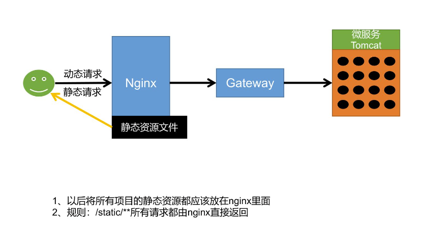
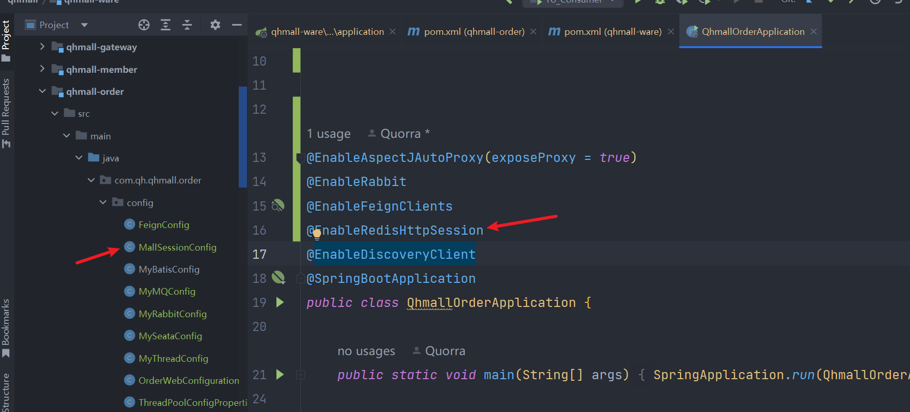

# 小记

### 1.优化三级分类避免递归造成耗时操作

原代码

```java
List<CategoryEntity> res = entities.stream()
    // 过滤找出一级分类
    .filter(categoryEntity -> categoryEntity.getParentCid() == 0)
    // 处理，给一级菜单递归设置子菜单
    .peek(menu -> menu.setChildren(getChildless(menu, entities)))
    // 按sort属性排序
    .sorted(Comparator.comparingInt(menu -> (menu.getSort() == null ? 0 : menu.getSort())))
    .collect(Collectors.toList());

return res;
}
```

新代码

```java
public List<CategoryEntity> listWithLambda() {

List<CategoryEntity> entities = new ArrayList<>(baseMapper.selectList(Wrappers.<CategoryEntity>lambdaQuery().orderByDesc(CategoryEntity::getCatId)));
Map<Long, List<CategoryEntity>> longListNavigableMap = entities.stream().collect(Collectors.groupingBy(CategoryEntity::getParentCid));

List<CategoryEntity> res = entities.stream().peek(entity -> {
    if (longListNavigableMap.containsKey(entity.getCatId())) {
        entity.setChildren(longListNavigableMap.get(entity.getCatId()));
    }
}).filter(entity -> entity.getCatLevel() == 1).sorted(Comparator.comparingInt(menu -> (menu.getSort() == null ? 0 : menu.getSort()))).collect(Collectors.toList());

return res;

}
```


2.nacos2坑点

启动naocs前，使用mysql可视化工具预热（连接/刷新）一下mysql(问就是新版mysql有bug导致nacos无法启动)

### 3.编程之道

此类业务逻辑需要反复仔细斟酌，直至可以自己遇到业务需求分析出逻辑并写出对应代码且完美通过测试

```java
/**
 * 获取分组下没有关联的属性
 *
 * @param params      参数个数
 * @param attrgroupId attrgroup id
 * @return {@link PageUtils}
 */
@Override
public PageUtils getNoRelationAttr(Map<String, Object> params, Long attrgroupId) {
    //1当前分组只能关联自己所属的分类里面的所有属性
    AttrGroupEntity attrGroupEntity = attrGroupDao.selectById(attrgroupId);
    Long catelogId = attrGroupEntity.getCatelogId();
    //2当前分组只能关联别的分组没有引用的属性
    //2.1当前分类下的其他分组
    List<AttrGroupEntity> group =
            attrGroupDao.selectList(new QueryWrapper<AttrGroupEntity>()
                    .eq("catelog_id", catelogId));
    List<Long> collect =
            group.stream()
                    .map(AttrGroupEntity::getAttrGroupId)
                    .collect(Collectors.toList());
    //2.2这些分组关联的属性
    List<AttrAttrgroupRelationEntity> groupId =
            relationDao.selectList(new QueryWrapper<AttrAttrgroupRelationEntity>()
                    .in("attr_group_id", collect));
    List<Long> attrIds =
            groupId.stream()
                    .map(AttrAttrgroupRelationEntity::getAttrId)
                    .collect(Collectors.toList());
    //2.3从当前分类的所有属性中移除这些属性；
    QueryWrapper<AttrEntity> wrapper =
            new QueryWrapper<AttrEntity>()
                    .eq("catelog_id", catelogId)
                    .eq("attr_type", ProductConstant.AttrEnum.ATTR_TYPE_BASE.getCode());
    if (attrIds != null && attrIds.size() > 0) {
        wrapper.notIn("attr_id", attrIds);
    }
    String key = (String) params.get("key");
    if (!StringUtils.isEmpty(key)) {
        wrapper.and((w) -> {
            w.eq("attr_id", key).or().like("attr_name", key);
        });
    }
    IPage<AttrEntity> page = this.page(new Query<AttrEntity>().getPage(params), wrapper);
    PageUtils pageUtils = new PageUtils(page);
    return pageUtils;
}
```

### 4.业务分层

```
1、Controller：处理请求，接受和校验数据*

2、Service接受controller传来的数据，进行业务处理*

3、Controller接受Service处理完的数据，封装页面指定的vo*
```

### 5.此业务值得三刷起步

```
/**
 * 新增SPU
 *
 * @param vo 签证官
 */
@Transactional(rollbackFor = Exception.class)
@Override
public void saveSpuInfo(SpuSaveVo vo)
```

### 6.idea快捷键

写完controller层接口后，alter+enter生成接口，之后在接口方法名上继续alter+enter实现方法

### 7.idea批量启动服务

idea中Edit Configurations–>Compound可实现批量启动服务

查询类名：Ctrl+N

全局搜索：Ctrl+Shift+F

当前文件替换：Ctrl+R

全局替换：Ctrl+Shift+R（可使用正则/首选文件后缀

查看实现关系:Ctrl+H

整个项目搜索：双击Shift

搜索最近:Ctrl+E

选中想被try/catch包围的语句，同时按下ctrl+alt+t， 出现下图 ，选择你需要的即可；

### 8.windows下清除端口占用

一、netstat -ano
用来查看端口占用情况
      二、查看指定端口的进程id
C:>netstat -aon|findstr “”


三、结束该进程
C:>taskkill /f /t /im 4

### 9.手动将jar包导入maven库

```
<dependency>
    <groupId>org.elasticsearch</groupId>
    <artifactId>elasticsearch</artifactId>
    <version>${elasticsearch.version}</version>
</dependency>
```

进入maven bin目录执行命令

==mvn install:install-file "-Dfile=D:\00_Download\edge_download\elasticsearch-7.4.2.jar" "-DgroupId=org.elasticsearch" "-DartifactId=elasticsearch" "-Dversion=7.4.2" "-Dpackaging=jar"==

### 10 idea连接Linux及Docker

连接Linux

1.

2.

3.

连接Docker

```
先开放主机与虚拟机的2375端口

firewall-cmd --zone=public --add-port=3306/tcp --permanent

1、编辑docker配置文件

vi /usr/lib/systemd/system/docker.service
2、 ExecStart改成下面的

ExecStart=/usr/bin/dockerd -H tcp://0.0.0.0:2375 -H unix://var/run/docker.sock -H fd://  --containerd=/run/containerd/containerd.sock
3、重启docker

systemctl daemon-reload
systemctl restart docker
```

2.TCP连接


### 11StarUML生成模板


### 12

apifox代替postman

### 13二刷商城项目时，为方便起见新建模块统一为mall-*

如mall-product,大小业务，无论难易，后端皆手撕，即看文档/笔记分析出业务逻辑，

先在代码中自己总结写业务注释，之后参考注释撸代码

### 14在做所有事情之前，一定要判断是否为空（避免空指针异常）


### 15做完整个业务中的某项业务时进行单元测试

Dao层接口方法的参数中无论传入一个还是多个参数都尽量加@Param注解，防止传入的参数与数据库中的不一致


单元测试

### 语录

人不能总是做小菜一碟的事

L&P<=>Lucky and Powerful

类似项目起名：吉力外卖、吉力点评、吉力商城

### 习惯

typora类笔记软件，使用相对路径，防止换了位置找不到图片


并根据需求调整偏好设置


将常用如顿悟或值得二刷及以上的项目文档固定


### typora中快速回到开头/结尾内容

ctrl+home/end

### 看技术/原理视频根据不同语速及难度选择

1. 1.5倍速/2倍速
2. 养成好习惯：大部分的业务在看完大体流程后，初期写好注释自己写（而不是照着敲/跟着敲/CV）

以新增SPU的业务为例

先写注释梳理出业务流程（后期真正熟悉了CRUD，再逐渐不写注释：在脑子中构思）

```java
    //1、保存spu基本信息 pms_spu_inf

    //2、保存Spu的描述图片 pms_spu_info_desc

    //3、保存spu的图片集 pms_spu_images
    //4、保存spu的规格参数;pms_product_attr_value

    //5、保存spu的积分信息；gulimall_sms->sms_spu_bounds

    //5、保存当前spu对应的所有sku信息；
       //5.1）、sku的基本信息；pms_sku_info
       //5.2）、sku的图片信息；pms_sku_image
       //TODO 没有图片路径的无需保存
       //5.3）、sku的销售属性信息：pms_sku_sale_attr_value
       //5.4）、sku的优惠、满减等信息；gulimall_sms->sms_sku_ladder\sms_sku_full_reduction\sms_member_price
```

然后再逐一实现每个子流程的功能（若时间充裕再断点debug确认前后端参数是否一致）

==“无他，惟手熟尔”==

```java
public void saveSpuInfo(SpuSaveVo *vo*) {
```


```java
*//1、保存spu基本信息 pms_spu_info*

SpuInfoEntity infoEntity = new SpuInfoEntity();

BeanUtils.copyProperties(vo, infoEntity);

infoEntity.setCreateTime(new Date());

infoEntity.setUpdateTime(new Date());

this.saveBaseSpuInfo(infoEntity);
```


```java
*//2、保存Spu的描述图片 pms_spu_info_desc*

List<String> decript = vo.getDecript();

SpuInfoDescEntity descEntity = new SpuInfoDescEntity();

descEntity.setSpuId(infoEntity.getId());

descEntity.setDecript(String.join(",", decript));

spuInfoDescService.saveSpuInfoDesc(descEntity);
```


```java
*//3、保存spu的图片集 pms_spu_images*

List<String> images = vo.getImages();

imagesService.saveImages(infoEntity.getId(), images);
```


```java
*//4、保存spu的规格参数;pms_product_attr_value*

List<BaseAttrs> baseAttrs = vo.getBaseAttrs();

List<ProductAttrValueEntity> collect = baseAttrs.stream().map(attr -> {

  ProductAttrValueEntity valueEntity = new ProductAttrValueEntity();

  valueEntity.setAttrId(attr.getAttrId());

  AttrEntity id = attrService.getById(attr.getAttrId());

  valueEntity.setAttrName(id.getAttrName());

  valueEntity.setAttrValue(attr.getAttrValues());

  valueEntity.setQuickShow(attr.getShowDesc());

  valueEntity.setSpuId(infoEntity.getId());
      return valueEntity;

}).collect(Collectors.toList());

attrValueService.saveProductAttr(collect);
```


```java
*//5、保存spu的积分信息；gulimall_sms->sms_spu_bounds*

Bounds bounds = vo.getBounds();

SpuBoundTo spuBoundTo = new SpuBoundTo();

BeanUtils.copyProperties(bounds, spuBoundTo);

spuBoundTo.setSpuId(infoEntity.getId());

R r = couponFeignService.saveSpuBounds(spuBoundTo);

if (r.getCode() != 0) {

  log.error("远程保存spu积分信息失败");

}
```


```java
*//5、保存当前spu对应的所有sku信息；*

List<Skus> skus = vo.getSkus();

if (skus != null && skus.size() > 0) {

  skus.forEach(item -> {

    String defaultImg = "";

    for (Images image : item.getImages()) {

      if (image.getDefaultImg() == 1) {

        defaultImg = image.getImgUrl();

      }

    }

    *//   private String skuName;*

    *//   private BigDecimal price;*

    *//   private String skuTitle;*

    *//   private String skuSubtitle;*

    SkuInfoEntity skuInfoEntity = new SkuInfoEntity();

    BeanUtils.copyProperties(item, skuInfoEntity);

    skuInfoEntity.setBrandId(infoEntity.getBrandId());

    skuInfoEntity.setCatalogId(infoEntity.getCatalogId());

    skuInfoEntity.setSaleCount(0L);

    skuInfoEntity.setSpuId(infoEntity.getId());

    skuInfoEntity.setSkuDefaultImg(defaultImg);

    
```


```java
    *//5.1）、sku的基本信息；pms_sku_info*
skuInfoService.saveSkuInfo(skuInfoEntity);
    Long skuId = skuInfoEntity.getSkuId();
    List<SkuImagesEntity> imagesEntities = item.getImages().stream().map(img -> {

      SkuImagesEntity skuImagesEntity = new SkuImagesEntity();

      skuImagesEntity.setSkuId(skuId);

      skuImagesEntity.setImgUrl(img.getImgUrl());

      skuImagesEntity.setDefaultImg(img.getDefaultImg());

      return skuImagesEntity;

    }).filter(entity -> {

      *//返回true就是需要，false就是剔除*

      return !StringUtils.isEmpty(entity.getImgUrl());

    }).collect(Collectors.toList());

    *//5.2）、sku的图片信息；pms_sku_image*

    skuImagesService.saveBatch(imagesEntities);

    *//TODO 没有图片路径的无需保存*
    
        List<Attr> attr = item.getAttr();

    List<SkuSaleAttrValueEntity> skuSaleAttrValueEntities = attr.stream().map(a -> {

      SkuSaleAttrValueEntity attrValueEntity = new SkuSaleAttrValueEntity();

      BeanUtils.copyProperties(a, attrValueEntity);

      attrValueEntity.setSkuId(skuId);
      
            return attrValueEntity;

    }).collect(Collectors.toList());

    *//5.3）、sku的销售属性信息：pms_sku_sale_attr_value*

    skuSaleAttrValueService.saveBatch(skuSaleAttrValueEntities);
    
        *// //5.4）、sku的优惠、满减等信息；gulimall_sms->sms_sku_ladder\sms_sku_full_reduction\sms_member_price*

    SkuReductionTo skuReductionTo = new SkuReductionTo();

    BeanUtils.copyProperties(item, skuReductionTo);

    skuReductionTo.setSkuId(skuId);

    if (skuReductionTo.getFullCount() > 0 || skuReductionTo.getFullPrice().compareTo(new BigDecimal("0")) == 1) {

      R r1 = couponFeignService.saveSkuReduction(skuReductionTo);

      if (r1.getCode() != 0) {

        log.error("远程保存sku优惠信息失败");

      }

    }

  });

}
 }
```


### 由R中的getCode方法产生为什么使用包装类的问题，int与Integer


1、Integer是int提供的封装类，而int是Java的基本数据类型

2、Integer默认值是null，而int默认值是0；

3、声明为Integer的变量需要实例化，而声明为int的变量不需要实例化；

4、Integer是对象，用一个引用指向这个对象，而int是基本类型，直接存储数值。


`int`是基本数据类型，`Integer`是包装类，类似HashMap这样的结构必须使用包装类，

因为包装[类继承](https://so.csdn.net/so/search?q=类继承&spm=1001.2101.3001.7020)自Object,都需要实现HashCode，所以可以使用在HashMap这类数据结构中。


int是基本数据类型，基本数据类型在内存中存放的位置是栈。


Integer是对象的引用，对象存放在堆中。

这就引出了堆与栈的对比

栈：

1）栈的存取速度比堆快，仅次于直接位于CPU的寄存器。

2）栈中的数据的大小和生存周期是确定的。

3）栈中的数据可以共享。

堆：

1）堆可以动态的分配内存大小，生存期也不必告诉编译器。

2）堆在运行时动态分配内存，存取速度慢。

综上所述，可以简单的理解为，为了高效，可以把一些数值小，简单的变量存放在栈中。
那么明明是在栈中更快为什么有时候还是要使用Integer呢？

因为：

1、在对象中可以定义更多的功能方法操作该数据。例如：基本数据类型和字符串直接的转换。

2、编码过程中只接收对象的情况，例如List中只存入对象，不能存入基本数据类型；泛型不支持基本数据类型。


1，因为Integer可以区分出未赋值和值为0的区别，int则无法表达出未赋值的情况，在开发中，Integer的默认为null，所以用el表达式在文本框中显示时，值为空白字符串，而int默认的默认值为0，所以用el表达式在文本框中显示时，结果为0，所以，int不适合作为web层的表单数据的类型。

2，在Hibernate中，如果将OID定义为Integer类型，那么Hibernate就可以根据其值是否为null而判断一个对象是否是临时的，如果将OID定义为了int类型，还需要在hbm映射文件中设置其unsaved-value属性为0。

3，Integer提供了多个与整数相关的操作方法，例如，将一个字符串转换成整数，Integer中还定义了表示整数的最大值和最小值的常量。

### 顿悟 

学习任何东西的时候，无非大体上分为两个步骤，首先学会如何去使用，待使用熟练后再去研究底层（细枝末节的东西）

面对复杂庞大的业务，尽量以繁化简，将总模块拆分成子模块，逐一去完成

### 项目技术介绍1.0

#  一、项目介绍

谷粒商城项目是尚硅谷研究院推出完整大型分布式架构电商平台，技术全面、业务深入，全网无出其右。技术涵盖：微服务架构+分布式+全栈+集群+部署+自动化运维+可视化CICD，对标阿里P6/P7，冲击40-60w。

项目由业务集群系统+后台管理系统构成，打通了分布式开发及全栈开发技能，包含前后分离全栈开发、Restful接口、数据校验、网关、注册发现、配置中心、熔断、限流、降级、链路追踪、性能监控、压力测试、系统预警、集群部署、持续集成、持续部署…

# 二、微服务架构




前台


后台


#  三、项目部署

### 解决listary与idea快捷键冲突


### @Transactional

@Transactional只能回滚RuntimeException和RuntimeException下面的子类抛出的异常 不能回滚Exception异常
如果需要支持回滚Exception异常请用@Transactional(rollbackFor = Exception.class)
这里如果是增删改的时候我建议大家都使用@Transactional(rollbackFor = Exception.class)
补充一下@Transactional(rollbackFor = Exception.class)一些失效的场景

1、不是用public修饰

2、try catch捕获了异常(没有在catch里面手动抛出异常)

3、没有加@Service(也就是没有被 Spring 管理)

### 省略注解中的路径

```
@MapperScan("com.qh.qhmall.product.dao")
```

```
@EnableFeignClients(com.qh.qhmall.order.fegin"")
```

都可直接使用@MapperScan、@EnableFeignClients代替

### 面试建议

恭喜尚硅谷破百万关注，历时半年艰难学完一把辛酸泪（因为平时有工作），给点建议给想学和正在学的小伙伴
1、如有条件电脑内存至少16G起步，条件进一步加个屏幕，条件更进一步租一台至少4G内存的X86架构云服务器，所有部署的东西全扔云服务器上
2、P16，P17没法搭起来的建议照着rerenfast的github上的教程搭
3、项目搭起来后，每学完一章一定要用git提交一次，不然后续排错会令人崩溃
4、多记笔记，尤其是分布式，架构，锁相关的知识，有利于面试
5、IDEA的jrebel插件和ResetfulTool插件至少能提高一半的学习效率，必用
6、这章实在找不到解决办法看下弹幕，其余情况一律关闭
7、Maven依赖版本号一定要一模一样（除非你知道高版本怎么配置）
8、当前章节没达到老师的效果不要继续往下做，这个项目是线性的，你卡在这个环节后面基本也很难做下去，直到P325
9、单纯想学后端东西的，前端代码照抄，P28-P44跳过
10、ES的内存分配不要128MB，要256MB起步，商品上架的测试数据建议和老师的一模一样（除了图片），不然不好对照
11、nginx可以不用部署在服务器上，有windows版可以本地运行，跳过穿透
12、单点登录有条件直接用github的，不要用微博的，提高效率，可以用api.github.com/user这个接口
13、支付宝沙箱每周日12:00至每周一12:00维护不可用
14、个人认为新增商品，商品上架，保存订单数据，支付这四个功能为该项目最折磨人功能，一P能卡一两天
15、P100之前的内容属于当前JAVA后端能找到工作的最基本水平
16、调试环节是必要的，一定要跟着学，不会调试通过试用期堪忧
17、实际大多数公司的项目技术难点和涵盖范围不如这个项目（所以好多人边上班边学啊）

18、mysql务必开启表名忽略大小写，如果是mysql8一开始部署的时候就要开启，docker一键部署命令


19、OpenFeign超时时间建议配置文件里加上，防止远程调用报超时错误
feign.client.config.default.connect-timeout=30000
feign.client.config.default.read-timeout=30000

20.简历中不可直接写项目，而是拆分，把知识点穿插写到你的其他项目里就行了，比如你写一个后台系统，防止表单重复提交你用到了鼓粒商城提交订单的幂等性设计，注册登录用到了QQ或者微信的单点登录，如果有定时任务就参考秒杀系统的定时任务设计

### 注解规范



中间件的开启注解可以写到配置类中，但为了方便管理，建议都写在主启动类（Application上）

（个人是为了当配置类多了，不想频繁打开各个类）

### idea列表搜索/聚焦

没有快捷键，直接输入关键字即可，IDEA 很多列表都有这功能

如搜索maven 点击目录 输入名字搜索本地maven库


其他列表同理


### 拓展外界屏幕

win+p

### 快速清理vue项目中的node_module

node_modules 文件夹中包含了大量 node 需要的依赖包，如果直接删除的话，非常耗时。

我们可以通过以下方式快速删除node_modules:

安装 rimraf

rimraf包的作用：以包的形式包装rm -rf命令，用来删除文件和文件夹的，不管文件夹是否为空，都可以删除。

执行

npm i rimraf -g

命令来全局安装 rimraf

进入需要清理的项目中，执行

rimraf node_modules

命令即可将node_modules文件删除干净

最后通过 npm install（简写：npm i）或者 yarn 来重新下载所有相关依赖包，之后会自动生成node_modules文件夹

### 确定前后端地址API是否一致


按住ctrl 鼠标左键点击前端路径，即可自动匹配

### github定义主页展示

