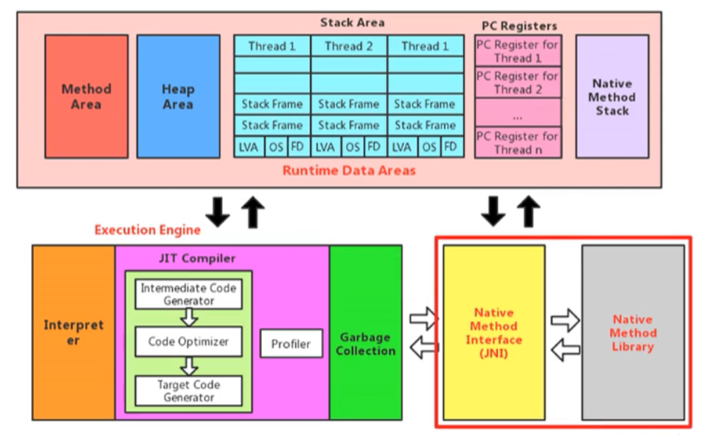

> 笔记来源：[尚硅谷 JVM 全套教程，百万播放，全网巅峰（宋红康详解 java 虚拟机）](https://www.bilibili.com/video/BV1PJ411n7xZ "尚硅谷JVM全套教程，百万播放，全网巅峰（宋红康详解java虚拟机）")
>
> 同步更新：https://gitee.com/vectorx/NOTE_JVM
>
> https://codechina.csdn.net/qq_35925558/NOTE_JVM
>
> https://github.com/uxiahnan/NOTE_JVM

[toc]

# 5. 本地方法接口和本地方法栈

## 5.1. 什么是本地方法？

简单地讲，<mark>一个 Native Method 是一个 Java 调用非 Java 代码的接囗</mark>。一个 Native Method 是这样一个 Java 方法：该方法的实现由非 Java 语言实现，比如 C。这个特征并非 Java 所特有，很多其它的编程语言都有这一机制，比如在 C++中，你可以用 extern "c" 告知 c++编译器去调用一个 c 的函数。

> A native method is a Java method whose implementation is provided by non-java code.

在定义一个 native method 时，并不提供实现体（有些像定义一个 Java interface），因为其实现体是由非 java 语言在外面实现的。

本地接口的作用是融合不同的编程语言为 Java 所用，它的初衷是融合 C/C++程序。



举例

```java
public class IHaveNatives{
    public native void methodNative1(int x);
    public native static long methodNative2();
    private native synchronized float methodNative3(Object o);
    native void methodNative4(int[] ary) throws Exception;
}
```

标识符 native 可以与其它 java 标识符连用，但是 abstract 除外

## 5.2. 为什么使用 Native Method？

Java 使用起来非常方便，然而有些层次的任务用 Java 实现起来不容易，或者我们对程序的效率很在意时，问题就来了。

**与 Java 环境的交互**

<mark>有时 Java 应用需要与 Java 外面的环境交互，这是本地方法存在的主要原因。</mark>你可以想想 Java 需要与一些底层系统，如操作系统或某些硬件交换信息时的情况。本地方法正是这样一种交流机制：它为我们提供了一个非常简洁的接口，而且我们无需去了解 Java 应用之外的繁琐的细节。

**与操作系统的交互**

JVM 支持着 Java 语言本身和运行时库，它是 Java 程序赖以生存的平台，它由一个解释器（解释字节码）和一些连接到本地代码的库组成。然而不管怎样，它毕竟不是一个完整的系统，它经常依赖于一底层系统的支持。这些底层系统常常是强大的操作系统。<mark>通过使用本地方法，我们得以用 Java 实现了 jre 的与底层系统的交互，甚至 JVM 的一些部分就是用 c 写的。</mark>还有，如果我们要使用一些 Java 语言本身没有提供封装的操作系统的特性时，我们也需要使用本地方法。

**Sun's Java**

<mark>Sun 的解释器是用 C 实现的，这使得它能像一些普通的 C 一样与外部交互。</mark>jre 大部分是用 Java 实现的，它也通过一些本地方法与外界交互。例如：类 java.lang.Thread 的 setPriority()方法是用 Java 实现的，但是它实现调用的是该类里的本地方法 setPriority()。这个本地方法是用 C 实现的，并被植入 JVM 内部，在 Windows 95 的平台上，这个本地方法最终将调用 Win32 setPriority() ApI。这是一个本地方法的具体实现由 JVM 直接提供，更多的情况是本地方法由外部的动态链接库（external dynamic link library）提供，然后被 JVw 调用。

**现状**

<mark>目前该方法使用的越来越少了，除非是与硬件有关的应用</mark>，比如通过 Java 程序驱动打印机或者 Java 系统管理生产设备，在企业级应用中已经比较少见。因为现在的异构领域间的通信很发达，比如可以使用 Socket 通信，也可以使用 Web Service 等等，不多做介绍。

## 5.2. 本地方法栈

<mark>Java 虚拟机栈于管理 Java 方法的调用，而本地方法栈用于管理本地方法的调用。</mark>

本地方法栈，也是线程私有的。

允许被实现成固定或者是可动态扩展的内存大小。（在内存溢出方面是相同的）

- 如果线程请求分配的栈容量超过本地方法栈允许的最大容量，Java 虚拟机将会抛出一个 StackOverflowError 异常。
- 如果本地方法栈可以动态扩展，并且在尝试扩展的时候无法申请到足够的内存，或者在创建新的线程时没有足够的内存去创建对应的本地方法栈，那么 Java 虚拟机将会抛出一个 OutOfMemoryError 异常。

本地方法是使用 C 语言实现的。

它的具体做法是 Native Method Stack 中登记 native 方法，在 Execution Engine 执行时加载本地方法库。


<mark>当某个线程调用一个本地方法时，它就进入了一个全新的并且不再受虚拟机限制的世界。它和虚拟机拥有同样的权限。</mark>

- 本地方法可以通过本地方法接口来<mark>访问虚拟机内部的运行时数据区</mark>。
- 它甚至可以直接使用本地处理器中的寄存器
- 直接从本地内存的堆中分配任意数量的内存。

<mark>并不是所有的 JVM 都支持本地方法。因为 Java 虚拟机规范并没有明确要求本地方法栈的使用语言、具体实现方式、数据结构等。</mark>如果 JVM 产品不打算支持 native 方法，也可以无需实现本地方法栈。

在 Hotspot JVM 中，直接将本地方法栈和虚拟机栈合二为一。
